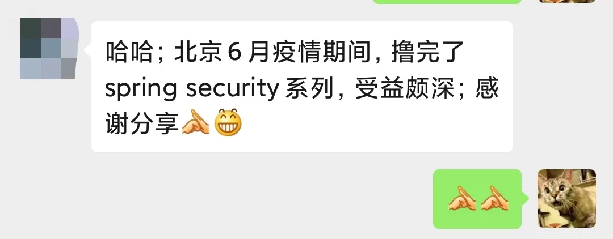
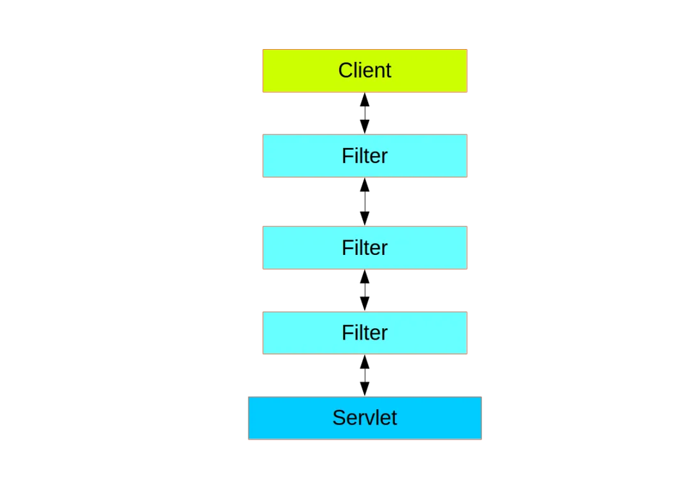
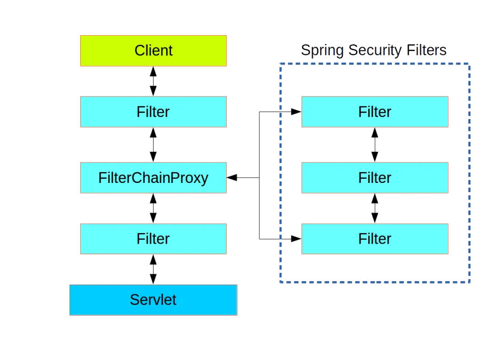

# 深入理解 FilterChainProxy【源码篇】

Original 江南一点雨 [江南一点雨](javascript:void(0);) *2020年07月20日 08:08*

松哥原创的 Spring Boot 视频教程已经杀青，感兴趣的小伙伴戳这里-->[Spring Boot+Vue+微人事视频教程](https://mp.weixin.qq.com/s?__biz=MzI1NDY0MTkzNQ==&mid=2247488799&idx=1&sn=cdfd5315ff18c979b6f5d390ab4d9059&scene=21#wechat_redirect)

昨天有小伙伴加松哥微信，说他把松哥的 Spring Security 系列撸完了。。



but 松哥这个系列还没发完呢，在我的计划中，Spring Security 系列目前应该能更新一半，还剩一半，虽然有的小伙伴可能觉得好像已经没啥了，其实还有很多东西。。。

松哥最近也是特别忙，Security 更新慢下来了，但是秉持前面说的，要学就成系列的学，要学就学透彻，这个系列我还会继续更下去。

今天我们就来聊一聊 Spring Security 系列中的 FilterChainProxy。

这是一个非常重要的代理对象。

## 1. FilterChainProxy

我们先来回顾一下前面文章讲的：

在一个 Web 项目中，请求流程大概如下图所示：



请求从客户端发起（例如浏览器），然后穿过层层 Filter，最终来到 Servlet 上，被 Servlet 所处理。

上图中的 Filter 我们可以称之为 Web Filter，Spring Security 中的 Filter 我们可以称之为 Security Filter，它们之间的关系如下图：



可以看到，Spring Security Filter 并不是直接嵌入到 Web Filter 中的，而是通过 FilterChainProxy 来统一管理 Spring Security Filter，FilterChainProxy 本身则通过 Spring 提供的 DelegatingFilterProxy 代理过滤器嵌入到 Web Filter 之中。

> ❝
>
> DelegatingFilterProxy 很多小伙伴应该比较熟悉，在 Spring 中手工整合 Spring Session、Shiro 等工具时都离不开它，现在用了 Spring Boot，很多事情 Spring Boot 帮我们做了，所以有时候会感觉 DelegatingFilterProxy 的存在感有所降低，实际上它一直都在。

FilterChainProxy 中可以存在多个过滤器链，如下图：


可以看到，当请求到达 FilterChainProxy 之后，FilterChainProxy 会根据请求的路径，将请求转发到不同的 Spring Security Filters 上面去，不同的 Spring Security Filters 对应了不同的过滤器，也就是不同的请求将经过不同的过滤器。

这是 FilterChainProxy 的一个大致功能，今天我们就从源码上理解 FilterChainProxy 中这些功能到底是怎么实现的。

## 2. 源码分析

先把 FilterChainProxy 源码亮出来，这个源码比较上，我们一部分一部分来，先从它声明的全局属性上开始：

```
private final static String FILTER_APPLIED = FilterChainProxy.class.getName().concat(
  ".APPLIED");
private List<SecurityFilterChain> filterChains;
private FilterChainValidator filterChainValidator = new NullFilterChainValidator();
private HttpFirewall firewall = new StrictHttpFirewall();
```

- FILTER_APPLIED 变量是一个标记，用来标记过滤器是否已经执行过了。这个标记在 Spring Security 中很常见，松哥这里就不多说了。
- filterChains 是过滤器链，注意，这个是过滤器链，而不是一个个的过滤器，在【[Spring Security 竟然可以同时存在多个过滤器链？](https://mp.weixin.qq.com/s?__biz=MzI1NDY0MTkzNQ==&mid=2247489302&idx=2&sn=032f8ccc6a9955799702d6c2766ca6eb&scene=21#wechat_redirect)】一文中，松哥教过大家如何配置多个过滤器链，配置的多个过滤器链就保存在 filterChains 变量中，也就是，如果你有一个过滤器链，这个集合中就保存一条记录，你有两个过滤器链，这个记录中就保存两条记录，每一条记录又对应了过滤器链中的一个个过滤器。
- filterChainValidator 是 FilterChainProxy 配置完成后的校验方法，默认使用的 NullFilterChainValidator 实际上对应了一个空方法，也就是不做任何校验。
- firewall 我们在前面的文章中也介绍过([Spring Security 自带防火墙！你都不知道自己的系统有多安全！](https://mp.weixin.qq.com/s?__biz=MzI1NDY0MTkzNQ==&mid=2247488496&idx=1&sn=3a153a207f112786a4ef1668f9d2a600&scene=21#wechat_redirect))，这里就不再赘述。

接下来我们来看一个过滤器中最重要的 doFilter 方法：

```
@Override
public void doFilter(ServletRequest request, ServletResponse response,
  FilterChain chain) throws IOException, ServletException {
 boolean clearContext = request.getAttribute(FILTER_APPLIED) == null;
 if (clearContext) {
  try {
   request.setAttribute(FILTER_APPLIED, Boolean.TRUE);
   doFilterInternal(request, response, chain);
  }
  finally {
   SecurityContextHolder.clearContext();
   request.removeAttribute(FILTER_APPLIED);
  }
 }
 else {
  doFilterInternal(request, response, chain);
 }
}
```

在 doFilter 方法中，正常来说，clearContext 参数每次都是 true，于是每次都先给 request 标记上 FILTER_APPLIED 属性，然后执行 doFilterInternal 方法去走过滤器，执行完毕后，最后在 finally 代码块中清除 SecurityContextHolder 中保存的用户信息，同时移除 request 中的标记。

按着这个顺序，我们来看 doFilterInternal 方法：

```
private void doFilterInternal(ServletRequest request, ServletResponse response,
  FilterChain chain) throws IOException, ServletException {
 FirewalledRequest fwRequest = firewall
   .getFirewalledRequest((HttpServletRequest) request);
 HttpServletResponse fwResponse = firewall
   .getFirewalledResponse((HttpServletResponse) response);
 List<Filter> filters = getFilters(fwRequest);
 if (filters == null || filters.size() == 0) {
  if (logger.isDebugEnabled()) {
   logger.debug(UrlUtils.buildRequestUrl(fwRequest)
     + (filters == null ? " has no matching filters"
       : " has an empty filter list"));
  }
  fwRequest.reset();
  chain.doFilter(fwRequest, fwResponse);
  return;
 }
 VirtualFilterChain vfc = new VirtualFilterChain(fwRequest, chain, filters);
 vfc.doFilter(fwRequest, fwResponse);
}
private List<Filter> getFilters(HttpServletRequest request) {
 for (SecurityFilterChain chain : filterChains) {
  if (chain.matches(request)) {
   return chain.getFilters();
  }
 }
 return null;
}
```

doFilterInternal 方法就比较重要了：

1. 首先将请求封装为一个 FirewalledRequest 对象，在这个封装的过程中，也会判断请求是否合法。具体参考松哥之前的 [Spring Security 自带防火墙！你都不知道自己的系统有多安全！](https://mp.weixin.qq.com/s?__biz=MzI1NDY0MTkzNQ==&mid=2247488496&idx=1&sn=3a153a207f112786a4ef1668f9d2a600&scene=21#wechat_redirect) 一文。
2. 对响应进行封装。
3. 调用 getFilters 方法找到过滤器链。该方法就是根据当前的请求，从 filterChains 中找到对应的过滤器链，然后由该过滤器链去处理请求，具体可以参考 [Spring Security 竟然可以同时存在多个过滤器链？](https://mp.weixin.qq.com/s?__biz=MzI1NDY0MTkzNQ==&mid=2247489302&idx=2&sn=032f8ccc6a9955799702d6c2766ca6eb&scene=21#wechat_redirect) 一文。
4. 如果找出来的 filters 为 null，或者集合中没有元素，那就是说明当前请求不需要经过过滤器。直接执行 chain.doFilter ，这个就又回到原生过滤器中去了。那么什么时候会发生这种情况呢？那就是针对项目中的静态资源，如果我们配置了资源放行，如 `web.ignoring().antMatchers("/hello");`，那么当你请求 /hello 接口时就会走到这里来，也就是说这个不经过 Spring Security Filter。这个松哥之前也专门写文章介绍过：[Spring Security 两种资源放行策略，千万别用错了！](https://mp.weixin.qq.com/s?__biz=MzI1NDY0MTkzNQ==&mid=2247488812&idx=1&sn=4db81eb24508743076d93207046d1572&scene=21#wechat_redirect)。
5. 如果查询到的 filters 中是有值的，那么这个 filters 集合中存放的就是我们要经过的过滤器链了。此时它会构造出一个虚拟的过滤器链 VirtualFilterChain 出来，并执行其中的 doFilter 方法。

那么接下来我们就来看看 VirtualFilterChain：

```
private static class VirtualFilterChain implements FilterChain {
 private final FilterChain originalChain;
 private final List<Filter> additionalFilters;
 private final FirewalledRequest firewalledRequest;
 private final int size;
 private int currentPosition = 0;
 private VirtualFilterChain(FirewalledRequest firewalledRequest,
   FilterChain chain, List<Filter> additionalFilters) {
  this.originalChain = chain;
  this.additionalFilters = additionalFilters;
  this.size = additionalFilters.size();
  this.firewalledRequest = firewalledRequest;
 }
 @Override
 public void doFilter(ServletRequest request, ServletResponse response)
   throws IOException, ServletException {
  if (currentPosition == size) {
   if (logger.isDebugEnabled()) {
    logger.debug(UrlUtils.buildRequestUrl(firewalledRequest)
      + " reached end of additional filter chain; proceeding with original chain");
   }
   // Deactivate path stripping as we exit the security filter chain
   this.firewalledRequest.reset();
   originalChain.doFilter(request, response);
  }
  else {
   currentPosition++;
   Filter nextFilter = additionalFilters.get(currentPosition - 1);
   if (logger.isDebugEnabled()) {
    logger.debug(UrlUtils.buildRequestUrl(firewalledRequest)
      + " at position " + currentPosition + " of " + size
      + " in additional filter chain; firing Filter: '"
      + nextFilter.getClass().getSimpleName() + "'");
   }
   nextFilter.doFilter(request, response, this);
  }
 }
}
```

1. VirtualFilterChain 类中首先声明了 5 个全局属性，originalChain 表示原生的过滤器链，也就是 Web Filter；additionalFilters 表示 Spring Security 中的过滤器链；firewalledRequest 表示当前请求；size 表示过滤器链中过滤器的个数；currentPosition 则是过滤器链遍历时候的下标。
2. doFilter 方法就是 Spring Security 中过滤器挨个执行的过程，如果 `currentPosition == size`，表示过滤器链已经执行完毕，此时通过调用 originalChain.doFilter 进入到原生过滤链方法中，同时也退出了 Spring Security 过滤器链。否则就从 additionalFilters 取出 Spring Security 过滤器链中的一个个过滤器，挨个调用 doFilter 方法。

最后，FilterChainProxy 中还定义了 FilterChainValidator 接口及其实现：

```
public interface FilterChainValidator {
 void validate(FilterChainProxy filterChainProxy);
}
private static class NullFilterChainValidator implements FilterChainValidator {
 @Override
 public void validate(FilterChainProxy filterChainProxy) {
 }
}
```

实际上这个实现并未做任何事情。

这就是 FilterChainProxy 中的整个逻辑。

## 3. 小结

其实本文中的很多知识点松哥在之前的文章中都和大家介绍过，例如配置多个过滤器链、StrictHttpFireWall、两种资源放行方式等等，但是之前主要是和大家分享用法，没有去细究他的原理，今天的文章，我们通过源码把这个问题捋了一遍，相信大家对于这些功能细节也更清晰了。

**好啦，感兴趣的小伙伴记得点个在看鼓励下松哥哦～**

今日干货


刚刚发表

查看:13500回复:135

公众号后台回复 SpringBoot，免费获取 274 页SpringBoot修炼手册。

SpringSecurity系列52

SpringSecurity系列 · 目录


上一篇Spring Security 可以同时对接多个用户表？下一篇深入理解 HttpSecurity【源码篇】


# 


Scan to Follow