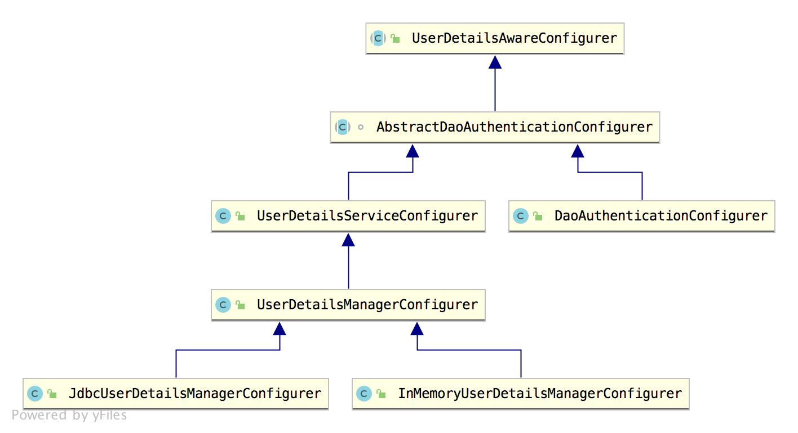
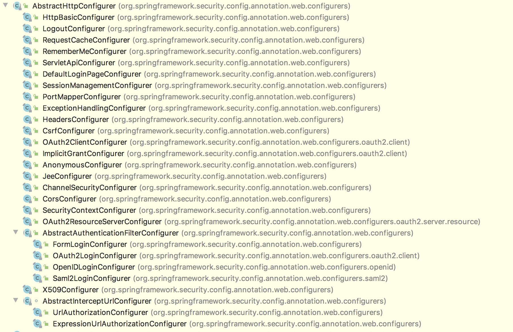
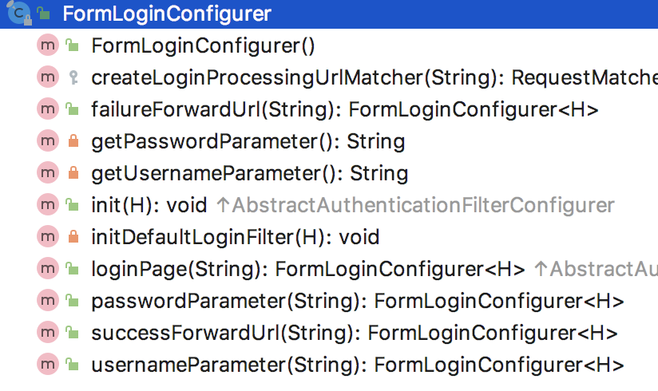

# 深入理解 SecurityConfigurer 【源码篇】

我们来继续撸 Spring Security 源码。


SecurityConfigurer 在 Spring Security 中是一个非常重要的角色。在前面的文章中，松哥曾经多次提到过，Spring Security 过滤器链中的每一个过滤器，都是通过 xxxConfigurer 来进行配置的，而这些 xxxConfigurer 实际上都是 SecurityConfigurer 的实现。

所以我们今天有必要来跟大家把 SecurityConfigurer 从头到尾捋一捋。

## 1. SecurityConfigurer

SecurityConfigurer 本身是一个接口，我们来看下：

```
public interface SecurityConfigurer<O, B extends SecurityBuilder<O>> {

	void init(B builder) throws Exception;

	void configure(B builder) throws Exception;
}
```

可以看到，SecurityConfigurer 中主要是两个方法，init 和 configure。

init 就是一个初始化方法。而 configure 则是一个配置方法。这里只是规范了方法的定义，具体的实现则在不同的实现类中。

需要注意的是这两个方法的参数类型都是一个泛型 B，也就是 SecurityBuilder 的子类，关于 SecurityBuilder ，它是用来构建过滤器链的，松哥将在下篇文章中和大家介绍。

SecurityConfigurer 有三个实现类：

- SecurityConfigurerAdapter
- GlobalAuthenticationConfigurerAdapter
- WebSecurityConfigurer

我们分别来看。

### 1.1 SecurityConfigurerAdapter

SecurityConfigurerAdapter 实现了 SecurityConfigurer 接口，我们所使用的大部分的 xxxConfigurer 也都是 SecurityConfigurerAdapter 的子类。

SecurityConfigurerAdapter 在 SecurityConfigurer 的基础上，还扩展出来了几个非常好用的方法，我们一起来看下：

```
public abstract class SecurityConfigurerAdapter<O, B extends SecurityBuilder<O>>
		implements SecurityConfigurer<O, B> {
	private B securityBuilder;

	private CompositeObjectPostProcessor objectPostProcessor = new CompositeObjectPostProcessor();

	public void init(B builder) throws Exception {
	}

	public void configure(B builder) throws Exception {
	}

	public B and() {
		return getBuilder();
	}
	protected final B getBuilder() {
		if (securityBuilder == null) {
			throw new IllegalStateException("securityBuilder cannot be null");
		}
		return securityBuilder;
	}
	@SuppressWarnings("unchecked")
	protected <T> T postProcess(T object) {
		return (T) this.objectPostProcessor.postProcess(object);
	}
	public void addObjectPostProcessor(ObjectPostProcessor<?> objectPostProcessor) {
		this.objectPostProcessor.addObjectPostProcessor(objectPostProcessor);
	}
	public void setBuilder(B builder) {
		this.securityBuilder = builder;
	}
	private static final class CompositeObjectPostProcessor implements
			ObjectPostProcessor<Object> {
		private List<ObjectPostProcessor<?>> postProcessors = new ArrayList<>();

		@SuppressWarnings({ "rawtypes", "unchecked" })
		public Object postProcess(Object object) {
			for (ObjectPostProcessor opp : postProcessors) {
				Class<?> oppClass = opp.getClass();
				Class<?> oppType = GenericTypeResolver.resolveTypeArgument(oppClass,
						ObjectPostProcessor.class);
				if (oppType == null || oppType.isAssignableFrom(object.getClass())) {
					object = opp.postProcess(object);
				}
			}
			return object;
		}
		private boolean addObjectPostProcessor(
				ObjectPostProcessor<?> objectPostProcessor) {
			boolean result = this.postProcessors.add(objectPostProcessor);
			postProcessors.sort(AnnotationAwareOrderComparator.INSTANCE);
			return result;
		}
	}
}
```

1. CompositeObjectPostProcessor 首先一开始声明了一个 CompositeObjectPostProcessor 实例，CompositeObjectPostProcessor 是 ObjectPostProcessor 的一个实现，ObjectPostProcessor 本身是一个后置处理器，该后置处理器默认有两个实现，AutowireBeanFactoryObjectPostProcessor 和 CompositeObjectPostProcessor。其中 AutowireBeanFactoryObjectPostProcessor 主要是利用了 AutowireCapableBeanFactory 对 Bean 进行手动注册，因为在 Spring Security 中，很多对象都是手动 new 出来的，这些 new 出来的对象和容器没有任何关系，利用 AutowireCapableBeanFactory 可以将这些手动 new 出来的对象注入到容器中，而 AutowireBeanFactoryObjectPostProcessor 的主要作用就是完成这件事；CompositeObjectPostProcessor 则是一个复合的对象处理器，里边维护了一个 List 集合，这个 List 集合中，大部分情况下只存储一条数据，那就是 AutowireBeanFactoryObjectPostProcessor，用来完成对象注入到容器的操作，如果用户自己手动调用了 addObjectPostProcessor 方法，那么 CompositeObjectPostProcessor 集合中维护的数据就会多出来一条，在 CompositeObjectPostProcessor#postProcess 方法中，会遍历集合中的所有 ObjectPostProcessor，挨个调用其 postProcess 方法对对象进行后置处理。
2. and 方法，该方法返回值是一个 securityBuilder，securityBuilder 实际上就是 HttpSecurity，我们在 HttpSecurity 中去配置不同的过滤器时，可以使用 and 方法进行链式配置，就是因为这里定义了 and 方法并返回了 securityBuilder 实例。

这便是 SecurityConfigurerAdapter 的主要功能，后面大部分的 xxxConfigurer 都是基于此类来实现的。

### 1.2 GlobalAuthenticationConfigurerAdapter

GlobalAuthenticationConfigurerAdapter 看名字就知道是一个跟全局配置有关的东西，它本身实现了 SecurityConfigurerAdapter 接口，但是并未对方法做具体的实现，只是将泛型具体化了：

```
@Order(100)
public abstract class GlobalAuthenticationConfigurerAdapter implements
		SecurityConfigurer<AuthenticationManager, AuthenticationManagerBuilder> {

	public void init(AuthenticationManagerBuilder auth) throws Exception {
	}

	public void configure(AuthenticationManagerBuilder auth) throws Exception {
	}
}
```

可以看到，SecurityConfigurer 中的泛型，现在明确成了 AuthenticationManager 和 AuthenticationManagerBuilder。所以 GlobalAuthenticationConfigurerAdapter 的实现类将来主要是和配置 AuthenticationManager 有关。当然也包括默认的用户名密码也是由它的实现类来进行配置的。

**我们在 Spring Security 中使用的 AuthenticationManager 其实可以分为两种，一种是局部的，另一种是全局的，这里主要是全局的配置。**

### 1.3 WebSecurityConfigurer

还有一个实现类就是 WebSecurityConfigurer，这个可能有的小伙伴比较陌生，其实他就是我们天天用的 WebSecurityConfigurerAdapter 的父接口。

所以 WebSecurityConfigurer 的作用就很明确了，用户扩展用户自定义的配置。

SecurityConfigurer 默认主要是这三个实现，考虑到大多数的过滤器配置都是通过 SecurityConfigurerAdapter 进行扩展的，因此我们今天就通过这条线进行展开。另外两条线松哥也将撸两篇文章和大家介绍。

## 2. SecurityConfigurerAdapter

SecurityConfigurerAdapter 的实现主要也是三大类：

- UserDetailsAwareConfigurer
- AbstractHttpConfigurer
- LdapAuthenticationProviderConfigurer

考虑到 LDAP 现在使用很少，所以这里我来和大家重点介绍下前两个。

### 2.1 UserDetailsAwareConfigurer

这个配置类看名字大概就知道这是用来配置用户类的。

[](http://img.itboyhub.com/2020/07/UserDetailsAwareConfigurer.png)

**AbstractDaoAuthenticationConfigurer**

AbstractDaoAuthenticationConfigurer 中所做的事情比较简单，主要是构造了一个默认的 DaoAuthenticationProvider，并为其配置 PasswordEncoder 和 UserDetailsService。

**UserDetailsServiceConfigurer**

UserDetailsServiceConfigurer 重写了 AbstractDaoAuthenticationConfigurer 中的 configure 方法，在 configure 方法执行之前加入了 initUserDetailsService 方法，以方便开发展按照自己的方式去初始化 UserDetailsService。不过这里的 initUserDetailsService 方法是空方法。

**UserDetailsManagerConfigurer**

UserDetailsManagerConfigurer 中实现了 UserDetailsServiceConfigurer 中定义的 initUserDetailsService 方法，具体的实现逻辑就是将 UserDetailsBuilder 所构建出来的 UserDetails 以及提前准备好的 UserDetails 中的用户存储到 UserDetailsService 中。

该类同时添加了 withUser 方法用来添加用户，同时还增加了一个 UserDetailsBuilder 用来构建用户，这些逻辑都比较简单，小伙伴们可以自行查看。

**JdbcUserDetailsManagerConfigurer**

JdbcUserDetailsManagerConfigurer 在父类的基础上补充了 DataSource 对象，同时还提供了相应的数据库查询方法。

**InMemoryUserDetailsManagerConfigurer**

InMemoryUserDetailsManagerConfigurer 在父类的基础上重写了构造方法，将父类中的 UserDetailsService 实例定义为 InMemoryUserDetailsManager。

**DaoAuthenticationConfigurer**

DaoAuthenticationConfigurer 继承自 AbstractDaoAuthenticationConfigurer，只是在构造方法中修改了一下 userDetailsService 而已。

有小伙伴可能要问了，JdbcUserDetailsManagerConfigurer 或者 InMemoryUserDetailsManagerConfigurer，到底在哪里可以用到呀？

松哥给大家举一个简单的例子：

```
@Configuration
public class SecurityConfig extends WebSecurityConfigurerAdapter {

    @Override
    protected void configure(AuthenticationManagerBuilder auth) throws Exception {
        auth.inMemoryAuthentication().withUser("javaboy")
                .password("{noop}123")
                .roles("admin");
    }

    @Override
    protected void configure(HttpSecurity http) throws Exception {
        http.authorizeRequests()
                .anyRequest().authenticated()
                //省略
    }
}
```

当你调用 auth.inMemoryAuthentication 进行配置时，实际上调用的就是 InMemoryUserDetailsManagerConfigurer。

这下明白了吧！

### 2.2 AbstractHttpConfigurer

AbstractHttpConfigurer 这一派中的东西非常多，我们所有的过滤器配置，都是它的子类，我们来看下都有哪些类？

[](http://img.itboyhub.com/2020/07/20200720211931.png)

可以看到，它的实现类还是非常多的。

这么多实现类，松哥就不一一给大家介绍了，我挑一个常用的 FormLoginConfigurer 来给大家详细介绍，只要大家把这个理解了，其他的照猫画虎就很好理解了。

我们一个一个来看。

#### 2.2.1 AbstractHttpConfigurer

AbstractHttpConfigurer 继承自 SecurityConfigurerAdapter，并增加了两个方法，disable 和 withObjectPostProcessor：

```
public abstract class AbstractHttpConfigurer<T extends AbstractHttpConfigurer<T, B>, B extends HttpSecurityBuilder<B>>
		extends SecurityConfigurerAdapter<DefaultSecurityFilterChain, B> {

	/**
	 * Disables the {@link AbstractHttpConfigurer} by removing it. After doing so a fresh
	 * version of the configuration can be applied.
	 *
	 * @return the {@link HttpSecurityBuilder} for additional customizations
	 */
	@SuppressWarnings("unchecked")
	public B disable() {
		getBuilder().removeConfigurer(getClass());
		return getBuilder();
	}

	@SuppressWarnings("unchecked")
	public T withObjectPostProcessor(ObjectPostProcessor<?> objectPostProcessor) {
		addObjectPostProcessor(objectPostProcessor);
		return (T) this;
	}
}
```

这两个方法松哥之前都有给大家介绍过，disable 基本上是大家的老熟人了，我们常用的 `.csrf().disable()` 就是出自这里，那么从这里我们也可以看到 disable 的实现原理，就是从 getBuilder 中移除相关的 xxxConfigurer，getBuilder 方法获取到的实际上就是 HttpSecurity，所以移除掉 xxxConfigurer 实际上就是从过滤器链中移除掉某一个过滤器，例如 `.csrf().disable()` 就是移除掉处理 csrf 的过滤器。

另一个增加的方法是 withObjectPostProcessor，这是为配置类添加手动添加后置处理器的。在 AbstractHttpConfigurer 的父类中其实有一个类似的方法就是 addObjectPostProcessor，但是 addObjectPostProcessor 只是一个添加方法，返回值为 void，而 withObjectPostProcessor 的返回值是当前配置类，也就是 xxxConfigurer，所以如果使用 withObjectPostProcessor 的话，可以使用链式配置，事实上，在松哥之前的文章，以及 vhr(<https://github.com/lenve/vhr>) 项目中，使用的也都是 withObjectPostProcessor 方法（当然，你也可以使用 addObjectPostProcessor，最终效果是一样的）。

#### 2.2.2 AbstractAuthenticationFilterConfigurer

AbstractAuthenticationFilterConfigurer 类的功能比较多，源码也是相当相当长。不过我们只需要抓住两点即可，init 方法和 configure 方法，因为这两个方法是所有 xxxConfigurer 的灵魂。

```
@Override
public void init(B http) throws Exception {
	updateAuthenticationDefaults();
	updateAccessDefaults(http);
	registerDefaultAuthenticationEntryPoint(http);
}
```

init 方法主要干了三件事：

1. updateAuthenticationDefaults 主要是配置了登录处理地址，失败跳转地址，注销成功跳转地址。
2. updateAccessDefaults 方法主要是对 loginPage、loginProcessingUrl、failureUrl 进行 permitAll 设置（如果用户配置了 permitAll 的话）。
3. registerDefaultAuthenticationEntryPoint 则是注册异常的处理器。

再来看 configure 方法：

```
@Override
public void configure(B http) throws Exception {
	PortMapper portMapper = http.getSharedObject(PortMapper.class);
	if (portMapper != null) {
		authenticationEntryPoint.setPortMapper(portMapper);
	}
	RequestCache requestCache = http.getSharedObject(RequestCache.class);
	if (requestCache != null) {
		this.defaultSuccessHandler.setRequestCache(requestCache);
	}
	authFilter.setAuthenticationManager(http
			.getSharedObject(AuthenticationManager.class));
	authFilter.setAuthenticationSuccessHandler(successHandler);
	authFilter.setAuthenticationFailureHandler(failureHandler);
	if (authenticationDetailsSource != null) {
		authFilter.setAuthenticationDetailsSource(authenticationDetailsSource);
	}
	SessionAuthenticationStrategy sessionAuthenticationStrategy = http
			.getSharedObject(SessionAuthenticationStrategy.class);
	if (sessionAuthenticationStrategy != null) {
		authFilter.setSessionAuthenticationStrategy(sessionAuthenticationStrategy);
	}
	RememberMeServices rememberMeServices = http
			.getSharedObject(RememberMeServices.class);
	if (rememberMeServices != null) {
		authFilter.setRememberMeServices(rememberMeServices);
	}
	F filter = postProcess(authFilter);
	http.addFilter(filter);
}
```

configure 中的逻辑就很简答了，构建各种各样的回调函数设置给 authFilter，authFilter 再去 postProcess 中走一圈注册到 Spring 容器中，最后再把 authFilter 添加到过滤器链中。

这便是 AbstractAuthenticationFilterConfigurer 的主要功能。需要提醒大家的是，我们日常配置的，如：

- loginPage
- loginProcessingUrl
- permitAll
- defaultSuccessUrl
- failureUrl
- …

等方法都是在这里定义的。

最后我们再来看看 FormLoginConfigurer。

#### 2.2.3 FormLoginConfigurer

FormLoginConfigurer 在定义是，明确了 AbstractAuthenticationFilterConfigurer 中的泛型是 UsernamePasswordAuthenticationFilter，也就是我们这里最终要配置的过滤是 UsernamePasswordAuthenticationFilter。

FormLoginConfigurer 重写了 init 方法，配置了一下默认的登录页面。其他的基本上都是从父类来的，未做太多改变。

另外我们日常配置的很多东西也是来自这里：

[](http://img.itboyhub.com/2020/07/20200720222352.png)

好啦，这就是 FormLoginConfigurer 这个配置类，FormLoginConfigurer 对应的过滤器是 UsernamePasswordAuthenticationFilter，小伙伴们可以自行分析其他的 xxxConfigurer，每一个 xxxConfigurer 都对应了一个 不同的 Filter。

## 3.小结

好啦，今天就主要和大家分享一下 SecurityConfigurer 的源码，当然这里还有很多值得再次仔细讨论的东西，松哥将在后面的文章中继续和大家分享。

觉得有收获的小伙伴记得点个在看鼓励下松哥哦～

\#[Spring Boot](https://www.javaboy.org/tags/Spring-Boot/),[Spring Security](https://www.javaboy.org/tags/Spring-Security/)

喜欢这篇文章吗？扫码关注公众号**【江南一点雨】**，**【江南一点雨】**专注于 SPRING BOOT+微服务以及前后端分离技术，每天推送原创技术干货，关注后回复 JAVA，领取松哥为你精心准备的 JAVA 干货!