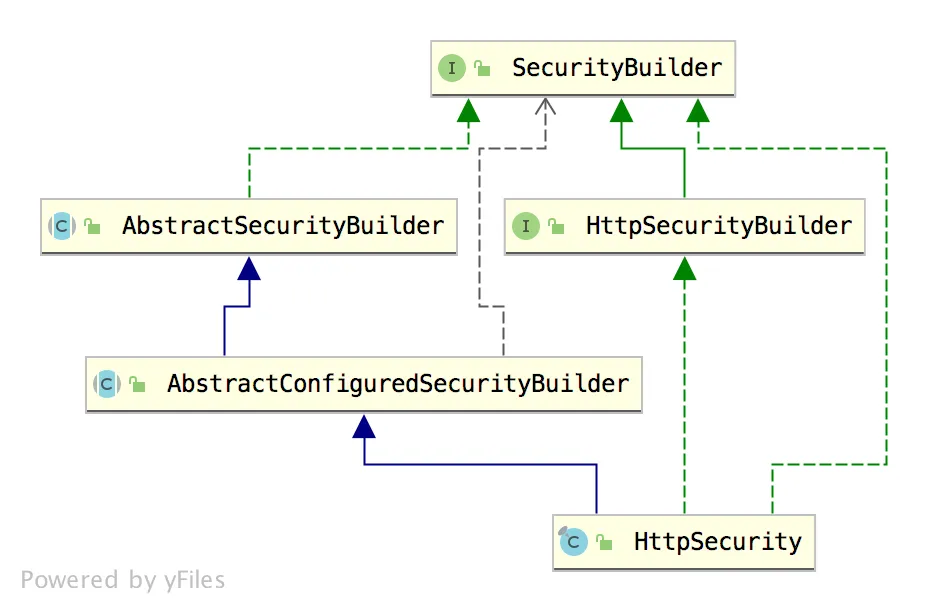

# 深入理解 HttpSecurity【源码篇】

Original 江南一点雨 [江南一点雨](javascript:void(0);) *2020年07月22日 08:08*

松哥原创的 Spring Boot 视频教程已经杀青，感兴趣的小伙伴戳这里-->[Spring Boot+Vue+微人事视频教程](https://mp.weixin.qq.com/s?__biz=MzI1NDY0MTkzNQ==&mid=2247488799&idx=1&sn=cdfd5315ff18c979b6f5d390ab4d9059&scene=21#wechat_redirect)

HttpSecurity 也是 Spring Security 中的重要一环。我们平时所做的大部分 Spring Security 配置也都是基于 HttpSecurity 来配置的。因此我们有必要从源码的角度来理解下 HttpSecurity 到底干了啥？

## 1.抽丝剥茧

首先我们来看下 HttpSecurity 的继承关系图：



可以看到，HttpSecurity 继承自 AbstractConfiguredSecurityBuilder，同时实现了 SecurityBuilder 和 HttpSecurityBuilder 两个接口。

我们来看下 HttpSecurity 的定义：

```
public final class HttpSecurity extends
  AbstractConfiguredSecurityBuilder<DefaultSecurityFilterChain, HttpSecurity>
  implements SecurityBuilder<DefaultSecurityFilterChain>,
  HttpSecurityBuilder<HttpSecurity> {
        //...
}
```

这里每一个类都带有泛型，看得人有点眼花缭乱。

我把这个泛型类拿出来和大家讲一下，小伙伴们就明白了。

泛型主要是两个，DefaultSecurityFilterChain 和 HttpSecurity，HttpSecurity 就不用说了，这是我们今天的主角，那么 DefaultSecurityFilterChain 是干嘛的？

这我们就得从 SecurityFilterChain 说起了。

### 1.1 SecurityFilterChain

先来看定义：

```
public interface SecurityFilterChain {
 boolean matches(HttpServletRequest request);
 List<Filter> getFilters();
}
```

SecurityFilterChain 其实就是我们平时所说的 Spring Security 中的过滤器链，它里边定义了两个方法，一个是 matches 方法用来匹配请求，另外一个 getFilters 方法返回一个 List 集合，集合中放着 Filter 对象，当一个请求到来时，用 matches 方法去比较请求是否和当前链吻合，如果吻合，就返回 getFilters 方法中的过滤器，那么当前请求会逐个经过 List 集合中的过滤器。这一点，小伙伴们可以回忆前面【深入理解 FilterChainProxy【源码篇】】一文。

SecurityFilterChain 接口只有一个实现类，那就是 DefaultSecurityFilterChain：

```
public final class DefaultSecurityFilterChain implements SecurityFilterChain {
 private static final Log logger = LogFactory.getLog(DefaultSecurityFilterChain.class);
 private final RequestMatcher requestMatcher;
 private final List<Filter> filters;

 public DefaultSecurityFilterChain(RequestMatcher requestMatcher, Filter... filters) {
  this(requestMatcher, Arrays.asList(filters));
 }

 public DefaultSecurityFilterChain(RequestMatcher requestMatcher, List<Filter> filters) {
  logger.info("Creating filter chain: " + requestMatcher + ", " + filters);
  this.requestMatcher = requestMatcher;
  this.filters = new ArrayList<>(filters);
 }

 public RequestMatcher getRequestMatcher() {
  return requestMatcher;
 }

 public List<Filter> getFilters() {
  return filters;
 }

 public boolean matches(HttpServletRequest request) {
  return requestMatcher.matches(request);
 }

 @Override
 public String toString() {
  return "[ " + requestMatcher + ", " + filters + "]";
 }
}
```

DefaultSecurityFilterChain 只是对 SecurityFilterChain 中的方法进行了实现，并没有特别值得说的地方，松哥也就不啰嗦了。

**那么从上面的介绍中，大家可以看到，DefaultSecurityFilterChain 其实就相当于是 Spring Security 中的过滤器链，一个 DefaultSecurityFilterChain 代表一个过滤器链，如果系统中存在多个过滤器链，则会存在多个 DefaultSecurityFilterChain 对象。**

接下来我们把 HttpSecurity 的这几个父类捋一捋。

### 1.2 SecurityBuilder

```
public interface SecurityBuilder<O> {
 O build() throws Exception;
}
```

SecurityBuilder 就是用来构建过滤器链的，在 HttpSecurity 实现 SecurityBuilder 时，传入的泛型就是 DefaultSecurityFilterChain，所以 SecurityBuilder#build 方法的功能很明确，就是用来构建一个过滤器链出来。

### 1.3 HttpSecurityBuilder

HttpSecurityBuilder 看名字就是用来构建 HttpSecurity 的。不过它也只是一个接口，具体的实现在 HttpSecurity 中，接口定义如下：

```
public interface HttpSecurityBuilder<H extends HttpSecurityBuilder<H>> extends
  SecurityBuilder<DefaultSecurityFilterChain> {
 <C extends SecurityConfigurer<DefaultSecurityFilterChain, H>> C getConfigurer(
   Class<C> clazz);
 <C extends SecurityConfigurer<DefaultSecurityFilterChain, H>> C removeConfigurer(
   Class<C> clazz);
 <C> void setSharedObject(Class<C> sharedType, C object);
 <C> C getSharedObject(Class<C> sharedType);
 H authenticationProvider(AuthenticationProvider authenticationProvider);
 H userDetailsService(UserDetailsService userDetailsService) throws Exception;
 H addFilterAfter(Filter filter, Class<? extends Filter> afterFilter);
 H addFilterBefore(Filter filter, Class<? extends Filter> beforeFilter);
 H addFilter(Filter filter);
}
```

这里的方法比较简单：

1. getConfigurer 获取一个配置对象。Spring Security 过滤器链中的所有过滤器对象都是由 xxxConfigure 来进行配置的，这里就是获取这个 xxxConfigure 对象。
2. removeConfigurer 移除一个配置对象。
3. setSharedObject/getSharedObject 配置/获取由多个 SecurityConfigurer 共享的对象。
4. authenticationProvider 方法表示配置验证器。
5. userDetailsService 配置数据源接口。
6. addFilterAfter 在某一个过滤器之前添加过滤器。
7. addFilterBefore 在某一个过滤器之后添加过滤器。
8. addFilter 添加一个过滤器，该过滤器必须是现有过滤器链中某一个过滤器或者其扩展。

这便是 HttpSecurityBuilder 中的功能，这些接口在 HttpSecurity 中都将得到实现。

### 1.4 AbstractSecurityBuilder

AbstractSecurityBuilder 类实现了 SecurityBuilder 接口，该类中主要做了一件事，就是确保整个构建只被构建一次。

```
public abstract class AbstractSecurityBuilder<O> implements SecurityBuilder<O> {
 private AtomicBoolean building = new AtomicBoolean();
 private O object;
 public final O build() throws Exception {
  if (this.building.compareAndSet(false, true)) {
   this.object = doBuild();
   return this.object;
  }
  throw new AlreadyBuiltException("This object has already been built");
 }
 public final O getObject() {
  if (!this.building.get()) {
   throw new IllegalStateException("This object has not been built");
  }
  return this.object;
 }
 protected abstract O doBuild() throws Exception;
}
```

可以看到，这里重新定义了 build 方法，并设置 build 方法为 final 类型，无法被重写，在 build 方法中，通过 AtomicBoolean 实现该方法只被调用一次。具体的构建逻辑则定义了新的抽象方法 doBuild，将来在实现类中通过 doBuild 方法定义构建逻辑。

### 1.5 AbstractConfiguredSecurityBuilder

AbstractSecurityBuilder 方法的实现类就是 AbstractConfiguredSecurityBuilder。

AbstractConfiguredSecurityBuilder 中所做的事情就比较多了，我们分别来看。

首先 AbstractConfiguredSecurityBuilder 中定义了一个枚举类，将整个构建过程分为 5 种状态，也可以理解为构建过程生命周期的五个阶段，如下：

```
private enum BuildState {
 UNBUILT(0),
 INITIALIZING(1),
 CONFIGURING(2),
 BUILDING(3),
 BUILT(4);
 private final int order;
 BuildState(int order) {
  this.order = order;
 }
 public boolean isInitializing() {
  return INITIALIZING.order == order;
 }
 public boolean isConfigured() {
  return order >= CONFIGURING.order;
 }
}
```

五种状态分别是 UNBUILT、INITIALIZING、CONFIGURING、BUILDING 以及 BUILT。另外还提供了两个判断方法，isInitializing 判断是否正在初始化，isConfigured 表示是否已经配置完毕。

AbstractConfiguredSecurityBuilder 中的方法比较多，松哥在这里列出来两个关键的方法和大家分析：

```
private <C extends SecurityConfigurer<O, B>> void add(C configurer) {
 Assert.notNull(configurer, "configurer cannot be null");
 Class<? extends SecurityConfigurer<O, B>> clazz = (Class<? extends SecurityConfigurer<O, B>>) configurer
   .getClass();
 synchronized (configurers) {
  if (buildState.isConfigured()) {
   throw new IllegalStateException("Cannot apply " + configurer
     + " to already built object");
  }
  List<SecurityConfigurer<O, B>> configs = allowConfigurersOfSameType ? this.configurers
    .get(clazz) : null;
  if (configs == null) {
   configs = new ArrayList<>(1);
  }
  configs.add(configurer);
  this.configurers.put(clazz, configs);
  if (buildState.isInitializing()) {
   this.configurersAddedInInitializing.add(configurer);
  }
 }
}
private Collection<SecurityConfigurer<O, B>> getConfigurers() {
 List<SecurityConfigurer<O, B>> result = new ArrayList<>();
 for (List<SecurityConfigurer<O, B>> configs : this.configurers.values()) {
  result.addAll(configs);
 }
 return result;
}
```

第一个就是这个 add 方法，这相当于是在收集所有的配置类。将所有的 xxxConfigure 收集起来存储到 configurers 中，将来再统一初始化并配置，configurers 本身是一个 LinkedHashMap ，key 是配置类的 class，value 是一个集合，集合里边放着 xxxConfigure 配置类。当需要对这些配置类进行集中配置的时候，会通过 getConfigurers 方法获取配置类，这个获取过程就是把 LinkedHashMap 中的 value 拿出来，放到一个集合中返回。

另一个方法就是 doBuild 方法。

```
@Override
protected final O doBuild() throws Exception {
 synchronized (configurers) {
  buildState = BuildState.INITIALIZING;
  beforeInit();
  init();
  buildState = BuildState.CONFIGURING;
  beforeConfigure();
  configure();
  buildState = BuildState.BUILDING;
  O result = performBuild();
  buildState = BuildState.BUILT;
  return result;
 }
}
private void init() throws Exception {
 Collection<SecurityConfigurer<O, B>> configurers = getConfigurers();
 for (SecurityConfigurer<O, B> configurer : configurers) {
  configurer.init((B) this);
 }
 for (SecurityConfigurer<O, B> configurer : configurersAddedInInitializing) {
  configurer.init((B) this);
 }
}
private void configure() throws Exception {
 Collection<SecurityConfigurer<O, B>> configurers = getConfigurers();
 for (SecurityConfigurer<O, B> configurer : configurers) {
  configurer.configure((B) this);
 }
}
```

在 AbstractSecurityBuilder 类中，过滤器的构建被转移到 doBuild 方法上面了，不过在 AbstractSecurityBuilder 中只是定义了抽象的 doBuild 方法，具体的实现在 AbstractConfiguredSecurityBuilder。

doBuild 方法就是一边更新状态，进行进行初始化。

beforeInit 是一个预留方法，没有任何实现。

init 方法就是找到所有的 xxxConfigure，挨个调用其 init 方法进行初始化。

beforeConfigure 是一个预留方法，没有任何实现。

configure 方法就是找到所有的 xxxConfigure，挨个调用其 configure 方法进行配置。

最后则是 performBuild 方法，是真正的过滤器链构建方法，但是在 AbstractConfiguredSecurityBuilder 中 performBuild 方法只是一个抽象方法，具体的实现在 HttpSecurity 中。

这便是 HttpSecurity 所有父类、父接口的功能。

看完了父辈，接下来回到我们今天文章的主题，HttpSecurity。

## 2. HttpSecurity

HttpSecurity 做的事情，就是进行各种各样的 xxxConfigurer 配置。

随便举几例：

```
public CorsConfigurer<HttpSecurity> cors() throws Exception {
 return getOrApply(new CorsConfigurer<>());
}
public CsrfConfigurer<HttpSecurity> csrf() throws Exception {
 ApplicationContext context = getContext();
 return getOrApply(new CsrfConfigurer<>(context));
}
public ExceptionHandlingConfigurer<HttpSecurity> exceptionHandling() throws Exception {
 return getOrApply(new ExceptionHandlingConfigurer<>());
}
```

HttpSecurity 中有大量类似的方法，过滤器链中的过滤器就是这样一个一个配置的。我就不一一介绍了。

每个配置方法的结尾都会来一句 getOrApply，这个是干嘛的？

```
private <C extends SecurityConfigurerAdapter<DefaultSecurityFilterChain, HttpSecurity>> C getOrApply(
  C configurer) throws Exception {
 C existingConfig = (C) getConfigurer(configurer.getClass());
 if (existingConfig != null) {
  return existingConfig;
 }
 return apply(configurer);
}
```

getConfigurer 方法是在它的父类 AbstractConfiguredSecurityBuilder 中定义的，目的就是去查看当前这个 xxxConfigurer 是否已经配置过了。

如果当前 xxxConfigurer 已经配置过了，则直接返回，否则调用 apply 方法，这个 apply 方法最终会调用到 AbstractConfiguredSecurityBuilder#add 方法，将当前配置 configurer 收集起来。

HttpSecurity 中还有一个 addFilter 方法：

```
public HttpSecurity addFilter(Filter filter) {
 Class<? extends Filter> filterClass = filter.getClass();
 if (!comparator.isRegistered(filterClass)) {
  throw new IllegalArgumentException(
    "The Filter class "
      + filterClass.getName()
      + " does not have a registered order and cannot be added without a specified order. Consider using addFilterBefore or addFilterAfter instead.");
 }
 this.filters.add(filter);
 return this;
}
```

这个 addFilter 方法的作用，主要是在各个 xxxConfigurer 进行配置的时候，会调用到这个方法，（xxxConfigurer 就是用来配置过滤器的），把 Filter 都添加到 fitlers 变量中。

最终在 HttpSecurity 的 performBuild 方法中，构建出来一个过滤器链：

```
@Override
protected DefaultSecurityFilterChain performBuild() {
 filters.sort(comparator);
 return new DefaultSecurityFilterChain(requestMatcher, filters);
}
```

先给过滤器排序，然后构造 DefaultSecurityFilterChain 对象。

## 3.小结

好啦，这就是 HttpSecurity 的一个大致工作流程。把握住了这个工作流程，剩下的就只是一些简单的重复的 xxxConfigurer 配置了，松哥就不再啰嗦啦。

**如果小伙伴们觉得有收获，记得点个在看鼓励下松哥哦～**

今日干货


刚刚发表

查看:13500回复:135

公众号后台回复 2TB，免费获取 2TB Java 学习资料。

SpringSecurity系列52

SpringSecurity系列 · 目录


上一篇深入理解 FilterChainProxy【源码篇】下一篇深入理解 WebSecurityConfigurerAdapter【源码篇】


# 