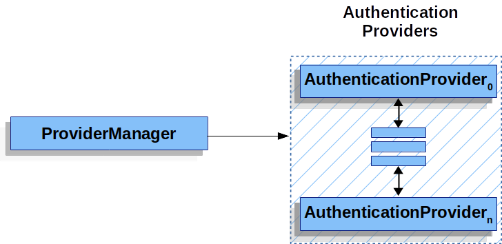
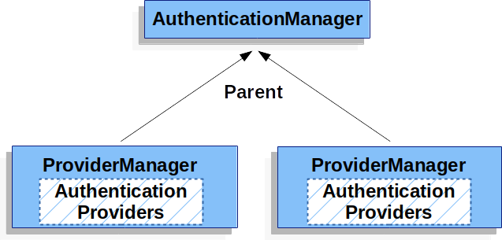
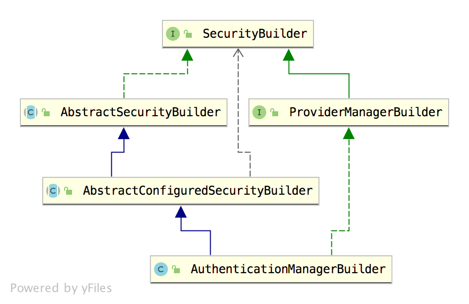

# 深入理解 AuthenticationManagerBuilder 【源码篇】

咱们继续来撸 Spring Security 源码。


前面和大家分享了 SecurityBuilder 以及它的一个重要实现 HttpSecurity，在 SecurityBuilder 的实现类里边，还有一个重要的分支，那就是 AuthenticationManagerBuilder，AuthenticationManagerBuilder 看名字就知道是用来构建 AuthenticationManager 的，所以今天我们就来看一看 AuthenticationManager 到底是怎么构建的。

## 1.初步理解

在 Spring Security 中，用来处理身份认证的类是 AuthenticationManager，我们也称之为认证管理器。

AuthenticationManager 中规范了 Spring Security 的过滤器要如何执行身份认证，并在身份认证成功后返回一个经过认证的 Authentication 对象。AuthenticationManager 是一个接口，我们可以自定义它的实现，但是通常我们使用更多的是系统提供的 ProviderManager。

### 1.1 ProviderManager

ProviderManager 是的最常用的 AuthenticationManager 实现类。

ProviderManager 管理了一个 AuthenticationProvider 列表，每个 AuthenticationProvider 都是一个认证器，不同的 AuthenticationProvider 用来处理不同的 Authentication 对象的认证。一次完整的身份认证流程可能会经过多个 AuthenticationProvider。

ProviderManager 相当于代理了多个 AuthenticationProvider，他们的关系如下图：

[](http://img.itboyhub.com/2020/07/20200709222237.png)

### 1.2 AuthenticationProvider

AuthenticationProvider 定义了 Spring Security 中的验证逻辑，我们来看下 AuthenticationProvider 的定义：

```
public interface AuthenticationProvider {
	Authentication authenticate(Authentication authentication)
			throws AuthenticationException;
	boolean supports(Class<?> authentication);
}
```

可以看到，AuthenticationProvider 中就两个方法：

- authenticate 方法用来做验证，就是验证用户身份。
- supports 则用来判断当前的 AuthenticationProvider 是否支持对应的 Authentication。

在一次完整的认证中，可能包含多个 AuthenticationProvider，而这多个 AuthenticationProvider 则由 ProviderManager 进行统一管理，具体可以参考松哥之前的文章：[松哥手把手带你捋一遍 Spring Security 登录流程](https://mp.weixin.qq.com/s/z6GeR5O-vBzY3SHehmccVA)。

最常用的 AuthenticationProvider 实现类是 DaoAuthenticationProvider。

### 1.3 Parent

每一个 ProviderManager 管理多个 AuthenticationProvider，同时每一个 ProviderManager 都可以配置一个 parent，如果当前的 ProviderManager 中认证失败了，还可以去它的 parent 中继续执行认证，所谓的 parent 实例，一般也是 ProviderManager，也就是 ProviderManager 的 parent 还是 ProviderManager。可以参考如下架构图：

[](http://img.itboyhub.com/2020/07/20200721164221.png)

**从上面的分析中大家可以看出，AuthenticationManager 的初始化会分为两块，一个全局的 AuthenticationManager，也就是 parent，另一个则是局部的 AuthenticationManager。先给大家一个结论，一个系统中，我们可以配置多个 HttpSecurity（参见Spring Security 竟然可以同时存在多个过滤器链？），而每一个 HttpSecurity 都有一个对应的 AuthenticationManager 实例（局部 AuthenticationManager），这些局部的 AuthenticationManager 实例都有一个共同的 parent，那就是全局的 AuthenticationManager。**

> 全局和**parent**可以不一样的，如果都重写了方法的话，parent就不使用全局的

接下来，我们通过源码分析来验证我们上面的结论。

本文内容和上篇文章紧密相关，如果大家还没看过上篇源码分析文章，一定点击超链接先看下。

## 2.源码分析

在上篇文章中，松哥已经和大家分析了 SecurityBuilder 的几个常见实现类 AbstractSecurityBuilder、AbstractConfiguredSecurityBuilder、HttpSecurityBuilder，本文关于这几个类我就不重复介绍了。

我们直接来看 AuthenticationManagerBuilder，先来看它的一个继承关系：

[](http://img.itboyhub.com/2020/07/AuthenticationManagerBuilder.png)

可以看到，【[上篇文章](https://mp.weixin.qq.com/s/Kk5c5pK5_LFcCpcnIr2VrA)】中介绍的全部都是 AuthenticationManagerBuilder 的父类，所以 AuthenticationManagerBuilder 已经自动具备了其父类的功能。

AuthenticationManagerBuilder 的源码比较长，我们来看几个关键的方法：

```java
public class AuthenticationManagerBuilder
		extends
		AbstractConfiguredSecurityBuilder<AuthenticationManager, AuthenticationManagerBuilder>
		implements ProviderManagerBuilder<AuthenticationManagerBuilder> {
	public AuthenticationManagerBuilder(ObjectPostProcessor<Object> objectPostProcessor) {
		super(objectPostProcessor, true);
	}
	public AuthenticationManagerBuilder parentAuthenticationManager(
			AuthenticationManager authenticationManager) {
		if (authenticationManager instanceof ProviderManager) {
			eraseCredentials(((ProviderManager) authenticationManager)
					.isEraseCredentialsAfterAuthentication());
		}
		this.parentAuthenticationManager = authenticationManager;
		return this;
	}
	public InMemoryUserDetailsManagerConfigurer<AuthenticationManagerBuilder> inMemoryAuthentication()
			throws Exception {
		return apply(new InMemoryUserDetailsManagerConfigurer<>());
	}
	public JdbcUserDetailsManagerConfigurer<AuthenticationManagerBuilder> jdbcAuthentication()
			throws Exception {
		return apply(new JdbcUserDetailsManagerConfigurer<>());
	}
	public <T extends UserDetailsService> DaoAuthenticationConfigurer<AuthenticationManagerBuilder, T> userDetailsService(
			T userDetailsService) throws Exception {
		this.defaultUserDetailsService = userDetailsService;
		return apply(new DaoAuthenticationConfigurer<>(
				userDetailsService));
	}
	@Override
	protected ProviderManager performBuild() throws Exception {
		if (!isConfigured()) {
			logger.debug("No authenticationProviders and no parentAuthenticationManager defined. Returning null.");
			return null;
		}
		ProviderManager providerManager = new ProviderManager(authenticationProviders,
				parentAuthenticationManager);
		if (eraseCredentials != null) {
			providerManager.setEraseCredentialsAfterAuthentication(eraseCredentials);
		}
		if (eventPublisher != null) {
			providerManager.setAuthenticationEventPublisher(eventPublisher);
		}
		providerManager = postProcess(providerManager);
		return providerManager;
	}
}
```

1. 首先，我们可以通过调用 parentAuthenticationManager 方法来给一个 AuthenticationManager 设置 parent。
2. inMemoryAuthentication、jdbcAuthentication 以及 userDetailsService 几个方法松哥在之前的文章中都已经介绍过了（[深入理解 SecurityConfigurer 【源码篇】](https://mp.weixin.qq.com/s/PWIM9jgEB-F-m4Ove470wg)），作用就是为了配置数据源，这里就不再赘述。
3. 最后就是 performBuild 方法，这个方法的作用就是根据当前 AuthenticationManagerBuilder 来构建一个 AuthenticationManager 出来，AuthenticationManager 本身是一个接口，它的默认实现是 ProviderManager，所以这里构建的就是 ProviderManager。在构建 ProviderManager 时，一方面传入 authenticationProviders，就是该 ProviderManager 所管理的所有的 AuthenticationProvider，另一方面传入 ProviderManager 的 parent（其实也是一个 ProviderManager）。

整体来说，这段代码还是很好理解的，松哥在之前的文章中和大家介绍过 Spring Security 整合多个数据源，那个时候我们自己配置 ProviderManager，跟这里的方式类似，具体可以参考：[Spring Security 可以同时对接多个用户表？](https://mp.weixin.qq.com/s/sF4vPZQv7rtBYhBhmONJ5w)。

不过自己配置有一个问题就是我们没有配置 ProviderManager 的 parent，没有配置的话，如果当前 ProviderManager 中认证失败的话，就直接抛出失败，而不会去 parent 中再次进行认证了（一般来说也不需要，如果系统比较复杂的话，可能需要）。

AuthenticationManagerBuilder 还有一个实现类叫做 DefaultPasswordEncoderAuthenticationManagerBuilder，作为内部类分别定义在 WebSecurityConfigurerAdapter 和 AuthenticationConfiguration 中，不过 DefaultPasswordEncoderAuthenticationManagerBuilder 的内容比较简单，重写了父类 AuthenticationManagerBuilder 的几个方法，配置了新的 PasswordEncoder，无他，所以这里我就不列出这个的源码了，感兴趣的小伙伴可以自行查看。但是这并不是说 DefaultPasswordEncoderAuthenticationManagerBuilder 就不重要了，因为在后面的使用中，基本上都是使用 DefaultPasswordEncoderAuthenticationManagerBuilder 来构建 AuthenticationManagerBuilder。

好啦，这就是 AuthenticationManagerBuilder。

那么是什么时候通过 AuthenticationManagerBuilder 来构建 AuthenticationManager 的呢？

这就涉及到我们的老熟人 WebSecurityConfigurerAdapter 了。当然，关于 WebSecurityConfigurerAdapter 本身的初始化过程，松哥在后面会专门写文章介绍，今天我们主要来看下如何在 WebSecurityConfigurerAdapter 中开启 AuthenticationManager 的初始化的。

### 2.1 初始化流程

在初始化流程中，松哥得先和大家介绍一个 AuthenticationConfiguration 类。这个类大家可以当作是一个全局被配类来理解，里边都是一些全局属性的配置：

```
@Configuration(proxyBeanMethods = false)
@Import(ObjectPostProcessorConfiguration.class)
public class AuthenticationConfiguration {
	@Bean
	public AuthenticationManagerBuilder authenticationManagerBuilder(
			ObjectPostProcessor<Object> objectPostProcessor, ApplicationContext context) {
		LazyPasswordEncoder defaultPasswordEncoder = new LazyPasswordEncoder(context);
		AuthenticationEventPublisher authenticationEventPublisher = getBeanOrNull(context, AuthenticationEventPublisher.class);

		DefaultPasswordEncoderAuthenticationManagerBuilder result = new DefaultPasswordEncoderAuthenticationManagerBuilder(objectPostProcessor, defaultPasswordEncoder);
		if (authenticationEventPublisher != null) {
			result.authenticationEventPublisher(authenticationEventPublisher);
		}
		return result;
	}

	@Bean
	public static GlobalAuthenticationConfigurerAdapter enableGlobalAuthenticationAutowiredConfigurer(
			ApplicationContext context) {
		return new EnableGlobalAuthenticationAutowiredConfigurer(context);
	}

	@Bean
	public static InitializeUserDetailsBeanManagerConfigurer initializeUserDetailsBeanManagerConfigurer(ApplicationContext context) {
		return new InitializeUserDetailsBeanManagerConfigurer(context);
	}

	@Bean
	public static InitializeAuthenticationProviderBeanManagerConfigurer initializeAuthenticationProviderBeanManagerConfigurer(ApplicationContext context) {
		return new InitializeAuthenticationProviderBeanManagerConfigurer(context);
	}

	public AuthenticationManager getAuthenticationManager() throws Exception {
		if (this.authenticationManagerInitialized) {
			return this.authenticationManager;
		}
		AuthenticationManagerBuilder authBuilder = this.applicationContext.getBean(AuthenticationManagerBuilder.class);
		if (this.buildingAuthenticationManager.getAndSet(true)) {
			return new AuthenticationManagerDelegator(authBuilder);
		}

		for (GlobalAuthenticationConfigurerAdapter config : globalAuthConfigurers) {
			authBuilder.apply(config);
		}

		authenticationManager = authBuilder.build();

		if (authenticationManager == null) {
			authenticationManager = getAuthenticationManagerBean();
		}

		this.authenticationManagerInitialized = true;
		return authenticationManager;
	}

	@Autowired
	public void setApplicationContext(ApplicationContext applicationContext) {
		this.applicationContext = applicationContext;
	}

	@Autowired
	public void setObjectPostProcessor(ObjectPostProcessor<Object> objectPostProcessor) {
		this.objectPostProcessor = objectPostProcessor;
	}

	private static class EnableGlobalAuthenticationAutowiredConfigurer extends
			GlobalAuthenticationConfigurerAdapter {
		private final ApplicationContext context;
		private static final Log logger = LogFactory
				.getLog(EnableGlobalAuthenticationAutowiredConfigurer.class);

		EnableGlobalAuthenticationAutowiredConfigurer(ApplicationContext context) {
			this.context = context;
		}

		@Override
		public void init(AuthenticationManagerBuilder auth) {
			Map<String, Object> beansWithAnnotation = context
					.getBeansWithAnnotation(EnableGlobalAuthentication.class);
			if (logger.isDebugEnabled()) {
				logger.debug("Eagerly initializing " + beansWithAnnotation);
			}
		}
	}
}
```

1. 这里首先构建了一个 AuthenticationManagerBuilder 实例，这个实例就是用来构建全局 AuthenticationManager 的 AuthenticationManagerBuilder，具体的构建过程在下面的 getAuthenticationManager 方法中。不过这里的这个全局的 AuthenticationManagerBuilder 并非总是有用，为什么这么说呢？且看松哥下面的的分析。
2. 另外还有一些 initializeXXX 方法，用来构建全局的 UserDetailService 和 AuthenticationProvider，这些方法小伙伴可以作为一个了解，因为正常情况下是不会用到这几个 Bean 的，只有当 getAuthenticationManager 方法被调用时，这些默认的 Bean 才会被配置，而 getAuthenticationManager 方法被调用，意味着我们要使用系统默认配置的 AuthenticationManager 作为 parent，而在实际使用中，我们一般不会使用系统默认配置的 AuthenticationManager 作为 parent，我们自己多多少少都会重新定制一下。

**这就是 AuthenticationConfiguration 的主要功能，它主要是提供了一些全局的 Bean，这些全局的 Bean 虽然一定会初始化，但是并非一定用到。**

那么到底什么时候用到，什么时候用不到，这就和 WebSecurityConfigurerAdapter 有关了，在 WebSecurityConfigurerAdapter 中有三个重要的方法涉及到 AuthenticationManager 的初始化问题，第一个是 setApplicationContext 方法：

```
public void setApplicationContext(ApplicationContext context) {
	this.context = context;
	ObjectPostProcessor<Object> objectPostProcessor = context.getBean(ObjectPostProcessor.class);
	LazyPasswordEncoder passwordEncoder = new LazyPasswordEncoder(context);
	authenticationBuilder = new DefaultPasswordEncoderAuthenticationManagerBuilder(objectPostProcessor, passwordEncoder);
	localConfigureAuthenticationBldr = new DefaultPasswordEncoderAuthenticationManagerBuilder(objectPostProcessor, passwordEncoder) {
		@Override
		public AuthenticationManagerBuilder eraseCredentials(boolean eraseCredentials) {
			authenticationBuilder.eraseCredentials(eraseCredentials);
			return super.eraseCredentials(eraseCredentials);
		}
		@Override
		public AuthenticationManagerBuilder authenticationEventPublisher(AuthenticationEventPublisher eventPublisher) {
			authenticationBuilder.authenticationEventPublisher(eventPublisher);
			return super.authenticationEventPublisher(eventPublisher);
		}
	};
}
```

在该方法中，创建了两个几乎一摸一样的 AuthenticationManagerBuilder 实例，为什么会有两个呢？第一个 authenticationBuilder 是一个局部的 AuthenticationManagerBuilder，将来会传入 HttpSecurity 中去构建局部的 AuthenticationManager；第二个 localConfigureAuthenticationBldr 则是一个用来构建全局 AuthenticationManager 的 AuthenticationManagerBuilder。

**有小伙伴会问了，构建全局的 AuthenticationManager 不是一开始就在 AuthenticationConfiguration 中创建了吗？为什么这里还有一个？是的，当前这个 localConfigureAuthenticationBldr 是可以禁用的，如果禁用了，就会使用 AuthenticationConfiguration 中提供的 AuthenticationManagerBuilder，如果没禁用，就使用 localConfigureAuthenticationBldr 来构建全局的 AuthenticationManager。**

另一个方法则是 getHttp 方法：

```
protected final HttpSecurity getHttp() throws Exception {
	if (http != null) {
		return http;
	}
	AuthenticationEventPublisher eventPublisher = getAuthenticationEventPublisher();
	localConfigureAuthenticationBldr.authenticationEventPublisher(eventPublisher);
	AuthenticationManager authenticationManager = authenticationManager();
	authenticationBuilder.parentAuthenticationManager(authenticationManager);
	Map<Class<?>, Object> sharedObjects = createSharedObjects();
	http = new HttpSecurity(objectPostProcessor, authenticationBuilder,
			sharedObjects);
	//省略
	return http;
}
```

在 getHttp 方法中，会首先调用 authenticationManager 方法去获取一个全局的 AuthenticationManager，并设置给 authenticationBuilder 作为 parent，然后在构建 HttpSecurity 时将 authenticationBuilder 传入进去。

那么接下来就是 authenticationManager() 方法到底是怎么执行的了：

```
protected AuthenticationManager authenticationManager() throws Exception {
	if (!authenticationManagerInitialized) {
		configure(localConfigureAuthenticationBldr);
		if (disableLocalConfigureAuthenticationBldr) {
			authenticationManager = authenticationConfiguration
					.getAuthenticationManager();
		}
		else {
			authenticationManager = localConfigureAuthenticationBldr.build();
		}
		authenticationManagerInitialized = true;
	}
	return authenticationManager;
}
protected void configure(AuthenticationManagerBuilder auth) throws Exception {
	this.disableLocalConfigureAuthenticationBldr = true;
}
```

可以看到，如果 AuthenticationManager 还没初始化，那就先进行初始化。初始化首先调用 configure 方法，默认情况下，configure 方法里边会把 disableLocalConfigureAuthenticationBldr 变量设置为 true，这样接下来就会进入到 if 分支中了。这个 configure 方法不知道大家有没有觉得眼熟？我们在自定义的 SecurityConfig 配置类中，一般都是要重写该方法的，一旦重写了这个方法，那么 disableLocalConfigureAuthenticationBldr 变量就不会变为 true，依然是 false，这样在获取 authenticationManager 的时候就会进入到 else 分支中。

如果进入到 if 分支中，意味着开发者并没有重写 configure 方法，AuthenticationManagerBuilder 就使用默认的，大家可以看到，此时就是调用 authenticationConfiguration.getAuthenticationManager() 方法去获取 AuthenticationManager，也就是一开始我们说的那个全局的配置。

如果开发者重写了 configure 方法，意味着开发者对 AuthenticationManagerBuilder 进行了一些定制，此时就不能继续使用 AuthenticationConfiguration 中配置的默认的的 AuthenticationManager 了，而要根据开发者 的具体配置，调用 localConfigureAuthenticationBldr.build 方法去构建新的 AuthenticationManager。

一言以蔽之，AuthenticationConfiguration 中的配置有没有用上，全看开发者有没有重写 `configure(AuthenticationManagerBuilder auth)` 方法，重写了，就用 localConfigureAuthenticationBldr 来构建 parent 级别的 AuthenticationManager，没重写，就用 AuthenticationConfiguration 中的方法来构建。

这是扮演 parent 角色的 AuthenticationManager 的构建过程，当然，parent 并非必须，如果你没有这个需求的话，也可以不配置 parent。

最后我们再来看下局部的 AuthenticationManager 是如何构建的，也就是和 HttpSecurity 绑定的那个 AuthenticationManager。

根据前面的介绍，HttpSecurity 在构建的时候就会传入 AuthenticationManagerBuilder，如下：

```
public HttpSecurity(ObjectPostProcessor<Object> objectPostProcessor,
		AuthenticationManagerBuilder authenticationBuilder,
		Map<Class<?>, Object> sharedObjects) {
	super(objectPostProcessor);
	Assert.notNull(authenticationBuilder, "authenticationBuilder cannot be null");
	setSharedObject(AuthenticationManagerBuilder.class, authenticationBuilder);
	//省略
}
```

传入进来的 AuthenticationManagerBuilder ，二话不说就存到 SharedObject 里边去了，这个根据官方的注释，说它是一个在不同 Configurer 中共享的对象的工具，其实你可以理解为一个缓存，现在存进去，需要的时候再取出来。

取出来的方法，在 HttpSecurity 中也定义好了，如下：

```
private AuthenticationManagerBuilder getAuthenticationRegistry() {
	return getSharedObject(AuthenticationManagerBuilder.class);
}
```

在 HttpSecurity 中，凡是涉及到 AuthenticationManager 配置的，都会调用到 getAuthenticationRegistry 方法，如下：

```
public HttpSecurity userDetailsService(UserDetailsService userDetailsService)
		throws Exception {
	getAuthenticationRegistry().userDetailsService(userDetailsService);
	return this;
}
public HttpSecurity authenticationProvider(
		AuthenticationProvider authenticationProvider) {
	getAuthenticationRegistry().authenticationProvider(authenticationProvider);
	return this;
}
```

最后在 HttpSecurity 的 beforeConfigure 方法中完成构建：

```
@Override
protected void beforeConfigure() throws Exception {
	setSharedObject(AuthenticationManager.class, getAuthenticationRegistry().build());
}
```

至此，无论是全局的 AuthenticationManager，还是局部的 AuthenticationManager，就都和大家捋一遍了。

## 3.小结

有的小伙伴可能对这里的全局、局部不是特别理解，我再给大家稍微总结一下。

为什么每一个 HttpSecurity 都要绑定一个 AuthenticationManager？

因为在同一个系统中，我们可以回配置多个 HttpSecurity，也就是多个不同的过滤器链（参见[Spring Security 竟然可以同时存在多个过滤器链？](https://mp.weixin.qq.com/s/S_maV7OvvfmYUO53AgCu0g)一文），既然有多个过滤器链，每一个请求到来的时候，它需要进入到某一个过滤器链中去处理，每一个过滤器链中又会涉及到 AuthenticationProvider 的管理，不同过滤器链中的 AuthenticationProvider 肯定是各自管理最为合适，也就是不同的过滤器链中都有一个绑定的 AuthenticationManager，即每一个 HttpSecurity 都要绑定一个 AuthenticationManager。

本文略有难度，可能有点绕，有没看懂的地方，欢迎大家留言讨论。

如果小伙伴们觉得有收获，记得点个在看鼓励下松哥哦～

\#[Spring Boot](https://www.javaboy.org/tags/Spring-Boot/),[Spring Security](https://www.javaboy.org/tags/Spring-Security/)

喜欢这篇文章吗？扫码关注公众号**【江南一点雨】**，**【江南一点雨】**专注于 SPRING BOOT+微服务以及前后端分离技术，每天推送原创技术干货，关注后回复 JAVA，领取松哥为你精心准备的 JAVA 干货!

## 4. 后续

使用adapter的版本就是父子AuthenticationManager，adapter设置的是父，然后HttpSecurity 自带子，我们可以设置子，不可能更换。一般我们都是重写adapter，所以子会失败然后传给父，慢了一点。

新版本DefaultSecurityFilterChain直接可以更换为没有父的子，如果没有设置应该也会自带父子。