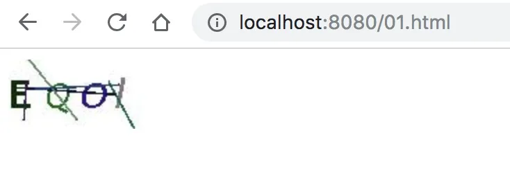
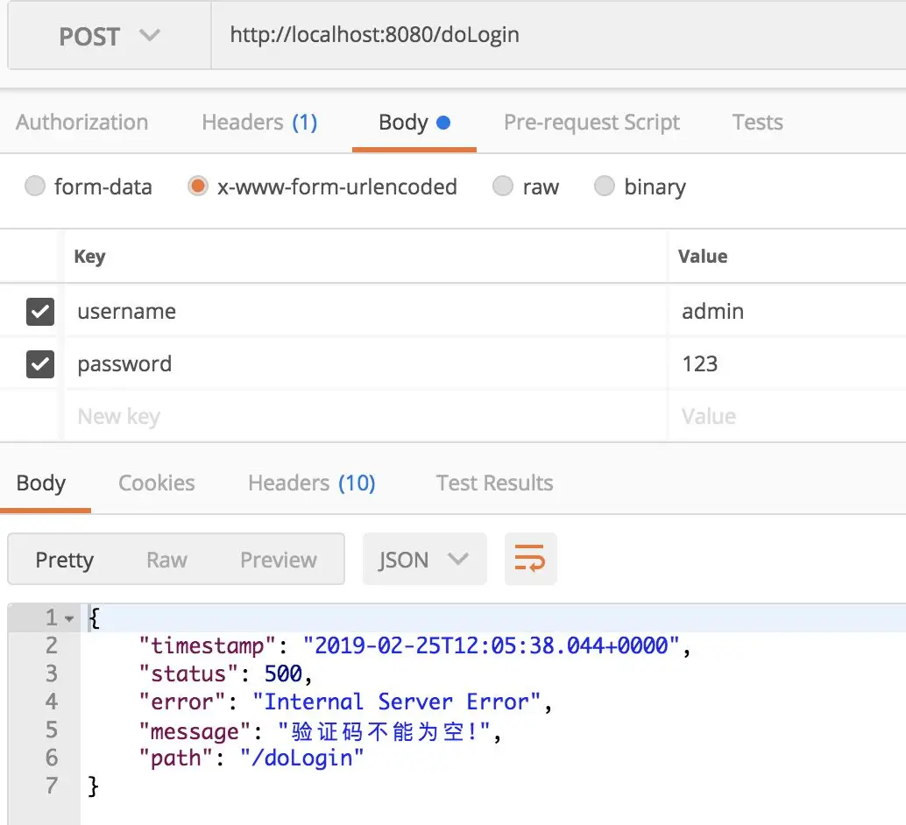

# Spring Security 如何添加登录验证码？松哥手把手教你给微人事添加登录验证码

Original 江南一点雨 [江南一点雨](javascript:void(0);) *2020年03月03日 10:27*

今日干货


刚刚发表

查看:66666回复:666

公众号后台回复 ssm，免费获取松哥纯手敲的 SSM 框架学习干货。


登录添加验证码是一个非常常见的需求，网上也有非常成熟的解决方案。在传统的登录流程中加入一个登录验证码也不是难事，但是如何在 Spring Security 中添加登录验证码，对于初学者来说还是一件蛮有挑战的事情，因为默认情况下，在 Spring Security 中我们并不需要自己写登录认证逻辑，只需要自己稍微配置一下就可以了，所以如果要添加登录验证码，就涉及到如何在 Spring Security 即有的认证体系中，加入自己的验证逻辑。

学习本文，需要大家对 Spring Security 的基本操作有一些了解，如果大家对于 Spring Security 的操作还不太熟悉，可以在公众号后台回复 springboot，获取松哥纯手敲的 274 页免费 Spring Boot 学习干货。

好了，那么接下来，我们就来看下我是如何通过自定义过滤器给微人事添加上登录验证码的。

服务端自定义过滤器添加验证码：


<svg data-v-8b461723="" xmlns="http://www.w3.org/2000/svg" viewBox="0 0 2 2" width="4px" height="4px" class="border_filler border_filler_lefttop"><path data-v-8b461723="" d="M1.85.005A2 2 0 000 2V0h2z" fill="#ffffff" fill-rule="evenodd"></path></svg>

<svg data-v-8b461723="" xmlns="http://www.w3.org/2000/svg" viewBox="0 0 2 2" width="4px" height="4px" class="border_filler border_filler_righttop"><path data-v-8b461723="" d="M1.85.005A2 2 0 000 2V0h2z" fill="#ffffff" fill-rule="evenodd"></path></svg>

<svg data-v-8b461723="" xmlns="http://www.w3.org/2000/svg" viewBox="0 0 2 2" width="4px" height="4px" class="border_filler border_filler_rightbot"><path data-v-8b461723="" d="M1.85.005A2 2 0 000 2V0h2z" fill="#ffffff" fill-rule="evenodd"></path></svg>

<svg data-v-8b461723="" xmlns="http://www.w3.org/2000/svg" viewBox="0 0 2 2" width="4px" height="4px" class="border_filler border_filler_leftbot"><path data-v-8b461723="" d="M1.85.005A2 2 0 000 2V0h2z" fill="#ffffff" fill-rule="evenodd"></path></svg>


，时长14:16


前段 Vue 展示验证码：


<svg data-v-8b461723="" xmlns="http://www.w3.org/2000/svg" viewBox="0 0 2 2" width="4px" height="4px" class="border_filler border_filler_lefttop"><path data-v-8b461723="" d="M1.85.005A2 2 0 000 2V0h2z" fill="#ffffff" fill-rule="evenodd"></path></svg>

<svg data-v-8b461723="" xmlns="http://www.w3.org/2000/svg" viewBox="0 0 2 2" width="4px" height="4px" class="border_filler border_filler_righttop"><path data-v-8b461723="" d="M1.85.005A2 2 0 000 2V0h2z" fill="#ffffff" fill-rule="evenodd"></path></svg>

<svg data-v-8b461723="" xmlns="http://www.w3.org/2000/svg" viewBox="0 0 2 2" width="4px" height="4px" class="border_filler border_filler_rightbot"><path data-v-8b461723="" d="M1.85.005A2 2 0 000 2V0h2z" fill="#ffffff" fill-rule="evenodd"></path></svg>

<svg data-v-8b461723="" xmlns="http://www.w3.org/2000/svg" viewBox="0 0 2 2" width="4px" height="4px" class="border_filler border_filler_leftbot"><path data-v-8b461723="" d="M1.85.005A2 2 0 000 2V0h2z" fill="#ffffff" fill-rule="evenodd"></path></svg>


，时长07:03


好了，不知道小伙伴们有没有看懂呢？视频中涉及到的所有代码我已经提交到 GitHub 上了：https://github.com/lenve/vhr。如果小伙伴们对完整的微人事视频教程感兴趣，可以点击这里:[Spring Boot + Vue 视频教程喜迎大结局，西交大的老师竟然都要来一套！](https://mp.weixin.qq.com/s?__biz=MzI1NDY0MTkzNQ==&mid=2247487551&idx=1&sn=c1900706eee5c2632f089d9a4bca94ee&scene=21#wechat_redirect)

最后，还有一个去年写的关于验证码的笔记，小伙伴们也可以参考下。

### 准备验证码

要有验证码，首先得先准备好验证码，本文采用 Java 自画的验证码，代码如下：

```
/**
 * 生成验证码的工具类
 */
publicclass VerifyCode {

	privateint width = 100;// 生成验证码图片的宽度
	privateint height = 50;// 生成验证码图片的高度
	private String[] fontNames = { "宋体", "楷体", "隶书", "微软雅黑" };
	private Color bgColor = new Color(255, 255, 255);// 定义验证码图片的背景颜色为白色
	private Random random = new Random();
	private String codes = "0123456789abcdefghijklmnopqrstuvwxyzABCDEFGHIJKLMNOPQRSTUVWXYZ";
	private String text;// 记录随机字符串

	/**
	 * 获取一个随意颜色
	 *
	 * @return
	 */
	private Color randomColor() {
		int red = random.nextInt(150);
		int green = random.nextInt(150);
		int blue = random.nextInt(150);
		returnnew Color(red, green, blue);
	}

	/**
	 * 获取一个随机字体
	 *
	 * @return
	 */
	private Font randomFont() {
		String name = fontNames[random.nextInt(fontNames.length)];
		int style = random.nextInt(4);
		int size = random.nextInt(5) + 24;
		returnnew Font(name, style, size);
	}

	/**
	 * 获取一个随机字符
	 *
	 * @return
	 */
	private char randomChar() {
		return codes.charAt(random.nextInt(codes.length()));
	}

	/**
	 * 创建一个空白的BufferedImage对象
	 *
	 * @return
	 */
	private BufferedImage createImage() {
		BufferedImage image = new BufferedImage(width, height, BufferedImage.TYPE_INT_RGB);
		Graphics2D g2 = (Graphics2D) image.getGraphics();
		g2.setColor(bgColor);// 设置验证码图片的背景颜色
		g2.fillRect(0, 0, width, height);
		return image;
	}

	public BufferedImage getImage() {
		BufferedImage image = createImage();
		Graphics2D g2 = (Graphics2D) image.getGraphics();
		StringBuffer sb = new StringBuffer();
		for (int i = 0; i < 4; i++) {
			String s = randomChar() + "";
			sb.append(s);
			g2.setColor(randomColor());
			g2.setFont(randomFont());
			float x = i * width * 1.0f / 4;
			g2.drawString(s, x, height - 15);
		}
		this.text = sb.toString();
		drawLine(image);
		return image;
	}

	/**
	 * 绘制干扰线
	 *
	 * @param image
	 */
	private void drawLine(BufferedImage image) {
		Graphics2D g2 = (Graphics2D) image.getGraphics();
		int num = 5;
		for (int i = 0; i < num; i++) {
			int x1 = random.nextInt(width);
			int y1 = random.nextInt(height);
			int x2 = random.nextInt(width);
			int y2 = random.nextInt(height);
			g2.setColor(randomColor());
			g2.setStroke(new BasicStroke(1.5f));
			g2.drawLine(x1, y1, x2, y2);
		}
	}

	public String getText() {
		return text;
	}

	public static void output(BufferedImage image, OutputStream out) throws IOException {
		ImageIO.write(image, "JPEG", out);
	}
}
```

这个工具类很常见，网上也有很多，就是画一个简单的验证码，通过流将验证码写到前端页面，提供验证码的 Controller 如下：

```
@RestController
publicclass VerifyCodeController {
    @GetMapping("/vercode")
    public void code(HttpServletRequest req, HttpServletResponse resp) throws IOException {
        VerifyCode vc = new VerifyCode();
        BufferedImage image = vc.getImage();
        String text = vc.getText();
        HttpSession session = req.getSession();
        session.setAttribute("index_code", text);
        VerifyCode.output(image, resp.getOutputStream());
    }
}
```

这里创建了一个 VerifyCode 对象，将生成的验证码字符保存到 session 中，然后通过流将图片写到前端，img 标签如下：

```

```

展示效果如下：



### 自定义过滤器

在登陆页展示验证码这个就不需要我多说了，接下来我们来看看如何自定义验证码处理器：

```
@Component
publicclass VerifyCodeFilter extends GenericFilterBean {
    private String defaultFilterProcessUrl = "/doLogin";

    @Override
    public void doFilter(ServletRequest req, ServletResponse res, FilterChain chain)
            throws IOException, ServletException {
        HttpServletRequest request = (HttpServletRequest) req;
        HttpServletResponse response = (HttpServletResponse) res;
        if ("POST".equalsIgnoreCase(request.getMethod()) && defaultFilterProcessUrl.equals(request.getServletPath())) {
            // 验证码验证
            String requestCaptcha = request.getParameter("code");
            String genCaptcha = (String) request.getSession().getAttribute("index_code");
            if (StringUtils.isEmpty(requestCaptcha))
                thrownew AuthenticationServiceException("验证码不能为空!");
            if (!genCaptcha.toLowerCase().equals(requestCaptcha.toLowerCase())) {
                thrownew AuthenticationServiceException("验证码错误!");
            }
        }
        chain.doFilter(request, response);
    }
}
```

自定义过滤器继承自 GenericFilterBean，并实现其中的 doFilter 方法，在 doFilter 方法中，当请求方法是 POST，并且请求地址是 `/doLogin` 时，获取参数中的 code 字段值，该字段保存了用户从前端页面传来的验证码，然后获取 session 中保存的验证码，如果用户没有传来验证码，则抛出验证码不能为空异常，如果用户传入了验证码，则判断验证码是否正确，如果不正确则抛出异常，否则执行 `chain.doFilter(request, response);` 使请求继续向下走。

### 配置

最后在 Spring Security 的配置中，配置过滤器，如下：

```
@Configuration
publicclass SecurityConfig extends WebSecurityConfigurerAdapter {

    @Autowired
    VerifyCodeFilter verifyCodeFilter;
    ...
    ...
    @Override
    protected void configure(HttpSecurity http) throws Exception {
        http.addFilterBefore(verifyCodeFilter, UsernamePasswordAuthenticationFilter.class);
        http.authorizeRequests()
                .antMatchers("/admin/**").hasRole("admin")
                ...
                ...
                .permitAll()
                .and()
                .csrf().disable();
    }
}
```

这里只贴出了部分核心代码，即 `http.addFilterBefore(verifyCodeFilter, UsernamePasswordAuthenticationFilter.class);` ，如此之后，整个配置就算完成了。

接下来在登录中，就需要传入验证码了，如果不传或者传错，都会抛出异常，例如不传的话，抛出如下异常：



本文案例，我已经上传到 GitHub ，欢迎大家 star：https://github.com/lenve/javaboy-code-samples

好了，本文就先说到这里，有问题欢迎留言讨论。

**精彩文章推荐：**

[Spring Boot 要怎么学？要学哪些东西？要不要先学 SSM？松哥说说看法](http://mp.weixin.qq.com/s?__biz=MzI1NDY0MTkzNQ==&mid=2247487918&idx=1&sn=12f4a387e904750d333671cb96028d54&chksm=e9c343cedeb4cad8aa6e36a24f9e86877afbbb3429fb2f9023d5c2c9bfb3bd69b1fdbd9978af&scene=21#wechat_redirect)

[274 页 pdf 文档，Spring Boot 教程也有离线版了](http://mp.weixin.qq.com/s?__biz=MzI1NDY0MTkzNQ==&mid=2247487663&idx=1&sn=32f69ef10578191ad8540b9b99d83002&chksm=e9c342cfdeb4cbd9aba62f6ed84f64788c6cbcd60a348d83ef28803ec2f8169edf4a38d9f81a&scene=21#wechat_redirect)


**喜欢就点个****"在看"****呗^_^**

SpringSecurity系列52

SpringSecurity系列 · 目录


上一篇松哥手把手带你捋一遍 Spring Security 登录流程下一篇前后端分离中，使用 JSON 格式登录原来这么简单！


# 