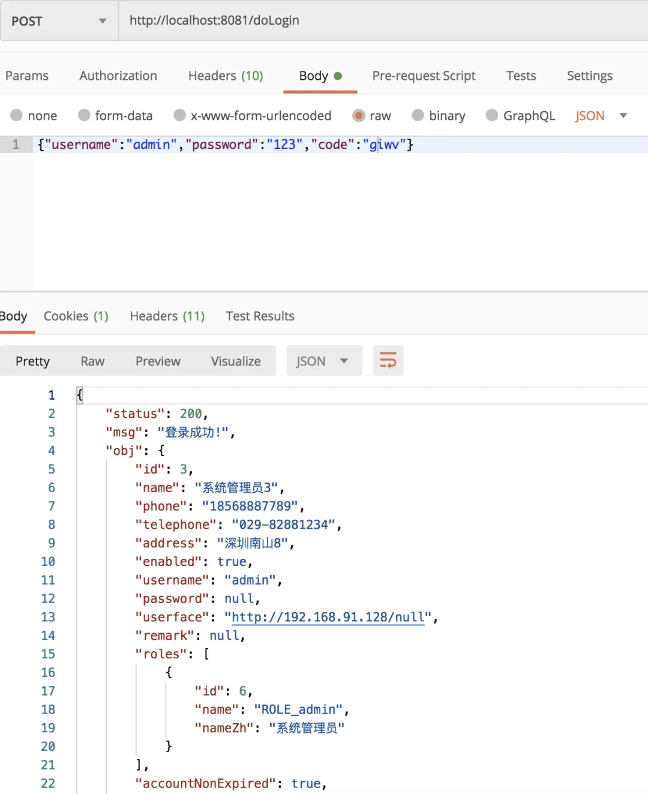
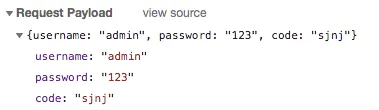

# 前后端分离中，使用 JSON 格式登录原来这么简单！

Original 江南一点雨 [江南一点雨](javascript:void(0);) *2020年03月31日 08:09*

今日干货


刚刚发表

查看:66666回复:666

公众号后台回复 ssm，免费获取松哥纯手敲的 SSM 框架学习干货。


<svg data-v-8b461723="" xmlns="http://www.w3.org/2000/svg" viewBox="0 0 2 2" width="4px" height="4px" class="border_filler border_filler_lefttop"><path data-v-8b461723="" d="M1.85.005A2 2 0 000 2V0h2z" fill="#ffffff" fill-rule="evenodd"></path></svg>

<svg data-v-8b461723="" xmlns="http://www.w3.org/2000/svg" viewBox="0 0 2 2" width="4px" height="4px" class="border_filler border_filler_righttop"><path data-v-8b461723="" d="M1.85.005A2 2 0 000 2V0h2z" fill="#ffffff" fill-rule="evenodd"></path></svg>

<svg data-v-8b461723="" xmlns="http://www.w3.org/2000/svg" viewBox="0 0 2 2" width="4px" height="4px" class="border_filler border_filler_rightbot"><path data-v-8b461723="" d="M1.85.005A2 2 0 000 2V0h2z" fill="#ffffff" fill-rule="evenodd"></path></svg>

<svg data-v-8b461723="" xmlns="http://www.w3.org/2000/svg" viewBox="0 0 2 2" width="4px" height="4px" class="border_filler border_filler_leftbot"><path data-v-8b461723="" d="M1.85.005A2 2 0 000 2V0h2z" fill="#ffffff" fill-rule="evenodd"></path></svg>


，时长21:13


本视频节选自松哥自制的 Spring Boot+Vue+微人事系列视频，如果小伙伴们觉得松哥的视频风格还能接受，也可以看看这里 [Spring Boot + Vue 系列视频教程](https://mp.weixin.qq.com/s?__biz=MzI1NDY0MTkzNQ==&mid=2247488059&idx=1&sn=2ef3e7f14d262130ecab94a0b17de0ca&scene=21#wechat_redirect)

以下是视频笔记。

做微人事的小伙伴（https://github.com/lenve/vhr），应该都发现了在微人事中有一个极为特殊的请求，那就是登录。

登录请求是一个 POST 请求，但是数据传输格式是 key/value 的形式。整个项目里就只有这一个 POST 请求是这样，其他 POST 请求都是 JSON 格式的数据。

为什么做成这个样子呢？还是懒呗。

因为 Spring Security 中默认的登录数据格式就是 key/value 的形式，一直以来懒得改。最近刚好在录 Spring Security，就抽空把这里调整了下，这样前后端就能统一起来了。

好了，我们一起来看下怎么实现。

## 1.服务端接口调整

首先大家知道，用户登录的用户名/密码是在 `UsernamePasswordAuthenticationFilter` 类中处理的，具体的处理代码如下：

```
public Authentication attemptAuthentication(HttpServletRequest request,
		HttpServletResponse response) throws AuthenticationException {
	String username = obtainUsername(request);
	String password = obtainPassword(request);
    //省略
}
protected String obtainPassword(HttpServletRequest request) {
	return request.getParameter(passwordParameter);
}
protected String obtainUsername(HttpServletRequest request) {
	return request.getParameter(usernameParameter);
}
```

从这段代码中，我们就可以看出来为什么 Spring Security 默认是通过 key/value 的形式来传递登录参数，因为它处理的方式就是 request.getParameter。

所以我们要定义成 JSON 的，思路很简单，就是自定义来定义一个过滤器代替 `UsernamePasswordAuthenticationFilter` ，然后在获取参数的时候，换一种方式就行了。

**「这里有一个额外的点需要注意，就是我们的微人事现在还有验证码的功能，所以如果自定义过滤器，要连同验证码一起处理掉。」**

## 2.自定义过滤器

接下来我们来自定义一个过滤器代替 `UsernamePasswordAuthenticationFilter` ，如下：

```
publicclass LoginFilter extends UsernamePasswordAuthenticationFilter {
    @Override
    public Authentication attemptAuthentication(HttpServletRequest request, HttpServletResponse response) throws AuthenticationException {
        if (!request.getMethod().equals("POST")) {
            thrownew AuthenticationServiceException(
                    "Authentication method not supported: " + request.getMethod());
        }
        String verify_code = (String) request.getSession().getAttribute("verify_code");
        if (request.getContentType().equals(MediaType.APPLICATION_JSON_VALUE) || request.getContentType().equals(MediaType.APPLICATION_JSON_UTF8_VALUE)) {
            Map<String, String> loginData = new HashMap<>();
            try {
                loginData = new ObjectMapper().readValue(request.getInputStream(), Map.class);
            } catch (IOException e) {
            }finally {
                String code = loginData.get("code");
                checkCode(response, code, verify_code);
            }
            String username = loginData.get(getUsernameParameter());
            String password = loginData.get(getPasswordParameter());
            if (username == null) {
                username = "";
            }
            if (password == null) {
                password = "";
            }
            username = username.trim();
            UsernamePasswordAuthenticationToken authRequest = new UsernamePasswordAuthenticationToken(
                    username, password);
            setDetails(request, authRequest);
            returnthis.getAuthenticationManager().authenticate(authRequest);
        } else {
            checkCode(response, request.getParameter("code"), verify_code);
            returnsuper.attemptAuthentication(request, response);
        }
    }

    public void checkCode(HttpServletResponse resp, String code, String verify_code) {
        if (code == null || verify_code == null || "".equals(code) || !verify_code.toLowerCase().equals(code.toLowerCase())) {
            //验证码不正确
            thrownew AuthenticationServiceException("验证码不正确");
        }
    }
}
```

这段逻辑我们基本上是模仿官方提供的 `UsernamePasswordAuthenticationFilter` 来写的，我来给大家稍微解释下：

1. 首先登录请求肯定是 POST，如果不是 POST ，直接抛出异常，后面的也不处理了。
2. 因为要在这里处理验证码，所以第二步从 session 中把已经下发过的验证码的值拿出来。
3. 接下来通过 contentType 来判断当前请求是否通过 JSON 来传递参数，如果是通过 JSON 传递参数，则按照 JSON 的方式解析，如果不是，则调用 super.attemptAuthentication 方法，进入父类的处理逻辑中，也就是说，我们自定义的这个类，既支持 JSON 形式传递参数，也支持 key/value 形式传递参数。
4. 如果是 JSON 形式的数据，我们就通过读取 request 中的 I/O 流，将 JSON 映射到一个 Map 上。
5. 从 Map 中取出 code，先去判断验证码是否正确，如果验证码有错，则直接抛出异常。验证码的判断逻辑，大家可以参考：[松哥手把手教你给微人事添加登录验证码](https://mp.weixin.qq.com/s?__biz=MzI1NDY0MTkzNQ==&mid=2247487976&idx=1&sn=2556bc786f89e62bc7a52bc437eaab31&scene=21#wechat_redirect)。
6. 接下来从 Map 中取出 username 和 password，构造 UsernamePasswordAuthenticationToken 对象并作校验。

过滤器定义完成后，接下来用我们自定义的过滤器代替默认的 `UsernamePasswordAuthenticationFilter`，首先我们需要提供一个 LoginFilter 的实例：

```
@Bean
LoginFilter loginFilter() throws Exception {
    LoginFilter loginFilter = new LoginFilter();
    loginFilter.setAuthenticationSuccessHandler(new AuthenticationSuccessHandler() {
        @Override
        public void onAuthenticationSuccess(HttpServletRequest request, HttpServletResponse response, Authentication authentication) throws IOException, ServletException {
            response.setContentType("application/json;charset=utf-8");
            PrintWriter out = response.getWriter();
            Hr hr = (Hr) authentication.getPrincipal();
            hr.setPassword(null);
            RespBean ok = RespBean.ok("登录成功!", hr);
            String s = new ObjectMapper().writeValueAsString(ok);
            out.write(s);
            out.flush();
            out.close();
        }
    });
    loginFilter.setAuthenticationFailureHandler(new AuthenticationFailureHandler() {
        @Override
        public void onAuthenticationFailure(HttpServletRequest request, HttpServletResponse response, AuthenticationException exception) throws IOException, ServletException {
            response.setContentType("application/json;charset=utf-8");
            PrintWriter out = response.getWriter();
            RespBean respBean = RespBean.error(exception.getMessage());
            if (exception instanceof LockedException) {
                respBean.setMsg("账户被锁定，请联系管理员!");
            } elseif (exception instanceof CredentialsExpiredException) {
                respBean.setMsg("密码过期，请联系管理员!");
            } elseif (exception instanceof AccountExpiredException) {
                respBean.setMsg("账户过期，请联系管理员!");
            } elseif (exception instanceof DisabledException) {
                respBean.setMsg("账户被禁用，请联系管理员!");
            } elseif (exception instanceof BadCredentialsException) {
                respBean.setMsg("用户名或者密码输入错误，请重新输入!");
            }
            out.write(new ObjectMapper().writeValueAsString(respBean));
            out.flush();
            out.close();
        }
    });
    loginFilter.setAuthenticationManager(authenticationManagerBean());
    loginFilter.setFilterProcessesUrl("/doLogin");
    return loginFilter;
}
```

当我们代替了 `UsernamePasswordAuthenticationFilter` 之后，原本在 SecurityConfig#configure 方法中关于 form 表单的配置就会失效，那些失效的属性，都可以在配置 LoginFilter 实例的时候配置。

另外记得配置一个 AuthenticationManager，根据 WebSecurityConfigurerAdapter 中提供的配置即可。

FilterProcessUrl 则可以根据实际情况配置，如果不配置，默认的就是 `/login`。

最后，我们用自定义的 LoginFilter 实例代替 `UsernamePasswordAuthenticationFilter`，如下：

```
@Override
protected void configure(HttpSecurity http) throws Exception {
    http.authorizeRequests()
        ...
        //省略
    http.addFilterAt(loginFilter(), UsernamePasswordAuthenticationFilter.class);
}
```

调用 addFilterAt 方法完成替换操作。

篇幅原因，我这里只展示了部分代码，完整代码小伙伴们可以在 GitHub 上看到：https://github.com/lenve/vhr。

配置完成后，重启后端，先用 POSTMAN 测试登录接口，如下：



## 3.前端修改

原本我们的前端登录代码是这样的：

```
this.$refs.loginForm.validate((valid) => {
    if (valid) {
        this.loading = true;
        this.postKeyValueRequest('/doLogin', this.loginForm).then(resp => {
            this.loading = false;
            //省略
        })
    } else {
        returnfalse;
    }
});
```

首先我们去校验数据，在校验成功之后，通过 postKeyValueRequest 方法来发送登录请求，这个方法是我自己封装的通过 key/value 形式传递参数的 POST 请求，如下：

```
exportconst postKeyValueRequest = (url, params) => {
    return axios({
        method: 'post',
        url: `${base}${url}`,
        data: params,
        transformRequest: [function (data) {
            let ret = '';
            for (let i in data) {
                ret += encodeURIComponent(i) + '=' + encodeURIComponent(data[i]) + '&'
            }
            return ret;
        }],
        headers: {
            'Content-Type': 'application/x-www-form-urlencoded'
        }
    });
}
exportconst postRequest = (url, params) => {
    return axios({
        method: 'post',
        url: `${base}${url}`,
        data: params
    })
}
```

postKeyValueRequest 是我封装的通过 key/value 形式传递参数，postRequest 则是通过 JSON 形式传递参数。

所以，前端我们只需要对登录请求稍作调整，如下：

```
this.$refs.loginForm.validate((valid) => {
    if (valid) {
        this.loading = true;
        this.postRequest('/doLogin', this.loginForm).then(resp => {
            this.loading = false;
            //省略
        })
    } else {
        returnfalse;
    }
});
```

配置完成后，再去登录，浏览器按 F12 ，就可以看到登录请求的参数形式了：



好啦，这就是松哥和大家介绍的 SpringSecurity+JSON+验证码登录，**「如果觉得还不错，记得点一下右下角在看哦。」**

完整代码小伙伴们可以在 GitHub 上下载：https://github.com/lenve/vhr

SpringSecurity系列52

SpringSecurity系列 · 目录


上一篇Spring Security 如何添加登录验证码？松哥手把手教你给微人事添加登录验证码下一篇奇怪，Spring Security 登录成功后总是获取不到登录用户信息？


# 