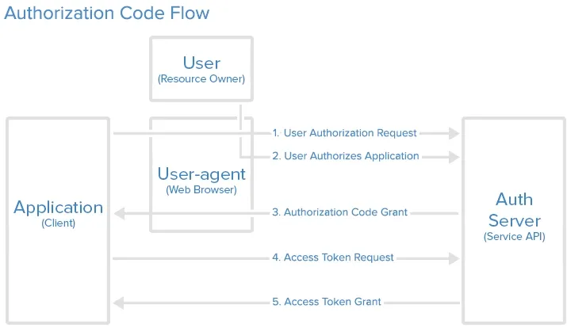
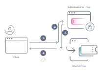
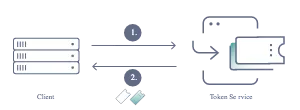
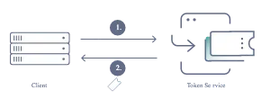
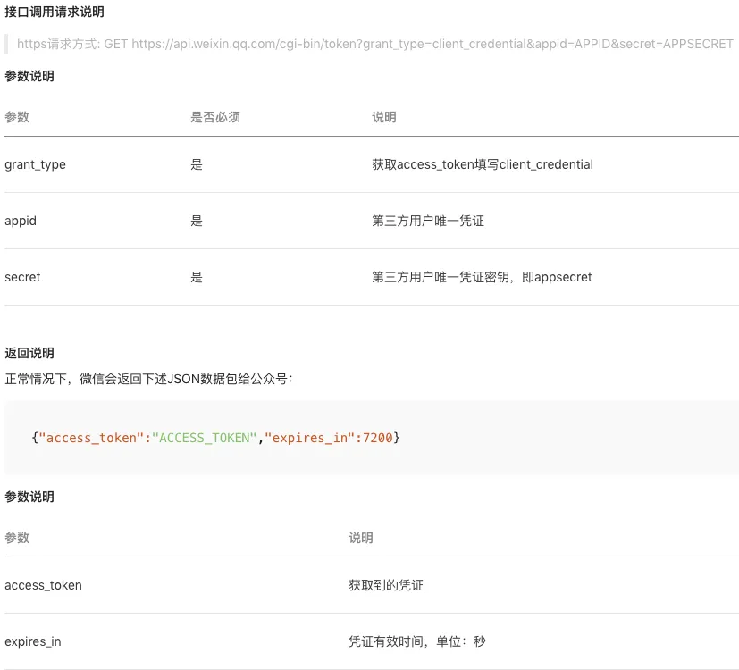

# 做微服务绕不过的 OAuth2，松哥也来和大家扯一扯

Original 江南一点雨 [江南一点雨](javascript:void(0);) *2020年04月13日 08:30*

今日干货



刚刚发表

查看:66666回复:666

公众号后台回复 ssm，免费获取松哥纯手敲的 SSM 框架学习干货。

最近在更新 Spring Security 系列，不知不觉已经更新了 6 篇了，要聊 Spring Security，当然就绕不过 OAuth2，但是有很多小伙伴等不及了，不停的追问 OAuth2 的相关技能点，所以我也抽空撸几篇文章，来和大家把 OAuth2 好好的捋一捋，也顺便回顾一下松哥关于 OAuth2 的一些使用经验。

OAuth2 很多小伙伴看过千千万万遍，四种授权模式、认证流程早已烂熟于心，但是就是写不出来代码。所以松哥这次将结合自己的使用经验，再搞一个完整的配套案例，分享给大家。当然这里涉及到的条条框框可能就比较多了，所以我这里可能会分几篇文章来讲解，本文是第一篇。

当然呢，大家学习这篇文章，建议还是先把已经更新的 Spring Security 系列看一看，入个门：

1. [挖一个大坑，Spring Security 开搞！](https://mp.weixin.qq.com/s?__biz=MzI1NDY0MTkzNQ==&mid=2247488106&idx=1&sn=258fc609661f22de5517e1bc5c0915ed&scene=21#wechat_redirect)
2. [松哥手把手带你入门 Spring Security，别再问密码怎么解密了](https://mp.weixin.qq.com/s?__biz=MzI1NDY0MTkzNQ==&mid=2247488113&idx=1&sn=01168c492e22fa287043eb746950da73&scene=21#wechat_redirect)
3. [手把手教你定制 Spring Security 中的表单登录](https://mp.weixin.qq.com/s?__biz=MzI1NDY0MTkzNQ==&mid=2247488138&idx=1&sn=25d18a61a14e4e6316537b6d45e43dd4&scene=21#wechat_redirect)
4. [Spring Security 做前后端分离，咱就别做页面跳转了！统统 JSON 交互](https://mp.weixin.qq.com/s?__biz=MzI1NDY0MTkzNQ==&mid=2247488157&idx=2&sn=845178d45e73232a94ed46df12ea76cc&scene=21#wechat_redirect)
5. [Spring Security 中的授权操作原来这么简单](https://mp.weixin.qq.com/s?__biz=MzI1NDY0MTkzNQ==&mid=2247488185&idx=1&sn=6fe677703312905d39615a001e191bd2&scene=21#wechat_redirect)
6. [Spring Security 如何将用户数据存入数据库？](https://mp.weixin.qq.com/s?__biz=MzI1NDY0MTkzNQ==&mid=2247488194&idx=1&sn=7103031896ba8b9d34095524b292265e&scene=21#wechat_redirect)

好了，不说废话，咱们来看 OAuth2。

## 1.为什么需要 OAuth2

关于我们为什么需要 OAuth2 的问题，网上的文章很多，我们常见的第三方登录就是一个 OAuth2 的典型应用，阮一峰大佬之前有一篇文章非常形象的解释了这个问题，内容如下（原文地址：https://www.ruanyifeng.com/blog/2019/04/oauth_design.html）：

### 1.1 快递员问题

我住在一个大型的居民小区。


小区有门禁系统。


进入的时候需要输入密码。


我经常网购和外卖，每天都有快递员来送货。我必须找到一个办法，让快递员通过门禁系统，进入小区。


如果我把自己的密码，告诉快递员，他就拥有了与我同样的权限，这样好像不太合适。万一我想取消他进入小区的权力，也很麻烦，我自己的密码也得跟着改了，还得通知其他的快递员。

有没有一种办法，让快递员能够自由进入小区，又不必知道小区居民的密码，而且他的唯一权限就是送货，其他需要密码的场合，他都没有权限？

### 1.2 授权机制的设计

于是，我设计了一套授权机制。

第一步，门禁系统的密码输入器下面，增加一个按钮，叫做"获取授权"。快递员需要首先按这个按钮，去申请授权。

第二步，他按下按钮以后，屋主（也就是我）的手机就会跳出对话框：有人正在要求授权。系统还会显示该快递员的姓名、工号和所属的快递公司。

我确认请求属实，就点击按钮，告诉门禁系统，我同意给予他进入小区的授权。

第三步，门禁系统得到我的确认以后，向快递员显示一个进入小区的令牌（access token）。令牌就是类似密码的一串数字，只在短期内（比如七天）有效。

第四步，快递员向门禁系统输入令牌，进入小区。

有人可能会问，为什么不是远程为快递员开门，而要为他单独生成一个令牌？这是因为快递员可能每天都会来送货，第二天他还可以复用这个令牌。另外，有的小区有多重门禁，快递员可以使用同一个令牌通过它们。

### 1.3 互联网场景

我们把上面的例子搬到互联网，就是 OAuth 的设计了。

首先，居民小区就是储存用户数据的网络服务。比如，微信储存了我的好友信息，获取这些信息，就必须经过微信的"门禁系统"。

其次，快递员（或者说快递公司）就是第三方应用，想要穿过门禁系统，进入小区。

最后，我就是用户本人，同意授权第三方应用进入小区，获取我的数据。

简单说，OAuth 就是一种授权机制。数据的所有者告诉系统，同意授权第三方应用进入系统，获取这些数据。系统从而产生一个短期的进入令牌（token），用来代替密码，供第三方应用使用。

### 1.4 令牌与密码

令牌（token）与密码（password）的作用是一样的，都可以进入系统，但是有三点差异。

（1）令牌是短期的，到期会自动失效，用户自己无法修改。密码一般长期有效，用户不修改，就不会发生变化。

（2）令牌可以被数据所有者撤销，会立即失效。以上例而言，屋主可以随时取消快递员的令牌。密码一般不允许被他人撤销。

（3）令牌有权限范围（scope），比如只能进小区的二号门。对于网络服务来说，只读令牌就比读写令牌更安全。密码一般是完整权限。

上面这些设计，保证了令牌既可以让第三方应用获得权限，同时又随时可控，不会危及系统安全。这就是 OAuth2.0 的优点。

注意，只要知道了令牌，就能进入系统。系统一般不会再次确认身份，所以令牌必须保密，泄漏令牌与泄漏密码的后果是一样的。这也是为什么令牌的有效期，一般都设置得很短的原因。

OAuth2.0 对于如何颁发令牌的细节，规定得非常详细。具体来说，一共分成四种授权类型（authorization grant），即四种颁发令牌的方式，适用于不同的互联网场景。

这段看完，相信大家已经大概明白 OAuth2 的作用了。

## 2.什么是 OAuth2

看完了阮一峰大佬的介绍，那么接下来松哥再从协议的角度来和大家聊一聊 OAuth2。

OAuth 是一个开放标准，该标准允许用户让第三方应用访问该用户在某一网站上存储的私密资源（如头像、照片、视频等），而在这个过程中无需将用户名和密码提供给第三方应用。实现这一功能是通过提供一个令牌（token），而不是用户名和密码来访问他们存放在特定服务提供者的数据。采用令牌（token）的方式可以让用户灵活的对第三方应用授权或者收回权限。

OAuth2 是 OAuth 协议的下一版本，但不向下兼容 OAuth 1.0。传统的 Web 开发登录认证一般都是基于 session 的，但是在前后端分离的架构中继续使用 session 就会有许多不便，因为移动端（Android、iOS、微信小程序等）要么不支持 cookie（微信小程序），要么使用非常不便，对于这些问题，使用 OAuth2 认证都能解决。

对于大家而言，我们在互联网应用中最常见的 OAuth2 应该就是各种第三方登录了，例如 QQ 授权登录、微信授权登录、微博授权登录、GitHub 授权登录等等。

## 3.四种模式

OAuth2 协议一共支持 4 种不同的授权模式：

1. 授权码模式：常见的第三方平台登录功能基本都是使用这种模式。
2. 简化模式：简化模式是不需要客户端服务器参与，直接在浏览器中向授权服务器申请令牌（token），一般如果网站是纯静态页面则可以采用这种方式。
3. 密码模式：密码模式是用户把用户名密码直接告诉客户端，客户端使用说这些信息向授权服务器申请令牌（token）。这需要用户对客户端高度信任，例如客户端应用和服务提供商就是同一家公司，我们自己做前后端分离登录就可以采用这种模式。
4. 客户端模式：客户端模式是指客户端使用自己的名义而不是用户的名义向服务提供者申请授权，严格来说，客户端模式并不能算作 OAuth 协议要解决的问题的一种解决方案，但是，对于开发者而言，在一些前后端分离应用或者为移动端提供的认证授权服务器上使用这种模式还是非常方便的。

### 3.1 授权码模式

授权码模式是最安全并且使用最广泛的一种模式。以松哥的 www.javaboy.org 为例，假如我要引入微信登录功能，那么我的流程可能是这样：

图片源自网络

在授权码模式中，我们分授权服务器和资源服务器，授权服务器用来派发 Token，拿着 Token 则可以去资源服务器获取资源，这两个服务器可以分开，也可以合并。

上面这张流程图的含义，具体是这样：

1. 首先，我会在我的 www.javaboy.org 这个网页上放一个超链接（我的网站相当于是第三方应用），用户 A （服务方的用户，例如微信用户）点击这个超链接就会去请求授权服务器（微信的授权服务器），用户点击的过程其实也就是我跟用户要授权的过程，这就是上图中的 1、2 步。
2. 接下来的第三步，就是用户点击了超链接之后，像授权服务器发送请求，一般来说，我放在 www.javaboy.org 网页上的超链接可能有如下参数：

- 

```
https://wx.qq.com/oauth/authorize?response_type=code&client_id=javaboy&redirect_uri=www.javaboy.org&scope=all
```

这里边有好几个参数，在后面的代码中我们都会用到，这里先和大家简单解释一下：

- response_type 表示授权类型，使用授权码模式的时候这里固定为 code，表示要求返回授权码（将来拿着这个授权码去获取 access_token）。
- client_id 表示客户端 id，也就是我应用的 id。有的小伙伴对这个不好理解，我说一下，如果我想让我的 www.javaboy.org 接入微信登录功能，我肯定得去微信开放平台注册，去填入我自己应用的基本信息等等，弄完之后，微信会给我一个 APPID，也就是我这里的 client_id，所以，从这里可以看出，授权服务器在校验的时候，会做两件事：1.校验客户端的身份；2.校验用户身份。
- redirect_uri 表示用户登录在成功/失败后，跳转的地址（成功登录微信后，跳转到 www.javaboy.org 中的哪个页面），跳转的时候，还会携带上一个授权码参数。
- scope 表示授权范围，即 www.javaboy.org 这个网站拿着用户的 token 都能干啥（一般来说就是获取用户非敏感的基本信息）。

1. 接下来第四步，www.javaboy.org 这个网站，拿着第三步获取到的 code 以及自己的 client_id 和 client_secret 以及其他一些信息去授权服务器请求令牌，微信的授权服务器在校验过这些数据之后，就会发送一个令牌回来。这个过程一般是在后端完成的，而不是利用 js 去完成。
2. 接下来拿着这个 token，我们就可以去请求用户信息了。

一般情况下我们认为授权码模式是四种模式中最安全的一种模式，因为这种模式我们的 access_token 不用经过浏览器或者移动端 App，是直接从我们的后台发送到授权服务器上，这样就很大程度减少了 access_token 泄漏的风险。

OK，这是我们介绍的授权码模式。

### 3.2 简化模式

简化模式是怎么一回事呢？

松哥之前发过两篇文章教大家搭建自己的博客：

- [不用花一分线，松哥手把手教你上线个人博客](https://mp.weixin.qq.com/s?__biz=MzI1NDY0MTkzNQ==&mid=2247487606&idx=1&sn=f836792babe2669def090163cd470898&scene=21#wechat_redirect)
- [不花一分钱，把自己零散的知识整理成体系，制作成在线电子书](https://mp.weixin.qq.com/s?__biz=MzI1NDY0MTkzNQ==&mid=2247487705&idx=1&sn=4d14f2f5bf2f8054a1539fb700a7ba20&scene=21#wechat_redirect)

这两种技术栈搭建的博客/电子书都是典型的纯前端应用，就是只有页面，没有后端，对于这种情况，如果我想接入微信登录该怎么办呢？这就用到了我们说的简化模式。

我们来看下简化模式的流程图：

图片源自网络

这个流程是这样：

1. 在我 www.javaboy.org 网站上有一个微信登录的超链接，这个超链接类似下面这样：

- 

```
https://wx.qq.com/oauth/authorize?response_type=token&client_id=javaboy&redirect_uri=www.javaboy.org&scope=all
```

这里的参数和前面授权码模式的基本相同，只有 response_type 的值不一样，这里是 token，表示要求授权服务器直接返回 access_token。

1. 用户点击我这个超链接之后，就会跳转到微信登录页面，然后用户进行登录。
2. 用户登录成功后，微信会自动重定向到 redirect_uri 参数指定的跳转网址，同时携带上 access_token，这样用户在前端就获取到 access_token 了。

简化模式的弊端很明显，因为没有后端，所以非常不安全，除非你对安全性要求不高，否则不建议使用。

### 3.3 密码模式

密码模式在 Spring Cloud 项目中有着非常广泛的应用，这块松哥在本系列后面的文章中会重点讲解，这里我们先来了解下密码模式是怎么一回事。

密码模式有一个前提就是你高度信任第三方应用，举个不恰当的例子：如果我要在 www.javaboy.org 这个网站上接入微信登录，我使用了密码模式，那你就要在 www.javaboy.org 这个网站去输入微信的用户名密码，这肯定是不靠谱的，所以密码模式需要你非常信任第三方应用。

微服务中有一个特殊的场景，就是服务之间的调用，用密码模式做鉴权是非常恰当不过的了。这个以后再细说。

我们来看下密码模式的流程：



密码式的流程比较简单：

1. 首先 www.javaboy.org 会发送一个 post 请求，类似下面这样的：

- 

```
https://wx.qq.com/oauth/authorize?response_type=password&client_id=javaboy&username=江南一点雨&password=123
```

这里的参数和前面授权码模式的略有差异，response_type 的值不一样，这里是 password，表示密码式，另外多了用户名/密码参数，没有重定向的 redirect_uri ，因为这里不需要重定向。

1. 微信校验过用户名/密码之后，直接在 HTTP 响应中把 access_token 返回给客户端。

OK，这就是密码模式的流程。

### 3.4 客户端模式

有的应用可能没有前端页面，就是一个后台，例如松哥之前发的两篇公众号后台开发的文章：

- [Spring Boot 开发微信公众号后台，看看松哥公众号后台是怎么实现的！](https://mp.weixin.qq.com/s?__biz=MzI1NDY0MTkzNQ==&mid=2247486810&idx=1&sn=7a4edfa233abb041655deaf49d45c800&scene=21#wechat_redirect)
- [Spring Boot 如何给微信公众号返回消息](https://mp.weixin.qq.com/s?__biz=MzI1NDY0MTkzNQ==&mid=2247486824&idx=1&sn=e0ad61b14d9b4b274d80bd145e49ded5&scene=21#wechat_redirect)

这种应用开发好了就没有后台。

我们来看一个客户端模式的流程图：



这个步骤也很简单，就两步：

1. 客户端发送一个请求到授权服务器，请求格式如下：

- 

```
GET https://api.weixin.qq.com/cgi-bin/token?grant_type=client_credential&client_id=APPID&client_secret=APPSECRET
```

这里有三个参数，含义如下：

- grant_type，获取access_token填写client_credential
- client_id 和 client_secret 用来确认客户端的身份

1. 授权服务器通过验证后，会直接返回 access_token 给客户端。

大家发现，在这个过程中好像没有用户什么事了！是的，客户端模式给出的令牌，就是针对第三方应用的，而不是针对用户的。

在接入微信公众号后台的时候，有一个获取 Access_token 的步骤，其实就是这种模式，我截了一张微信开发平台文档的图，大家看下：



可以看到，这其实就是客户端模式。

## 4.小结

其实基于微信公众号的开发，对于 OAuth2 玩的很溜，如果小伙伴们感兴趣，可以看看微信公众号的开发文档，结合松哥这篇文章，相信大家对于 OAuth2 会有一个更加深刻的认识。

微信公众平台地址：https://developers.weixin.qq.com/doc/offiaccount/Getting_Started/Overview.html

好了，今天就先和大家说这么多，下篇文章，我们上代码来讲解 Spring Cloud Security OAuth2。

如果觉得有用，小伙伴们记得点个在看鼓励下松哥哦～

参考资料：

1. https://curity.io/resources/oauth/
2. http://www.ruanyifeng.com/blog/2019/04/oauth-grant-types.html
3. https://segmentfault.com/a/1190000010540911
4. https://developers.weixin.qq.com/doc/offiaccount/Getting_Started/Overview.html

**精彩文章推荐：**

[Spring Boot 要怎么学？要学哪些东西？要不要先学 SSM？松哥说说看法](http://mp.weixin.qq.com/s?__biz=MzI1NDY0MTkzNQ==&mid=2247487918&idx=1&sn=12f4a387e904750d333671cb96028d54&chksm=e9c343cedeb4cad8aa6e36a24f9e86877afbbb3429fb2f9023d5c2c9bfb3bd69b1fdbd9978af&scene=21#wechat_redirect)

[274 页 pdf 文档，Spring Boot 教程也有离线版了](http://mp.weixin.qq.com/s?__biz=MzI1NDY0MTkzNQ==&mid=2247487663&idx=1&sn=32f69ef10578191ad8540b9b99d83002&chksm=e9c342cfdeb4cbd9aba62f6ed84f64788c6cbcd60a348d83ef28803ec2f8169edf4a38d9f81a&scene=21#wechat_redirect)


**喜欢就点个****"在看"****呗^_^**

OAuth2系列10

OAuth2系列 · 目录


下一篇这个案例写出来，还怕跟面试官扯不明白 OAuth2 登录流程？


# 


Scan to Follow