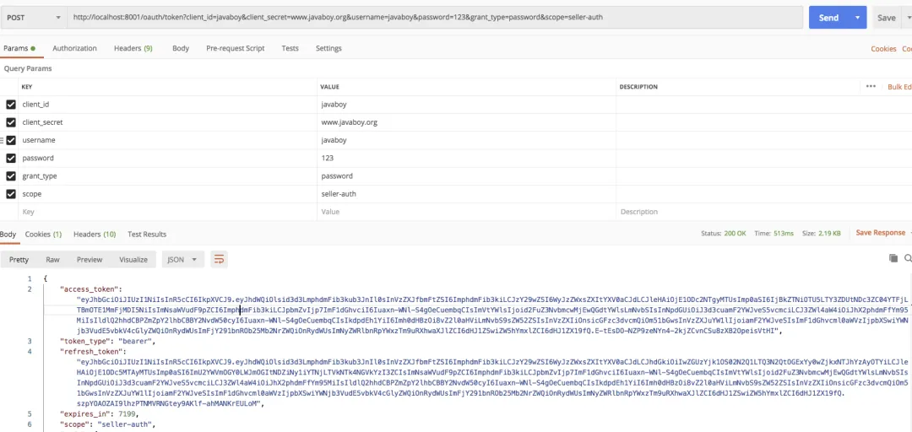
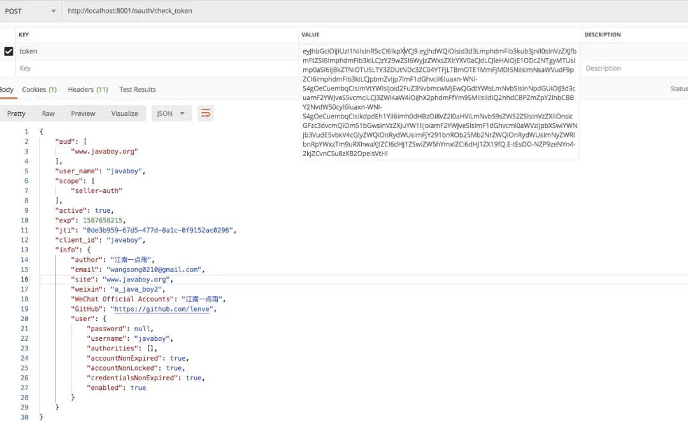
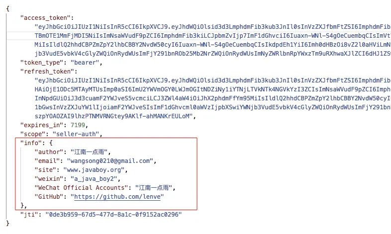

# Spring Boot+OAuth2，如何自定义返回的 Token 信息？

Original 江南一点雨 [江南一点雨](javascript:void(0);) *2020年04月27日 08:08*

今日干货


刚刚发表

查看:66666回复:666

公众号后台回复 ssm，免费获取松哥纯手敲的 SSM 框架学习干货。


**江南一点雨**推荐搜索

springbootspringsecurity

在本系列前面的文章中，正常情况下，OAuth2 返回的 access_token 信息一共包含五项：

分别是：

- access_token
- token_type
- refresh_token
- expires_in
- scope

具体如下：

```
{
    "access_token": "b9c9e345-90c9-49f5-80ab-6ce5ed5a07c9",
    "token_type": "bearer",
    "refresh_token": "9f843e0e-1778-495d-859a-52a1a806c150",
    "expires_in": 7199,
    "scope": "seller-auth"
}
```

但是在实际操作中，我们往往需要在这个基础上，定制自己的返回信息，这就需要我们对这个东西进行自定义。本文松哥就来和大家聊一聊这里要如何自定义。

**「敲黑板划重点：」** 本文还是我们最近 OAuth2 系列的延续，如果没看过本系列之前的文章，一定先阅读一下，这有助于更好的理解本文：

1. [做微服务绕不过的 OAuth2，松哥也来和大家扯一扯](https://mp.weixin.qq.com/s?__biz=MzI1NDY0MTkzNQ==&mid=2247488209&idx=2&sn=19b1e44fbb1f4c1210f0fa92a618d871&scene=21#wechat_redirect)
2. [这个案例写出来，还怕跟面试官扯不明白 OAuth2 登录流程？](https://mp.weixin.qq.com/s?__biz=MzI1NDY0MTkzNQ==&mid=2247488214&idx=1&sn=5601775213285217913c92768d415eca&scene=21#wechat_redirect)
3. [死磕 OAuth2，教练我要学全套的！](https://mp.weixin.qq.com/s?__biz=MzI1NDY0MTkzNQ==&mid=2247488223&idx=1&sn=d1003f33ac5c866c88aa7542fcdf4992&scene=21#wechat_redirect)
4. [OAuth2 令牌还能存入 Redis ？越玩越溜！](https://mp.weixin.qq.com/s?__biz=MzI1NDY0MTkzNQ==&mid=2247488246&idx=2&sn=b1ee410dbe86f2b748845304f7734d62&scene=21#wechat_redirect)
5. [想让 OAuth2 和 JWT 在一起愉快玩耍？请看松哥的表演](https://mp.weixin.qq.com/s?__biz=MzI1NDY0MTkzNQ==&mid=2247488267&idx=2&sn=0ac88e1685ef0915e71eb3c223bd732f&scene=21#wechat_redirect)
6. [最近在做 Spring Cloud 项目，松哥和大家分享一点微服务架构中的安全管理思路](https://mp.weixin.qq.com/s?__biz=MzI1NDY0MTkzNQ==&mid=2247488276&idx=1&sn=403ceff888f155bdb2f0d73931a60532&scene=21#wechat_redirect)
7. [Spring Boot+OAuth2，一个注解搞定单点登录！](https://mp.weixin.qq.com/s?__biz=MzI1NDY0MTkzNQ==&mid=2247488278&idx=1&sn=b21345a1daa86dd48ea89cdb9138def8&scene=21#wechat_redirect)
8. 分分钟让自己的网站接入 GitHub 第三方登录功能

好了，不废话了，我们来看今天的内容。

## 1.access_token 从哪里来

首先我们要搞清楚，access_token 从哪里来。

在前面的文章中，我们在生成 access_token 的时候，都配置了一个类，叫做 AuthorizationServerTokenServices，如下：

```
@Bean
AuthorizationServerTokenServices tokenServices() {
    DefaultTokenServices services = new DefaultTokenServices();
    services.setClientDetailsService(clientDetailsService());
    services.setSupportRefreshToken(true);
    services.setTokenStore(tokenStore);
    TokenEnhancerChain chain = new TokenEnhancerChain();
    chain.setTokenEnhancers(Arrays.asList(jwtAccessTokenConverter,externalAccessTokenInfo));
    services.setTokenEnhancer(chain);
    return services;
}
```

在这个配置中，我们提供了一个 DefaultTokenServices 实例，这个实例就是默认生成 access_token 的工具，我们进入到 DefaultTokenServices#createAccessToken 方法中，一路追踪，可以看到如下代码：

```
private OAuth2AccessToken createAccessToken(OAuth2Authentication authentication, OAuth2RefreshToken refreshToken) {
 DefaultOAuth2AccessToken token = new DefaultOAuth2AccessToken(UUID.randomUUID().toString());
 int validitySeconds = getAccessTokenValiditySeconds(authentication.getOAuth2Request());
 if (validitySeconds > 0) {
  token.setExpiration(new Date(System.currentTimeMillis() + (validitySeconds * 1000L)));
 }
 token.setRefreshToken(refreshToken);
 token.setScope(authentication.getOAuth2Request().getScope());
 return accessTokenEnhancer != null ? accessTokenEnhancer.enhance(token, authentication) : token;
}
```

从这段代码中，我们可以看到，用来保存 access_token 的实例，其实就是 DefaultOAuth2AccessToken，我们再来看看 DefaultOAuth2AccessToken 的定义：

```
public class DefaultOAuth2AccessToken implements Serializable, OAuth2AccessToken {
 private String value;
 private Date expiration;
 private String tokenType = BEARER_TYPE.toLowerCase();
 private OAuth2RefreshToken refreshToken;
 private Set<String> scope;
 private Map<String, Object> additionalInformation = Collections.emptyMap();
    //省略其他
}
```

从这段属性的声明中，我们就可以看出来，为什么默认返回的数据只有五项。

大家同时也发现，DefaultOAuth2AccessToken 中其实是提供了一个 additionalInformation 属性用来存储额外信息的，但是，我们在 DefaultTokenServices 类中并没有办法去自定义 DefaultOAuth2AccessToken 中的属性，也就是说，默认情况下，我们没有办法自己去给 additionalInformation 中添加值。

虽然默认情况下，无法添加，但是只要大家看了上面这段源码，就会明白，如果我们想要自定义返回的 access_token 信息，就要想办法自已去定义 DefaultOAuth2AccessToken 信息。

思路有了，接下来看操作。

## 2.两种定制方案

大家知道，我们在 OAuth2 中返回的令牌信息分为两大类：不透明令牌和透明令牌。

不透明令牌就是一种无可读性的令牌，一般来说就是一段普通的 UUID 字符串。不透明令牌的最大问题在于会降低系统性能和可用性，并且增加延迟（因为必须远程校验令牌）。

透明令牌的典型代表就是 JWT 了，用户信息都保存在 JWT 字符串中，关于 JWT 的信息，大家可以参考这篇文章：[想让 OAuth2 和 JWT 在一起愉快玩耍？请看松哥的表演](https://mp.weixin.qq.com/s?__biz=MzI1NDY0MTkzNQ==&mid=2247488267&idx=2&sn=0ac88e1685ef0915e71eb3c223bd732f&scene=21#wechat_redirect)。

在实际开发中，大部分情况下，我们的 OAuth2 都是搭配 JWT 一起来使用的，所以，这里我就主要讲一下在生成的 JWT 中如何定制返回信息。

如果我们使用了 OAuth2+JWT 的方案，那正常情况下，我们还需要配置一个 JwtAccessTokenConverter 的实例（参考：[想让 OAuth2 和 JWT 在一起愉快玩耍？请看松哥的表演](https://mp.weixin.qq.com/s?__biz=MzI1NDY0MTkzNQ==&mid=2247488267&idx=2&sn=0ac88e1685ef0915e71eb3c223bd732f&scene=21#wechat_redirect)），JWT 字符串将由 JwtAccessTokenConverter 实例负责生成。

JwtAccessTokenConverter 实例生成 JWT 的方法是在上文列出来的 DefaultTokenServices#createAccessToken 方法之后执行，该方法最后有一句：

```
accessTokenEnhancer != null ? accessTokenEnhancer.enhance(token, authentication) : token;
```

这就是说，如果提供了 accessTokenEnhancer ，就进入到 accessTokenEnhancer 的 enhance 方法中对 access_token 做二次处理，accessTokenEnhancer 则就是我们的 JwtAccessTokenConverter 实例。

从这里大家看到，想要自定义 Token 信息，我们有两个时机，第一个时机就是在 DefaultTokenServices#createAccessToken 方法中修改，但是工作量较大，不推荐；第二个时机是在进入到 JwtAccessTokenConverter#enhance 方法之后修改，这是目前比较可行的方法。

如果采用第二种方案，就需要我们自定义一个类继承自 JwtAccessTokenConverter，如下：

```
public class MyJwt extends JwtAccessTokenConverter {
    @Override
    public OAuth2AccessToken enhance(OAuth2AccessToken accessToken, OAuth2Authentication authentication) {
        Map<String, Object> additionalInformation = new LinkedHashMap<>();
        Map<String, Object> info = new LinkedHashMap<>();
        info.put("author", "江南一点雨");
        info.put("email", "wangsong0210@gmail.com");
        info.put("site", "www.javaboy.org");
        info.put("weixin", "a_java_boy2");
        info.put("WeChat Official Accounts", "江南一点雨");
        info.put("GitHub", "https://github.com/lenve");
        info.put("user", SecurityContextHolder.getContext().getAuthentication().getPrincipal());
        additionalInformation.put("info", info);
        ((DefaultOAuth2AccessToken) accessToken).setAdditionalInformation(additionalInformation);
        return super.enhance(accessToken, authentication);
    }
}
```

在这里，我们自定义 MyJwt 继承自 JwtAccessTokenConverter 并重写 enhance 方法：

1. 首先我们构造自己的附加信息，如果如需要当前登录用户信息，可以从 SecurityContextHolder 中获取。
2. 将附加信息放到 OAuth2AccessToken 的 additionalInformation 属性中去。

这样相当于我们就修改了默认生成的 DefaultOAuth2AccessToken 了，然后再把修改后的 DefaultOAuth2AccessToken 实例调用 super.enhance 方法去生成 jwt 字符串，这样生成的 jwt 字符串就有我们的自定义信息了。

最后，在 TokenConfig 中配置 MyJwt 的实例，如下：

```
@Configuration
public class TokenConfig {
    @Bean
    TokenStore tokenStore() {
        return new JwtTokenStore(jwtAccessTokenConverter());
    }

    @Bean
    JwtAccessTokenConverter jwtAccessTokenConverter() {
        JwtAccessTokenConverter converter = new MyJwt();
        converter.setSigningKey("www.javaboy.org");
        return converter;
    }
}
```

配置完成后，其他地方的代码不变（参考：[想让 OAuth2 和 JWT 在一起愉快玩耍？请看松哥的表演](https://mp.weixin.qq.com/s?__biz=MzI1NDY0MTkzNQ==&mid=2247488267&idx=2&sn=0ac88e1685ef0915e71eb3c223bd732f&scene=21#wechat_redirect)），我们启动项目来生成登录的 access_token 信息。

## 3.测试

接下来，我们启动项目进行测试：



可以看到，此时生成的 jwt 字符串就比较长了，我们将 access_token 拿到 /oauth/check_token 去校验一下就知道生成的具体信息了，如下：



可以看到，我们已经成功的将自定义信息存入 jwt 字符串中了。

当然，还有一种情况就是你可能只是想在调用 /oauth/token 接口的时候添加一些额外信息，并不想将额外信息添加到 jwt 中，就是下面这种效果：



这种效果，可以参考松哥之前文章的写法：[想让 OAuth2 和 JWT 在一起愉快玩耍？请看松哥的表演](https://mp.weixin.qq.com/s?__biz=MzI1NDY0MTkzNQ==&mid=2247488267&idx=2&sn=0ac88e1685ef0915e71eb3c223bd732f&scene=21#wechat_redirect)。

## 4.扩展

好了，前面虽然跟大家分享的是 OAuth2+JWT 如何生成自定义的 access_token 信息，但是相信大家看完之后，应该也会针对不透明令牌生成自定义信息。

我这里也和大家分享一下思路：

上面代码的核心思路，就是在从 DefaultTokenServices#createAccessToken 方法到 JwtAccessTokenConverter#enhance 方法的过程中，给 DefaultOAuth2AccessToken 对象的 additionalInformation 属性添加了附加信息。

而 JwtAccessTokenConverter 是 TokenEnhancer 的实例，所以如果我们想要定制不透明令牌的信息，只需要自己定义类实现 TokenEnhancer 接口，并且在 enhance 方法中添加附加信息即可。这个思路给大家，小伙伴们可以自行尝试一下。

好了，今天就和大家分享这么多。**如果觉得有收获，记得点个在看鼓励下松哥哦～**

最后再说一下，如果你觉得阅读本文有些吃力，一定阅读一下本系列前面的文章。

今日干货


刚刚发表

查看:13500回复:135

公众号后台回复 2TB，免费获取超 2TB Java 学习视频。

OAuth2系列10

OAuth2系列 · 目录


上一篇分分钟让自己的网站接入 GitHub 第三方登录功能


# 


Scan to Follow