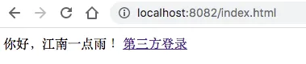
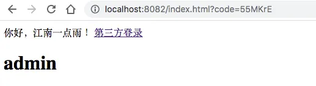
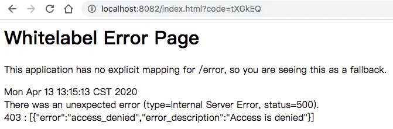

# 这个案例写出来，还怕跟面试官扯不明白 OAuth2 登录流程？

Original 江南一点雨 [江南一点雨](javascript:void(0);) *2020年04月14日 08:36*

今日干货


刚刚发表

查看:66666回复:666

公众号后台回复 ssm，免费获取松哥纯手敲的 SSM 框架学习干货。

昨天和小伙伴们介绍了 OAuth2 的基本概念，在讲解 Spring Cloud Security OAuth2 之前，我还是先来通过实际代码来和小伙伴们把 OAuth2 中的各个授权模式走一遍，今天我们来看最常用也最复杂的授权码模式。

本文我将通过一个**「完整的 Demo」** ，注意，是一个**「完整的 Demo」**，带领小伙伴们把授权码模式走一遍。

如果小伙伴们还没有看上篇文章可以先看下，这有助于你理解本文中的一些概念：

- [做微服务绕不过的 OAuth2，松哥也来和大家扯一扯](https://mp.weixin.qq.com/s?__biz=MzI1NDY0MTkzNQ==&mid=2247488209&idx=2&sn=19b1e44fbb1f4c1210f0fa92a618d871&scene=21#wechat_redirect)

## 1.案例架构

因为 OAuth2 涉及到的东西比较多，网上的案例大多都是简化的，对于很多初学者而言，简化的案例看的人云里雾里，所以松哥这次想自己搭建一个完整的测试案例，在这个案例中，主要包括如下服务：

- 第三方应用
- 授权服务器
- 资源服务器
- 用户

我用一个表格来给大家整理下：

| 项目        | 端口 | 备注       |
| :---------- | :--- | :--------- |
| auth-server | 8080 | 授权服务器 |
| user-server | 8081 | 资源服务器 |
| client-app  | 8082 | 第三方应用 |

就是说，我们常见的 OAuth2 授权码模式登录中，涉及到的各个角色，我都会自己提供，自己测试，这样可以最大限度的让小伙伴们了解到 OAuth2 的工作原理（文末可以下载案例源码）。

注意：小伙伴们一定先看下[上篇文章](https://mp.weixin.qq.com/s?__biz=MzI1NDY0MTkzNQ==&mid=2247488209&idx=2&sn=19b1e44fbb1f4c1210f0fa92a618d871&scene=21#wechat_redirect)松哥所讲的 OAuth2 授权码模式登录流程，再来学习本文。

那我们首先来创建一个空的 Maven 父工程，创建好之后，里边什么都不用加，也不用写代码。我们将在这个父工程中搭建这个子模块。

## 2.授权服务器搭建

首先我们搭建一个名为 auth-server 的授权服务，搭建的时候，选择如下三个依赖：

- web
- spring cloud security
- spirng cloud OAuth2


项目创建完成后，首先提供一个 Spring Security 的基本配置：

```
@Configuration
public class SecurityConfig extends WebSecurityConfigurerAdapter {
    @Bean
    PasswordEncoder passwordEncoder() {
        return new BCryptPasswordEncoder();
    }

    @Override
    protected void configure(AuthenticationManagerBuilder auth) throws Exception {
        auth.inMemoryAuthentication()
                .withUser("sang")
                .password(new BCryptPasswordEncoder().encode("123"))
                .roles("admin")
                .and()
                .withUser("javaboy")
                .password(new BCryptPasswordEncoder().encode("123"))
                .roles("user");
    }

    @Override
    protected void configure(HttpSecurity http) throws Exception {
        http.csrf().disable().formLogin();
    }
}
```

在这段代码中，为了代码简洁，我就不把 Spring Security 用户存到数据库中去了，直接存在内存中。

这里我创建了一个名为 sang 的用户，密码是 123，角色是 admin。同时我还配置了一个表单登录。

这段配置的目的，实际上就是配置用户。例如你想用微信登录第三方网站，在这个过程中，你得先登录微信，登录微信就要你的用户名/密码信息，那么我们在这里配置的，其实就是用户的用户名/密码/角色信息。

基本的用户信息配置完成后，接下来我们来配置授权服务器：

```
@Configuration
public class AccessTokenConfig {
    @Bean
    TokenStore tokenStore() {
        return new InMemoryTokenStore();
    }
}
@EnableAuthorizationServer
@Configuration
public class AuthorizationServer extends AuthorizationServerConfigurerAdapter {
    @Autowired
    TokenStore tokenStore;
    @Autowired
    ClientDetailsService clientDetailsService;

    @Bean
    AuthorizationServerTokenServices tokenServices() {
        DefaultTokenServices services = new DefaultTokenServices();
        services.setClientDetailsService(clientDetailsService);
        services.setSupportRefreshToken(true);
        services.setTokenStore(tokenStore);
        services.setAccessTokenValiditySeconds(60 * 60 * 2);
        services.setRefreshTokenValiditySeconds(60 * 60 * 24 * 3);
        return services;
    }

    @Override
    public void configure(AuthorizationServerSecurityConfigurer security) throws Exception {
        security.checkTokenAccess("permitAll()")
                .allowFormAuthenticationForClients();
    }

    @Override
    public void configure(ClientDetailsServiceConfigurer clients) throws Exception {
        clients.inMemory()
                .withClient("javaboy")
                .secret(new BCryptPasswordEncoder().encode("123"))
                .resourceIds("res1")
                .authorizedGrantTypes("authorization_code","refresh_token")
                .scopes("all")
                .redirectUris("http://localhost:8082/index.html");
    }

    @Override
    public void configure(AuthorizationServerEndpointsConfigurer endpoints) throws Exception {
        endpoints.authorizationCodeServices(authorizationCodeServices())
                .tokenServices(tokenServices());
    }
    @Bean
    AuthorizationCodeServices authorizationCodeServices() {
        return new InMemoryAuthorizationCodeServices();
    }
}
```

这段代码有点长，我来给大家挨个解释：

1. 首先我们提供了一个 TokenStore 的实例，这个是指你生成的 Token 要往哪里存储，我们可以存在 Redis 中，也可以存在内存中，也可以结合 JWT 等等，这里，我们就先把它存在内存中，所以提供一个 InMemoryTokenStore 的实例即可。
2. 接下来我们创建 AuthorizationServer 类继承自 AuthorizationServerConfigurerAdapter，来对授权服务器做进一步的详细配置，AuthorizationServer 类记得加上 @EnableAuthorizationServer 注解，表示开启授权服务器的自动化配置。
3. 在 AuthorizationServer 类中，我们其实主要重写三个 configure 方法。
4. AuthorizationServerSecurityConfigurer 用来配置令牌端点的安全约束，也就是这个端点谁能访问，谁不能访问。checkTokenAccess 是指一个 Token 校验的端点，这个端点我们设置为可以直接访问（在后面，当资源服务器收到 Token 之后，需要去校验 Token 的合法性，就会访问这个端点）。
5. ClientDetailsServiceConfigurer 用来配置客户端的详细信息，在[上篇文章](https://mp.weixin.qq.com/s?__biz=MzI1NDY0MTkzNQ==&mid=2247488209&idx=2&sn=19b1e44fbb1f4c1210f0fa92a618d871&scene=21#wechat_redirect)中，松哥和大家讲过，授权服务器要做两方面的检验，一方面是校验客户端，另一方面则是校验用户，校验用户，我们前面已经配置了，这里就是配置校验客户端。客户端的信息我们可以存在数据库中，这其实也是比较容易的，和用户信息存到数据库中类似，但是这里为了简化代码，我还是将客户端信息存在内存中，这里我们分别配置了客户端的 id，secret、资源 id、授权类型、授权范围以及重定向 uri。授权类型我在[上篇文章](https://mp.weixin.qq.com/s?__biz=MzI1NDY0MTkzNQ==&mid=2247488209&idx=2&sn=19b1e44fbb1f4c1210f0fa92a618d871&scene=21#wechat_redirect)中和大家一共讲了四种，四种之中不包含 refresh_token 这种类型，但是在实际操作中，refresh_token 也被算作一种。
6. AuthorizationServerEndpointsConfigurer 这里用来配置令牌的访问端点和令牌服务。authorizationCodeServices用来配置授权码的存储，这里我们是存在在内存中，tokenServices 用来配置令牌的存储，即 access_token 的存储位置，这里我们也先存储在内存中。有小伙伴会问，授权码和令牌有什么区别？授权码是用来获取令牌的，使用一次就失效，令牌则是用来获取资源的，如果搞不清楚，建议重新阅读上篇文章恶补一下：[做微服务绕不过的 OAuth2，松哥也来和大家扯一扯](https://mp.weixin.qq.com/s?__biz=MzI1NDY0MTkzNQ==&mid=2247488209&idx=2&sn=19b1e44fbb1f4c1210f0fa92a618d871&scene=21#wechat_redirect)
7. tokenServices 这个 Bean 主要用来配置 Token 的一些基本信息，例如 Token 是否支持刷新、Token 的存储位置、Token 的有效期以及刷新 Token 的有效期等等。Token 有效期这个好理解，刷新 Token 的有效期我说一下，当 Token 快要过期的时候，我们需要获取一个新的 Token，在获取新的 Token 时候，需要有一个凭证信息，这个凭证信息不是旧的 Token，而是另外一个 refresh_token，这个 refresh_token 也是有有效期的。

好了，如此之后，我们的授权服务器就算是配置完成了，接下来我们启动授权服务器。

## 3.资源服务器搭建

接下来我们搭建一个资源服务器。大家网上看到的例子，资源服务器大多都是和授权服务器放在一起的，如果项目比较小的话，这样做是没问题的，但是如果是一个大项目，这种做法就不合适了。

资源服务器就是用来存放用户的资源，例如你在微信上的图像、openid 等信息，用户从授权服务器上拿到 access_token 之后，接下来就可以通过 access_token 来资源服务器请求数据。

我们创建一个新的 Spring Boot 项目，叫做 user-server ，作为我们的资源服务器，创建时，添加如下依赖：


项目创建成功之后，添加如下配置：

```
@Configuration
@EnableResourceServer
public class ResourceServerConfig extends ResourceServerConfigurerAdapter {
    @Bean
    RemoteTokenServices tokenServices() {
        RemoteTokenServices services = new RemoteTokenServices();
        services.setCheckTokenEndpointUrl("http://localhost:8080/oauth/check_token");
        services.setClientId("javaboy");
        services.setClientSecret("123");
        return services;
    }
    @Override
    public void configure(ResourceServerSecurityConfigurer resources) throws Exception {
        resources.resourceId("res1").tokenServices(tokenServices());
    }

    @Override
    public void configure(HttpSecurity http) throws Exception {
        http.authorizeRequests()
                .antMatchers("/admin/**").hasRole("admin")
                .anyRequest().authenticated();
    }
}
```

这段配置代码很简单，我简单的说一下：

1. tokenServices 我们配置了一个 RemoteTokenServices 的实例，这是因为资源服务器和授权服务器是分开的，资源服务器和授权服务器是放在一起的，就不需要配置 RemoteTokenServices 了。
2. RemoteTokenServices 中我们配置了 access_token 的校验地址、client_id、client_secret 这三个信息，当用户来资源服务器请求资源时，会携带上一个 access_token，通过这里的配置，就能够校验出 token 是否正确等。
3. 最后配置一下资源的拦截规则，这就是 Spring Security 中的基本写法，我就不再赘述。

接下来我们再来配置两个测试接口：

```
@RestController
public class HelloController {
    @GetMapping("/hello")
    public String hello() {
        return "hello";
    }
    @GetMapping("/admin/hello")
    public String admin() {
        return "admin";
    }
}
```

如此之后，我们的资源服务器就算配置成功了。

## 4.第三方应用搭建

接下来搭建我们的第三方应用程序。

注意，第三方应用并非必须，下面所写的代码也可以用 POSTMAN 去测试，这个小伙伴们可以自行尝试。

第三方应用就是一个普通的 Spring Boot 工程，创建时加入 Thymeleaf 依赖和 Web 依赖：


在 resources/templates 目录下，创建 index.html ，内容如下：

```
<!DOCTYPE html>
<html lang="en" xmlns:th="http://www.thymeleaf.org">
<head>
    <meta charset="UTF-8">
    <title>江南一点雨</title>
</head>
<body>
你好，江南一点雨！

<a href="http://localhost:8080/oauth/authorize?client_id=javaboy&response_type=code&scope=all&redirect_uri=http://localhost:8082/index.html">第三方登录</a>

<h1 th:text="${msg}"></h1>
</body>
</html>
```

这是一段 Thymeleaf 模版，点击超链接就可以实现第三方登录，超链接的参数如下：

- client_id 客户端 ID，根据我们在授权服务器中的实际配置填写。
- response_type 表示响应类型，这里是 code 表示响应一个授权码。
- redirect_uri 表示授权成功后的重定向地址，这里表示回到第三方应用的首页。
- scope 表示授权范围。

h1 标签中的数据是来自资源服务器的，当授权服务器通过后，我们拿着 access_token 去资源服务器加载数据，加载到的数据就在 h1 标签中显示出来。

接下来我们来定义一个 HelloController：

```
@Controller
public class HelloController {
    @Autowired
    RestTemplate restTemplate;

    @GetMapping("/index.html")
    public String hello(String code, Model model) {
        if (code != null) {
            MultiValueMap<String, String> map = new LinkedMultiValueMap<>();
            map.add("code", code);
            map.add("client_id", "javaboy");
            map.add("client_secret", "123");
            map.add("redirect_uri", "http://localhost:8082/index.html");
            map.add("grant_type", "authorization_code");
            Map<String,String> resp = restTemplate.postForObject("http://localhost:8080/oauth/token", map, Map.class);
            String access_token = resp.get("access_token");
            System.out.println(access_token);
            HttpHeaders headers = new HttpHeaders();
            headers.add("Authorization", "Bearer " + access_token);
            HttpEntity<Object> httpEntity = new HttpEntity<>(headers);
            ResponseEntity<String> entity = restTemplate.exchange("http://localhost:8081/admin/hello", HttpMethod.GET, httpEntity, String.class);
            model.addAttribute("msg", entity.getBody());
        }
        return "index";
    }
}
```

在这个 HelloController 中，我们定义出 /index.html 的地址。

如果 code 不为 null，也就是如果是通过授权服务器重定向到这个地址来的，那么我们做如下两个操作：

1. 根据拿到的 code，去请求 `http://localhost:8080/oauth/token` 地址去获取 Token，返回的数据结构如下：

```
{
    "access_token": "e7f223c4-7543-43c0-b5a6-5011743b5af4",
    "token_type": "bearer",
    "refresh_token": "aafc167b-a112-456e-bbd8-58cb56d915dd",
    "expires_in": 7199,
    "scope": "all"
}
```

access_token 就是我们请求数据所需要的令牌，refresh_token 则是我们刷新 token 所需要的令牌，expires_in 表示 token 有效期还剩多久。

1. 接下来，根据我们拿到的 access_token，去请求资源服务器，注意 access_token 通过请求头传递，最后将资源服务器返回的数据放到 model 中。

**「这里我只是举一个简单的例子，目的是和大家把这个流程走通，正常来说，access_token 我们可能需要一个定时任务去维护，不用每次请求页面都去获取，定期去获取最新的 access_token 即可。后面的文章中，松哥还会继续完善这个案例，到时候再来和大家解决这些细节问题。」**

OK，代码写完后，我们就可以启动第三方应用开始测试了。

## 5.测试

接下来我们去测试。

首先我们去访问 `http://localhost:8082/index.html` 页面，结果如下：



然后我们点击 第三方登录 这个超链接，点完之后，会进入到授权服务器的默认登录页面：


接下来我们输入在授权服务器中配置的用户信息来登录，登录成功后，会看到如下页面：


在这个页面中，我们可以看到一个提示，询问是否授权 javaboy 这个用户去访问被保护的资源，我们选择 approve(批准)，然后点击下方的 Authorize 按钮，点完之后，页面会自动跳转回我的第三方应用中：



大家注意，这个时候地址栏多了一个 code 参数，这就是授权服务器给出的授权码，拿着这个授权码，我们就可以去请求 access_token，授权码使用一次就会失效。

同时大家注意到页面多了一个 admin，这个 admin 就是从资源服务器请求到的数据。

当然，我们在授权服务器中配置了两个用户，大家也可以尝试用 javaboy/123 这个用户去登录，因为这个用户不具备 admin 角色，所以使用这个用户将无法获取到 admin 这个字符串，报错信息如下：



这个小伙伴们可以自己去测试，我就不再演示了。

最后在说一句，这不是终极版，只是一个雏形，后面的文章，松哥再带大家来继续完善这个案例。

好了，本文案例下载地址：https://github.com/lenve/oauth2-samples

**如果小伙伴们觉得有用的话，记得点个在看鼓励下松哥。**

今日干货


刚刚发表

查看:66666回复:666

公众号后台回复 ssm，免费获取松哥纯手敲的 SSM 框架学习干货。

OAuth2系列10

OAuth2系列 · 目录


上一篇做微服务绕不过的 OAuth2，松哥也来和大家扯一扯下一篇死磕 OAuth2，教练我要学全套的！


# 


Scan to Follow