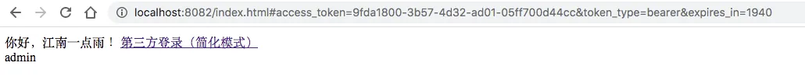
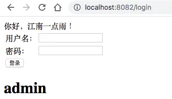
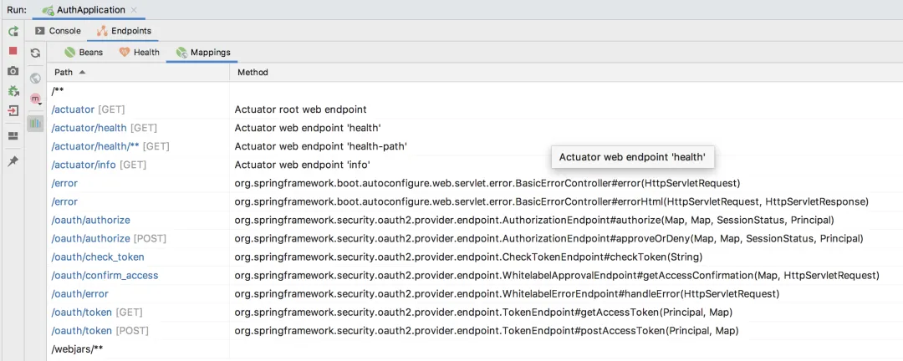
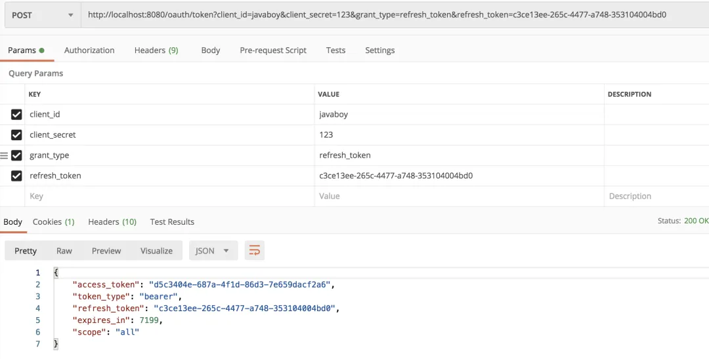
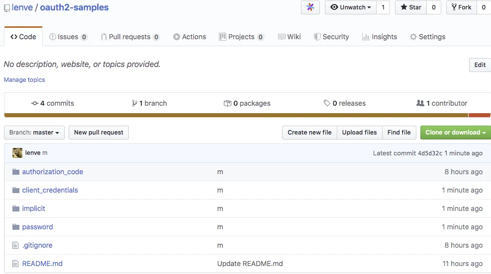

# 死磕 OAuth2，教练我要学全套的！

Original 江南一点雨 [江南一点雨](javascript:void(0);) *2020年04月15日 08:36*

今日干货


刚刚发表

查看:66666回复:666

公众号后台回复 ssm，免费获取松哥纯手敲的 SSM 框架学习干货。

昨天松哥和小伙伴们说了 OAuth2 中的授权码模式，我从头到尾写了一个非常详细的案例，来和小伙伴们分享授权码模式的使用。

有小伙伴表示为什么没有另外三种授权模式的演示代码？要学就学全套的！这不，松哥赶紧把另外三个授权模式的代码整出来，供小伙伴们参考。

今天的案例，我就不从头开始写了，我们就在[上篇文章](https://mp.weixin.qq.com/s?__biz=MzI1NDY0MTkzNQ==&mid=2247488214&idx=1&sn=5601775213285217913c92768d415eca&scene=21#wechat_redirect)代码的基础上修改就行了，如果小伙伴们还没看过本系列前面几篇文章，建议一定先看下，否则本文可能看不懂：

- [做微服务绕不过的 OAuth2，松哥也来和大家扯一扯](https://mp.weixin.qq.com/s?__biz=MzI1NDY0MTkzNQ==&mid=2247488209&idx=2&sn=19b1e44fbb1f4c1210f0fa92a618d871&scene=21#wechat_redirect)
- [这个案例写出来，还怕跟面试官扯不明白 OAuth2 登录流程？](https://mp.weixin.qq.com/s?__biz=MzI1NDY0MTkzNQ==&mid=2247488214&idx=1&sn=5601775213285217913c92768d415eca&scene=21#wechat_redirect)

接下来松哥直接上代码，各种授权模式的流程我就不再重复介绍了，大家可以参考本系列[第一篇文章](https://mp.weixin.qq.com/s?__biz=MzI1NDY0MTkzNQ==&mid=2247488209&idx=2&sn=19b1e44fbb1f4c1210f0fa92a618d871&scene=21#wechat_redirect)。

对了，文末依然可以下载本文源代码。

## 1.简化模式

要支持简化模式，其实很简单。

首先，我们在授权服务器中，增加如下配置表示支持简化模式：

```
@Override
public void configure(ClientDetailsServiceConfigurer clients) throws Exception {
    clients.inMemory()
            .withClient("javaboy")
            .secret(new BCryptPasswordEncoder().encode("123"))
            .resourceIds("res1")
            .authorizedGrantTypes("refresh_token","implicit")
            .scopes("all")
            .redirectUris("http://localhost:8082/index.html");
}
```

注意，我们只需要在 authorizedGrantTypes 中增加 implicit 表示支持简化模式即可。

配置完成后，重启 auth-server。

接下来我们配置资源服务器。因为简化模式没有服务端，我们只能通过 js 来请求资源服务器上的数据，所以资源服务器需要支持跨域，我们修改如下两个地方使之支持跨域：

```
@RestController
@CrossOrigin(value = "*")
public class HelloController {
    @GetMapping("/hello")
    public String hello() {
        return "hello";
    }
    @GetMapping("/admin/hello")
    public String admin() {
        return "admin";
    }
}
```

首先在 Controller 上添加 @CrossOrigin 注解使之支持跨域，然后配置 Spring Security 使之支持跨域：

```
@Override
public void configure(HttpSecurity http) throws Exception {
    http.authorizeRequests()
            .antMatchers("/admin/**").hasRole("admin")
            .anyRequest().authenticated()
            .and()
            .cors();
}
```

配置完成后，重启 user-server。

接下来我们来配置第三方应用：

首先我们修改 index.html 页面：

```
<body>
你好，江南一点雨！

<a href="http://localhost:8080/oauth/authorize?client_id=javaboy&response_type=token&scope=all&redirect_uri=http://localhost:8082/index.html">第三方登录（简化模式）</a>

<div id="div1"></div>
<script>
    var hash = window.location.hash;//提取出参数，类似这种格式#access_token=9fda1800-3b57-4d32-ad01-05ff700d44cc&token_type=bearer&expires_in=7199
    if (hash && hash.length > 0) {
        var params = hash.substring(1).split("&");
        var token = params[0].split("=");//[access_token,9fda1800-3b57-4d32-ad01-05ff700d44cc]
        $.ajax({
            type: 'get',
            headers: {
                'Authorization': 'Bearer ' + token[1]
            },
            url: 'http://localhost:8081/admin/hello',
            success: function (data) {
                $("#div1").html(data)
            }
        })
    }
</script>
</body>
```

还是之前的超链接不变，但是我们将 response_type 的值修改为 token，表示直接返回授权码，其他参数不变。

这样，当用户登录成功之后，会自动重定向到 http://localhost:8082/index.html 页面，并且添加了一个锚点参数，类似下面这样：

```
http://localhost:8082/index.html#access_token=9fda1800-3b57-4d32-ad01-05ff700d44cc&token_type=bearer&expires_in=1940
```

所以接下来，我们就在 js 中提取出 `#` 后面的参数，并进一步解析出 access_token 的值。

拿着 access_token 的值，我们去发送一个 Ajax 请求，将 access_token 放在请求头中，请求成功后，将请求到的数据放在 div 中。

这就是我们说的简化模式。

配置完成后，启动 client-app，访问 `http://localhost:8082/index.html` 页面进行测试，用户授权之后，会自动重定向到该页面，显示效果如下：



完整代码可以在文末下载。

## 2.密码模式

密码模式，需要用户直接在第三方应用上输入用户名密码登录，我们来看下。

**「注意，接下来的代码是在上篇文章授权码模式的基础上改造。」**

首先对 auth-server 进行改造，使之支持 password 模式：

```
@Override
public void configure(ClientDetailsServiceConfigurer clients) throws Exception {
    clients.inMemory()
            .withClient("javaboy")
            .secret(new BCryptPasswordEncoder().encode("123"))
            .resourceIds("res1")
            .authorizedGrantTypes("password","refresh_token")
            .scopes("all")
            .redirectUris("http://localhost:8082/index.html");
}
```

这里其他地方都不变，主要是在 authorizedGrantTypes 中增加了 password 模式。

由于使用了 password 模式之后，用户要进行登录，所以我们需要配置一个 AuthenticationManager，还是在 AuthorizationServer 类中，具体配置如下：

```
@Autowired
AuthenticationManager authenticationManager;
@Override
public void configure(AuthorizationServerEndpointsConfigurer endpoints) throws Exception {
    endpoints
            .authenticationManager(authenticationManager)
            .tokenServices(tokenServices());
}
```

注意，在授权码模式中，我们配置的 AuthorizationCodeServices 现在不需要了，取而代之的是 authenticationManager。

那么这个 authenticationManager 实例从哪里来呢？这需要我们在 Spring Security 的配置中提供，这松哥在之前的 Spring Security 系列教程中说过多次，我就不再赘述，这里直接上代码，在 SecurityConfig 中添加如下代码：

```
@Override
@Bean
public AuthenticationManager authenticationManagerBean() throws Exception {
    return super.authenticationManagerBean();
}
```

配置完成后，重启 auth-server。

接下来配置 client-app，首先我们添加登录功能，修改 index.html ，如下：

```
<body>
你好，江南一点雨！

<form action="/login" method="post">
    <table>
        <tr>
            <td>用户名：</td>
            <td><input name="username"></td>
        </tr>
        <tr>
            <td>密码：</td>
            <td><input name="password"></td>
        </tr>
        <tr>
            <td><input type="submit" value="登录"></td>
        </tr>
    </table>
</form>
<h1 th:text="${msg}"></h1>
</body>
```

这一个简单的登录功能没啥好说的。

我们来看登录接口：

```
@PostMapping("/login")
public String login(String username, String password,Model model) {
    MultiValueMap<String, String> map = new LinkedMultiValueMap<>();
    map.add("username", username);
    map.add("password", password);
    map.add("client_secret", "123");
    map.add("client_id", "javaboy");
    map.add("grant_type", "password");
    Map<String,String> resp = restTemplate.postForObject("http://localhost:8080/oauth/token", map, Map.class);
    String access_token = resp.get("access_token");
    HttpHeaders headers = new HttpHeaders();
    headers.add("Authorization", "Bearer " + access_token);
    HttpEntity<Object> httpEntity = new HttpEntity<>(headers);
    ResponseEntity<String> entity = restTemplate.exchange("http://localhost:8081/admin/hello", HttpMethod.GET, httpEntity, String.class);
    model.addAttribute("msg", entity.getBody());
    return "index";
}
```

在登录接口中，当收到一个用户名密码之后，我们通过 RestTemplate 发送一个 POST 请求，注意 post 请求中，grant_type 参数的值为 password，通过这个请求，我们可以获取 auth-server 返回的 access_token，格式如下：

```
{access_token=02e3a1e1-925f-4d2c-baac-42d76703cae4, token_type=bearer, refresh_token=836d4b75-fe53-4e41-9df1-2aad6dd80a5d, expires_in=7199, scope=all}
```

可以看到，返回的 token 数据和前面的类似，不再赘述。

我们提取出 access_token 之后，接下来去请求资源服务器，并将访问到的数据放在 model 中。

OK，配置完成后，启动 client-app，访问 http://localhost:8082/index.html 页面进行测试。授权完成后，我们在项目首页可以看到如下内容：



完整代码可以在文末下载。

## 3.客户端模式

客户端模式适用于没有前端页面的应用，所以我这里用一个单元测试来个大家演示。

**「注意，接下来的代码是在上篇文章授权码模式的基础上改造。」**

首先修改 auth-server ，使之支持客户端模式：

```
@Override
public void configure(ClientDetailsServiceConfigurer clients) throws Exception {
    clients.inMemory()
            .withClient("javaboy")
            .secret(new BCryptPasswordEncoder().encode("123"))
            .resourceIds("res1")
            .authorizedGrantTypes("client_credentials","refresh_token")
            .scopes("all")
            .redirectUris("http://localhost:8082/index.html");
}
```

这里其他地方都不变，主要是在 authorizedGrantTypes 中增加了 client_credentials 模式。

配置完成后，重启 auth-server。

接下来，在 client-app 中，通过单元测试，我们来写一段测试代码：

```
@Autowired
RestTemplate restTemplate;
@Test
void contextLoads() {
    MultiValueMap<String, String> map = new LinkedMultiValueMap<>();
    map.add("client_id", "javaboy");
    map.add("client_secret", "123");
    map.add("grant_type", "client_credentials");
    Map<String,String> resp = restTemplate.postForObject("http://localhost:8080/oauth/token", map, Map.class);
    String access_token = resp.get("access_token");
    HttpHeaders headers = new HttpHeaders();
    headers.add("Authorization", "Bearer " + access_token);
    HttpEntity<Object> httpEntity = new HttpEntity<>(headers);
    ResponseEntity<String> entity = restTemplate.exchange("http://localhost:8081/hello", HttpMethod.GET, httpEntity, String.class);
    System.out.println(entity.getBody());
}
```

这段代码跟前面的都差不多，就是请求参数不一样而已，参数 grant_type 的值为 client_credentials。其他都一样，我就不再赘述了。

这段单元测试，执行完成后，就打印出 hello，我就不再截图了。

完整代码可以在文末下载。

## 4.刷新 token

接下来松哥要讲的，是四种授权模式共有的功能。

以授权码模式为例，当我们启动 auth-server 之后，在 IntelliJ IDEA 中，我们可以看到项目暴露出来的接口：



那么这些接口都是干嘛用的呢？我们通过如下一张表格来理解下：

| 端点                  | 含义                                                         |
| :-------------------- | :----------------------------------------------------------- |
| /oauth/authorize      | 这个是授权的端点                                             |
| /oauth/token          | 这个是用来获取令牌的端点                                     |
| /oauth/confirm_access | 用户确认授权提交的端点（就是 auth-server 询问用户是否授权那个页面的提交地址） |
| /oauth/error          | 授权出错的端点                                               |
| /oauth/check_token    | 校验 access_token 的端点                                     |
| /oauth/token_key      | 提供公钥的端点                                               |

一目了然。这几个端点大部分我们都用过了，没用过的在未来也会用到，到时候再详细和小伙伴们解释。

/oauth/token 端点除了颁发令牌，还可以用来刷新令牌，在我们获取令牌的时候，除了 access_token 之外，还有一个 refresh_token，这个 refresh_token 就是用来刷新令牌用的。

我用 postman 来做一个简单的刷新令牌请求：



注意，刷新的时候需要携带上 refresh_token 参数，刷新完成之后，之前旧的 access_token 就会失效。

## 4.其他

通过上面三个案例，再结合上篇文章，松哥通过四个完完整整的代码，向家展示了 OAuth2 四种授权模式的基本用法。

这四个完整的案例，大家都可以直接从 github 上下载：



**好了，先说这么多，如果有收获，一定记得点个在看鼓励下松哥～**

今日干货


刚刚发表

查看:13500回复:135

公众号后台回复 SpringBoot，免费获取 274 页SpringBoot修炼手册。

OAuth2系列10

OAuth2系列 · 目录


上一篇这个案例写出来，还怕跟面试官扯不明白 OAuth2 登录流程？下一篇OAuth2 令牌还能存入 Redis ？越玩越溜！


# 


Scan to Follow