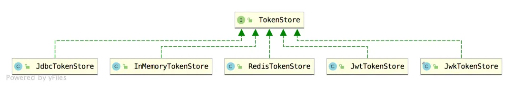
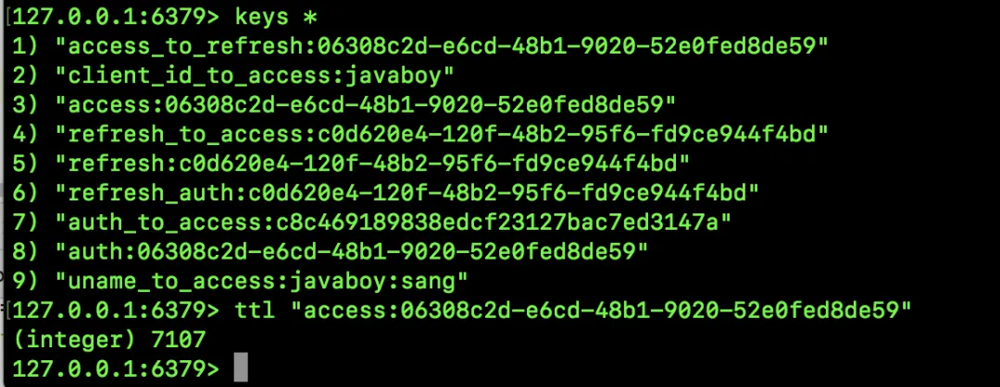
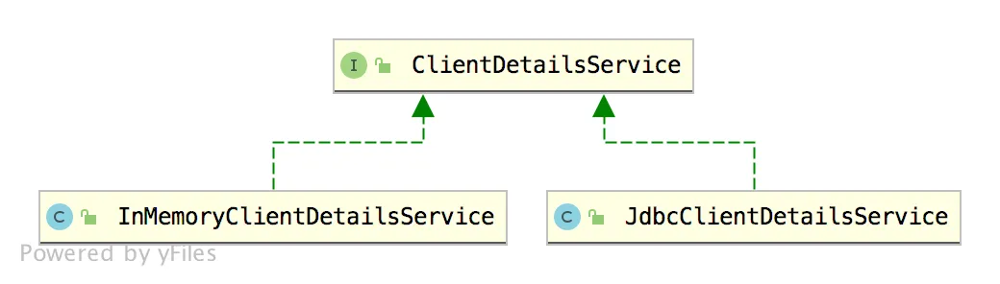
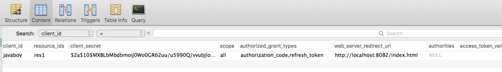
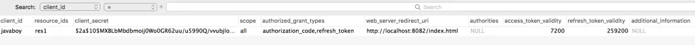

# OAuth2 令牌还能存入 Redis ？越玩越溜！

Original 江南一点雨 [江南一点雨](javascript:void(0);) *2020年04月17日 08:43*

今日干货


刚刚发表

查看:13500回复:135

公众号后台回复 SpringBoot，免费获取 274 页SpringBoot修炼手册。

OAuth2 的登录流程相信小伙伴们看了前面的文章应该已经清楚了，接下来我们来看一下这里的细节问题，使我们的案例更贴近实际项目。

还是需要跟小伙伴们强调下本系列前面几篇文章非常重要，一定要阅读之后再来学习本文：

1. [做微服务绕不过的 OAuth2，松哥也来和大家扯一扯](https://mp.weixin.qq.com/s?__biz=MzI1NDY0MTkzNQ==&mid=2247488209&idx=2&sn=19b1e44fbb1f4c1210f0fa92a618d871&scene=21#wechat_redirect)
2. [这个案例写出来，还怕跟面试官扯不明白 OAuth2 登录流程？](https://mp.weixin.qq.com/s?__biz=MzI1NDY0MTkzNQ==&mid=2247488214&idx=1&sn=5601775213285217913c92768d415eca&scene=21#wechat_redirect)
3. [死磕 OAuth2，教练我要学全套的！](https://mp.weixin.qq.com/s?__biz=MzI1NDY0MTkzNQ==&mid=2247488223&idx=1&sn=d1003f33ac5c866c88aa7542fcdf4992&scene=21#wechat_redirect)

本文我将从三个方面来做优化：

1. 令牌往哪里存？
2. 客户端信息入库
3. 第三方应用优化

好，我们分别来看。

**「注意，本文的案例在本系列第三篇文章的基础上修改而来。」**

## 1.令牌往哪里存？

在我们配置授权码模式的时候，有两个东西当时存在了内存中：

- InMemoryAuthorizationCodeServices 这个表授权码存在内存中。
- InMemoryTokenStore 表示生成的令牌存在内存中。

授权码用过一次就会失效，存在内存中没什么问题，但是令牌，我们实际上还有其他的存储方案。

我们所使用的 InMemoryTokenStore 实现了 TokenStore 接口，我们来看下 TokenStore 接口的实现类：



可以看到，我们有多种方式来存储 access_token。

1. InMemoryTokenStore，这是我们之前使用的，也是系统默认的，就是将 access_token 存到内存中，单机应用这个没有问题，但是在分布式环境下不推荐。
2. JdbcTokenStore，看名字就知道，这种方式令牌会被保存到数据中，这样就可以方便的和其他应用共享令牌信息。
3. JwtTokenStore，这个其实不是存储，因为使用了 jwt 之后，在生成的 jwt 中就有用户的所有信息，服务端不需要保存，这也是无状态登录，关于 OAuth2 结合 JWT 的用法，松哥本系列未来的文章中，也会详细介绍，这里就不再多说。
4. RedisTokenStore，这个很明显就是将 access_token 存到 redis 中。
5. JwkTokenStore，将 access_token 保存到 JSON Web Key。

虽然这里支持的方案比较多，但是我们常用的实际上主要是两个，RedisTokenStore 和 JwtTokenStore，JwtTokenStore 的比较复杂，我会在后面专门写文章来单独介绍，这里先来跟大家演示存入 RedisTokenStore。

首先我们启动一个 Redis 服务，然后给 auth-server 添加 Redis 依赖：

```
<dependency>
    <groupId>org.springframework.boot</groupId>
    <artifactId>spring-boot-starter-data-redis</artifactId>
</dependency>
```

依赖添加成功后，在 application.properties 中添加 redis 配置：

```
spring.redis.host=127.0.0.1
spring.redis.port=6379
spring.redis.password=123
```

配置完成后，我们修改 TokenStore 的实例，如下：

```
@Configuration
public class AccessTokenConfig {
    @Autowired
    RedisConnectionFactory redisConnectionFactory;
    @Bean
    TokenStore tokenStore() {
        return new RedisTokenStore(redisConnectionFactory);
    }
}
```

然后分别启动 auth-server、client-app 以及 user-server，走一遍第三方登录流程，然后我们发现，派发的 access_token 在 redis 中也有一份：



可以看到，数据都存到 Redis 中了，access_token 这个 key 在 Redis 中的有效期就是授权码的有效期。正是因为 Redis 中的这种过期机制，让它在存储 access_token 时具有天然的优势。

## 2.客户端信息入库

在前面的文章中，客户端信息我们是直接存储在内存中的，像下面这样：

```
@Override
public void configure(ClientDetailsServiceConfigurer clients) throws Exception {
    clients.inMemory()
            .withClient("javaboy")
            .secret(new BCryptPasswordEncoder().encode("123"))
            .resourceIds("res1")
            .authorizedGrantTypes("authorization_code","refresh_token")
            .scopes("all")
            .redirectUris("http://localhost:8082/index.html");
}
```

然而在实际项目中，这种方式并不可取，一来客户端信息在代码中写死了，以后不好维护，而来我们的客户端信息可能量非常大，都写在代码里那你的代码该有多长呀（想象一下有多少第三方应用接入了微信登录）～

所以我们要将客户端信息存入数据库中。

客户端信息入库涉及到的接口主要是 ClientDetailsService，这个接口主要有两个实现类，如下：



InMemoryClientDetailsService 就不多说了，这是存在内存中的。如果要存入数据库，很明显是 JdbcClientDetailsService，我们来大概看下 JdbcClientDetailsService 的源码，就能分析出数据库的结构了：

```
public class JdbcClientDetailsService implements ClientDetailsService, ClientRegistrationService {
 private static final String CLIENT_FIELDS_FOR_UPDATE = "resource_ids, scope, "
   + "authorized_grant_types, web_server_redirect_uri, authorities, access_token_validity, "
   + "refresh_token_validity, additional_information, autoapprove";
 private static final String CLIENT_FIELDS = "client_secret, " + CLIENT_FIELDS_FOR_UPDATE;
 private static final String BASE_FIND_STATEMENT = "select client_id, " + CLIENT_FIELDS
   + " from oauth_client_details";
 private static final String DEFAULT_FIND_STATEMENT = BASE_FIND_STATEMENT + " order by client_id";
 private static final String DEFAULT_SELECT_STATEMENT = BASE_FIND_STATEMENT + " where client_id = ?";
 private static final String DEFAULT_INSERT_STATEMENT = "insert into oauth_client_details (" + CLIENT_FIELDS
   + ", client_id) values (?,?,?,?,?,?,?,?,?,?,?)";
 private static final String DEFAULT_UPDATE_STATEMENT = "update oauth_client_details " + "set "
   + CLIENT_FIELDS_FOR_UPDATE.replaceAll(", ", "=?, ") + "=? where client_id = ?";
 private static final String DEFAULT_UPDATE_SECRET_STATEMENT = "update oauth_client_details "
   + "set client_secret = ? where client_id = ?";
 private static final String DEFAULT_DELETE_STATEMENT = "delete from oauth_client_details where client_id = ?";
```

从这段简单的源码中，我们大概就能分析出表的结构，松哥给出的 SQL 脚本如下：

```
DROP TABLE IF EXISTS `oauth_client_details`;
CREATE TABLE `oauth_client_details` (
  `client_id` varchar(48) NOT NULL,
  `resource_ids` varchar(256) DEFAULT NULL,
  `client_secret` varchar(256) DEFAULT NULL,
  `scope` varchar(256) DEFAULT NULL,
  `authorized_grant_types` varchar(256) DEFAULT NULL,
  `web_server_redirect_uri` varchar(256) DEFAULT NULL,
  `authorities` varchar(256) DEFAULT NULL,
  `access_token_validity` int(11) DEFAULT NULL,
  `refresh_token_validity` int(11) DEFAULT NULL,
  `additional_information` varchar(4096) DEFAULT NULL,
  `autoapprove` varchar(256) DEFAULT NULL,
  PRIMARY KEY (`client_id`)
) ENGINE=InnoDB DEFAULT CHARSET=utf8;
```

接下来我们将一开始定义的客户端的关键信息存入数据库中，如下：



既然用到了数据库，依赖当然也要提供相应的支持，我们给 auth-server 添加如下依赖：

```
<dependency>
    <groupId>org.springframework.boot</groupId>
    <artifactId>spring-boot-starter-jdbc</artifactId>
</dependency>
<dependency>
    <groupId>mysql</groupId>
    <artifactId>mysql-connector-java</artifactId>
</dependency>
```

然后在 application.properties 中配置一下数据库的连接信息：

```
spring.datasource.url=jdbc:mysql:///oauth2?useUnicode=true&characterEncoding=UTF-8&serverTimeZone=Asia/Shanghai
spring.datasource.password=123
spring.datasource.username=root

spring.main.allow-bean-definition-overriding=true
```

这里的配置多了最后一条。这是因为我们一会要创建自己的 ClientDetailsService，而系统已经创建了 ClientDetailsService，加了最后一条就允许我们自己的实例覆盖系统默认的实例。

接下来，我们来提供自己的实例即可：

```
@Autowired
DataSource dataSource;
@Bean
ClientDetailsService clientDetailsService() {
    return new JdbcClientDetailsService(dataSource);
}
@Override
public void configure(ClientDetailsServiceConfigurer clients) throws Exception {
    clients.withClientDetails(clientDetailsService());
}
```

配置完成后，重启 auth-server，走一遍第三方登录流程，和我们前面效果一样。不再赘述。

我们也可以将令牌有效期配置在数据库中，这样就不用在代码中配置了，修改后的数据库如下：



修改后的 AuthorizationServerTokenServices 实例如下：

```
@Bean
AuthorizationServerTokenServices tokenServices() {
    DefaultTokenServices services = new DefaultTokenServices();
    services.setClientDetailsService(clientDetailsService());
    services.setSupportRefreshToken(true);
    services.setTokenStore(tokenStore);
    return services;
}
```

## 3.第三方应用优化

前面我们所写的第三方登录，我们在 Controller 中是这么定义的：

```
@GetMapping("/index.html")
public String hello(String code, Model model) {
    if (code != null) {
        MultiValueMap<String, String> map = new LinkedMultiValueMap<>();
        map.add("code", code);
        map.add("client_id", "javaboy");
        map.add("client_secret", "123");
        map.add("redirect_uri", "http://localhost:8082/index.html");
        map.add("grant_type", "authorization_code");
        Map<String,String> resp = restTemplate.postForObject("http://localhost:8080/oauth/token", map, Map.class);
        System.out.println(resp);
        String access_token = resp.get("access_token");
        System.out.println(access_token);
        HttpHeaders headers = new HttpHeaders();
        headers.add("Authorization", "Bearer " + access_token);
        HttpEntity<Object> httpEntity = new HttpEntity<>(headers);
        ResponseEntity<String> entity = restTemplate.exchange("http://localhost:8081/admin/hello", HttpMethod.GET, httpEntity, String.class);
        model.addAttribute("msg", entity.getBody());
    }
    return "index";
}
```

当时只是为了给大家演示登录流程，今天我们来把这个过程再来稍微优化下。

首先我们来定义一个专门的类 TokenTask 用来解决 Token 的管理问题：

```
@Component @SessionScope
public class TokenTask {
    @Autowired
    RestTemplate restTemplate;
    public String access_token = "";
    public String refresh_token = "";

    public String getData(String code) {
        if ("".equals(access_token) && code != null) {
            MultiValueMap<String, String> map = new LinkedMultiValueMap<>();
            map.add("code", code);
            map.add("client_id", "javaboy");
            map.add("client_secret", "123");
            map.add("redirect_uri", "http://localhost:8082/index.html");
            map.add("grant_type", "authorization_code");
            Map<String, String> resp = restTemplate.postForObject("http://localhost:8080/oauth/token", map, Map.class);
            access_token = resp.get("access_token");
            refresh_token = resp.get("refresh_token");
            return loadDataFromResServer();
        } else {
            return loadDataFromResServer();
        }
    }

    private String loadDataFromResServer() {
        try {
            HttpHeaders headers = new HttpHeaders();
            headers.add("Authorization", "Bearer " + access_token);
            HttpEntity<Object> httpEntity = new HttpEntity<>(headers);
            ResponseEntity<String> entity = restTemplate.exchange("http://localhost:8081/admin/hello", HttpMethod.GET, httpEntity, String.class);
            return entity.getBody();
        } catch (RestClientException e) {
            return "未加载";
        }
    }

    @Scheduled(cron = "0 55 0/1 * * ？")
    public void tokenTask() {
        MultiValueMap<String, String> map = new LinkedMultiValueMap<>();
        map.add("client_id", "javaboy");
        map.add("client_secret", "123");
        map.add("refresh_token", refresh_token);
        map.add("grant_type", "refresh_token");
        Map<String, String> resp = restTemplate.postForObject("http://localhost:8080/oauth/token", map, Map.class);
        access_token = resp.get("access_token");
        refresh_token = resp.get("refresh_token");
    }
}
```

这段代码没有技术难点，主要是逻辑上，我稍微解释一下：

1. 首先在 getData 方法中，如果 access_token 为空字符串，并且 code 不为 null，表示这是刚刚拿到授权码的时候，准备去申请令牌了，令牌拿到之后，将 access_token 和 refresh_token 分别赋值给变量，然后调用  loadDataFromResServer 方法去资源服务器加载数据。
2. 另外有一个 tokenTask 方法，这是一个定时任务，每隔 115 分钟去刷新一下 access_token（access_token 有效期是 120 分钟）。

改造完成后，我们再去 HelloController 中略作调整：

```
@Controller
public class HelloController {
    @Autowired
    TokenTask tokenTask;
    @GetMapping("/index.html")
    public String hello(String code, Model model) {
        model.addAttribute("msg", tokenTask.getData(code));
        return "index";
    }
}
```

这样就 OK 了，当我们再去下图这个页面按 F5 刷新就不会出错了。


OK，本文和小伙伴们聊了一些前面案例的细节问题，完成案例下载地址：https://github.com/lenve/oauth2-samples

如果小伙伴们觉得有用的话，记得点个在看鼓励下松哥。

今日干货


刚刚发表

查看:66666回复:666

公众号后台回复 ssm，免费获取松哥纯手敲的 SSM 框架学习干货。

OAuth2系列10

OAuth2系列 · 目录


上一篇死磕 OAuth2，教练我要学全套的！下一篇松哥手把手教你玩转 OAuth2 授权码模式|视频版

修改于2020年04月17日


# 


Scan to Follow