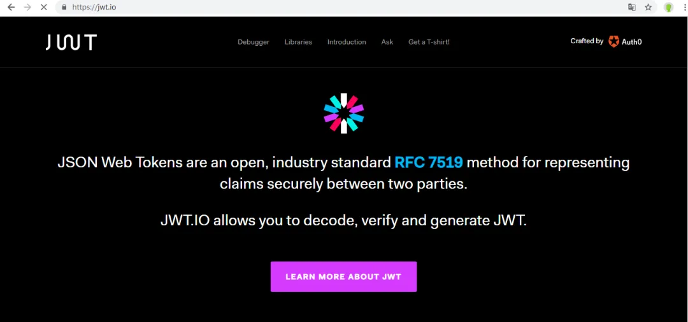
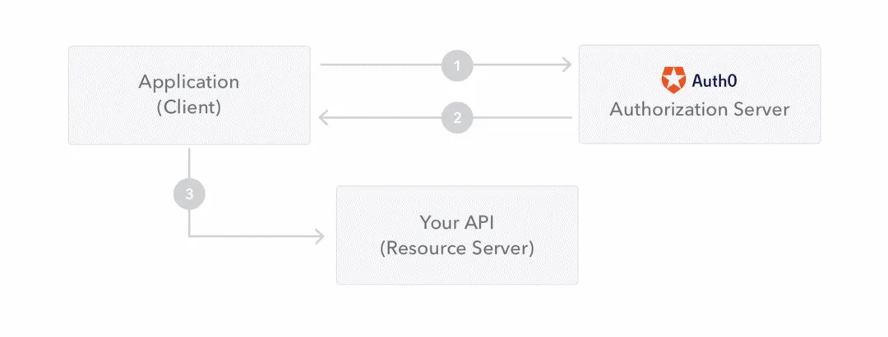
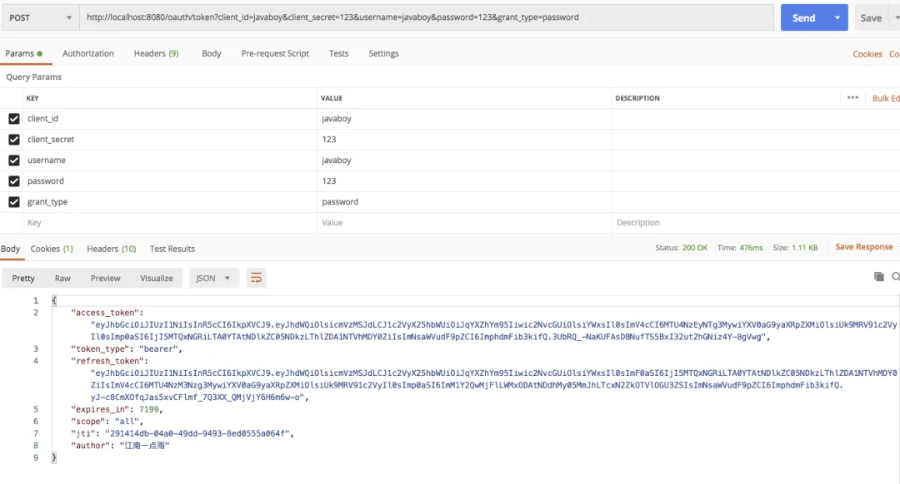

# 想让 OAuth2 和 JWT 在一起愉快玩耍？请看松哥的表演

Original 江南一点雨 [江南一点雨](javascript:void(0);) *2020年04月21日 08:36*

今日干货


刚刚发表

查看:66666回复:666

公众号后台回复 ssm，免费获取松哥纯手敲的 SSM 框架学习干货。

本文是我们 OAuth2 系列的第五篇，通过前面四篇文章相信大家对于 OAuth2 中的各种授权登录流程已经轻车熟路了。

前面的文章松哥侧重于和大家理清楚 OAuth2 的登录流程，对于一些登录细节则没有去深究，接下来松哥会和大家把这些案例一一进行晚上。

本文依然是在前面案例的基础上完成，所以还是强烈建议小伙伴们阅读本系列前面的文章：

1. [做微服务绕不过的 OAuth2，松哥也来和大家扯一扯](https://mp.weixin.qq.com/s?__biz=MzI1NDY0MTkzNQ==&mid=2247488209&idx=2&sn=19b1e44fbb1f4c1210f0fa92a618d871&scene=21#wechat_redirect)
2. [这个案例写出来，还怕跟面试官扯不明白 OAuth2 登录流程？](https://mp.weixin.qq.com/s?__biz=MzI1NDY0MTkzNQ==&mid=2247488214&idx=1&sn=5601775213285217913c92768d415eca&scene=21#wechat_redirect)
3. [死磕 OAuth2，教练我要学全套的！](https://mp.weixin.qq.com/s?__biz=MzI1NDY0MTkzNQ==&mid=2247488223&idx=1&sn=d1003f33ac5c866c88aa7542fcdf4992&scene=21#wechat_redirect)
4. [OAuth2 令牌还能存入 Redis ？越玩越溜！](https://mp.weixin.qq.com/s?__biz=MzI1NDY0MTkzNQ==&mid=2247488246&idx=2&sn=b1ee410dbe86f2b748845304f7734d62&scene=21#wechat_redirect)

今天松哥主要和大家分享如何把 OAuth2 和 JWT 套在一起玩！

传统的通过 session 来记录用户认证信息的方式我们可以理解为这是一种有状态登录，而 JWT 则代表了一种无状态登录。**「无状态登录天然的具备单点登录能力，所以这个技术组合小伙伴们还是很有必要认真学习下。」** 可能有小伙伴对这个概念还不太熟悉，我这里就先来科普一下有状态登录和无状态登录。

## 1. 无状态登录

### 1.1 什么是有状态

有状态服务，即服务端需要记录每次会话的客户端信息，从而识别客户端身份，根据用户身份进行请求的处理，典型的设计如 Tomcat 中的 Session。例如登录：用户登录后，我们把用户的信息保存在服务端 session 中，并且给用户一个 cookie 值，记录对应的 session，然后下次请求，用户携带 cookie 值来（这一步有浏览器自动完成），我们就能识别到对应 session，从而找到用户的信息。这种方式目前来看最方便，但是也有一些缺陷，如下：

- 服务端保存大量数据，增加服务端压力
- 服务端保存用户状态，不支持集群化部署

### 1.2 什么是无状态

微服务集群中的每个服务，对外提供的都使用 RESTful 风格的接口。而 RESTful 风格的一个最重要的规范就是：服务的无状态性，即：

- 服务端不保存任何客户端请求者信息
- 客户端的每次请求必须具备自描述信息，通过这些信息识别客户端身份

那么这种无状态性有哪些好处呢？

- 客户端请求不依赖服务端的信息，多次请求不需要必须访问到同一台服务器
- 服务端的集群和状态对客户端透明
- 服务端可以任意的迁移和伸缩（可以方便的进行集群化部署）
- 减小服务端存储压力

### 1.3 如何实现无状态

无状态登录的流程：

- 首先客户端发送账户名/密码到服务端进行认证
- 认证通过后，服务端将用户信息加密并且编码成一个 token，返回给客户端
- 以后客户端每次发送请求，都需要携带认证的 token
- 服务端对客户端发送来的 token 进行解密，判断是否有效，并且获取用户登录信息

### 1.4 JWT

#### 1.4.1 简介

JWT，全称是 Json Web Token ， 是一种 JSON 风格的轻量级的授权和身份认证规范，可实现无状态、分布式的 Web 应用授权：



JWT 作为一种规范，并没有和某一种语言绑定在一起，常用的 Java 实现是 GitHub 上的开源项目 jjwt，地址如下：`https://github.com/jwtk/jjwt`

#### 1.4.2 JWT 数据格式

JWT 包含三部分数据：

1.Header：头部，通常头部有两部分信息：

- 声明类型，这里是JWT
- 加密算法，自定义

我们会对头部进行 Base64Url 编码（可解码），得到第一部分数据。

2.Payload：载荷，就是有效数据，在官方文档中(RFC7519)，这里给了 7 个示例信息：

- iss (issuer)：表示签发人
- exp (expiration time)：表示token过期时间
- sub (subject)：主题
- aud (audience)：受众
- nbf (Not Before)：生效时间
- iat (Issued At)：签发时间
- jti (JWT ID)：编号

这部分也会采用 Base64Url 编码，得到第二部分数据。

3.Signature：签名，是整个数据的认证信息。一般根据前两步的数据，再加上服务的的密钥 secret（密钥保存在服务端，不能泄露给客户端），通过 Header 中配置的加密算法生成。用于验证整个数据完整和可靠性。

生成的数据格式如下图：


注意，这里的数据通过 `.` 隔开成了三部分，分别对应前面提到的三部分，另外，这里数据是不换行的，图片换行只是为了展示方便而已。

#### 1.4.3 JWT 交互流程

流程图：



步骤翻译：

1. 应用程序或客户端向授权服务器请求授权
2. 获取到授权后，授权服务器会向应用程序返回访问令牌
3. 应用程序使用访问令牌来访问受保护资源（如API）

因为 JWT 签发的 token 中已经包含了用户的身份信息，并且每次请求都会携带，这样服务的就无需保存用户信息，甚至无需去数据库查询，这样就符合了 RESTful 的无状态规范。

### 1.5 JWT 存在的问题

说了这么多，JWT 也不是天衣无缝，由客户端维护登录状态带来的一些问题在这里依然存在，举例如下：

1. 续签问题，这是被很多人诟病的问题之一，传统的 cookie+session 的方案天然的支持续签，但是 jwt 由于服务端不保存用户状态，因此很难完美解决续签问题，如果引入 redis，虽然可以解决问题，但是 jwt 也变得不伦不类了。
2. 注销问题，由于服务端不再保存用户信息，所以一般可以通过修改 secret 来实现注销，服务端 secret 修改后，已经颁发的未过期的 token 就会认证失败，进而实现注销，不过毕竟没有传统的注销方便。
3. 密码重置，密码重置后，原本的 token 依然可以访问系统，这时候也需要强制修改 secret。
4. 基于第 2 点和第 3 点，一般建议不同用户取不同 secret。

## 2.OAuth2 中的问题

在[前面的文章中](https://mp.weixin.qq.com/s?__biz=MzI1NDY0MTkzNQ==&mid=2247488214&idx=1&sn=5601775213285217913c92768d415eca&scene=21#wechat_redirect)，授权服务器派发了 access_token 之后，客户端拿着 access_token 去请求资源服务器，资源服务器要去校验 access_token 的真伪，所以我们在资源服务器上配置了 RemoteTokenServices，让资源服务器做远程校验：

```
@Bean
RemoteTokenServices tokenServices() {
    RemoteTokenServices services = new RemoteTokenServices();
    services.setCheckTokenEndpointUrl("http://localhost:8080/oauth/check_token");
    services.setClientId("javaboy");
    services.setClientSecret("123");
    return services;
}
```

在高并发环境下这样的校验方式显然是有问题的，如果结合 JWT，用户的所有信息都保存在 JWT 中，这样就可以有效的解决上面的问题。

## 3.改造方案

### 3.1 授权服务器改造

首先我们来看对授权服务器的改造，我们来修改 AccessTokenConfig 类，如下：

```
@Configuration
public class AccessTokenConfig {
    private String SIGNING_KEY = "javaboy";

    @Bean
    TokenStore tokenStore() {
        return new JwtTokenStore(jwtAccessTokenConverter());
    }

    @Bean
    JwtAccessTokenConverter jwtAccessTokenConverter() {
        JwtAccessTokenConverter converter = new JwtAccessTokenConverter();
        converter.setSigningKey(SIGNING_KEY);
        return converter;
    }
}
```

这里的改造主要是两方面：

1. TokenStore 我们使用 JwtTokenStore 这个实例。之前我们将 access_token 无论是存储在内存中，还是存储在 Redis 中，都是要存下来的，客户端将 access_token 发来之后，我们还要校验看对不对。但是如果使用了 JWT，access_token 实际上就不用存储了（无状态登录，服务端不需要保存信息），因为用户的所有信息都在 jwt 里边，所以这里配置的 JwtTokenStore 本质上并不是做存储。
2. 另外我们还提供了一个 JwtAccessTokenConverter，这个 JwtAccessTokenConverter 可以实现将用户信息和 JWT 进行转换（将用户信息转为 jwt 字符串，或者从 jwt 字符串提取出用户信息）。
3. 另外，在 JWT 字符串生成的时候，我们需要一个签名，这个签名需要自己保存好。

这里 JWT 默认生成的用户信息主要是用户角色、用户名等，如果我们希望在生成的 JWT 上面添加额外的信息，可以按照如下方式添加：

```
@Component
public class CustomAdditionalInformation implements TokenEnhancer {
    @Override
    public OAuth2AccessToken enhance(OAuth2AccessToken accessToken, OAuth2Authentication authentication) {
        Map<String, Object> info = accessToken.getAdditionalInformation();
        info.put("author", "江南一点雨");
        ((DefaultOAuth2AccessToken) accessToken).setAdditionalInformation(info);
        return accessToken;
    }
}
```

自定义类 CustomAdditionalInformation 实现 TokenEnhancer 接口，并实现接口中的 enhance 方法。enhance 方法中的 OAuth2AccessToken 参数就是已经生成的 access_token 信息，我们可以从 OAuth2AccessToken 中取出已经生成的额外信息，然后在此基础上追加自己的信息。

**「需要提醒一句，其实我们配置的 JwtAccessTokenConverter 也是 TokenEnhancer 的一个实例」**

配置完成之后，我们还需要在 AuthorizationServer 中修改 AuthorizationServerTokenServices 实例，如下：

```
@Autowired
JwtAccessTokenConverter jwtAccessTokenConverter;
@Autowired
CustomAdditionalInformation customAdditionalInformation;
@Bean
AuthorizationServerTokenServices tokenServices() {
    DefaultTokenServices services = new DefaultTokenServices();
    services.setClientDetailsService(clientDetailsService());
    services.setSupportRefreshToken(true);
    services.setTokenStore(tokenStore);
    TokenEnhancerChain tokenEnhancerChain = new TokenEnhancerChain();
    tokenEnhancerChain.setTokenEnhancers(Arrays.asList(jwtAccessTokenConverter, customAdditionalInformation));
    services.setTokenEnhancer(tokenEnhancerChain);
    return services;
}
```

这里主要是是在 DefaultTokenServices 中配置 TokenEnhancer，将之前的 JwtAccessTokenConverter 和 CustomAdditionalInformation 两个实例注入进来即可。

如此之后，我们的 auth-server 就算是配置成功了。

### 3.2 资源服务器改造

接下来我们还需要对资源服务器进行改造，也就是 user-server，我们将 auth-server 中的 AccessTokenConfig 类拷贝到 user-server 中，然后在资源服务器配置中不再配置远程校验地址，而是配置一个 TokenStore 即可：

```
@Configuration
@EnableResourceServer
public class ResourceServerConfig extends ResourceServerConfigurerAdapter {
    @Autowired
    TokenStore tokenStore;

    @Override
    public void configure(ResourceServerSecurityConfigurer resources) throws Exception {
        resources.resourceId("res1").tokenStore(tokenStore);
    }

    @Override
    public void configure(HttpSecurity http) throws Exception {
        http.authorizeRequests()
                .antMatchers("/admin/**").hasRole("admin")
                .anyRequest().authenticated();
    }
}
```

这里配置好之后，会自动调用 JwtAccessTokenConverter 将 jwt 解析出来，jwt 里边就包含了用户的基本信息，所以就不用远程校验 access_token 了。

## 4.测试

OK，上面配置完成后，我们就可以启动 auth-server、user-server 进行测试，这里为了测试方便，我配置了 password 模式来测试（参考[死磕 OAuth2，教练我要学全套的！](https://mp.weixin.qq.com/s?__biz=MzI1NDY0MTkzNQ==&mid=2247488223&idx=1&sn=d1003f33ac5c866c88aa7542fcdf4992&scene=21#wechat_redirect)）。

首先我们请求 auth-server 获取 token，如下：



可以看到，jwt 的字符串还是挺长的，另外返回的数据中也有我们自定义的信息。根据本文第一小节的介绍，小伙伴们可以使用一些在线的 Base64 工具自行解码 jwt 字符串的前两部分，当然也可以通过 check_token 接口来解析：


解析后就可以看到 jwt 中保存的用户详细信息了。

拿到 access_token 之后，我们就可以去访问 user-server 中的资源了，访问方式跟之前的一样，请求头中传入 access_token 即可：


如此之后，我们就成功的将 OAuth2 和 Jwt 结合起来了。

## 5.原理

那么普通的 access_token 到底是怎么变为 jwt 的？jwt 和认证信息又是如何自动转换的？松哥也来和大家扯一扯。

首先我们知道，access_token 的生成，默认是在 DefaultTokenServices#createAccessToken 方法中的，我们来看下 createAccessToken 方法：

```
private OAuth2AccessToken createAccessToken(OAuth2Authentication authentication, OAuth2RefreshToken refreshToken) {
 DefaultOAuth2AccessToken token = new DefaultOAuth2AccessToken(UUID.randomUUID().toString());
 int validitySeconds = getAccessTokenValiditySeconds(authentication.getOAuth2Request());
 if (validitySeconds > 0) {
  token.setExpiration(new Date(System.currentTimeMillis() + (validitySeconds * 1000L)));
 }
 token.setRefreshToken(refreshToken);
 token.setScope(authentication.getOAuth2Request().getScope());
 return accessTokenEnhancer != null ? accessTokenEnhancer.enhance(token, authentication) : token;
}
```

从这段源码中我们可以看到：

1. 默认生成的 access_token 其实就是一个 UUID 字符串。
2. getAccessTokenValiditySeconds 方法用来获取 access_token 的有效期，点进去这个方法，我们发现这个数字是从数据库中查询出来的，其实就是我们配置的 access_token 的有效期，我们配置的有效期单位是秒。
3. 如果设置的 access_token 有效期大于 0，则调用 setExpiration 方法设置过期时间，过期时间就是在当前时间基础上加上用户设置的过期时间，注意乘以 1000 将时间单位转为毫秒。
4. 接下来设置刷新 token 和授权范围 scope（刷新 token 的生成过程在 createRefreshToken 方法中，其实和 access_token 的生成过程类似）。
5. 最后面 return 比较关键，这里会判断有没有 accessTokenEnhancer，如果 accessTokenEnhancer 不为 null，则在 accessTokenEnhancer 中再处理一遍才返回，accessTokenEnhancer 中再处理一遍就比较关键了，就是 access_token 转为 jwt 字符串的过程。

这里的 accessTokenEnhancer 实际上是一个 TokenEnhancerChain，这个链中有一个 delegates 变量保存了我们定义的两个 TokenEnhancer（auth-server 中定义的 JwtAccessTokenConverter 和 CustomAdditionalInformation），也就是说，我们的 access_token 信息将在这两个类中进行二次处理。**「处理的顺序是按照集合中保存的顺序，就是先在 JwtAccessTokenConverter 中处理，后在 CustomAdditionalInformation 中处理，顺序不能乱，也意味着我们在 auth-server 中定义的时候，JwtAccessTokenConverter 和 CustomAdditionalInformation 的顺序不能写错。」**

无论是 JwtAccessTokenConverter 还是 CustomAdditionalInformation，它里边核心的方法都是 enhance，我们先来看 JwtAccessTokenConverter#enhance：

```
public OAuth2AccessToken enhance(OAuth2AccessToken accessToken, OAuth2Authentication authentication) {
 DefaultOAuth2AccessToken result = new DefaultOAuth2AccessToken(accessToken);
 Map<String, Object> info = new LinkedHashMap<String, Object>(accessToken.getAdditionalInformation());
 String tokenId = result.getValue();
 if (!info.containsKey(TOKEN_ID)) {
  info.put(TOKEN_ID, tokenId);
 }
 else {
  tokenId = (String) info.get(TOKEN_ID);
 }
 result.setAdditionalInformation(info);
 result.setValue(encode(result, authentication));
 OAuth2RefreshToken refreshToken = result.getRefreshToken();
 if (refreshToken != null) {
  DefaultOAuth2AccessToken encodedRefreshToken = new DefaultOAuth2AccessToken(accessToken);
  encodedRefreshToken.setValue(refreshToken.getValue());
  // Refresh tokens do not expire unless explicitly of the right type
  encodedRefreshToken.setExpiration(null);
  try {
   Map<String, Object> claims = objectMapper
     .parseMap(JwtHelper.decode(refreshToken.getValue()).getClaims());
   if (claims.containsKey(TOKEN_ID)) {
    encodedRefreshToken.setValue(claims.get(TOKEN_ID).toString());
   }
  }
  catch (IllegalArgumentException e) {
  }
  Map<String, Object> refreshTokenInfo = new LinkedHashMap<String, Object>(
    accessToken.getAdditionalInformation());
  refreshTokenInfo.put(TOKEN_ID, encodedRefreshToken.getValue());
  refreshTokenInfo.put(ACCESS_TOKEN_ID, tokenId);
  encodedRefreshToken.setAdditionalInformation(refreshTokenInfo);
  DefaultOAuth2RefreshToken token = new DefaultOAuth2RefreshToken(
    encode(encodedRefreshToken, authentication));
  if (refreshToken instanceof ExpiringOAuth2RefreshToken) {
   Date expiration = ((ExpiringOAuth2RefreshToken) refreshToken).getExpiration();
   encodedRefreshToken.setExpiration(expiration);
   token = new DefaultExpiringOAuth2RefreshToken(encode(encodedRefreshToken, authentication), expiration);
  }
  result.setRefreshToken(token);
 }
 return result;
}
```

这段代码虽然比较长，但是却很好理解：

1. 首先构造一个 DefaultOAuth2AccessToken 对象。
2. 将 accessToken 中的附加信息拿出来（此时默认没有附加信息）。
3. 获取旧的 access_token（就是上一步 UUID 字符串），将之作为附加信息存入到 info 中（第四小节测试中，返回的 jwt 中有一个 jti，其实就是这里存入进来的）。
4. 将附加信息存入 result 中。
5. 对 result 进行编码，将编码结果作为新的 access_token，这个编码的过程就是 jwt 字符串生成的过程。
6. 接下来是处理刷新 token，刷新 token 如果是 jwt 字符串，则需要有一个解码操作，否则不需要，刷新 token 如果是 ExpiringOAuth2RefreshToken 的实例，表示刷新 token 已经过期，则重新生成一个，这里的逻辑比较简单，我就不啰嗦了。

最后我们再来看看这里多次出现的 encode 方法，就是 jwt 字符串编码的过程：

```
protected String encode(OAuth2AccessToken accessToken, OAuth2Authentication authentication) {
 String content;
 try {
  content = objectMapper.formatMap(tokenConverter.convertAccessToken(accessToken, authentication));
 }
 catch (Exception e) {
  throw new IllegalStateException("Cannot convert access token to JSON", e);
 }
 String token = JwtHelper.encode(content, signer).getEncoded();
 return token;
}
```

我们可以看到，这里首先是把用户信息和 access_token 生成一个 JSON 字符串，然后调用 JwtHelper.encode 方法进行 jwt 编码。

jwt 编码的过程其实也不难，松哥之前也写过相应的文章，感兴趣的小伙伴可以公众号后台回复 springboot，里边有一篇文章就是讲自动手动生成 jwt 字符串的，这里我就不赘述了。

OK，本文和小伙伴们聊了一些 OAuth2+JWT 的问题，完成案例下载地址：https://github.com/lenve/oauth2-samples

**如果小伙伴们觉得有用的话，记得点个在看鼓励下松哥。**

今日干货


刚刚发表

查看:66666回复:666

公众号后台回复 ssm，免费获取松哥纯手敲的 SSM 框架学习干货。

OAuth2系列10

OAuth2系列 · 目录


上一篇松哥手把手教你玩转 OAuth2 授权码模式|视频版下一篇最近在做 Spring Cloud 项目，松哥和大家分享一点微服务架构中的安全管理思路


# 


Scan to Follow