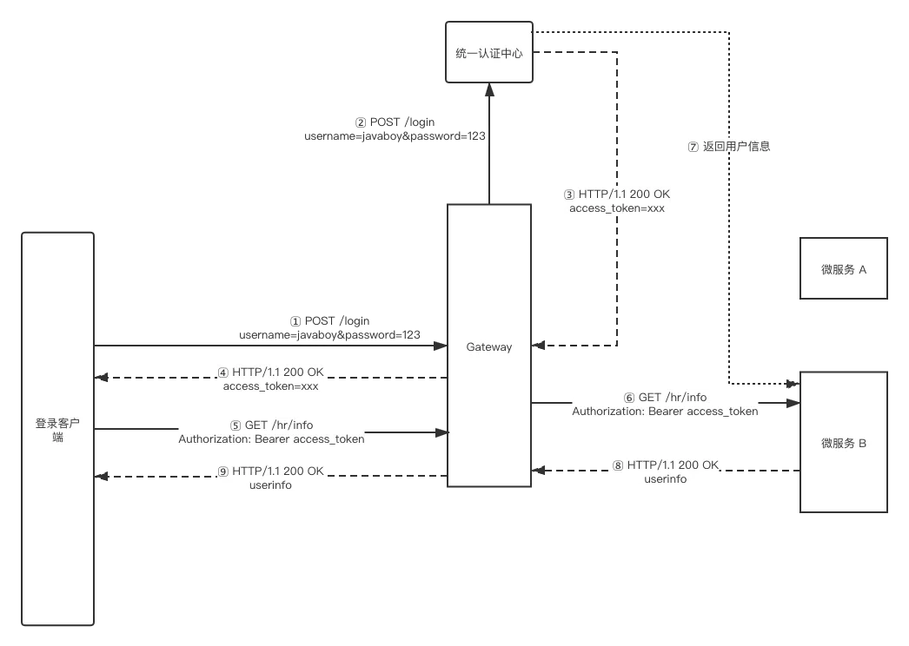

# 最近在做 Spring Cloud 项目，松哥和大家分享一点微服务架构中的安全管理思路

Original 江南一点雨 [江南一点雨](javascript:void(0);) *2020年04月22日 08:36*

今日干货

刚刚发表

查看:66666回复:666

公众号后台回复 ssm，免费获取松哥纯手敲的 SSM 框架学习干货。

**江南一点雨**推荐搜索

springbootspring

最近一段时间一直在发安全相关的 Spring Security 和 OAuth2，当然这两个系列还在继续，对 Spring Security 和 OAuth2 感兴趣的小伙伴，不要错过前面的文章哦，本文主要将一些理论上的东西，所以要是前面的 OAuth2 不懂，可能阅读起来有些吃力：

**「Spring Security 系列：」**

1. [挖一个大坑，Spring Security 开搞！](https://mp.weixin.qq.com/s?__biz=MzI1NDY0MTkzNQ==&mid=2247488106&idx=1&sn=258fc609661f22de5517e1bc5c0915ed&scene=21#wechat_redirect)
2. [松哥手把手带你入门 Spring Security，别再问密码怎么解密了](https://mp.weixin.qq.com/s?__biz=MzI1NDY0MTkzNQ==&mid=2247488113&idx=1&sn=01168c492e22fa287043eb746950da73&scene=21#wechat_redirect)
3. [手把手教你定制 Spring Security 中的表单登录](https://mp.weixin.qq.com/s?__biz=MzI1NDY0MTkzNQ==&mid=2247488138&idx=1&sn=25d18a61a14e4e6316537b6d45e43dd4&scene=21#wechat_redirect)
4. [Spring Security 做前后端分离，咱就别做页面跳转了！统统 JSON 交互](https://mp.weixin.qq.com/s?__biz=MzI1NDY0MTkzNQ==&mid=2247488157&idx=2&sn=845178d45e73232a94ed46df12ea76cc&scene=21#wechat_redirect)
5. [Spring Security 中的授权操作原来这么简单](https://mp.weixin.qq.com/s?__biz=MzI1NDY0MTkzNQ==&mid=2247488185&idx=1&sn=6fe677703312905d39615a001e191bd2&scene=21#wechat_redirect)
6. [Spring Security 如何将用户数据存入数据库？](https://mp.weixin.qq.com/s?__biz=MzI1NDY0MTkzNQ==&mid=2247488194&idx=1&sn=7103031896ba8b9d34095524b292265e&scene=21#wechat_redirect)
7. [Spring Security+Spring Data Jpa 强强联手，安全管理只有更简单！](https://mp.weixin.qq.com/s?__biz=MzI1NDY0MTkzNQ==&mid=2247488229&idx=1&sn=2911c04bf19d41b00b4933d4044590f8&scene=21#wechat_redirect)

**「OAuth2 系列：」**

1. [做微服务绕不过的 OAuth2，松哥也来和大家扯一扯](https://mp.weixin.qq.com/s?__biz=MzI1NDY0MTkzNQ==&mid=2247488209&idx=2&sn=19b1e44fbb1f4c1210f0fa92a618d871&scene=21#wechat_redirect)
2. [这个案例写出来，还怕跟面试官扯不明白 OAuth2 登录流程？](https://mp.weixin.qq.com/s?__biz=MzI1NDY0MTkzNQ==&mid=2247488214&idx=1&sn=5601775213285217913c92768d415eca&scene=21#wechat_redirect)
3. [死磕 OAuth2，教练我要学全套的！](https://mp.weixin.qq.com/s?__biz=MzI1NDY0MTkzNQ==&mid=2247488223&idx=1&sn=d1003f33ac5c866c88aa7542fcdf4992&scene=21#wechat_redirect)
4. [OAuth2 令牌还能存入 Redis ？越玩越溜！](https://mp.weixin.qq.com/s?__biz=MzI1NDY0MTkzNQ==&mid=2247488246&idx=2&sn=b1ee410dbe86f2b748845304f7734d62&scene=21#wechat_redirect)
5. [想让 OAuth2 和 JWT 在一起愉快玩耍？请看松哥的表演](https://mp.weixin.qq.com/s?__biz=MzI1NDY0MTkzNQ==&mid=2247488267&idx=2&sn=0ac88e1685ef0915e71eb3c223bd732f&scene=21#wechat_redirect)

这两个系列都还没完，还在继续更新，也会定期推出文章的配套视频，欢迎小伙伴们保持关注。

今天就不和大家聊代码了，我想结合自己目前的工作，和大家说一说 Spring Cloud 基础架构的安全管理问题，因为我最近一直在做这方面的工作，有一些心得，发出来和小伙伴们一起探讨。

这其实是一个挺复杂的问题，本文我尽量从一个容易理解的方面来和大家介绍，我们先把这个思想体系搭建起来，后面的文章，松哥会抽空给大家上代码。

## 1.微服务架构

在微服务中，我们一般都会有一个网关，网关背后有很多个微服务，所有的请求都是首先到达网关，再由网关转发到不同的服务上去。另外我们可能会搭建一个统一认证中心，我画一个已经过简化的架构图大家来看下：

可以看到，在这个微服务架构中，我们的鉴权流程是这样：

1. 客户端携带用户名密码发送登录请求到网关。
2. 网关收到请求之后，将请求路由到统一认证中心。
3. 统一认证中心确认用户的身份没有问题之后，将返回一个 access_token 给网关。
4. 网关将 access_token 转发到客户端。
5. 客户端将获取到的 access_token 放在请求头中去请求真正的微服务，当然这个操作依然会被网关拦下。
6. 网关将客户端的请求路由到微服务上，接下来微服务需要根据 access_token 鉴定用户身份。
7. 微服务可以调用统一认证中心去检验用户身份，如果我们采用了 JWT 的话，这一步实际上可以省略。
8. 微服务确认了用户身份和权限之后，就可以根据实际情况返回数据给用户了。

这是我们一个大致的认证流程。

流程清楚了之后，代码写起来就非常容易了。有小伙伴会说，既然流程都清楚了，那我是不是可以自定义认证的相关逻辑了？

这个想法没错，但是我并不建议。当大家看到这张简化版的架构图，应该很容易就想到 OAuth2 了，很明显，将 OAuth2 放在这里最恰当不过。使用 OAuth2 好处是它是一个经过市场验证的安全标准，使用 OAuth2 的话，你就不用担心可能存在的风险漏洞，如果是自己设计的话，要考虑的问题就比较多。

但是 OAuth2 中存在的一些角色问题在这里是如何划分呢？

首先大家明白，OAuth2 中的授权服务器在校验的时候，实际上是有两个方面的校验工作，一方面是校验客户端信息，另一方面是校验用户信息，微服务 A 和 微服务 B 都在处理业务上的事情，实际上没有必要和客户端关联起来，所以我们可以在网关上先初步校验客户端信息，然后在微服务上再去校验用户身份信息。

具体来说是这样：

在上面的架构图中，网关还有另外一个身份就是资源服务器，当请求到达网关之后，如果是去往统一认证中心的请求，则直接转发即可；如果请求是去往普通微服务的请求，网关可以先做初步校验，就是校验客户端身份，如果没有问题，则将请求路由到不同的微服务上，各个微服务再根据自身的业务和权限情况，进行响应。

为什么不把所有权限校验都在网关做了呢？

对于一个超大型的微服务项目而言，涉及到的子系统可能非常多，权限控制也是非常复杂，网关不可能了解所有业务系统的逻辑，如果把所有的鉴权操作都放在网关上做，很明显会加大网关的复杂度，让网关变得非常臃肿。另一方面，不同的微服务可能是由不同的团队开发的，如果把每个微服务的鉴权系统放在网关上做，又会增加开发的难度，所以，我们可以先在网关对用户身份做初步校验，没问题的话，再把请求路由到不同的微服务，做具体的校验。

在这个过程中，我们可以使用普通的 access_token，就是那种一个 UUID 字符串的，如果使用了这种格式的 access_token，我们可以通过调用授权服务器来确定用户身份，也就是上图中的第七步不可以省略，这对于分布式系统来说显然不是最佳方案。结合 JWT 就可以很好的解决这个问题，JWT 中保存了用户的所有信息，微服务拿到 JWT 字符串之后，就可以很好的解析出用户的信息了。

## 2.为什么不建议 Cookie

微服务架构是一种分布式系统，在分布式系统中，我们经常需要将用户的信息从一个微服务传递到另外一个微服务中去，传统的 SecurityContext 这种基于 ThreadLocal 基于内存的方式显然就不太合适，因为这种方式无法灵活的在分布式系统之间传递用户信息，也无法很好的支持单点登录。具体可以参考：[想让 OAuth2 和 JWT 在一起愉快玩耍？请看松哥的表演](https://mp.weixin.qq.com/s?__biz=MzI1NDY0MTkzNQ==&mid=2247488267&idx=2&sn=0ac88e1685ef0915e71eb3c223bd732f&scene=21#wechat_redirect)。

另一方面，前端应用程序多样化，Android、iOS、各种平台的小程序、H5 页面等等，并非所有的前端应用都会对 Cookie 有友好的支持，后端使用 access_token 也可以避免前端将来面临的这些问题。

## 3. 内部调用鉴权

微服务内部调用的鉴权也需要考虑。当然，如果系统对于安全性的要求不高的话，这一步其实可以省略。

如果不能省略，我也来说说思路。

现在的微服务之间调用，例如 A 调用 B，如果是基于 Spring Cloud 架构的话，可能以 Open Feign 调用为主，这种情况下，我们可以自定义一个请求拦截器，当请求要发出的时候，自动拦截请求，然后自动向请求头中添加认证信息。

然后可以定义一个公共的注解，这个注解专门用来做校验工作，该注解可以从从请求头中提取出 A 传递来的信息进行校验。

在 B 中使用这个公共的注解即可。

当然 B 中也可以不使用注解，而是通过路径来校验，但是在这个场景下，注解反而灵活一些。

## 4. 还要不要 Spring Security

有小伙伴会问，在微服务上拿到 JWT 字符串之后，是不是可以自己解析？（JWT 解析参考：[Spring Security 结合 Jwt 实现无状态登录](https://mp.weixin.qq.com/s?__biz=MzI1NDY0MTkzNQ==&mid=2247486735&idx=1&sn=4208470b30cbe5b7bbfb0ab53e6914a3&scene=21#wechat_redirect)）这样就不需要 Spring Security 了？

虽然自己解析并不存在技术上的难点，但是我还是不建议自己解析，建议继续在 Spring Security 的基础上完成剩余操作。

我们拿到 JWT 之后，通过 Spring Cloud Security 来自动解析 JWT 字符串，获取用户信息，然后自动将用户信息注入 SecurityContext 中，相当于自动完成一次登录操作，然后继续后面的操作，这样自己要省事很多，而且 Spring Security 中的各种路径拦截规则我们都还可以继续使用。

好了，本文就是和大家聊一点思路，基于这个思路，松哥有一个 Spring Cloud 微服务脚手架代码正在完善，近期会和小伙伴们见面，请大家保持关注哦～

今日干货

刚刚发表

查看:13500回复:135

公众号后台回复 SpringBoot，免费获取 274 页SpringBoot修炼手册。

OAuth2系列10

OAuth2系列 · 目录

上一篇想让 OAuth2 和 JWT 在一起愉快玩耍？请看松哥的表演下一篇Spring Boot+OAuth2，一个注解搞定单点登录！

# 

Scan to Follow