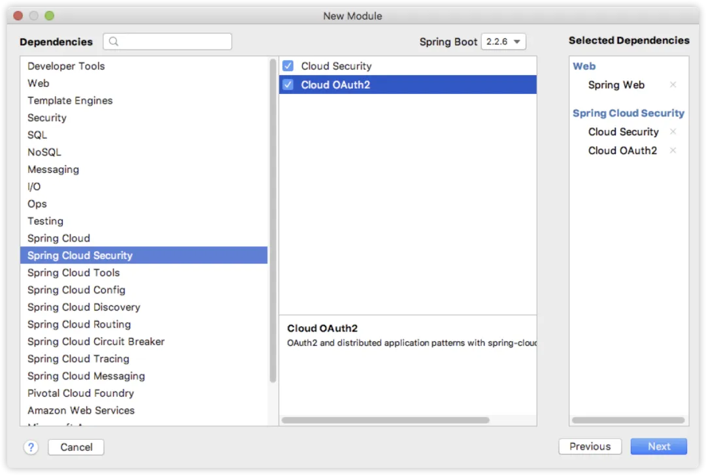
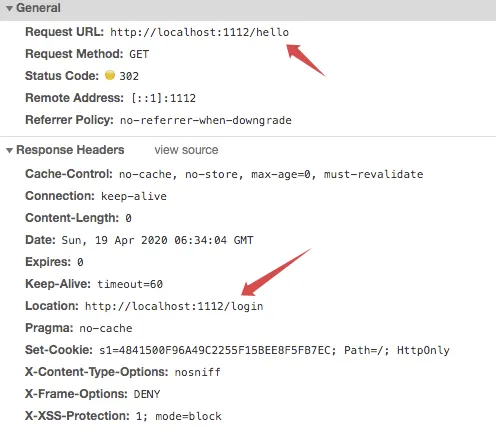

# Spring Boot+OAuth2，一个注解搞定单点登录！

Original 江南一点雨 [江南一点雨](javascript:void(0);) *2020年04月23日 08:37*

今日干货


刚刚发表

查看:66666回复:666

公众号后台回复 ssm，免费获取松哥纯手敲的 SSM 框架学习干货。


**江南一点雨**推荐搜索

springbootspring

需要先说一下，松哥最近写的教程，都是成系列的，有一些重复的东西写来写去就没意思了，所以每一篇文章都默认大家已经懂了前面的内容了，因此下文有任何看不懂的地方，建议一定先看下相关系列：

**「Spring Security 系列：」**

1. [挖一个大坑，Spring Security 开搞！](https://mp.weixin.qq.com/s?__biz=MzI1NDY0MTkzNQ==&mid=2247488106&idx=1&sn=258fc609661f22de5517e1bc5c0915ed&scene=21#wechat_redirect)
2. [松哥手把手带你入门 Spring Security，别再问密码怎么解密了](https://mp.weixin.qq.com/s?__biz=MzI1NDY0MTkzNQ==&mid=2247488113&idx=1&sn=01168c492e22fa287043eb746950da73&scene=21#wechat_redirect)
3. [手把手教你定制 Spring Security 中的表单登录](https://mp.weixin.qq.com/s?__biz=MzI1NDY0MTkzNQ==&mid=2247488138&idx=1&sn=25d18a61a14e4e6316537b6d45e43dd4&scene=21#wechat_redirect)
4. [Spring Security 做前后端分离，咱就别做页面跳转了！统统 JSON 交互](https://mp.weixin.qq.com/s?__biz=MzI1NDY0MTkzNQ==&mid=2247488157&idx=2&sn=845178d45e73232a94ed46df12ea76cc&scene=21#wechat_redirect)
5. [Spring Security 中的授权操作原来这么简单](https://mp.weixin.qq.com/s?__biz=MzI1NDY0MTkzNQ==&mid=2247488185&idx=1&sn=6fe677703312905d39615a001e191bd2&scene=21#wechat_redirect)
6. [Spring Security 如何将用户数据存入数据库？](https://mp.weixin.qq.com/s?__biz=MzI1NDY0MTkzNQ==&mid=2247488194&idx=1&sn=7103031896ba8b9d34095524b292265e&scene=21#wechat_redirect)
7. [Spring Security+Spring Data Jpa 强强联手，安全管理只有更简单！](https://mp.weixin.qq.com/s?__biz=MzI1NDY0MTkzNQ==&mid=2247488229&idx=1&sn=2911c04bf19d41b00b4933d4044590f8&scene=21#wechat_redirect)

**「OAuth2 系列：」**

1. [做微服务绕不过的 OAuth2，松哥也来和大家扯一扯](https://mp.weixin.qq.com/s?__biz=MzI1NDY0MTkzNQ==&mid=2247488209&idx=2&sn=19b1e44fbb1f4c1210f0fa92a618d871&scene=21#wechat_redirect)
2. [这个案例写出来，还怕跟面试官扯不明白 OAuth2 登录流程？](https://mp.weixin.qq.com/s?__biz=MzI1NDY0MTkzNQ==&mid=2247488214&idx=1&sn=5601775213285217913c92768d415eca&scene=21#wechat_redirect)
3. [死磕 OAuth2，教练我要学全套的！](https://mp.weixin.qq.com/s?__biz=MzI1NDY0MTkzNQ==&mid=2247488223&idx=1&sn=d1003f33ac5c866c88aa7542fcdf4992&scene=21#wechat_redirect)
4. [OAuth2 令牌还能存入 Redis ？越玩越溜！](https://mp.weixin.qq.com/s?__biz=MzI1NDY0MTkzNQ==&mid=2247488246&idx=2&sn=b1ee410dbe86f2b748845304f7734d62&scene=21#wechat_redirect)
5. [想让 OAuth2 和 JWT 在一起愉快玩耍？请看松哥的表演](https://mp.weixin.qq.com/s?__biz=MzI1NDY0MTkzNQ==&mid=2247488267&idx=2&sn=0ac88e1685ef0915e71eb3c223bd732f&scene=21#wechat_redirect)
6. [和大家分享一点微服务架构中的安全管理思路](https://mp.weixin.qq.com/s?__biz=MzI1NDY0MTkzNQ==&mid=2247488276&idx=1&sn=403ceff888f155bdb2f0d73931a60532&scene=21#wechat_redirect)

好了，开始今天的正文。

单点登录是我们在分布式系统中很常见的一个需求。

分布式系统由多个不同的子系统组成，而我们在使用系统的时候，只需要登录一次即可，这样其他系统都认为用户已经登录了，不用再去登录。前面和小伙伴们分享了 OAuth2+JWT 的登录方式，这种无状态登录实际上天然的满足单点登录的需求，可以参考：[想让 OAuth2 和 JWT 在一起愉快玩耍？请看松哥的表演](https://mp.weixin.qq.com/s?__biz=MzI1NDY0MTkzNQ==&mid=2247488267&idx=2&sn=0ac88e1685ef0915e71eb3c223bd732f&scene=21#wechat_redirect)。

当然大家也都知道，无状态登录也是有弊端的。

所以今天松哥想和大家说一说 Spring Boot+OAuth2 做单点登录，利用 @EnableOAuth2Sso 注解快速实现单点登录功能。

松哥依然建议大家在阅读本文时，先看看本系列前面的文章，这有助于更好的理解本文。

## 1.项目创建

前面的案例中，松哥一直都把授权服务器和资源服务器分开创建，今天这个案例，为了省事，我就把授权服务器和资源服务器搭建在一起（不过相信大家看了前面的文章，应该也能自己把这两个服务器拆分开）。

所以，今天我们一共需要三个服务：

| 项目        | 端口 | 描述                  |
| :---------- | :--- | :-------------------- |
| auth-server | 1111 | 授权服务器+资源服务器 |
| client1     | 1112 | 子系统1               |
| client2     | 1113 | 子系统2               |

auth-server 用来扮演授权服务器+资源服务器的角色，client1 和 client2 则分别扮演子系统的角色，将来等 client1 登录成功之后，我们也就能访问 client2 了，这样就能看出来单点登录的效果。

我们创建一个名为 oauth2-sso 的 Maven 项目作为父工程即可。

## 2.统一认证中心

接下来我们来搭建统一认证中心。

首先我们创建一个名为 auth-server 的 module，创建时添加如下依赖：



项目创建成功之后，这个模块由于要扮演授权服务器+资源服务器的角色，所以我们先在这个项目的启动类上添加 @EnableResourceServer 注解，表示这是一个资源服务器：

```
@SpringBootApplication
@EnableResourceServer
public class AuthServerApplication {

    public static void main(String[] args) {
        SpringApplication.run(AuthServerApplication.class, args);
    }

}
```

接下来我们进行授权服务器的配置，由于资源服务器和授权服务器合并在一起，因此授权服务器的配置要省事很多：

```
@Configuration
@EnableAuthorizationServer
public class AuthServerConfig extends AuthorizationServerConfigurerAdapter {
    @Autowired
    PasswordEncoder passwordEncoder;

    @Override
    public void configure(ClientDetailsServiceConfigurer clients) throws Exception {
        clients.inMemory()
                .withClient("javaboy")
                .secret(passwordEncoder.encode("123"))
                .autoApprove(true)
                .redirectUris("http://localhost:1112/login", "http://localhost:1113/login")
                .scopes("user")
                .accessTokenValiditySeconds(7200)
                .authorizedGrantTypes("authorization_code");

    }
}
```

这里我们只需要简单配置一下客户端的信息即可，这里的配置很简单，前面的文章也讲过了，大家要是不懂，可以参考本系列前面的文章：[这个案例写出来，还怕跟面试官扯不明白 OAuth2 登录流程？](https://mp.weixin.qq.com/s?__biz=MzI1NDY0MTkzNQ==&mid=2247488214&idx=1&sn=5601775213285217913c92768d415eca&scene=21#wechat_redirect)。

当然这里为了简便，客户端的信息配置是基于内存的，如果大家想将客户端信息存入数据库中，也是可以的，参考：[OAuth2 令牌还能存入 Redis ？越玩越溜！](https://mp.weixin.qq.com/s?__biz=MzI1NDY0MTkzNQ==&mid=2247488246&idx=2&sn=b1ee410dbe86f2b748845304f7734d62&scene=21#wechat_redirect)

接下来我们再来配置 Spring Security：

```
@Configuration
@Order(1)
public class SecurityConfig extends WebSecurityConfigurerAdapter {
    @Bean
    PasswordEncoder passwordEncoder() {
        return new BCryptPasswordEncoder();
    }
    @Override
    public void configure(WebSecurity web) throws Exception {
        web.ignoring().antMatchers("/login.html", "/css/**", "/js/**", "/images/**");
    }

    @Override
    protected void configure(HttpSecurity http) throws Exception {
        http.requestMatchers()
                .antMatchers("/login")
                .antMatchers("/oauth/authorize")
                .and()
                .authorizeRequests().anyRequest().authenticated()
                .and()
                .formLogin()
                .loginPage("/login.html")
                .loginProcessingUrl("/login")
                .permitAll()
                .and()
                .csrf().disable();
    }

    @Override
    protected void configure(AuthenticationManagerBuilder auth) throws Exception {
        auth.inMemoryAuthentication()
                .withUser("sang")
                .password(passwordEncoder().encode("123"))
                .roles("admin");
    }
}
```

关于 Spring Security 的配置，如果小伙伴们不懂，可以看看松哥最近正在连载的 Spring Security 系列。

我这里来大致捋一下：

1. 首先提供一个 BCryptPasswordEncoder 的实例，用来做密码加解密用。
2. 由于我自定义了登录页面，所以在 WebSecurity 中对这些静态资源方形。
3. HttpSecurity 中，我们对认证相关的端点放行，同时配置一下登录页面和登录接口。
4. AuthenticationManagerBuilder 中提供一个基于内存的用户（小伙伴们可以根据 Spring Security 系列第 7 篇文章自行调整为从数据库加载）。
5. 另外还有一个比较关键的地方，因为资源服务器和授权服务器在一起，所以我们需要一个 @Order 注解来提升 Spring Security 配置的优先级。

SecurityConfig 和 AuthServerConfig 都是授权服务器需要提供的东西（如果小伙伴们想将授权服务器和资源服务器拆分，请留意这句话），接下来，我们还需要提供一个暴露用户信息的接口（如果将授权服务器和资源服务器分开，这个接口将由资源服务器提供）：

```
@RestController
public class UserController {
    @GetMapping("/user")
    public Principal getCurrentUser(Principal principal) {
        return principal;
    }
}
```

最后，我们在 application.properties 中配置一下项目端口：

```
server.port=1111
```

另外，松哥自己提前准备了一个登录页面，如下：


将登录页面相关的 html、css、js 等拷贝到 resources/static 目录下：


这个页面很简单，就是一个登录表单而已，我把核心部分列出来：

```
<form action="/login" method="post">
    <div class="input">
        <label for="name">用户名</label>
        <input type="text" name="username" id="name">
        <span class="spin"></span>
    </div>
    <div class="input">
        <label for="pass">密码</label>
        <input type="password" name="password" id="pass">
        <span class="spin"></span>
    </div>
    <div class="button login">
        <button type="submit">
            <span>登录</span>
            <i class="fa fa-check"></i>
        </button>
    </div>
</form>
```

注意一下 action 提交地址不要写错即可。

**「文末可以下载源码。」**

如此之后，我们的统一认证登录平台就算是 OK 了。

## 3.客户端创建

接下来我们来创建一个客户端项目，创建一个名为 client1 的 Spring Boot 项目，添加如下依赖：


项目创建成功之后，我们来配置一下 Spring Security：

```
@Configuration
@EnableOAuth2Sso
public class SecurityConfig extends WebSecurityConfigurerAdapter {
    @Override
    protected void configure(HttpSecurity http) throws Exception {
        http.authorizeRequests().anyRequest().authenticated().and().csrf().disable();
    }
}
```

这段配置很简单，就是说我们 client1 中所有的接口都需要认证之后才能访问，另外添加一个 @EnableOAuth2Sso 注解来开启单点登录功能。

接下来我们在 client1 中再来提供一个测试接口：

```
@RestController
public class HelloController {
    @GetMapping("/hello")
    public String hello() {
        Authentication authentication = SecurityContextHolder.getContext().getAuthentication();
        return authentication.getName() + Arrays.toString(authentication.getAuthorities().toArray());
    }
}
```

这个测试接口返回当前登录用户的姓名和角色信息。

接下来我们需要在 client1 的 application.properties 中配置 oauth2 的相关信息：

```
security.oauth2.client.client-secret=123
security.oauth2.client.client-id=javaboy
security.oauth2.client.user-authorization-uri=http://localhost:1111/oauth/authorize
security.oauth2.client.access-token-uri=http://localhost:1111/oauth/token
security.oauth2.resource.user-info-uri=http://localhost:1111/user

server.port=1112

server.servlet.session.cookie.name=s1
```

这里的配置也比较熟悉，我们来看一下：

1. client-secret 是客户端密码。
2. client-id 是客户端 id。
3. user-authorization-uri 是用户授权的端点。
4. access-token-uri 是获取令牌的端点。
5. user-info-uri 是获取用户信息的接口（从资源服务器上获取）。
6. 最后再配置一下端口，然后给 cookie 取一个名字。

如此之后，我们的 client1 就算是配置完成了。

按照相同的方式，我们再来配置一个 client2，client2 和 client1 一模一样，就是 cookie 的名字不同（随意取，不相同即可）。

## 4.测试

接下来，我们分别启动 auth-server、client1 和 client2，首先我们尝试去方式 client1 中的 hello 接口，这个时候会自动跳转到统一认证中心：


然后输入用户名密码进行登录。

登录成功之后，会自动跳转回 client1 的 hello 接口，如下：


此时我们再去访问 client2 ，发现也不用登录了，直接就可以访问：


OK，如此之后，我们的单点登录就成功了。

## 5.流程解析

最后，我再来和小伙伴们把上面代码的一个执行流程捋一捋：

1. 首先我们去访问 client1 的 /hello 接口，但是这个接口是需要登录才能访问的，因此我们的请求被拦截下来，拦截下来之后，系统会给我们重定向到 client1 的 /login 接口，这是让我们去登录。



1. 当我们去访问 client1 的登录接口时，由于我们配置了 @EnableOAuth2Sso 注解，这个操作会再次被拦截下来，单点登录拦截器会根据我们在 application.properties 中的配置，自动发起请求去获取授权码：


1. 在第二步发送的请求是请求 auth-server 服务上的东西，这次请求当然也避免不了要先登录，所以再次重定向到 auth-server 的登录页面，也就是大家看到的统一认证中心。
2. 在统一认真中心我们完成登录功能，登录完成之后，会继续执行第二步的请求，这个时候就可以成功获取到授权码了。


1. 获取到授权码之后，这个时候会重定向到我们 client1 的 login 页面，但是实际上我们的 client1 其实是没有登录页面的，所以这个操作依然会被拦截，此时拦截到的地址包含有授权码，拿着授权码，在 OAuth2ClientAuthenticationProcessingFilter 类中向 auth-server 发起请求，就能拿到 access_token 了（参考：[这个案例写出来，还怕跟面试官扯不明白 OAuth2 登录流程？](https://mp.weixin.qq.com/s?__biz=MzI1NDY0MTkzNQ==&mid=2247488214&idx=1&sn=5601775213285217913c92768d415eca&scene=21#wechat_redirect)）。
2. 在第五步拿到 access_token 之后，接下来在向我们配置的 user-info-uri 地址发送请求，获取登录用户信息，拿到用户信息之后，在 client1 上自己再走一遍 Spring Security 登录流程，这就 OK 了。

OK，本文和小伙伴们聊了一些 SpringBoot +OAuth2 单点登录的问题，完整案例下载地址：https://github.com/lenve/oauth2-samples

**如果小伙伴们觉得有用的话，记得点个在看鼓励下松哥。**

今日干货


刚刚发表

查看:13500回复:135

公众号后台回复 SpringBoot，免费获取 274 页SpringBoot修炼手册。

OAuth2系列10

OAuth2系列 · 目录


