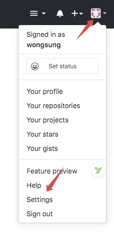
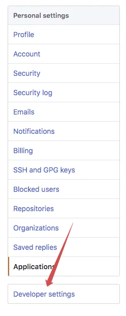
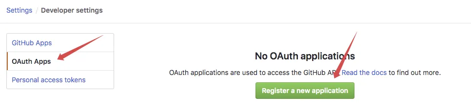
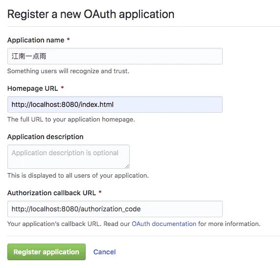
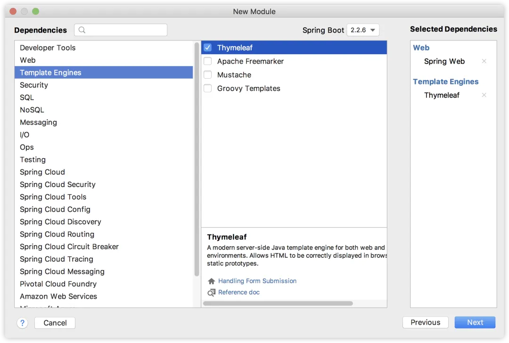
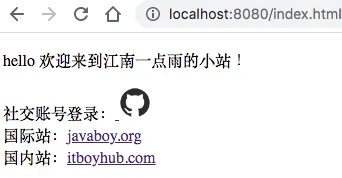

# 分分钟让自己的网站接入 GitHub 第三方登录功能

Original 江南一点雨 [江南一点雨](javascript:void(0);) *2020年04月24日 08:36*

今日干货


刚刚发表

查看:66666回复:666

公众号后台回复 ssm，免费获取松哥纯手敲的 SSM 框架学习干货。


**江南一点雨**推荐搜索

springspringboot

OAuth2 和小伙伴们已经聊了很多了，咱们来一个实际点的案例练练手。

这里我才用 GitHub 来做第三方登录。

为什么是 GitHub 呢？有两方面考虑：

1. 程序员基本上都有 GitHub 账号，测试方便。
2. 国内的无论 QQ、微信、微博等，都需要注册审核，很费时间。
3. 流程都是一样的，会做 GitHub 第三方登录，就会做 QQ 第三方登录。

当然，本系列前面几篇文章还是建议小伙伴们先看一下，这样可以更好的理解本文。

1. [做微服务绕不过的 OAuth2，松哥也来和大家扯一扯](https://mp.weixin.qq.com/s?__biz=MzI1NDY0MTkzNQ==&mid=2247488209&idx=2&sn=19b1e44fbb1f4c1210f0fa92a618d871&scene=21#wechat_redirect)
2. [这个案例写出来，还怕跟面试官扯不明白 OAuth2 登录流程？](https://mp.weixin.qq.com/s?__biz=MzI1NDY0MTkzNQ==&mid=2247488214&idx=1&sn=5601775213285217913c92768d415eca&scene=21#wechat_redirect)
3. [死磕 OAuth2，教练我要学全套的！](https://mp.weixin.qq.com/s?__biz=MzI1NDY0MTkzNQ==&mid=2247488223&idx=1&sn=d1003f33ac5c866c88aa7542fcdf4992&scene=21#wechat_redirect)
4. [OAuth2 令牌还能存入 Redis ？越玩越溜！](https://mp.weixin.qq.com/s?__biz=MzI1NDY0MTkzNQ==&mid=2247488246&idx=2&sn=b1ee410dbe86f2b748845304f7734d62&scene=21#wechat_redirect)
5. [想让 OAuth2 和 JWT 在一起愉快玩耍？请看松哥的表演](https://mp.weixin.qq.com/s?__biz=MzI1NDY0MTkzNQ==&mid=2247488267&idx=2&sn=0ac88e1685ef0915e71eb3c223bd732f&scene=21#wechat_redirect)
6. [最近在做 Spring Cloud 项目，松哥和大家分享一点微服务架构中的安全管理思路](https://mp.weixin.qq.com/s?__biz=MzI1NDY0MTkzNQ==&mid=2247488276&idx=1&sn=403ceff888f155bdb2f0d73931a60532&scene=21#wechat_redirect)
7. [Spring Boot+OAuth2，一个注解搞定单点登录！](https://mp.weixin.qq.com/s?__biz=MzI1NDY0MTkzNQ==&mid=2247488278&idx=1&sn=b21345a1daa86dd48ea89cdb9138def8&scene=21#wechat_redirect)

好了，不废话，我们开始今天的案例。

## 1.准备工作

首先登录自己的 GitHub 账户，右上角点击个人面板，选择 Settings：



然后点击左边菜单底部的 Developer settings：



然后选择 OAuth Apps，点击 Register a new application 按钮：



接下来注册你的应用信息



从上往下，依次是你的项目名称、首页地址、项目描述、授权成功回调地址。信息填完之后，点击下方的 Register application 按钮完成注册。

注册完成之后，我们就可以获取到一个 Client ID 和一个 Client Secret，这就是我们登录时客户端的凭据。


这两个信息保存好，不要外泄。

写到这里，松哥不由得感叹一句，还是国外的应用香啊，用 GitHub 做第三方登录，一分钟不到，准备工作就完成了，用 QQ 做，我的资料已经提交两天了，目前的状态还是审核中。。。不过我也理解腾讯所面临的监管问题。

## 2.创建应用

接下来我们来简单创建一个自己的网站，我们依然使用 Spring Boot 项目，添加如下依赖：



然后我们在 resources/templates 目录下创建一个简单的 index.html:

```
<body>
<p>hello 欢迎来到江南一点雨的小站！</p>
<div>
    社交账号登录：<a href="https://github.com/login/oauth/authorize?client_id=xxxxxx&state=javaboy">
        <svg t="1587352912571" class="icon" viewBox="0 0 1024 1024" version="1.1" xmlns="http://www.w3.org/2000/svg"
             p-id="2196" width="32" height="32">
            <path d="M512 42.666667A464.64 464.64 0 0 0 42.666667 502.186667 460.373333 460.373333 0 0 0 363.52 938.666667c23.466667 4.266667 32-9.813333 32-22.186667v-78.08c-130.56 27.733333-158.293333-61.44-158.293333-61.44a122.026667 122.026667 0 0 0-52.053334-67.413333c-42.666667-28.16 3.413333-27.733333 3.413334-27.733334a98.56 98.56 0 0 1 71.68 47.36 101.12 101.12 0 0 0 136.533333 37.973334 99.413333 99.413333 0 0 1 29.866667-61.44c-104.106667-11.52-213.333333-50.773333-213.333334-226.986667a177.066667 177.066667 0 0 1 47.36-124.16 161.28 161.28 0 0 1 4.693334-121.173333s39.68-12.373333 128 46.933333a455.68 455.68 0 0 1 234.666666 0c89.6-59.306667 128-46.933333 128-46.933333a161.28 161.28 0 0 1 4.693334 121.173333A177.066667 177.066667 0 0 1 810.666667 477.866667c0 176.64-110.08 215.466667-213.333334 226.986666a106.666667 106.666667 0 0 1 32 85.333334v125.866666c0 14.933333 8.533333 26.88 32 22.186667A460.8 460.8 0 0 0 981.333333 502.186667 464.64 464.64 0 0 0 512 42.666667"
                  fill="#2c2c2c" p-id="2197"></path>
        </svg>
    </a>
</div>
<div>国际站：<a href="http://www.javaboy.org">javaboy.org</a></div>
<div>国内站：<a href="http://www.itboyhub.com">itboyhub.com</a></div>
</body>
```

这就是一个简单的 HTML 页面，页面上有一个 GitHub 的图标，点击这个图标，就可以去 GitHub 上完成授权操作，注意授权的链接如下：

- https://github.com/login/oauth/authorize

这个授权需要携带一个 client_id 参数，这个 client_id 就是准备工作中获取到的 client_id，另外一个 state 则是用来防止跨站脚本攻击的，state 参数的值可以自己随意填写。

我们来看下页面的效果图：



当我们点击 GitHub 图标，完成授权操作之后，会自动跳转到我们在准备工作填的回调地址中，并且携带一个 code 参数，拿着这个 code 参数我们就可以去获取 access_token 了，有了 access_token 我们就可以获取到用户信息了。

因此，我们再来添加一个 /authorization_code 接口，如下：

```
@GetMapping("/authorization_code")
public String authorization_code(String code) {
    Map<String, String> map = new HashMap<>();
    map.put("client_id", "xxx");
    map.put("client_secret", "xxxx");
    map.put("state", "javaboy");
    map.put("code", code);
    map.put("redirect_uri", "http://localhost:8080/authorization_code");
    Map<String,String> resp = restTemplate.postForObject("https://github.com/login/oauth/access_token", map, Map.class);
    System.out.println(resp);
    HttpHeaders httpheaders = new HttpHeaders();
    httpheaders.add("Authorization", "token " + resp.get("access_token"));
    HttpEntity<?> httpEntity = new HttpEntity<>(httpheaders);
    ResponseEntity<Map> exchange = restTemplate.exchange("https://api.github.com/user", HttpMethod.GET, httpEntity, Map.class);
    System.out.println("exchange.getBody() = " + exchange.getBody());
    return "forward:/index.html";
}
```

在 authorization_code 接口中，我们首先向 http://localhost:8080/authorization_code 发起请求去获取 access_token，注意我们需要的参数，client_id 和 client_secret 使我们第一步准备工作申请到的。获取到 access_token 的数据格式如下：

```
{access_token=9f33730ef09b74943a1cf7d8f9c0e567b9286829, token_type=bearer, scope=}
```

可以看到，有 access_token，有 token_type，也有 scope。

接下来，拿着 access_token ，将 access_token 放在请求头里边，我们就可以去调用 https://api.github.com/user 接口获取用户信息了，获取到的用户信息格式如下：

```
{
    "login":"lenve",
    "id":35444368,
    "node_id":"MDQ6VXNlcjM1NDQ0MzY4",
    "avatar_url":"https://avatars3.githubusercontent.com/u/35444368?v=4",
    "gravatar_id":"",
    "url":"https://api.github.com/users/lenve",
    "html_url":"https://github.com/lenve",
    "followers_url":"https://api.github.com/users/lenve/followers",
    "following_url":"https://api.github.com/users/lenve/following{/other_user}",
    "gists_url":"https://api.github.com/users/lenve/gists{/gist_id}",
    "starred_url":"https://api.github.com/users/lenve/starred{/owner}{/repo}",
    "subscriptions_url":"https://api.github.com/users/lenve/subscriptions",
    "organizations_url":"https://api.github.com/users/lenve/orgs",
    "repos_url":"https://api.github.com/users/lenve/repos",
    "events_url":"https://api.github.com/users/lenve/events{/privacy}",
    "received_events_url":"https://api.github.com/users/lenve/received_events",
    "type":"User",
    "site_admin":false,
    "name":null,
    "company":null,
    "blog":"",
    "location":null,
    "email":null,
    "hireable":null,
    "bio":null,
    "public_repos":2,
    "public_gists":0,
    "followers":1,
    "following":1,
    "created_at":"2018-01-15T06:05:04Z",
    "updated_at":"2020-04-20T03:00:49Z"
}
```

好了，用户的 GitHub 信息现在已经获取到了，接下来该存数据库就存数据库，该接入自己的登录流程就接入。

如此之后，我们就完成了第三方登录功能，其实还是非常 Easy 的，只要大家把这个流程走通，以后想接入微信登录、QQ 登录，都将是非常容易的事情。

本文案例下载地址：https://github.com/lenve/oauth2-samples

好了，本文就先说这么多，有问题欢迎留言讨论。

今日干货


刚刚发表

查看:13500回复:135

公众号后台回复 SpringBoot，免费获取 274 页SpringBoot修炼手册。

OAuth2系列10

OAuth2系列 · 目录


上一篇Spring Boot+OAuth2，一个注解搞定单点登录！下一篇Spring Boot+OAuth2，如何自定义返回的 Token 信息？


# 


Scan to Follow