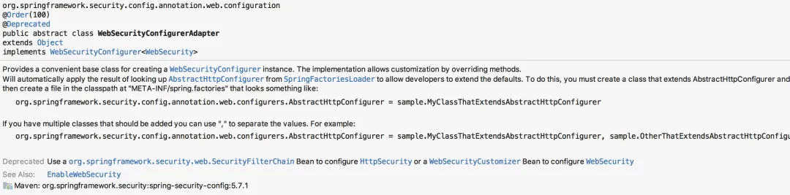
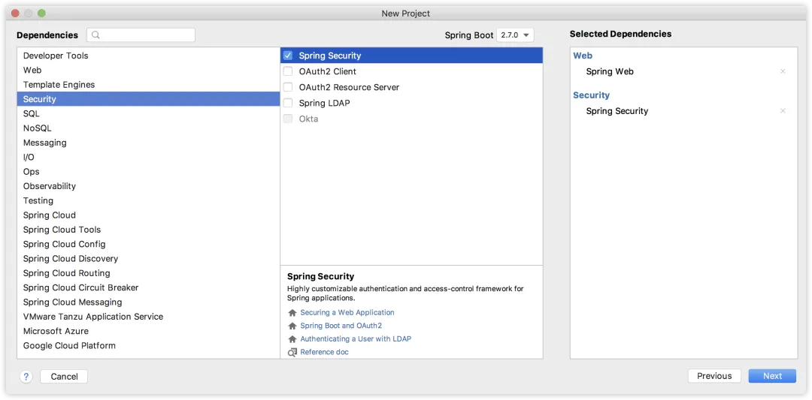

# 新版 Spring Security 配置的变化

Original 江南一点雨 [江南一点雨](javascript:void(0);) *2023年04月10日 11:36* *广东*

**这是去年的一篇旧文，但是一直有小伙伴在问这个问题，因此这篇文章我又拎出来重发一下。**

------

进入到 SpringBoot2.7 时代，有小伙伴发现有一个常用的类忽然过期了：


在 Spring Security 时代，这个类可太重要了。过期的类当然可以继续使用，但是你要是决定别扭，只需要稍微看一下注释，基本上就明白该怎么玩了。

我们来看下 WebSecurityConfigurerAdapter 的注释：



从这段注释中我们大概就明白了咋回事了。

以前我们自定义类继承自 WebSecurityConfigurerAdapter 来配置我们的 Spring Security，我们主要是配置两个东西：

- configure(HttpSecurity)
- configure(WebSecurity)

前者主要是配置 Spring Security 中的过滤器链，后者则主要是配置一些路径放行规则。

现在在 WebSecurityConfigurerAdapter 的注释中，人家已经把意思说的很明白了：

1. 以后如果想要配置过滤器链，可以通过自定义 SecurityFilterChain Bean 来实现。
2. 以后如果想要配置 WebSecurity，可以通过 WebSecurityCustomizer Bean 来实现。

那么接下来我们就通过一个简单的例子来看下。

首先我们新建一个 Spring Boot 工程，引入 Web 和 Spring Security 依赖，注意 Spring Boot 选择最新的 2.7。



接下来我们提供一个简单的测试接口，如下：

```
@RestController
public class HelloController {

    @GetMapping("/hello")
    public String hello() {
        return "hello 江南一点雨!";
    }
}
```

小伙伴们知道，在 Spring Security 中，默认情况下，只要添加了依赖，我们项目的所有接口就已经被统统保护起来了，现在启动项目，访问 `/hello` 接口，就需要登录之后才可以访问，登录的用户名是 user，密码则是随机生成的，在项目的启动日志中。

现在我们的第一个需求是使用自定义的用户，而不是系统默认提供的，这个简单，我们只需要向 Spring 容器中注册一个 UserDetailsService 的实例即可，像下面这样：

```
@Configuration
public class SecurityConfig {

    @Bean
    UserDetailsService userDetailsService() {
        InMemoryUserDetailsManager users = new InMemoryUserDetailsManager();
        users.createUser(User.withUsername("javaboy").password("{noop}123").roles("admin").build());
        users.createUser(User.withUsername("江南一点雨").password("{noop}123").roles("admin").build());
        return users;
    }

}
```

这就可以了。

当然我现在的用户是存在内存中的，如果你的用户是存在数据库中，那么只需要提供 UserDetailsService 接口的实现类并注入 Spring 容器即可，这个之前在 vhr 视频中讲过多次了（公号后台回复 666 有视频介绍），这里就不再赘述了。

但是假如说我希望 `/hello` 这个接口能够匿名访问，并且我希望这个匿名访问还不经过 Spring Security 过滤器链，要是在以前，我们可以重写 `configure(WebSecurity)` 方法进行配置，但是现在，得换一种玩法：

```
@Configuration
public class SecurityConfig {

    @Bean
    UserDetailsService userDetailsService() {
        InMemoryUserDetailsManager users = new InMemoryUserDetailsManager();
        users.createUser(User.withUsername("javaboy").password("{noop}123").roles("admin").build());
        users.createUser(User.withUsername("江南一点雨").password("{noop}123").roles("admin").build());
        return users;
    }

    @Bean
    WebSecurityCustomizer webSecurityCustomizer() {
        return new WebSecurityCustomizer() {
            @Override
            public void customize(WebSecurity web) {
                web.ignoring().antMatchers("/hello");
            }
        };
    }

}
```

以前位于 `configure(WebSecurity)` 方法中的内容，现在位于 WebSecurityCustomizer Bean 中，该配置的东西写在这里就可以了。

那如果我还希望对登录页面，参数等，进行定制呢？继续往下看：

```
@Configuration
public class SecurityConfig {

    @Bean
    UserDetailsService userDetailsService() {
        InMemoryUserDetailsManager users = new InMemoryUserDetailsManager();
        users.createUser(User.withUsername("javaboy").password("{noop}123").roles("admin").build());
        users.createUser(User.withUsername("江南一点雨").password("{noop}123").roles("admin").build());
        return users;
    }

    @Bean
    SecurityFilterChain securityFilterChain() {
        List<Filter> filters = new ArrayList<>();
        return new DefaultSecurityFilterChain(new AntPathRequestMatcher("/**"), filters);
    }

}
```

Spring Security 的底层实际上就是一堆过滤器，所以我们之前在 configure(HttpSecurity) 方法中的配置，实际上就是配置过滤器链。现在过滤器链的配置，我们通过提供一个 SecurityFilterChain Bean 来配置过滤器链，SecurityFilterChain 是一个接口，这个接口只有一个实现类 DefaultSecurityFilterChain，构建 DefaultSecurityFilterChain 的第一个参数是拦截规则，也就是哪些路径需要拦截，第二个参数则是过滤器链，这里我给了一个空集合，也就是我们的 Spring Security 会拦截下所有的请求，然后在一个空集合中走一圈就结束了，相当于不拦截任何请求。

此时重启项目，你会发现 `/hello` 也是可以直接访问的，就是因为这个路径不经过任何过滤器。

其实我觉得目前这中新写法比以前老的写法更直观，更容易让大家理解到 Spring Security 底层的过滤器链工作机制。

有小伙伴会说，这写法跟我以前写的也不一样呀！这么配置，我也不知道 Spring Security 中有哪些过滤器，其实，换一个写法，我们就可以将这个配置成以前那种样子：

```
@Configuration
public class SecurityConfig {

    @Bean
    UserDetailsService userDetailsService() {
        InMemoryUserDetailsManager users = new InMemoryUserDetailsManager();
        users.createUser(User.withUsername("javaboy").password("{noop}123").roles("admin").build());
        users.createUser(User.withUsername("江南一点雨").password("{noop}123").roles("admin").build());
        return users;
    }

    @Bean
    SecurityFilterChain securityFilterChain(HttpSecurity http) throws Exception {
        http.authorizeRequests()
                .anyRequest().authenticated()
                .and()
                .formLogin()
                .permitAll()
                .and()
                .csrf().disable();
        return http.build();
    }

}
```

这么写，就跟以前的写法其实没啥大的差别了。

好啦，多余的废话我就不多说了，小伙伴们可以去试试最新玩法啦～

**TienChin 视频杀青啦～采用 Spring Boot+Vue3 技术栈，里边会涉及到各种好玩的技术，小伙伴们来和松哥一起做一个完成率超 90% 的项目，戳戳戳这里-->TienChin 项目配套视频来啦。**

tienchin241

SpringSecurity38

SpringSecurity · 目录


上一篇WebFlux 和 Spring Security 会碰出哪些火花？下一篇新版SpringSecurity如何自定义JSON登录


# 


Scan to Follow