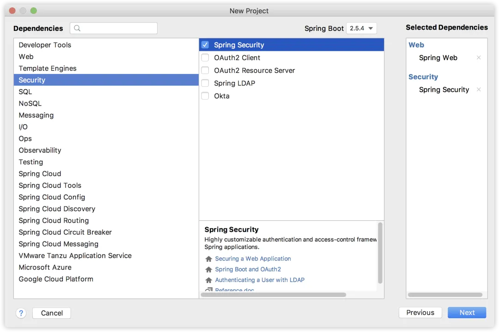
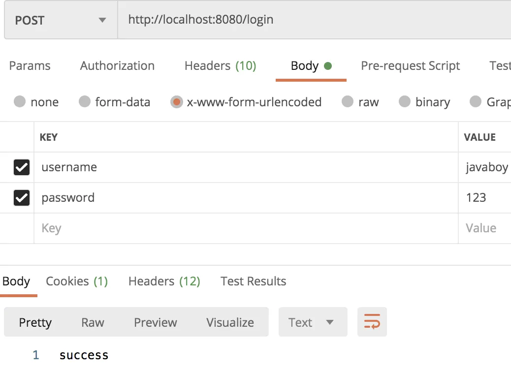

# Spring Security 玩出花！两种方式 DIY 登录

Original 江南一点雨 [江南一点雨](javascript:void(0);) *2021年09月24日 17:16*

一般情况下，我们在使用 Spring Security 的时候，用的是 Spring Security 自带的登录方案，配置一下登录接口，配置一下登录参数，再配置一下登录回调就能用了，这种用法可以算是最佳实践了！

但是！

总会有一些奇奇怪怪得需求，例如想自定义登录，像 Shiro 那样自己写登录逻辑，如果要实现这一点，该怎么做？今天松哥就来和大家分享一下。

松哥琢磨了一下，想在 Spring Security 中自定义登录逻辑，我们有两种思路，不过这两种思路底层实现其实异曲同工，我们一起来看下。

## 1. 化腐朽为神奇

前面松哥和大家分享了一个 Spring Security 视频：

- [没见过的奇葩登录](https://mp.weixin.qq.com/s?__biz=MzI1NDY0MTkzNQ==&mid=2247494757&idx=1&sn=c6b96413cba8bd2b6c0d4bce7a3e7a10&scene=21#wechat_redirect)

这个视频里主要是和大家分享了我们其实可以使用 HttpServletRequest 来完成系统的登录，这其实是 JavaEE 的规范，这种登录方式虽然冷门，但是却很好玩！

然后松哥还和大家分享了一个视频：

- [SpringSecurity登录数据获取最后一讲](https://mp.weixin.qq.com/s?__biz=MzI1NDY0MTkzNQ==&mid=2247494784&idx=1&sn=06e0a00033e328dd8b4d2a98927143ee&scene=21#wechat_redirect)

这个视频其实是在讲 Spring Security 对 HttpServletRequest 登录逻辑的实现，或句话说，HttpServletRequest 中提供的那几个和登录相关的 API，Spring Security 都按照自己的实现方式对其进行了重写。

有了这两个储备知识后，第一个 DIY Spring Security 登录的方案呼之欲出。

### 1.1 实践

我们来看看具体操作。

首先我们来创建一个 Spring Boot 工程，引入 Web 和 Security 两个依赖，如下：



方便起见，我们在 application.properties 中配置一下默认的用户名密码：

```
spring.security.user.name=javaboy
spring.security.user.password=123
```

接下来我们提供一个 SecurityConfig，为登录接口放行：

```
@Configuration
public class SecurityConfig extends WebSecurityConfigurerAdapter {
    @Override
    protected void configure(HttpSecurity http) throws Exception {
        http.authorizeRequests()
                .antMatchers("/login")
                .permitAll()
                .anyRequest().authenticated()
                .and()
                .csrf().disable();
    }
}
```

登录接口就是 `/login`，一会我们自定义的登录逻辑就写在这个里边，我们来看下：

```
@RestController
public class LoginController {
    @PostMapping("/login")
    public String login(String username, String password, HttpServletRequest req) {
        try {
            req.login(username, password);
            return "success";
        } catch (ServletException e) {
            e.printStackTrace();
        }
        return "failed";
    }
}
```

直接调用 HttpServletRequest#login 方法，传入用户名和密码完成登录操作。

最后我们再提供一个测试接口，如下：

```
@RestController
public class HelloController {
    @GetMapping("/hello")
    public String hello() {
        return "hello security!";
    }
}
```

just this！

启动项目，我们首先访问 `/hello` 接口，会访问失败，接下来我们访问 `/login` 接口执行登录操作，如下：



登录成功之后，再去访问 `/hello` 接口，此时就可以访问成功了。

是不是很 Easy？登录成功后，以后的授权等操作都还是原来的写法不变。

### 1.2 原理分析

上面这种登录方式的原理其实松哥一开始就介绍过了，如果大家还不熟悉，可以看看这两个视频就懂了：

- [没见过的奇葩登录](https://mp.weixin.qq.com/s?__biz=MzI1NDY0MTkzNQ==&mid=2247494757&idx=1&sn=c6b96413cba8bd2b6c0d4bce7a3e7a10&scene=21#wechat_redirect)
- [SpringSecurity登录数据获取最后一讲](https://mp.weixin.qq.com/s?__biz=MzI1NDY0MTkzNQ==&mid=2247494784&idx=1&sn=06e0a00033e328dd8b4d2a98927143ee&scene=21#wechat_redirect)

这里我也是稍微说两句。

我们在 LoginController#login 方法中所获取到的 HttpServletRequest 实例其实是 HttpServlet3RequestFactory 中的一个内部类 Servlet3SecurityContextHolderAwareRequestWrapper 的对象，在这个类中，重写了 HttpServletRequest 的 login 以及 authenticate 等方法，我们先来看看 login 方法，如下：

```
@Override
public void login(String username, String password) throws ServletException {
 if (isAuthenticated()) {
  throw new ServletException("Cannot perform login for '" + username + "' already authenticated as '"
    + getRemoteUser() + "'");
 }
 AuthenticationManager authManager = HttpServlet3RequestFactory.this.authenticationManager;
 if (authManager == null) {
  HttpServlet3RequestFactory.this.logger.debug(
    "authenticationManager is null, so allowing original HttpServletRequest to handle login");
  super.login(username, password);
  return;
 }
 Authentication authentication = getAuthentication(authManager, username, password);
 SecurityContextHolder.getContext().setAuthentication(authentication);
}
```

可以看到：

1. 如果用户已经认证了，就抛出异常。
2. 获取到一个 AuthenticationManager 对象。
3. 调用 getAuthentication 方法完成登录，在该方法中，会根据用户名密码构建 UsernamePasswordAuthenticationToken 对象，然后调用 Authentication#authenticate 方法完成登录，具体代码如下：

```
private Authentication getAuthentication(AuthenticationManager authManager, String username, String password)
  throws ServletException {
 try {
  return authManager.authenticate(new UsernamePasswordAuthenticationToken(username, password));
 }
 catch (AuthenticationException ex) {
  SecurityContextHolder.clearContext();
  throw new ServletException(ex.getMessage(), ex);
 }
}
```

> ❝
>
> 该方法返回的是一个认证后的 Authentication 对象。

1. 最后，将认证后的 Authentication 对象存入 SecurityContextHolder 中，这里的具体逻辑我就不啰嗦了，我在公众号【江南一点雨】之前的视频中已经讲过多次了。

这就是 login 方法的执行逻辑。

Servlet3SecurityContextHolderAwareRequestWrapper 类也重写了 HttpServletRequest#authenticate 方法，这个也是做认证的方法：

```
@Override
public boolean authenticate(HttpServletResponse response) throws IOException, ServletException {
 AuthenticationEntryPoint entryPoint = HttpServlet3RequestFactory.this.authenticationEntryPoint;
 if (entryPoint == null) {
  HttpServlet3RequestFactory.this.logger.debug(
    "authenticationEntryPoint is null, so allowing original HttpServletRequest to handle authenticate");
  return super.authenticate(response);
 }
 if (isAuthenticated()) {
  return true;
 }
 entryPoint.commence(this, response,
   new AuthenticationCredentialsNotFoundException("User is not Authenticated"));
 return false;
}
```

可以看到，这个方法用来判断用户是否已经完成认证操作，返回 true 表示用户已经完成认证，返回 false 表示用户尚未完成认证工作。

## 2. 源码的力量

看了上面的原理分析，大家应该也明白了第二种方案了，就是不使用 HttpServletRequest#login 方法，我们直接调用 AuthenticationManager 进行登录验证。

一起来看下。

首先我们修改配置类如下：

```
@Configuration
public class SecurityConfig extends WebSecurityConfigurerAdapter {
    @Override
    protected void configure(HttpSecurity http) throws Exception {
        http.authorizeRequests()
                .antMatchers("/login","/login2")
                .permitAll()
                .anyRequest().authenticated()
                .and()
                .csrf().disable();
    }

    @Override
    @Bean
    public AuthenticationManager authenticationManagerBean() throws Exception {
        DaoAuthenticationProvider provider = new DaoAuthenticationProvider();
        InMemoryUserDetailsManager manager = new InMemoryUserDetailsManager();
        manager.createUser(User.withUsername("javaboy").password("{noop}123").roles("admin").build());
        provider.setUserDetailsService(manager);
        return new ProviderManager(provider);
    }
}
```

1. 首先在登录放行中，添加 `/login2` 接口，这是我即将自定义的第二个登录接口。
2. 提供一个 AuthenticationManager 实例，关于 AuthenticationManager 的玩法松哥在之前的 Spring Security 系列中已经多次分享过，这里就不再赘述（没看过的小伙伴公众号后台回复 `ss`）。创建 AuthenticationManager 实例时，还需要提供一个 DaoAuthenticationProvider，大家知道，用户密码的校验工作在这个类里边完成，并为 DaoAuthenticationProvider 配置一个 UserDetailsService 实例，该实体提供了用户数据源。

接下来提供一个登录接口：

```
@RestController
public class LoginController {
    @Autowired
    AuthenticationManager authenticationManager;
    @PostMapping("/login2")
    public String login2(String username, String password, HttpServletRequest req) {
        try {
            Authentication token = authenticationManager.authenticate(new UsernamePasswordAuthenticationToken(username, password));
            SecurityContextHolder.getContext().setAuthentication(token);
            return "success";
        } catch (Exception e) {
            e.printStackTrace();
        }
        return "failed";
    }
}
```

在登录接口中，传入用户名密码等参数，然后将用户名密码等参数封装成一个 UsernamePasswordAuthenticationToken 对象，最后调用 AuthenticationManager#authenticate 方法进行验证，验证成功后会返回一个认证后的 Authentication 对象，再手动把该 Authentication 对象存入 SecurityContextHolder 中。

配置完成后，重启项目，进行登录测试即可。

第二种方案和第一种方案异曲同工，第二种实际上就是把第一种的底层拉出来自己重新实现，**仅此而已**。

## 3. 小结

好啦，今天就和大家介绍了两种 Spring Security DIY 登录的方案，这些方案可能工作中并不常用，但是对于大家理解 Spring Security 原理还是大有裨益的，感兴趣的小伙伴可以敲一下试试哦～

另外，如果你感觉阅读本文吃力，不妨在公众号后台回复 `ss`，看看 Spring Security 系列的其他文章，这有助于理解本文，当然也可以看看松哥的新书：

《深入浅出Spring Security》一书已由清华大学出版社正式出版发行，感兴趣的小伙伴戳这里[->->>深入浅出Spring Security](https://mp.weixin.qq.com/s?__biz=MzI1NDY0MTkzNQ==&mid=2247492459&idx=1&sn=a3ffb25873c0905b8862fcb8334a68e7&scene=21#wechat_redirect)，一本书学会 Spring Security。

SpringSecurity38

SpringSecurity · 目录


上一篇SpringSecurity系列（三十一）】Spring Security 如何实现多种加密方案共存下一篇一个奇怪的登录需求


# 


Scan to Follow