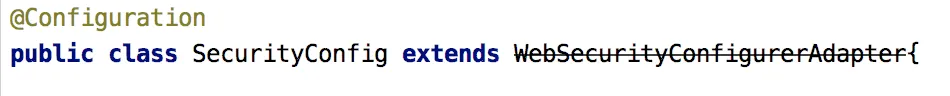
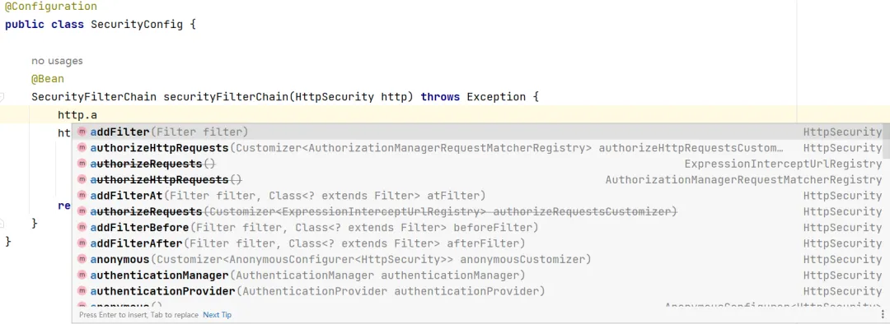
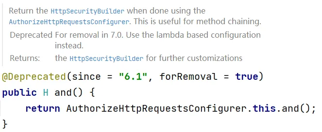

# Spring Security6 全新写法，大变样！

Original 江南一点雨 [江南一点雨](javascript:void(0);) *2023年06月14日 17:17* *广东*

**TienChin 视频杀青啦～采用 Spring Boot+Vue3 技术栈，里边会涉及到各种好玩的技术，小伙伴们来和松哥一起做一个完成率超 90% 的项目，戳戳戳这里-->TienChin 项目配套视频来啦。**

------

Spring Security 在最近几个版本中配置的写法都有一些变化，很多常见的方法都废弃了，并且将在未来的 Spring Security7 中移除，因此松哥在去年旧文的基础之上，又补充了一些新的内容，重新发一下，供各位使用 Spring Security 的小伙伴们参考。

接下来，我把从 Spring Security5.7 开始（对应 Spring Boot2.7 开始），各种已知的变化都来和小伙伴们梳理一下。

## 1. WebSecurityConfigurerAdapter



首先第一点，就是各位小伙伴最容易发现的 WebSecurityConfigurerAdapter 过期了，在目前最新的 Spring Security6.1 中，这个类已经完全被移除了，想凑合着用都不行了。

准确来说，Spring Security 是在 5.7.0-M2 这个版本中将 WebSecurityConfigurerAdapter 过期的，过期的原因是因为官方想要鼓励各位开发者使用基于组件的安全配置。

那么什么是基于组件的安全配置呢？我们来举几个例子：

以前我们配置 SecurityFilterChain 的方式是下面这样：

```
@Configuration
public class SecurityConfiguration extends WebSecurityConfigurerAdapter {

    @Override
    protected void configure(HttpSecurity http) throws Exception {
        http
            .authorizeHttpRequests((authz) -> authz
                .anyRequest().authenticated()
            )
            .httpBasic(withDefaults());
    }

}
```

那么以后就要改为下面这样了：

```
@Configuration
public class SecurityConfiguration {

    @Bean
    public SecurityFilterChain filterChain(HttpSecurity http) throws Exception {
        http
            .authorizeHttpRequests((authz) -> authz
                .anyRequest().authenticated()
            )
            .httpBasic(withDefaults());
        return http.build();
    }

}
```

如果懂之前的写法的话，下面这个代码其实是很好理解的，我就不做过多解释了，不过还不懂 Spring Security 基本用法的小伙伴，可以在公众号后台回复 ss，有松哥写的教程。

以前我们配置 WebSecurity 是这样：

```
@Configuration
public class SecurityConfiguration extends WebSecurityConfigurerAdapter {

    @Override
    public void configure(WebSecurity web) {
        web.ignoring().antMatchers("/ignore1", "/ignore2");
    }

}
```

以后就得改成下面这样了：

```
@Configuration
public class SecurityConfiguration {

    @Bean
    public WebSecurityCustomizer webSecurityCustomizer() {
        return (web) -> web.ignoring().antMatchers("/ignore1", "/ignore2");
    }

}
```

另外还有一个就是关于 AuthenticationManager  的获取，以前可以通过重写父类的方法来获取这个 Bean，类似下面这样：

```
@Configuration
public class SecurityConfig extends WebSecurityConfigurerAdapter {
    @Override
    @Bean
    public AuthenticationManager authenticationManagerBean() throws Exception {
        return super.authenticationManagerBean();
    }
}
```

以后就只能自己创建这个 Bean 了，类似下面这样：

```
@Configuration
public class SecurityConfig {

    @Autowired
    UserService userService;

    @Bean
    AuthenticationManager authenticationManager() {
        DaoAuthenticationProvider daoAuthenticationProvider = new DaoAuthenticationProvider();
        daoAuthenticationProvider.setUserDetailsService(userService);
        ProviderManager pm = new ProviderManager(daoAuthenticationProvider);
        return pm;
    }
}
```

当然，也可以从 HttpSecurity 中提取出来 AuthenticationManager，如下：

```
@Configuration
public class SpringSecurityConfiguration {

    AuthenticationManager authenticationManager;

    @Autowired
    UserDetailsService userDetailsService;

    @Bean
    public SecurityFilterChain filterChain(HttpSecurity http) throws Exception {

        AuthenticationManagerBuilder authenticationManagerBuilder = http.getSharedObject(AuthenticationManagerBuilder.class);
        authenticationManagerBuilder.userDetailsService(userDetailsService);
        authenticationManager = authenticationManagerBuilder.build();

        http.csrf().disable().cors().disable().authorizeHttpRequests().antMatchers("/api/v1/account/register", "/api/v1/account/auth").permitAll()
            .anyRequest().authenticated()
            .and()
            .authenticationManager(authenticationManager)
            .sessionManagement().sessionCreationPolicy(SessionCreationPolicy.STATELESS);
        return http.build();
    }

}
```

这也是一种办法。

我们来看一个具体的例子。

首先我们新建一个 Spring Boot 工程，引入 Web 和 Spring Security 依赖，注意 Spring Boot 选择最新版。

接下来我们提供一个简单的测试接口，如下：

```
@RestController
public class HelloController {

    @GetMapping("/hello")
    public String hello() {
        return "hello 江南一点雨!";
    }
}
```

小伙伴们知道，在 Spring Security 中，默认情况下，只要添加了依赖，我们项目的所有接口就已经被统统保护起来了，现在启动项目，访问 `/hello` 接口，就需要登录之后才可以访问，登录的用户名是 user，密码则是随机生成的，在项目的启动日志中。

现在我们的第一个需求是使用自定义的用户，而不是系统默认提供的，这个简单，我们只需要向 Spring 容器中注册一个 UserDetailsService 的实例即可，像下面这样：

```
@Configuration
public class SecurityConfig {

    @Bean
    UserDetailsService userDetailsService() {
        InMemoryUserDetailsManager users = new InMemoryUserDetailsManager();
        users.createUser(User.withUsername("javaboy").password("{noop}123").roles("admin").build());
        users.createUser(User.withUsername("江南一点雨").password("{noop}123").roles("admin").build());
        return users;
    }

}
```

这就可以了。

当然我现在的用户是存在内存中的，如果你的用户是存在数据库中，那么只需要提供 UserDetailsService 接口的实现类并注入 Spring 容器即可，这个之前在 vhr 视频中讲过多次了（公号后台回复 666 有视频介绍），这里就不再赘述了。

但是假如说我希望 `/hello` 这个接口能够匿名访问，并且我希望这个匿名访问还不经过 Spring Security 过滤器链，要是在以前，我们可以重写 `configure(WebSecurity)` 方法进行配置，但是现在，得换一种玩法：

```
@Configuration
public class SecurityConfig {

    @Bean
    UserDetailsService userDetailsService() {
        InMemoryUserDetailsManager users = new InMemoryUserDetailsManager();
        users.createUser(User.withUsername("javaboy").password("{noop}123").roles("admin").build());
        users.createUser(User.withUsername("江南一点雨").password("{noop}123").roles("admin").build());
        return users;
    }

    @Bean
    WebSecurityCustomizer webSecurityCustomizer() {
        return new WebSecurityCustomizer() {
            @Override
            public void customize(WebSecurity web) {
                web.ignoring().antMatchers("/hello");
            }
        };
    }

}
```

以前位于 `configure(WebSecurity)` 方法中的内容，现在位于 WebSecurityCustomizer Bean 中，该配置的东西写在这里就可以了。

那如果我还希望对登录页面，参数等，进行定制呢？继续往下看：

```
@Configuration
public class SecurityConfig {

    @Bean
    UserDetailsService userDetailsService() {
        InMemoryUserDetailsManager users = new InMemoryUserDetailsManager();
        users.createUser(User.withUsername("javaboy").password("{noop}123").roles("admin").build());
        users.createUser(User.withUsername("江南一点雨").password("{noop}123").roles("admin").build());
        return users;
    }

    @Bean
    SecurityFilterChain securityFilterChain() {
        List<Filter> filters = new ArrayList<>();
        return new DefaultSecurityFilterChain(new AntPathRequestMatcher("/**"), filters);
    }

}
```

Spring Security 的底层实际上就是一堆过滤器，所以我们之前在 configure(HttpSecurity) 方法中的配置，实际上就是配置过滤器链。现在过滤器链的配置，我们通过提供一个 SecurityFilterChain Bean 来配置过滤器链，SecurityFilterChain 是一个接口，这个接口只有一个实现类 DefaultSecurityFilterChain，构建 DefaultSecurityFilterChain 的第一个参数是拦截规则，也就是哪些路径需要拦截，第二个参数则是过滤器链，这里我给了一个空集合，也就是我们的 Spring Security 会拦截下所有的请求，然后在一个空集合中走一圈就结束了，相当于不拦截任何请求。

此时重启项目，你会发现 `/hello` 也是可以直接访问的，就是因为这个路径不经过任何过滤器。

其实我觉得目前这中新写法比以前老的写法更直观，更容易让大家理解到 Spring Security 底层的过滤器链工作机制。

有小伙伴会说，这写法跟我以前写的也不一样呀！这么配置，我也不知道 Spring Security 中有哪些过滤器，其实，换一个写法，我们就可以将这个配置成以前那种样子：

```
@Configuration
public class SecurityConfig {

    @Bean
    UserDetailsService userDetailsService() {
        InMemoryUserDetailsManager users = new InMemoryUserDetailsManager();
        users.createUser(User.withUsername("javaboy").password("{noop}123").roles("admin").build());
        users.createUser(User.withUsername("江南一点雨").password("{noop}123").roles("admin").build());
        return users;
    }

    @Bean
    SecurityFilterChain securityFilterChain(HttpSecurity http) throws Exception {
        http.authorizeRequests()
                .anyRequest().authenticated()
                .and()
                .formLogin()
                .permitAll()
                .and()
                .csrf().disable();
        return http.build();
    }

}
```

这么写，就跟以前的写法其实没啥大的差别了。

## 2. 使用 Lambda

在最新版中，小伙伴们发现，很多常见的方法废弃了，如下图：



包括大家熟悉的用来连接各个配置项的 and() 方法现在也废弃了，并且按照官方的说法，将在 Spring Security7 中彻底移除该方法。



也就是说，你以后见不到类似下面这样的配置了：

```
@Override
protected void configure(HttpSecurity http) throws Exception {
    InMemoryUserDetailsManager users = new InMemoryUserDetailsManager();
    users.createUser(User.withUsername("javagirl").password("{noop}123").roles("admin").build());
    http.authorizeRequests()
            .anyRequest().authenticated()
            .and()
            .formLogin()
            .and()
            .csrf().disable()
            .userDetailsService(users);
    http.addFilterAt(loginFilter(), UsernamePasswordAuthenticationFilter.class);
}
```

and() 方法将被移除！

> 其实，松哥觉得移除 and 方法是个好事，对于很多初学者来说，光是理解 and 这个方法就要好久。

从上面 and 方法的注释中小伙伴们可以看到，官方现在是在推动基于 Lambda 的配置来代替传统的链式配置，所以以后我们的写法就得改成下面这样啦：

```
@Configuration
public class SecurityConfig {

    @Bean
    SecurityFilterChain securityFilterChain(HttpSecurity http) throws Exception {
        http
                .authorizeHttpRequests(auth -> auth.requestMatchers("/hello").hasAuthority("user").anyRequest().authenticated())
                .formLogin(form -> form.loginProcessingUrl("/login").usernameParameter("name").passwordParameter("passwd"))
                .csrf(csrf -> csrf.disable())
                .sessionManagement(session -> session.maximumSessions(1).maxSessionsPreventsLogin(true));
        return http.build();
    }
}
```

其实，这里的几个方法倒不是啥新方法，只不过有的小伙伴可能之前不太习惯用上面这几个方法进行配置，习惯于链式配置。可是往后，就得慢慢习惯上面这种按照 Lambda 的方式来配置了，配置的内容倒很好理解，我觉得没啥好解释的。

## 3. 自定义 JSON 登录

自定义 JSON 登录也和之前旧版不太一样了。

### 3.1 自定义 JSON 登录

小伙伴们知道，Spring Security 中默认的登录接口数据格式是 key-value 的形式，如果我们想使用 JSON 格式来登录，那么就必须自定义过滤器或者自定义登录接口，下面松哥先来和小伙伴们展示一下这两种不同的登录形式。

#### 3.1.1 自定义登录过滤器

Spring Security 默认处理登录数据的过滤器是 UsernamePasswordAuthenticationFilter，在这个过滤器中，系统会通过 `request.getParameter(this.passwordParameter)` 的方式将用户名和密码读取出来，很明显这就要求前端传递参数的形式是 key-value。

如果想要使用 JSON 格式的参数登录，那么就需要从这个地方做文章了，我们自定义的过滤器如下：

```
public class JsonLoginFilter extends UsernamePasswordAuthenticationFilter {
    @Override
    public Authentication attemptAuthentication(HttpServletRequest request, HttpServletResponse response) throws AuthenticationException {
        //获取请求头，据此判断请求参数类型
        String contentType = request.getContentType();
        if (MediaType.APPLICATION_JSON_VALUE.equalsIgnoreCase(contentType) || MediaType.APPLICATION_JSON_UTF8_VALUE.equalsIgnoreCase(contentType)) {
            //说明请求参数是 JSON
            if (!request.getMethod().equals("POST")) {
                throw new AuthenticationServiceException("Authentication method not supported: " + request.getMethod());
            }
            String username = null;
            String password = null;
            try {
                //解析请求体中的 JSON 参数
                User user = new ObjectMapper().readValue(request.getInputStream(), User.class);
                username = user.getUsername();
                username = (username != null) ? username.trim() : "";
                password = user.getPassword();
                password = (password != null) ? password : "";
            } catch (IOException e) {
                throw new RuntimeException(e);
            }
            //构建登录令牌
            UsernamePasswordAuthenticationToken authRequest = UsernamePasswordAuthenticationToken.unauthenticated(username,
                    password);
            // Allow subclasses to set the "details" property
            setDetails(request, authRequest);
            //执行真正的登录操作
            Authentication auth = this.getAuthenticationManager().authenticate(authRequest);
            return auth;
        } else {
            return super.attemptAuthentication(request, response);
        }
    }
}
```

看过松哥之前的 Spring Security 系列文章的小伙伴，这段代码应该都是非常熟悉了。

1. 首先我们获取请求头，根据请求头的类型来判断请求参数的格式。
2. 如果是 JSON 格式的参数，就在 if 中进行处理，否则说明是 key-value 形式的参数，那么我们就调用父类的方法进行处理即可。
3. JSON 格式的参数的处理逻辑和 key-value 的处理逻辑是一致的，唯一不同的是参数的提取方式不同而已。

最后，我们还需要对这个过滤器进行配置：

```
@Configuration
public class SecurityConfig {

    @Autowired
    UserService userService;

    @Bean
    JsonLoginFilter jsonLoginFilter() {
        JsonLoginFilter filter = new JsonLoginFilter();
        filter.setAuthenticationSuccessHandler((req,resp,auth)->{
            resp.setContentType("application/json;charset=utf-8");
            PrintWriter out = resp.getWriter();
            //获取当前登录成功的用户对象
            User user = (User) auth.getPrincipal();
            user.setPassword(null);
            RespBean respBean = RespBean.ok("登录成功", user);
            out.write(new ObjectMapper().writeValueAsString(respBean));
        });
        filter.setAuthenticationFailureHandler((req,resp,e)->{
            resp.setContentType("application/json;charset=utf-8");
            PrintWriter out = resp.getWriter();
            RespBean respBean = RespBean.error("登录失败");
            if (e instanceof BadCredentialsException) {
                respBean.setMessage("用户名或者密码输入错误，登录失败");
            } else if (e instanceof DisabledException) {
                respBean.setMessage("账户被禁用，登录失败");
            } else if (e instanceof CredentialsExpiredException) {
                respBean.setMessage("密码过期，登录失败");
            } else if (e instanceof AccountExpiredException) {
                respBean.setMessage("账户过期，登录失败");
            } else if (e instanceof LockedException) {
                respBean.setMessage("账户被锁定，登录失败");
            }
            out.write(new ObjectMapper().writeValueAsString(respBean));
        });
        filter.setAuthenticationManager(authenticationManager());
        filter.setFilterProcessesUrl("/login");
        return filter;
    }

    @Bean
    AuthenticationManager authenticationManager() {
        DaoAuthenticationProvider daoAuthenticationProvider = new DaoAuthenticationProvider();
        daoAuthenticationProvider.setUserDetailsService(userService);
        ProviderManager pm = new ProviderManager(daoAuthenticationProvider);
        return pm;
    }

    @Bean
    SecurityFilterChain securityFilterChain(HttpSecurity http) throws Exception {
        //开启过滤器的配置
        http.authorizeHttpRequests()
                //任意请求，都要认证之后才能访问
                .anyRequest().authenticated()
                .and()
                //开启表单登录，开启之后，就会自动配置登录页面、登录接口等信息
                .formLogin()
                //和登录相关的 URL 地址都放行
                .permitAll()
                .and()
                //关闭 csrf 保护机制，本质上就是从 Spring Security 过滤器链中移除了 CsrfFilter
                .csrf().disable();
        http.addFilterBefore(jsonLoginFilter(), UsernamePasswordAuthenticationFilter.class);
        return http.build();
    }

}
```

这里就是配置一个 JsonLoginFilter 的 Bean，并将之添加到 Spring Security 过滤器链中即可。

在 Spring Boot3 之前（Spring Security6 之前），上面这段代码就可以实现 JSON 登录了。

但是从 Spring Boot3 开始，这段代码有点瑕疵了，直接用已经无法实现 JSON 登录了，具体原因松哥下文分析。

#### 3.1.2 自定义登录接口

另外一种自定义 JSON 登录的方式是直接自定义登录接口，如下：

```
@RestController
public class LoginController {

    @Autowired
    AuthenticationManager authenticationManager;

    @PostMapping("/doLogin")
    public String doLogin(@RequestBody User user) {
        UsernamePasswordAuthenticationToken unauthenticated = UsernamePasswordAuthenticationToken.unauthenticated(user.getUsername(), user.getPassword());
        try {
            Authentication authenticate = authenticationManager.authenticate(unauthenticated);
            SecurityContextHolder.getContext().setAuthentication(authenticate);
            return "success";
        } catch (AuthenticationException e) {
            return "error:" + e.getMessage();
        }
    }
}
```

这里直接自定义登录接口，请求参数通过 JSON 的形式来传递。拿到用户名密码之后，调用 AuthenticationManager#authenticate 方法进行认证即可。认证成功之后，将认证后的用户信息存入到 SecurityContextHolder 中。

最后再配一下登录接口就行了：

```
@Configuration
public class SecurityConfig {

    @Autowired
    UserService userService;

    @Bean
    AuthenticationManager authenticationManager() {
        DaoAuthenticationProvider provider = new DaoAuthenticationProvider();
        provider.setUserDetailsService(userService);
        ProviderManager pm = new ProviderManager(provider);
        return pm;
    }

    @Bean
    SecurityFilterChain securityFilterChain(HttpSecurity http) throws Exception {
        http.authorizeHttpRequests()
                //表示 /doLogin 这个地址可以不用登录直接访问
                .requestMatchers("/doLogin").permitAll()
                .anyRequest().authenticated().and()
                .formLogin()
                .permitAll()
                .and()
                .csrf().disable();
        return http.build();
    }
}
```

这也算是一种使用 JSON 格式参数的方案。在 Spring Boot3 之前（Spring Security6 之前），上面这个方案也是没有任何问题的。

从 Spring Boot3（Spring Security6） 开始，上面这两种方案都出现了一些瑕疵。

具体表现就是：**当你调用登录接口登录成功之后，再去访问系统中的其他页面，又会跳转回登录页面，说明访问登录之外的其他接口时，系统不知道你已经登录过了。**

### 3.2 原因分析

产生上面问题的原因，主要在于 Spring Security 过滤器链中有一个过滤器发生变化了：

在 Spring Boot3 之前，Spring Security 过滤器链中有一个名为 SecurityContextPersistenceFilter 的过滤器，这个过滤器在 Spring Boot2.7.x 中废弃了，但是还在使用，在 Spring Boot3 中则被从 Spring Security 过滤器链中移除了，取而代之的是一个名为 SecurityContextHolderFilter 的过滤器。

在第一小节和小伙伴们介绍的两种 JSON 登录方案在 Spring Boot2.x 中可以运行在 Spring Boot3.x 中无法运行，就是因为这个过滤器的变化导致的。

所以接下来我们就来分析一下这两个过滤器到底有哪些区别。

先来看 SecurityContextPersistenceFilter 的核心逻辑：

```
private void doFilter(HttpServletRequest request, HttpServletResponse response, FilterChain chain)
  throws IOException, ServletException {
 HttpRequestResponseHolder holder = new HttpRequestResponseHolder(request, response);
 SecurityContext contextBeforeChainExecution = this.repo.loadContext(holder);
 try {
  SecurityContextHolder.setContext(contextBeforeChainExecution);
  chain.doFilter(holder.getRequest(), holder.getResponse());
 }
 finally {
  SecurityContext contextAfterChainExecution = SecurityContextHolder.getContext();
  SecurityContextHolder.clearContext();
  this.repo.saveContext(contextAfterChainExecution, holder.getRequest(), holder.getResponse());
 }
}
```

我这里只贴出来了一些关键的核心代码：

1. 首先，这个过滤器位于整个 Spring Security 过滤器链的第三个，是非常靠前的。
2. 当登录请求经过这个过滤器的时候，首先会尝试从 SecurityContextRepository（上文中的 this.repo）中读取到 SecurityContext 对象，这个对象中保存了当前用户的信息，第一次登录的时候，这里实际上读取不到任何用户信息。
3. 将读取到的 SecurityContext 存入到 SecurityContextHolder 中，默认情况下，SecurityContextHolder 中通过 ThreadLocal 来保存 SecurityContext 对象，也就是当前请求在后续的处理流程中，只要在同一个线程里，都可以直接从 SecurityContextHolder 中提取到当前登录用户信息。
4. 请求继续向后执行。
5. 在 finally 代码块中，当前请求已经结束了，此时再次获取到 SecurityContext，并清空 SecurityContextHolder 防止内存泄漏，然后调用 `this.repo.saveContext` 方法保存当前登录用户对象（实际上是保存到 HttpSession 中）。
6. 以后其他请求到达的时候，执行前面第 2 步的时候，就读取到当前用户的信息了，在请求后续的处理过程中，Spring Security 需要知道当前用户的时候，会自动去 SecurityContextHolder 中读取当前用户信息。

这就是 Spring Security 认证的一个大致流程。

然而，到了 Spring Boot3 之后，这个过滤器被 SecurityContextHolderFilter 取代了，我们来看下 SecurityContextHolderFilter 过滤器的一个关键逻辑：

```
private void doFilter(HttpServletRequest request, HttpServletResponse response, FilterChain chain)
  throws ServletException, IOException {
 Supplier<SecurityContext> deferredContext = this.securityContextRepository.loadDeferredContext(request);
 try {
  this.securityContextHolderStrategy.setDeferredContext(deferredContext);
  chain.doFilter(request, response);
 }
 finally {
  this.securityContextHolderStrategy.clearContext();
  request.removeAttribute(FILTER_APPLIED);
 }
}
```

小伙伴们看到，前面的逻辑基本上还是一样的，不一样的是 finally 中的代码，finally 中少了一步向 HttpSession 保存 SecurityContext 的操作。

这下就明白了，用户登录成功之后，用户信息没有保存到 HttpSession，导致下一次请求到达的时候，无法从 HttpSession 中读取到 SecurityContext 存到 SecurityContextHolder 中，在后续的执行过程中，Spring Security 就会认为当前用户没有登录。

这就是问题的原因！

找到原因，那么问题就好解决了。

### 3.3 问题解决

首先问题出在了过滤器上，直接改过滤器倒也不是不可以，但是，既然 Spring Security 在升级的过程中抛弃了之前旧的方案，我们又费劲的把之前旧的方案写回来，好像也不合理。

其实，Spring Security 提供了另外一个修改的入口，在 org.springframework.security.web.authentication.AbstractAuthenticationProcessingFilter#successfulAuthentication 方法中，源码如下：

```
protected void successfulAuthentication(HttpServletRequest request, HttpServletResponse response, FilterChain chain,
  Authentication authResult) throws IOException, ServletException {
 SecurityContext context = this.securityContextHolderStrategy.createEmptyContext();
 context.setAuthentication(authResult);
 this.securityContextHolderStrategy.setContext(context);
 this.securityContextRepository.saveContext(context, request, response);
 this.rememberMeServices.loginSuccess(request, response, authResult);
 if (this.eventPublisher != null) {
  this.eventPublisher.publishEvent(new InteractiveAuthenticationSuccessEvent(authResult, this.getClass()));
 }
 this.successHandler.onAuthenticationSuccess(request, response, authResult);
}
```

这个方法是当前用户登录成功之后的回调方法，小伙伴们看到，在这个回调方法中，有一句 `this.securityContextRepository.saveContext(context, request, response);`，这就表示将当前登录成功的用户信息存入到 HttpSession 中。

在当前过滤器中，securityContextRepository 的类型是 RequestAttributeSecurityContextRepository，这个表示将 SecurityContext 存入到当前请求的属性中，那很明显，在当前请求结束之后，这个数据就没了。在 Spring Security 的自动化配置类中，将 securityContextRepository 属性指向了 DelegatingSecurityContextRepository，这是一个代理的存储器，代理的对象是 RequestAttributeSecurityContextRepository 和 HttpSessionSecurityContextRepository，所以在默认的情况下，用户登录成功之后，在这里就把登录用户数据存入到 HttpSessionSecurityContextRepository 中了。

当我们自定义了登录过滤器之后，就破坏了自动化配置里的方案了，这里使用的 securityContextRepository 对象就真的是 RequestAttributeSecurityContextRepository 了，所以就导致用户后续访问时系统以为用户未登录。

那么解决方案很简单，我们只需要为自定义的过滤器指定 securityContextRepository 属性的值就可以了，如下：

```
@Bean
JsonLoginFilter jsonLoginFilter() {
    JsonLoginFilter filter = new JsonLoginFilter();
    filter.setAuthenticationSuccessHandler((req,resp,auth)->{
        resp.setContentType("application/json;charset=utf-8");
        PrintWriter out = resp.getWriter();
        //获取当前登录成功的用户对象
        User user = (User) auth.getPrincipal();
          user.setPassword(null);
        RespBean respBean = RespBean.ok("登录成功", user);
        out.write(new ObjectMapper().writeValueAsString(respBean));
    });
    filter.setAuthenticationFailureHandler((req,resp,e)->{
        resp.setContentType("application/json;charset=utf-8");
        PrintWriter out = resp.getWriter();
        RespBean respBean = RespBean.error("登录失败");
        if (e instanceof BadCredentialsException) {
            respBean.setMessage("用户名或者密码输入错误，登录失败");
        } else if (e instanceof DisabledException) {
            respBean.setMessage("账户被禁用，登录失败");
        } else if (e instanceof CredentialsExpiredException) {
            respBean.setMessage("密码过期，登录失败");
        } else if (e instanceof AccountExpiredException) {
            respBean.setMessage("账户过期，登录失败");
        } else if (e instanceof LockedException) {
            respBean.setMessage("账户被锁定，登录失败");
        }
        out.write(new ObjectMapper().writeValueAsString(respBean));
    });
    filter.setAuthenticationManager(authenticationManager());
    filter.setFilterProcessesUrl("/login");
    filter.setSecurityContextRepository(new HttpSessionSecurityContextRepository());
    return filter;
}
```

小伙伴们看到，最后调用 setSecurityContextRepository 方法设置一下就行。

> Spring Boot3.x 之前之所以不用设置这个属性，是因为这里虽然没保存最后还是在 SecurityContextPersistenceFilter 过滤器中保存了。

那么对于自定义登录接口的问题，解决思路也是类似的：

```
@RestController
public class LoginController {

    @Autowired
    AuthenticationManager authenticationManager;

    @PostMapping("/doLogin")
    public String doLogin(@RequestBody User user, HttpSession session) {
        UsernamePasswordAuthenticationToken unauthenticated = UsernamePasswordAuthenticationToken.unauthenticated(user.getUsername(), user.getPassword());
        try {
            Authentication authenticate = authenticationManager.authenticate(unauthenticated);
            SecurityContextHolder.getContext().setAuthentication(authenticate);
            session.setAttribute(HttpSessionSecurityContextRepository.SPRING_SECURITY_CONTEXT_KEY, SecurityContextHolder.getContext());
            return "success";
        } catch (AuthenticationException e) {
            return "error:" + e.getMessage();
        }
    }
}
```

小伙伴们看到，在登录成功之后，开发者自己手动将数据存入到 HttpSession 中，这样就能确保下个请求到达的时候，能够从 HttpSession 中读取到有效的数据存入到 SecurityContextHolder 中了。

好啦，Spring Boot 新旧版本交替中，一个小小的问题，希望小伙伴们能够有所收获。

------

**TienChin 视频杀青啦～采用 Spring Boot+Vue3 技术栈，里边会涉及到各种好玩的技术，小伙伴们来和松哥一起做一个完成率超 90% 的项目，戳戳戳这里-->TienChin 项目配套视频来啦。**

tienchin241

SpringSecurity38

SpringSecurity · 目录


上一篇新版SpringSecurity如何自定义JSON登录下一篇新版Spring Security 中的路径匹配方案！

修改于2023年06月14日


# 


Scan to Follow