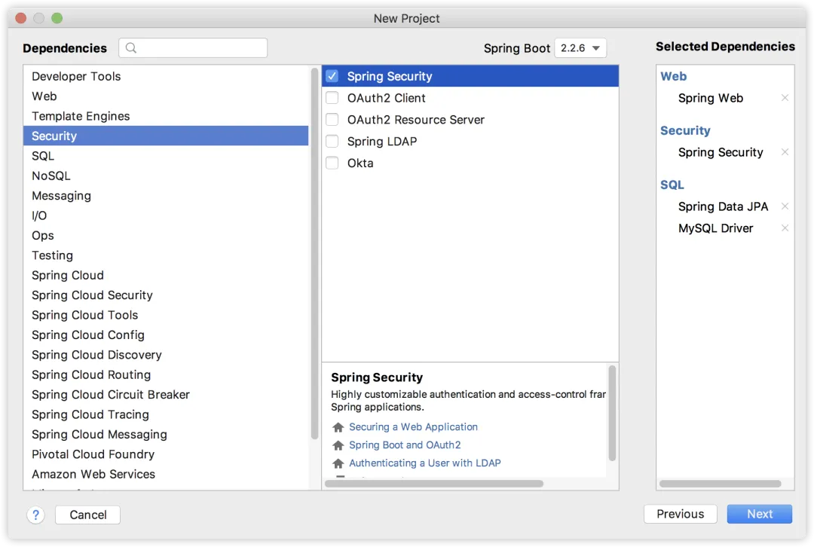
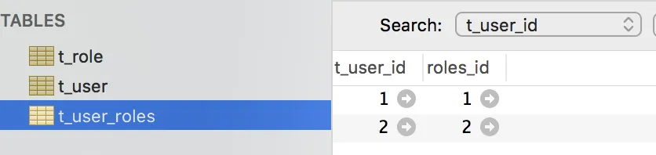
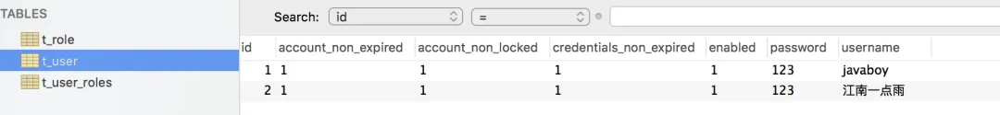
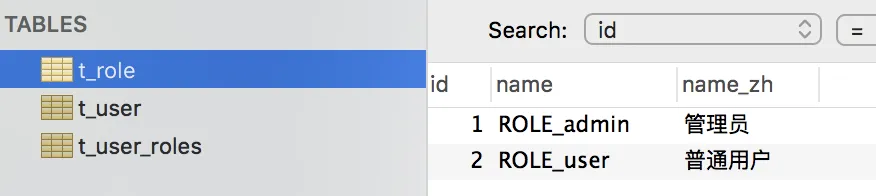
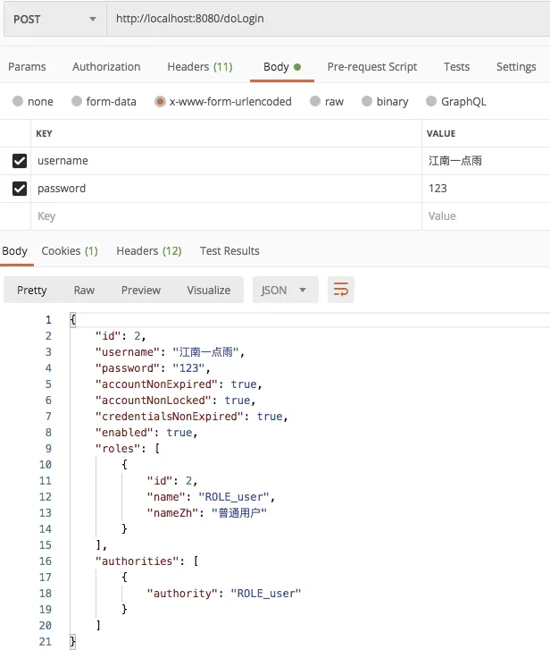

# 【SpringSecurity系列（七）】通过 Spring Data Jpa 持久化用户数据

Original 江南一点雨 [江南一点雨](javascript:void(0);) *2021年04月19日 16:13*

《深入浅出Spring Security》一书已由清华大学出版社正式出版发行，感兴趣的小伙伴戳这里[->->>深入浅出Spring Security](https://mp.weixin.qq.com/s?__biz=MzI1NDY0MTkzNQ==&mid=2247492459&idx=1&sn=a3ffb25873c0905b8862fcb8334a68e7&scene=21#wechat_redirect)，一本书学会 Spring Security。

<iframe src="https://file.daihuo.qq.com/mp_cps_goods_card/v112/index.html" frameborder="0" scrolling="no" class="iframe_ad_container" style="width: 656.989px; height: 0px; border: none; box-sizing: border-box; display: block;"></iframe>


<svg data-v-8b461723="" xmlns="http://www.w3.org/2000/svg" viewBox="0 0 2 2" width="4px" height="4px" class="border_filler border_filler_lefttop"><path data-v-8b461723="" d="M1.85.005A2 2 0 000 2V0h2z" fill="#ffffff" fill-rule="evenodd"></path></svg>

<svg data-v-8b461723="" xmlns="http://www.w3.org/2000/svg" viewBox="0 0 2 2" width="4px" height="4px" class="border_filler border_filler_righttop"><path data-v-8b461723="" d="M1.85.005A2 2 0 000 2V0h2z" fill="#ffffff" fill-rule="evenodd"></path></svg>

<svg data-v-8b461723="" xmlns="http://www.w3.org/2000/svg" viewBox="0 0 2 2" width="4px" height="4px" class="border_filler border_filler_rightbot"><path data-v-8b461723="" d="M1.85.005A2 2 0 000 2V0h2z" fill="#ffffff" fill-rule="evenodd"></path></svg>

<svg data-v-8b461723="" xmlns="http://www.w3.org/2000/svg" viewBox="0 0 2 2" width="4px" height="4px" class="border_filler border_filler_leftbot"><path data-v-8b461723="" d="M1.85.005A2 2 0 000 2V0h2z" fill="#ffffff" fill-rule="evenodd"></path></svg>


，时长19:44


视频看完了，如果小伙伴们觉得松哥的视频风格还能接受，也可以看看松哥自制的 [Spring Boot + Vue 系列视频教程](https://mp.weixin.qq.com/s?__biz=MzI1NDY0MTkzNQ==&mid=2247488059&idx=1&sn=2ef3e7f14d262130ecab94a0b17de0ca&scene=21#wechat_redirect)

Spring Security 系列我们前面已经更新了 6 篇了，本文是第 7 篇，建议先看本系列前面的文章，有助于更好的理解本文：

1. [【SpringSecurity系列（一）】初识 Spring Security](https://mp.weixin.qq.com/s?__biz=MzI1NDY0MTkzNQ==&mid=2247492925&idx=2&sn=b3b8943bce05e97d4f84d92002dd6571&scene=21#wechat_redirect)
2. [【SpringSecurity系列（二）】Spring Security入门](https://mp.weixin.qq.com/s?__biz=MzI1NDY0MTkzNQ==&mid=2247493000&idx=2&sn=3d2862565e0f22968f1685199c6bdb87&scene=21#wechat_redirect)
3. [【SpringSecurity系列（三）】定制表单登录](https://mp.weixin.qq.com/s?__biz=MzI1NDY0MTkzNQ==&mid=2247493036&idx=2&sn=0a0356f4724830eb136d673c289437b6&scene=21#wechat_redirect)
4. [【SpringSecurity系列（四）】登录成功返回JSON数据](https://mp.weixin.qq.com/s?__biz=MzI1NDY0MTkzNQ==&mid=2247493044&idx=2&sn=e7a4f0fd826eeffffdb503cc2316bc50&scene=21#wechat_redirect)
5. [【SpringSecurity系列（五）】授权入门](https://mp.weixin.qq.com/s?__biz=MzI1NDY0MTkzNQ==&mid=2247493062&idx=2&sn=1480de83f67c3049e7efcc1cce21a918&scene=21#wechat_redirect)
6. [【SpringSecurity系列（六）】自定义登录用户](https://mp.weixin.qq.com/s?__biz=MzI1NDY0MTkzNQ==&mid=2247493130&idx=2&sn=7dff1f444fc652c23267a1ba89ea11d2&scene=21#wechat_redirect)

前面虽然讲了 6 篇，但是我们的用户数据都保存在内存中，在第 6 篇文章中，虽然介绍了 JdbcUserDetailsManager，但是使用起来依然不便，所以今天我要采用一个更加灵活的定义方式。

那就是我们自己来定义授权数据库的模型。

为了操作简单，我这里引入 Spring Data Jpa 来帮助我们完成数据库操作。但是本文我不会去重点介绍 Spring Data Jpa 的用法，如果小伙伴们不熟悉 Spring Data Jpa 的操作，可以在公众号后台回复 springboot 获取松哥手敲的 Spring Boot 教程，里边有 jpa 相关操作，也可以看看松哥录制的视频教程：[Spring Boot + Vue 系列视频教程](https://mp.weixin.qq.com/s?__biz=MzI1NDY0MTkzNQ==&mid=2247488059&idx=1&sn=2ef3e7f14d262130ecab94a0b17de0ca&scene=21#wechat_redirect)

## 1.创建工程

首先我们创建一个新的 Spring Boot 工程，添加如下依赖：



注意，除了 Spring Security 依赖之外，我们还需要数据依赖和 Spring Data Jpa 依赖。

工程创建完成后，我们再在数据库中创建一个空的库，就叫做 withjpa，里边什么都不用做，这样我们的准备工作就算完成了。

## 2.准备模型

接下来我们创建两个实体类，分别表示用户角色了用户类：

用户角色：

```
@Entity(name = "t_role")
public class Role {
    @Id
    @GeneratedValue(strategy = GenerationType.IDENTITY)
    private Long id;
    private String name;
    private String nameZh;
    //省略 getter/setter
}
```

这个实体类用来描述用户角色信息，有角色 id、角色名称（英文、中文），@Entity 表示这是一个实体类，项目启动后，将会根据实体类的属性在数据库中自动创建一个角色表。

用户实体类：

```
@Entity(name = "t_user")
public class User implements UserDetails {
    @Id
    @GeneratedValue(strategy = GenerationType.IDENTITY)
    private Long id;
    private String username;
    private String password;
    private boolean accountNonExpired;
    private boolean accountNonLocked;
    private boolean credentialsNonExpired;
    private boolean enabled;
    @ManyToMany(fetch = FetchType.EAGER,cascade = CascadeType.PERSIST)
    private List<Role> roles;
    @Override
    public Collection<? extends GrantedAuthority> getAuthorities() {
        List<SimpleGrantedAuthority> authorities = new ArrayList<>();
        for (Role role : getRoles()) {
            authorities.add(new SimpleGrantedAuthority(role.getName()));
        }
        return authorities;
    }
    @Override
    public String getPassword() {
        return password;
    }

    @Override
    public String getUsername() {
        return username;
    }

    @Override
    public boolean isAccountNonExpired() {
        return accountNonExpired;
    }

    @Override
    public boolean isAccountNonLocked() {
        return accountNonLocked;
    }

    @Override
    public boolean isCredentialsNonExpired() {
        return credentialsNonExpired;
    }

    @Override
    public boolean isEnabled() {
        return enabled;
    }
    //省略其他 get/set 方法
}
```

用户实体类主要需要实现  UserDetails 接口，并实现接口中的方法。

这里的字段基本都好理解，几个特殊的我来稍微说一下：

1. accountNonExpired、accountNonLocked、credentialsNonExpired、enabled 这四个属性分别用来描述用户的状态，表示账户是否没有过期、账户是否没有被锁定、密码是否没有过期、以及账户是否可用。
2. roles 属性表示用户的角色，User 和 Role 是多对多关系，用一个 @ManyToMany 注解来描述。
3. getAuthorities 方法返回用户的角色信息，我们在这个方法中把自己的 Role 稍微转化一下即可。

## 3.配置

数据模型准备好之后，我们再来定义一个 UserDao：

```
public interface UserDao extends JpaRepository<User,Long> {
    User findUserByUsername(String username);
}
```

这里的东西很简单，我们只需要继承 JpaRepository 然后提供一个根据 username 查询 user 的方法即可。如果小伙伴们不熟悉 Spring Data Jpa 的操作，可以在公众号后台回复 springboot 获取松哥手敲的 Spring Boot 教程，里边有 jpa 相关操作，也可以看看松哥录制的视频教程：[Spring Boot + Vue 系列视频教程](https://mp.weixin.qq.com/s?__biz=MzI1NDY0MTkzNQ==&mid=2247488059&idx=1&sn=2ef3e7f14d262130ecab94a0b17de0ca&scene=21#wechat_redirect)。

在接下来定义 UserService ，如下：

```
@Service
public class UserService implements UserDetailsService {
    @Autowired
    UserDao userDao;
    @Override
    public UserDetails loadUserByUsername(String username) throws UsernameNotFoundException {
        User user = userDao.findUserByUsername(username);
        if (user == null) {
            throw new UsernameNotFoundException("用户不存在");
        }
        return user;
    }
}
```

我们自己定义的 UserService 需要实现 UserDetailsService 接口，实现该接口，就要实现接口中的方法，也就是 loadUserByUsername ，这个方法的参数就是用户在登录的时候传入的用户名，根据用户名去查询用户信息（查出来之后，系统会自动进行密码比对）。

配置完成后，接下来我们在 Spring Security 中稍作配置，Spring Security 和测试用的 HelloController 我还是沿用之前文章中的（[Spring Security 如何将用户数据存入数据库？](https://mp.weixin.qq.com/s?__biz=MzI1NDY0MTkzNQ==&mid=2247488194&idx=1&sn=7103031896ba8b9d34095524b292265e&scene=21#wechat_redirect)），主要列出来需要修改的地方。

在 SecurityConfig 中，我们通过如下方式来配置用户：

```
@Autowired
UserService userService;
@Override
protected void configure(AuthenticationManagerBuilder auth) throws Exception {
    auth.userDetailsService(userService);
}
```

大家注意，还是重写 configure 方法，只不过这次我们不是基于内存，也不是基于 JdbcUserDetailsManager，而是使用自定义的 UserService，就这样配置就 OK 了。

最后，我们再在 application.properties 中配置一下数据库和 JPA 的基本信息，如下：

```
spring.datasource.username=root
spring.datasource.password=123
spring.datasource.url=jdbc:mysql:///withjpa?useUnicode=true&characterEncoding=UTF-8&serverTimezone=Asia/Shanghai

spring.jpa.database=mysql
spring.jpa.database-platform=mysql
spring.jpa.hibernate.ddl-auto=update
spring.jpa.show-sql=true
spring.jpa.properties.hibernate.dialect=org.hibernate.dialect.MySQL8Dialect
```

都是常规配置，我们就不再重复解释了。

这一套组合拳下来，我们的 Spring Security 就算是接入数据库了，接下来我们来进行测试，测试的 HelloController 参考[上篇文章](https://mp.weixin.qq.com/s?__biz=MzI1NDY0MTkzNQ==&mid=2247488194&idx=1&sn=7103031896ba8b9d34095524b292265e&scene=21#wechat_redirect)，我就不重复写了。

## 4.测试

首先我们来添加两条测试数据，在单元测试中添加如下方法：

```
@Autowired
UserDao userDao;
@Test
void contextLoads() {
    User u1 = new User();
    u1.setUsername("javaboy");
    u1.setPassword("123");
    u1.setAccountNonExpired(true);
    u1.setAccountNonLocked(true);
    u1.setCredentialsNonExpired(true);
    u1.setEnabled(true);
    List<Role> rs1 = new ArrayList<>();
    Role r1 = new Role();
    r1.setName("ROLE_admin");
    r1.setNameZh("管理员");
    rs1.add(r1);
    u1.setRoles(rs1);
    userDao.save(u1);
    User u2 = new User();
    u2.setUsername("江南一点雨");
    u2.setPassword("123");
    u2.setAccountNonExpired(true);
    u2.setAccountNonLocked(true);
    u2.setCredentialsNonExpired(true);
    u2.setEnabled(true);
    List<Role> rs2 = new ArrayList<>();
    Role r2 = new Role();
    r2.setName("ROLE_user");
    r2.setNameZh("普通用户");
    rs2.add(r2);
    u2.setRoles(rs2);
    userDao.save(u2);
}
```

运行该方法后，我们会发现数据库中多了三张表：



这就是根据我们的实体类自动创建出来的。

我们来查看一下表中的数据。

用户表：



角色表：



用户和角色关联表：


有了数据，接下来启动项目，我们来进行测试。

我们首先以 江南一点雨的身份进行登录：



登录成功后，分别访问 `/hello`，`/admin/hello` 以及 `/user/hello` 三个接口，其中：

1. `/hello` 因为登录后就可以访问，这个接口访问成功。
2. `/admin/hello` 需要 admin 身份，所以访问失败。
3. `/user/hello` 需要 user 身份，所以访问成功。

具体测试效果小伙伴们可以参考松哥的视频，我就不截图了。

在测试的过程中，如果在数据库中将用户的 enabled 属性设置为 false，表示禁用该账户，此时再使用该账户登录就会登录失败。

按照相同的方式，大家也可以测试 javaboy 用户。

好了，今天就和小伙伴们说这么多.


加微信进群


一起切磋Web安全

（已添加松哥微信的小伙伴请勿重复添加）


感谢小伙伴们的阅读，如果觉得有用，毫不犹豫的点个在看鼓励下松哥，我会以风驰电掣般的速度快速更完这个系列～


SpringSecurity38

SpringSecurity · 目录


上一篇【SpringSecurity系列（六）】自定义登录用户下一篇【SpringSecurity系列（八）】用户还能自动登录？


# 