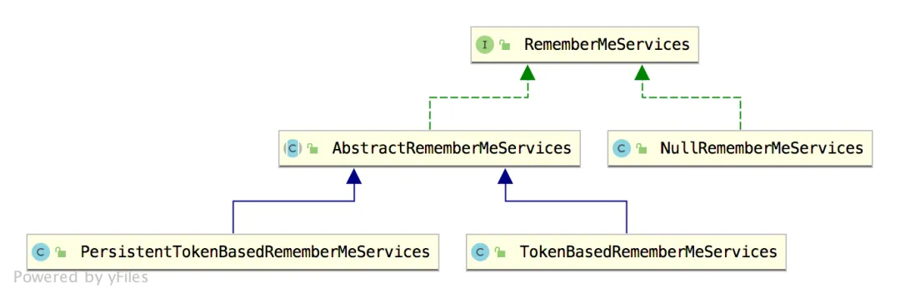
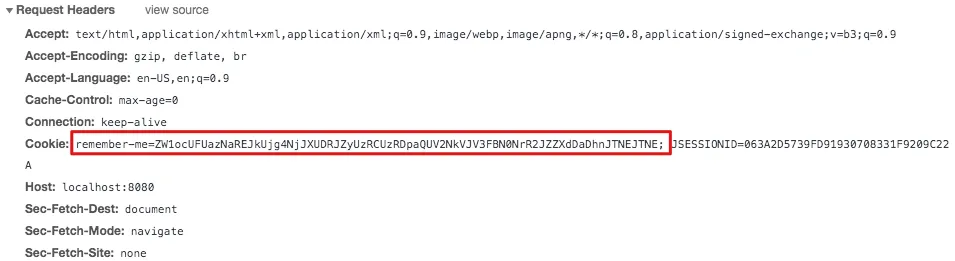
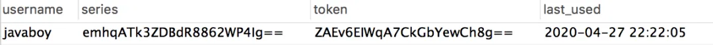

# 【SpringSecurity系列（九）】降低 RememberMe 的安全风险

Original 江南一点雨 [江南一点雨](javascript:void(0);) *2021年04月21日 10:36*

《深入浅出Spring Security》一书已由清华大学出版社正式出版发行，感兴趣的小伙伴戳这里[->->>深入浅出Spring Security](https://mp.weixin.qq.com/s?__biz=MzI1NDY0MTkzNQ==&mid=2247492459&idx=1&sn=a3ffb25873c0905b8862fcb8334a68e7&scene=21#wechat_redirect)，一本书学会 Spring Security。

<iframe src="https://file.daihuo.qq.com/mp_cps_goods_card/v112/index.html" frameborder="0" scrolling="no" class="iframe_ad_container" style="width: 656.989px; height: 0px; border: none; box-sizing: border-box; display: block;"></iframe>


------

在[上篇文章](https://mp.weixin.qq.com/s?__biz=MzI1NDY0MTkzNQ==&mid=2247488300&idx=1&sn=5f08f7d5c9e98a0eb89eeb999b83c66b&scene=21#wechat_redirect)中，我们提到了 Spring Boot 自动登录存在的一些安全风险，在实际应用中，我们肯定要把这些安全风险降到最低，今天就来和大家聊一聊如何降低安全风险的问题。

降低安全风险，我主要从两个方面来给大家介绍：

1. 持久化令牌方案
2. 二次校验

当然，还是老规矩，阅读本文一定先阅读本系列前面的文章，这有助于更好的理解本文：

1. [【SpringSecurity系列（一）】初识 Spring Security](https://mp.weixin.qq.com/s?__biz=MzI1NDY0MTkzNQ==&mid=2247492925&idx=2&sn=b3b8943bce05e97d4f84d92002dd6571&scene=21#wechat_redirect)
2. [【SpringSecurity系列（二）】Spring Security入门](https://mp.weixin.qq.com/s?__biz=MzI1NDY0MTkzNQ==&mid=2247493000&idx=2&sn=3d2862565e0f22968f1685199c6bdb87&scene=21#wechat_redirect)
3. [【SpringSecurity系列（三）】定制表单登录](https://mp.weixin.qq.com/s?__biz=MzI1NDY0MTkzNQ==&mid=2247493036&idx=2&sn=0a0356f4724830eb136d673c289437b6&scene=21#wechat_redirect)
4. [【SpringSecurity系列（四）】登录成功返回JSON数据](https://mp.weixin.qq.com/s?__biz=MzI1NDY0MTkzNQ==&mid=2247493044&idx=2&sn=e7a4f0fd826eeffffdb503cc2316bc50&scene=21#wechat_redirect)
5. [【SpringSecurity系列（五）】授权入门](https://mp.weixin.qq.com/s?__biz=MzI1NDY0MTkzNQ==&mid=2247493062&idx=2&sn=1480de83f67c3049e7efcc1cce21a918&scene=21#wechat_redirect)
6. [【SpringSecurity系列（六）】自定义登录用户](https://mp.weixin.qq.com/s?__biz=MzI1NDY0MTkzNQ==&mid=2247493130&idx=2&sn=7dff1f444fc652c23267a1ba89ea11d2&scene=21#wechat_redirect)
7. [【SpringSecurity系列（七）】通过 Spring Data Jpa 持久化用户数据](https://mp.weixin.qq.com/s?__biz=MzI1NDY0MTkzNQ==&mid=2247493175&idx=2&sn=55ab518981e7952137c0c247205eb6a3&scene=21#wechat_redirect)
8. [【SpringSecurity系列（八）】用户还能自动登录？](https://mp.weixin.qq.com/s?__biz=MzI1NDY0MTkzNQ==&mid=2247493198&idx=2&sn=a6362d7264bd50a35b5cc46ddbd334b0&scene=21#wechat_redirect)

好了，我们就不废话了，来看今天的文章。

## 1.持久化令牌

### 1.1 原理

要理解持久化令牌，一定要先搞明白自动登录的基本玩法，参考（[Spring Boot + Spring Security 实现自动登录功能](https://mp.weixin.qq.com/s?__biz=MzI1NDY0MTkzNQ==&mid=2247493198&idx=2&sn=a6362d7264bd50a35b5cc46ddbd334b0&scene=21#wechat_redirect)）。

持久化令牌就是在基本的自动登录功能基础上，又增加了新的校验参数，来提高系统的安全性，这一些都是由开发者在后台完成的，对于用户来说，登录体验和普通的自动登录体验是一样的。

在持久化令牌中，新增了两个经过 MD5 散列函数计算的校验参数，一个是 series，另一个是 token。其中，series 只有当用户在使用用户名/密码登录时，才会生成或者更新，而 token 只要有新的会话，就会重新生成，这样就可以避免一个用户同时在多端登录，就像手机 QQ ，一个手机上登录了，就会踢掉另外一个手机的登录，这样用户就会很容易发现账户是否泄漏（之前看到松哥交流群里有小伙伴在讨论如何禁止多端登录，其实就可以借鉴这里的思路）。

持久化令牌的具体处理类在 PersistentTokenBasedRememberMeServices 中，[上篇文章](https://mp.weixin.qq.com/s?__biz=MzI1NDY0MTkzNQ==&mid=2247493198&idx=2&sn=a6362d7264bd50a35b5cc46ddbd334b0&scene=21#wechat_redirect)我们讲到的自动化登录具体的处理类是在 TokenBasedRememberMeServices 中，它们有一个共同的父类：



而用来保存令牌的处理类则是 PersistentRememberMeToken，该类的定义也很简洁命令：

```
public class PersistentRememberMeToken {
 private final String username;
 private final String series;
 private final String tokenValue;
 private final Date date;
    //省略 getter
}
```

这里的 Date 表示上一次使用自动登录的时间。

### 1.2 代码演示

接下来，我通过代码来给大家演示一下持久化令牌的具体用法。

首先我们需要一张表来记录令牌信息，这张表我们可以完全自定义，也可以使用系统默认提供的 JDBC 来操作，如果使用默认的 JDBC，即 JdbcTokenRepositoryImpl，我们可以来分析一下该类的定义：

```
public class JdbcTokenRepositoryImpl extends JdbcDaoSupport implements
  PersistentTokenRepository {
 public static final String CREATE_TABLE_SQL = "create table persistent_logins (username varchar(64) not null, series varchar(64) primary key, "
   + "token varchar(64) not null, last_used timestamp not null)";
 public static final String DEF_TOKEN_BY_SERIES_SQL = "select username,series,token,last_used from persistent_logins where series = ?";
 public static final String DEF_INSERT_TOKEN_SQL = "insert into persistent_logins (username, series, token, last_used) values(?,?,?,?)";
 public static final String DEF_UPDATE_TOKEN_SQL = "update persistent_logins set token = ?, last_used = ? where series = ?";
 public static final String DEF_REMOVE_USER_TOKENS_SQL = "delete from persistent_logins where username = ?";
}
```

根据这段 SQL 定义，我们就可以分析出来表的结构，松哥这里给出一段 SQL 脚本：

```
CREATE TABLE `persistent_logins` (
  `username` varchar(64) COLLATE utf8mb4_unicode_ci NOT NULL,
  `series` varchar(64) COLLATE utf8mb4_unicode_ci NOT NULL,
  `token` varchar(64) COLLATE utf8mb4_unicode_ci NOT NULL,
  `last_used` timestamp NOT NULL DEFAULT CURRENT_TIMESTAMP ON UPDATE CURRENT_TIMESTAMP,
  PRIMARY KEY (`series`)
) ENGINE=InnoDB DEFAULT CHARSET=utf8mb4 COLLATE=utf8mb4_unicode_ci;
```

首先我们在数据库中准备好这张表。

既然要连接数据库，我们还需要准备 jdbc 和 mysql 依赖，如下：

```
<dependency>
    <groupId>org.springframework.boot</groupId>
    <artifactId>spring-boot-starter-jdbc</artifactId>
</dependency>
<dependency>
    <groupId>mysql</groupId>
    <artifactId>mysql-connector-java</artifactId>
</dependency>
```

然后修改 application.properties ，配置数据库连接信息：

```
spring.datasource.url=jdbc:mysql:///oauth2?useUnicode=true&characterEncoding=UTF-8&serverTimezone=Asia/Shanghai
spring.datasource.username=root
spring.datasource.password=123
```

接下来，我们修改 SecurityConfig，如下：

```
@Autowired
DataSource dataSource;
@Bean
JdbcTokenRepositoryImpl jdbcTokenRepository() {
    JdbcTokenRepositoryImpl jdbcTokenRepository = new JdbcTokenRepositoryImpl();
    jdbcTokenRepository.setDataSource(dataSource);
    return jdbcTokenRepository;
}
@Override
protected void configure(HttpSecurity http) throws Exception {
    http.authorizeRequests()
            .anyRequest().authenticated()
            .and()
            .formLogin()
            .and()
            .rememberMe()
            .key("javaboy")
            .tokenRepository(jdbcTokenRepository())
            .and()
            .csrf().disable();
}
```

提供一个 JdbcTokenRepositoryImpl 实例，并给其配置 DataSource 数据源，最后通过 tokenRepository 将 JdbcTokenRepositoryImpl 实例纳入配置中。

OK，做完这一切，我们就可以测试了。

### 1.3 测试

我们还是先去访问 `/hello` 接口，此时会自动跳转到登录页面，然后我们执行登录操作，记得勾选上“记住我”这个选项，登录成功后，我们可以重启服务器、然后关闭浏览器再打开，再去访问 /hello 接口，发现依然能够访问到，说明我们的持久化令牌配置已经生效。

查看 remember-me 的令牌，如下：



这个令牌经过解析之后，格式如下：

```
emhqATk3ZDBdR8862WP4Ig%3D%3D:ZAEv6EIWqA7CkGbYewCh8g%3D%3D
```

这其中，%3D 表示 `=`，所以上面的字符实际上可以翻译成下面这样：

```
emhqATk3ZDBdR8862WP4Ig==:ZAEv6EIWqA7CkGbYewCh8g==
```

此时，查看数据库，我们发现之前的表中生成了一条记录：



数据库中的记录和我们看到的 remember-me 令牌解析后是一致的。

### 1.4 源码分析

这里的源码分析和[上篇文章](https://mp.weixin.qq.com/s?__biz=MzI1NDY0MTkzNQ==&mid=2247488300&idx=1&sn=5f08f7d5c9e98a0eb89eeb999b83c66b&scene=21#wechat_redirect)的流程基本一致，只不过实现类变了，也就是生成令牌/解析令牌的实现变了，所以这里我主要和大家展示不一样的地方，流程问题，大家可以参考[上篇文章](https://mp.weixin.qq.com/s?__biz=MzI1NDY0MTkzNQ==&mid=2247488300&idx=1&sn=5f08f7d5c9e98a0eb89eeb999b83c66b&scene=21#wechat_redirect)。

这次的实现类主要是：PersistentTokenBasedRememberMeServices，我们先来看里边几个和令牌生成相关的方法：

```
protected void onLoginSuccess(HttpServletRequest request,
  HttpServletResponse response, Authentication successfulAuthentication) {
 String username = successfulAuthentication.getName();
 PersistentRememberMeToken persistentToken = new PersistentRememberMeToken(
   username, generateSeriesData(), generateTokenData(), new Date());
 tokenRepository.createNewToken(persistentToken);
 addCookie(persistentToken, request, response);
}
protected String generateSeriesData() {
 byte[] newSeries = new byte[seriesLength];
 random.nextBytes(newSeries);
 return new String(Base64.getEncoder().encode(newSeries));
}
protected String generateTokenData() {
 byte[] newToken = new byte[tokenLength];
 random.nextBytes(newToken);
 return new String(Base64.getEncoder().encode(newToken));
}
private void addCookie(PersistentRememberMeToken token, HttpServletRequest request,
  HttpServletResponse response) {
 setCookie(new String[] { token.getSeries(), token.getTokenValue() },
   getTokenValiditySeconds(), request, response);
}
```

可以看到：

1. 在登录成功后，首先还是获取到用户名，即 username。
2. 接下来构造一个 PersistentRememberMeToken 实例，generateSeriesData 和 generateTokenData 方法分别用来获取 series 和 token，具体的生成过程实际上就是调用 SecureRandom 生成随机数再进行 Base64 编码，不同于我们以前用的 Math.random 或者 java.util.Random 这种伪随机数，SecureRandom 则采用的是类似于密码学的随机数生成规则，其输出结果较难预测，适合在登录这样的场景下使用。
3. 调用 tokenRepository 实例中的 createNewToken 方法，tokenRepository 实际上就是我们一开始配置的 JdbcTokenRepositoryImpl，所以这行代码实际上就是将 PersistentRememberMeToken 存入数据库中。
4. 最后 addCookie，大家可以看到，就是添加了 series 和 token。

这是令牌生成的过程，还有令牌校验的过程，也在该类中，方法是：processAutoLoginCookie：

```
protected UserDetails processAutoLoginCookie(String[] cookieTokens,
  HttpServletRequest request, HttpServletResponse response) {
 final String presentedSeries = cookieTokens[0];
 final String presentedToken = cookieTokens[1];
 PersistentRememberMeToken token = tokenRepository
   .getTokenForSeries(presentedSeries);
 if (!presentedToken.equals(token.getTokenValue())) {
  tokenRepository.removeUserTokens(token.getUsername());
  throw new CookieTheftException(
    messages.getMessage(
      "PersistentTokenBasedRememberMeServices.cookieStolen",
      "Invalid remember-me token (Series/token) mismatch. Implies previous cookie theft attack."));
 }
 if (token.getDate().getTime() + getTokenValiditySeconds() * 1000L < System
   .currentTimeMillis()) {
  throw new RememberMeAuthenticationException("Remember-me login has expired");
 }
 PersistentRememberMeToken newToken = new PersistentRememberMeToken(
   token.getUsername(), token.getSeries(), generateTokenData(), new Date());
 tokenRepository.updateToken(newToken.getSeries(), newToken.getTokenValue(),
    newToken.getDate());
 addCookie(newToken, request, response);
 return getUserDetailsService().loadUserByUsername(token.getUsername());
}
```

这段逻辑也比较简单：

1. 首先从前端传来的 cookie 中解析出 series 和 token。
2. 根据 series 从数据库中查询出一个 PersistentRememberMeToken 实例。
3. 如果查出来的 token 和前端传来的 token 不相同，说明账号可能被人盗用（别人用你的令牌登录之后，token 会变）。此时根据用户名移除相关的 token，相当于必须要重新输入用户名密码登录才能获取新的自动登录权限。
4. 接下来校验 token 是否过期。
5. 构造新的 PersistentRememberMeToken 对象，并且更新数据库中的 token（这就是我们文章开头说的，新的会话都会对应一个新的 token）。
6. 将新的令牌重新添加到 cookie 中返回。
7. 根据用户名查询用户信息，再走一波登录流程。

OK，这里和小伙伴们简单理了一下令牌生成和校验的过程，具体的流程，大家可以参考[上篇文章](https://mp.weixin.qq.com/s?__biz=MzI1NDY0MTkzNQ==&mid=2247493198&idx=2&sn=a6362d7264bd50a35b5cc46ddbd334b0&scene=21#wechat_redirect)。

## 2.二次校验

相比于[上篇文章](https://mp.weixin.qq.com/s?__biz=MzI1NDY0MTkzNQ==&mid=2247493198&idx=2&sn=a6362d7264bd50a35b5cc46ddbd334b0&scene=21#wechat_redirect)，持久化令牌的方式其实已经安全很多了，但是依然存在用户身份被盗用的问题，这个问题实际上很难完美解决，我们能做的，只能是当发生用户身份被盗用这样的事情时，将损失降低到最小。

因此，我们来看下另一种方案，就是二次校验。

二次校验这块，实现起来要稍微复杂一点，我先来和大家说说思路。

为了让用户使用方便，我们开通了自动登录功能，但是自动登录功能又带来了安全风险，一个规避的办法就是如果用户使用了自动登录功能，我们可以只让他做一些常规的不敏感操作，例如数据浏览、查看，但是不允许他做任何修改、删除操作，如果用户点击了修改、删除按钮，我们可以跳转回登录页面，让用户重新输入密码确认身份，然后再允许他执行敏感操作。

这个功能在 Shiro 中有一个比较方便的过滤器可以配置，Spring Security 当然也一样，例如我现在提供三个访问接口：

```
@RestController
public class HelloController {
    @GetMapping("/hello")
    public String hello() {
        return "hello";
    }
    @GetMapping("/admin")
    public String admin() {
        return "admin";
    }
    @GetMapping("/rememberme")
    public String rememberme() {
        return "rememberme";
    }
}
```

1. 第一个 /hello 接口，只要认证后就可以访问，无论是通过用户名密码认证还是通过自动登录认证，只要认证了，就可以访问。
2. 第二个 /admin 接口，必须要用户名密码认证之后才能访问，如果用户是通过自动登录认证的，则必须重新输入用户名密码才能访问该接口。
3. 第三个 /rememberme 接口，必须是通过自动登录认证后才能访问，如果用户是通过用户名/密码认证的，则无法访问该接口。

好了，我们来看下接口的访问要怎么配置：

```
@Override
protected void configure(HttpSecurity http) throws Exception {
    http.authorizeRequests()
            .antMatchers("/rememberme").rememberMe()
            .antMatchers("/admin").fullyAuthenticated()
            .anyRequest().authenticated()
            .and()
            .formLogin()
            .and()
            .rememberMe()
            .key("javaboy")
            .tokenRepository(jdbcTokenRepository())
            .and()
            .csrf().disable();
}
```

可以看到：

1. /rememberme 接口是需要 rememberMe 才能访问。
2. /admin 是需要 fullyAuthenticated，fullyAuthenticated 不同于 authenticated，fullyAuthenticated 不包含自动登录的形式，而 authenticated 包含自动登录的形式。
3. 最后剩余的接口（/hello）都是 authenticated 就能访问。

OK，配置完成后，重启测试，测试过程我就不再赘述了。

好了，今天从两个方面和小伙伴们分享了在 Spring Boot 自动登录中，如何降低系统风险，感兴趣的小伙伴赶快试一把吧～记得给松哥点个在看鼓励下哦～


加微信进群


一起切磋Web安全

（已添加松哥微信的小伙伴请勿重复添加）

SpringSecurity38

SpringSecurity · 目录


上一篇【SpringSecurity系列（八）】用户还能自动登录？下一篇【SpringSecurity系列（十二）】查看登录详情


# 