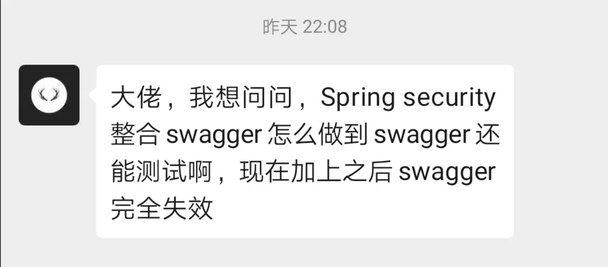
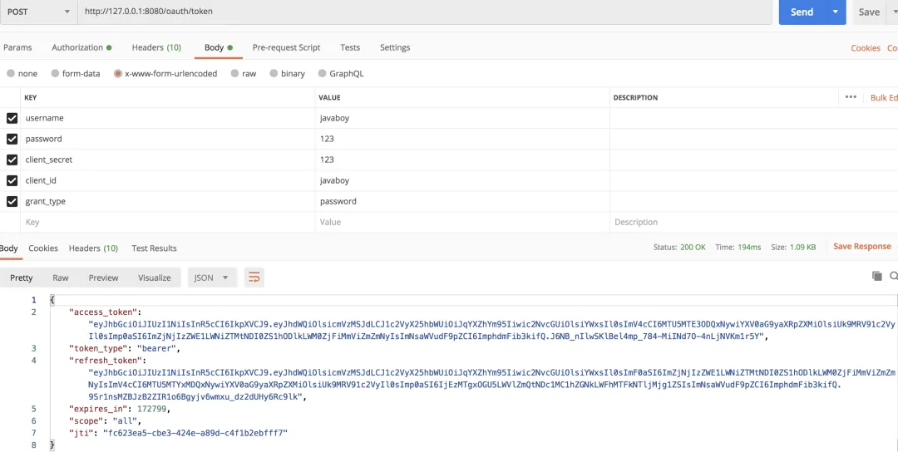
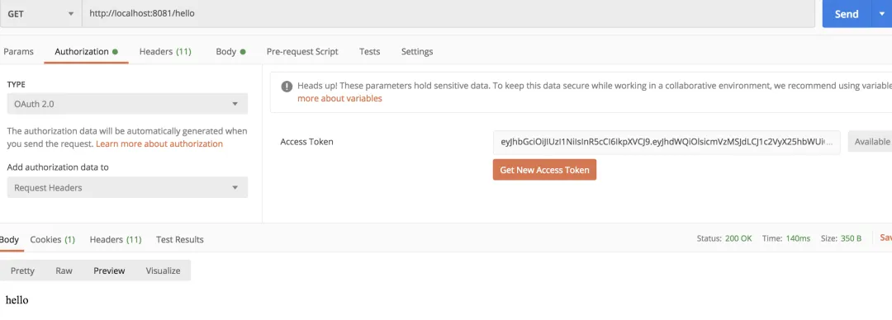
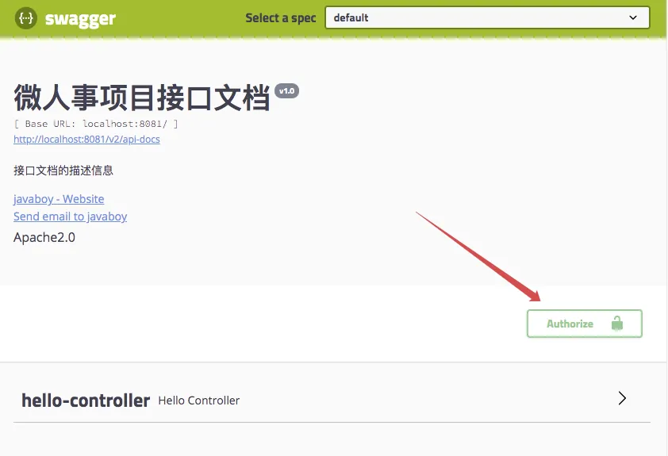
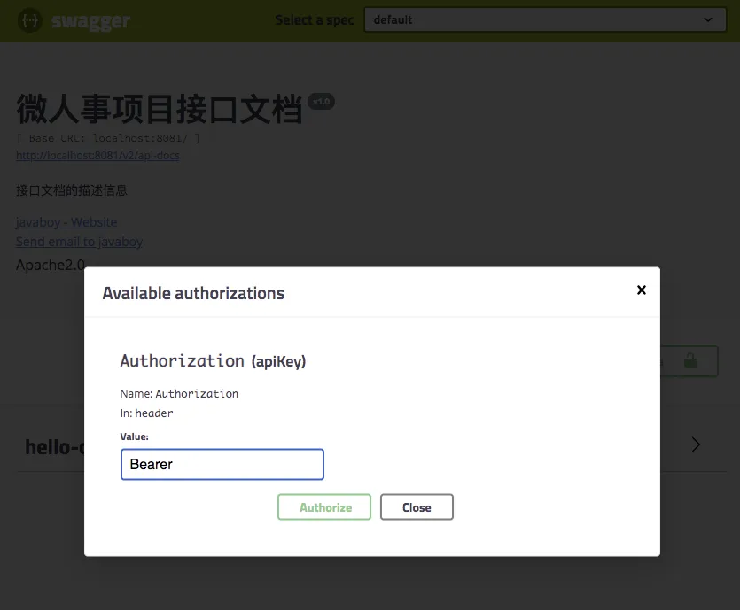
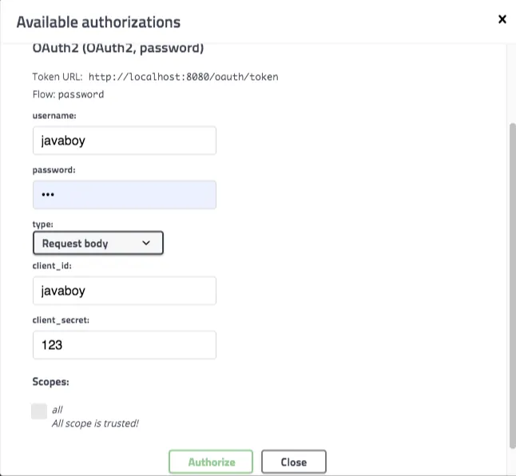
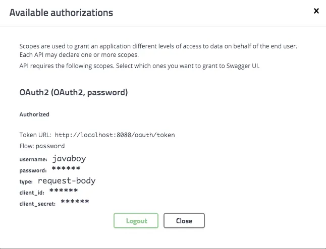

# 【SpringSecurity系列（二十七）】Swagger中怎么处理认证问题？

Original 江南一点雨 [江南一点雨](javascript:void(0);) *2021年07月16日 10:37*

《深入浅出Spring Security》一书已由清华大学出版社正式出版发行，感兴趣的小伙伴戳这里[->->>深入浅出Spring Security](https://mp.weixin.qq.com/s?__biz=MzI1NDY0MTkzNQ==&mid=2247492459&idx=1&sn=a3ffb25873c0905b8862fcb8334a68e7&scene=21#wechat_redirect)，一本书学会 Spring Security。

<iframe src="https://file.daihuo.qq.com/mp_cps_goods_card/v112/index.html" frameborder="0" scrolling="no" class="iframe_ad_container" style="width: 656.989px; height: 0px; border: none; box-sizing: border-box; display: block;"></iframe>


------

来自一个小伙伴在微信上的提问：



看到这个问题，松哥忽然想到我自己之前写过 Spring Boot+Swagger 的用法：

- [SpringBoot 整合 Swagger2](https://mp.weixin.qq.com/s?__biz=MzI1NDY0MTkzNQ==&mid=2247486800&idx=2&sn=39965b130bdfc39e66a2d40a84d7ba57&scene=21#wechat_redirect)

也写过 OAuth2 + Jwt 的用法：

- [想让 OAuth2 和 JWT 在一起愉快玩耍？请看松哥的表演](https://mp.weixin.qq.com/s?__biz=MzI1NDY0MTkzNQ==&mid=2247488267&idx=2&sn=0ac88e1685ef0915e71eb3c223bd732f&scene=21#wechat_redirect)

但是还没有将这两个结合在一起写过，所以小伙伴们对此有了疑问，想一想这还是一个非常常见的问题，因为现在使用令牌登录的场景越来越多，在这种情况下，如果使用 Swagger 来测试接口，要怎么在请求头中携带 Token 呢？今天松哥就来和大家聊一聊。

## 1.项目规划

如果小伙伴们没有看过松哥之前发的 OAuth2 系列文章，建议一定先看下（公众号江南一点雨后台回复 OAuth2 获取），再来看本文内容，否则接下来的内容可能会犯迷糊。

这里松哥搭建一个 OAuth2+JWT 的环境来做演示。一共搭建两个服务：

| 服务名      | 端口 | 备注       |
| :---------- | :--- | :--------- |
| auth-server | 8080 | 授权服务器 |
| user-server | 8081 | 资源服务器 |

我稍微解释一下：

- auth-server 就是我的资源服务器，用来颁发 JWT 令牌。
- user-server 则是资源服务器，访问 user-server 上的资源，都需要携带令牌才能访问。
- swagger 则用来给 user-server 上的接口生成文档。

OK，这是我们项目的一个大致规划。

## 2.环境搭建

接下来我们来搭建 OAuth2 测试环境。

### 2.1 授权服务器搭建

首先我们搭建一个名为 auth-server 的授权服务，搭建的时候，选择如下三个依赖：

- Web
- Spring Cloud Security
- Spirng Cloud OAuth2


项目创建完成后，首先提供一个 Spring Security 的基本配置：

```
@Configuration
public class SecurityConfig extends WebSecurityConfigurerAdapter {
    @Bean
    PasswordEncoder passwordEncoder() {
        return new BCryptPasswordEncoder();
    }

    @Override
    @Bean
    public AuthenticationManager authenticationManagerBean() throws Exception {
        return super.authenticationManagerBean();
    }

    @Override
    protected void configure(AuthenticationManagerBuilder auth) throws Exception {
        auth.inMemoryAuthentication()
                .withUser("sang")
                .password(passwordEncoder().encode("123"))
                .roles("admin")
                .and()
                .withUser("javaboy")
                .password(passwordEncoder().encode("123"))
                .roles("user");
    }

    @Override
    protected void configure(HttpSecurity http) throws Exception {
        http.csrf().disable().formLogin();
    }
}
```

在这段代码中，为了代码简洁，我就不把 Spring Security 用户存到数据库中去了，直接存在内存中。

这里我创建了一个名为 sang 的用户，密码是 123，角色是 admin。同时我还配置了一个表单登录。

这段配置的目的，实际上就是配置用户。例如你想用微信登录第三方网站，在这个过程中，你得先登录微信，登录微信就要你的用户名/密码信息，那么我们在这里配置的，其实就是用户的用户名/密码/角色信息。

**需要注意的是，在当前案例中，我将采用 OAuth2 中的 password 模式进行登录，因此这里还需要明确的提供一个 AuthenticationManager 的 Bean。**

基本的用户信息配置完成后，接下来我们来配置授权服务器。

首先来配置 TokenStore：

```
@Configuration
public class AccessTokenConfig {
    @Bean
    TokenStore tokenStore() {
        return new JwtTokenStore(jwtAccessTokenConverter());
    }

    @Bean
    JwtAccessTokenConverter jwtAccessTokenConverter() {
        JwtAccessTokenConverter converter = new JwtAccessTokenConverter();
        converter.setSigningKey("javaboy");
        return converter;
    }
}
```

1. TokenStore 我们使用 JwtTokenStore 这个实例。使用了 JWT，access_token 实际上就不用存储了（无状态登录，服务端不需要保存信息），因为用户的所有信息都在 jwt 里边，所以这里配置的 JwtTokenStore 本质上并不是做存储。
2. 另外我们还提供了一个 JwtAccessTokenConverter，这个 JwtAccessTokenConverter 可以实现将用户信息和 JWT 进行转换（将用户信息转为 jwt 字符串，或者从 jwt 字符串提取出用户信息）。
3. 另外，在 JWT 字符串生成的时候，我们需要一个签名，这个签名需要自己保存好。

接下来对授权服务器进行详细配置：

```
@EnableAuthorizationServer
@Configuration
public class AuthorizationServer extends AuthorizationServerConfigurerAdapter {
    @Autowired
    TokenStore tokenStore;
    @Autowired
    ClientDetailsService clientDetailsService;
    @Autowired
    AuthenticationManager authenticationManager;
    @Autowired
    PasswordEncoder passwordEncoder;
    @Autowired
    JwtAccessTokenConverter jwtAccessTokenConverter;

    @Bean
    AuthorizationServerTokenServices tokenServices() {
        DefaultTokenServices services = new DefaultTokenServices();
        services.setClientDetailsService(clientDetailsService);
        services.setSupportRefreshToken(true);
        services.setTokenStore(tokenStore);
        services.setAccessTokenValiditySeconds(60 * 60 * 24 * 2);
        services.setRefreshTokenValiditySeconds(60 * 60 * 24 * 7);
        TokenEnhancerChain tokenEnhancerChain = new TokenEnhancerChain();
        tokenEnhancerChain.setTokenEnhancers(Arrays.asList(jwtAccessTokenConverter));
        services.setTokenEnhancer(tokenEnhancerChain);
        return services;
    }

    @Override
    public void configure(AuthorizationServerSecurityConfigurer security) throws Exception {
        security.allowFormAuthenticationForClients();
    }

    @Override
    public void configure(ClientDetailsServiceConfigurer clients) throws Exception {
        clients.inMemory()
                .withClient("javaboy")
                .secret(passwordEncoder.encode("123"))
                .resourceIds("res1")
                .authorizedGrantTypes("password", "refresh_token")
                .scopes("all")
                .redirectUris("http://localhost:8082/index.html");
    }

    @Override
    public void configure(AuthorizationServerEndpointsConfigurer endpoints) throws Exception {
        endpoints
                .authenticationManager(authenticationManager)
                .tokenServices(tokenServices());
    }
}
```

这段代码有点长，我来给大家挨个解释：

1. 创建 AuthorizationServer 类继承自 AuthorizationServerConfigurerAdapter，来对授权服务器做进一步的详细配置，AuthorizationServer 类记得加上 @EnableAuthorizationServer 注解，表示开启授权服务器的自动化配置。
2. 在 AuthorizationServer 类中，我们其实主要重写三个 configure 方法。
3. AuthorizationServerSecurityConfigurer 用来配置令牌端点的安全约束，也就是这个端点谁能访问，谁不能访问。
4. ClientDetailsServiceConfigurer 用来配置客户端的详细信息，在[之前文章](https://mp.weixin.qq.com/s?__biz=MzI1NDY0MTkzNQ==&mid=2247488209&idx=2&sn=19b1e44fbb1f4c1210f0fa92a618d871&scene=21#wechat_redirect)中，松哥和大家讲过，授权服务器要做两方面的检验，一方面是校验客户端，另一方面则是校验用户，校验用户，我们前面已经配置了，这里就是配置校验客户端。客户端的信息我们可以存在数据库中，这其实也是比较容易的，和用户信息存到数据库中类似，但是这里为了简化代码，我还是将客户端信息存在内存中，这里我们分别配置了客户端的 id，secret、资源 id、授权类型、授权范围以及重定向 uri。授权类型我在[之前文章](https://mp.weixin.qq.com/s?__biz=MzI1NDY0MTkzNQ==&mid=2247488209&idx=2&sn=19b1e44fbb1f4c1210f0fa92a618d871&scene=21#wechat_redirect)中和大家一共讲了四种，四种之中不包含 refresh_token 这种类型，但是在实际操作中，refresh_token 也被算作一种。
5. AuthorizationServerEndpointsConfigurer 这里用来配置令牌的访问端点和令牌服务。
6. tokenServices 这个 Bean 主要用来配置 Token 的一些基本信息，例如 Token 是否支持刷新、Token 的存储位置、Token 的有效期以及刷新 Token 的有效期等等。Token 有效期这个好理解，刷新 Token 的有效期我说一下，当 Token 快要过期的时候，我们需要获取一个新的 Token，在获取新的 Token 时候，需要有一个凭证信息，这个凭证信息不是旧的 Token，而是另外一个 refresh_token，这个 refresh_token 也是有有效期的。

好了，如此之后，我们的授权服务器就算是配置完成了，接下来我们启动授权服务器。

**如果小伙伴们对于上面的配置感到迷糊，可以在公众号后台回复 OAuth2，先系统的学习一下松哥的 OAuth2 教程。**

### 2.2 资源服务器搭建

接下来我们搭建一个资源服务器。大家网上看到的例子，资源服务器大多都是和授权服务器放在一起的，如果项目比较小的话，这样做是没问题的，但是如果是一个大项目，这种做法就不合适了。

资源服务器就是用来存放用户的资源，例如你在微信上的图像、openid 等信息，用户从授权服务器上拿到 access_token 之后，接下来就可以通过 access_token 来资源服务器请求数据。

我们创建一个新的 Spring Boot 项目，叫做 user-server ，作为我们的资源服务器，创建时，添加如下依赖：


项目创建成功之后，先把前面的 AccessTokenConfig 拷贝到资源服务器上，然后添加如下配置：

```
@Configuration
@EnableResourceServer
public class ResourceServerConfig extends ResourceServerConfigurerAdapter {
    @Autowired
    TokenStore tokenStore;

    @Override
    public void configure(ResourceServerSecurityConfigurer resources) throws Exception {
        resources.resourceId("res1").tokenStore(tokenStore);
    }

    @Override
    public void configure(HttpSecurity http) throws Exception {
        http.authorizeRequests()
                .antMatchers("/admin/**").hasRole("admin")
                .anyRequest().authenticated();
    }
}
```

这段配置代码很简单，我简单的说一下：

1. 首先在 configure 方法中配置资源 ID 和 TokenStore，这里配置好之后，会自动调用 JwtAccessTokenConverter 将 jwt 解析出来，jwt 里边就包含了用户的基本信息，所以就不用远程校验 access_token 了。
2. 最后配置一下资源的拦截规则，这就是 Spring Security 中的基本写法，我就不再赘述。

接下来我们再来配置两个测试接口：

```
@RestController
public class HelloController {
    @GetMapping("/hello")
    public String hello() {
        return "hello";
    }
    @GetMapping("/admin/hello")
    public String admin() {
        return "admin";
    }
}
```

如此之后，我们的资源服务器就算配置成功了。

### 2.3 测试

分别启动授权服务器和资源服务器，先访问授权服务器获取 access_token：



再利用拿到的 access_token 去访问资源服务器：



OK，测试没问题。

## 3.整合 Swagger

接下来，我们在 user-server 中加入 swagger 功能，首先我们加入 swagger 依赖：

```
 <dependency>
     <groupId>io.springfox</groupId>
     <artifactId>springfox-swagger2</artifactId>
     <version>2.9.2</version>
 </dependency>
 <dependency>
     <groupId>io.springfox</groupId>
     <artifactId>springfox-swagger-ui</artifactId>
     <version>2.9.2</version>
 </dependency>
```

这里加入的依赖有两个，一个用来生成接口数据，另一个 swagger-ui 用来做数据展示。

### 3.1 认证方式一

请求头加参数，这里给大家介绍两种，先来看第一种。

先配置一个 Docket 实例，如下：

```
@Configuration
@EnableSwagger2
public class Swagger2Config {
    @Bean
    Docket docket() {
        return new Docket(DocumentationType.SWAGGER_2)
                .select()
                .apis(RequestHandlerSelectors.basePackage("org.javaboy.oauth2.res.controller"))
                .paths(PathSelectors.any())
                .build()
                .securityContexts(Arrays.asList(securityContexts()))
                .securitySchemes(Arrays.asList(securitySchemes()))
                .apiInfo(new ApiInfoBuilder()
                        .description("接口文档的描述信息")
                        .title("微人事项目接口文档")
                        .contact(new Contact("javaboy","http://www.javaboy.org","wangsong0210@gmail.com"))
                        .version("v1.0")
                        .license("Apache2.0")
                        .build());
    }
    private SecurityScheme securitySchemes() {
        return new ApiKey("Authorization", "Authorization", "header");
    }

    private SecurityContext securityContexts() {
        return SecurityContext.builder()
                        .securityReferences(defaultAuth())
                        .forPaths(PathSelectors.any())
                        .build();
    }

    private List<SecurityReference> defaultAuth() {
        AuthorizationScope authorizationScope = new AuthorizationScope("xxx", "描述信息");
        AuthorizationScope[] authorizationScopes = new AuthorizationScope[1];
        authorizationScopes[0] = authorizationScope;
        return Arrays.asList(new SecurityReference("Authorization", authorizationScopes));
    }
}
```

这里的配置稍微有点长，我来给大家解释下：

- 首先通过 @EnableSwagger2 注解启用 Swagger2。
- 配置一个 Docket Bean，这个 Bean 中，配置映射路径和要扫描的接口的位置。
- 在 apiInfo 中，主要配置一下 Swagger2 文档网站的信息，例如网站的 title，网站的描述，联系人的信息，使用的协议等等。
- 通过 securitySchemes 来配置全局参数，这里的配置是一个名为 Authorization 的请求头（OAuth2 中需要携带的请求头）。
- securityContexts 则用来配置有哪些请求需要携带 Token，这里我们配置了所有请求。

配置完成后，我们还需要给 swagger-ui 放行，否则 swagger-ui 相关的静态资源会被 Spring Security 拦截下来：

```
@Configuration
public class SecurityConfig extends WebSecurityConfigurerAdapter {

    @Override
    public void configure(WebSecurity web) throws Exception {
        web.ignoring().antMatchers("/swagger-ui.html")
                .antMatchers("/webjars/**")
                .antMatchers("/v2/**")
                .antMatchers("/swagger-resources/**");
    }
}
```

配置完成后，重启 user-server，浏览器输入 http://localhost:8081/swagger-ui.html，结果如下：



大家可以看到，页面中多了一个 Authorize 按钮，点击该按钮，输入 `Bearer ${token}`，如下：



输入完成后，点击 Authorize 按钮，完成认证，接下来，user-server 中的各种接口就可以直接调用测试了。

上面这种方式比较通用，不仅仅适用于 OAuth2，也适用于其他一些自定义的 token 登录方式。

但是这种方式需要开发者先通过其他途径获取到 access_token，有的人会觉得这样有点麻烦，那么有没有更好的办法呢？请看方式二。

### 3.2 认证方式二

认证方式二就是直接在 Swagger 中填入认证信息，这样就不用从外部去获取 access_token 了，效果如下：



我们来看下这个怎么配置。

由于 swagger 去请求 `/oauth/token` 接口会跨域，所以我们首先要修改 auth-server ，使之支持跨域：

主要是两方面的修改，首先是配置 CorsFilter，允许跨域，如下：

```
@Configuration
public class GlobalCorsConfiguration {
    @Bean
    public CorsFilter corsFilter() {
        CorsConfiguration corsConfiguration = new CorsConfiguration();
        corsConfiguration.setAllowCredentials(true);
        corsConfiguration.addAllowedOrigin("*");
        corsConfiguration.addAllowedHeader("*");
        corsConfiguration.addAllowedMethod("*");
        UrlBasedCorsConfigurationSource urlBasedCorsConfigurationSource = new UrlBasedCorsConfigurationSource();
        urlBasedCorsConfigurationSource.registerCorsConfiguration("/**", corsConfiguration);
        return new CorsFilter(urlBasedCorsConfigurationSource);
    }
}
```

然后在 SecurityConfig 中开启跨域支持：

```
@Configuration
@Order(Ordered.HIGHEST_PRECEDENCE)
public class SecurityConfig extends WebSecurityConfigurerAdapter {
    ...
    ...
    @Override
    protected void configure(HttpSecurity http) throws Exception {
        http
                .requestMatchers().antMatchers(HttpMethod.OPTIONS, "/oauth/**")
                .and()
                .csrf().disable().formLogin()
                .and()
                .cors();
    }
}
```

经过这两步的配置，服务端的跨域支持就开启了。

接下来我们在 user-server 中修改关于 Docket bean 的定义：

```
@Configuration
@EnableSwagger2
public class Swagger2Config {
    @Bean
    Docket docket() {
        return new Docket(DocumentationType.SWAGGER_2)
                .select()
                .apis(RequestHandlerSelectors.basePackage("org.javaboy.oauth2.res.controller"))
                .paths(PathSelectors.any())
                .build()
                .securityContexts(Arrays.asList(securityContext()))
                .securitySchemes(Arrays.asList(securityScheme()))
                .apiInfo(new ApiInfoBuilder()
                        .description("接口文档的描述信息")
                        .title("微人事项目接口文档")
                        .contact(new Contact("javaboy","http://www.javaboy.org","wangsong0210@gmail.com"))
                        .version("v1.0")
                        .license("Apache2.0")
                        .build());
    }

    private AuthorizationScope[] scopes() {
        return new AuthorizationScope[]{
                new AuthorizationScope("all", "all scope")
        };
    }

    private SecurityScheme securityScheme() {
        GrantType grant = new ResourceOwnerPasswordCredentialsGrant("http://localhost:8080/oauth/token");
        return new OAuthBuilder().name("OAuth2")
                .grantTypes(Arrays.asList(grant))
                .scopes(Arrays.asList(scopes()))
                .build();
    }

    private SecurityContext securityContext() {
        return SecurityContext.builder()
                .securityReferences(Arrays.asList(new SecurityReference("OAuth2", scopes())))
                .forPaths(PathSelectors.any())
                .build();
    }
}
```

这段配置跟前面的类似，主要是 SecurityScheme 不同。这里采用了 OAuthBuilder 来构建，构建时即得配置 token 的获取地址。

好了，配置完成，重启 auth-server 和 user-server 进行测试。测试效果就是松哥前面给出的图片，不再赘述。

这种方式最大的好处就是不用通过其他途径获取 access_token，直接在 swagger-ui 页面输入 password 模式的认证参数即可。非常方便，仅限于 OAuth2 模式。

## 4.小结

好了，今天就和小伙伴们介绍了在 Swagger 请求中，如何修改请求头的问题，感兴趣的小伙伴可以下来试试哦～

本文案例下载地址：https://github.com/lenve/spring-security-samples

好啦，小伙伴们如果觉得有收获，记得点个在看鼓励下松哥哦～


加微信进群


一起切磋Web安全

（已添加松哥微信的小伙伴请勿重复添加）


# 


Scan to Follow