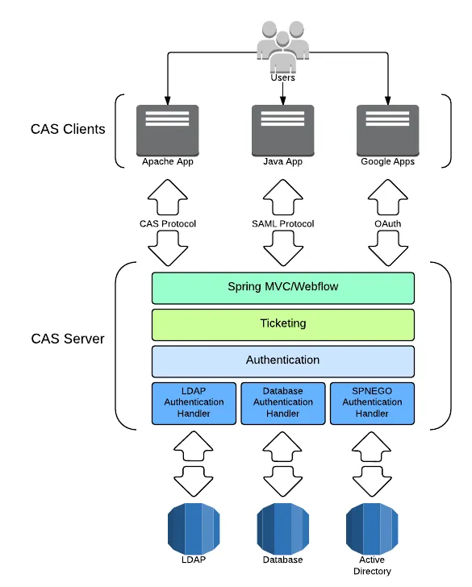
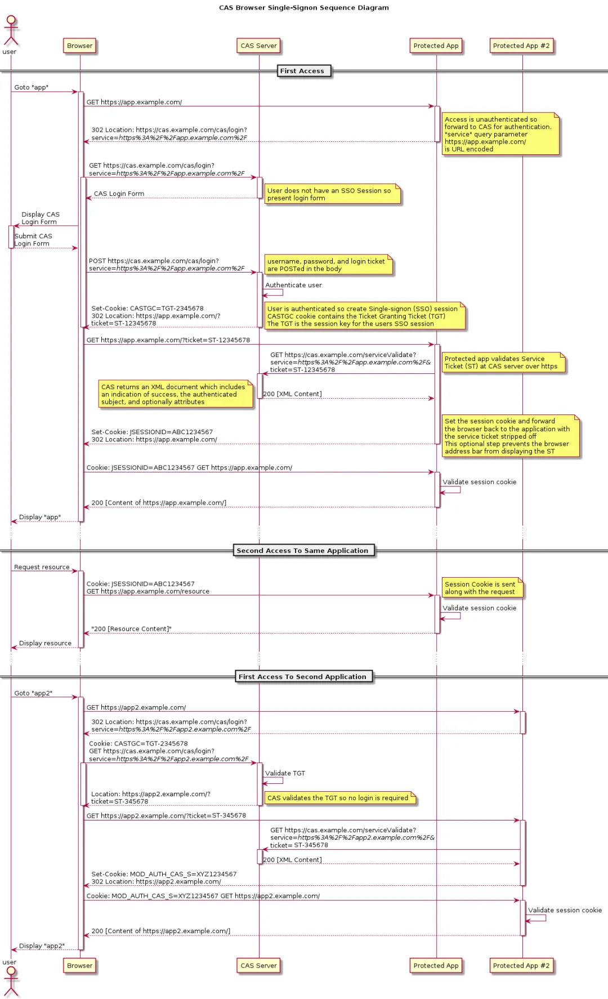
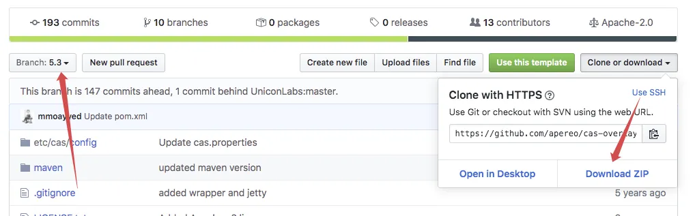
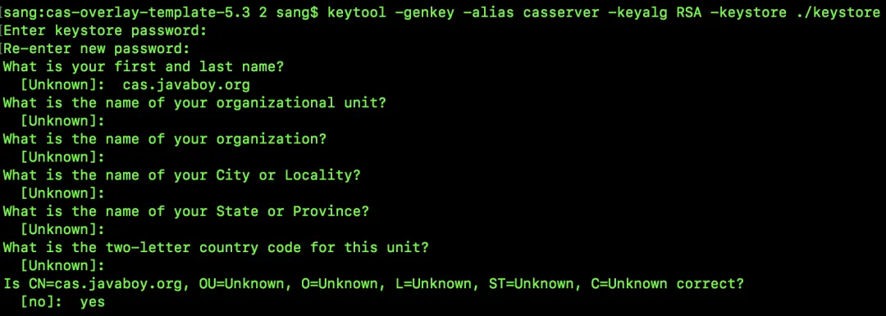
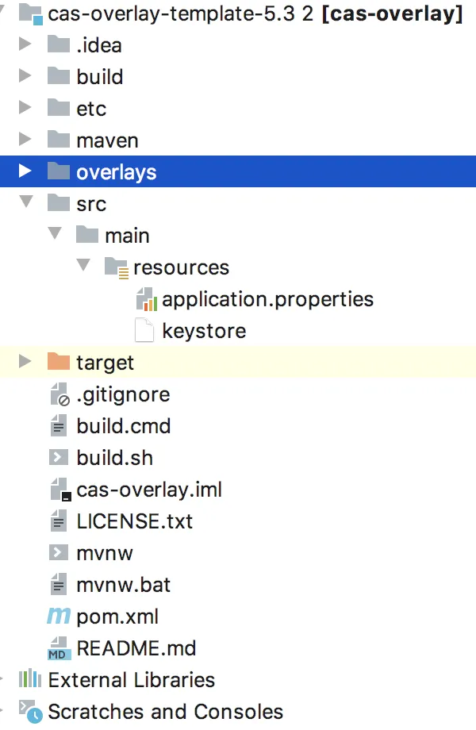
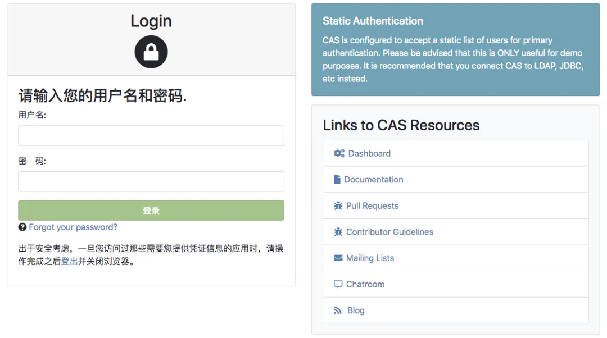
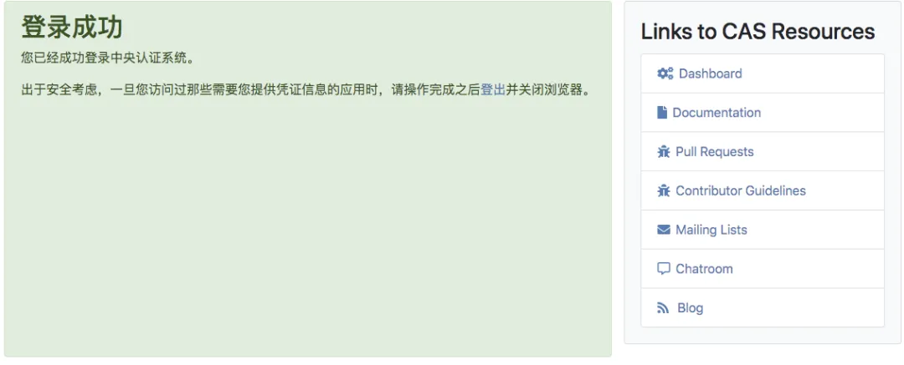

# 【SpringSecurity系列（二十三）】手把手教你入门 Spring Boot + CAS 单点登录

Original 江南一点雨 [江南一点雨](javascript:void(0);) *2021年06月29日 12:16*

《深入浅出Spring Security》一书已由清华大学出版社正式出版发行，感兴趣的小伙伴戳这里[->->>深入浅出Spring Security](https://mp.weixin.qq.com/s?__biz=MzI1NDY0MTkzNQ==&mid=2247492459&idx=1&sn=a3ffb25873c0905b8862fcb8334a68e7&scene=21#wechat_redirect)，一本书学会 Spring Security。

<iframe src="https://file.daihuo.qq.com/mp_cps_goods_card/v112/index.html" frameborder="0" scrolling="no" class="iframe_ad_container" style="width: 656.989px; height: 0px; border: none; box-sizing: border-box; display: block;"></iframe>


------

我们来看今天的 CAS 单点登录。

在微服务以及分布式系统中，单点登录变得越来越普遍，松哥之前也有两篇文章和大家介绍过单点登录的方案：

- [OAuth2+JWT 方案](https://mp.weixin.qq.com/s?__biz=MzI1NDY0MTkzNQ==&mid=2247488267&idx=2&sn=0ac88e1685ef0915e71eb3c223bd732f&scene=21#wechat_redirect)
- [@EnableOAuth2Sso 注解方案](https://mp.weixin.qq.com/s?__biz=MzI1NDY0MTkzNQ==&mid=2247488278&idx=1&sn=b21345a1daa86dd48ea89cdb9138def8&scene=21#wechat_redirect)

这两种方案中，JWT 存在一个注销登录的问题，要费点功夫解决。@EnableOAuth2Sso 注解这种方案不存在注销登录的问题，但是又不像 JWT 那么灵活。

**没有银弹！**

在实际项目中，我们只能根据自己的实际需求，看一看哪一种方案更适合自己，然后在此基础上进行改造！

现在我们在 Spring Cloud Security 中使用 OAuth2+JWT 或者使用 @EnableOAuth2Sso 注解比以前要方便很多了，松哥也是最近才把项目切换到 Spring Cloud Security 技术栈上面来，在这之前，单点登录用的更多的是 CAS 单点登录。相信有不少小伙伴在公司里可能也还是使用了 CAS 单点登录这种方案，今天松哥就来花点时间，和大家聊聊 CAS+Spring Security 实现单点登录，这种方案到底该怎么玩。

可能会连续几篇文章来介绍 CAS 单点登录，本文先来说说理论和登录流程。另外，由于 CAS 和 Spring Cloud OAuth2 在某些方面具有一定的相似性，所以强烈建议大家先看一看松哥的 OAuth2 系列教程，再来阅读本文就会轻松很多（公众号后台回复 OAuth2 有相关教程）。

本文是 Spring Security 系列第 23 篇，阅读本系列前面的文章有助于更好的理解本文：

1. [【SpringSecurity系列（一）】初识 Spring Security](https://mp.weixin.qq.com/s?__biz=MzI1NDY0MTkzNQ==&mid=2247492925&idx=2&sn=b3b8943bce05e97d4f84d92002dd6571&scene=21#wechat_redirect)
2. [【SpringSecurity系列（二）】Spring Security入门](https://mp.weixin.qq.com/s?__biz=MzI1NDY0MTkzNQ==&mid=2247493000&idx=2&sn=3d2862565e0f22968f1685199c6bdb87&scene=21#wechat_redirect)
3. [【SpringSecurity系列（三）】定制表单登录](https://mp.weixin.qq.com/s?__biz=MzI1NDY0MTkzNQ==&mid=2247493036&idx=2&sn=0a0356f4724830eb136d673c289437b6&scene=21#wechat_redirect)
4. [【SpringSecurity系列（四）】登录成功返回JSON数据](https://mp.weixin.qq.com/s?__biz=MzI1NDY0MTkzNQ==&mid=2247493044&idx=2&sn=e7a4f0fd826eeffffdb503cc2316bc50&scene=21#wechat_redirect)
5. [【SpringSecurity系列（五）】授权入门](https://mp.weixin.qq.com/s?__biz=MzI1NDY0MTkzNQ==&mid=2247493062&idx=2&sn=1480de83f67c3049e7efcc1cce21a918&scene=21#wechat_redirect)
6. [【SpringSecurity系列（六）】自定义登录用户](https://mp.weixin.qq.com/s?__biz=MzI1NDY0MTkzNQ==&mid=2247493130&idx=2&sn=7dff1f444fc652c23267a1ba89ea11d2&scene=21#wechat_redirect)
7. [【SpringSecurity系列（七）】通过 Spring Data Jpa 持久化用户数据](https://mp.weixin.qq.com/s?__biz=MzI1NDY0MTkzNQ==&mid=2247493175&idx=2&sn=55ab518981e7952137c0c247205eb6a3&scene=21#wechat_redirect)
8. [【SpringSecurity系列（八）】用户还能自动登录？](https://mp.weixin.qq.com/s?__biz=MzI1NDY0MTkzNQ==&mid=2247493198&idx=2&sn=a6362d7264bd50a35b5cc46ddbd334b0&scene=21#wechat_redirect)
9. [【SpringSecurity系列（九）】降低 RememberMe 的安全风险](https://mp.weixin.qq.com/s?__biz=MzI1NDY0MTkzNQ==&mid=2247493226&idx=2&sn=1ad5066cc96b6f2a7f05714693cb0aa0&scene=21#wechat_redirect)
10. [在微服务项目中，Spring Security 比 Shiro 强在哪？](https://mp.weixin.qq.com/s?__biz=MzI1NDY0MTkzNQ==&mid=2247488312&idx=1&sn=61e67f7ca0f8a55749dcb064b9456a38&scene=21#wechat_redirect)
11. [【SpringSecurity系列（十一）】自定义认证逻辑](https://mp.weixin.qq.com/s?__biz=MzI1NDY0MTkzNQ==&mid=2247493279&idx=2&sn=7c89d5a454487174a9ab86d6788b0c34&scene=21#wechat_redirect)
12. [【SpringSecurity系列（十二）】查看登录详情](https://mp.weixin.qq.com/s?__biz=MzI1NDY0MTkzNQ==&mid=2247493346&idx=2&sn=11f66f1851ad8e5101cb788c709519a1&scene=21#wechat_redirect)
13. [【SpringSecurity系列（十三）】只允许一台设备在线](https://mp.weixin.qq.com/s?__biz=MzI1NDY0MTkzNQ==&mid=2247493361&idx=2&sn=4c1a841c7cfa88e6d092274b6bec5556&scene=21#wechat_redirect)
14. [【SpringSecurity系列（十四）】自动踢掉上一个登录用户](https://mp.weixin.qq.com/s?__biz=MzI1NDY0MTkzNQ==&mid=2247493382&idx=2&sn=294bfe14613d5f97e817ee3612c6cf8c&scene=21#wechat_redirect)
15. [【SpringSecurity系列（十五）】请求防火墙默认已开启](https://mp.weixin.qq.com/s?__biz=MzI1NDY0MTkzNQ==&mid=2247493432&idx=2&sn=d13c83bd0d5577b47aa8d78561de8ead&scene=21#wechat_redirect)
16. [【SpringSecurity系列（十六）】会话固定攻击与防御](https://mp.weixin.qq.com/s?__biz=MzI1NDY0MTkzNQ==&mid=2247493486&idx=2&sn=2935be18e5fd8b3e3043cfad5dce5a35&scene=21#wechat_redirect)
17. [【SpringSecurity系列（十七）】Spring Security 如何处理 Session 共享](https://mp.weixin.qq.com/s?__biz=MzI1NDY0MTkzNQ==&mid=2247493552&idx=2&sn=76eb35d59aea46f0f7095314f7d988a0&scene=21#wechat_redirect)
18. [【SpringSecurity系列（十八）】SpringBoot 如何防御 CSRF 攻击？](https://mp.weixin.qq.com/s?__biz=MzI1NDY0MTkzNQ==&mid=2247493615&idx=2&sn=dc132cfc80e07b709312a2567ec93678&scene=21#wechat_redirect)
19. [【SpringSecurity系列（十九）】Spring Security 中 CSRF 防御源码解析](https://mp.weixin.qq.com/s?__biz=MzI1NDY0MTkzNQ==&mid=2247493641&idx=2&sn=5412022deeeef2b55edec9241d5fda0d&scene=21#wechat_redirect)
20. [【SpringSecurity系列（二十）】密码加密的两种姿势](https://mp.weixin.qq.com/s?__biz=MzI1NDY0MTkzNQ==&mid=2247493759&idx=2&sn=14b4db11a1c0bcc3c2d53e3e7fb5a3c1&scene=21#wechat_redirect)
21. [【SpringSecurity系列（二十一）】Spring Security 怎么学？为什么一定需要系统学习？](https://mp.weixin.qq.com/s?__biz=MzI1NDY0MTkzNQ==&mid=2247493854&idx=2&sn=2fe65a75e6f4b2fdb96d4d117a0a53bd&scene=21#wechat_redirect)
22. [【SpringSecurity系列（二十二）】Spring Security 两种资源放行策略，千万别用错了！](https://mp.weixin.qq.com/s?__biz=MzI1NDY0MTkzNQ==&mid=2247493888&idx=2&sn=d05047d7943387cfc28bd5128bb08744&scene=21#wechat_redirect)

## 1.什么是 CAS

CAS 全称叫做中央认证服务，英文是 Central Authentication Service。

这是由耶鲁大学发起的一个开源项目，目的是帮助 Web 应用系统构建一种可靠的单点登录解决方案，从目前企业实际项目来看，CAS 还是非常受欢迎的一种单点登录解决方案。

### 1.1 CAS 架构

CAS 分为两部分：

- 一个是 CAS Server，这是单点验证服务，作用类似于我们[OAuth2+JWT 方案](https://mp.weixin.qq.com/s?__biz=MzI1NDY0MTkzNQ==&mid=2247488267&idx=2&sn=0ac88e1685ef0915e71eb3c223bd732f&scene=21#wechat_redirect)中的授权服务器，用来校验用户名/密码等，一般来说都是独立部署。
- 另一个则是 CAS Client，相当于就是一个一个的（微）服务。

我们来看 CAS 的官方给出的一个架构图：



可以看到，用户访问的是 CAS Clients，CAS Clients 和 CAS Server 之间的通信支持多种协议，CAS Server 处理具体的认证事宜，CAS Server 对数据源的支持也非常多样化。

CAS Client 支持的平台有：

- Apache httpd Server (mod_auth_cas module)
- Java (Java CAS Client)
- .NET (.NET CAS Client)
- PHP (phpCAS)
- Perl (PerlCAS)
- Python (pycas)
- Ruby (rubycas-client)

CAS 支持的通信协议有：

- CAS (versions 1, 2, and 3)
- SAML 1.1 and 2
- OpenID Connect
- OpenID
- OAuth 2.0
- WS Federation

从图中也可以看出 CAS 支持多种不同的认证机制，具体有：

- JAAS
- LDAP
- RDBMS
- SPNEGO
- ...

### 1.2 三个概念

在 CAS 的整个登录过程中，有三个重要的概念，这里我先来和大家捋一捋。

1. TGT：TGT 全称叫做 Ticket Granting Ticket，这个相当于我们平时所见到的 HttpSession 的作用，用户登录成功后，用户的基本信息，如用户名、登录有效期等信息，都将存储在此。
2. TGC：TGC 全称叫做 Ticket Granting Cookie，TGC 以 Cookie 的形式保存在浏览器中，根据 TGC 可以帮助用户找到对应的 TGT，所以这个 TGC 有点类似与会话 ID。
3. ST：ST 全称是 Service Ticket，这是 CAS Sever 通过 TGT 给用户发放的一张票据，用户在访问其他服务时，发现没有 Cookie 或者 ST ，那么就会 302 到 CAS Server 获取 ST，然后会携带着 ST 302 回来，CAS Client 则通过 ST 去 CAS Server 上获取用户的登录状态。

## 2.CAS 登录流程

接下来我们通过一张官方给出的流程图来看下 CAS 登录过程是什么样子的！



这张图其实画的比较清楚了，我再用文字和大家解释下：

术语：应用1、应用2 分别表示被保护的应用。

1. 用户通过浏览器访问应用1，应用1 发现用户没有登录，于是返回 302，并且携带上一个 service 参数，让用户去 CAS Server 上登录。
2. 浏览器自动重定向到 CAS Server 上，CAS Server 获取用户 Cookie 中携带的 TGC，去校验用户是否已经登录，如果已经登录，则完成身份校验（此时 CAS Server 可以根据用户的 TGC 找到 TGT，进而获取用户的信息）；如果未登录，则重定向到 CAS Server 的登录页面，用户输入用户名/密码，CAS Server 会生成 TGT，并且根据 TGT 签发一个 ST，再将 TGC 放在用户的 Cookie 中，完成身份校验。
3. CAS Server 完成身份校验之后，会将 ST 拼接在 service 中，返回 302，浏览器将首先将 TGC 存在 Cookie 中，然后根据 302 的指示，携带上 ST 重定向到应用1。
4. 应用1 收到浏览器传来的 ST 之后，拿去 CAS Server 上校验，去判断用户的登录状态，如果用户登录合法，CAS Server 就会返回用户信息给 应用1。
5. 浏览器再去访问应用2，应用2 发现用户未登录，重定向到 CAS Server。
6. CAS Server 发现此时用户实际上已经登录了，于是又重定向回应用2，同时携带上 ST。
7. 应用2 拿着 ST 去 CAS Server 上校验，获取用户的登录信息。

在整个登录过程中，浏览器分别和 CAS Server、应用1、应用2 建立了会话，其中，和 CAS Server 建立的会话称之为全局会话，和应用1、应用2 建立的会话称之为局部会话；一旦局部会话成功建立，以后用户再去访问应用1、应用2 就不会经过 CAS Server 了。

## 3.CAS Server 搭建

说了这么多，来点实际的。

由于整个 CAS 单点登录做起来还比较麻烦，我们一步一步来，今天我先来教大家把 CAS Server 搭建起来。

### 3.1 版本选择

目前最新的 CAS Server 是 6.x，这个是基于 gradle 来构建的，考虑到很多小伙伴可能不熟悉 gradle 操作，因此这里我选择 5.3 的版本，该版本基于大家熟悉的 maven 来构建。

官方为我们提供了构建 CAS Server 的模版，地址是：https://github.com/apereo/cas-overlay-template。

我们在分支中选择 5.3 版本下载：



或者直接 clone 下来，然后切换到 5.3 这个分支也可以。这个应该就不用我教大家了吧，相信小伙伴们都能自己搞定。

### 3.2 HTTPS 证书

CAS Server 从版本 4 开始，要使用 HTTPS 通信，所以我们得提前准备 HTTPS 证书。公司里的项目的话，需要购买 HTTPS 证书，自己玩的话也可以从云服务厂商那里申请到免费的 HTTPS 证书。

现在我们在本地测试，直接利用 JDK 自带的 keytool 工具，自己生成一个 HTTPS 证书即可。

生成命令如下：

```
keytool -genkey -alias casserver -keyalg RSA -keystore ./keystore
```

- -alias 表示生成的证书别名
- -keyalg 表示生成证书使用的算法
- -keystore 表示生成证书的存放位置

证书在执行的时候，需要给一个密钥库口令，这个大家随意给出即可，但是给出了多少要自己记着。另外，在 `What is your first and last name?` 选项中，**需要填入 CAS Server 的域名，这点切记**：



如此之后，我们的 HTTPS 证书就有了，虽然这个证书不被各大厂商认可，但是自己做练习够用了。

### 3.3 配置并启动

接下来进行配置。

我们在下载的 cas-overlay-template 项目中，新建 src/main/resources 目录，并将 overlays/org.apereo.cas.cas-server-webapp-tomcat-5.3.14/WEB-INF/classes/application.properties 文件和刚刚生成的 keystore 文件拷贝进来：



然后修改 application.properties ，主要配置一下 keystore 的位置和密钥，如下:

```
server.ssl.key-store=classpath:keystore
server.ssl.key-store-password=111111
server.ssl.key-password=111111
```

配置完成后，在项目根目录下执行如下命令启动项目：

./build.sh bootrun

根据个人网速，第一次启动可能会非常漫长，耐心等待即可。

启动过程中，也可能会报错，但是不用管，如果看到 ready 图标，就表示启动成功了：


### 3.4 测试

启动成功后，浏览器输入 https://cas.javaboy.org:8443/cas/login 就可以进入登录页面了（注意是 https 哦）：



默认的用户名是 casuser，密码是 Mellon，输入用户名密码就可以登录了。



默认的用户名/密码也可以在 application.properties 文件中修改，该文件的最后一行：

```
cas.authn.accept.users=casuser::Mellon
```

修改完后，重启项目即可生效。

## 4.小结

今天主要和小伙伴聊一下 CAS 的基本概念，然后我们顺手搭建一个 CAS Server 出来，感兴趣的小伙伴可以动手试一试哦～，下篇文章我们来看如何用 Spring Boot 开发 CAS 客户端～

好啦，如果小伙伴们觉得有收获，记得点个在看鼓励下松哥哦～


加微信进群


一起切磋Web安全

（已添加松哥微信的小伙伴请勿重复添加）


# 