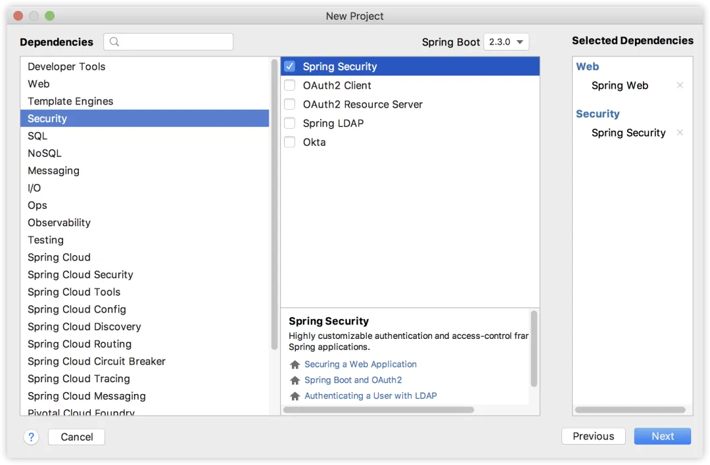
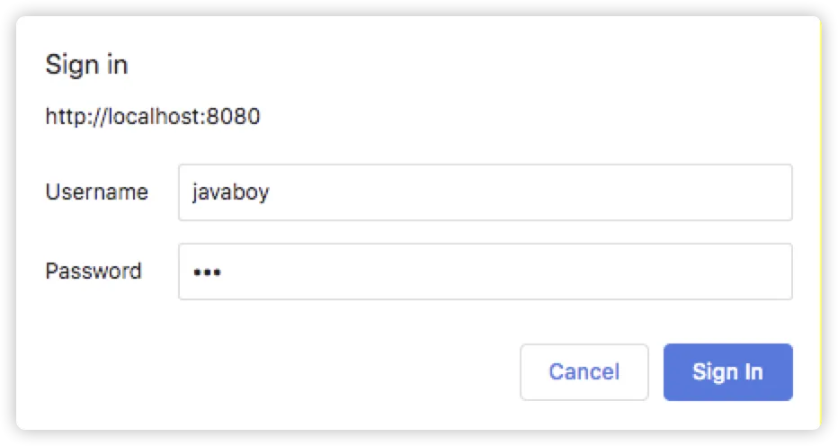
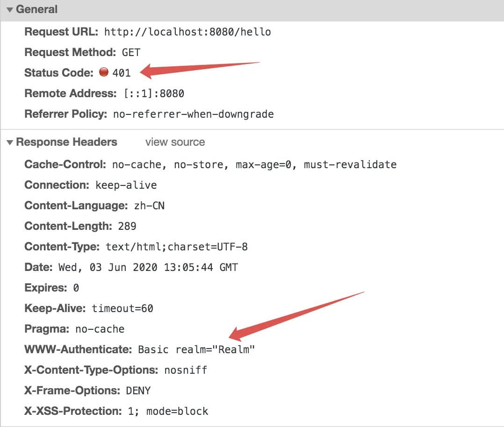
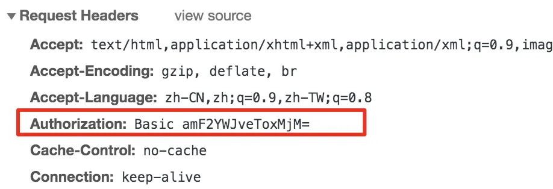
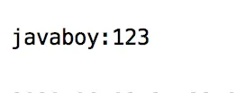
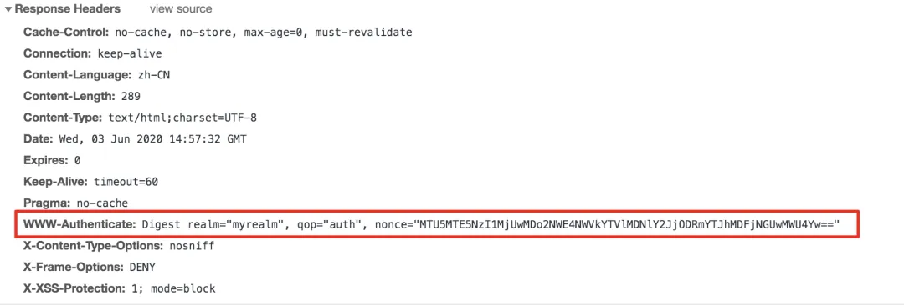
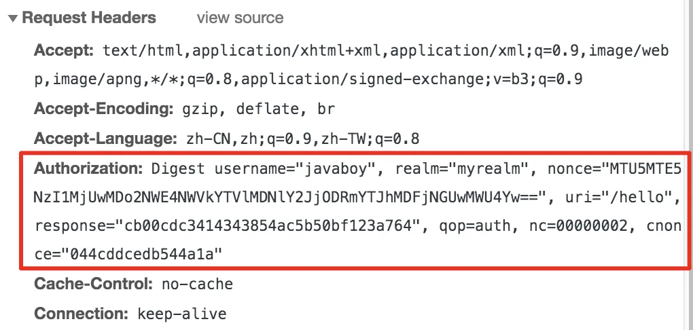

# 【SpringSecurity系列（二十九）】Spring Security 实现 Http Basic 认证

Original 江南一点雨 [江南一点雨](javascript:void(0);) *2021年07月23日 10:38*

《深入浅出Spring Security》一书已由清华大学出版社正式出版发行，感兴趣的小伙伴戳这里[->->>深入浅出Spring Security](https://mp.weixin.qq.com/s?__biz=MzI1NDY0MTkzNQ==&mid=2247492459&idx=1&sn=a3ffb25873c0905b8862fcb8334a68e7&scene=21#wechat_redirect)，一本书学会 Spring Security。

<iframe src="https://file.daihuo.qq.com/mp_cps_goods_card/v112/index.html" frameborder="0" scrolling="no" class="iframe_ad_container" style="width: 656.989px; height: 0px; border: none; box-sizing: border-box; display: block;"></iframe>


------

HttpBasic 认证有一定的局限性与安全隐患，因此在实际项目中使用并不多，但是，有的时候为了测试方便，开启 HttpBasic 认证能方便很多。

因此松哥今天还是来和大家简单聊一聊 Spring Security 中的 HttpBasic 认证。

本文是 Spring Security 系列第 29 篇，阅读前面文章有助于更好理解本文：

1. [【SpringSecurity系列（一）】初识 Spring Security](https://mp.weixin.qq.com/s?__biz=MzI1NDY0MTkzNQ==&mid=2247492925&idx=2&sn=b3b8943bce05e97d4f84d92002dd6571&scene=21#wechat_redirect)
2. [【SpringSecurity系列（二）】Spring Security入门](https://mp.weixin.qq.com/s?__biz=MzI1NDY0MTkzNQ==&mid=2247493000&idx=2&sn=3d2862565e0f22968f1685199c6bdb87&scene=21#wechat_redirect)
3. [【SpringSecurity系列（三）】定制表单登录](https://mp.weixin.qq.com/s?__biz=MzI1NDY0MTkzNQ==&mid=2247493036&idx=2&sn=0a0356f4724830eb136d673c289437b6&scene=21#wechat_redirect)
4. [【SpringSecurity系列（四）】登录成功返回JSON数据](https://mp.weixin.qq.com/s?__biz=MzI1NDY0MTkzNQ==&mid=2247493044&idx=2&sn=e7a4f0fd826eeffffdb503cc2316bc50&scene=21#wechat_redirect)
5. [【SpringSecurity系列（五）】授权入门](https://mp.weixin.qq.com/s?__biz=MzI1NDY0MTkzNQ==&mid=2247493062&idx=2&sn=1480de83f67c3049e7efcc1cce21a918&scene=21#wechat_redirect)
6. [【SpringSecurity系列（六）】自定义登录用户](https://mp.weixin.qq.com/s?__biz=MzI1NDY0MTkzNQ==&mid=2247493130&idx=2&sn=7dff1f444fc652c23267a1ba89ea11d2&scene=21#wechat_redirect)
7. [【SpringSecurity系列（七）】通过 Spring Data Jpa 持久化用户数据](https://mp.weixin.qq.com/s?__biz=MzI1NDY0MTkzNQ==&mid=2247493175&idx=2&sn=55ab518981e7952137c0c247205eb6a3&scene=21#wechat_redirect)
8. [【SpringSecurity系列（八）】用户还能自动登录？](https://mp.weixin.qq.com/s?__biz=MzI1NDY0MTkzNQ==&mid=2247493198&idx=2&sn=a6362d7264bd50a35b5cc46ddbd334b0&scene=21#wechat_redirect)
9. [【SpringSecurity系列（九）】降低 RememberMe 的安全风险](https://mp.weixin.qq.com/s?__biz=MzI1NDY0MTkzNQ==&mid=2247493226&idx=2&sn=1ad5066cc96b6f2a7f05714693cb0aa0&scene=21#wechat_redirect)
10. [在微服务项目中，Spring Security 比 Shiro 强在哪？](https://mp.weixin.qq.com/s?__biz=MzI1NDY0MTkzNQ==&mid=2247488312&idx=1&sn=61e67f7ca0f8a55749dcb064b9456a38&scene=21#wechat_redirect)
11. [【SpringSecurity系列（十一）】自定义认证逻辑](https://mp.weixin.qq.com/s?__biz=MzI1NDY0MTkzNQ==&mid=2247493279&idx=2&sn=7c89d5a454487174a9ab86d6788b0c34&scene=21#wechat_redirect)
12. [【SpringSecurity系列（十二）】查看登录详情](https://mp.weixin.qq.com/s?__biz=MzI1NDY0MTkzNQ==&mid=2247493346&idx=2&sn=11f66f1851ad8e5101cb788c709519a1&scene=21#wechat_redirect)
13. [【SpringSecurity系列（十三）】只允许一台设备在线](https://mp.weixin.qq.com/s?__biz=MzI1NDY0MTkzNQ==&mid=2247493361&idx=2&sn=4c1a841c7cfa88e6d092274b6bec5556&scene=21#wechat_redirect)
14. [【SpringSecurity系列（十四）】自动踢掉上一个登录用户](https://mp.weixin.qq.com/s?__biz=MzI1NDY0MTkzNQ==&mid=2247493382&idx=2&sn=294bfe14613d5f97e817ee3612c6cf8c&scene=21#wechat_redirect)
15. [【SpringSecurity系列（十五）】请求防火墙默认已开启](https://mp.weixin.qq.com/s?__biz=MzI1NDY0MTkzNQ==&mid=2247493432&idx=2&sn=d13c83bd0d5577b47aa8d78561de8ead&scene=21#wechat_redirect)
16. [【SpringSecurity系列（十六）】会话固定攻击与防御](https://mp.weixin.qq.com/s?__biz=MzI1NDY0MTkzNQ==&mid=2247493486&idx=2&sn=2935be18e5fd8b3e3043cfad5dce5a35&scene=21#wechat_redirect)
17. [【SpringSecurity系列（十七）】Spring Security 如何处理 Session 共享](https://mp.weixin.qq.com/s?__biz=MzI1NDY0MTkzNQ==&mid=2247493552&idx=2&sn=76eb35d59aea46f0f7095314f7d988a0&scene=21#wechat_redirect)
18. [【SpringSecurity系列（十八）】SpringBoot 如何防御 CSRF 攻击？](https://mp.weixin.qq.com/s?__biz=MzI1NDY0MTkzNQ==&mid=2247493615&idx=2&sn=dc132cfc80e07b709312a2567ec93678&scene=21#wechat_redirect)
19. [【SpringSecurity系列（十九）】Spring Security 中 CSRF 防御源码解析](https://mp.weixin.qq.com/s?__biz=MzI1NDY0MTkzNQ==&mid=2247493641&idx=2&sn=5412022deeeef2b55edec9241d5fda0d&scene=21#wechat_redirect)
20. [【SpringSecurity系列（二十）】密码加密的两种姿势](https://mp.weixin.qq.com/s?__biz=MzI1NDY0MTkzNQ==&mid=2247493759&idx=2&sn=14b4db11a1c0bcc3c2d53e3e7fb5a3c1&scene=21#wechat_redirect)
21. [【SpringSecurity系列（二十一）】Spring Security 怎么学？为什么一定需要系统学习？](https://mp.weixin.qq.com/s?__biz=MzI1NDY0MTkzNQ==&mid=2247493854&idx=2&sn=2fe65a75e6f4b2fdb96d4d117a0a53bd&scene=21#wechat_redirect)
22. [【SpringSecurity系列（二十二）】Spring Security 两种资源放行策略，千万别用错了！](https://mp.weixin.qq.com/s?__biz=MzI1NDY0MTkzNQ==&mid=2247493888&idx=2&sn=d05047d7943387cfc28bd5128bb08744&scene=21#wechat_redirect)
23. [【SpringSecurity系列（二十三）】手把手教你入门 Spring Boot + CAS 单点登录](https://mp.weixin.qq.com/s?__biz=MzI1NDY0MTkzNQ==&mid=2247493947&idx=2&sn=041e9d4280eb1984d922106f0e876233&scene=21#wechat_redirect)
24. [【SpringSecurity系列（二十四）】SpringBoot+CAS单点登录](https://mp.weixin.qq.com/s?__biz=MzI1NDY0MTkzNQ==&mid=2247493986&idx=2&sn=e6b692239cac9e97944dbc2402773cbc&scene=21#wechat_redirect)
25. [【SpringSecurity系列（二十五）】CAS 单点登录对接数据库](https://mp.weixin.qq.com/s?__biz=MzI1NDY0MTkzNQ==&mid=2247494022&idx=2&sn=3aa5c41867c1232c32ca7a1d00812046&scene=21#wechat_redirect)
26. [【SpringSecurity系列（二十六）】Spring Boot+CAS 单点登录之自定义登录页面](https://mp.weixin.qq.com/s?__biz=MzI1NDY0MTkzNQ==&mid=2247494118&idx=2&sn=abde43b2397d1d508b33f1715b84dff7&scene=21#wechat_redirect)
27. [【SpringSecurity系列（二十七）】Swagger中怎么处理认证问题？](https://mp.weixin.qq.com/s?__biz=MzI1NDY0MTkzNQ==&mid=2247494186&idx=2&sn=3ce3aff819982fc50db3b0edf65aaa2e&scene=21#wechat_redirect)
28. [【SpringSecurity系列（二十八）】当跨域遇上 Spring Security](https://mp.weixin.qq.com/s?__biz=MzI1NDY0MTkzNQ==&mid=2247494235&idx=2&sn=142c5e0fb6bf964d50acf1d571682b24&scene=21#wechat_redirect)

## 1.什么是 HttpBasic

Http Basic 认证是 Web 服务器和客户端之间进行认证的一种方式，最初是在 HTTP1.0 规范（RFC 1945）中定义，后续的有关安全的信息可以在 HTTP 1.1 规范（RFC 2616）和 HTTP 认证规范（RFC 2617）中找到。

HttpBasic 最大的优势在于使用非常简单，没有复杂的页面交互，只需要在请求头中携带相应的信息就可以认证成功，而且它是一种无状态登录，也就是 session 中并不会记录用户的登录信息。

HttpBasic 最大的问题在于安全性，因为用户名/密码只是简单的通过 Base64 编码之后就开始传送了，很容易被工具嗅探到，进而暴露用户信息。

Spring Security 中既支持基本的 HttpBasic 认证，也支持 Http 摘要认证，Http 摘要认证是在 HttpBasic 认证的基础上，提高了信息安全管理，但是代码复杂度也提高了不少，所以 Http 摘要认证使用并不多。

这里，松哥将和大家分享 Spring Security 中的这两种认证方式。

## 2.HttpBasic 认证

我们先来看实现，再来分析它的认证流程。

首先创建一个 Spring Boot 项目，引入 Web 和 Spring Security 依赖，如下：



接下来创建一个测试接口：

```
@RestController
public class HelloController {
    @GetMapping("/hello")
    public String hello() {
        return "hello";
    }
}
```

再开启 HttpBasic 认证：

```
@Configuration
public class SecurityConfig extends WebSecurityConfigurerAdapter {
    @Override
    protected void configure(HttpSecurity http) throws Exception {
        http.authorizeRequests()
                .anyRequest().authenticated()
                .and()
                .httpBasic();
    }
}
```

最后再在 application.properties 中配置基本的用户信息，如下：

```
spring.security.user.password=123
spring.security.user.name=javaboy
```

配置完成后，启动项目，访问 `/hello` 接口，此时浏览器中会有弹出框，让我们输入用户名/密码信息：



此时我们查看请求响应头，如下：



可以看到，浏览器响应了 401，同时还携带了一个 WWW-Authenticate 响应头，这个是用来描述认证形式的，如果我们使用的是 HttpBasic 认证，默认响应头格式如图所示。

接下来我们输入用户名密码，点击 Sign In 进行登录，登录成功后，就可以成功访问到 `/hello` 接口了。

我们查看第二次的请求，如下：



大家可以看到，在请求头中，多了一个 Authorization 字段，该字段的值为 `Basic amF2YWJveToxMjM=`，

`amF2YWJveToxMjM=` 是一个经过 Base64 编码之后的字符串，我们将该字符串解码之后发现，结果如下：

```
String x = new String(Base64.getDecoder().decode("amF2YWJveToxMjM="), "UTF-8");
```

解码结果如下：



可以看到，这就是我们的用户名密码信息。用户名/密码只是经过简单的 Base64 编码之后就开始传递了，所以说，这种认证方式比较危险⚠️。

我们再来稍微总结一下 HttpBasic 认证的流程：

1. 浏览器发出请求，说要访问 `/hello` 接口。
2. 服务端返回 401，表示未认证。同时在响应头中携带 WWW-Authenticate 字段来描述认证形式。
3. 浏览器收到 401 响应之后，弹出对话框，要求用户输入用户名/密码，用户输入完用户名/密码之后，浏览器会将之进行 Base64 编码，编码完成后，发送到服务端。
4. 服务端对浏览器传来的信息进行解码，并校验，当没问题的时候，给客户端作出响应。

大致的流程就是这样。

## 3.Http 摘要认证

Http 摘要认证与 HttpBasic 认证基本兼容，但是要复杂很多，这个复杂不仅体现在代码上，也体现在请求过程中。

Http 摘要认证最重要的改进是他不会在网络上发送明文密码。它的整个认证流程是这样的：

1. 浏览器发出请求，说要访问 `/hello` 接口。
2. 服务端返回 401，表示未认证，同时在响应头中携带 WWW-Authenticate 字段来描述认证形式。不同的是，这次服务端会计算出一个随机字符串，一同返回前端，这样可以防止重放攻击（所谓重放攻击就是别人嗅探到你的摘要信息，把摘要当成密码一次次发送服务端，加一个会变化的随机字符串，生成的摘要信息就会变化，就可以防止重放攻击），如下：



同时，服务端返回的字段还有一个 qop，表示保护级别，auth 表示只进行身份验证；auth-int 表示还要校验内容。

nonce 是服务端生成的随机字符串，这是一个经过 Base64 编码的字符串，经过解码我们发现，它是由过期时间和密钥组成的。在以后的请求中 nonce 会原封不动的再发回给服务端。

1. 客户端选择一个算法，根据该算法计算出密码以及其他数据的摘要，如下：



可以看到，客户端发送到服务端的数据比较多。

- nonce 就是服务端发来的随机字符串。
- response 是生成的摘要信息。
- nc 表示请求此时，可以防止重放攻击。
- cnonce 表示客户端发送给服务端的随机字符串。

1. 服务端根据客户端发送来的用户名，可以查询出用户密码，再根据用户密码可以计算出摘要信息，再将摘要信息和客户端发送来的摘要信息进行对比，就能确认用户身份。

这就是整个流程。

**一言以蔽之，原本的用户密码被摘要信息代替了，为了安全，摘要信息会根据服务端返回的随机字符串而发生变化，服务端根据用户密码，同样算出密码的摘要信息，再和客户端传来的摘要信息进行对比，没问题的话，用户就算认证成功了。当然，在此基础上还加了一些过期限制、重放攻击防范机制等。**

好了，那这个在 Spring Security 代码中该怎么实现呢？

```
@Configuration
public class SecurityConfig extends WebSecurityConfigurerAdapter {
    @Override
    protected void configure(HttpSecurity http) throws Exception {
        http.authorizeRequests()
                .anyRequest().authenticated()
                .and()
                .csrf()
                .disable()
                .exceptionHandling()
                .authenticationEntryPoint(digestAuthenticationEntryPoint())
                .and()
                .addFilter(digestAuthenticationFilter());
    }

    @Bean
    DigestAuthenticationEntryPoint digestAuthenticationEntryPoint() {
        DigestAuthenticationEntryPoint entryPoint = new DigestAuthenticationEntryPoint();
        entryPoint.setKey("javaboy");
        entryPoint.setRealmName("myrealm");
        entryPoint.setNonceValiditySeconds(1000);
        return entryPoint;
    }
    @Bean
    DigestAuthenticationFilter digestAuthenticationFilter() {
        DigestAuthenticationFilter filter = new DigestAuthenticationFilter();
        filter.setAuthenticationEntryPoint(digestAuthenticationEntryPoint());
        filter.setUserDetailsService(userDetailsService());
        return filter;
    }

    @Override
    @Bean
    protected UserDetailsService userDetailsService() {
        InMemoryUserDetailsManager manager = new InMemoryUserDetailsManager();
        manager.createUser(User.withUsername("javaboy").password("123").roles("admin").build());
        return manager;
    }

    @Bean
    PasswordEncoder passwordEncoder() {
        return NoOpPasswordEncoder.getInstance();
    }

}
```

配置无非就是两方面，一方面是服务端随机字符串的生成，另一方面就是客户端摘要信息的校验。

1. 首先提供 DigestAuthenticationEntryPoint 的实例，配置服务端随机数生成的一写参数，例如 nonce 有效期（多长时间会变），realm 的名字，以及生成 nonce 时所需要的 key。nonce 的具体生成逻辑在 DigestAuthenticationEntryPoint#commence 方法中：

```
public void commence(HttpServletRequest request, HttpServletResponse response,
  AuthenticationException authException) throws IOException {
 HttpServletResponse httpResponse = response;
 long expiryTime = System.currentTimeMillis() + (nonceValiditySeconds * 1000);
 String signatureValue = DigestAuthUtils.md5Hex(expiryTime + ":" + key);
 String nonceValue = expiryTime + ":" + signatureValue;
 String nonceValueBase64 = new String(Base64.getEncoder().encode(nonceValue.getBytes()));
 String authenticateHeader = "Digest realm=\"" + realmName + "\", "
   + "qop=\"auth\", nonce=\"" + nonceValueBase64 + "\"";
 if (authException instanceof NonceExpiredException) {
  authenticateHeader = authenticateHeader + ", stale=\"true\"";
 }
 if (logger.isDebugEnabled()) {
  logger.debug("WWW-Authenticate header sent to user agent: "
    + authenticateHeader);
 }
 httpResponse.addHeader("WWW-Authenticate", authenticateHeader);
 httpResponse.sendError(HttpStatus.UNAUTHORIZED.value(),
  HttpStatus.UNAUTHORIZED.getReasonPhrase());
}
```

在这段代码中，首先获取到过期时间，然后给过期时间和 key 一起计算出消息摘要，再将 nonce 和消息摘要共同作为 value，计算出一个 Base64 编码字符，再将该编码字符写回到前端。

1. 配置 DigestAuthenticationFilter 过滤器，主要用来处理前端请求。过滤器的源码比较长，我这里就不贴出来了，一个核心的思路就是从前端拿到用户请求的摘要信息，服务端也根据一直的信息算出来一个摘要，再根据传过来的摘要信息进行比对，进而确认用户身份。

配置完成后，重启服务端进行测试。

测试效果其实和 HttpBasic 认证是一样的，所有的变化，只是背后的实现有所变化而已，用户体验是一样的。

## 4.小结

Http 摘要认证的效果虽然比 HttpBasic 安全，但是其实大家看到，整个流程下来解决的安全问题其实还是非常有限。而且代码也麻烦了很多，因此这种认证方式并未广泛流行开来。

Http 认证小伙伴们作为一个了解即可，里边的有一些思想还是挺有意思的，可以激发我们解决其他问题的思路，例如对于重放攻击的的解决办法，我们如果想自己防御重放攻击，就可以参考这里的实现思路。

好啦，小伙伴们如果有收获，记得点个在看鼓励下松哥哦～


加微信进群


一起切磋Web安全

（已添加松哥微信的小伙伴请勿重复添加）

SpringSecurity38

SpringSecurity · 目录


上一篇【SpringSecurity系列（二十八）】当跨域遇上 Spring Security下一篇【SpringSecurity系列（三十）】Spring Security 中的四种权限控制方式


# 


Scan to Follow