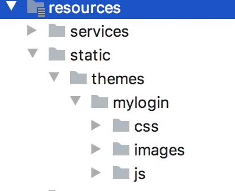

# 【SpringSecurity系列（二十六）】Spring Boot+CAS 单点登录之自定义登录页面

Original 江南一点雨 [江南一点雨](javascript:void(0);) *2021年07月13日 10:38*

《深入浅出Spring Security》一书已由清华大学出版社正式出版发行，感兴趣的小伙伴戳这里[->->>深入浅出Spring Security](https://mp.weixin.qq.com/s?__biz=MzI1NDY0MTkzNQ==&mid=2247492459&idx=1&sn=a3ffb25873c0905b8862fcb8334a68e7&scene=21#wechat_redirect)，一本书学会 Spring Security。

<iframe src="https://file.daihuo.qq.com/mp_cps_goods_card/v112/index.html" frameborder="0" scrolling="no" class="iframe_ad_container" style="width: 656.989px; height: 0px; border: none; box-sizing: border-box; display: block;"></iframe>


------

最近的又一头扎进 Spring Security+CAS 上面了，CAS 单点登录已经连续写了四篇了，小伙伴们一定按顺序阅读哦，这样后面的文章才好理解。

[上篇文章](https://mp.weixin.qq.com/s?__biz=MzI1NDY0MTkzNQ==&mid=2247488924&idx=2&sn=6b0d567181dd4d6b52c56894071ced1e&scene=21#wechat_redirect)和大家分享了 CAS Server 接入数据库的问题，今天我们来看下如何在 CAS Server 上自定义登录页面，因为正常来说，我们是不会直接用官方给出的登录页面的。

本文是 Spring Security 系列第 26 篇，阅读前面文章有助于更好的理解本文：

1. [【SpringSecurity系列（一）】初识 Spring Security](https://mp.weixin.qq.com/s?__biz=MzI1NDY0MTkzNQ==&mid=2247492925&idx=2&sn=b3b8943bce05e97d4f84d92002dd6571&scene=21#wechat_redirect)
2. [【SpringSecurity系列（二）】Spring Security入门](https://mp.weixin.qq.com/s?__biz=MzI1NDY0MTkzNQ==&mid=2247493000&idx=2&sn=3d2862565e0f22968f1685199c6bdb87&scene=21#wechat_redirect)
3. [【SpringSecurity系列（三）】定制表单登录](https://mp.weixin.qq.com/s?__biz=MzI1NDY0MTkzNQ==&mid=2247493036&idx=2&sn=0a0356f4724830eb136d673c289437b6&scene=21#wechat_redirect)
4. [【SpringSecurity系列（四）】登录成功返回JSON数据](https://mp.weixin.qq.com/s?__biz=MzI1NDY0MTkzNQ==&mid=2247493044&idx=2&sn=e7a4f0fd826eeffffdb503cc2316bc50&scene=21#wechat_redirect)
5. [【SpringSecurity系列（五）】授权入门](https://mp.weixin.qq.com/s?__biz=MzI1NDY0MTkzNQ==&mid=2247493062&idx=2&sn=1480de83f67c3049e7efcc1cce21a918&scene=21#wechat_redirect)
6. [【SpringSecurity系列（六）】自定义登录用户](https://mp.weixin.qq.com/s?__biz=MzI1NDY0MTkzNQ==&mid=2247493130&idx=2&sn=7dff1f444fc652c23267a1ba89ea11d2&scene=21#wechat_redirect)
7. [【SpringSecurity系列（七）】通过 Spring Data Jpa 持久化用户数据](https://mp.weixin.qq.com/s?__biz=MzI1NDY0MTkzNQ==&mid=2247493175&idx=2&sn=55ab518981e7952137c0c247205eb6a3&scene=21#wechat_redirect)
8. [【SpringSecurity系列（八）】用户还能自动登录？](https://mp.weixin.qq.com/s?__biz=MzI1NDY0MTkzNQ==&mid=2247493198&idx=2&sn=a6362d7264bd50a35b5cc46ddbd334b0&scene=21#wechat_redirect)
9. [【SpringSecurity系列（九）】降低 RememberMe 的安全风险](https://mp.weixin.qq.com/s?__biz=MzI1NDY0MTkzNQ==&mid=2247493226&idx=2&sn=1ad5066cc96b6f2a7f05714693cb0aa0&scene=21#wechat_redirect)
10. [在微服务项目中，Spring Security 比 Shiro 强在哪？](https://mp.weixin.qq.com/s?__biz=MzI1NDY0MTkzNQ==&mid=2247488312&idx=1&sn=61e67f7ca0f8a55749dcb064b9456a38&scene=21#wechat_redirect)
11. [【SpringSecurity系列（十一）】自定义认证逻辑](https://mp.weixin.qq.com/s?__biz=MzI1NDY0MTkzNQ==&mid=2247493279&idx=2&sn=7c89d5a454487174a9ab86d6788b0c34&scene=21#wechat_redirect)
12. [【SpringSecurity系列（十二）】查看登录详情](https://mp.weixin.qq.com/s?__biz=MzI1NDY0MTkzNQ==&mid=2247493346&idx=2&sn=11f66f1851ad8e5101cb788c709519a1&scene=21#wechat_redirect)
13. [【SpringSecurity系列（十三）】只允许一台设备在线](https://mp.weixin.qq.com/s?__biz=MzI1NDY0MTkzNQ==&mid=2247493361&idx=2&sn=4c1a841c7cfa88e6d092274b6bec5556&scene=21#wechat_redirect)
14. [【SpringSecurity系列（十四）】自动踢掉上一个登录用户](https://mp.weixin.qq.com/s?__biz=MzI1NDY0MTkzNQ==&mid=2247493382&idx=2&sn=294bfe14613d5f97e817ee3612c6cf8c&scene=21#wechat_redirect)
15. [【SpringSecurity系列（十五）】请求防火墙默认已开启](https://mp.weixin.qq.com/s?__biz=MzI1NDY0MTkzNQ==&mid=2247493432&idx=2&sn=d13c83bd0d5577b47aa8d78561de8ead&scene=21#wechat_redirect)
16. [【SpringSecurity系列（十六）】会话固定攻击与防御](https://mp.weixin.qq.com/s?__biz=MzI1NDY0MTkzNQ==&mid=2247493486&idx=2&sn=2935be18e5fd8b3e3043cfad5dce5a35&scene=21#wechat_redirect)
17. [【SpringSecurity系列（十七）】Spring Security 如何处理 Session 共享](https://mp.weixin.qq.com/s?__biz=MzI1NDY0MTkzNQ==&mid=2247493552&idx=2&sn=76eb35d59aea46f0f7095314f7d988a0&scene=21#wechat_redirect)
18. [【SpringSecurity系列（十八）】SpringBoot 如何防御 CSRF 攻击？](https://mp.weixin.qq.com/s?__biz=MzI1NDY0MTkzNQ==&mid=2247493615&idx=2&sn=dc132cfc80e07b709312a2567ec93678&scene=21#wechat_redirect)
19. [【SpringSecurity系列（十九）】Spring Security 中 CSRF 防御源码解析](https://mp.weixin.qq.com/s?__biz=MzI1NDY0MTkzNQ==&mid=2247493641&idx=2&sn=5412022deeeef2b55edec9241d5fda0d&scene=21#wechat_redirect)
20. [【SpringSecurity系列（二十）】密码加密的两种姿势](https://mp.weixin.qq.com/s?__biz=MzI1NDY0MTkzNQ==&mid=2247493759&idx=2&sn=14b4db11a1c0bcc3c2d53e3e7fb5a3c1&scene=21#wechat_redirect)
21. [【SpringSecurity系列（二十一）】Spring Security 怎么学？为什么一定需要系统学习？](https://mp.weixin.qq.com/s?__biz=MzI1NDY0MTkzNQ==&mid=2247493854&idx=2&sn=2fe65a75e6f4b2fdb96d4d117a0a53bd&scene=21#wechat_redirect)
22. [【SpringSecurity系列（二十二）】Spring Security 两种资源放行策略，千万别用错了！](https://mp.weixin.qq.com/s?__biz=MzI1NDY0MTkzNQ==&mid=2247493888&idx=2&sn=d05047d7943387cfc28bd5128bb08744&scene=21#wechat_redirect)
23. [【SpringSecurity系列（二十三）】手把手教你入门 Spring Boot + CAS 单点登录](https://mp.weixin.qq.com/s?__biz=MzI1NDY0MTkzNQ==&mid=2247493947&idx=2&sn=041e9d4280eb1984d922106f0e876233&scene=21#wechat_redirect)
24. [【SpringSecurity系列（二十四）】SpringBoot+CAS单点登录](https://mp.weixin.qq.com/s?__biz=MzI1NDY0MTkzNQ==&mid=2247493986&idx=2&sn=e6b692239cac9e97944dbc2402773cbc&scene=21#wechat_redirect)
25. [【SpringSecurity系列（二十五）】CAS 单点登录对接数据库](https://mp.weixin.qq.com/s?__biz=MzI1NDY0MTkzNQ==&mid=2247494022&idx=2&sn=3aa5c41867c1232c32ca7a1d00812046&scene=21#wechat_redirect)

## 1.实现思路

CAS Server 对于自定义登录页面其实提供了很好的支持，可以从多个角度来实现，松哥分别来和大家介绍。

CAS Server 上提供的登录页面，早期是用 jsp 写的，我们用的 5.3.2 版本里是用 Thymeleaf 写的，所以现在自定义登录页面也是用 Thymeleaf 来写。

想要自定义登录页面，我们有两种不同的方式：

1. 直接修改源码，位置在 overlays/org.apereo.cas.cas-server-webapp-tomcat-5.3.14/WEB-INF/classes/templates/casLoginView.html，直接就在它的源码基础上改，这个可以实现需求，但是一般不推荐。
2. 把自定义的登录页面当成 theme 来开发，然后在配置文件中配置 theme，这种方式就很灵活，而且既可以配置全局主题，也可以配置局部主题。全局主题就是所有的登录页面都使用自定义的登录页面，局部主题则是可以根据不同的 CAS Client 来配置，不同的 CAS Client 将看到不同的登录页面。

松哥在这里主要和大家介绍第二种方式。

## 2.自定义登录页面

首先我们需要提前准备好自己的登录页面，松哥这里还是使用我本系列前面用过的登录页面：



这个大家可以在文末下载页面模版，也可以自己找一个喜欢的登录页面模版，是在找不到，随便写个表单也行，只要实现了自定义的效果即可。

自定义的登录页面准备好之后，接下来，我们创建一个新的目录 src/main/resources/static/themes/mylogin，将自定义页面涉及到的静态资源文件拷贝进去，这里的 themes 目录下专门放置各种自定义登录页面的静态资源，mylogin 相当于是我当前使用的主题名称：


接下来创建 src/main/resources/mylogin.properties 文件，将登录页面中的一些 js、css 引用配置进去，如下：

```
mylogin.css.style=/themes/mylogin/css/style.css
mylogin.css.fa=/themes/mylogin/css/font-awesome-4.7.0/css/font-awesome.min.css
mylogin.js.jq=/themes/mylogin/js/jquery.min.js
mylogin.js.index=/themes/mylogin/js/index.js
```

我的自定义登录页面里边就这四个引用，如果你有更多的引用，就在这里多配置即可，这里的 key 可以自定义，value 就是静态资源的位置。

接下来，创建 src/main/resources/templates/mylogin/casLoginView.html 文件，casLoginView.html 就是你的登录页面，注意文件名不能写错。Thymeleaf 模版默认是在 templates 目录下，所以我们要在 resources 目录下新建 templates 目录，templates 目录下再新建 mylogin 目录。

casLoginView.html 页面内容如下：

```
<!DOCTYPE html>
<html lang="zh-CN">
<head>
    <meta charset="UTF-8">
    <title>江南一点雨</title>
    <link rel="stylesheet" th:href="@{${#themes.code('mylogin.css.fa')}}">
    <link rel="stylesheet" th:href="@{${#themes.code('mylogin.css.style')}}">

</head>
<body>


<div class="materialContainer">
    <div class="box">
        <div class="title">统一认证中心</div>
        <form method="post" th:object="${credential}" action="login">
            <div class="input">
                <label for="username">用户名</label>
                <input type="text" name="username" id="username">
                <span class="spin"></span>
            </div>
            <div class="input">
                <label for="password">密码</label>
                <input type="password" name="password" id="password">
                <span class="spin"></span>
            </div>
            <input type="hidden" name="execution" th:value="${flowExecutionKey}"/>
                        <input type="hidden" name="_eventId" value="submit"/>
                        <input type="hidden" name="geolocation"/>
            <div class="button login">
                <button type="submit">
                    <span>登录</span>
                    <i class="fa fa-check"></i>
                </button>
            </div>
        </form>
        <a href="javascript:" class="pass-forgot">忘记密码？</a>
    </div>

    <div class="overbox">
        <div class="material-button alt-2">
            <span class="shape"></span>
        </div>
        <div class="title">江南一点雨-注册</div>
        <div class="input">
            <label for="regname">用户名</label>
            <input type="text" name="regname" id="regname">
            <span class="spin"></span>
        </div>
        <div class="input">
            <label for="regpass">密码</label>
            <input type="password" name="regpass" id="regpass">
            <span class="spin"></span>
        </div>
        <div class="input">
            <label for="reregpass">确认密码</label>
            <input type="password" name="reregpass" id="reregpass">
            <span class="spin"></span>
        </div>
        <div class="button">
            <button>
                <span>注册</span>
            </button>
        </div>
    </div>

</div>

<script th:src="@{${#themes.code('mylogin.js.jq')}}"></script>
<script th:src="@{${#themes.code('mylogin.js.index')}}"></script>

</body>
</html>
```

这就是一个普通的登录页面，我只是把 js 和 css 的引用修改了下而已，所以这里也就不做过多介绍。

OK，如此之后，我们的登录页面就算定义好了，接下来就是登录页面的引用了。

登录页面引用，我们有两种方式：

第一种是全剧配置，直接在 application.properties 中添加如下配置：

```
cas.theme.defaultThemeName=mylogin
```

mylogin 就是我们在前面反复出现的目录，相当于是我的主题名。这个配置完成后，以后不管是直接在 CAS Server 上登录，还是从 CAS Client 跳转到 CAS Server 上登录，看到的都是自定义登录页面。

第二种方式则是局部配置，局部配置针对某一个 CAS Client 的配置，所以我们可以在 src/main/resources/services/client1-99.json 文件中（复习前面文章就知道该文件怎么来的）添加 theme 配置：

```
{
  "@class": "org.apereo.cas.services.RegexRegisteredService",
  "serviceId": "^(https|http)://.*",
  "name": "client1",
  "id": 99,
  "description": "应用1 的定义信息",
  "evaluationOrder": 1,
  "theme": "mylogin"
}
```

这样，以后如果是通过**该** CAS Client 跳转到 CAS Server 上登录，则会看到自定义登录页面，如果通过其他 CAS Client 或者直接就在 CAS Server 上登录，则看到的还是默认登录页面，当然我们也可以给其他 CAS Client 再去定义它自己的登录页面。

## 3.小结

好了，这就是松哥和大家介绍的 CAS 单点登录自定义登录页面的问题，感兴趣的小伙伴可以试试～

如果小伙伴们觉得有收获，记得点个在看鼓励下松哥哦～


加微信进群


一起切磋Web安全

（已添加松哥微信的小伙伴请勿重复添加）

SpringSecurity38

SpringSecurity · 目录


上一篇【SpringSecurity系列（二十五）】CAS 单点登录对接数据库下一篇【SpringSecurity系列（二十八）】当跨域遇上 Spring Security


# 