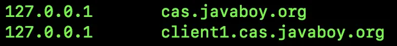
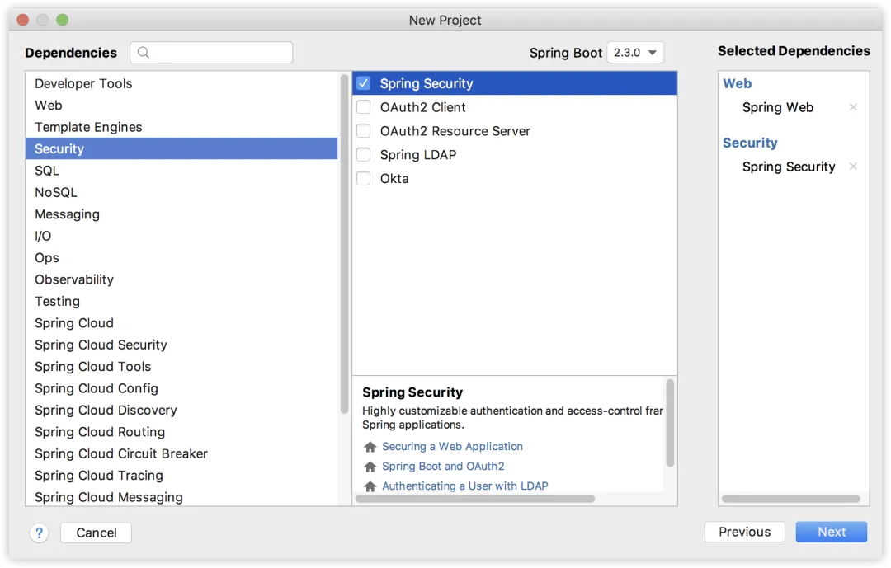

# 【SpringSecurity系列（二十四）】SpringBoot+CAS单点登录

Original 江南一点雨 [江南一点雨](javascript:void(0);) *2021年07月02日 10:36*

《深入浅出Spring Security》一书已由清华大学出版社正式出版发行，感兴趣的小伙伴戳这里[->->>深入浅出Spring Security](https://mp.weixin.qq.com/s?__biz=MzI1NDY0MTkzNQ==&mid=2247492459&idx=1&sn=a3ffb25873c0905b8862fcb8334a68e7&scene=21#wechat_redirect)，一本书学会 Spring Security。

<iframe src="https://file.daihuo.qq.com/mp_cps_goods_card/v112/index.html" frameborder="0" scrolling="no" class="iframe_ad_container" style="width: 656.989px; height: 0px; border: none; box-sizing: border-box; display: block;"></iframe>


------

前面松哥发过两篇文章，也是两种方案，讲到单点登录问题：

- [OAuth2+JWT 方案](https://mp.weixin.qq.com/s?__biz=MzI1NDY0MTkzNQ==&mid=2247488267&idx=2&sn=0ac88e1685ef0915e71eb3c223bd732f&scene=21#wechat_redirect)
- [@EnableOAuth2Sso 注解方案](https://mp.weixin.qq.com/s?__biz=MzI1NDY0MTkzNQ==&mid=2247488278&idx=1&sn=b21345a1daa86dd48ea89cdb9138def8&scene=21#wechat_redirect)

今天再来和大家介绍第三种方案，使用 Spring Security 开发 CAS 单点登录系统客户端。

[上篇文章](https://mp.weixin.qq.com/s?__biz=MzI1NDY0MTkzNQ==&mid=2247488872&idx=1&sn=3ac483e2e4b58b9940e1aa5458baddd8&scene=21#wechat_redirect)讲了 CAS 单点登录以及 CAS Server 的搭建问题，CAS Server 搭建好了，接下来我们要搭建具体的应用，本文我们就来看看 Spring Security+CAS 如何实现单点登录。

本文在[上篇文章](https://mp.weixin.qq.com/s?__biz=MzI1NDY0MTkzNQ==&mid=2247488872&idx=1&sn=3ac483e2e4b58b9940e1aa5458baddd8&scene=21#wechat_redirect)的基础上继续完成，如果小伙伴们的 CAS Server 还没搭建成功，可以参考[上篇文章](https://mp.weixin.qq.com/s?__biz=MzI1NDY0MTkzNQ==&mid=2247488872&idx=1&sn=3ac483e2e4b58b9940e1aa5458baddd8&scene=21#wechat_redirect)。

本文是 Spring Security 系列第 24 篇，阅读本系列前面文章有助于更好的理解本文：

1. [【SpringSecurity系列（一）】初识 Spring Security](https://mp.weixin.qq.com/s?__biz=MzI1NDY0MTkzNQ==&mid=2247492925&idx=2&sn=b3b8943bce05e97d4f84d92002dd6571&scene=21#wechat_redirect)
2. [【SpringSecurity系列（二）】Spring Security入门](https://mp.weixin.qq.com/s?__biz=MzI1NDY0MTkzNQ==&mid=2247493000&idx=2&sn=3d2862565e0f22968f1685199c6bdb87&scene=21#wechat_redirect)
3. [【SpringSecurity系列（三）】定制表单登录](https://mp.weixin.qq.com/s?__biz=MzI1NDY0MTkzNQ==&mid=2247493036&idx=2&sn=0a0356f4724830eb136d673c289437b6&scene=21#wechat_redirect)
4. [【SpringSecurity系列（四）】登录成功返回JSON数据](https://mp.weixin.qq.com/s?__biz=MzI1NDY0MTkzNQ==&mid=2247493044&idx=2&sn=e7a4f0fd826eeffffdb503cc2316bc50&scene=21#wechat_redirect)
5. [【SpringSecurity系列（五）】授权入门](https://mp.weixin.qq.com/s?__biz=MzI1NDY0MTkzNQ==&mid=2247493062&idx=2&sn=1480de83f67c3049e7efcc1cce21a918&scene=21#wechat_redirect)
6. [【SpringSecurity系列（六）】自定义登录用户](https://mp.weixin.qq.com/s?__biz=MzI1NDY0MTkzNQ==&mid=2247493130&idx=2&sn=7dff1f444fc652c23267a1ba89ea11d2&scene=21#wechat_redirect)
7. [【SpringSecurity系列（七）】通过 Spring Data Jpa 持久化用户数据](https://mp.weixin.qq.com/s?__biz=MzI1NDY0MTkzNQ==&mid=2247493175&idx=2&sn=55ab518981e7952137c0c247205eb6a3&scene=21#wechat_redirect)
8. [【SpringSecurity系列（八）】用户还能自动登录？](https://mp.weixin.qq.com/s?__biz=MzI1NDY0MTkzNQ==&mid=2247493198&idx=2&sn=a6362d7264bd50a35b5cc46ddbd334b0&scene=21#wechat_redirect)
9. [【SpringSecurity系列（九）】降低 RememberMe 的安全风险](https://mp.weixin.qq.com/s?__biz=MzI1NDY0MTkzNQ==&mid=2247493226&idx=2&sn=1ad5066cc96b6f2a7f05714693cb0aa0&scene=21#wechat_redirect)
10. [在微服务项目中，Spring Security 比 Shiro 强在哪？](https://mp.weixin.qq.com/s?__biz=MzI1NDY0MTkzNQ==&mid=2247488312&idx=1&sn=61e67f7ca0f8a55749dcb064b9456a38&scene=21#wechat_redirect)
11. [【SpringSecurity系列（十一）】自定义认证逻辑](https://mp.weixin.qq.com/s?__biz=MzI1NDY0MTkzNQ==&mid=2247493279&idx=2&sn=7c89d5a454487174a9ab86d6788b0c34&scene=21#wechat_redirect)
12. [【SpringSecurity系列（十二）】查看登录详情](https://mp.weixin.qq.com/s?__biz=MzI1NDY0MTkzNQ==&mid=2247493346&idx=2&sn=11f66f1851ad8e5101cb788c709519a1&scene=21#wechat_redirect)
13. [【SpringSecurity系列（十三）】只允许一台设备在线](https://mp.weixin.qq.com/s?__biz=MzI1NDY0MTkzNQ==&mid=2247493361&idx=2&sn=4c1a841c7cfa88e6d092274b6bec5556&scene=21#wechat_redirect)
14. [【SpringSecurity系列（十四）】自动踢掉上一个登录用户](https://mp.weixin.qq.com/s?__biz=MzI1NDY0MTkzNQ==&mid=2247493382&idx=2&sn=294bfe14613d5f97e817ee3612c6cf8c&scene=21#wechat_redirect)
15. [【SpringSecurity系列（十五）】请求防火墙默认已开启](https://mp.weixin.qq.com/s?__biz=MzI1NDY0MTkzNQ==&mid=2247493432&idx=2&sn=d13c83bd0d5577b47aa8d78561de8ead&scene=21#wechat_redirect)
16. [【SpringSecurity系列（十六）】会话固定攻击与防御](https://mp.weixin.qq.com/s?__biz=MzI1NDY0MTkzNQ==&mid=2247493486&idx=2&sn=2935be18e5fd8b3e3043cfad5dce5a35&scene=21#wechat_redirect)
17. [【SpringSecurity系列（十七）】Spring Security 如何处理 Session 共享](https://mp.weixin.qq.com/s?__biz=MzI1NDY0MTkzNQ==&mid=2247493552&idx=2&sn=76eb35d59aea46f0f7095314f7d988a0&scene=21#wechat_redirect)
18. [【SpringSecurity系列（十八）】SpringBoot 如何防御 CSRF 攻击？](https://mp.weixin.qq.com/s?__biz=MzI1NDY0MTkzNQ==&mid=2247493615&idx=2&sn=dc132cfc80e07b709312a2567ec93678&scene=21#wechat_redirect)
19. [【SpringSecurity系列（十九）】Spring Security 中 CSRF 防御源码解析](https://mp.weixin.qq.com/s?__biz=MzI1NDY0MTkzNQ==&mid=2247493641&idx=2&sn=5412022deeeef2b55edec9241d5fda0d&scene=21#wechat_redirect)
20. [【SpringSecurity系列（二十）】密码加密的两种姿势](https://mp.weixin.qq.com/s?__biz=MzI1NDY0MTkzNQ==&mid=2247493759&idx=2&sn=14b4db11a1c0bcc3c2d53e3e7fb5a3c1&scene=21#wechat_redirect)
21. [【SpringSecurity系列（二十一）】Spring Security 怎么学？为什么一定需要系统学习？](https://mp.weixin.qq.com/s?__biz=MzI1NDY0MTkzNQ==&mid=2247493854&idx=2&sn=2fe65a75e6f4b2fdb96d4d117a0a53bd&scene=21#wechat_redirect)
22. [【SpringSecurity系列（二十二）】Spring Security 两种资源放行策略，千万别用错了！](https://mp.weixin.qq.com/s?__biz=MzI1NDY0MTkzNQ==&mid=2247493888&idx=2&sn=d05047d7943387cfc28bd5128bb08744&scene=21#wechat_redirect)
23. [【SpringSecurity系列（二十三）】手把手教你入门 Spring Boot + CAS 单点登录](https://mp.weixin.qq.com/s?__biz=MzI1NDY0MTkzNQ==&mid=2247493947&idx=2&sn=041e9d4280eb1984d922106f0e876233&scene=21#wechat_redirect)

## 1.准备工作

准备工作主要做两件事。

### 1.1 服务记录

某一个 Client 需要接入 CAS Server 进行验证，则该 Client 必须提前在 CAS Server 上配置其信息。

这个信息既可以动态添加，也可以通过 JSON 来配置，后面松哥会教搭建如何动态添加，这里方便起见，我们还是通过 JSON 来进行配置。

具体配置方式如下，在 CAS Server 中创建如下目录：

```
src/main/resources/services
```

在该目录下创建一个名为 client1-99.json 的文件，client1 表示要接入的 client 的名字，99 表示要接入的 client 的 id，json 文件内容如下（这个配置可以参考官方给出的模版：overlays/org.apereo.cas.cas-server-webapp-tomcat-5.3.14/WEB-INF/classes/services/Apereo-10000002.json）：

```
{
  "@class": "org.apereo.cas.services.RegexRegisteredService",
  "serviceId": "^(https|http)://.*",
  "name": "client1",
  "id": 99,
  "description": "应用1 的定义信息",
  "evaluationOrder": 1
}
```

这段 JSON 配置含义如下：

1. @calss 指定注册服务类，这个是固定的org.apereo.cas.services.RegexRegisteredService。
2. serviceId 则通过正则表达式用来匹配具体的请求。
3. name 是接入的 client 的名称。
4. id 是接入的 client 的 id。
5. description 是接入的 client 的描述信息。
6. evaluationOrder 则指定了执行的优先级。

接下来再在 src/main/resources/application.properties 文件中配置刚刚 json 的信息，如下：

```
cas.serviceRegistry.json.location=classpath:/services
cas.serviceRegistry.initFromJson=true
```

这里有两行配置：

1. 指定配置 JSON 文件的位置。
2. 开启 JSON 识别。

OK，配置完成后，重启 CAS Server。

CAS Server 启动成功后，我们在控制台看到如下日志，表示 JSON 配置已经加载成功了：


### 1.2 JDK 证书

第二个要提前准备的东西就是 JDK 证书。

在实际开发中，这一步可以忽略，但是因为我们现在用的自己生成的 SSL 证书，所以我们要将自己生成的证书导入到 JDK 中，否则在使用 Spring Security 接入 CAS 单点登录时，会抛出如下错误：


将 SSL 证书导入 JDK 中的命令其实也很简单，两个步骤，第一个导出 `.cer` 文件，第二步，导入 JDK，命令如下：

```
keytool -export -trustcacerts -alias casserver -file ./cas.cer -keystore ./keystore
sudo keytool -import -trustcacerts -alias casserver -file ./cas.cer -keystore /Library/Java/JavaVirtualMachines/jdk-10.0.2.jdk/Contents/Home/lib/security/cacerts
```

注意，在执行 export 导出命令时，需要输入密钥口令，这个口令就是自己一开始创建 SSL 证书时设置的。在执行 import 导入命令时，也需要输入口令，这个口令是 changeit，注意，不是自己一开始设置的。

密钥库的位置在 JDK 目录下的 `/lib/security/cacerts`，小伙伴们根据自己实际情况来修改（在 JDK9 之前，位置在 `jre/lib/security/cacerts`）。

我们在本地测试一定要导入证书到 JDK 证书库中，否则后面的测试会出现上图中的错误，证书导入 JDK 证书库之后，要确保之后的开发中，使用的是本地的 JDK。

**注意，JDK 证书导入之后，CASServer 需要重启一下。**

### 1.3 修改 hosts

另外，我们还需要修改电脑 hosts 文件，因为前面关于 CAS Server，关于 SSL 证书的配置都涉及到域名，所以后面的访问我们将通过域名的形式访问，hosts 文件中添加如下两条记录：



第一个是 CAS Server 的请求域名，第二个是 CAS Client 的请求域名。

## 2.开发 Client

在使用 Spring Security 开发 CAS Client 之前，有一个基本问题需要先和小伙伴们捋清楚：用户登录是在 CAS Server 上登录，所以 Spring Security 中虽然依旧存在用户的概念，但是对于用户的处理逻辑会和前面的有所不同。

好了，接下来我们来看下具体步骤。

首先我们来创建一个普通的 Spring Boot 项目，加入 Web 依赖 和 Spring Security 依赖，如下：



项目创建成功后，我们再来手动加入 cas 依赖：

```
<dependency>
    <groupId>org.springframework.security</groupId>
    <artifactId>spring-security-cas</artifactId>
</dependency>
```

接下来，在 application.properties 中配置 CAS Server 和 CAS Client 的请求地址信息：

```
cas.server.prefix=https://cas.javaboy.org:8443/cas
cas.server.login=${cas.server.prefix}/login
cas.server.logout=${cas.server.prefix}/logout

cas.client.prefix=http://client1.cas.javaboy.org:8080
cas.client.login=${cas.client.prefix}/login/cas
cas.client.logoutRelative=/logout/cas
cas.client.logout=${cas.client.prefix}${cas.client.logoutRelative}
```

这些配置都是自定义配置，所以配置的 key 可以自己随意定义。至于配置的含义都好理解，分别配置了 CAS Server 和 CAS Client 的登录和注销地址。

配置好之后，我们需要将这些配置注入到实体类中使用，这里就用到了类型安全的属性绑定（参见：[Spring Boot2 系列教程(四)理解配置文件 application.properties ！](https://mp.weixin.qq.com/s?__biz=MzI1NDY0MTkzNQ==&mid=2247486427&idx=2&sn=91c4462d44f3866bc9ee4cc71feb4e89&scene=21#wechat_redirect)）。

这里我创建两个类分别用来接收 CAS Server 和 CAS Client 的配置文件：

```
@ConfigurationProperties(prefix = "cas.server")
public class CASServerProperties {
    private String prefix;
    private String login;
    private String logout;
    //省略 getter/setter
}
@ConfigurationProperties(prefix = "cas.client")
public class CASClientProperties {
    private String prefix;
    private String login;
    private String logoutRelative;
    private String logout;
    //省略 getter/setter
}
```

另外记得在启动类上面添加 `@ConfigurationPropertiesScan` 注解来扫描这两个配置类：

```
@SpringBootApplication
@ConfigurationPropertiesScan
public class Client1Application {

    public static void main(String[] args) {
        SpringApplication.run(Client1Application.class, args);
    }
}
```

这里配置完成后，我们一会将在配置文件中来使用。

接下来创建 CAS 的配置文件，略长：

```
@Configuration
public class CasSecurityConfig {
    @Autowired
    CASClientProperties casClientProperties;
    @Autowired
    CASServerProperties casServerProperties;
    @Autowired
    UserDetailsService userDetailService;

    @Bean
    ServiceProperties serviceProperties() {
        ServiceProperties serviceProperties = new ServiceProperties();
        serviceProperties.setService(casClientProperties.getLogin());
        return serviceProperties;
    }

    @Bean
    @Primary
    AuthenticationEntryPoint authenticationEntryPoint() {
        CasAuthenticationEntryPoint entryPoint = new CasAuthenticationEntryPoint();
        entryPoint.setLoginUrl(casServerProperties.getLogin());
        entryPoint.setServiceProperties(serviceProperties());
        return entryPoint;
    }

    @Bean
    TicketValidator ticketValidator() {
        return new Cas20ProxyTicketValidator(casServerProperties.getPrefix());
    }

    @Bean
    CasAuthenticationProvider casAuthenticationProvider() {
        CasAuthenticationProvider provider = new CasAuthenticationProvider();
        provider.setServiceProperties(serviceProperties());
        provider.setTicketValidator(ticketValidator());
        provider.setUserDetailsService(userDetailService);
        provider.setKey("javaboy");
        return provider;
    }

    @Bean
    CasAuthenticationFilter casAuthenticationFilter(AuthenticationProvider authenticationProvider) {
        CasAuthenticationFilter filter = new CasAuthenticationFilter();
        filter.setServiceProperties(serviceProperties());
        filter.setAuthenticationManager(new ProviderManager(authenticationProvider));
        return filter;
    }

    @Bean
    SingleSignOutFilter singleSignOutFilter() {
        SingleSignOutFilter sign = new SingleSignOutFilter();
        sign.setIgnoreInitConfiguration(true);
        return sign;
    }
    @Bean
    LogoutFilter logoutFilter() {
        LogoutFilter filter = new LogoutFilter(casServerProperties.getLogout(), new SecurityContextLogoutHandler());
        filter.setFilterProcessesUrl(casClientProperties.getLogoutRelative());
        return filter;
    }
}
```

这个配置文件略长，但是并不难，我来和大家挨个解释：

1. 首先一进来注入三个对象，这三个中，有两个是我们前面写的配置类的实例，另外一个则是 UserDetailsService，关于 UserDetailsService，我想我也不必多做解释，大家参考本系列前面的文章就知道 UserDetailsService 的作用（[Spring Security 如何将用户数据存入数据库？](https://mp.weixin.qq.com/s?__biz=MzI1NDY0MTkzNQ==&mid=2247488194&idx=1&sn=7103031896ba8b9d34095524b292265e&scene=21#wechat_redirect)），一会我会给出 UserDetailsService 的实现。
2. 接下来配置 ServiceProperties，ServiceProperties 中主要配置一下 Client 的登录地址即可，这个地址就是在 CAS Server 上登录成功后，重定向的地址。
3. CasAuthenticationEntryPoint 则是 CAS 验证的入口，这里首先设置 CAS Server 的登录地址，同时将前面的 ServiceProperties 设置进去，这样当它登录成功后，就知道往哪里跳转了。
4. TicketValidator 这是配置 ticket 校验地址，CAS Client 拿到 ticket 要去 CAS Server 上校验，默认校验地址是：https://cas.javaboy.org:8443/cas/proxyValidate?ticket=xxx
5. CasAuthenticationProvider 主要用来处理 CAS 验证逻辑，关于 AuthenticationProvider 松哥在前面的文章中和大家分享过（[SpringSecurity 自定义认证逻辑的两种方式(高级玩法)](https://mp.weixin.qq.com/s?__biz=MzI1NDY0MTkzNQ==&mid=2247488364&idx=1&sn=fd69d3f218e0b4ab4bad96ec623f5a33&scene=21#wechat_redirect)），当时就说，想要自定义认证逻辑，如短信登录等，都可以通过扩展 AuthenticationProvider 来实现，这里的 CAS 登录当然也不例外，这里虽然设置了一个 userDetailService，但是目的不是为了从数据库中查询数据做校验，因为登录是在 CAS Server 中进行的，这个的作用，我在后面会做介绍。
6. CasAuthenticationFilter 则是 CAS 认证的过滤器，过滤器将请求拦截下来之后，交由 CasAuthenticationProvider 来做具体处理。
7. SingleSignOutFilter 表示接受 CAS Server 发出的注销请求，所有的注销请求都将从 CAS Client 转发到 CAS Server，CAS Server 处理完后，会通知所有的 CAS Client 注销登录。
8. LogoutFilter 则是配置将注销请求转发到 CAS Server。

接下来我再来给大家看下我定义的 UserDetailsService：

```
@Component
@Primary
public class UserDetailsServiceImpl implements UserDetailsService{

    @Override
    public UserDetails loadUserByUsername(String s) throws UsernameNotFoundException {
        return new User(s, "123", true, true, true, true,
                AuthorityUtils.createAuthorityList("ROLE_user"));
    }
}
```

既然是单点登录，也就是用户是在 CAS Server 上登录的，这里的 UserDetailsService 意义在哪里呢？

用户虽然在 CAS Server 上登录，但是，登录成功之后，CAS Client 还是要获取用户的基本信息、角色等，以便做进一步的权限控制，所以，这里的 loadUserByUsername 方法中的参数，实际上就是你从 CAS Server 上登录成功后获取到的用户名，拿着这个用户名，去数据库中查询用户的相关信心并返回，方便 CAS Client 在后续的鉴权中做进一步的使用，这里我为了方便，就没有去数据库中查询了，而是直接创建了一个 User 对象返回。

接下来，我们再来看看 Spring Security 的配置：

```
@Configuration
public class SecurityConfig extends WebSecurityConfigurerAdapter {
    @Autowired
    AuthenticationEntryPoint authenticationEntryPoint;
    @Autowired
    AuthenticationProvider authenticationProvider;
    @Autowired
    SingleSignOutFilter singleSignOutFilter;
    @Autowired
    LogoutFilter logoutFilter;
    @Autowired
    CasAuthenticationFilter casAuthenticationFilter;

    @Override
    protected void configure(AuthenticationManagerBuilder auth) throws Exception {
        auth.authenticationProvider(authenticationProvider);
    }

    @Override
    protected void configure(HttpSecurity http) throws Exception {
        http.authorizeRequests().antMatchers("/user/**")
                .hasRole("user")
                .antMatchers("/login/cas").permitAll()
                .anyRequest().authenticated()
                .and()
                .exceptionHandling()
                .authenticationEntryPoint(authenticationEntryPoint)
                .and()
                .addFilter(casAuthenticationFilter)
                .addFilterBefore(singleSignOutFilter, CasAuthenticationFilter.class)
                .addFilterBefore(logoutFilter, LogoutFilter.class);
    }
}
```

这里的配置就简单很多了：

1. 首先配置 authenticationProvider，这个 authenticationProvider 实际上就是一开始配置的 CasAuthenticationProvider。
2. 接下来配置 `/user/**` 格式的路径需要有 user 角色才能访问，登录路径 `/login/cas` 可以直接访问，剩余接口都是登录成功之后才能访问。
3. 最后把 authenticationEntryPoint 配置进来，再把自定义的过滤器加进来，这些都比较容易我就不多说了。

最后，再提供两个测试接口：

```
@RestController
public class HelloController {
    @GetMapping("/hello")
    public String hello() {
        return "hello";
    }
    @GetMapping("/user/hello")
    public String user() {
        return "user";
    }
}
```

OK ，如此之后，我们的 CAS Client 现在就开发完成了，接下来启动 CAS Client，启动成功后，浏览器输入 `http://client1.cas.javaboy.org:8080/user/hello` 访问 hello 接口，此时会自动跳转到 CAS Server 上登录，登录成功之后，经过两个重定向，会重新回到 hello 接口。

## 3.小结

OK，这就是松哥和大家介绍的 Spring Security + CAS 单点登录，当然，这个案例中还有很多需要完善的地方，松哥会在后面的文章中继续和大家分享完善的方案。

好了 ，本文就说到这里，本文相关案例我已经上传到 GitHub ，大家可以自行下载:https://github.com/lenve/spring-security-samples

好啦，小伙伴们如果觉得有收获，记得点个在看鼓励下松哥哦～


加微信进群


一起切磋Web安全

（已添加松哥微信的小伙伴请勿重复添加）

SpringSecurity38

SpringSecurity · 目录


上一篇WebFlux 和 Spring Security 会碰出哪些火花？下一篇【SpringSecurity系列（二十五）】CAS 单点登录对接数据库


# 