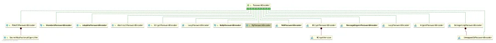

# 【SpringSecurity系列（二十）】密码加密的两种姿势

Original 江南一点雨 [江南一点雨](javascript:void(0);) *2021年06月15日 10:36*

《深入浅出Spring Security》一书已由清华大学出版社正式出版发行，感兴趣的小伙伴戳这里[->->>深入浅出Spring Security](https://mp.weixin.qq.com/s?__biz=MzI1NDY0MTkzNQ==&mid=2247492459&idx=1&sn=a3ffb25873c0905b8862fcb8334a68e7&scene=21#wechat_redirect)，一本书学会 Spring Security。

<iframe src="https://file.daihuo.qq.com/mp_cps_goods_card/v112/index.html" frameborder="0" scrolling="no" class="iframe_ad_container" style="width: 656.989px; height: 0px; border: none; box-sizing: border-box; display: block;"></iframe>


------

先说一句：密码是无法解密的。大家也不要再问松哥微人事项目中的密码怎么解密了！

密码无法解密，还是为了确保系统安全。今天松哥就来和大家聊一聊，密码要如何处理，才能在最大程度上确保我们的系统安全。

本文是 Spring Security 系列的第 20 篇，阅读本系列前面的文章有助于更好的理解本文：

1. [【SpringSecurity系列（一）】初识 Spring Security](https://mp.weixin.qq.com/s?__biz=MzI1NDY0MTkzNQ==&mid=2247492925&idx=2&sn=b3b8943bce05e97d4f84d92002dd6571&scene=21#wechat_redirect)
2. [【SpringSecurity系列（二）】Spring Security入门](https://mp.weixin.qq.com/s?__biz=MzI1NDY0MTkzNQ==&mid=2247493000&idx=2&sn=3d2862565e0f22968f1685199c6bdb87&scene=21#wechat_redirect)
3. [【SpringSecurity系列（三）】定制表单登录](https://mp.weixin.qq.com/s?__biz=MzI1NDY0MTkzNQ==&mid=2247493036&idx=2&sn=0a0356f4724830eb136d673c289437b6&scene=21#wechat_redirect)
4. [【SpringSecurity系列（四）】登录成功返回JSON数据](https://mp.weixin.qq.com/s?__biz=MzI1NDY0MTkzNQ==&mid=2247493044&idx=2&sn=e7a4f0fd826eeffffdb503cc2316bc50&scene=21#wechat_redirect)
5. [【SpringSecurity系列（五）】授权入门](https://mp.weixin.qq.com/s?__biz=MzI1NDY0MTkzNQ==&mid=2247493062&idx=2&sn=1480de83f67c3049e7efcc1cce21a918&scene=21#wechat_redirect)
6. [【SpringSecurity系列（六）】自定义登录用户](https://mp.weixin.qq.com/s?__biz=MzI1NDY0MTkzNQ==&mid=2247493130&idx=2&sn=7dff1f444fc652c23267a1ba89ea11d2&scene=21#wechat_redirect)
7. [【SpringSecurity系列（七）】通过 Spring Data Jpa 持久化用户数据](https://mp.weixin.qq.com/s?__biz=MzI1NDY0MTkzNQ==&mid=2247493175&idx=2&sn=55ab518981e7952137c0c247205eb6a3&scene=21#wechat_redirect)
8. [【SpringSecurity系列（八）】用户还能自动登录？](https://mp.weixin.qq.com/s?__biz=MzI1NDY0MTkzNQ==&mid=2247493198&idx=2&sn=a6362d7264bd50a35b5cc46ddbd334b0&scene=21#wechat_redirect)
9. [【SpringSecurity系列（九）】降低 RememberMe 的安全风险](https://mp.weixin.qq.com/s?__biz=MzI1NDY0MTkzNQ==&mid=2247493226&idx=2&sn=1ad5066cc96b6f2a7f05714693cb0aa0&scene=21#wechat_redirect)
10. [在微服务项目中，Spring Security 比 Shiro 强在哪？](https://mp.weixin.qq.com/s?__biz=MzI1NDY0MTkzNQ==&mid=2247488312&idx=1&sn=61e67f7ca0f8a55749dcb064b9456a38&scene=21#wechat_redirect)
11. [【SpringSecurity系列（十一）】自定义认证逻辑](https://mp.weixin.qq.com/s?__biz=MzI1NDY0MTkzNQ==&mid=2247493279&idx=2&sn=7c89d5a454487174a9ab86d6788b0c34&scene=21#wechat_redirect)
12. [【SpringSecurity系列（十二）】查看登录详情](https://mp.weixin.qq.com/s?__biz=MzI1NDY0MTkzNQ==&mid=2247493346&idx=2&sn=11f66f1851ad8e5101cb788c709519a1&scene=21#wechat_redirect)
13. [【SpringSecurity系列（十三）】只允许一台设备在线](https://mp.weixin.qq.com/s?__biz=MzI1NDY0MTkzNQ==&mid=2247493361&idx=2&sn=4c1a841c7cfa88e6d092274b6bec5556&scene=21#wechat_redirect)
14. [【SpringSecurity系列（十四）】自动踢掉上一个登录用户](https://mp.weixin.qq.com/s?__biz=MzI1NDY0MTkzNQ==&mid=2247493382&idx=2&sn=294bfe14613d5f97e817ee3612c6cf8c&scene=21#wechat_redirect)
15. [【SpringSecurity系列（十五）】请求防火墙默认已开启](https://mp.weixin.qq.com/s?__biz=MzI1NDY0MTkzNQ==&mid=2247493432&idx=2&sn=d13c83bd0d5577b47aa8d78561de8ead&scene=21#wechat_redirect)
16. [【SpringSecurity系列（十六）】会话固定攻击与防御](https://mp.weixin.qq.com/s?__biz=MzI1NDY0MTkzNQ==&mid=2247493486&idx=2&sn=2935be18e5fd8b3e3043cfad5dce5a35&scene=21#wechat_redirect)
17. [【SpringSecurity系列（十七）】Spring Security 如何处理 Session 共享](https://mp.weixin.qq.com/s?__biz=MzI1NDY0MTkzNQ==&mid=2247493552&idx=2&sn=76eb35d59aea46f0f7095314f7d988a0&scene=21#wechat_redirect)
18. [【SpringSecurity系列（十八）】SpringBoot 如何防御 CSRF 攻击？](https://mp.weixin.qq.com/s?__biz=MzI1NDY0MTkzNQ==&mid=2247493615&idx=2&sn=dc132cfc80e07b709312a2567ec93678&scene=21#wechat_redirect)
19. [【SpringSecurity系列（十九）】Spring Security 中 CSRF 防御源码解析](https://mp.weixin.qq.com/s?__biz=MzI1NDY0MTkzNQ==&mid=2247493641&idx=2&sn=5412022deeeef2b55edec9241d5fda0d&scene=21#wechat_redirect)

## 1.为什么要加密

2011 年 12 月 21 日，有人在网络上公开了一个包含 600 万个 CSDN 用户资料的数据库，数据全部为明文储存，包含用户名、密码以及注册邮箱。事件发生后 CSDN 在微博、官方网站等渠道发出了声明，解释说此数据库系 2009 年备份所用，因不明原因泄露，已经向警方报案，后又在官网发出了公开道歉信。在接下来的十多天里，金山、网易、京东、当当、新浪等多家公司被卷入到这次事件中。整个事件中最触目惊心的莫过于 CSDN 把用户密码明文存储，由于很多用户是多个网站共用一个密码，因此一个网站密码泄露就会造成很大的安全隐患。由于有了这么多前车之鉴，我们现在做系统时，密码都要加密处理。

这次泄密，也留下了一些有趣的事情，特别是对于广大程序员设置密码这一项。人们从 CSDN 泄密的文件中，发现了一些好玩的密码，例如如下这些：

- `ppnn13%dkstFeb.1st` 这段密码的中文解析是：娉娉袅袅十三余，豆蔻梢头二月初。
- `csbt34.ydhl12s` 这段密码的中文解析是：池上碧苔三四点，叶底黄鹂一两声
- ...

等等不一而足，你会发现很多程序员的人文素养还是非常高的，让人啧啧称奇。

## 2.加密方案

密码加密我们一般会用到散列函数，又称散列算法、哈希函数，这是一种从任何数据中创建数字“指纹”的方法。

散列函数把消息或数据压缩成摘要，使得数据量变小，将数据的格式固定下来，然后将数据打乱混合，重新创建一个散列值。散列值通常用一个短的随机字母和数字组成的字符串来代表。好的散列函数在输入域中很少出现散列冲突。在散列表和数据处理中，不抑制冲突来区别数据，会使得数据库记录更难找到。

我们常用的散列函数有 MD5 消息摘要算法、安全散列算法（Secure Hash Algorithm）。

但是仅仅使用散列函数还不够，单纯的只使用散列函数，如果两个用户密码明文相同，生成的密文也会相同，这样就增加的密码泄漏的风险。

为了增加密码的安全性，一般在密码加密过程中还需要加盐，所谓的盐可以是一个随机数也可以是用户名，加盐之后，即使密码明文相同的用户生成的密码密文也不相同，这可以极大的提高密码的安全性。

传统的加盐方式需要在数据库中有专门的字段来记录盐值，这个字段可能是用户名字段（因为用户名唯一），也可能是一个专门记录盐值的字段，这样的配置比较繁琐。

Spring Security 提供了多种密码加密方案，官方推荐使用 BCryptPasswordEncoder，BCryptPasswordEncoder 使用 BCrypt 强哈希函数，开发者在使用时可以选择提供 strength 和 SecureRandom 实例。strength 越大，密钥的迭代次数越多，密钥迭代次数为 2^strength。strength 取值在 4~31 之间，默认为 10。

不同于 Shiro 中需要自己处理密码加盐，在 Spring Security 中，BCryptPasswordEncoder 就自带了盐，处理起来非常方便。

## 3.实践

### 3.1 codec 加密

commons-codec 是一个 Apache 上的开源项目，用它可以方便的实现密码加密。松哥在 `V 部落` 项目中就是采用的这种方案（https://github.com/lenve/VBlog）。在 Spring Security 还未推出 BCryptPasswordEncoder 的时候，commons-codec 还是一个比较常见的解决方案。

所以，这里我先来给大家介绍下 commons-codec 的用法。

首先我们需要引入 commons-codec 的依赖：

```
<dependency>
 <groupId>commons-codec</groupId>
 <artifactId>commons-codec</artifactId>
 <version>1.11</version>
</dependency>
```

然后自定义一个 PasswordEncoder：

```
@Component
public class MyPasswordEncoder implements PasswordEncoder {
    @Override
    public String encode(CharSequence rawPassword) {
        return DigestUtils.md5DigestAsHex(rawPassword.toString().getBytes());
    }

    @Override
    public boolean matches(CharSequence rawPassword, String encodedPassword) {
        return encodedPassword.equals(DigestUtils.md5DigestAsHex(rawPassword.toString().getBytes()));
    }
}
```

在 Spring Security 中，PasswordEncoder 专门用来处理密码的加密与比对工作，我们自定义 MyPasswordEncoder 并实现 PasswordEncoder 接口，还需要实现该接口中的两个方法：

1. encode 方法表示对密码进行加密，参数 rawPassword 就是你传入的明文密码，返回的则是加密之后的密文，这里的加密方案采用了 MD5。
2. matches 方法表示对密码进行比对，参数 rawPassword 相当于是用户登录时传入的密码，encodedPassword 则相当于是加密后的密码（从数据库中查询而来）。

最后记得将 MyPasswordEncoder 通过 @Component 注解标记为 Spring 容器中的一个组件。

这样用户在登录时，就会自动调用 matches 方法进行密码比对。

当然，使用了 MyPasswordEncoder 之后，在用户注册时，就需要将密码加密之后存入数据库中，方式如下：

```
public int reg(User user) {
    ...
    //插入用户,插入之前先对密码进行加密
    user.setPassword(passwordEncoder.encode(user.getPassword()));
    result = userMapper.reg(user);
    ...
}
```

其实很简单，就是调用 encode 方法对密码进行加密。完整代码大家可以参考 V 部落（https://github.com/lenve/VBlog），我这里就不赘述了。

### 3.2 BCryptPasswordEncoder 加密

但是自己定义 PasswordEncoder 还是有些麻烦，特别是处理密码加盐问题的时候。

所以在 Spring Security 中提供了 BCryptPasswordEncoder，使得密码加密加盐变得非常容易。只需要提供 BCryptPasswordEncoder 这个 Bean 的实例即可，微人事就是采用了这种方案（https://github.com/lenve/vhr），如下：

```
@Bean
PasswordEncoder passwordEncoder() {
    return new BCryptPasswordEncoder(10);
}
```

创建 BCryptPasswordEncoder 时传入的参数 10 就是 strength，即密钥的迭代次数（也可以不配置，默认为 10）。同时，配置的内存用户的密码也不再是 123 了，如下：

```
auth.inMemoryAuthentication()
.withUser("admin")
.password("$2a$10$RMuFXGQ5AtH4wOvkUqyvuecpqUSeoxZYqilXzbz50dceRsga.WYiq")
.roles("ADMIN", "USER")
.and()
.withUser("sang")
.password("$2a$10$eUHbAOMq4bpxTvOVz33LIehLe3fu6NwqC9tdOcxJXEhyZ4simqXTC")
.roles("USER");
```

这里的密码就是使用 BCryptPasswordEncoder 加密后的密码，虽然 admin 和 sang 加密后的密码不一样，但是明文都是 123。配置完成后，使用 admin/123 或者 sang/123 就可以实现登录。

本案例使用了配置在内存中的用户，一般情况下，用户信息是存储在数据库中的，因此需要在用户注册时对密码进行加密处理，如下：

```
@Service
public class RegService {
    public int reg(String username, String password) {
        BCryptPasswordEncoder encoder = new BCryptPasswordEncoder(10);
        String encodePasswod = encoder.encode(password);
        return saveToDb(username, encodePasswod);
    }
}
```

用户将密码从前端传来之后，通过调用 BCryptPasswordEncoder 实例中的 encode 方法对密码进行加密处理，加密完成后将密文存入数据库。

## 4.源码浅析

最后我们再来稍微看一下 PasswordEncoder。

PasswordEncoder 是一个接口，里边只有三个方法：

```
public interface PasswordEncoder {
 String encode(CharSequence rawPassword);
 boolean matches(CharSequence rawPassword, String encodedPassword);
 default boolean upgradeEncoding(String encodedPassword) {
  return false;
 }
}
```

- encode 方法用来对密码进行加密。
- matches 方法用来对密码进行比对。
- upgradeEncoding 表示是否需要对密码进行再次加密以使得密码更加安全，默认为 false。

Spring Security 为 PasswordEncoder 提供了很多实现：



但是老实说，自从有了 BCryptPasswordEncoder，我们很少关注其他实现类了。

PasswordEncoder 中的 encode 方法，是我们在用户注册的时候手动调用。

matches 方法，则是由系统调用，默认是在 DaoAuthenticationProvider#additionalAuthenticationChecks 方法中调用的。

```
protected void additionalAuthenticationChecks(UserDetails userDetails,
  UsernamePasswordAuthenticationToken authentication)
  throws AuthenticationException {
 if (authentication.getCredentials() == null) {
  logger.debug("Authentication failed: no credentials provided");
  throw new BadCredentialsException(messages.getMessage(
    "AbstractUserDetailsAuthenticationProvider.badCredentials",
    "Bad credentials"));
 }
 String presentedPassword = authentication.getCredentials().toString();
 if (!passwordEncoder.matches(presentedPassword, userDetails.getPassword())) {
  logger.debug("Authentication failed: password does not match stored value");
  throw new BadCredentialsException(messages.getMessage(
    "AbstractUserDetailsAuthenticationProvider.badCredentials",
    "Bad credentials"));
 }
}
```

可以看到，密码比对就是通过 passwordEncoder.matches 方法来进行的。

关于 DaoAuthenticationProvider 的调用流程，大家可以参考 [SpringSecurity 自定义认证逻辑的两种方式(高级玩法)](https://mp.weixin.qq.com/s?__biz=MzI1NDY0MTkzNQ==&mid=2247488364&idx=1&sn=fd69d3f218e0b4ab4bad96ec623f5a33&scene=21#wechat_redirect)一文。

好了，今天就和小伙伴们简单聊一聊 Spring Security 加密问题，小伙伴们要是有收获记得点个在看鼓励下松哥哦～


加微信进群


一起切磋Web安全

（已添加松哥微信的小伙伴请勿重复添加）

SpringSecurity38

SpringSecurity · 目录


上一篇【SpringSecurity系列（十九）】Spring Security 中 CSRF 防御源码解析下一篇【SpringSecurity系列（二十）】Spring Security 怎么学？为什么一定需要系统学习？


# 