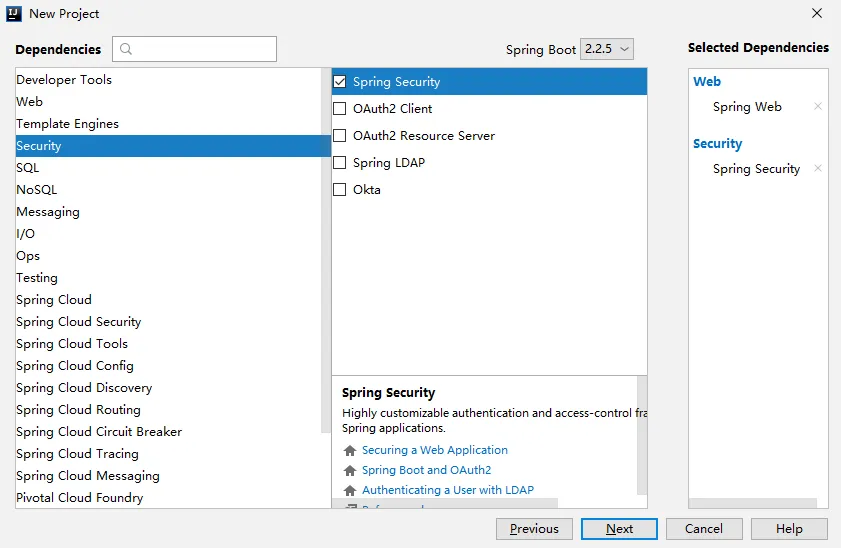
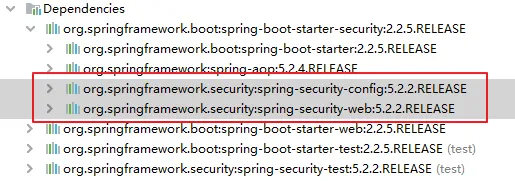
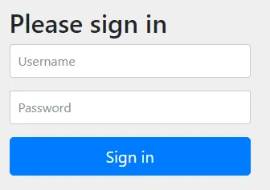
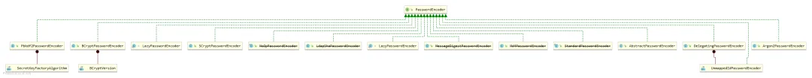
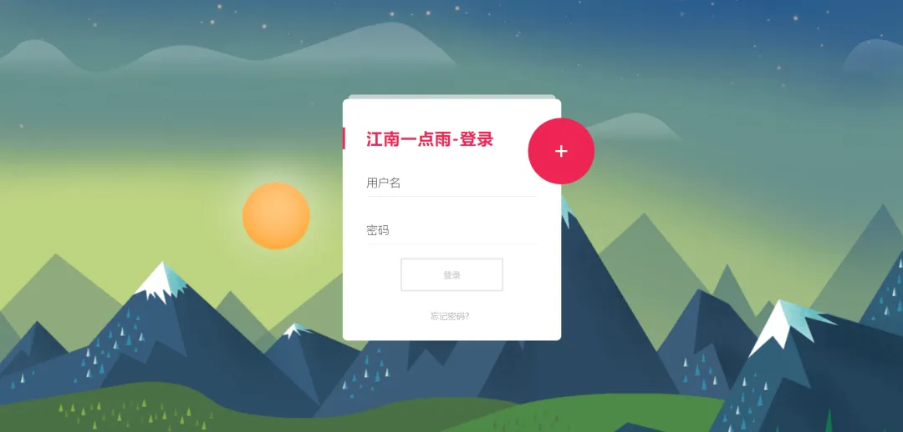
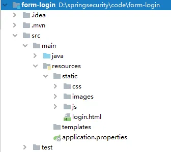

# 【SpringSecurity系列（二）】Spring Security入门

Original 江南一点雨 [江南一点雨](javascript:void(0);) *2021年04月12日 10:36*

**《深入浅出Spring Security》**一书已由清华大学出版社正式出版发行，感兴趣的小伙伴戳这里[->->>深入浅出Spring Security](https://mp.weixin.qq.com/s?__biz=MzI1NDY0MTkzNQ==&mid=2247492459&idx=1&sn=a3ffb25873c0905b8862fcb8334a68e7&scene=21#wechat_redirect)，一本书学会 Spring Security。

<iframe src="https://file.daihuo.qq.com/mp_cps_goods_card/v112/index.html" frameborder="0" scrolling="no" class="iframe_ad_container" style="width: 656.989px; height: 0px; border: none; box-sizing: border-box; display: block;"></iframe>


因

为之前有小伙伴在松哥群里讨论如何给微人事的密码解密，我看到聊天记录后就惊呆了。

无论如何我也得写一篇文章，带大家入门 Spring Security!当我们在一个项目中引入 Spring Security 相关依赖后，默认的就是表单登录，因此我们就从表单登录开始讲起。

Spring Security 初体验


<svg data-v-8b461723="" xmlns="http://www.w3.org/2000/svg" viewBox="0 0 2 2" width="4px" height="4px" class="border_filler border_filler_lefttop"><path data-v-8b461723="" d="M1.85.005A2 2 0 000 2V0h2z" fill="#ffffff" fill-rule="evenodd"></path></svg>

<svg data-v-8b461723="" xmlns="http://www.w3.org/2000/svg" viewBox="0 0 2 2" width="4px" height="4px" class="border_filler border_filler_righttop"><path data-v-8b461723="" d="M1.85.005A2 2 0 000 2V0h2z" fill="#ffffff" fill-rule="evenodd"></path></svg>

<svg data-v-8b461723="" xmlns="http://www.w3.org/2000/svg" viewBox="0 0 2 2" width="4px" height="4px" class="border_filler border_filler_rightbot"><path data-v-8b461723="" d="M1.85.005A2 2 0 000 2V0h2z" fill="#ffffff" fill-rule="evenodd"></path></svg>

<svg data-v-8b461723="" xmlns="http://www.w3.org/2000/svg" viewBox="0 0 2 2" width="4px" height="4px" class="border_filler border_filler_leftbot"><path data-v-8b461723="" d="M1.85.005A2 2 0 000 2V0h2z" fill="#ffffff" fill-rule="evenodd"></path></svg>


，时长08:08


通过 Java 类定义用户


<svg data-v-8b461723="" xmlns="http://www.w3.org/2000/svg" viewBox="0 0 2 2" width="4px" height="4px" class="border_filler border_filler_lefttop"><path data-v-8b461723="" d="M1.85.005A2 2 0 000 2V0h2z" fill="#ffffff" fill-rule="evenodd"></path></svg>

<svg data-v-8b461723="" xmlns="http://www.w3.org/2000/svg" viewBox="0 0 2 2" width="4px" height="4px" class="border_filler border_filler_righttop"><path data-v-8b461723="" d="M1.85.005A2 2 0 000 2V0h2z" fill="#ffffff" fill-rule="evenodd"></path></svg>

<svg data-v-8b461723="" xmlns="http://www.w3.org/2000/svg" viewBox="0 0 2 2" width="4px" height="4px" class="border_filler border_filler_rightbot"><path data-v-8b461723="" d="M1.85.005A2 2 0 000 2V0h2z" fill="#ffffff" fill-rule="evenodd"></path></svg>

<svg data-v-8b461723="" xmlns="http://www.w3.org/2000/svg" viewBox="0 0 2 2" width="4px" height="4px" class="border_filler border_filler_leftbot"><path data-v-8b461723="" d="M1.85.005A2 2 0 000 2V0h2z" fill="#ffffff" fill-rule="evenodd"></path></svg>


，时长07:08


自定义登录表单


<svg data-v-8b461723="" xmlns="http://www.w3.org/2000/svg" viewBox="0 0 2 2" width="4px" height="4px" class="border_filler border_filler_lefttop"><path data-v-8b461723="" d="M1.85.005A2 2 0 000 2V0h2z" fill="#ffffff" fill-rule="evenodd"></path></svg>

<svg data-v-8b461723="" xmlns="http://www.w3.org/2000/svg" viewBox="0 0 2 2" width="4px" height="4px" class="border_filler border_filler_righttop"><path data-v-8b461723="" d="M1.85.005A2 2 0 000 2V0h2z" fill="#ffffff" fill-rule="evenodd"></path></svg>

<svg data-v-8b461723="" xmlns="http://www.w3.org/2000/svg" viewBox="0 0 2 2" width="4px" height="4px" class="border_filler border_filler_rightbot"><path data-v-8b461723="" d="M1.85.005A2 2 0 000 2V0h2z" fill="#ffffff" fill-rule="evenodd"></path></svg>

<svg data-v-8b461723="" xmlns="http://www.w3.org/2000/svg" viewBox="0 0 2 2" width="4px" height="4px" class="border_filler border_filler_leftbot"><path data-v-8b461723="" d="M1.85.005A2 2 0 000 2V0h2z" fill="#ffffff" fill-rule="evenodd"></path></svg>


，时长05:53


视频看完了，如果小伙伴们觉得松哥的视频风格还能接受，也可以看看松哥自制的 [Spring Boot + Vue 系列视频教程](https://mp.weixin.qq.com/s?__biz=MzI1NDY0MTkzNQ==&mid=2247488059&idx=1&sn=2ef3e7f14d262130ecab94a0b17de0ca&scene=21#wechat_redirect)

以下是视频笔记。

## 1.新建项目

首先新建一个 Spring Boot 项目，创建时引入 Spring Security 依赖和 web 依赖，如下图：



项目创建成功后，Spring Security 的依赖就添加进来了，在 Spring Boot 中我们加入的是 `spring-boot-starter-security` ，其实主要是这两个：



项目创建成功后，我们添加一个测试的 HelloController，内容如下：

```
@RestController
public class HelloController {
    @GetMapping("/hello")
    public String hello() {
        return "hello";
    }
}
```

接下来什么事情都不用做，我们直接来启动项目。

在项目启动过程中，我们会看到如下一行日志：

```
Using generated security password: 30abfb1f-36e1-446a-a79b-f70024f589ab
```

这就是 Spring Security 为默认用户 user 生成的临时密码，是一个 UUID 字符串。

接下来我们去访问 `http://localhost:8080/hello` 接口，就可以看到自动重定向到登录页面了：



在登录页面，默认的用户名就是 user，默认的登录密码则是项目启动时控制台打印出来的密码，输入用户名密码之后，就登录成功了，登录成功后，我们就可以访问到 /hello 接口了。

在 Spring Security 中，默认的登录页面和登录接口，都是 `/login` ，只不过一个是 get 请求（登录页面），另一个是 post 请求（登录接口）。

大家可以看到，非常方便，一个依赖就保护了所有接口。

有人说，你怎么知道知道生成的默认密码是一个 UUID 呢？

这个其实很好判断。

和用户相关的自动化配置类在 `UserDetailsServiceAutoConfiguration` 里边，在该类的 `getOrDeducePassword` 方法中，我们看到如下一行日志：

```
if (user.isPasswordGenerated()) {
 logger.info(String.format("%n%nUsing generated security password: %s%n", user.getPassword()));
}
```

毫无疑问，我们在控制台看到的日志就是从这里打印出来的。打印的条件是 isPasswordGenerated 方法返回 true，即密码是默认生成的。

进而我们发现，user.getPassword 出现在 SecurityProperties 中，在 SecurityProperties 中我们看到如下定义：

```
/**
 * Default user name.
 */
private String name = "user";
/**
 * Password for the default user name.
 */
private String password = UUID.randomUUID().toString();
private boolean passwordGenerated = true;
```

可以看到，默认的用户名就是 user，默认的密码则是 UUID，而默认情况下，passwordGenerated 也为 true。

## 2.用户配置

默认的密码有一个问题就是每次重启项目都会变，这很不方便。

在正式介绍数据库连接之前，松哥先和大家介绍两种非主流的用户名/密码配置方案。

### 2.1 配置文件

我们可以在 application.properties 中配置默认的用户名密码。

怎么配置呢？大家还记得上一小节我们说的 SecurityProperties，默认的用户就定义在它里边，是一个静态内部类，我们如果要定义自己的用户名密码，必然是要去覆盖默认配置，我们先来看下 SecurityProperties 的定义：

```
@ConfigurationProperties(prefix = "spring.security")
public class SecurityProperties {
```

这就很清晰了，我们只需要以 spring.security.user 为前缀，去定义用户名密码即可：

```
spring.security.user.name=javaboy
spring.security.user.password=123
```

这就是我们新定义的用户名密码。

在 properties 中定义的用户名密码最终是通过 set 方法注入到属性中去的，这里我们顺便来看下 SecurityProperties.User#setPassword 方法:

```
public void setPassword(String password) {
 if (!StringUtils.hasLength(password)) {
  return;
 }
 this.passwordGenerated = false;
 this.password = password;
}
```

从这里我们可以看到，application.properties 中定义的密码在注入进来之后，还顺便设置了 passwordGenerated 属性为 false，这个属性设置为 false 之后，控制台就不会打印默认的密码了。

此时重启项目，就可以使用自己定义的用户名/密码登录了。

### 2.2 配置类

除了上面的配置文件这种方式之外，我们也可以在配置类中配置用户名/密码。

在配置类中配置，我们就要指定 PasswordEncoder 了，这是一个非常关键的东西。

考虑到有的小伙伴对于 PasswordEncoder 还不太熟悉，因此，我这里先稍微给大家介绍一下 PasswordEncoder 到底是干嘛用的。要说 PasswordEncoder ，就得先说密码加密。

#### 2.2.1 为什么要加密

2011 年 12 月 21 日，有人在网络上公开了一个包含 600 万个 CSDN 用户资料的数据库，数据全部为明文储存，包含用户名、密码以及注册邮箱。事件发生后 CSDN 在微博、官方网站等渠道发出了声明，解释说此数据库系 2009 年备份所用，因不明原因泄露，已经向警方报案，后又在官网发出了公开道歉信。在接下来的十多天里，金山、网易、京东、当当、新浪等多家公司被卷入到这次事件中。整个事件中最触目惊心的莫过于 CSDN 把用户密码明文存储，由于很多用户是多个网站共用一个密码，因此一个网站密码泄露就会造成很大的安全隐患。由于有了这么多前车之鉴，我们现在做系统时，密码都要加密处理。

这次泄密，也留下了一些有趣的事情，特别是对于广大程序员设置密码这一项。人们从 CSDN 泄密的文件中，发现了一些好玩的密码，例如如下这些：

- `ppnn13%dkstFeb.1st` 这段密码的中文解析是：娉娉袅袅十三余，豆蔻梢头二月初。
- `csbt34.ydhl12s` 这段密码的中文解析是：池上碧苔三四点，叶底黄鹂一两声
- ...

等等不一而足，你会发现很多程序员的人文素养还是非常高的，让人啧啧称奇。

#### 2.2.2 加密方案

密码加密我们一般会用到散列函数，又称散列算法、哈希函数，这是一种从任何数据中创建数字“指纹”的方法。散列函数把消息或数据压缩成摘要，使得数据量变小，将数据的格式固定下来，然后将数据打乱混合，重新创建一个散列值。散列值通常用一个短的随机字母和数字组成的字符串来代表。好的散列函数在输入域中很少出现散列冲突。在散列表和数据处理中，不抑制冲突来区别数据，会使得数据库记录更难找到。我们常用的散列函数有 MD5 消息摘要算法、安全散列算法（Secure Hash Algorithm）。

但是仅仅使用散列函数还不够，为了增加密码的安全性，一般在密码加密过程中还需要加盐，所谓的盐可以是一个随机数也可以是用户名，加盐之后，即使密码明文相同的用户生成的密码密文也不相同，这可以极大的提高密码的安全性。但是传统的加盐方式需要在数据库中有专门的字段来记录盐值，这个字段可能是用户名字段（因为用户名唯一），也可能是一个专门记录盐值的字段，这样的配置比较繁琐。

Spring Security 提供了多种密码加密方案，官方推荐使用 BCryptPasswordEncoder，BCryptPasswordEncoder 使用 BCrypt 强哈希函数，开发者在使用时可以选择提供 strength 和 SecureRandom 实例。strength 越大，密钥的迭代次数越多，密钥迭代次数为 2^strength。strength 取值在 4~31 之间，默认为 10。

不同于 Shiro 中需要自己处理密码加盐，在 Spring Security 中，BCryptPasswordEncoder 就自带了盐，处理起来非常方便。

而 BCryptPasswordEncoder 就是 PasswordEncoder 接口的实现类。

#### 2.2.3 PasswordEncoder

PasswordEncoder 这个接口中就定义了三个方法：

```
public interface PasswordEncoder {
 String encode(CharSequence rawPassword);
 boolean matches(CharSequence rawPassword, String encodedPassword);
 default boolean upgradeEncoding(String encodedPassword) {
  return false;
 }
}
```

1. encode 方法用来对明文密码进行加密，返回加密之后的密文。
2. matches 方法是一个密码校对方法，在用户登录的时候，将用户传来的明文密码和数据库中保存的密文密码作为参数，传入到这个方法中去，根据返回的 Boolean 值判断用户密码是否输入正确。
3. upgradeEncoding 是否还要进行再次加密，这个一般来说就不用了。

通过下图我们可以看到 PasswordEncoder 的实现类：



#### 2.2.4 配置

预备知识讲完后，接下来我们来看具体如何配置：

```
@Configuration
public class SecurityConfig extends WebSecurityConfigurerAdapter {
    @Bean
    PasswordEncoder passwordEncoder() {
        return NoOpPasswordEncoder.getInstance();
    }
    @Override
    protected void configure(AuthenticationManagerBuilder auth) throws Exception {
        auth.inMemoryAuthentication()
                .withUser("javaboy.org")
                .password("123").roles("admin");
    }
}
```

1. 首先我们自定义 SecurityConfig 继承自 WebSecurityConfigurerAdapter，重写里边的 configure 方法。
2. 首先我们提供了一个 PasswordEncoder 的实例，因为目前的案例还比较简单，因此我暂时先不给密码进行加密，所以返回 NoOpPasswordEncoder 的实例即可。
3. configure 方法中，我们通过 inMemoryAuthentication 来开启在内存中定义用户，withUser 中是用户名，password 中则是用户密码，roles 中是用户角色。
4. 如果需要配置多个用户，用 and 相连。

为什么用 and 相连呢？

> 在没有 Spring Boot 的时候，我们都是 SSM 中使用 Spring Security，这种时候都是在 XML 文件中配置 Spring Security，既然是 XML 文件，标签就有开始有结束，现在的 and 符号相当于就是 XML 标签的结束符，表示结束当前标签，这是个时候上下文会回到 inMemoryAuthentication 方法中，然后开启新用户的配置。

配置完成后，再次启动项目，Java 代码中的配置会覆盖掉 XML 文件中的配置，此时再去访问 /hello 接口，就会发现只有 Java 代码中的用户名/密码才能访问成功。

## 3.自定义表单登录页

默认的表单登录有点丑（实际上现在默认的表单登录比以前的好多了，以前的更丑）。

但是很多时候我们依然绝对这个登录页面有点丑，那我们可以自定义一个登录页面。

一起来看下。

### 3.1 服务端定义

然后接下来我们继续完善前面的 SecurityConfig 类，继续重写它的 `configure(WebSecurity web)` 和 `configure(HttpSecurity http)` 方法，如下：

```
@Override
public void configure(WebSecurity web) throws Exception {
    web.ignoring().antMatchers("/js/**", "/css/**","/images/**");
}
@Override
protected void configure(HttpSecurity http) throws Exception {
    http.authorizeRequests()
            .anyRequest().authenticated()
            .and()
            .formLogin()
            .loginPage("/login.html")
            .permitAll()
            .and()
            .csrf().disable();
}
```

1. web.ignoring() 用来配置忽略掉的 URL 地址，一般对于静态文件，我们可以采用此操作。
2. 如果我们使用 XML 来配置 Spring Security ，里边会有一个重要的标签 `<http>`，HttpSecurity 提供的配置方法 都对应了该标签。
3. authorizeRequests 对应了 `<intercept-url>`。
4. formLogin 对应了 `<formlogin>`。
5. and 方法表示结束当前标签，上下文回到HttpSecurity，开启新一轮的配置。
6. permitAll 表示登录相关的页面/接口不要被拦截。
7. 最后记得关闭 csrf ，关于 csrf 问题我到后面专门和大家说。

当我们定义了登录页面为 /login.html 的时候，Spring Security 也会帮我们自动注册一个 /login.html 的接口，这个接口是 POST 请求，用来处理登录逻辑。

### 3.2 前端定义

松哥这里准备了一个还过得去的登录页面，如下：



我们将登录页面的相关静态文件拷贝到 Spring Boot 项目的 resources/static 目录下：



前端页面比较长，这里我把核心部分列出来（完整代码我会上传到 GitHub：https://github.com/lenve/spring-security-samples）：

```
<form action="/login.html" method="post">
    <div class="input">
        <label for="name">用户名</label>
        <input type="text" name="username" id="name">
        <span class="spin"></span>
    </div>
    <div class="input">
        <label for="pass">密码</label>
        <input type="password" name="password" id="pass">
        <span class="spin"></span>
    </div>
    <div class="button login">
        <button type="submit">
            <span>登录</span>
            <i class="fa fa-check"></i>
        </button>
    </div>
</form>
```

form 表单中，注意 action 为 `/login.html` ，其他的都是常规操作，我就不重复介绍了。

好了，配置完成后，再去重启项目，此时访问任意页面，就会自动重定向到我们定义的这个页面上来，输入用户名密码就可以重新登录了。

## 4.小节

这篇文章和大家简单聊一下 Spring Security 入门，表单配置还有很多细节，下篇文章我们继续。