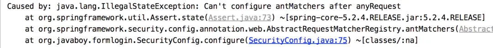

# 【SpringSecurity系列（五）】授权入门

Original 江南一点雨 [江南一点雨](javascript:void(0);) *2021年04月15日 12:16*

**《深入浅出Spring Security》**一书已由清华大学出版社正式出版发行，感兴趣的小伙伴戳这里[->->>深入浅出Spring Security](https://mp.weixin.qq.com/s?__biz=MzI1NDY0MTkzNQ==&mid=2247492459&idx=1&sn=a3ffb25873c0905b8862fcb8334a68e7&scene=21#wechat_redirect)，一本书学会 Spring Security。

<iframe src="https://file.daihuo.qq.com/mp_cps_goods_card/v112/index.html" frameborder="0" scrolling="no" class="iframe_ad_container" style="width: 656.989px; height: 0px; border: none; box-sizing: border-box; display: block;"></iframe>


<svg data-v-8b461723="" xmlns="http://www.w3.org/2000/svg" viewBox="0 0 2 2" width="4px" height="4px" class="border_filler border_filler_lefttop"><path data-v-8b461723="" d="M1.85.005A2 2 0 000 2V0h2z" fill="#ffffff" fill-rule="evenodd"></path></svg>

<svg data-v-8b461723="" xmlns="http://www.w3.org/2000/svg" viewBox="0 0 2 2" width="4px" height="4px" class="border_filler border_filler_righttop"><path data-v-8b461723="" d="M1.85.005A2 2 0 000 2V0h2z" fill="#ffffff" fill-rule="evenodd"></path></svg>

<svg data-v-8b461723="" xmlns="http://www.w3.org/2000/svg" viewBox="0 0 2 2" width="4px" height="4px" class="border_filler border_filler_rightbot"><path data-v-8b461723="" d="M1.85.005A2 2 0 000 2V0h2z" fill="#ffffff" fill-rule="evenodd"></path></svg>

<svg data-v-8b461723="" xmlns="http://www.w3.org/2000/svg" viewBox="0 0 2 2" width="4px" height="4px" class="border_filler border_filler_leftbot"><path data-v-8b461723="" d="M1.85.005A2 2 0 000 2V0h2z" fill="#ffffff" fill-rule="evenodd"></path></svg>


，时长14:34


视频看完了，如果小伙伴们觉得松哥的视频风格还能接受，也可以看看松哥自制的 [Spring Boot + Vue 系列视频教程](https://mp.weixin.qq.com/s?__biz=MzI1NDY0MTkzNQ==&mid=2247488059&idx=1&sn=2ef3e7f14d262130ecab94a0b17de0ca&scene=21#wechat_redirect)

以下是视频笔记。

通过前面四篇文章的介绍，Spring Security 中的登录认证我们就先告一个小小段落。在本系列未来的教程中，我们还会继续涉及到 Spring Security 中的登录认证问题，这个我们以后再说。

本系列前面四篇文章给小伙伴们列一个索引出来，大家可以参考：

1. [挖一个大坑，Spring Security 开搞！](https://mp.weixin.qq.com/s?__biz=MzI1NDY0MTkzNQ==&mid=2247488106&idx=1&sn=258fc609661f22de5517e1bc5c0915ed&scene=21#wechat_redirect)
2. [松哥手把手带你入门 Spring Security，别再问密码怎么解密了](https://mp.weixin.qq.com/s?__biz=MzI1NDY0MTkzNQ==&mid=2247488113&idx=1&sn=01168c492e22fa287043eb746950da73&scene=21#wechat_redirect)
3. [手把手教你定制 Spring Security 中的表单登录](https://mp.weixin.qq.com/s?__biz=MzI1NDY0MTkzNQ==&mid=2247488138&idx=1&sn=25d18a61a14e4e6316537b6d45e43dd4&scene=21#wechat_redirect)
4. [Spring Security 做前后端分离，咱就别做页面跳转了！统统 JSON 交互](https://mp.weixin.qq.com/s?__biz=MzI1NDY0MTkzNQ==&mid=2247488157&idx=2&sn=845178d45e73232a94ed46df12ea76cc&scene=21#wechat_redirect)

好了，今天我们就通过一个简单的案例来看看 Spring Security 中的授权操作。

## 1.授权

所谓的授权，就是用户如果要访问某一个资源，我们要去检查用户是否具备这样的权限，如果具备就允许访问，如果不具备，则不允许访问。

## 2.准备测试用户

因为我们现在还没有连接数据库，所以测试用户还是基于内存来配置。

基于内存配置测试用户，我们有两种方式，第一种就是我们本系列前面几篇文章用的配置方式，如下：

```
@Override
protected void configure(AuthenticationManagerBuilder auth) throws Exception {
    auth.inMemoryAuthentication()
            .withUser("javaboy")
            .password("123").roles("admin")
            .and()
            .withUser("江南一点雨")
            .password("123")
            .roles("user");
}
```

这是一种配置方式。

由于 Spring Security 支持多种数据源，例如内存、数据库、LDAP 等，这些不同来源的数据被共同封装成了一个 UserDetailService 接口，任何实现了该接口的对象都可以作为认证数据源。

因此我们还可以通过重写 WebSecurityConfigurerAdapter 中的 userDetailsService 方法来提供一个 UserDetailService 实例进而配置多个用户：

```
@Bean
protected UserDetailsService userDetailsService() {
    InMemoryUserDetailsManager manager = new InMemoryUserDetailsManager();
    manager.createUser(User.withUsername("javaboy").password("123").roles("admin").build());
    manager.createUser(User.withUsername("江南一点雨").password("123").roles("user").build());
    return manager;
}
```

两种基于内存定义用户的方法，大家任选一个。

## 3.准备测试接口

测试用户准备好了，接下来我们准备三个测试接口。如下：

```
@RestController
public class HelloController {
    @GetMapping("/hello")
    public String hello() {
        return "hello";
    }

    @GetMapping("/admin/hello")
    public String admin() {
        return "admin";
    }

    @GetMapping("/user/hello")
    public String user() {
        return "user";
    }
}
```

这三个测试接口，我们的规划是这样的：

1. /hello 是任何人都可以访问的接口
2. /admin/hello 是具有 admin 身份的人才能访问的接口
3. /user/hello 是具有 user 身份的人才能访问的接口
4. 所有 user 能够访问的资源，admin 都能够访问

**注意第四条规范意味着所有具备 admin 身份的人自动具备 user 身份。**

## 4.配置

接下来我们来配置权限的拦截规则，在 Spring Security 的 configure(HttpSecurity http) 方法中，代码如下：

```
http.authorizeRequests()
        .antMatchers("/admin/**").hasRole("admin")
        .antMatchers("/user/**").hasRole("user")
        .anyRequest().authenticated()
        .and()
        ...
        ...
```

这里的匹配规则我们采用了 Ant 风格的路径匹配符，Ant 风格的路径匹配符在 Spring 家族中使用非常广泛，它的匹配规则也非常简单：

| 通配符 | 含义             |
| :----- | :--------------- |
| **     | 匹配多层路径     |
| *      | 匹配一层路径     |
| ?      | 匹配任意单个字符 |

上面配置的含义是：

1. 如果请求路径满足 `/admin/**` 格式，则用户需要具备 admin 角色。
2. 如果请求路径满足 `/user/**` 格式，则用户需要具备 user 角色。
3. 剩余的其他格式的请求路径，只需要认证（登录）后就可以访问。

注意代码中配置的三条规则的顺序非常重要，和 Shiro 类似，Spring Security 在匹配的时候也是按照从上往下的顺序来匹配，一旦匹配到了就不继续匹配了，**所以拦截规则的顺序不能写错**。

另一方面，如果你强制将 anyRequest 配置在 antMatchers 前面，像下面这样：

```
http.authorizeRequests()
        .anyRequest().authenticated()
        .antMatchers("/admin/**").hasRole("admin")
        .antMatchers("/user/**").hasRole("user")
        .and()
```

此时项目在启动的时候，就会报错，会提示不能在 anyRequest 之后添加 antMatchers：



这从语义上很好理解，anyRequest 已经包含了其他请求了，在它之后如果还配置其他请求也没有任何意义。

从语义上理解，anyRequest 应该放在最后，表示除了前面拦截规则之外，剩下的请求要如何处理。

在拦截规则的配置类 AbstractRequestMatcherRegistry 中，我们可以看到如下一些代码（部分源码）：

```
public abstract class AbstractRequestMatcherRegistry<C> {
 private boolean anyRequestConfigured = false;
 public C anyRequest() {
  Assert.state(!this.anyRequestConfigured, "Can't configure anyRequest after itself");
  this.anyRequestConfigured = true;
  return configurer;
 }
 public C antMatchers(HttpMethod method, String... antPatterns) {
  Assert.state(!this.anyRequestConfigured, "Can't configure antMatchers after anyRequest");
  return chainRequestMatchers(RequestMatchers.antMatchers(method, antPatterns));
 }
 public C antMatchers(String... antPatterns) {
  Assert.state(!this.anyRequestConfigured, "Can't configure antMatchers after anyRequest");
  return chainRequestMatchers(RequestMatchers.antMatchers(antPatterns));
 }
 protected final List<MvcRequestMatcher> createMvcMatchers(HttpMethod method,
   String... mvcPatterns) {
  Assert.state(!this.anyRequestConfigured, "Can't configure mvcMatchers after anyRequest");
  return matchers;
 }
 public C regexMatchers(HttpMethod method, String... regexPatterns) {
  Assert.state(!this.anyRequestConfigured, "Can't configure regexMatchers after anyRequest");
  return chainRequestMatchers(RequestMatchers.regexMatchers(method, regexPatterns));
 }
 public C regexMatchers(String... regexPatterns) {
  Assert.state(!this.anyRequestConfigured, "Can't configure regexMatchers after anyRequest");
  return chainRequestMatchers(RequestMatchers.regexMatchers(regexPatterns));
 }
 public C requestMatchers(RequestMatcher... requestMatchers) {
  Assert.state(!this.anyRequestConfigured, "Can't configure requestMatchers after anyRequest");
  return chainRequestMatchers(Arrays.asList(requestMatchers));
 }
}
```

从这段源码中，我们可以看到，在任何拦截规则之前（包括 anyRequest 自身），都会先判断 anyRequest 是否已经配置，如果已经配置，则会抛出异常，系统启动失败。

这样大家就理解了为什么 anyRequest 一定要放在最后。

## 5.启动测试

接下来，我们启动项目进行测试。

项目启动成功后，我们首先以 江南一点雨的身份进行登录：


登录成功后，分别访问 `/hello`，`/admin/hello` 以及 `/user/hello` 三个接口，其中：

1. `/hello` 因为登录后就可以访问，这个接口访问成功。
2. `/admin/hello` 需要 admin 身份，所以访问失败。
3. `/user/hello` 需要 user 身份，所以访问成功。

具体测试效果小伙伴们可以参考松哥的视频，我就不截图了。

按照相同的方式，大家也可以测试 javaboy 用户。

## 6.角色继承

在前面松哥提到过一点，所有 user 能够访问的资源，admin 都能够访问，很明显我们目前的代码还不具备这样的功能。

要实现所有 user 能够访问的资源，admin 都能够访问，这涉及到另外一个知识点，叫做角色继承。

这在实际开发中非常有用。

上级可能具备下级的所有权限，如果使用角色继承，这个功能就很好实现，我们只需要在 SecurityConfig 中添加如下代码来配置角色继承关系即可：

```
@Bean
RoleHierarchy roleHierarchy() {
    RoleHierarchyImpl hierarchy = new RoleHierarchyImpl();
    hierarchy.setHierarchy("ROLE_admin > ROLE_user");
    return hierarchy;
}
```

注意，在配置时，需要给角色手动加上 `ROLE_` 前缀。上面的配置表示 `ROLE_admin` 自动具备 `ROLE_user` 的权限。

配置完成后，重启项目，此时我们发现 javaboy 也能访问 `/user/hello` 这个接口了。

好了，今天就和小伙伴们说这么多.

[](http://mp.weixin.qq.com/s?__biz=MzI1NDY0MTkzNQ==&mid=2247491260&idx=1&sn=6e733419aca3b6f1814d832350d4080a&chksm=e9c34cdcdeb4c5ca697e3cb15e920bcf7c5144b6c7311de440227380d4caa1ddd6925f5e15e5&scene=21#wechat_redirect)


加微信进群


一起切磋Web安全

（已添加松哥微信的小伙伴请勿重复添加）

**感谢小伙伴们的阅读，如果觉得有用，毫不犹豫的点个在看鼓励下松哥，我会以风驰电掣般的速度快速更完这个系列～**

SpringSecurity38

SpringSecurity · 目录


上一篇【SpringSecurity系列（四）】登录成功返回JSON数据下一篇【SpringSecurity系列（六）】自定义登录用户


# 