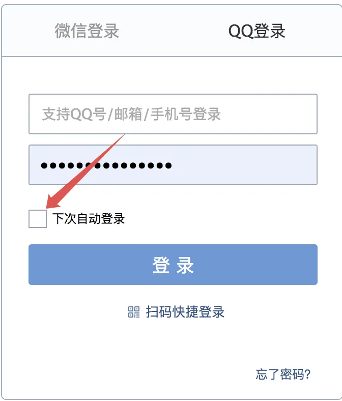
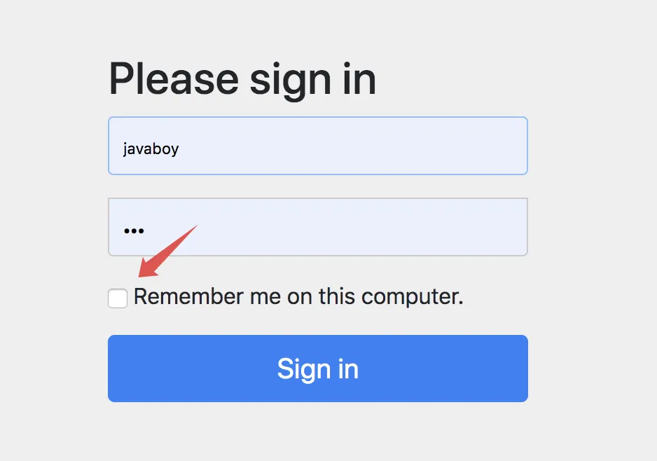
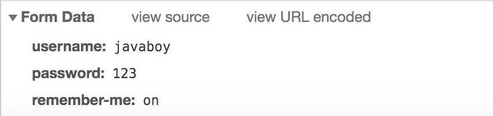
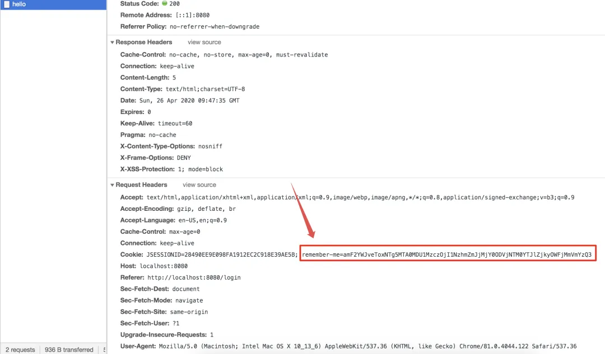

# 【SpringSecurity系列（八）】用户还能自动登录？

Original 江南一点雨 [江南一点雨](javascript:void(0);) *2021年04月20日 10:37*

《深入浅出Spring Security》一书已由清华大学出版社正式出版发行，感兴趣的小伙伴戳这里[->->>深入浅出Spring Security](https://mp.weixin.qq.com/s?__biz=MzI1NDY0MTkzNQ==&mid=2247492459&idx=1&sn=a3ffb25873c0905b8862fcb8334a68e7&scene=21#wechat_redirect)，一本书学会 Spring Security。

<iframe src="https://file.daihuo.qq.com/mp_cps_goods_card/v112/index.html" frameborder="0" scrolling="no" class="iframe_ad_container" style="width: 656.989px; height: 0px; border: none; box-sizing: border-box; display: block;"></iframe>


------

自动登录是我们在软件开发时一个非常常见的功能，例如我们登录 QQ 邮箱：



很多网站我们在登录的时候都会看到类似的选项，毕竟总让用户输入用户名密码是一件很麻烦的事。

自动登录功能就是，用户在登录成功后，在某一段时间内，如果用户关闭了浏览器并重新打开，或者服务器重启了，都不需要用户重新登录了，用户依然可以直接访问接口数据。

作为一个常见的功能，我们的 Spring Security 肯定也提供了相应的支持，本文我们就来看下 Spring Security 中如何实现这个功能。

本文是松哥最近在连载的 Spring Security 系列第 8 篇，阅读本系列前面的文章可以更好的理解本文（如果大家对松哥录制的 Spring Security 视频感兴趣，也可以看看这里：[SpringBoot+Vue+微人事视频教程](https://mp.weixin.qq.com/s?__biz=MzI1NDY0MTkzNQ==&mid=2247488059&idx=1&sn=2ef3e7f14d262130ecab94a0b17de0ca&scene=21#wechat_redirect)）：

1. [【SpringSecurity系列（一）】初识 Spring Security](https://mp.weixin.qq.com/s?__biz=MzI1NDY0MTkzNQ==&mid=2247492925&idx=2&sn=b3b8943bce05e97d4f84d92002dd6571&scene=21#wechat_redirect)
2. [【SpringSecurity系列（二）】Spring Security入门](https://mp.weixin.qq.com/s?__biz=MzI1NDY0MTkzNQ==&mid=2247493000&idx=2&sn=3d2862565e0f22968f1685199c6bdb87&scene=21#wechat_redirect)
3. [【SpringSecurity系列（三）】定制表单登录](https://mp.weixin.qq.com/s?__biz=MzI1NDY0MTkzNQ==&mid=2247493036&idx=2&sn=0a0356f4724830eb136d673c289437b6&scene=21#wechat_redirect)
4. [【SpringSecurity系列（四）】登录成功返回JSON数据](https://mp.weixin.qq.com/s?__biz=MzI1NDY0MTkzNQ==&mid=2247493044&idx=2&sn=e7a4f0fd826eeffffdb503cc2316bc50&scene=21#wechat_redirect)
5. [【SpringSecurity系列（五）】授权入门](https://mp.weixin.qq.com/s?__biz=MzI1NDY0MTkzNQ==&mid=2247493062&idx=2&sn=1480de83f67c3049e7efcc1cce21a918&scene=21#wechat_redirect)
6. [【SpringSecurity系列（六）】自定义登录用户](https://mp.weixin.qq.com/s?__biz=MzI1NDY0MTkzNQ==&mid=2247493130&idx=2&sn=7dff1f444fc652c23267a1ba89ea11d2&scene=21#wechat_redirect)
7. [【SpringSecurity系列（七）】通过 Spring Data Jpa 持久化用户数据](https://mp.weixin.qq.com/s?__biz=MzI1NDY0MTkzNQ==&mid=2247493175&idx=2&sn=55ab518981e7952137c0c247205eb6a3&scene=21#wechat_redirect)

这个功能实现起来简单，但是还是会涉及到很多细节，所以我会分两篇文章来逐一介绍，本文是第一篇。

## 1.实战代码

首先，要实现记住我这个功能，其实只需要其实只需要在 Spring Security 的配置中，添加如下代码即可：

```
@Override
protected void configure(HttpSecurity http) throws Exception {
    http.authorizeRequests()
            .anyRequest().authenticated()
            .and()
            .formLogin()
            .and()
            .rememberMe()
            .and()
            .csrf().disable();
}
```

大家看到，这里只需要添加一个 `.rememberMe()` 即可，自动登录功能就成功添加进来了。

接下来我们随意添加一个测试接口：

```
@RestController
public class HelloController {
    @GetMapping("/hello")
    public String hello() {
        return "hello";
    }
}
```

重启项目，我们访问 hello 接口，此时会自动跳转到登录页面：



这个时候大家发现，默认的登录页面多了一个选项，就是记住我。我们输入用户名密码，并且勾选上记住我这个框，然后点击登录按钮执行登录操作：



可以看到，登录数据中，除了 username 和 password 之外，还有一个 remember-me，之所以给大家看这个，是想告诉大家，如果你你需要自定义登录页面，RememberMe 这个选项的 key 该怎么写。

登录成功之后，就会自动跳转到 hello 接口了。我们注意，系统访问 hello 接口的时候，携带的 cookie：



大家注意到，这里多了一个 remember-me，这就是这里实现的核心，关于这个 remember-me 我一会解释，我们先来测试效果。

接下来，我们关闭浏览器，再重新打开浏览器。正常情况下，浏览器关闭再重新打开，如果需要再次访问 hello 接口，就需要我们重新登录了。但是此时，我们再去访问 hello 接口，发现不用重新登录了，直接就能访问到，这就说明我们的 RememberMe 配置生效了（即下次自动登录功能生效了）。

## 2.原理分析

按理说，浏览器关闭再重新打开，就要重新登录，现在竟然不用等了，那么这个功能到底是怎么实现的呢？

首先我们来分析一下 cookie 中多出来的这个 remember-me，这个值一看就是一个 Base64 转码后的字符串，我们可以使用网上的一些在线工具来解码，可以自己简单写两行代码来解码：

```
@Test
void contextLoads() throws UnsupportedEncodingException {
    String s = new String(Base64.getDecoder().decode("amF2YWJveToxNTg5MTA0MDU1MzczOjI1NzhmZmJjMjY0ODVjNTM0YTJlZjkyOWFjMmVmYzQ3"), "UTF-8");
    System.out.println("s = " + s);
}
```

执行这段代码，输出结果如下：

```
s = javaboy:1589104055373:2578ffbc26485c534a2ef929ac2efc47
```

可以看到，这段 Base64 字符串实际上用 `:` 隔开，分成了三部分：

1. 第一段是用户名，这个无需质疑。
2. 第二段看起来是一个时间戳，我们通过在线工具或者 Java 代码解析后发现，这是一个两周后的数据。
3. 第三段我就不卖关子了，这是使用 MD5 散列函数算出来的值，他的明文格式是 `username + ":" + tokenExpiryTime + ":" + password + ":" + key`，最后的 key 是一个散列盐值，可以用来防治令牌被修改。

了解到 cookie 中 remember-me 的含义之后，那么我们对于记住我的登录流程也就很容易猜到了了。

在浏览器关闭后，并重新打开之后，用户再去访问 hello 接口，此时会携带着 cookie 中的 remember-me 到服务端，服务到拿到值之后，可以方便的计算出用户名和过期时间，再根据用户名查询到用户密码，然后通过 MD5 散列函数计算出散列值，再将计算出的散列值和浏览器传递来的散列值进行对比，就能确认这个令牌是否有效。

流程就是这么个流程，接下来我们通过分析源码来验证一下这个流程对不对。

## 3.源码分析

接下来，我们通过源码来验证一下我们上面说的对不对。

这里主要从两个方面来介绍，一个是 remember-me 这个令牌生成的过程，另一个则是它解析的过程。

### 3.1 生成

生成的核心处理方法在：`TokenBasedRememberMeServices#onLoginSuccess`：

```
@Override
public void onLoginSuccess(HttpServletRequest request, HttpServletResponse response,
  Authentication successfulAuthentication) {
 String username = retrieveUserName(successfulAuthentication);
 String password = retrievePassword(successfulAuthentication);
 if (!StringUtils.hasLength(password)) {
  UserDetails user = getUserDetailsService().loadUserByUsername(username);
  password = user.getPassword();
 }
 int tokenLifetime = calculateLoginLifetime(request, successfulAuthentication);
 long expiryTime = System.currentTimeMillis();
 expiryTime += 1000L * (tokenLifetime < 0 ? TWO_WEEKS_S : tokenLifetime);
 String signatureValue = makeTokenSignature(expiryTime, username, password);
 setCookie(new String[] { username, Long.toString(expiryTime), signatureValue },
   tokenLifetime, request, response);
}
protected String makeTokenSignature(long tokenExpiryTime, String username,
  String password) {
 String data = username + ":" + tokenExpiryTime + ":" + password + ":" + getKey();
 MessageDigest digest;
 digest = MessageDigest.getInstance("MD5");
 return new String(Hex.encode(digest.digest(data.getBytes())));
}
```

这段方法的逻辑其实很好理解：

1. 首先从登录成功的 Authentication 中提取出用户名/密码。
2. 由于登录成功之后，密码可能被擦除了，所以，如果一开始没有拿到密码，就再从 UserDetailsService 中重新加载用户并重新获取密码。
3. 再接下来去获取令牌的有效期，令牌有效期默认就是两周。
4. 再接下来调用 makeTokenSignature 方法去计算散列值，实际上就是根据 username、令牌有效期以及 password、key 一起计算一个散列值。如果我们没有自己去设置这个 key，默认是在 RememberMeConfigurer#getKey 方法中进行设置的，它的值是一个 UUID 字符串。
5. 最后，将用户名、令牌有效期以及计算得到的散列值放入 Cookie 中。

关于第四点，我这里再说一下。

由于我们自己没有设置 key，key 默认值是一个 UUID 字符串，这样会带来一个问题，就是如果服务端重启，这个 key 会变，这样就导致之前派发出去的所有 remember-me 自动登录令牌失效，所以，我们可以指定这个 key。指定方式如下：

```
@Override
protected void configure(HttpSecurity http) throws Exception {
    http.authorizeRequests()
            .anyRequest().authenticated()
            .and()
            .formLogin()
            .and()
            .rememberMe()
            .key("javaboy")
            .and()
            .csrf().disable();
}
```

如果自己配置了 key，**即使服务端重启，即使浏览器打开再关闭**，也依然能够访问到 hello 接口。

这是 remember-me 令牌生成的过程。至于是如何走到 onLoginSuccess 方法的，大家可以参考松哥之前的文章：[松哥手把手带你捋一遍 Spring Security 登录流程](https://mp.weixin.qq.com/s?__biz=MzI1NDY0MTkzNQ==&mid=2247488026&idx=2&sn=3bd96d91e822abf753a8e91142e036be&scene=21#wechat_redirect)。这里可以给大家稍微提醒一下思路：

AbstractAuthenticationProcessingFilter#doFilter -> AbstractAuthenticationProcessingFilter#successfulAuthentication -> AbstractRememberMeServices#loginSuccess -> TokenBasedRememberMeServices#onLoginSuccess。

### 3.2 解析

那么当用户关掉并打开浏览器之后，重新访问 /hello 接口，此时的认证流程又是怎么样的呢？

我们之前说过，Spring Security 中的一系列功能都是通过一个过滤器链实现的，RememberMe 这个功能当然也不例外。

Spring Security 中提供了 RememberMeAuthenticationFilter 类专门用来做相关的事情，我们来看下 RememberMeAuthenticationFilter 的 doFilter 方法：

```
public void doFilter(ServletRequest req, ServletResponse res, FilterChain chain)
  throws IOException, ServletException {
 HttpServletRequest request = (HttpServletRequest) req;
 HttpServletResponse response = (HttpServletResponse) res;
 if (SecurityContextHolder.getContext().getAuthentication() == null) {
  Authentication rememberMeAuth = rememberMeServices.autoLogin(request,
    response);
  if (rememberMeAuth != null) {
    rememberMeAuth = authenticationManager.authenticate(rememberMeAuth);
    SecurityContextHolder.getContext().setAuthentication(rememberMeAuth);
    onSuccessfulAuthentication(request, response, rememberMeAuth);
    if (this.eventPublisher != null) {
     eventPublisher
       .publishEvent(new InteractiveAuthenticationSuccessEvent(
         SecurityContextHolder.getContext()
           .getAuthentication(), this.getClass()));
    }
    if (successHandler != null) {
     successHandler.onAuthenticationSuccess(request, response,
       rememberMeAuth);
     return;
    }
   }
  chain.doFilter(request, response);
 }
 else {
  chain.doFilter(request, response);
 }
}
```

可以看到，就是在这里实现的。

这个方法最关键的地方在于，如果从 SecurityContextHolder 中无法获取到当前登录用户实例，那么就调用 rememberMeServices.autoLogin 逻辑进行登录，我们来看下这个方法：

```
public final Authentication autoLogin(HttpServletRequest request,
  HttpServletResponse response) {
 String rememberMeCookie = extractRememberMeCookie(request);
 if (rememberMeCookie == null) {
  return null;
 }
 logger.debug("Remember-me cookie detected");
 if (rememberMeCookie.length() == 0) {
  logger.debug("Cookie was empty");
  cancelCookie(request, response);
  return null;
 }
 UserDetails user = null;
 try {
  String[] cookieTokens = decodeCookie(rememberMeCookie);
  user = processAutoLoginCookie(cookieTokens, request, response);
  userDetailsChecker.check(user);
  logger.debug("Remember-me cookie accepted");
  return createSuccessfulAuthentication(request, user);
 }
 catch (CookieTheftException cte) {
  
  throw cte;
 }
 cancelCookie(request, response);
 return null;
}
```

可以看到，这里就是提取出 cookie 信息，并对 cookie 信息进行解码，解码之后，再调用 processAutoLoginCookie 方法去做校验，processAutoLoginCookie 方法的代码我就不贴了，核心流程就是首先获取用户名和过期时间，再根据用户名查询到用户密码，然后通过 MD5 散列函数计算出散列值，再将拿到的散列值和浏览器传递来的散列值进行对比，就能确认这个令牌是否有效，进而确认登录是否有效。

好了，这里的流程我也根据大家大致上梳理了一下。

## 4.总结

看了上面的文章，大家可能已经发现，如果我们开启了 RememberMe 功能，最最核心的东西就是放在 cookie 中的令牌了，这个令牌突破了 session 的限制，即使服务器重启、即使浏览器关闭又重新打开，只要这个令牌没有过期，就能访问到数据。

一旦令牌丢失，别人就可以拿着这个令牌随意登录我们的系统了，这是一个非常危险的操作。

但是实际上这是一段悖论，为了提高用户体验（少登录），我们的系统不可避免的引出了一些安全问题，不过我们可以通过技术将安全风险降低到最小。

那么如何让我们的 RememberMe 功能更加安全呢？松哥下篇文章来和大家继续分享--持久化令牌方案。


加微信进群


一起切磋Web安全

（已添加松哥微信的小伙伴请勿重复添加）


小伙伴们要是觉得看懂了，不妨点个在看鼓励下松哥～

SpringSecurity38

SpringSecurity · 目录


上一篇【SpringSecurity系列（七）】通过 Spring Data Jpa 持久化用户数据下一篇【SpringSecurity系列（九）】降低 RememberMe 的安全风险


# 