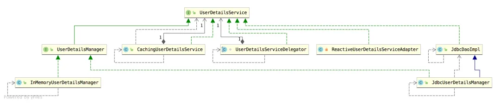
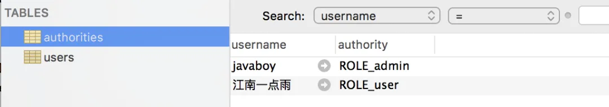

# 【SpringSecurity系列（六）】自定义登录用户

Original 江南一点雨 [江南一点雨](javascript:void(0);) *2021年04月16日 15:36*

《深入浅出Spring Security》一书已由清华大学出版社正式出版发行，感兴趣的小伙伴戳这里[->->>深入浅出Spring Security](https://mp.weixin.qq.com/s?__biz=MzI1NDY0MTkzNQ==&mid=2247492459&idx=1&sn=a3ffb25873c0905b8862fcb8334a68e7&scene=21#wechat_redirect)，一本书学会 Spring Security。

<iframe src="https://file.daihuo.qq.com/mp_cps_goods_card/v112/index.html" frameborder="0" scrolling="no" class="iframe_ad_container" style="width: 656.989px; height: 0px; border: none; box-sizing: border-box; display: block;"></iframe>


<svg data-v-8b461723="" xmlns="http://www.w3.org/2000/svg" viewBox="0 0 2 2" width="4px" height="4px" class="border_filler border_filler_lefttop"><path data-v-8b461723="" d="M1.85.005A2 2 0 000 2V0h2z" fill="#ffffff" fill-rule="evenodd"></path></svg>

<svg data-v-8b461723="" xmlns="http://www.w3.org/2000/svg" viewBox="0 0 2 2" width="4px" height="4px" class="border_filler border_filler_righttop"><path data-v-8b461723="" d="M1.85.005A2 2 0 000 2V0h2z" fill="#ffffff" fill-rule="evenodd"></path></svg>

<svg data-v-8b461723="" xmlns="http://www.w3.org/2000/svg" viewBox="0 0 2 2" width="4px" height="4px" class="border_filler border_filler_rightbot"><path data-v-8b461723="" d="M1.85.005A2 2 0 000 2V0h2z" fill="#ffffff" fill-rule="evenodd"></path></svg>

<svg data-v-8b461723="" xmlns="http://www.w3.org/2000/svg" viewBox="0 0 2 2" width="4px" height="4px" class="border_filler border_filler_leftbot"><path data-v-8b461723="" d="M1.85.005A2 2 0 000 2V0h2z" fill="#ffffff" fill-rule="evenodd"></path></svg>


，时长13:11


视频看完了，如果小伙伴们觉得松哥的视频风格还能接受，也可以看看松哥自制的 [Spring Boot + Vue 系列视频教程](https://mp.weixin.qq.com/s?__biz=MzI1NDY0MTkzNQ==&mid=2247488059&idx=1&sn=2ef3e7f14d262130ecab94a0b17de0ca&scene=21#wechat_redirect)

以下是视频笔记。

Spring Security 介绍到现在，我们还没连上数据库呢。

真正的项目中，大部分情况下，我们都是自己设计权限数据库，例如微人事（https://github.com/lenve/vhr）项目那样。

不过，Spring Security 也给我们提供了一个它自己设计好的权限数据库，这里我们先来看看这是怎么回事！先来学这个简单的，然后我们再去看复杂的。

## 1.UserDetailService

Spring Security 支持多种不同的数据源，这些不同的数据源最终都将被封装成 UserDetailsService 的实例，在微人事（https://github.com/lenve/vhr）项目中，我们是自己来创建一个类实现 UserDetailsService 接口，除了自己封装，我们也可以使用系统默认提供的 UserDetailsService 实例，例如上篇文章和大家介绍的 InMemoryUserDetailsManager 。

我们来看下 UserDetailsService 都有哪些实现类：



可以看到，在几个能直接使用的实现类中，除了 InMemoryUserDetailsManager 之外，还有一个 JdbcUserDetailsManager，使用 JdbcUserDetailsManager 可以让我们通过 JDBC 的方式将数据库和 Spring Security 连接起来。

## 2.JdbcUserDetailsManager

JdbcUserDetailsManager 自己提供了一个数据库模型，这个数据库模型保存在如下位置：

```
org/springframework/security/core/userdetails/jdbc/users.ddl
```

这里存储的脚本内容如下：

```
create table users(username varchar_ignorecase(50) not null primary key,password varchar_ignorecase(500) not null,enabled boolean not null);
create table authorities (username varchar_ignorecase(50) not null,authority varchar_ignorecase(50) not null,constraint fk_authorities_users foreign key(username) references users(username));
create unique index ix_auth_username on authorities (username,authority);
```

可以看到，脚本中有一种数据类型 varchar_ignorecase，这个其实是针对 HSQLDB 数据库创建的，而我们使用的 MySQL 并不支持这种数据类型，所以这里需要大家手动调整一下数据类型，将 varchar_ignorecase 改为 varchar 即可。

修改完成后，创建数据库，执行完成后的脚本。

执行完 SQL 脚本后，我们可以看到一共创建了两张表：users 和 authorities。

- users 表中保存用户的基本信息，包括用户名、用户密码以及账户是否可用。
- authorities 中保存了用户的角色。
- authorities 和 users 通过 username 关联起来。

配置完成后，接下来，我们将上篇文章中通过 InMemoryUserDetailsManager 提供的用户数据用 JdbcUserDetailsManager 代替掉，如下：

```
@Autowired
DataSource dataSource;
@Override
@Bean
protected UserDetailsService userDetailsService() {
    JdbcUserDetailsManager manager = new JdbcUserDetailsManager();
    manager.setDataSource(dataSource);
    if (!manager.userExists("javaboy")) {
        manager.createUser(User.withUsername("javaboy").password("123").roles("admin").build());
    }
    if (!manager.userExists("江南一点雨")) {
        manager.createUser(User.withUsername("江南一点雨").password("123").roles("user").build());
    }
    return manager;
}
```

这段配置的含义如下：

1. 首先构建一个 JdbcUserDetailsManager 实例。
2. 给 JdbcUserDetailsManager 实例添加一个 DataSource 对象。
3. 调用 userExists 方法判断用户是否存在，如果不存在，就创建一个新的用户出来（因为每次项目启动时这段代码都会执行，所以加一个判断，避免重复创建用户）。
4. 用户的创建方法和我们之前 InMemoryUserDetailsManager 中的创建方法基本一致。

这里的 createUser 或者 userExists 方法其实都是调用写好的 SQL 去判断的，我们从它的源码里就能看出来（部分）：

```
public class JdbcUserDetailsManager extends JdbcDaoImpl implements UserDetailsManager,
  GroupManager {
 public static final String DEF_USER_EXISTS_SQL = "select username from users where username = ?";

 private String userExistsSql = DEF_USER_EXISTS_SQL;

 public boolean userExists(String username) {
  List<String> users = getJdbcTemplate().queryForList(userExistsSql,
    new String[] { username }, String.class);

  if (users.size() > 1) {
   throw new IncorrectResultSizeDataAccessException(
     "More than one user found with name '" + username + "'", 1);
  }

  return users.size() == 1;
 }
}
```

从这段源码中就可以看出来，userExists 方法的执行逻辑其实就是调用 JdbcTemplate 来执行预定义好的 SQL 脚本，进而判断出用户是否存在，其他的判断方法都是类似，我就不再赘述。

## 3.数据库支持

通过前面的代码，大家看到这里需要数据库支持，所以我们在项目中添加如下两个依赖：

```
<dependency>
    <groupId>org.springframework.boot</groupId>
    <artifactId>spring-boot-starter-jdbc</artifactId>
</dependency>
<dependency>
    <groupId>mysql</groupId>
    <artifactId>mysql-connector-java</artifactId>
</dependency>
```

然后再在 application.properties 中配置一下数据库连接：

```
spring.datasource.username=root
spring.datasource.password=123
spring.datasource.url=jdbc:mysql:///security?useUnicode=true&characterEncoding=UTF-8&serverTimezone=Asia/Shanghai
```

配置完成后，就可以启动项目。

项目启动成功后，我们就可以看到数据库中自动添加了两个用户进来，并且用户都配置了角色。如下图：



## 4.测试

接下来我们就可以进行测试了。

我们首先以 江南一点雨的身份进行登录：


登录成功后，分别访问 `/hello`，`/admin/hello` 以及 `/user/hello` 三个接口，其中：

1. `/hello` 因为登录后就可以访问，这个接口访问成功。
2. `/admin/hello` 需要 admin 身份，所以访问失败。
3. `/user/hello` 需要 user 身份，所以访问成功。

具体测试效果小伙伴们可以参考松哥的视频，我就不截图了。

在测试的过程中，如果在数据库中将用户的 enabled 属性设置为 false，表示禁用该账户，此时再使用该账户登录就会登录失败。

按照相同的方式，大家也可以测试 javaboy 用户。

好了，今天就和小伙伴们说这么多.

**感谢小伙伴们的阅读，如果觉得有用，毫不犹豫的点个在看鼓励下松哥，我会以风驰电掣般的速度快速更完这个系列～**


加微信进群


一起切磋Web安全

（已添加松哥微信的小伙伴请勿重复添加）

SpringSecurity38

SpringSecurity · 目录


上一篇【SpringSecurity系列（五）】授权入门下一篇【SpringSecurity系列（七）】通过 Spring Data Jpa 持久化用户数据


# 