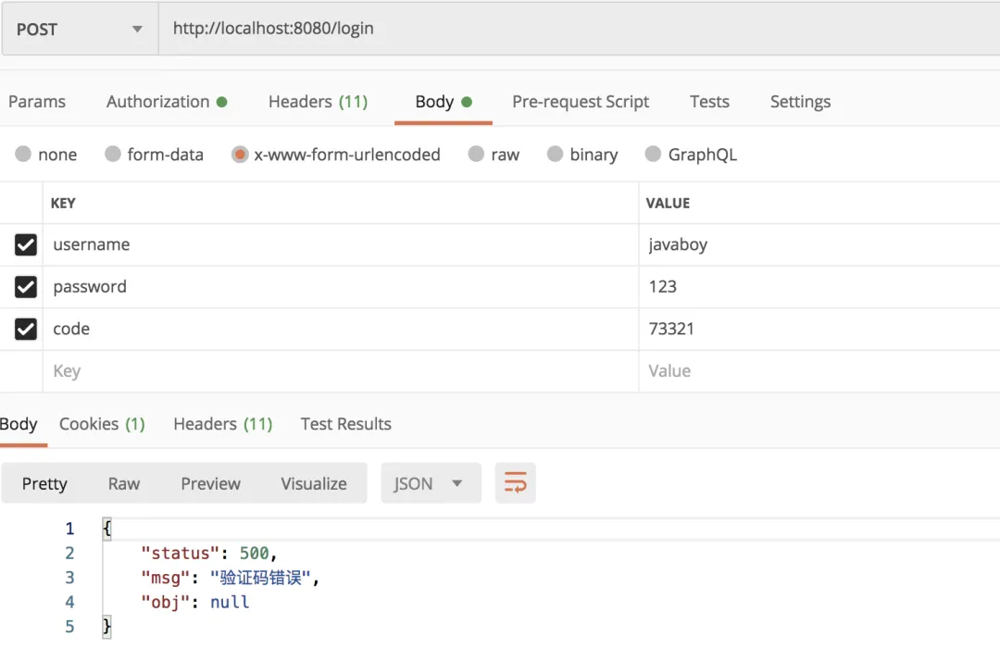
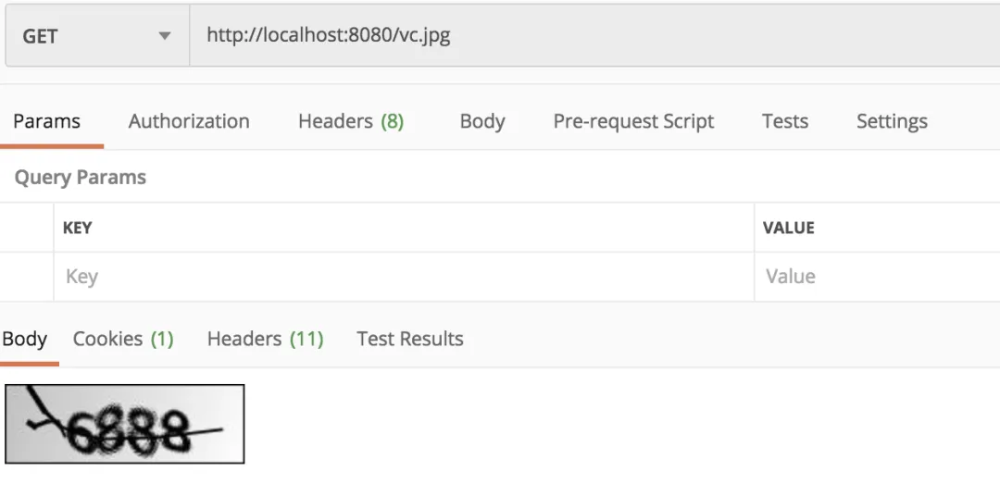
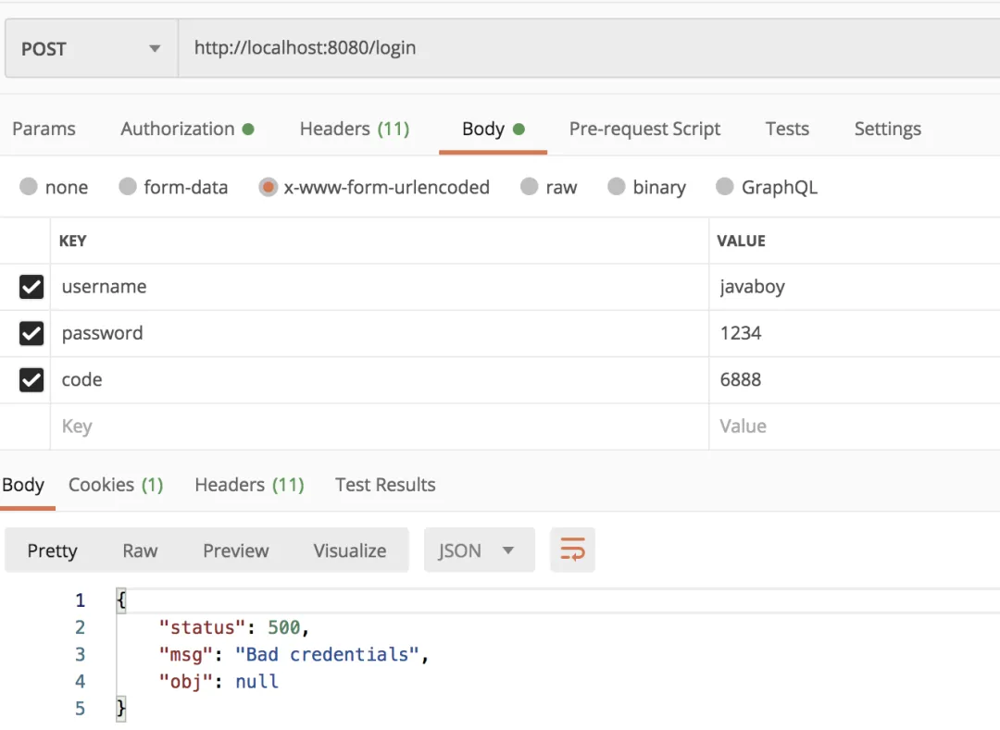
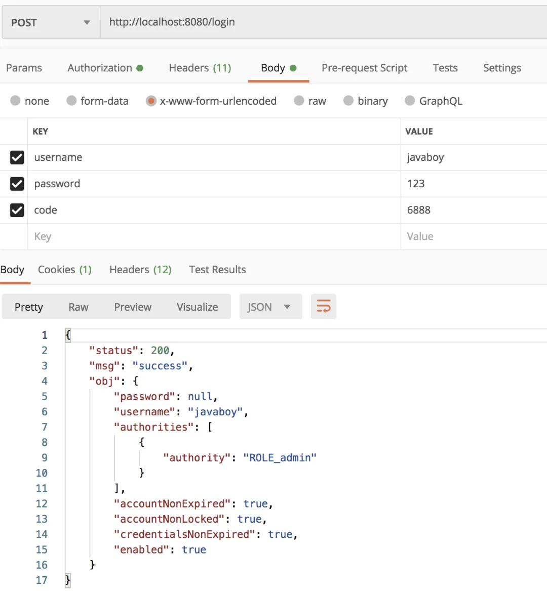

# 【SpringSecurity系列（十一）】自定义认证逻辑

Original 江南一点雨 [江南一点雨](javascript:void(0);) *2021年04月25日 10:36*

《深入浅出Spring Security》一书已由清华大学出版社正式出版发行，感兴趣的小伙伴戳这里[->->>深入浅出Spring Security](https://mp.weixin.qq.com/s?__biz=MzI1NDY0MTkzNQ==&mid=2247492459&idx=1&sn=a3ffb25873c0905b8862fcb8334a68e7&scene=21#wechat_redirect)，一本书学会 Spring Security。

<iframe src="https://file.daihuo.qq.com/mp_cps_goods_card/v112/index.html" frameborder="0" scrolling="no" class="iframe_ad_container" style="width: 656.989px; height: 0px; border: none; box-sizing: border-box; display: block;"></iframe>


------

有小伙伴会说，自定义认证逻辑还不简单？是的，没错，松哥之前也多次教过大家如何自定义认证逻辑，无论是添加登录验证码还是修改登录数据库格式，都需要对认证逻辑作出调整。

之前我们自定义的一个核心思路就是自定义过滤器，在过滤器中做各种各样我们想做的事：

- [Spring Security 如何添加登录验证码？松哥手把手教你给微人事添加登录验证码](https://mp.weixin.qq.com/s?__biz=MzI1NDY0MTkzNQ==&mid=2247487976&idx=1&sn=2556bc786f89e62bc7a52bc437eaab31&scene=21#wechat_redirect)
- [前后端分离中，使用 JSON 格式登录原来这么简单！](https://mp.weixin.qq.com/s?__biz=MzI1NDY0MTkzNQ==&mid=2247488145&idx=1&sn=3b6dc26c075704e8a2250a1a7ea4a214&scene=21#wechat_redirect)

上面这两篇文章都是使用了自定义过滤器的思路，这算是一种入门级的自定义认证逻辑了，不知道大家有没有想过，这种方式其实是有一些问题的。

举一个简单的例子，在添加登录验证码中，我为了校验验证码就自定义了一个过滤器，并把这个自定义的过滤器放入 SpringSecurity 过滤器链中，每次请求都会通过该过滤器。但实际上，只需要登录请求经过该过滤器即可，其他请求是不需要经过该过滤器的，这个时候，大家是不是就发现弊端了。

当然，如果你对性能没有极致追求，这种写法其实也问题不大，毕竟功能已经实现了，但是抱着学习的态度，今天松哥要在前面文章的基础上给大家介绍一个更加优雅的写法。

本文是我们 SpringSecurity 系列的第 11 篇，阅读本系列前面文章有助于更好的理解本文：

1. [【SpringSecurity系列（一）】初识 Spring Security](https://mp.weixin.qq.com/s?__biz=MzI1NDY0MTkzNQ==&mid=2247492925&idx=2&sn=b3b8943bce05e97d4f84d92002dd6571&scene=21#wechat_redirect)
2. [【SpringSecurity系列（二）】Spring Security入门](https://mp.weixin.qq.com/s?__biz=MzI1NDY0MTkzNQ==&mid=2247493000&idx=2&sn=3d2862565e0f22968f1685199c6bdb87&scene=21#wechat_redirect)
3. [【SpringSecurity系列（三）】定制表单登录](https://mp.weixin.qq.com/s?__biz=MzI1NDY0MTkzNQ==&mid=2247493036&idx=2&sn=0a0356f4724830eb136d673c289437b6&scene=21#wechat_redirect)
4. [【SpringSecurity系列（四）】登录成功返回JSON数据](https://mp.weixin.qq.com/s?__biz=MzI1NDY0MTkzNQ==&mid=2247493044&idx=2&sn=e7a4f0fd826eeffffdb503cc2316bc50&scene=21#wechat_redirect)
5. [【SpringSecurity系列（五）】授权入门](https://mp.weixin.qq.com/s?__biz=MzI1NDY0MTkzNQ==&mid=2247493062&idx=2&sn=1480de83f67c3049e7efcc1cce21a918&scene=21#wechat_redirect)
6. [【SpringSecurity系列（六）】自定义登录用户](https://mp.weixin.qq.com/s?__biz=MzI1NDY0MTkzNQ==&mid=2247493130&idx=2&sn=7dff1f444fc652c23267a1ba89ea11d2&scene=21#wechat_redirect)
7. [【SpringSecurity系列（七）】通过 Spring Data Jpa 持久化用户数据](https://mp.weixin.qq.com/s?__biz=MzI1NDY0MTkzNQ==&mid=2247493175&idx=2&sn=55ab518981e7952137c0c247205eb6a3&scene=21#wechat_redirect)
8. [【SpringSecurity系列（八）】用户还能自动登录？](https://mp.weixin.qq.com/s?__biz=MzI1NDY0MTkzNQ==&mid=2247493198&idx=2&sn=a6362d7264bd50a35b5cc46ddbd334b0&scene=21#wechat_redirect)
9. [【SpringSecurity系列（九）】降低 RememberMe 的安全风险](https://mp.weixin.qq.com/s?__biz=MzI1NDY0MTkzNQ==&mid=2247493226&idx=2&sn=1ad5066cc96b6f2a7f05714693cb0aa0&scene=21#wechat_redirect)
10. [在微服务项目中，Spring Security 比 Shiro 强在哪？](https://mp.weixin.qq.com/s?__biz=MzI1NDY0MTkzNQ==&mid=2247488312&idx=1&sn=61e67f7ca0f8a55749dcb064b9456a38&scene=21#wechat_redirect)

好了，不废话了，我们开始今天的文章。

## 1.认证流程简析

AuthenticationProvider 定义了 Spring Security 中的验证逻辑，我们来看下 AuthenticationProvider 的定义：

```
public interface AuthenticationProvider {
 Authentication authenticate(Authentication authentication)
   throws AuthenticationException;
 boolean supports(Class<?> authentication);
}
```

可以看到，AuthenticationProvider 中就两个方法：

- authenticate 方法用来做验证，就是验证用户身份。
- supports 则用来判断当前的 AuthenticationProvider 是否支持对应的 Authentication。

这里又涉及到一个东西，就是 Authentication。

玩过 Spring Security 的小伙伴都知道，在 Spring Security 中有一个非常重要的对象叫做 Authentication，我们可以在任何地方注入 Authentication 进而获取到当前登录用户信息，Authentication 本身是一个接口，它实际上对 java.security.Principal 做的进一步封装，我们来看下 Authentication 的定义：

```
public interface Authentication extends Principal, Serializable {
 Collection<? extends GrantedAuthority> getAuthorities();
 Object getCredentials();
 Object getDetails();
 Object getPrincipal();
 boolean isAuthenticated();
 void setAuthenticated(boolean isAuthenticated) throws IllegalArgumentException;
}
```

可以看到，这里接口中的方法也没几个，我来大概解释下：

1. getAuthorities 方法用来获取用户的权限。
2. getCredentials 方法用来获取用户凭证，一般来说就是密码。
3. getDetails 方法用来获取用户携带的详细信息，可能是当前请求之类的东西。
4. getPrincipal 方法用来获取当前用户，可能是一个用户名，也可能是一个用户对象。
5. isAuthenticated 当前用户是否认证成功。

Authentication 作为一个接口，它定义了用户，或者说 Principal 的一些基本行为，它有很多实现类：


在这些实现类中，我们最常用的就是 UsernamePasswordAuthenticationToken 了，而每一个 Authentication 都有适合它的 AuthenticationProvider 去处理校验。例如处理 UsernamePasswordAuthenticationToken 的 AuthenticationProvider 是 DaoAuthenticationProvider。

所以大家在 AuthenticationProvider 中看到一个 supports 方法，就是用来判断 AuthenticationProvider 是否支持当前 Authentication。

在一次完整的认证中，可能包含多个 AuthenticationProvider，而这多个 AuthenticationProvider 则由 ProviderManager 进行统一管理，具体可以参考松哥之前的文章：[松哥手把手带你捋一遍 Spring Security 登录流程](https://mp.weixin.qq.com/s?__biz=MzI1NDY0MTkzNQ==&mid=2247488026&idx=2&sn=3bd96d91e822abf753a8e91142e036be&scene=21#wechat_redirect)。

这里我们来重点看一下 DaoAuthenticationProvider，因为这是我们最常用的一个，当我们使用用户名/密码登录的时候，用的就是它，DaoAuthenticationProvider 的父类是 AbstractUserDetailsAuthenticationProvider，我们就先从它的父类看起：

```
public abstract class AbstractUserDetailsAuthenticationProvider implements
  AuthenticationProvider, InitializingBean, MessageSourceAware {
 public Authentication authenticate(Authentication authentication)
   throws AuthenticationException {
  String username = (authentication.getPrincipal() == null) ? "NONE_PROVIDED"
    : authentication.getName();
  boolean cacheWasUsed = true;
  UserDetails user = this.userCache.getUserFromCache(username);
  if (user == null) {
   cacheWasUsed = false;
   try {
    user = retrieveUser(username,
      (UsernamePasswordAuthenticationToken) authentication);
   }
   catch (UsernameNotFoundException notFound) {
    logger.debug("User '" + username + "' not found");

    if (hideUserNotFoundExceptions) {
     throw new BadCredentialsException(messages.getMessage(
       "AbstractUserDetailsAuthenticationProvider.badCredentials",
       "Bad credentials"));
    }
    else {
     throw notFound;
    }
   }
  }

  try {
   preAuthenticationChecks.check(user);
   additionalAuthenticationChecks(user,
     (UsernamePasswordAuthenticationToken) authentication);
  }
  catch (AuthenticationException exception) {
   if (cacheWasUsed) {
    cacheWasUsed = false;
    user = retrieveUser(username,
      (UsernamePasswordAuthenticationToken) authentication);
    preAuthenticationChecks.check(user);
    additionalAuthenticationChecks(user,
      (UsernamePasswordAuthenticationToken) authentication);
   }
   else {
    throw exception;
   }
  }

  postAuthenticationChecks.check(user);

  if (!cacheWasUsed) {
   this.userCache.putUserInCache(user);
  }

  Object principalToReturn = user;

  if (forcePrincipalAsString) {
   principalToReturn = user.getUsername();
  }

  return createSuccessAuthentication(principalToReturn, authentication, user);
 }
 public boolean supports(Class<?> authentication) {
  return (UsernamePasswordAuthenticationToken.class
    .isAssignableFrom(authentication));
 }
}
```

AbstractUserDetailsAuthenticationProvider 的代码还是挺长的，这里我们重点关注两个方法：authenticate 和 supports。

authenticate 方法就是用来做认证的方法，我们来简单看下方法流程：

1. 首先从 Authentication 提取出登录用户名。
2. 然后通过拿着 username 去调用 retrieveUser 方法去获取当前用户对象，这一步会调用我们自己在登录时候的写的 loadUserByUsername 方法，所以这里返回的 user 其实就是你的登录对象，可以参考微人事的 org/javaboy/vhr/service/HrService.java#L34，也可以参考本系列之前的文章：[Spring Security+Spring Data Jpa 强强联手，安全管理只有更简单！](https://mp.weixin.qq.com/s?__biz=MzI1NDY0MTkzNQ==&mid=2247488229&idx=1&sn=2911c04bf19d41b00b4933d4044590f8&scene=21#wechat_redirect)。
3. 接下来调用 preAuthenticationChecks.check 方法去检验 user 中的各个账户状态属性是否正常，例如账户是否被禁用、账户是否被锁定、账户是否过期等等。
4. additionalAuthenticationChecks 方法则是做密码比对的，好多小伙伴好奇 Spring Security 的密码加密之后，是如何进行比较的，看这里就懂了，因为比较的逻辑很简单，我这里就不贴代码出来了。但是注意，additionalAuthenticationChecks 方法是一个抽象方法，具体的实现是在 AbstractUserDetailsAuthenticationProvider 的子类中实现的，也就是 DaoAuthenticationProvider。这个其实很好理解，因为 AbstractUserDetailsAuthenticationProvider 作为一个较通用的父类，处理一些通用的行为，我们在登录的时候，有的登录方式并不需要密码，所以 additionalAuthenticationChecks 方法一般交给它的子类去实现，在 DaoAuthenticationProvider 类中，additionalAuthenticationChecks 方法就是做密码比对的，在其他的 AuthenticationProvider 中，additionalAuthenticationChecks 方法的作用就不一定了。
5. 最后在 postAuthenticationChecks.check 方法中检查密码是否过期。
6. 接下来有一个 forcePrincipalAsString 属性，这个是是否强制将 Authentication 中的 principal 属性设置为字符串，这个属性我们一开始在 UsernamePasswordAuthenticationFilter 类中其实就是设置为字符串的（即 username），但是默认情况下，当用户登录成功之后， 这个属性的值就变成当前用户这个对象了。之所以会这样，就是因为 forcePrincipalAsString 默认为 false，不过这块其实不用改，就用 false，这样在后期获取当前用户信息的时候反而方便很多。
7. 最后，通过 createSuccessAuthentication 方法构建一个新的 UsernamePasswordAuthenticationToken。

supports 方法就比较简单了，主要用来判断当前的 Authentication 是否是 UsernamePasswordAuthenticationToken。

由于 AbstractUserDetailsAuthenticationProvider 已经把 authenticate 和 supports 方法实现了，所以在 DaoAuthenticationProvider 中，我们主要关注 additionalAuthenticationChecks 方法即可：

```
public class DaoAuthenticationProvider extends AbstractUserDetailsAuthenticationProvider {
 @SuppressWarnings("deprecation")
 protected void additionalAuthenticationChecks(UserDetails userDetails,
   UsernamePasswordAuthenticationToken authentication)
   throws AuthenticationException {
  if (authentication.getCredentials() == null) {
   throw new BadCredentialsException(messages.getMessage(
     "AbstractUserDetailsAuthenticationProvider.badCredentials",
     "Bad credentials"));
  }
  String presentedPassword = authentication.getCredentials().toString();
  if (!passwordEncoder.matches(presentedPassword, userDetails.getPassword())) {
   throw new BadCredentialsException(messages.getMessage(
     "AbstractUserDetailsAuthenticationProvider.badCredentials",
     "Bad credentials"));
  }
 }
}
```

大家可以看到，additionalAuthenticationChecks 方法主要用来做密码比对的，逻辑也比较简单，就是调用 PasswordEncoder 的 matches 方法做比对，如果密码不对则直接抛出异常即可。

**正常情况下，我们使用用户名/密码登录，最终都会走到这一步。**

而 AuthenticationProvider 都是通过 ProviderManager#authenticate 方法来调用的。由于我们的一次认证可能会存在多个 AuthenticationProvider，所以，在 ProviderManager#authenticate 方法中会逐个遍历 AuthenticationProvider，并调用他们的 authenticate 方法做认证，我们来稍微瞅一眼 ProviderManager#authenticate 方法：

```
public Authentication authenticate(Authentication authentication)
  throws AuthenticationException {
 for (AuthenticationProvider provider : getProviders()) {
  result = provider.authenticate(authentication);
  if (result != null) {
   copyDetails(authentication, result);
   break;
  }
 }
    ...
    ...
}
```

可以看到，在这个方法中，会遍历所有的 AuthenticationProvider，并调用它的 authenticate 方法进行认证。

好了，大致的认证流程说完之后，相信大家已经明白了我们要从哪里下手了。

## 2.自定义认证思路

之前我们通过自定义过滤器，将自定义的过滤器加入到 Spring Security 过滤器链中，进而实现了添加登录验证码功能，但是我们也说这种方式是有弊端的，就是破坏了原有的过滤器链，请求每次都要走一遍验证码过滤器，这样不合理。

我们改进的思路也很简单。

登录请求是调用 AbstractUserDetailsAuthenticationProvider#authenticate 方法进行认证的，在该方法中，又会调用到 DaoAuthenticationProvider#additionalAuthenticationChecks 方法做进一步的校验，去校验用户登录密码。我们可以自定义一个 AuthenticationProvider 代替 DaoAuthenticationProvider，并重写它里边的 additionalAuthenticationChecks 方法，在重写的过程中，加入验证码的校验逻辑即可。

这样既不破坏原有的过滤器链，又实现了自定义认证功能。**常见的手机号码动态登录，也可以使用这种方式来认证。**

好了，不 bb 了，咱们上代码。

## 3.代码实现

首先我们需要验证码，这次我就懒得自己去实现了，我们用网上一个现成的验证码库 kaptcha，首先我们添加该库的依赖，如下：

```
<dependency>
    <groupId>com.github.penggle</groupId>
    <artifactId>kaptcha</artifactId>
    <version>2.3.2</version>
</dependency>
```

然后我们提供一个实体类用来描述验证码的基本信息：

```
@Bean
Producer verifyCode() {
    Properties properties = new Properties();
    properties.setProperty("kaptcha.image.width", "150");
    properties.setProperty("kaptcha.image.height", "50");
    properties.setProperty("kaptcha.textproducer.char.string", "0123456789");
    properties.setProperty("kaptcha.textproducer.char.length", "4");
    Config config = new Config(properties);
    DefaultKaptcha defaultKaptcha = new DefaultKaptcha();
    defaultKaptcha.setConfig(config);
    return defaultKaptcha;
}
```

这段配置很简单，我们就是提供了验证码图片的宽高、字符库以及生成的验证码字符长度。

接下来提供一个返回验证码图片的接口：

```
@RestController
public class VerifyCodeController {
    @Autowired
    Producer producer;
    @GetMapping("/vc.jpg")
    public void getVerifyCode(HttpServletResponse resp, HttpSession session) throws IOException {
        resp.setContentType("image/jpeg");
        String text = producer.createText();
        session.setAttribute("verify_code", text);
        BufferedImage image = producer.createImage(text);
        try(ServletOutputStream out = resp.getOutputStream()) {
            ImageIO.write(image, "jpg", out);
        }
    }
}
```

这里我们生成验证码图片，并将生成的验证码字符存入 HttpSession 中。注意这里我用到了 try-with-resources ，可以自动关闭流，有的小伙伴可能不太清楚，可以自己搜索看下。

接下来我们来自定义一个 MyAuthenticationProvider 继承自 DaoAuthenticationProvider，并重写 additionalAuthenticationChecks 方法：

```
public class MyAuthenticationProvider extends DaoAuthenticationProvider {

    @Override
    protected void additionalAuthenticationChecks(UserDetails userDetails, UsernamePasswordAuthenticationToken authentication) throws AuthenticationException {
        HttpServletRequest req = ((ServletRequestAttributes) RequestContextHolder.getRequestAttributes()).getRequest();
        String code = req.getParameter("code");
        String verify_code = (String) req.getSession().getAttribute("verify_code");
        if (code == null || verify_code == null || !code.equals(verify_code)) {
            throw new AuthenticationServiceException("验证码错误");
        }
        super.additionalAuthenticationChecks(userDetails, authentication);
    }
}
```

在 additionalAuthenticationChecks 方法中：

1. 首先获取当前请求，注意这种获取方式，在基于 Spring 的 web 项目中，我们可以随时随地获取到当前请求，获取方式就是我上面给出的代码。
2. 从当前请求中拿到 code 参数，也就是用户传来的验证码。
3. 从 session 中获取生成的验证码字符串。
4. 两者进行比较，如果验证码输入错误，则直接抛出异常。
5. 最后通过 super 调用父类方法，也就是 DaoAuthenticationProvider 的 additionalAuthenticationChecks 方法，该方法中主要做密码的校验。

MyAuthenticationProvider 定义好之后，接下来主要是如何让 MyAuthenticationProvider 代替 DaoAuthenticationProvider。

前面我们说，所有的 AuthenticationProvider 都是放在 ProviderManager 中统一管理的，所以接下来我们就要自己提供 ProviderManager，然后注入自定义的 MyAuthenticationProvider，这一切操作都在 SecurityConfig 中完成：

```
@Configuration
public class SecurityConfig extends WebSecurityConfigurerAdapter {
    @Bean
    PasswordEncoder passwordEncoder() {
        return NoOpPasswordEncoder.getInstance();
    }

    @Bean
    MyAuthenticationProvider myAuthenticationProvider() {
        MyAuthenticationProvider myAuthenticationProvider = new MyAuthenticationProvider();
        myAuthenticationProvider.setPasswordEncoder(passwordEncoder());
        myAuthenticationProvider.setUserDetailsService(userDetailsService());
        return myAuthenticationProvider;
    }
    
    @Override
    @Bean
    protected AuthenticationManager authenticationManager() throws Exception {
        ProviderManager manager = new ProviderManager(Arrays.asList(myAuthenticationProvider()));
        return manager;
    }

    @Bean
    @Override
    protected UserDetailsService userDetailsService() {
        InMemoryUserDetailsManager manager = new InMemoryUserDetailsManager();
        manager.createUser(User.withUsername("javaboy").password("123").roles("admin").build());
        return manager;
    }

    @Override
    protected void configure(HttpSecurity http) throws Exception {
        http.authorizeRequests()
                .antMatchers("/vc.jpg").permitAll()
                .anyRequest().authenticated()
                .and()
                .formLogin()
                .successHandler((req, resp, auth) -> {
                    resp.setContentType("application/json;charset=utf-8");
                    PrintWriter out = resp.getWriter();
                    out.write(new ObjectMapper().writeValueAsString(RespBean.ok("success", auth.getPrincipal())));
                    out.flush();
                    out.close();
                })
                .failureHandler((req, resp, e) -> {
                    resp.setContentType("application/json;charset=utf-8");
                    PrintWriter out = resp.getWriter();
                    out.write(new ObjectMapper().writeValueAsString(RespBean.error(e.getMessage())));
                    out.flush();
                    out.close();
                })
                .permitAll()
                .and()
                .csrf().disable();
    }
}
```

这里的代码我稍作解释：

1. 我们需要提供一个 MyAuthenticationProvider 的实例，创建该实例时，需要提供 UserDetailService 和 PasswordEncoder 实例。
2. 通过重写 authenticationManager 方法来提供一个自己的 AuthenticationManager，实际上就是 ProviderManager，在创建 ProviderManager 时，加入自己的 myAuthenticationProvider。
3. 这里为了简单，我将用户直接存在内存中，提供一个 UserDetailsService 实例即可。如果大家想将用户存在数据库中，可以参考松哥之前的文章：[Spring Security+Spring Data Jpa 强强联手，安全管理只有更简单！](https://mp.weixin.qq.com/s?__biz=MzI1NDY0MTkzNQ==&mid=2247488229&idx=1&sn=2911c04bf19d41b00b4933d4044590f8&scene=21#wechat_redirect)。
4. 最后就简单配置一下各种回调即可，另外记得设置 `/vc.jpg` 任何人都能访问。

好了，如此之后，在不需要修改原生过滤器链的情况下，我们嵌入了自己的认证逻辑。

## 4.测试

好了，接下来，启动项目，我们开始测试。

为了方便，这里我就用 POSTMAN 来测试，首先可以给一个错误的验证码，如下：



接下来，请求 /vc.jpg 获取验证码：



输入正确的验证码和错误的密码，再进行登录：



最后，所有的都输入正确，再来看下：



登录成功！

## 5.小结

上面的例子，我使用了添加登录验证码的案例，实际上，其他的登录场景也可以考虑这种方案，例如目前广为流行的手机号码动态登录，就可以使用这种方式认证。

当然，上文的案例还有完善的空间，松哥将在下篇文章继续和大家分享。

本文案例大家可以从 GitHub 上下载：https://github.com/lenve/spring-security-samples。


加微信进群


一起切磋Web安全

（已添加松哥微信的小伙伴请勿重复添加）

[](http://mp.weixin.qq.com/s?__biz=MzI1NDY0MTkzNQ==&mid=2247491260&idx=1&sn=6e733419aca3b6f1814d832350d4080a&chksm=e9c34cdcdeb4c5ca697e3cb15e920bcf7c5144b6c7311de440227380d4caa1ddd6925f5e15e5&scene=21#wechat_redirect)

springboot36

springmvc28

ssm31

springboot · 目录


上一篇SpringMVC源码解读系列，20 篇干货完美收官！下一篇一键部署 Spring Boot 到远程 Docker 容器，就是这么秀！


# 