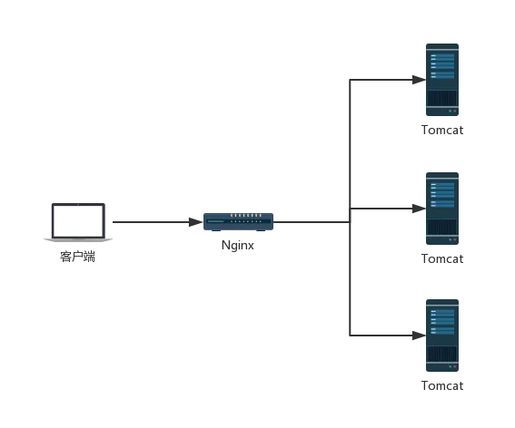
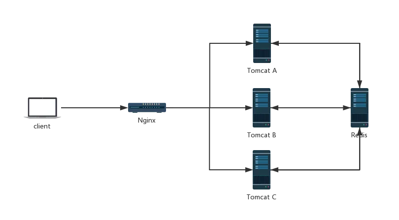
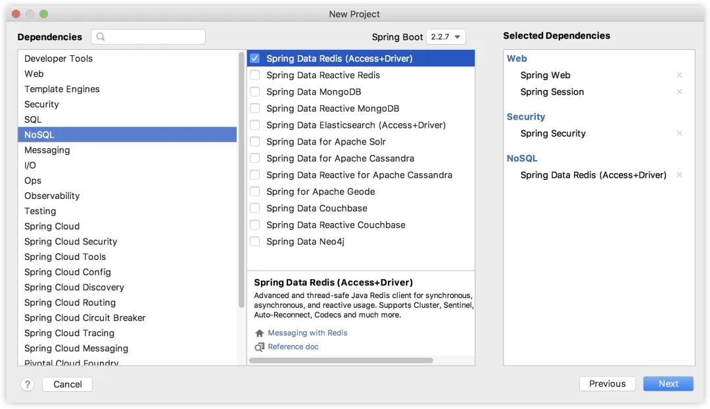
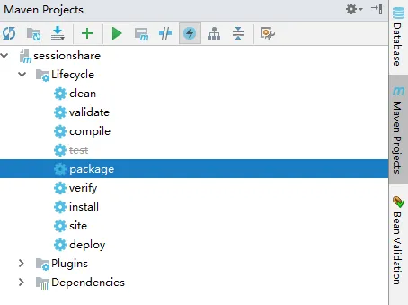
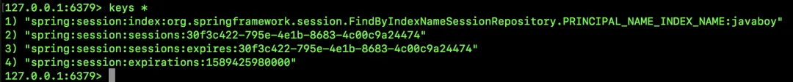
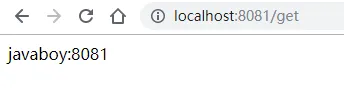
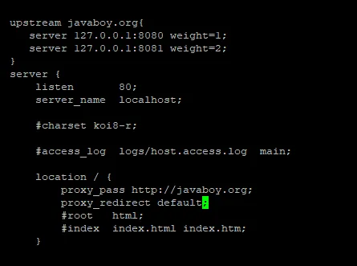
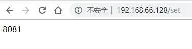
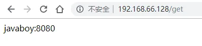

# 【SpringSecurity系列（十七）】Spring Security 如何处理 Session 共享

Original 江南一点雨 [江南一点雨](javascript:void(0);) *2021年05月31日 10:36*

《深入浅出Spring Security》一书已由清华大学出版社正式出版发行，感兴趣的小伙伴戳这里[->->>深入浅出Spring Security](https://mp.weixin.qq.com/s?__biz=MzI1NDY0MTkzNQ==&mid=2247492459&idx=1&sn=a3ffb25873c0905b8862fcb8334a68e7&scene=21#wechat_redirect)，一本书学会 Spring Security。

<iframe src="https://file.daihuo.qq.com/mp_cps_goods_card/v112/index.html" frameborder="0" scrolling="no" class="iframe_ad_container" style="width: 656.989px; height: 0px; border: none; box-sizing: border-box; display: block;"></iframe>


------

前面和大家聊了 Spring Security 如何像 QQ 一样，自动踢掉已登录用户（[Spring Boot + Vue 前后端分离项目，如何踢掉已登录用户？](https://mp.weixin.qq.com/s?__biz=MzI1NDY0MTkzNQ==&mid=2247488399&idx=1&sn=73a4875d272fcb1aa8c26f7e94bb692f&scene=21#wechat_redirect)），但是前面我们是基于单体应用的，如果我们的项目是集群化部署，这个问题该如何解决呢？

今天我们就来看看集群化部署，Spring Security 要如何处理 session 并发。

本文是 Spring Security 系列第 17 篇，阅读前面的文章有助于更好的理解本文：

1. [【SpringSecurity系列（一）】初识 Spring Security](https://mp.weixin.qq.com/s?__biz=MzI1NDY0MTkzNQ==&mid=2247492925&idx=2&sn=b3b8943bce05e97d4f84d92002dd6571&scene=21#wechat_redirect)
2. [【SpringSecurity系列（二）】Spring Security入门](https://mp.weixin.qq.com/s?__biz=MzI1NDY0MTkzNQ==&mid=2247493000&idx=2&sn=3d2862565e0f22968f1685199c6bdb87&scene=21#wechat_redirect)
3. [【SpringSecurity系列（三）】定制表单登录](https://mp.weixin.qq.com/s?__biz=MzI1NDY0MTkzNQ==&mid=2247493036&idx=2&sn=0a0356f4724830eb136d673c289437b6&scene=21#wechat_redirect)
4. [【SpringSecurity系列（四）】登录成功返回JSON数据](https://mp.weixin.qq.com/s?__biz=MzI1NDY0MTkzNQ==&mid=2247493044&idx=2&sn=e7a4f0fd826eeffffdb503cc2316bc50&scene=21#wechat_redirect)
5. [【SpringSecurity系列（五）】授权入门](https://mp.weixin.qq.com/s?__biz=MzI1NDY0MTkzNQ==&mid=2247493062&idx=2&sn=1480de83f67c3049e7efcc1cce21a918&scene=21#wechat_redirect)
6. [【SpringSecurity系列（六）】自定义登录用户](https://mp.weixin.qq.com/s?__biz=MzI1NDY0MTkzNQ==&mid=2247493130&idx=2&sn=7dff1f444fc652c23267a1ba89ea11d2&scene=21#wechat_redirect)
7. [【SpringSecurity系列（七）】通过 Spring Data Jpa 持久化用户数据](https://mp.weixin.qq.com/s?__biz=MzI1NDY0MTkzNQ==&mid=2247493175&idx=2&sn=55ab518981e7952137c0c247205eb6a3&scene=21#wechat_redirect)
8. [【SpringSecurity系列（八）】用户还能自动登录？](https://mp.weixin.qq.com/s?__biz=MzI1NDY0MTkzNQ==&mid=2247493198&idx=2&sn=a6362d7264bd50a35b5cc46ddbd334b0&scene=21#wechat_redirect)
9. [【SpringSecurity系列（九）】降低 RememberMe 的安全风险](https://mp.weixin.qq.com/s?__biz=MzI1NDY0MTkzNQ==&mid=2247493226&idx=2&sn=1ad5066cc96b6f2a7f05714693cb0aa0&scene=21#wechat_redirect)
10. [在微服务项目中，Spring Security 比 Shiro 强在哪？](https://mp.weixin.qq.com/s?__biz=MzI1NDY0MTkzNQ==&mid=2247488312&idx=1&sn=61e67f7ca0f8a55749dcb064b9456a38&scene=21#wechat_redirect)
11. [【SpringSecurity系列（十一）】自定义认证逻辑](https://mp.weixin.qq.com/s?__biz=MzI1NDY0MTkzNQ==&mid=2247493279&idx=2&sn=7c89d5a454487174a9ab86d6788b0c34&scene=21#wechat_redirect)
12. [【SpringSecurity系列（十二）】查看登录详情](https://mp.weixin.qq.com/s?__biz=MzI1NDY0MTkzNQ==&mid=2247493346&idx=2&sn=11f66f1851ad8e5101cb788c709519a1&scene=21#wechat_redirect)
13. [【SpringSecurity系列（十三）】只允许一台设备在线](https://mp.weixin.qq.com/s?__biz=MzI1NDY0MTkzNQ==&mid=2247493361&idx=2&sn=4c1a841c7cfa88e6d092274b6bec5556&scene=21#wechat_redirect)
14. [【SpringSecurity系列（十四）】自动踢掉上一个登录用户](https://mp.weixin.qq.com/s?__biz=MzI1NDY0MTkzNQ==&mid=2247493382&idx=2&sn=294bfe14613d5f97e817ee3612c6cf8c&scene=21#wechat_redirect)
15. [【SpringSecurity系列（十五）】请求防火墙默认已开启](https://mp.weixin.qq.com/s?__biz=MzI1NDY0MTkzNQ==&mid=2247493432&idx=2&sn=d13c83bd0d5577b47aa8d78561de8ead&scene=21#wechat_redirect)
16. [【SpringSecurity系列（十六）】会话固定攻击与防御](https://mp.weixin.qq.com/s?__biz=MzI1NDY0MTkzNQ==&mid=2247493486&idx=2&sn=2935be18e5fd8b3e3043cfad5dce5a35&scene=21#wechat_redirect)

## 1.集群会话方案

在传统的单服务架构中，一般来说，只有一个服务器，那么不存在 Session 共享问题，但是在分布式/集群项目中，Session 共享则是一个必须面对的问题，先看一个简单的架构图：



在这样的架构中，会出现一些单服务中不存在的问题，例如客户端发起一个请求，这个请求到达 Nginx 上之后，被 Nginx 转发到 Tomcat A 上，然后在 Tomcat A 上往 session 中保存了一份数据，下次又来一个请求，这个请求被转发到 Tomcat B  上，此时再去 Session 中获取数据，发现没有之前的数据。

### 1.1 session 共享

对于这一类问题的解决，目前比较主流的方案就是将各个服务之间需要共享的数据，保存到一个公共的地方（主流方案就是 Redis）：



当所有 Tomcat 需要往 Session 中写数据时，都往 Redis 中写，当所有 Tomcat 需要读数据时，都从 Redis 中读。这样，不同的服务就可以使用相同的 Session 数据了。

这样的方案，可以由开发者手动实现，即手动往 Redis 中存储数据，手动从 Redis 中读取数据，相当于使用一些 Redis 客户端工具来实现这样的功能，毫无疑问，手动实现工作量还是蛮大的。

一个简化的方案就是使用 Spring Session 来实现这一功能，Spring Session 就是使用 Spring 中的代理过滤器，将所有的 Session 操作拦截下来，自动的将数据 同步到 Redis 中，或者自动的从 Redis 中读取数据。

对于开发者来说，所有关于 Session 同步的操作都是透明的，开发者使用 Spring Session，一旦配置完成后，具体的用法就像使用一个普通的 Session 一样。

### 1.2 session 拷贝

session 拷贝就是不利用 redis，直接在各个 Tomcat 之间进行 session 数据拷贝，但是这种方式效率有点低，Tomcat A、B、C 中任意一个的 session 发生了变化，都需要拷贝到其他 Tomcat 上，如果集群中的服务器数量特别多的话，这种方式不仅效率低，还会有很严重的延迟。

所以这种方案一般作为了解即可。

### 1.3 粘滞会话

所谓的粘滞会话就是将相同 IP 发送来的请求，通过 Nginx 路由到同一个 Tomcat 上去，这样就不用进行 session 共享与同步了。这是一个办法，但是在一些极端情况下，可能会导致负载失衡（因为大部分情况下，都是很多人用同一个公网 IP）。

**所以，Session 共享就成为了这个问题目前主流的解决方案了。**

## 2.Session共享

### 2.1 创建工程

首先 创建一个 Spring Boot 工程，引入 Web、Spring Session、Spring Security 以及 Redis:



创建成功之后，pom.xml 文件如下：

```
<dependency>
    <groupId>org.springframework.boot</groupId>
    <artifactId>spring-boot-starter-data-redis</artifactId>
</dependency>
<dependency>
    <groupId>org.springframework.boot</groupId>
    <artifactId>spring-boot-starter-security</artifactId>
</dependency>
<dependency>
    <groupId>org.springframework.boot</groupId>
    <artifactId>spring-boot-starter-web</artifactId>
</dependency>
<dependency>
    <groupId>org.springframework.session</groupId>
    <artifactId>spring-session-data-redis</artifactId>
</dependency>
```

### 2.2 配置

```
spring.redis.password=123
spring.redis.port=6379
spring.redis.host=127.0.0.1

spring.security.user.name=javaboy
spring.security.user.password=123

server.port=8080
```

配置一下 Redis 的基本信息；Spring Security 为了简化，我就将用户名密码直接配置在 application.properties 中了，最后再配置一下项目端口号。

### 2.3 使用

配置完成后 ，就可以使用 Spring Session 了，其实就是使用普通的 HttpSession ，其他的 Session 同步到 Redis 等操作，框架已经自动帮你完成了：

```
@RestController
public class HelloController {
    @Value("${server.port}")
    Integer port;
    @GetMapping("/set")
    public String set(HttpSession session) {
        session.setAttribute("user", "javaboy");
        return String.valueOf(port);
    }
    @GetMapping("/get")
    public String get(HttpSession session) {
        return session.getAttribute("user") + ":" + port;
    }
}
```

考虑到一会 Spring Boot 将以集群的方式启动 ，为了获取每一个请求到底是哪一个 Spring  Boot 提供的服务，需要在每次请求时返回当前服务的端口号，因此这里我注入了 server.port 。

接下来 ，项目打包：



打包之后，启动项目的两个实例：

```
java -jar session-4-0.0.1-SNAPSHOT.jar --server.port=8080
java -jar session-4-0.0.1-SNAPSHOT.jar --server.port=8081
```

然后先访问 `localhost:8080/set` 向 `8080` 这个服务的 `Session` 中保存一个变量，第一次访问时会自动跳转到登录页面，输入用户名密码进行登录即可。访问成功后，数据就已经自动同步到 `Redis`  中 了 ：



然后，再调用 `localhost:8081/get` 接口，就可以获取到 `8080` 服务的 `session` 中的数据：



此时关于 session 共享的配置就已经全部完成了，session 共享的效果我们已经看到了。

### 2.4 Security 配置

Session 共享已经实现了，但是我们发现新的问题，在[Spring Boot + Vue 前后端分离项目，如何踢掉已登录用户？](https://mp.weixin.qq.com/s?__biz=MzI1NDY0MTkzNQ==&mid=2247488399&idx=1&sn=73a4875d272fcb1aa8c26f7e94bb692f&scene=21#wechat_redirect)一文中我们配置的 session 并发管理失效了。

也就是说，如果我添加了如下配置：

```
protected void configure(HttpSecurity http) throws Exception {
    http.authorizeRequests().anyRequest()
            ...
            .sessionManagement()
            .maximumSessions(1)
            .maxSessionsPreventsLogin(true);
}
```

现在这个配置不起作用，用户依然可以在多个浏览器上同时登录。

这是怎么回事呢？

首先建议大家回忆一下[Spring Boot + Vue 前后端分离项目，如何踢掉已登录用户？](https://mp.weixin.qq.com/s?__biz=MzI1NDY0MTkzNQ==&mid=2247488399&idx=1&sn=73a4875d272fcb1aa8c26f7e94bb692f&scene=21#wechat_redirect)一文。

在该文中，我们提到，会话注册表的维护默认是由 SessionRegistryImpl 来维护的，而 SessionRegistryImpl 的维护就是基于内存的维护。现在我们虽然启用了 Spring Session+Redis 做 Session 共享，但是 SessionRegistryImpl 依然是基于内存来维护的，所以我们要修改 SessionRegistryImpl 的实现逻辑。

修改方式也很简单，实际上 Spring Session 为我们提供了对应的实现类 SpringSessionBackedSessionRegistry，具体配置如下：

```
@Configuration
public class SecurityConfig extends WebSecurityConfigurerAdapter {
    @Autowired
    FindByIndexNameSessionRepository sessionRepository;
    @Override
    protected void configure(HttpSecurity http) throws Exception {
        http.authorizeRequests().anyRequest()
                ...
                .sessionManagement()
                .maximumSessions(1)
                .maxSessionsPreventsLogin(true)
                .sessionRegistry(sessionRegistry());
    }
    @Bean
    SpringSessionBackedSessionRegistry sessionRegistry() {
        return new SpringSessionBackedSessionRegistry(sessionRepository);
    }
}
```

我们在这里只需要提供一个 SpringSessionBackedSessionRegistry 的实例，并且将其配置到 sessionManagement 中去即可。以后，session 并发数据的维护将由 SpringSessionBackedSessionRegistry 来完成，而不是 SessionRegistryImpl，**如此，我们关于 session 并发的配置就生效了，在集群环境下，用户也只可以在一台设备上登录。**

为了让我们的案例看起更完美一些，接下来我们来引入 Nginx ，实现服务实例自动切换。

## 3.引入 Nginx

很简单，进入  Nginx 的安装目录的 conf 目录下（默认是在 `/usr/local/nginx/conf`），编辑 nginx.conf 文件:



在这段配置中：

1. upstream 表示配置上游服务器
2. javaboy.org 表示服务器集群的名字，这个可以随意取名字
3. upstream 里边配置的是一个个的单独服务
4. weight 表示服务的权重，意味者将有多少比例的请求从 Nginx 上转发到该服务上
5. location 中的 proxy_pass 表示请求转发的地址，`/` 表示拦截到所有的请求，转发转发到刚刚配置好的服务集群中
6. proxy_redirect 表示设置当发生重定向请求时，nginx 自动修正响应头数据（默认是 Tomcat 返回重定向，此时重定向的地址是 Tomcat 的地址，我们需要将之修改使之成为 Nginx 的地址）。

配置完成后，将本地的 Spring Boot 打包好的 jar 上传到 Linux ，然后在 Linux 上分别启动两个 Spring Boot 实例：

```
nohup java -jar session-4-0.0.1-SNAPSHOT.jar --server.port=8080 &
nohup java -jar session-4-0.0.1-SNAPSHOT.jar --server.port=8081 &
```

其中

- nohup 表示当终端关闭时，Spring Boot 不要停止运行
- & 表示让 Spring Boot 在后台启动

配置完成后，重启 Nginx：

```
/usr/local/nginx/sbin/nginx -s reload
```

Nginx 启动成功后，我们首先手动清除 Redis 上的数据，然后访问 `192.168.66.128/set` 表示向 `session` 中保存数据，这个请求首先会到达 `Nginx` 上，再由 `Nginx` 转发给某一个 `Spring Boot` 实例：



如上，表示端口为 `8081` 的 `Spring Boot` 处理了这个 `/set` 请求，再访问 `/get` 请求：



可以看到，`/get` 请求是被端口为 8080 的服务所处理的。

## 4.总结

本文主要向大家介绍了 Spring Session 的使用，另外也涉及到一些 Nginx 的使用 ，虽然本文较长，但是实际上 Spring Session 的配置没啥，涉及到的配置也都很简单。

如果大家没有在 SSM 架构中用过 Spring Session ，可能不太好理解我们在 Spring Boot 中使用 Spring Session 有多么方便，因为在 SSM 架构中，Spring Session 的使用要配置三个地方 ，一个是 web.xml 配置代理过滤器，然后在 Spring 容器中配置 Redis，最后再配置 Spring Session，步骤还是有些繁琐的，而 Spring Boot 中直接帮我们省去了这些繁琐的步骤！

好了 ，本文就说到这里，本文相关案例我已经上传到 GitHub ，大家可以自行下载:https://github.com/lenve/spring-security-samples

如果觉得有收获，记得点个在看鼓励下松哥哦～


加微信进群


一起切磋Web安全

（已添加松哥微信的小伙伴请勿重复添加）

SpringSecurity38

SpringSecurity · 目录


上一篇【SpringSecurity系列（十六）】会话固定攻击与防御下一篇【SpringSecurity系列（十八）】SpringBoot 如何防御 CSRF 攻击？


# 