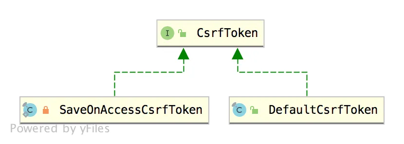
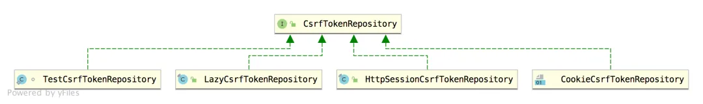

# 【SpringSecurity系列（十九）】Spring Security 中 CSRF 防御源码解析

Original 江南一点雨 [江南一点雨](javascript:void(0);) *2021年06月07日 12:16*

《深入浅出Spring Security》一书已由清华大学出版社正式出版发行，感兴趣的小伙伴戳这里[->->>深入浅出Spring Security](https://mp.weixin.qq.com/s?__biz=MzI1NDY0MTkzNQ==&mid=2247492459&idx=1&sn=a3ffb25873c0905b8862fcb8334a68e7&scene=21#wechat_redirect)，一本书学会 Spring Security。

<iframe src="https://file.daihuo.qq.com/mp_cps_goods_card/v112/index.html" frameborder="0" scrolling="no" class="iframe_ad_container" style="width: 656.989px; height: 0px; border: none; box-sizing: border-box; display: block;"></iframe>


------

[上篇文章](https://mp.weixin.qq.com/s?__biz=MzI1NDY0MTkzNQ==&mid=2247493615&idx=2&sn=dc132cfc80e07b709312a2567ec93678&scene=21#wechat_redirect)松哥和大家聊了什么是 CSRF 攻击，以及 CSRF 攻击要如何防御。主要和大家聊了 Spring Security 中处理该问题的几种办法。

今天松哥来和大家简单的看一下 Spring Security 中，CSRF 防御源码。

本文是本系列第 19 篇，阅读本系列前面文章有助于更好的理解本文：

1. [【SpringSecurity系列（一）】初识 Spring Security](https://mp.weixin.qq.com/s?__biz=MzI1NDY0MTkzNQ==&mid=2247492925&idx=2&sn=b3b8943bce05e97d4f84d92002dd6571&scene=21#wechat_redirect)
2. [【SpringSecurity系列（二）】Spring Security入门](https://mp.weixin.qq.com/s?__biz=MzI1NDY0MTkzNQ==&mid=2247493000&idx=2&sn=3d2862565e0f22968f1685199c6bdb87&scene=21#wechat_redirect)
3. [【SpringSecurity系列（三）】定制表单登录](https://mp.weixin.qq.com/s?__biz=MzI1NDY0MTkzNQ==&mid=2247493036&idx=2&sn=0a0356f4724830eb136d673c289437b6&scene=21#wechat_redirect)
4. [【SpringSecurity系列（四）】登录成功返回JSON数据](https://mp.weixin.qq.com/s?__biz=MzI1NDY0MTkzNQ==&mid=2247493044&idx=2&sn=e7a4f0fd826eeffffdb503cc2316bc50&scene=21#wechat_redirect)
5. [【SpringSecurity系列（五）】授权入门](https://mp.weixin.qq.com/s?__biz=MzI1NDY0MTkzNQ==&mid=2247493062&idx=2&sn=1480de83f67c3049e7efcc1cce21a918&scene=21#wechat_redirect)
6. [【SpringSecurity系列（六）】自定义登录用户](https://mp.weixin.qq.com/s?__biz=MzI1NDY0MTkzNQ==&mid=2247493130&idx=2&sn=7dff1f444fc652c23267a1ba89ea11d2&scene=21#wechat_redirect)
7. [【SpringSecurity系列（七）】通过 Spring Data Jpa 持久化用户数据](https://mp.weixin.qq.com/s?__biz=MzI1NDY0MTkzNQ==&mid=2247493175&idx=2&sn=55ab518981e7952137c0c247205eb6a3&scene=21#wechat_redirect)
8. [【SpringSecurity系列（八）】用户还能自动登录？](https://mp.weixin.qq.com/s?__biz=MzI1NDY0MTkzNQ==&mid=2247493198&idx=2&sn=a6362d7264bd50a35b5cc46ddbd334b0&scene=21#wechat_redirect)
9. [【SpringSecurity系列（九）】降低 RememberMe 的安全风险](https://mp.weixin.qq.com/s?__biz=MzI1NDY0MTkzNQ==&mid=2247493226&idx=2&sn=1ad5066cc96b6f2a7f05714693cb0aa0&scene=21#wechat_redirect)
10. [在微服务项目中，Spring Security 比 Shiro 强在哪？](https://mp.weixin.qq.com/s?__biz=MzI1NDY0MTkzNQ==&mid=2247488312&idx=1&sn=61e67f7ca0f8a55749dcb064b9456a38&scene=21#wechat_redirect)
11. [【SpringSecurity系列（十一）】自定义认证逻辑](https://mp.weixin.qq.com/s?__biz=MzI1NDY0MTkzNQ==&mid=2247493279&idx=2&sn=7c89d5a454487174a9ab86d6788b0c34&scene=21#wechat_redirect)
12. [【SpringSecurity系列（十二）】查看登录详情](https://mp.weixin.qq.com/s?__biz=MzI1NDY0MTkzNQ==&mid=2247493346&idx=2&sn=11f66f1851ad8e5101cb788c709519a1&scene=21#wechat_redirect)
13. [【SpringSecurity系列（十三）】只允许一台设备在线](https://mp.weixin.qq.com/s?__biz=MzI1NDY0MTkzNQ==&mid=2247493361&idx=2&sn=4c1a841c7cfa88e6d092274b6bec5556&scene=21#wechat_redirect)
14. [【SpringSecurity系列（十四）】自动踢掉上一个登录用户](https://mp.weixin.qq.com/s?__biz=MzI1NDY0MTkzNQ==&mid=2247493382&idx=2&sn=294bfe14613d5f97e817ee3612c6cf8c&scene=21#wechat_redirect)
15. [【SpringSecurity系列（十五）】请求防火墙默认已开启](https://mp.weixin.qq.com/s?__biz=MzI1NDY0MTkzNQ==&mid=2247493432&idx=2&sn=d13c83bd0d5577b47aa8d78561de8ead&scene=21#wechat_redirect)
16. [【SpringSecurity系列（十六）】会话固定攻击与防御](https://mp.weixin.qq.com/s?__biz=MzI1NDY0MTkzNQ==&mid=2247493486&idx=2&sn=2935be18e5fd8b3e3043cfad5dce5a35&scene=21#wechat_redirect)
17. [【SpringSecurity系列（十七）】Spring Security 如何处理 Session 共享](https://mp.weixin.qq.com/s?__biz=MzI1NDY0MTkzNQ==&mid=2247493552&idx=2&sn=76eb35d59aea46f0f7095314f7d988a0&scene=21#wechat_redirect)
18. [【SpringSecurity系列（十八）】SpringBoot 如何防御 CSRF 攻击？](https://mp.weixin.qq.com/s?__biz=MzI1NDY0MTkzNQ==&mid=2247493615&idx=2&sn=dc132cfc80e07b709312a2567ec93678&scene=21#wechat_redirect)

本文主要从两个方面来和大家讲解：

1. 返回给前端的 `_csrf` 参数是如何生成的。
2. 前端传来的 `_csrf` 参数是如何校验的。

## 1.随机字符串生成

我们先来看一下 Spring Security 中的 csrf 参数是如何生成的。

首先，Spring Security 中提供了一个保存 csrf 参数的规范，就是 CsrfToken：

```
public interface CsrfToken extends Serializable {
 String getHeaderName();
 String getParameterName();
 String getToken();

}
```

这里三个方法都好理解，前两个是获取 `_csrf` 参数的 key，第三个是获取 `_csrf` 参数的 value。

CsrfToken 有两个实现类，如下：



默认情况下使用的是 DefaultCsrfToken，我们来稍微看下 DefaultCsrfToken：

```
public final class DefaultCsrfToken implements CsrfToken {
 private final String token;
 private final String parameterName;
 private final String headerName;
 public DefaultCsrfToken(String headerName, String parameterName, String token) {
  this.headerName = headerName;
  this.parameterName = parameterName;
  this.token = token;
 }
 public String getHeaderName() {
  return this.headerName;
 }
 public String getParameterName() {
  return this.parameterName;
 }
 public String getToken() {
  return this.token;
 }
}
```

这段实现很简单，几乎没有添加额外的方法，就是接口方法的实现。

CsrfToken 相当于就是 `_csrf` 参数的载体。那么参数是如何生成和保存的呢？这涉及到另外一个类：

```
public interface CsrfTokenRepository {
 CsrfToken generateToken(HttpServletRequest request);
 void saveToken(CsrfToken token, HttpServletRequest request,
   HttpServletResponse response);
 CsrfToken loadToken(HttpServletRequest request);
}
```

这里三个方法：

1. generateToken 方法就是 CsrfToken 的生成过程。
2. saveToken 方法就是保存 CsrfToken。
3. loadToken 则是如何加载 CsrfToken。

CsrfTokenRepository 有四个实现类，在[上篇文章](https://mp.weixin.qq.com/s?__biz=MzI1NDY0MTkzNQ==&mid=2247488656&idx=2&sn=f00c9c9d51caf76caa76a813961ba38a&scene=21#wechat_redirect)中，我们用到了其中两个：HttpSessionCsrfTokenRepository 和 CookieCsrfTokenRepository，其中 HttpSessionCsrfTokenRepository 是默认的方案。



我们先来看下 HttpSessionCsrfTokenRepository 的实现：

```
public final class HttpSessionCsrfTokenRepository implements CsrfTokenRepository {
 private static final String DEFAULT_CSRF_PARAMETER_NAME = "_csrf";
 private static final String DEFAULT_CSRF_HEADER_NAME = "X-CSRF-TOKEN";
 private static final String DEFAULT_CSRF_TOKEN_ATTR_NAME = HttpSessionCsrfTokenRepository.class
   .getName().concat(".CSRF_TOKEN");
 private String parameterName = DEFAULT_CSRF_PARAMETER_NAME;
 private String headerName = DEFAULT_CSRF_HEADER_NAME;
 private String sessionAttributeName = DEFAULT_CSRF_TOKEN_ATTR_NAME;
 public void saveToken(CsrfToken token, HttpServletRequest request,
   HttpServletResponse response) {
  if (token == null) {
   HttpSession session = request.getSession(false);
   if (session != null) {
    session.removeAttribute(this.sessionAttributeName);
   }
  }
  else {
   HttpSession session = request.getSession();
   session.setAttribute(this.sessionAttributeName, token);
  }
 }
 public CsrfToken loadToken(HttpServletRequest request) {
  HttpSession session = request.getSession(false);
  if (session == null) {
   return null;
  }
  return (CsrfToken) session.getAttribute(this.sessionAttributeName);
 }
 public CsrfToken generateToken(HttpServletRequest request) {
  return new DefaultCsrfToken(this.headerName, this.parameterName,
    createNewToken());
 }
 private String createNewToken() {
  return UUID.randomUUID().toString();
 }
}
```

这段源码其实也很好理解：

1. saveToken 方法将 CsrfToken 保存在 HttpSession 中，将来再从 HttpSession 中取出和前端传来的参数做比较。
2. loadToken 方法当然就是从 HttpSession 中读取 CsrfToken 出来。
3. generateToken 是生成 CsrfToken 的过程，可以看到，生成的默认载体就是 DefaultCsrfToken，而 CsrfToken 的值则通过 createNewToken 方法生成，是一个 UUID 字符串。
4. 在构造 DefaultCsrfToken 是还有两个参数 headerName 和 parameterName，这两个参数是前端保存参数的 key。

这是默认的方案，适用于前后端不分的开发，具体用法可以参考[上篇文章](https://mp.weixin.qq.com/s?__biz=MzI1NDY0MTkzNQ==&mid=2247488656&idx=2&sn=f00c9c9d51caf76caa76a813961ba38a&scene=21#wechat_redirect)。

如果想在前后端分离开发中使用，那就需要 CsrfTokenRepository 的另一个实现类 CookieCsrfTokenRepository ，代码如下：

```
public final class CookieCsrfTokenRepository implements CsrfTokenRepository {
 static final String DEFAULT_CSRF_COOKIE_NAME = "XSRF-TOKEN";
 static final String DEFAULT_CSRF_PARAMETER_NAME = "_csrf";
 static final String DEFAULT_CSRF_HEADER_NAME = "X-XSRF-TOKEN";
 private String parameterName = DEFAULT_CSRF_PARAMETER_NAME;
 private String headerName = DEFAULT_CSRF_HEADER_NAME;
 private String cookieName = DEFAULT_CSRF_COOKIE_NAME;
 private boolean cookieHttpOnly = true;
 private String cookiePath;
 private String cookieDomain;
 public CookieCsrfTokenRepository() {
 }
 @Override
 public CsrfToken generateToken(HttpServletRequest request) {
  return new DefaultCsrfToken(this.headerName, this.parameterName,
    createNewToken());
 }
 @Override
 public void saveToken(CsrfToken token, HttpServletRequest request,
   HttpServletResponse response) {
  String tokenValue = token == null ? "" : token.getToken();
  Cookie cookie = new Cookie(this.cookieName, tokenValue);
  cookie.setSecure(request.isSecure());
  if (this.cookiePath != null && !this.cookiePath.isEmpty()) {
    cookie.setPath(this.cookiePath);
  } else {
    cookie.setPath(this.getRequestContext(request));
  }
  if (token == null) {
   cookie.setMaxAge(0);
  }
  else {
   cookie.setMaxAge(-1);
  }
  cookie.setHttpOnly(cookieHttpOnly);
  if (this.cookieDomain != null && !this.cookieDomain.isEmpty()) {
   cookie.setDomain(this.cookieDomain);
  }

  response.addCookie(cookie);
 }
 @Override
 public CsrfToken loadToken(HttpServletRequest request) {
  Cookie cookie = WebUtils.getCookie(request, this.cookieName);
  if (cookie == null) {
   return null;
  }
  String token = cookie.getValue();
  if (!StringUtils.hasLength(token)) {
   return null;
  }
  return new DefaultCsrfToken(this.headerName, this.parameterName, token);
 }
 public static CookieCsrfTokenRepository withHttpOnlyFalse() {
  CookieCsrfTokenRepository result = new CookieCsrfTokenRepository();
  result.setCookieHttpOnly(false);
  return result;
 }
 private String createNewToken() {
  return UUID.randomUUID().toString();
 }
}
```

和 HttpSessionCsrfTokenRepository 相比，这里 `_csrf` 数据保存的时候，都保存到 cookie 中去了，当然读取的时候，也是从 cookie 中读取，其他地方则和 HttpSessionCsrfTokenRepository 是一样的。

OK，这就是我们整个 `_csrf` 参数生成的过程。

总结一下，就是生成一个 CsrfToken，这个 Token，本质上就是一个 UUID 字符串，然后将这个 Token 保存到 HttpSession 中，或者保存到 Cookie 中，待请求到来时，从 HttpSession 或者 Cookie 中取出来做校验。

## 2.参数校验

那接下来就是校验了。

校验主要是通过 CsrfFilter 过滤器来进行，我们来看下核心的 doFilterInternal 方法：

```
protected void doFilterInternal(HttpServletRequest request,
  HttpServletResponse response, FilterChain filterChain)
    throws ServletException, IOException {
 request.setAttribute(HttpServletResponse.class.getName(), response);
 CsrfToken csrfToken = this.tokenRepository.loadToken(request);
 final boolean missingToken = csrfToken == null;
 if (missingToken) {
  csrfToken = this.tokenRepository.generateToken(request);
  this.tokenRepository.saveToken(csrfToken, request, response);
 }
 request.setAttribute(CsrfToken.class.getName(), csrfToken);
 request.setAttribute(csrfToken.getParameterName(), csrfToken);
 if (!this.requireCsrfProtectionMatcher.matches(request)) {
  filterChain.doFilter(request, response);
  return;
 }
 String actualToken = request.getHeader(csrfToken.getHeaderName());
 if (actualToken == null) {
  actualToken = request.getParameter(csrfToken.getParameterName());
 }
 if (!csrfToken.getToken().equals(actualToken)) {
  if (this.logger.isDebugEnabled()) {
   this.logger.debug("Invalid CSRF token found for "
     + UrlUtils.buildFullRequestUrl(request));
  }
  if (missingToken) {
   this.accessDeniedHandler.handle(request, response,
     new MissingCsrfTokenException(actualToken));
  }
  else {
   this.accessDeniedHandler.handle(request, response,
     new InvalidCsrfTokenException(csrfToken, actualToken));
  }
  return;
 }
 filterChain.doFilter(request, response);
}
```

这个方法我来稍微解释下：

1. 首先调用 tokenRepository.loadToken 方法读取 CsrfToken 出来，这个 tokenRepository 就是你配置的 CsrfTokenRepository 实例，CsrfToken 存在 HttpSession 中，这里就从 HttpSession 中读取，CsrfToken 存在 Cookie 中，这里就从 Cookie 中读取。
2. 如果调用 tokenRepository.loadToken 方法没有加载到 CsrfToken，那说明这个请求可能是第一次发起，则调用 tokenRepository.generateToken 方法生成 CsrfToken ，并调用 tokenRepository.saveToken 方法保存 CsrfToken。
3. 大家注意，这里还调用 request.setAttribute 方法存了一些值进去，这就是默认情况下，我们通过 jsp 或者 thymeleaf 标签渲染 `_csrf` 的数据来源。
4. requireCsrfProtectionMatcher.matches 方法则使用用来判断哪些请求方法需要做校验，默认情况下，"GET", "HEAD", "TRACE", "OPTIONS" 方法是不需要校验的。
5. 接下来获取请求中传递来的 CSRF 参数，先从请求头中获取，获取不到再从请求参数中获取。
6. 获取到请求传来的 csrf 参数之后，再和一开始加载到的 csrfToken 做比较，如果不同的话，就抛出异常。

如此之后，就完成了整个校验工作了。

## 3.LazyCsrfTokenRepository

前面我们说了 CsrfTokenRepository 有四个实现类，除了我们介绍的两个之外，还有一个 LazyCsrfTokenRepository，这里松哥也和大家做一个简单介绍。

在前面的 CsrfFilter 中大家发现，对于常见的 GET 请求实际上是不需要 CSRF 攻击校验的，但是，每当 GET 请求到来时，下面这段代码都会执行：

```
if (missingToken) {
 csrfToken = this.tokenRepository.generateToken(request);
 this.tokenRepository.saveToken(csrfToken, request, response);
}
```

生成 CsrfToken 并保存，但实际上却没什么用，因为 GET 请求不需要 CSRF 攻击校验。

所以，Spring Security 官方又推出了 LazyCsrfTokenRepository。

LazyCsrfTokenRepository 实际上不能算是一个真正的 CsrfTokenRepository，它是一个代理，可以用来增强 HttpSessionCsrfTokenRepository 或者 CookieCsrfTokenRepository 的功能：

```
public final class LazyCsrfTokenRepository implements CsrfTokenRepository {
 @Override
 public CsrfToken generateToken(HttpServletRequest request) {
  return wrap(request, this.delegate.generateToken(request));
 }
 @Override
 public void saveToken(CsrfToken token, HttpServletRequest request,
   HttpServletResponse response) {
  if (token == null) {
   this.delegate.saveToken(token, request, response);
  }
 }
 @Override
 public CsrfToken loadToken(HttpServletRequest request) {
  return this.delegate.loadToken(request);
 }
 private CsrfToken wrap(HttpServletRequest request, CsrfToken token) {
  HttpServletResponse response = getResponse(request);
  return new SaveOnAccessCsrfToken(this.delegate, request, response, token);
 }
 private static final class SaveOnAccessCsrfToken implements CsrfToken {
  private transient CsrfTokenRepository tokenRepository;
  private transient HttpServletRequest request;
  private transient HttpServletResponse response;

  private final CsrfToken delegate;

  SaveOnAccessCsrfToken(CsrfTokenRepository tokenRepository,
    HttpServletRequest request, HttpServletResponse response,
    CsrfToken delegate) {
   this.tokenRepository = tokenRepository;
   this.request = request;
   this.response = response;
   this.delegate = delegate;
  }
  @Override
  public String getToken() {
   saveTokenIfNecessary();
   return this.delegate.getToken();
  }
  private void saveTokenIfNecessary() {
   if (this.tokenRepository == null) {
    return;
   }

   synchronized (this) {
    if (this.tokenRepository != null) {
     this.tokenRepository.saveToken(this.delegate, this.request,
       this.response);
     this.tokenRepository = null;
     this.request = null;
     this.response = null;
    }
   }
  }

 }
}
```

这里，我说三点：

1. generateToken 方法，该方法用来生成 CsrfToken，默认 CsrfToken 的载体是 DefaultCsrfToken，现在换成了 SaveOnAccessCsrfToken。
2. SaveOnAccessCsrfToken 和 DefaultCsrfToken 并没有太大区别，主要是 getToken 方法有区别，在 SaveOnAccessCsrfToken 中，当开发者调用 getToken 想要去获取 csrfToken 时，才会去对 csrfToken 做保存操作（调用 HttpSessionCsrfTokenRepository 或者 CookieCsrfTokenRepository 的 saveToken 方法）。
3. LazyCsrfTokenRepository 自己的 saveToken 则做了修改，相当于放弃了 saveToken 的功能，调用该方法并不会做保存操作。

使用了 LazyCsrfTokenRepository 之后，只有在使用 csrfToken 时才会去存储它，这样就可以节省存储空间了。

LazyCsrfTokenRepository 的配置方式也很简单，在我们使用 Spring Security 时，如果对 csrf 不做任何配置，默认其实就是 LazyCsrfTokenRepository+HttpSessionCsrfTokenRepository 组合。

当然我们也可以自己配置，如下：

```
@Override
protected void configure(HttpSecurity http) throws Exception {
    http.authorizeRequests().anyRequest().authenticated()
            .and()
            .formLogin()
            .loginPage("/login.html")
            .successHandler((req,resp,authentication)->{
                resp.getWriter().write("success");
            })
            .permitAll()
            .and()
            .csrf().csrfTokenRepository(new LazyCsrfTokenRepository(CookieCsrfTokenRepository.withHttpOnlyFalse()));
}
```

## 4.小结

今天主要和小伙伴聊了一下 Spring Security 中 csrf 防御的原理。

整体来说，就是两个思路：

1. 生成 csrfToken 保存在 HttpSession 或者 Cookie 中。
2. 请求到来时，从请求中提取出来 csrfToken，和保存的 csrfToken 做比较，进而判断出当前请求是否合法。

好啦，不知道小伙伴们有没有 GET 到呢？如果觉得有收获，记得点个在看鼓励下松哥哦～


加微信进群


一起切磋Web安全

（已添加松哥微信的小伙伴请勿重复添加）

SpringSecurity38

SpringSecurity · 目录


上一篇【SpringSecurity系列（十八）】SpringBoot 如何防御 CSRF 攻击？下一篇【SpringSecurity系列（二十）】密码加密的两种姿势


# 