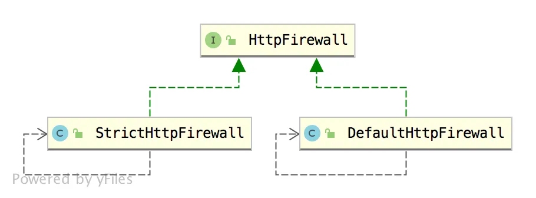
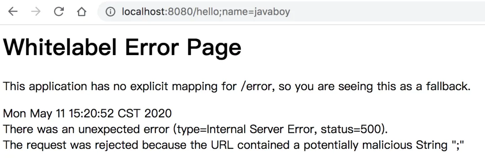
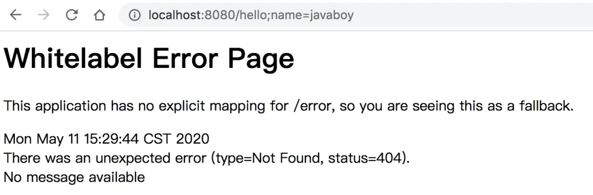

# 【SpringSecurity系列（十五）】请求防火墙默认已开启

Original 江南一点雨 [江南一点雨](javascript:void(0);) *2021年05月20日 10:36*

《深入浅出Spring Security》一书已由清华大学出版社正式出版发行，感兴趣的小伙伴戳这里[->->>深入浅出Spring Security](https://mp.weixin.qq.com/s?__biz=MzI1NDY0MTkzNQ==&mid=2247492459&idx=1&sn=a3ffb25873c0905b8862fcb8334a68e7&scene=21#wechat_redirect)，一本书学会 Spring Security。

<iframe src="https://file.daihuo.qq.com/mp_cps_goods_card/v112/index.html" frameborder="0" scrolling="no" class="iframe_ad_container" style="width: 656.989px; height: 0px; border: none; box-sizing: border-box; display: block;"></iframe>


------

之前有小伙伴表示，看 Spring Security 这么麻烦，不如自己写一个 Filter 拦截请求，简单实用。

自己写当然也可以实现，但是大部分情况下，大家都不是专业的 Web 安全工程师，所以考虑问题也不过就是认证和授权，这两个问题处理好了，似乎系统就很安全了。

其实不是这样的！

各种各样的 Web 攻击每天都在发生，什么固定会话攻击、csrf 攻击等等，如果不了解这些攻击，那么做出来的系统肯定也不能防御这些攻击。

使用 Spring Security 的好处就是，即使不了解这些攻击，也不用担心这些攻击，因为 Spring Security 已经帮你做好防御工作了。

我们常说相比于 Shiro，Spring Security 更加重量级，重量级有重量级的好处，比如功能全，安全管理更加完备。用了 Spring Security，你都不知道自己的系统有多安全！

今天我就来和大家聊一聊 Spring Security 中自带的防火墙机制。

本文是 Spring Security 系列的第 15 篇，阅读本系列前面的文章有助于更好的理解本文：

1. [【SpringSecurity系列（一）】初识 Spring Security](https://mp.weixin.qq.com/s?__biz=MzI1NDY0MTkzNQ==&mid=2247492925&idx=2&sn=b3b8943bce05e97d4f84d92002dd6571&scene=21#wechat_redirect)
2. [【SpringSecurity系列（二）】Spring Security入门](https://mp.weixin.qq.com/s?__biz=MzI1NDY0MTkzNQ==&mid=2247493000&idx=2&sn=3d2862565e0f22968f1685199c6bdb87&scene=21#wechat_redirect)
3. [【SpringSecurity系列（三）】定制表单登录](https://mp.weixin.qq.com/s?__biz=MzI1NDY0MTkzNQ==&mid=2247493036&idx=2&sn=0a0356f4724830eb136d673c289437b6&scene=21#wechat_redirect)
4. [【SpringSecurity系列（四）】登录成功返回JSON数据](https://mp.weixin.qq.com/s?__biz=MzI1NDY0MTkzNQ==&mid=2247493044&idx=2&sn=e7a4f0fd826eeffffdb503cc2316bc50&scene=21#wechat_redirect)
5. [【SpringSecurity系列（五）】授权入门](https://mp.weixin.qq.com/s?__biz=MzI1NDY0MTkzNQ==&mid=2247493062&idx=2&sn=1480de83f67c3049e7efcc1cce21a918&scene=21#wechat_redirect)
6. [【SpringSecurity系列（六）】自定义登录用户](https://mp.weixin.qq.com/s?__biz=MzI1NDY0MTkzNQ==&mid=2247493130&idx=2&sn=7dff1f444fc652c23267a1ba89ea11d2&scene=21#wechat_redirect)
7. [【SpringSecurity系列（七）】通过 Spring Data Jpa 持久化用户数据](https://mp.weixin.qq.com/s?__biz=MzI1NDY0MTkzNQ==&mid=2247493175&idx=2&sn=55ab518981e7952137c0c247205eb6a3&scene=21#wechat_redirect)
8. [【SpringSecurity系列（八）】用户还能自动登录？](https://mp.weixin.qq.com/s?__biz=MzI1NDY0MTkzNQ==&mid=2247493198&idx=2&sn=a6362d7264bd50a35b5cc46ddbd334b0&scene=21#wechat_redirect)
9. [【SpringSecurity系列（九）】降低 RememberMe 的安全风险](https://mp.weixin.qq.com/s?__biz=MzI1NDY0MTkzNQ==&mid=2247493226&idx=2&sn=1ad5066cc96b6f2a7f05714693cb0aa0&scene=21#wechat_redirect)
10. [在微服务项目中，Spring Security 比 Shiro 强在哪？](https://mp.weixin.qq.com/s?__biz=MzI1NDY0MTkzNQ==&mid=2247488312&idx=1&sn=61e67f7ca0f8a55749dcb064b9456a38&scene=21#wechat_redirect)
11. [【SpringSecurity系列（十一）】自定义认证逻辑](https://mp.weixin.qq.com/s?__biz=MzI1NDY0MTkzNQ==&mid=2247493279&idx=2&sn=7c89d5a454487174a9ab86d6788b0c34&scene=21#wechat_redirect)
12. [【SpringSecurity系列（十二）】查看登录详情](https://mp.weixin.qq.com/s?__biz=MzI1NDY0MTkzNQ==&mid=2247493346&idx=2&sn=11f66f1851ad8e5101cb788c709519a1&scene=21#wechat_redirect)
13. [【SpringSecurity系列（十三）】只允许一台设备在线](https://mp.weixin.qq.com/s?__biz=MzI1NDY0MTkzNQ==&mid=2247493361&idx=2&sn=4c1a841c7cfa88e6d092274b6bec5556&scene=21#wechat_redirect)
14. [【SpringSecurity系列（十四）】自动踢掉上一个登录用户](https://mp.weixin.qq.com/s?__biz=MzI1NDY0MTkzNQ==&mid=2247493382&idx=2&sn=294bfe14613d5f97e817ee3612c6cf8c&scene=21#wechat_redirect)

好了，不废话了，我们来看文章。

## 1.HttpFirewall

在 Spring Security 中提供了一个 HttpFirewall，看名字就知道这是一个请求防火墙，它可以自动处理掉一些非法请求。

HttpFirewall 目前一共有两个实现类：



一个是严格模式的防火墙设置，还有一个默认防火墙设置。

DefaultHttpFirewall 的限制相对于  StrictHttpFirewall 要宽松一些，当然也意味着安全性不如 StrictHttpFirewall。

Spring Security 中默认使用的是 StrictHttpFirewall。

## 2.防护措施

那么 StrictHttpFirewall 都是从哪些方面来保护我们的应用呢？我们来挨个看下。

### 2.1 只允许白名单中的方法

首先，对于请求的方法，只允许白名单中的方法，也就是说，不是所有的 HTTP 请求方法都可以执行。

这点我们可以从 StrictHttpFirewall 的源码中看出来：

```
public class StrictHttpFirewall implements HttpFirewall {
 private Set<String> allowedHttpMethods = createDefaultAllowedHttpMethods();
 private static Set<String> createDefaultAllowedHttpMethods() {
  Set<String> result = new HashSet<>();
  result.add(HttpMethod.DELETE.name());
  result.add(HttpMethod.GET.name());
  result.add(HttpMethod.HEAD.name());
  result.add(HttpMethod.OPTIONS.name());
  result.add(HttpMethod.PATCH.name());
  result.add(HttpMethod.POST.name());
  result.add(HttpMethod.PUT.name());
  return result;
 }
 private void rejectForbiddenHttpMethod(HttpServletRequest request) {
  if (this.allowedHttpMethods == ALLOW_ANY_HTTP_METHOD) {
   return;
  }
  if (!this.allowedHttpMethods.contains(request.getMethod())) {
   throw new RequestRejectedException("The request was rejected because the HTTP method \"" +
     request.getMethod() +
     "\" was not included within the whitelist " +
     this.allowedHttpMethods);
  }
 }
}
```

从这段代码中我们看出来，你的 HTTP 请求方法必须是 DELETE、GET、HEAD、OPTIONS、PATCH、POST 以及 PUT 中的一个，请求才能发送成功，否则的话，就会抛出 RequestRejectedException 异常。

那如果你想发送其他 HTTP 请求方法，例如 TRACE ，该怎么办呢？我们只需要自己重新提供一个 StrictHttpFirewall 实例即可，如下：

```
@Bean
HttpFirewall httpFirewall() {
    StrictHttpFirewall firewall = new StrictHttpFirewall();
    firewall.setUnsafeAllowAnyHttpMethod(true);
    return firewall;
}
```

其中，setUnsafeAllowAnyHttpMethod 方法表示不做 HTTP 请求方法校验，也就是什么方法都可以过。或者也可以通过 setAllowedHttpMethods 方法来重新定义可以通过的方法。

### 2.2 请求地址不能有分号

不知掉大家有没有试过，如果你使用了 Spring Security，请求地址是不能有 `;` 的，如果请求地址有 `;` ，就会自动跳转到如下页面：

' onerror="onImageErrorFunc(event)" onload="onLoadedFuncForQuickAction(event)">

可以看到，页面的提示中已经说了，因为你的请求地址中包含 `;`，所以请求失败。

什么时候请求地址中会包含 `;` 呢？不知道小伙伴们在使用 Shiro 的时候，有没有注意到，如果你禁用了 Cookie，那么 jsessionid 就会出现在地址栏里，像下面这样：

```
http://localhost:8080/hello;jsessionid=xx
```

这种传递 jsessionid 的方式实际上是非常不安全的（松哥后面的文章会和大家细聊这个问题），所以在 Spring Security 中，这种传参方式默认就禁用了。

当然，如果你希望地址栏能够被允许出现 `;` ，那么可以按照如下方式设置：

```
@Bean
HttpFirewall httpFirewall() {
    StrictHttpFirewall firewall = new StrictHttpFirewall();
    firewall.setAllowSemicolon(true);
    return firewall;
}
```

设置完成之后，再去访问相同的接口，可以看到，此时虽然还是报错，但是错误是 404 了，而不是一开始那个不允许 `;` 的错了。

' onerror="onImageErrorFunc(event)" onload="onLoadedFuncForQuickAction(event)">

**注意，在 URL 地址中，; 编码之后是 %3b 或者 %3B，所以地址中同样不能出现 %3b 或者 %3B**

#### 题外话

有的小伙伴可能不知道或者没用过，Spring3.2 开始，带来了一种全新的传参方式 @MatrixVariable。

@MatrixVariable 是 Spring3.2 中带来的功能，这种方式拓展了请求参数的传递格式，使得参数之间可以用 `;` 隔开，这种传参方式真是哪壶不开提哪壶。因为 Spring Security 默认就是禁止这种传参方式，所以一般情况下，如果你需要使用 @MatrixVariable 来标记参数，就得在 Spring Security 中额外放行。

接下来我通过一个简单的例子来和大家演示一下 @MatrixVariable 的用法。

我们新建一个 `/hello` 方法：

```
@RequestMapping(value = "/hello/{id}")
public void hello(@PathVariable Integer id,@MatrixVariable String name) {
    System.out.println("id = " + id);
    System.out.println("name = " + name);
}
```

另外我们还需要配置一下 SpringMVC，使 `;` 不要被自动移除了：

```
@Configuration
public class WebMvcConfig extends WebMvcConfigurationSupport {
    @Override
    protected void configurePathMatch(PathMatchConfigurer configurer) {
        UrlPathHelper urlPathHelper = new UrlPathHelper();
        urlPathHelper.setRemoveSemicolonContent(false);
        configurer.setUrlPathHelper(urlPathHelper);
    }
}
```

然后启动项目(注意，Spring Security 中也已经配置了允许 URL 中存在 `;`)，浏览器发送如下请求：

```
http://localhost:8080/hello/123;name=javaboy
```

控制台打印信息如下：

```
id = 123
name = javaboy
```

可以看到，@MatrixVariable 注解已经生效了。

### 2.3 必须是标准化 URL

请求地址必须是标准化 URL。

什么是标准化 URL？标准化 URL 主要从四个方面来判断，我们来看下源码：

StrictHttpFirewall#isNormalized：

```
private static boolean isNormalized(HttpServletRequest request) {
 if (!isNormalized(request.getRequestURI())) {
  return false;
 }
 if (!isNormalized(request.getContextPath())) {
  return false;
 }
 if (!isNormalized(request.getServletPath())) {
  return false;
 }
 if (!isNormalized(request.getPathInfo())) {
  return false;
 }
 return true;
}
```

getRequestURI 就是获取请求协议之外的字符；getContextPath 是获取上下文路径，相当于是 project 的名字；getServletPath 这个就是请求的 servlet 路径，getPathInfo 则是除过 contextPath 和 servletPath 之后剩余的部分。

这四种路径中，都不能包含如下字符串：

```
"./", "/../" or "/."
```

### 2.4 必须是可打印的 ASCII 字符

如果请求地址中包含不可打印的 ASCII 字符，请求则会被拒绝，我们可以从源码中看出端倪：

StrictHttpFirewall#containsOnlyPrintableAsciiCharacters

```
private static boolean containsOnlyPrintableAsciiCharacters(String uri) {
 int length = uri.length();
 for (int i = 0; i < length; i++) {
  char c = uri.charAt(i);
  if (c < '\u0020' || c > '\u007e') {
   return false;
  }
 }
 return true;
}
```

### 2.5 双斜杠不被允许

如果请求地址中出现双斜杠，这个请求也将被拒绝。双斜杠 `//` 使用 URL 地址编码之后，是 %2F%2F，其中 F 大小写无所谓，所以请求地址中也能不出现 "%2f%2f", "%2f%2F", "%2F%2f", "%2F%2F"。

如果你希望请求地址中可以出现 `//` ，可以按照如下方式配置：

```
@Bean
HttpFirewall httpFirewall() {
    StrictHttpFirewall firewall = new StrictHttpFirewall();
    firewall.setAllowUrlEncodedDoubleSlash(true);
    return firewall;
}
```

### 2.6 % 不被允许

如果请求地址中出现 %，这个请求也将被拒绝。URL 编码后的 % 是 %25，所以 %25 也不能出现在 URL 地址中。

如果希望请求地址中可以出现 %，可以按照如下方式修改：

```
@Bean
HttpFirewall httpFirewall() {
    StrictHttpFirewall firewall = new StrictHttpFirewall();
    firewall.setAllowUrlEncodedPercent(true);
    return firewall;
}
```

### 2.7 正反斜杠不被允许

如果请求地址中包含斜杠编码后的字符 %2F 或者 %2f ，则请求将被拒绝。

如果请求地址中包含反斜杠 \ 或者反斜杠编码后的字符 %5C 或者 %5c ，则请求将被拒绝。

如果希望去掉如上两条限制，可以按照如下方式来配置：

```
@Bean
HttpFirewall httpFirewall() {
    StrictHttpFirewall firewall = new StrictHttpFirewall();
    firewall.setAllowBackSlash(true);
    firewall.setAllowUrlEncodedSlash(true);
    return firewall;
}
```

### 2.8 `.` 不被允许

如果请求地址中存在 `.` 编码之后的字符 `%2e`、`%2E`，则请求将被拒绝。

如需支持，按照如下方式进行配置：

```
@Bean
HttpFirewall httpFirewall() {
    StrictHttpFirewall firewall = new StrictHttpFirewall();
    firewall.setAllowUrlEncodedPeriod(true);
    return firewall;
}
```

### 2.9 小结

需要强调一点，上面所说的这些限制，都是针对请求的 requestURI 进行的限制，而不是针对请求参数。例如你的请求格式是：

```
http://localhost:8080/hello?param=aa%2ebb
```

那么 2.7 小节说的限制和你没关系。

这个大家从 StrictHttpFirewall 源码中很容易看到：

```
public class StrictHttpFirewall implements HttpFirewall {
 @Override
 public FirewalledRequest getFirewalledRequest(HttpServletRequest request) throws RequestRejectedException {
  rejectForbiddenHttpMethod(request);
  rejectedBlacklistedUrls(request);
  rejectedUntrustedHosts(request);

  if (!isNormalized(request)) {
   throw new RequestRejectedException("The request was rejected because the URL was not normalized.");
  }

  String requestUri = request.getRequestURI();
  if (!containsOnlyPrintableAsciiCharacters(requestUri)) {
   throw new RequestRejectedException("The requestURI was rejected because it can only contain printable ASCII characters.");
  }
  return new FirewalledRequest(request) {
   @Override
   public void reset() {
   }
  };
 }
 private void rejectedBlacklistedUrls(HttpServletRequest request) {
  for (String forbidden : this.encodedUrlBlacklist) {
   if (encodedUrlContains(request, forbidden)) {
    throw new RequestRejectedException("The request was rejected because the URL contained a potentially malicious String \"" + forbidden + "\"");
   }
  }
  for (String forbidden : this.decodedUrlBlacklist) {
   if (decodedUrlContains(request, forbidden)) {
    throw new RequestRejectedException("The request was rejected because the URL contained a potentially malicious String \"" + forbidden + "\"");
   }
  }
 }
 private static boolean encodedUrlContains(HttpServletRequest request, String value) {
  if (valueContains(request.getContextPath(), value)) {
   return true;
  }
  return valueContains(request.getRequestURI(), value);
 }

 private static boolean decodedUrlContains(HttpServletRequest request, String value) {
  if (valueContains(request.getServletPath(), value)) {
   return true;
  }
  if (valueContains(request.getPathInfo(), value)) {
   return true;
  }
  return false;
 }
 private static boolean valueContains(String value, String contains) {
  return value != null && value.contains(contains);
 }
}
```

rejectedBlacklistedUrls 方法就是校验 URL 的，该方法逻辑很简单，我就不再赘述了。

**注意：虽然我们可以手动修改 Spring Security 中的这些限制，但是松哥不建议大家做任何修改，每一条限制都有它的原由，每放开一个限制，就会带来未知的安全风险。后面松哥在和大家分享 Web 中的安全攻击时，也会再次提到这些限制的作用，请小伙伴们保持关注哦。**

## 3.总结

没想到吧？Spring Security 竟然为你做了这么多事情！正好应了那句鸡汤：

> ❝
>
> 你所谓的岁月静好,不过是有人在替你负重前行。

好了，不知道大家有没有 GET 到呢？如果有收获，记得点个在看鼓励下松哥哦～


加微信进群


一起切磋Web安全

（已添加松哥微信的小伙伴请勿重复添加）

SpringSecurity38

SpringSecurity · 目录


上一篇【SpringSecurity系列（十四）】自动踢掉上一个登录用户下一篇【SpringSecurity系列（十六）】会话固定攻击与防御


# 