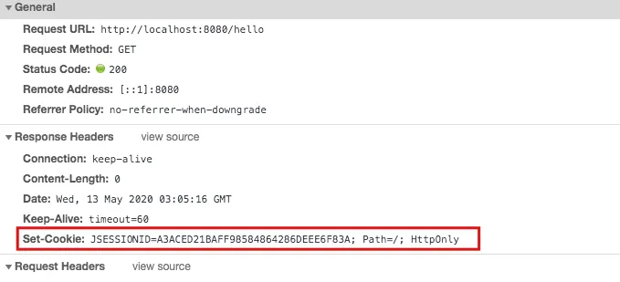
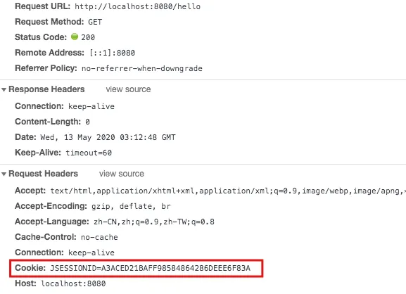
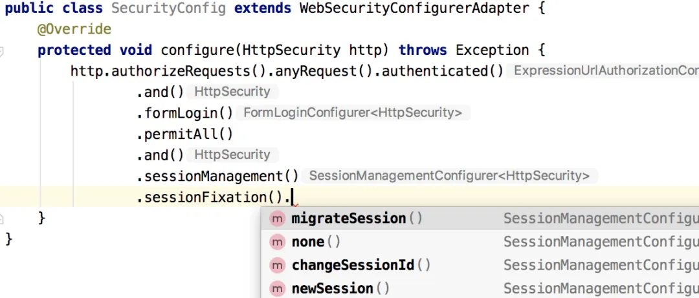

# 【SpringSecurity系列（十六）】会话固定攻击与防御

Original 江南一点雨 [江南一点雨](javascript:void(0);) *2021年05月25日 08:01*

《深入浅出Spring Security》一书已由清华大学出版社正式出版发行，感兴趣的小伙伴戳这里[->->>深入浅出Spring Security](https://mp.weixin.qq.com/s?__biz=MzI1NDY0MTkzNQ==&mid=2247492459&idx=1&sn=a3ffb25873c0905b8862fcb8334a68e7&scene=21#wechat_redirect)，一本书学会 Spring Security。

<iframe src="https://file.daihuo.qq.com/mp_cps_goods_card/v112/index.html" frameborder="0" scrolling="no" class="iframe_ad_container" style="width: 656.989px; height: 0px; border: none; box-sizing: border-box; display: block;"></iframe>


------

前两天和大家聊了 Spring Security 中的 session 并发问题，和小伙伴们聊了如何像 QQ 一样，用户在一台设备上登录成功之后，就会自动踢掉另一台设备上的登录。

当然，Spring Security 中，关于 session 的功能不仅仅是这些，之前和大家说**我们学习 Spring Security，也是学习各种各样的网络攻击与防御策略**，今天松哥就来和大家聊一个简单的：什么是会话固定攻击以及 Spring Security 中如何防止会话固定攻击。

本文是 Spring Security 系列的第 16 篇，阅读本系列前面的文章有助于更好的理解本文：

1. [【SpringSecurity系列（一）】初识 Spring Security](https://mp.weixin.qq.com/s?__biz=MzI1NDY0MTkzNQ==&mid=2247492925&idx=2&sn=b3b8943bce05e97d4f84d92002dd6571&scene=21#wechat_redirect)
2. [【SpringSecurity系列（二）】Spring Security入门](https://mp.weixin.qq.com/s?__biz=MzI1NDY0MTkzNQ==&mid=2247493000&idx=2&sn=3d2862565e0f22968f1685199c6bdb87&scene=21#wechat_redirect)
3. [【SpringSecurity系列（三）】定制表单登录](https://mp.weixin.qq.com/s?__biz=MzI1NDY0MTkzNQ==&mid=2247493036&idx=2&sn=0a0356f4724830eb136d673c289437b6&scene=21#wechat_redirect)
4. [【SpringSecurity系列（四）】登录成功返回JSON数据](https://mp.weixin.qq.com/s?__biz=MzI1NDY0MTkzNQ==&mid=2247493044&idx=2&sn=e7a4f0fd826eeffffdb503cc2316bc50&scene=21#wechat_redirect)
5. [【SpringSecurity系列（五）】授权入门](https://mp.weixin.qq.com/s?__biz=MzI1NDY0MTkzNQ==&mid=2247493062&idx=2&sn=1480de83f67c3049e7efcc1cce21a918&scene=21#wechat_redirect)
6. [【SpringSecurity系列（六）】自定义登录用户](https://mp.weixin.qq.com/s?__biz=MzI1NDY0MTkzNQ==&mid=2247493130&idx=2&sn=7dff1f444fc652c23267a1ba89ea11d2&scene=21#wechat_redirect)
7. [【SpringSecurity系列（七）】通过 Spring Data Jpa 持久化用户数据](https://mp.weixin.qq.com/s?__biz=MzI1NDY0MTkzNQ==&mid=2247493175&idx=2&sn=55ab518981e7952137c0c247205eb6a3&scene=21#wechat_redirect)
8. [【SpringSecurity系列（八）】用户还能自动登录？](https://mp.weixin.qq.com/s?__biz=MzI1NDY0MTkzNQ==&mid=2247493198&idx=2&sn=a6362d7264bd50a35b5cc46ddbd334b0&scene=21#wechat_redirect)
9. [【SpringSecurity系列（九）】降低 RememberMe 的安全风险](https://mp.weixin.qq.com/s?__biz=MzI1NDY0MTkzNQ==&mid=2247493226&idx=2&sn=1ad5066cc96b6f2a7f05714693cb0aa0&scene=21#wechat_redirect)
10. [在微服务项目中，Spring Security 比 Shiro 强在哪？](https://mp.weixin.qq.com/s?__biz=MzI1NDY0MTkzNQ==&mid=2247488312&idx=1&sn=61e67f7ca0f8a55749dcb064b9456a38&scene=21#wechat_redirect)
11. [【SpringSecurity系列（十一）】自定义认证逻辑](https://mp.weixin.qq.com/s?__biz=MzI1NDY0MTkzNQ==&mid=2247493279&idx=2&sn=7c89d5a454487174a9ab86d6788b0c34&scene=21#wechat_redirect)
12. [【SpringSecurity系列（十二）】查看登录详情](https://mp.weixin.qq.com/s?__biz=MzI1NDY0MTkzNQ==&mid=2247493346&idx=2&sn=11f66f1851ad8e5101cb788c709519a1&scene=21#wechat_redirect)
13. [【SpringSecurity系列（十三）】只允许一台设备在线](https://mp.weixin.qq.com/s?__biz=MzI1NDY0MTkzNQ==&mid=2247493361&idx=2&sn=4c1a841c7cfa88e6d092274b6bec5556&scene=21#wechat_redirect)
14. [【SpringSecurity系列（十四）】自动踢掉上一个登录用户](https://mp.weixin.qq.com/s?__biz=MzI1NDY0MTkzNQ==&mid=2247493382&idx=2&sn=294bfe14613d5f97e817ee3612c6cf8c&scene=21#wechat_redirect)
15. [【SpringSecurity系列（十五）】请求防火墙默认已开启](https://mp.weixin.qq.com/s?__biz=MzI1NDY0MTkzNQ==&mid=2247493432&idx=2&sn=d13c83bd0d5577b47aa8d78561de8ead&scene=21#wechat_redirect)

## 1.HttpSession

看前面文章的评论，我发现有的小伙伴对 HttpSession 还不太熟悉，所以在讲会话固定攻击之前，先来和大家说一说 HttpSession。

HttpSession 是一个服务端的概念，服务端生成的 HttpSession 都会有一个对应的 sessionid，这个 sessionid 会通过 cookie 传递给前端，前端以后发送请求的时候，就带上这个 sessionid 参数，服务端看到这个 sessionid 就会把这个前端请求和服务端的某一个 HttpSession 对应起来，形成“会话”的感觉。

浏览器关闭并不会导致服务端的 HttpSession 失效，想让服务端的 HttpSession 失效，要么手动调用 HttpSession#invalidate 方法；要么等到 session 自动过期；要么重启服务端。

但是为什么有的人会感觉浏览器关闭之后 session 就失效了呢？这是因为浏览器关闭之后，保存在浏览器里边的 sessionid 就丢了（默认情况下），所以当浏览器再次访问服务端的时候，服务端会给浏览器重新分配一个 sessionid ，这个 sessionid 和之前的 HttpSession 对应不上，所以用户就会感觉 session 失效。

注意前面我用了一个**默认情况下**，也就是说，我们可以通过手动配置，让浏览器重启之后 sessionid 不丢失，但是这样会带来安全隐患，所以一般不建议。

以 Spring Boot 为例，服务端生成 sessionid 之后，返回给前端的响应头是这样的：



在服务端的响应头中有一个 Set-Cookie 字段，该字段指示浏览器更新 sessionid，同时大家注意还有一个 HttpOnly 属性，这个表示通过 JS 脚本无法读取到 Cookie 信息，这样能有效的防止 XSS 攻击。

下一次浏览器再去发送请求的时候，就会自觉的携带上这个 jsessionid 了：



大家先对 HttpSession 有一个大致的了解，接下来我们再来看会话固定攻击。

## 2.会话固定攻击

什么是会话固定攻击？英文叫做 session fixation attack。

正常来说，只要你不关闭浏览器，并且服务端的 HttpSession 也没有过期，那么维系服务端和浏览器的 sessionid 是不会发生变化的，而会话固定攻击，则是利用这一机制，借助受害者用相同的会话 ID 获取认证和授权，然后利用该会话 ID 劫持受害者的会话以成功冒充受害者，造成会话固定攻击。

一般来说，会话固定攻击的流程是这样，以淘宝为例：

1. 攻击者自己可以正常访问淘宝网站，在访问的过程中，淘宝网站给攻击者分配了一个 sessionid。
2. 攻击者利用自己拿到的 sessionid 构造一个淘宝网站的链接，并把该链接发送给受害者。
3. 受害者使用该链接登录淘宝网站（该链接中含有 sessionid），登录成功后，一个合法的会话就成功建立。
4. 攻击者利用手里的 sessionid 冒充受害者。

在这个过程中，如果淘宝网站支持 URL 重写，那么攻击还会变得更加容易。

什么是 URL 重写？就是用户如果在浏览器中禁用了 cookie，那么 sessionid 自然也用不了了，所以有的服务端就支持把 sessionid 放在请求地址中：

```
http://www.taobao.com;jsessionid=xxxxxx
```

如果服务端支持这种 URL 重写，那么对于攻击者来说，按照上面的攻击流程，构造一个这种地址简直太简单不过了。

不过这种请求地址大家在 Spring Security 中应该很少见到（原因请见下文），但是在 Shiro 中可能多多少少有见过。

## 3.如何防御

这个问题的根源在 sessionid 不变，如果用户在未登录时拿到的是一个 sessionid，登录之后服务端给用户重新换一个 sessionid，就可以防止会话固定攻击了。

如果你使用了 Spring Security ，其实是不用担心这个问题的，因为 Spring Security 中默认已经做了防御工作了。

Spring Security 中的防御主要体现在三个方面：

**首先**就是[上篇文章讲的 StrictHttpFirewall](https://mp.weixin.qq.com/s?__biz=MzI1NDY0MTkzNQ==&mid=2247488496&idx=1&sn=3a153a207f112786a4ef1668f9d2a600&scene=21#wechat_redirect)，请求地址中有 `;` 请求会被直接拒绝。

**另一方面**就是响应的 Set-Cookie 字段中有 HttpOnly 属性，这种方式避免了通过 XSS 攻击来获取 Cookie 中的会话信息进而达成会话固定攻击。

**第三点**则是让 sessionid 变一下。既然问题是由于 sessionid 不变导致的，那我就让 sessionid 变一下。

具体配置如下：



可以看到，在这里，我们有四个选项：

1. migrateSession 表示在登录成功之后，创建一个新的会话，然后讲旧的 session 中的信息复制到新的 session 中，**默认即此**。
2. none 表示不做任何事情，继续使用旧的 session。
3. changeSessionId 表示 session 不变，但是会修改 sessionid，这实际上用到了 Servlet 容器提供的防御会话固定攻击。
4. newSession 表示登录后创建一个新的 session。

默认的 migrateSession ，在用户匿名访问的时候是一个 sessionid，当用户成功登录之后，又是另外一个 sessionid，这样就可以有效避免会话固定攻击。

这三种方案，可以让我们有效避免会话固定攻击！

## 4.小结

说了这么多，大家发现，如果你使用了 Spring Security，其实你什么都不用做，Spring Security 已经帮我们做好了会话固定攻击的防御工作，Spring Security 之强大，可见一斑。是不是非常 nice！

好啦，今天就和大家聊这样一个简单的话题，如果小伙伴们觉得有收获，记得点个在看鼓励下松哥哦～


加微信进群


一起切磋Web安全

（已添加松哥微信的小伙伴请勿重复添加）

SpringSecurity38

SpringSecurity · 目录


上一篇【SpringSecurity系列（十五）】请求防火墙默认已开启下一篇【SpringSecurity系列（十七）】Spring Security 如何处理 Session 共享


# 