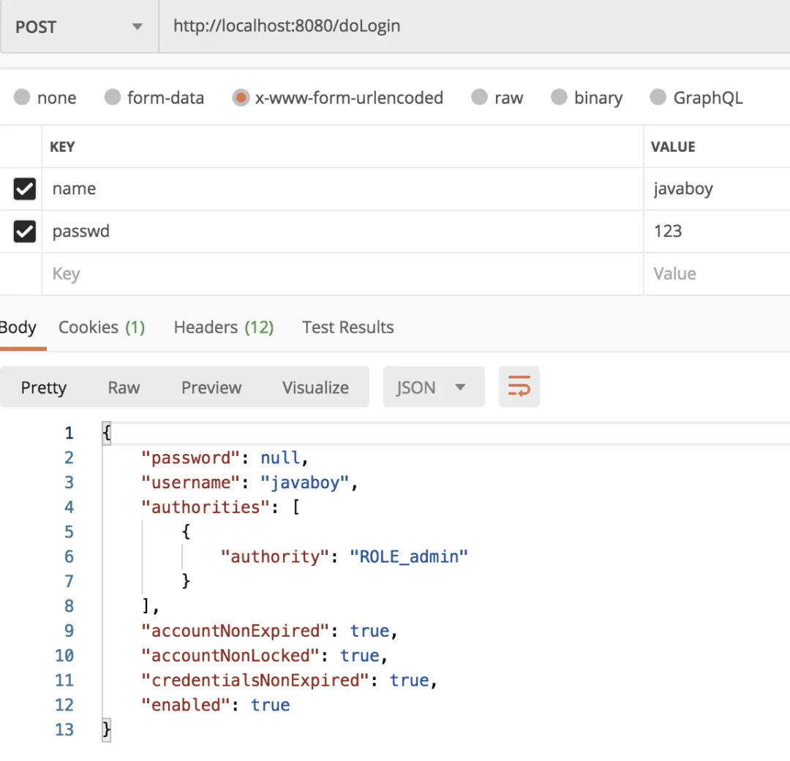
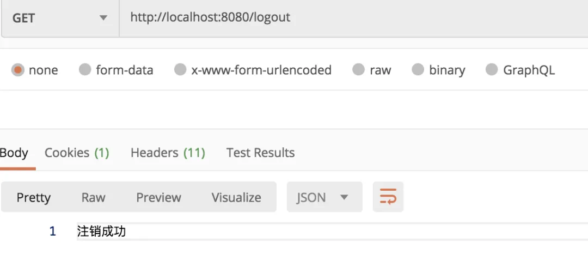

# 【SpringSecurity系列（四）】登录成功返回JSON数据

Original 江南一点雨 [江南一点雨](javascript:void(0);) *2021年04月14日 13:16*

《深入浅出Spring Security》一书已由清华大学出版社正式出版发行，感兴趣的小伙伴戳这里[->->>深入浅出Spring Security](https://mp.weixin.qq.com/s?__biz=MzI1NDY0MTkzNQ==&mid=2247492459&idx=1&sn=a3ffb25873c0905b8862fcb8334a68e7&scene=21#wechat_redirect)，一本书学会 Spring Security。

<iframe src="https://file.daihuo.qq.com/mp_cps_goods_card/v112/index.html" frameborder="0" scrolling="no" class="iframe_ad_container" style="width: 656.989px; height: 0px; border: none; box-sizing: border-box; display: block;"></iframe>


<svg data-v-8b461723="" xmlns="http://www.w3.org/2000/svg" viewBox="0 0 2 2" width="4px" height="4px" class="border_filler border_filler_lefttop"><path data-v-8b461723="" d="M1.85.005A2 2 0 000 2V0h2z" fill="#ffffff" fill-rule="evenodd"></path></svg>

<svg data-v-8b461723="" xmlns="http://www.w3.org/2000/svg" viewBox="0 0 2 2" width="4px" height="4px" class="border_filler border_filler_righttop"><path data-v-8b461723="" d="M1.85.005A2 2 0 000 2V0h2z" fill="#ffffff" fill-rule="evenodd"></path></svg>

<svg data-v-8b461723="" xmlns="http://www.w3.org/2000/svg" viewBox="0 0 2 2" width="4px" height="4px" class="border_filler border_filler_rightbot"><path data-v-8b461723="" d="M1.85.005A2 2 0 000 2V0h2z" fill="#ffffff" fill-rule="evenodd"></path></svg>

<svg data-v-8b461723="" xmlns="http://www.w3.org/2000/svg" viewBox="0 0 2 2" width="4px" height="4px" class="border_filler border_filler_leftbot"><path data-v-8b461723="" d="M1.85.005A2 2 0 000 2V0h2z" fill="#ffffff" fill-rule="evenodd"></path></svg>


，时长20:06


视频看完了，如果小伙伴们觉得松哥的视频风格还能接受，也可以看看松哥自制的 [Spring Boot + Vue 系列视频教程](https://mp.weixin.qq.com/s?__biz=MzI1NDY0MTkzNQ==&mid=2247488059&idx=1&sn=2ef3e7f14d262130ecab94a0b17de0ca&scene=21#wechat_redirect)

以下是视频笔记。

前两天有个小伙伴在微信上问松哥，这前后端分离开发后，认证这一块到底是使用传统的 session 还是使用像 JWT 这样的 token 来解决呢？

这确实代表了两种不同的方向。

传统的通过 session 来记录用户认证信息的方式我们可以理解为这是一种有状态登录，而 JWT 则代表了一种无状态登录。可能有小伙伴对这个概念还不太熟悉，我这里就先来科普一下有状态登录和无状态登录。

## 1. 无状态登录

### 1.1 什么是有状态

有状态服务，即服务端需要记录每次会话的客户端信息，从而识别客户端身份，根据用户身份进行请求的处理，典型的设计如 Tomcat 中的 Session。例如登录：用户登录后，我们把用户的信息保存在服务端 session 中，并且给用户一个 cookie 值，记录对应的 session，然后下次请求，用户携带 cookie 值来（这一步有浏览器自动完成），我们就能识别到对应 session，从而找到用户的信息。这种方式目前来看最方便，但是也有一些缺陷，如下：

- 服务端保存大量数据，增加服务端压力
- 服务端保存用户状态，不支持集群化部署

### 1.2 什么是无状态

微服务集群中的每个服务，对外提供的都使用 RESTful 风格的接口。而 RESTful 风格的一个最重要的规范就是：服务的无状态性，即：

- 服务端不保存任何客户端请求者信息
- 客户端的每次请求必须具备自描述信息，通过这些信息识别客户端身份

那么这种无状态性有哪些好处呢？

- 客户端请求不依赖服务端的信息，多次请求不需要必须访问到同一台服务器
- 服务端的集群和状态对客户端透明
- 服务端可以任意的迁移和伸缩（可以方便的进行集群化部署）
- 减小服务端存储压力

### 1.3 如何实现无状态

无状态登录的流程：

- 首先客户端发送账户名/密码到服务端进行认证
- 认证通过后，服务端将用户信息加密并且编码成一个 token，返回给客户端
- 以后客户端每次发送请求，都需要携带认证的 token
- 服务端对客户端发送来的 token 进行解密，判断是否有效，并且获取用户登录信息

### 1.4 各自优缺点

使用 session 最大的优点在于方便。你不用做过多的处理，一切都是默认的即可。松哥本系列前面几篇文章我们也都是基于 session 来讲的。

但是使用 session 有另外一个致命的问题就是如果你的前端是 Android、iOS、小程序等，这些 App 天然的就没有 cookie，如果非要用 session，就需要这些工程师在各自的设备上做适配，一般是模拟 cookie，从这个角度来说，在移动 App 遍地开花的今天，我们单纯的依赖 session 来做安全管理，似乎也不是特别理想。

这个时候 JWT 这样的无状态登录就展示出自己的优势了，这些登录方式所依赖的 token 你可以通过普通参数传递，也可以通过请求头传递，怎么样都行，具有很强的灵活性。

不过话说回来，如果你的前后端分离只是网页+服务端，其实没必要上无状态登录，基于 session 来做就可以了，省事又方便。

好了，说了这么多，本文我还是先来和大家说说基于 session 的认证，关于 JWT 的登录以后我会和大家细说，如果小伙伴们等不及，也可以先看看松哥之前发的关于 JWT 的教程：[Spring Security 结合 Jwt 实现无状态登录](https://mp.weixin.qq.com/s?__biz=MzI1NDY0MTkzNQ==&mid=2247486735&idx=1&sn=4208470b30cbe5b7bbfb0ab53e6914a3&scene=21#wechat_redirect)。

## 2. 登录交互

在[上篇文章](https://mp.weixin.qq.com/s?__biz=MzI1NDY0MTkzNQ==&mid=2247488138&idx=1&sn=25d18a61a14e4e6316537b6d45e43dd4&scene=21#wechat_redirect)中，松哥和大家捋了常见的登录参数配置问题，对于登录成功和登录失败，我们还遗留了一个回调函数没有讲，这篇文章就来和大家细聊一下。

### 2.1 前后端分离的数据交互

在前后端分离这样的开发架构下，前后端的交互都是通过 JSON 来进行，无论登录成功还是失败，都不会有什么服务端跳转或者客户端跳转之类。

登录成功了，服务端就返回一段登录成功的提示 JSON 给前端，前端收到之后，该跳转该展示，由前端自己决定，就和后端没有关系了。

登录失败了，服务端就返回一段登录失败的提示 JSON 给前端，前端收到之后，该跳转该展示，由前端自己决定，也和后端没有关系了。

首先把这样的思路确定了，基于这样的思路，我们来看一下登录配置。

### 2.2 登录成功

之前我们配置登录成功的处理是通过如下两个方法来配置的：

- defaultSuccessUrl
- successForwardUrl

这两个都是配置跳转地址的，适用于前后端不分的开发。除了这两个方法之外，还有一个必杀技，那就是 successHandler。

successHandler 的功能十分强大，甚至已经囊括了 defaultSuccessUrl 和 successForwardUrl 的功能。我们来看一下：

```
.successHandler((req, resp, authentication) -> {
    Object principal = authentication.getPrincipal();
    resp.setContentType("application/json;charset=utf-8");
    PrintWriter out = resp.getWriter();
    out.write(new ObjectMapper().writeValueAsString(principal));
    out.flush();
    out.close();
})
```

successHandler 方法的参数是一个 AuthenticationSuccessHandler 对象，这个对象中我们要实现的方法是 onAuthenticationSuccess。

onAuthenticationSuccess 方法有三个参数，分别是：

- HttpServletRequest
- HttpServletResponse
- Authentication

有了前两个参数，我们就可以在这里随心所欲的返回数据了。利用 HttpServletRequest 我们可以做服务端跳转，利用 HttpServletResponse 我们可以做客户端跳转，当然，也可以返回 JSON 数据。

第三个 Authentication 参数则保存了我们刚刚登录成功的用户信息。

配置完成后，我们再去登录，就可以看到登录成功的用户信息通过 JSON 返回到前端了，如下：



当然用户的密码已经被擦除掉了。擦除密码的问题，松哥之前和大家分享过，大家可以参考这篇文章：[手把手带你捋一遍 Spring Security 登录流程](https://mp.weixin.qq.com/s?__biz=MzI1NDY0MTkzNQ==&mid=2247488026&idx=2&sn=3bd96d91e822abf753a8e91142e036be&scene=21#wechat_redirect)

### 2.3 登录失败

登录失败也有一个类似的回调，如下：

```
.failureHandler((req, resp, e) -> {
    resp.setContentType("application/json;charset=utf-8");
    PrintWriter out = resp.getWriter();
    out.write(e.getMessage());
    out.flush();
    out.close();
})
```

失败的回调也是三个参数，前两个就不用说了，第三个是一个 Exception，对于登录失败，会有不同的原因，Exception 中则保存了登录失败的原因，我们可以将之通过 JSON 返回到前端。

当然大家也看到，在微人事中，我还挨个去识别了一下异常的类型，根据不同的异常类型，我们可以给用户一个更加明确的提示：

```
resp.setContentType("application/json;charset=utf-8");
PrintWriter out = resp.getWriter();
RespBean respBean = RespBean.error(e.getMessage());
if (e instanceof LockedException) {
    respBean.setMsg("账户被锁定，请联系管理员!");
} else if (e instanceof CredentialsExpiredException) {
    respBean.setMsg("密码过期，请联系管理员!");
} else if (e instanceof AccountExpiredException) {
    respBean.setMsg("账户过期，请联系管理员!");
} else if (e instanceof DisabledException) {
    respBean.setMsg("账户被禁用，请联系管理员!");
} else if (e instanceof BadCredentialsException) {
    respBean.setMsg("用户名或者密码输入错误，请重新输入!");
}
out.write(new ObjectMapper().writeValueAsString(respBean));
out.flush();
out.close();
```

这里有一个需要注意的点。

我们知道，当用户登录时，用户名或者密码输入错误，我们一般只给一个模糊的提示，即**用户名或者密码输入错误，请重新输入**，而不会给一个明确的诸如“用户名输入错误”或“密码输入错误”这样精确的提示，但是对于很多不懂行的新手小伙伴，他可能就会给一个明确的错误提示，这会给系统带来风险。

但是使用了 Spring Security 这样的安全管理框架之后，即使你是一个新手，也不会犯这样的错误。

在 Spring Security 中，用户名查找失败对应的异常是：

- UsernameNotFoundException

密码匹配失败对应的异常是：

- BadCredentialsException

但是我们在登录失败的回调中，却总是看不到 UsernameNotFoundException 异常，无论用户名还是密码输入错误，抛出的异常都是 BadCredentialsException。

这是为什么呢？松哥在之前的文章[手把手带你捋一遍 Spring Security 登录流程](https://mp.weixin.qq.com/s?__biz=MzI1NDY0MTkzNQ==&mid=2247488026&idx=2&sn=3bd96d91e822abf753a8e91142e036be&scene=21#wechat_redirect)中介绍过，在登录中有一个关键的步骤，就是去加载用户数据，我们再来把这个方法拎出来看一下（部分）：

```
public Authentication authenticate(Authentication authentication)
  throws AuthenticationException {
 try {
  user = retrieveUser(username,
    (UsernamePasswordAuthenticationToken) authentication);
 }
 catch (UsernameNotFoundException notFound) {
  logger.debug("User '" + username + "' not found");
  if (hideUserNotFoundExceptions) {
   throw new BadCredentialsException(messages.getMessage(
     "AbstractUserDetailsAuthenticationProvider.badCredentials",
     "Bad credentials"));
  }
  else {
   throw notFound;
  }
 }
}
```

从这段代码中，我们看出，在查找用户时，如果抛出了 UsernameNotFoundException，这个异常会被捕获，捕获之后，如果 hideUserNotFoundExceptions 属性的值为 true，就抛出一个 BadCredentialsException。相当于将 UsernameNotFoundException 异常隐藏了，而默认情况下，hideUserNotFoundExceptions 的值就为 true。

看到这里大家就明白了为什么无论用户还是密码写错，你收到的都是 BadCredentialsException 异常。

一般来说这个配置是不需要修改的，如果你一定要区别出来 UsernameNotFoundException 和 BadCredentialsException，我这里给大家提供三种思路：

1. 自己定义 DaoAuthenticationProvider 代替系统默认的，在定义时将 hideUserNotFoundExceptions 属性设置为 false。
2. 当用户名查找失败时，不抛出 UsernameNotFoundException 异常，而是抛出一个自定义异常，这样自定义异常就不会被隐藏，进而在登录失败的回调中根据自定义异常信息给前端用户一个提示。
3. 当用户名查找失败时，直接抛出 BadCredentialsException，但是异常信息为 “用户名不存在”。

三种思路仅供小伙伴们参考，除非情况特殊，一般不用修改这一块的默认行为。

官方这样做的好处是什么呢？很明显可以强迫开发者给一个模糊的异常提示，这样即使是不懂行的新手，也不会将系统置于危险之中。

好了，这样配置完成后，无论是登录成功还是失败，后端都将只返回 JSON 给前端了。

## 3. 未认证处理方案

那未认证又怎么办呢？

有小伙伴说，那还不简单，没有认证就访问数据，直接重定向到登录页面就行了，这没错，系统默认的行为也是这样。

但是在前后端分离中，这个逻辑明显是有问题的，如果用户没有登录就访问一个需要认证后才能访问的页面，这个时候，我们不应该让用户重定向到登录页面，而是给用户一个尚未登录的提示，前端收到提示之后，再自行决定页面跳转。

要解决这个问题，就涉及到 Spring Security 中的一个接口 `AuthenticationEntryPoint` ，该接口有一个实现类：`LoginUrlAuthenticationEntryPoint` ，该类中有一个方法 `commence`，如下：

```
/**
 * Performs the redirect (or forward) to the login form URL.
 */
public void commence(HttpServletRequest request, HttpServletResponse response,
  AuthenticationException authException) {
 String redirectUrl = null;
 if (useForward) {
  if (forceHttps && "http".equals(request.getScheme())) {
   redirectUrl = buildHttpsRedirectUrlForRequest(request);
  }
  if (redirectUrl == null) {
   String loginForm = determineUrlToUseForThisRequest(request, response,
     authException);
   if (logger.isDebugEnabled()) {
    logger.debug("Server side forward to: " + loginForm);
   }
   RequestDispatcher dispatcher = request.getRequestDispatcher(loginForm);
   dispatcher.forward(request, response);
   return;
  }
 }
 else {
  redirectUrl = buildRedirectUrlToLoginPage(request, response, authException);
 }
 redirectStrategy.sendRedirect(request, response, redirectUrl);
}
```

首先我们从这个方法的注释中就可以看出，这个方法是用来决定到底是要重定向还是要 forward，通过 Debug 追踪，我们发现默认情况下 useForward 的值为 false，所以请求走进了重定向。

那么我们解决问题的思路很简单，直接重写这个方法，在方法中返回 JSON 即可，不再做重定向操作，具体配置如下：

```
.csrf().disable().exceptionHandling()
.authenticationEntryPoint((req, resp, authException) -> {
            resp.setContentType("application/json;charset=utf-8");
            PrintWriter out = resp.getWriter();
            out.write("尚未登录，请先登录");
            out.flush();
            out.close();
        }
);
```

在 Spring Security 的配置中加上自定义的 `AuthenticationEntryPoint` 处理方法，该方法中直接返回相应的 JSON 提示即可。这样，如果用户再去直接访问一个需要认证之后才可以访问的请求，就不会发生重定向操作了，服务端会直接给浏览器一个 JSON 提示，浏览器收到 JSON 之后，该干嘛干嘛。

## 4. 注销登录

最后我们再来看看注销登录的处理方案。

注销登录我们前面说过，按照前面的配置，注销登录之后，系统自动跳转到登录页面，这也是不合适的，如果是前后端分离项目，注销登录成功后返回 JSON 即可，配置如下：

```
.and()
.logout()
.logoutUrl("/logout")
.logoutSuccessHandler((req, resp, authentication) -> {
    resp.setContentType("application/json;charset=utf-8");
    PrintWriter out = resp.getWriter();
    out.write("注销成功");
    out.flush();
    out.close();
})
.permitAll()
.and()
```

这样，注销成功之后，前端收到的也是 JSON 了：



好了，本文就和小伙伴们介绍下前后端分离中常见的 JSON 交互问题，

[](http://mp.weixin.qq.com/s?__biz=MzI1NDY0MTkzNQ==&mid=2247491260&idx=1&sn=6e733419aca3b6f1814d832350d4080a&chksm=e9c34cdcdeb4c5ca697e3cb15e920bcf7c5144b6c7311de440227380d4caa1ddd6925f5e15e5&scene=21#wechat_redirect)


加微信进群


一起切磋Web安全

（已添加松哥微信的小伙伴请勿重复添加）

**小伙伴们如果觉得文章有帮助，记得点一下在看哦。**

SpringSecurity38

SpringSecurity · 目录


上一篇【SpringSecurity系列（三）】定制表单登录下一篇【SpringSecurity系列（五）】授权入门


# 