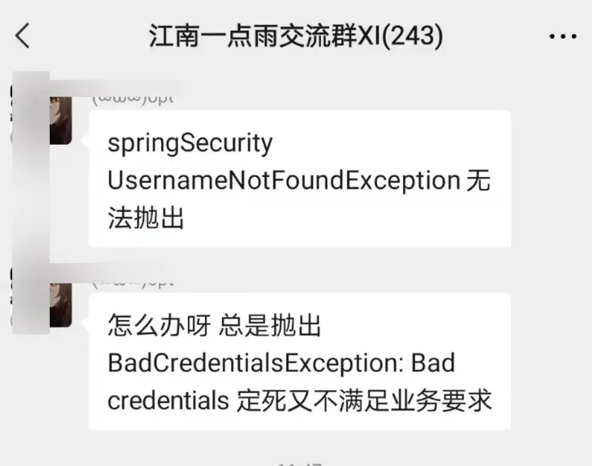
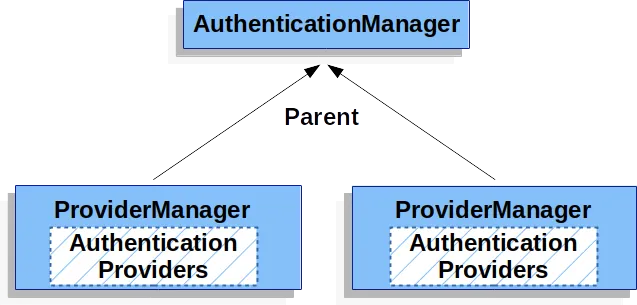
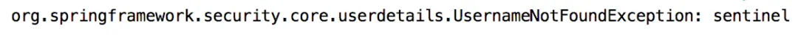

# 一个奇怪的登录需求

Original 江南一点雨 [江南一点雨](javascript:void(0);) *2021年09月27日 14:16*

一个奇怪的登录需求。

这是小伙伴们在微信群里的一个提问，我觉得很有意思：



虽然这并非一个典型需求，但是把这个问题解决了，有助于加深大家对于 Spring Security 的理解。

因此，松哥打算撸一篇文章和大家稍微聊聊这个话题。

## 1. 问题再现

可能有小伙伴还不明白这个问题，因此我先稍微解释一下。

当我们登录失败的时候，可能用户名写错，也可能密码写错，但是出于安全考虑，服务端一般不会明确提示是用户名写错了还是密码写错了，而只会给出一个模糊的用户名或者密码写错了。

然而对于很多新手程序员而言，可能并不了解这样一些“潜规则”，可能会给用户一个明确的提示，明确提示是用户名写错了还是密码写错了。

为了避免这一情况，Spring Security 通过封装，隐藏了用户名不存在的异常，导致开发者在开发的时候，只能获取到 BadCredentialsException，这个异常既表示用户名不存在，也表示用户密码输入错误。Spring Security 这样做是为了确保我们的系统足够安全。

然而由于种种原因，有时候我们又希望能够分别获取到用户不存在的异常和密码输入错误的异常，这个时候就需要我们对 Spring Security 进行一些简单的定制了。

## 2. 源码分析

首先我们要先找到问题发生的原因，发生的地方。

在 Spring Security 中，负责用户校验的工作的类有很多，我这里就不一一列举了（感兴趣的小伙伴可以查看《[深入浅出Spring Security](https://mp.weixin.qq.com/s?__biz=MzI1NDY0MTkzNQ==&mid=2247492459&idx=1&sn=a3ffb25873c0905b8862fcb8334a68e7&scene=21#wechat_redirect)》一书），我这里直接说我们涉及到的关键类 `AbstractUserDetailsAuthenticationProvider`。

这个类将负责用户名密码的校验工作，具体在 authenticate 方法里边，这个方法本来特别长，我这里只把和本文相关的代码列出来：

```
@Override
public Authentication authenticate(Authentication authentication) throws AuthenticationException {
  try {
   user = retrieveUser(username, (UsernamePasswordAuthenticationToken) authentication);
  }
  catch (UsernameNotFoundException ex) {
   if (!this.hideUserNotFoundExceptions) {
    throw ex;
   }
   throw new BadCredentialsException(this.messages
     .getMessage("AbstractUserDetailsAuthenticationProvider.badCredentials", "Bad credentials"));
  }
 }
}
```

retrieveUser 方法就是根据用户登录输入的用户名去查找用户，如果没找到，就会抛出一个 UsernameNotFoundException，这个异常被 catch 之后，会首先判断是否要隐藏这个异常，如果不隐藏，则原异常原封不动抛出来，如果需要隐藏，则抛出一个新的 BadCredentialsException 异常，BadCredentialsException 异常从字面理解就是密码输入错误的异常。

所以问题的核心就变成了 hideUserNotFoundExceptions 变量了。

这是一个 Boolean 类型的属性，默认是 true，`AbstractUserDetailsAuthenticationProvider` 也为该属性提供了 set 方法：

```
public void setHideUserNotFoundExceptions(boolean hideUserNotFoundExceptions) {
 this.hideUserNotFoundExceptions = hideUserNotFoundExceptions;
}
```

看起来修改 hideUserNotFoundExceptions 属性并不难！只要找到 `AbstractUserDetailsAuthenticationProvider` 的实例，然后调用相应的 set 方法就能修改了。

现在问题的核心变成了从哪里获取 `AbstractUserDetailsAuthenticationProvider` 的实例？

看名字就知道，`AbstractUserDetailsAuthenticationProvider` 是一个抽象类，所以它的实例其实就是它子类的实例，子类是谁？当然是负责用户密码校验工作的 `DaoAuthenticationProvider`。

这个知识点先记住，我们一会会用到。

## 3. 登录流程

为了弄明白这个问题，我们还需要搞懂 Spring Security 一个大致的认证流程，这个也非常重要。

首先大家知道，Spring Security 的认证工作主要是由 AuthenticationManager 来完成的，而 AuthenticationManager 则是一个接口，它的实现类是 ProviderManager。简而言之，Spring Security 中具体负责校验工作的是 ProviderManager#authenticate 方法。

但是校验工作并不是由 ProviderManager 直接完成的，ProviderManager 中管理了若干个 AuthenticationProvider，ProviderManager 会调用它所管理的 AuthenticationProvider 去完成校验工作，如下图：


另一方面，ProviderManager 又分为全局的和局部的。

当我们登录的时候，首先由局部的 ProviderManager 出场进行用户名密码的校验工作，如果校验成功，那么用户就登录成功了，如果校验失败，则会调用局部 ProviderManager 的 parent，也就是全局 ProviderManager 去完成校验工作，如果全局 ProviderManager 校验成功，就表示用户登录成功，如果全局 ProviderManager 校验失败，就表示用户登录失败，如下图：



OK，有了上面的知识储备，我们再来分析一下我们想要抛出 UsernameNotFoundException 该怎么做。

## 4. 思路分析

首先我们的用户校验工作在局部的 ProviderManager 中进行，局部的 ProviderManager 中管理了若干个 AuthenticationProvider，这若干个 AuthenticationProvider 中就有可能包含了我们所需要的 DaoAuthenticationProvider。那我们是否需要在这里调用 DaoAuthenticationProvider 的 setHideUserNotFoundExceptions 方法完成属性的修改呢？

松哥的建议是没必要！

为什么？

因为当用户登录的时候，首先去局部的 ProviderManager 中去校验，如果校验成功当然最好；如果校验失败，并不会立马抛出异常，而是去全局的 ProviderManager 中继续校验，这样即使我们在局部 ProviderManager 中抛出了 UsernameNotFoundException 也没用，因为最终这个异常能不能抛出来决定权在全局 ProviderManager 中（如果全局的 ProviderManager 所管理的 DaoAuthenticationProvider 没做任何特殊处理，那么局部 ProviderManager 中抛出来的 UsernameNotFoundException 异常最终还是会被隐藏）。

所以，我们要做的就是获取全局的 ProviderManager，进而获取到全局 ProviderManager 所管理的 DaoAuthenticationProvider，然后调用其 setHideUserNotFoundExceptions 方法修改相应属性值即可。

弄明白了原理，代码就简单了。

## 5. 具体实践

全局 ProviderManager 的修改在 `WebSecurityConfigurerAdapter#configure(AuthenticationManagerBuilder)` 类中，这里配置的 AuthenticationManagerBuilder 最终用来生成全局的 ProviderManager，所以我们的配置如下：

```
@Configuration
public class SecurityConfig extends WebSecurityConfigurerAdapter {

    @Override
    protected void configure(AuthenticationManagerBuilder auth) throws Exception {
        DaoAuthenticationProvider daoAuthenticationProvider = new DaoAuthenticationProvider();
        daoAuthenticationProvider.setHideUserNotFoundExceptions(false);
        InMemoryUserDetailsManager userDetailsService = new InMemoryUserDetailsManager();
        userDetailsService.createUser(User.withUsername("javaboy").password("{noop}123").roles("admin").build());
        daoAuthenticationProvider.setUserDetailsService(userDetailsService);
        auth.authenticationProvider(daoAuthenticationProvider);
    }

    @Override
    protected void configure(HttpSecurity http) throws Exception {
        http.authorizeRequests()
                .anyRequest().authenticated()
                .and()
                .formLogin()
                .failureHandler((request, response, exception) -> System.out.println(exception))
                .permitAll();

    }

}
```

这里的代码就简单了：

1. 创建一个 DaoAuthenticationProvider 对象。
2. 调用 DaoAuthenticationProvider 对象的 setHideUserNotFoundExceptions 方法，修改相应的属性值。
3. 为 DaoAuthenticationProvider 配置用户数据源。
4. 将 DaoAuthenticationProvider 设置给 auth 对象，auth 将用来生成全局的 ProviderManager。
5. 在另一个 configure 方法中，我们就配置一下登录回调即可，登录失败的时候，打印异常信息看看。

行啦。

接下来启动项目进行测试。输入一个错误的用户名，可以看到 IDEA 控制台会打印出如下信息：



可以看到，UsernameNotFoundException 异常已经抛出来了。

## 6. 小结

好啦，今天就和小伙伴们分享了一下在 Spring Security 中如何抛出 UsernameNotFoundException 异常，虽然这只是一个小众需求，但是可以加深大家对 Spring Security 的理解，感兴趣的小伙伴可以仔细琢磨下。

题外话：

> ❝
>
> 这个需求还有一个简单的实现方式，就是自定义一个用户不存在的异常，当在 UserDetailsService 中查找用户查找不到时，抛出自定义的异常，这个自定义的异常不会被隐藏，这个比较简单，我就不写代码了，感兴趣的小伙伴可以去试试。

SpringSecurity38

SpringSecurity · 目录


上一篇Spring Security 玩出花！两种方式 DIY 登录下一篇什么是计时攻击？Spring Security 中该如何防御？送书啦！


# 


Scan to Follow