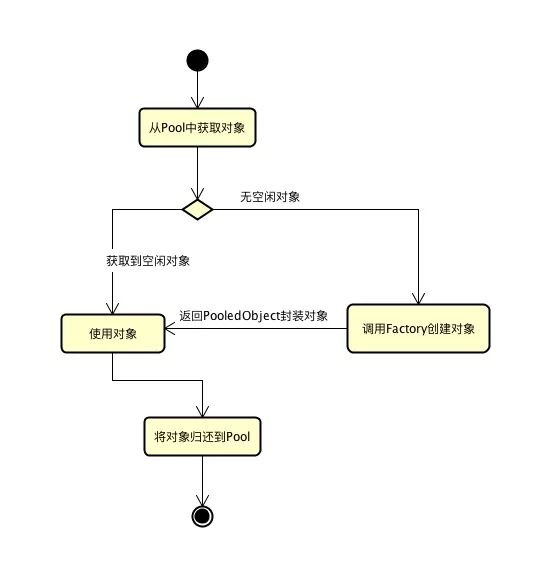
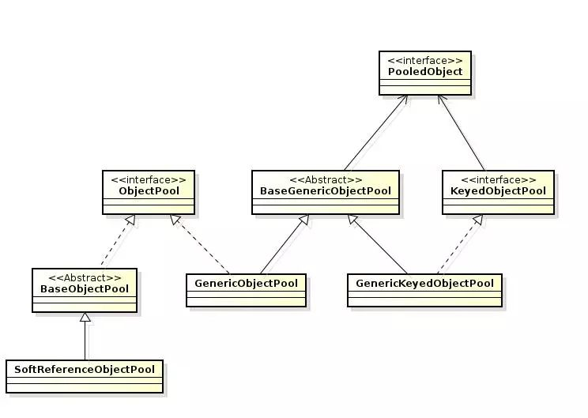
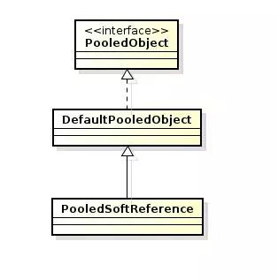
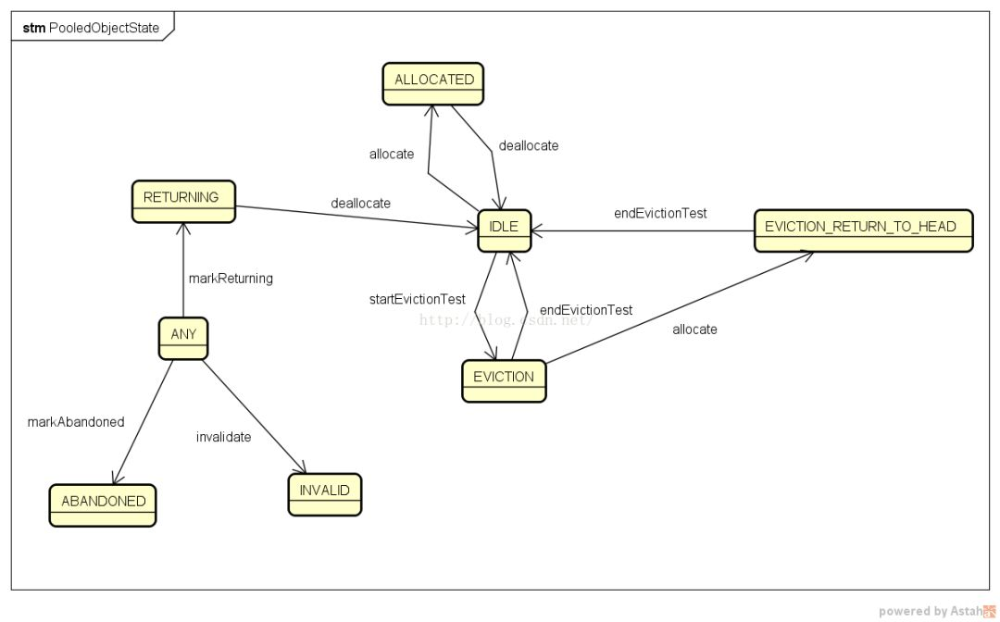

## [官网](https://commons.apache.org/proper/commons-pool/index.html)

我们系统中一般都会存在很多可重用并长期使用的对象，比如线程、TCP 连接、数据库连接等。虽然我们可以简单的在使用这些对象时进行创建、使用结束后销毁，但初始化和销毁对象的操作会造成一些资源消耗。我们可以使用对象池将这些对象集中管理，减少对象初始化和销毁的次数以节约资源消耗。

顾名思义，对象池简单来说就是存放对象的池子，可以存放任何对象，并对这些对象进行管理。它的优点就是可以复用池中的对象，避免了分配内存和创建堆中对象的开销；避免了释放内存和销毁堆中对象的开销，进而减少垃圾收集器的负担；避免内存抖动，不必重复初始化对象状态。对于构造和销毁比较耗时的对象来说非常合适。

当然，我们可以自己去实现一个对象池，不过要实现的比较完善还是要花上不少精力的。所幸的是， Apache 提供了一个通用的对象池技术的实现: Common Pool2，可以很方便的实现自己需要的对象池。Jedis 的内部对象池就是基于 Common Pool2 实现的。

## 核心接口

Common Pool2 的核心部分比较简单，围绕着三个基础接口和相关的实现类来实现：

- `ObjectPool`：对象池，持有对象并提供取/还等方法。
- `PooledObjectFactory`：对象工厂，提供对象的创建、初始化、销毁等操作，由 Pool 调用。一般需要使用者自己实现这些操作。
- `PooledObject`：池化对象，对池中对象的封装，封装对象的状态和一些其他信息。




Common Pool2 提供的最基本的实现就是由 Factory 创建对象并使用`PooledObject` 封装对象放入 Pool 中。

## 对象池实现



对象池有两个基础的接口 `ObjectPool` 和 `KeyedObjectPool`, 持有的对象都是由 `PooledObject` 封装的池化对象。 `KeyedObjectPool` 的区别在于其是用键值对的方式维护对象。

`ObjectPool` 和 `KeyedObjectPool` 分别有一个默认的实现类`GenericObjectPool` 和 `GenericKeyedObjectPool` 可以直接使用，他们的公共部分和配置被抽取到了 `BaseGenericObjectPool` 中。

`SoftReferenceObjectPool` 是一个比较特殊的实现，在这个对象池实现中，每个对象都会被包装到一个SoftReference中。SoftReference允许垃圾回收机制在需要释放内存时回收对象池中的对象，可以避免一些内存泄露的问题。

## ObjectPool

下面简单介绍一下 `ObjectPool` 接口的核心方法，`KeyedObjectPool` 和`ObjectPool` 类似，区别在于方法多了个参数： `K key`。

```java
public interface ObjectPool<T> {
    // 从池中获取一个对象，客户端在使用完对象后必须使用 returnObject 方法返还获取的对象
    T borrowObject() throws Exception, NoSuchElementException,
            IllegalStateException;

    // 将对象返还到池中。对象必须是从 borrowObject 方法获取到的
    void returnObject(T obj) throws Exception;

    // 使池中的对象失效，当获取到的对象被确定无效时（由于异常或其他问题），应该调用该方法
    void invalidateObject(T obj) throws Exception;

    // 池中当前闲置的对象数量
    int getNumIdle();

    // 当前从池中借出的对象的数量
    int getNumActive();

    // 清除池中闲置的对象
    void clear() throws Exception, UnsupportedOperationException;

    // 关闭这个池，并释放与之相关的资源
    void close();

    ...
}
```

## PooledObjectFactory

对象工厂，负责对象的创建、初始化、销毁和验证等工作。Factory 对象由`ObjectPool`持有并使用。

```java
public interface PooledObjectFactory<T> {
    // 创建一个池对象
    PooledObject<T> makeObject() throws Exception;

    // 销毁对象
    void destroyObject(PooledObject<T> p) throws Exception;

    // 验证对象是否可用
    boolean validateObject(PooledObject<T> p);

    // 激活对象，从池中取对象时会调用此方法
    void activateObject(PooledObject<T> p) throws Exception;

    // 钝化对象，向池中返还对象时会调用此方法
    void passivateObject(PooledObject<T> p) throws Exception;
}
```

Common Pool2 并没有提供 `PooledObjectFactory` 可以直接使用的子类实现，因为对象的创建、初始化、销毁和验证的工作无法通用化，需要由使用方自己实现。不过它提供了一个抽象子类 `BasePooledObjectFactory`，实现自己的工厂时可以继承`BasePooledObjectFactory`，就只需要实现 `create` 和 `wrap` 两个方法了。

## PooledObject





`PooledObject` 有两个实现类，`DefaultPooledObject` 是普通通用的实现，`PooledSoftReference` 使用 `SoftReference` 封装了对象，供`SoftReferenceObjectPool` 使用。

下面是 `PooledObject` 接口的一些核心方法：

```java
public interface PooledObject<T> extends Comparable<PooledObject<T>> {
    // 获取封装的对象
    T getObject();

    // 对象创建的时间
    long getCreateTime();

    // 对象上次处于活动状态的时间
    long getActiveTimeMillis();

    // 对象上次处于空闲状态的时间
    long getIdleTimeMillis();

    // 对象上次被借出的时间
    long getLastBorrowTime();

    // 对象上次返还的时间
    long getLastReturnTime();

    // 对象上次使用的时间
    long getLastUsedTime();

    // 将状态置为 PooledObjectState.INVALID
    void invalidate();

    // 更新 lastUseTime
    void use();

    // 获取对象状态
    PooledObjectState getState();

    // 将状态置为 PooledObjectState.ABANDONED
    void markAbandoned();

    // 将状态置为 PooledObjectState.RETURNING
    void markReturning();
}
```


## 对象池配置

对象池配置提供了对象池初始化所需要的参数，Common Pool2 中的基础配置类是`BaseObjectPoolConfig`。其有两个实现类分别为 `GenericObjectPoolConfig`和 `GenericKeyedObjectPoolConfig`，分别为 `GenericObjectPool` 和`GenericKeyedObjectPool` 所使用。

下面是一些重要的配置项：

- `lifo` 连接池放池对象的方式，true：放在空闲队列最前面，false：放在空闲队列最后面，默认为 true
- `fairness` 从池中获取/返还对象时是否使用公平锁机制，默认为 false
- `maxWaitMillis` 获取资源的等待时间。blockWhenExhausted 为 true 时有效。-1 代表无时间限制，一直阻塞直到有可用的资源
- `minEvictableIdleTimeMillis` 对象空闲的最小时间，达到此值后空闲对象将可能会被移除。-1 表示不移除；默认 30 分钟
- `softMinEvictableIdleTimeMillis` 同上，额外的条件是池中至少保留有 minIdle 所指定的个数的对象
- `numTestsPerEvictionRun` 资源回收线程执行一次回收操作，回收资源的数量。默认 3
- `evictionPolicyClassName` 资源回收策略，默认值 org.apache.commons.pool2.impl.DefaultEvictionPolicy
- `testOnCreate` 创建对象时是否调用 factory.validateObject 方法，默认 false
- `testOnBorrow` 取对象时是否调用 factory.validateObject 方法，默认 false
- `testOnReturn` 返还对象时是否调用 factory.validateObject 方法，默认 false
- `testWhileIdle` 池中的闲置对象是否由逐出器验证。无法验证的对象将从池中删除销毁。默认 false
- `timeBetweenEvictionRunsMillis` 回收资源线程的执行周期，默认 -1 表示不启用回收资源线程
- `blockWhenExhausted` 资源耗尽时，是否阻塞等待获取资源，默认 true

## 池化对象的状态

> 池化对象的状态定义在 PooledObjectState 枚举中，有以下值：

- `IDLE` 在池中，处于空闲状态
- `ALLOCATED` 被使用中
- `EVICTION` 正在被逐出器验证
- `VALIDATION` 正在验证
- `INVALID` 驱逐测试或验证失败并将被销毁
- `ABANDONED` 对象被客户端拿出后，长时间未返回池中，或没有调用 use 方法，即被标记为抛弃的

这些状态的转换逻辑大致如下图：



## Demo

最后，我们来实现一个简单的 Demo 来上手 Common Pool2 的使用，这是一个`StringBuffer` 的对象池的使用。

首先要实现工厂的创建、封装和销毁操作。对象池和池化对象封装使用默认实现就可以了。

```java
public class StringBufferFactory extends BasePooledObjectFactory<StringBuffer> {
    // 创建一个新的对象
    @Override
    public StringBuffer create() {
        return new StringBuffer();
    }

    // 封装为池化对象
    @Override
    public PooledObject<StringBuffer> wrap(StringBuffer buffer) {
        return new DefaultPooledObject<>(buffer);
    }

    // 使用完返还对象时将 StringBuffer 清空
    @Override
    public void passivateObject(PooledObject<StringBuffer> pooledObject) {
        pooledObject.getObject().setLength(0);
    }
}
```

然后就可以使用对象池了，基本的操作就是获取、返还和标记失效等。

```java
// 创建对象池配置
GenericObjectPoolConfig config = new GenericObjectPoolConfig();
// 创建对象工厂
PooledObjectFactory factory = new StringBufferFactory();
// 创建对象池
ObjectPool<StringBuffer> pool = new GenericObjectPool<>(factory, config);
StringReader in = new StringReader("abcdefg");StringBuffer buf = null;
try {
    // 从池中获取对象
    buf = pool.borrowObject();
    
    // 使用对象
    for (int c = in.read(); c != -1; c = in.read()) {
        buf.append((char) c);
    }
    return buf.toString();} catch (Exception e) {
    try {
        // 出现错误将对象置为失效
        pool.invalidateObject(buf);
        // 避免 invalidate 之后再 return 抛异常
        buf = null; 
    } catch (Exception ex) {
        // ignored
    }

    throw e;} finally {
    try {
        in.close();
    } catch (Exception e) {
        // ignored
    }
    
    try {
        if (null != buf) {
            // 使用完后必须 returnObject
            pool.returnObject(buf);
        }
    } catch (Exception e) {
        // ignored
    }
}
```

## 总结

Common Pool2 的应用非常广泛，在日常的开发工作中也有很多使用场景。它的整体架构也并不复杂，可以将其简单划分为 3 个角色和相关的配置、状态，掌握起来比较简单。而且 Common Pool2 官方也提供了一些通用的实现，有特殊的开发需求时也可以简单的扩展其提供的抽象类，可以满足大部分的日常开发需求。