# [Dubbo入门介绍及总结](https://www.bilibili.com/video/BV1mP411A7pd/?spm_id_from=autoNext&vd_source=2ba1930b0780248664ff1dcb89fc2a92)

## Dubbo是什么？

Dubbo是一个分布式服务框架，致力于提供高性能和透明化的RPC远程服务调用方案，以及SOA服务治理方案。简单的说，dubbo就是个服务框架，如果没有分布式的需求，其实是不需要用的，只有在分布式的时候，才有dubbo这样的分布式服务框架的需求，并且本质上是个服务调用的东东，说白了就是个远程服务调用的分布式框架（告别Web Service模式中的WSdl，以服务者与消费者的方式在dubbo上注册）

其核心部分包含: 1. 远程通讯: 提供对多种基于长连接的NIO框架抽象封装，包括多种线程模型，序列化，以及“请求-响应”模式的信息交换方式。 2. 集群容错: 提供基于接口方法的透明远程过程调用，包括多协议支持，以及软负载均衡，失败容错，地址路由，动态配置等集群支持。 3. 自动发现: 基于注册中心目录服务，使服务消费方能动态的查找服务提供方，使地址透明，使服务提供方可以平滑增加或减少机器。

## **分布式简要说明**

**Dubbo是用于分布式系统的框架所以我们要先了解什么是分布式**
分布式系统是若干独立 计算机的集合，这些计算机对于用户来说就像单个相关系统。

老式系统(单一应用架构)就是把一个系统，统一放到一个服务器当中然后每一个服务器上放一个系统，如果说要更新代码的话，每一个服务器上的系统都要重新去部署十分的麻烦。

而分布式系统就是将一个完整的系统拆分成多个不同的服务，然后在将每一个服务单独的放到一个服务器当中。

## **分应用架构以及发展演变**

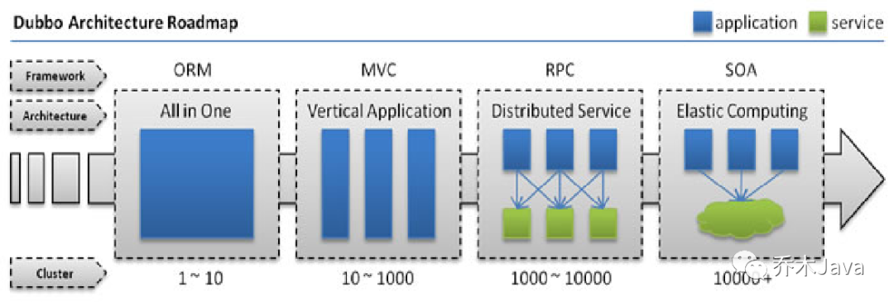

## ORM架构

单一应用架构：一个项目装到一个服务器当中，也可以运行多个服务器每一个服务器当中都装一个项目。
缺点：1.如果要添加某一个功能的话就要把一个项目重新打包，在分别部署到每一个服务器当中去。

2.如果后期项目越来越大的话单台服务器跑一个项目压力会很大的。会不利于维护，开发和程序的性能。

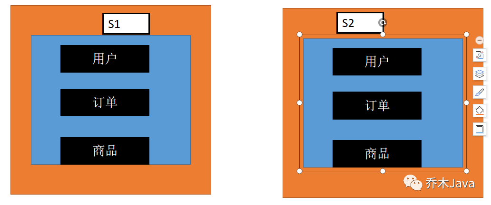

## MVC架构

垂直应用架构：将应用切割成几个互不相干的小应用，在将每个小应用独立放到一个服务器上，如果哪一个应用的访问数量多就多加几台服务器。

缺点：应用不可能完全独立，大量的应用之间需要交互


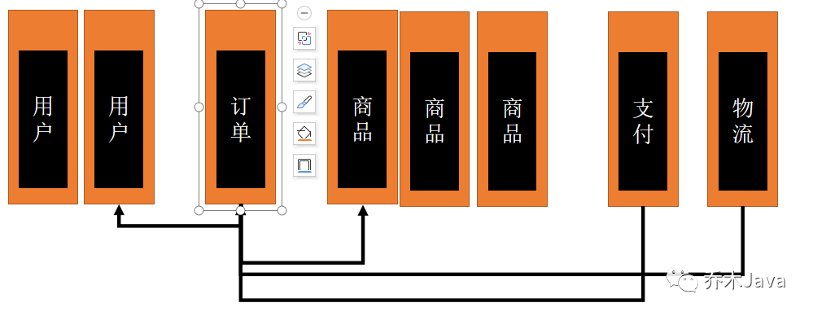

## 分布式服务架构RPC

分布式应用架构(远程过程调用)：当垂直应用越来越多，应用之间交互不可避免，将核心业务抽取出来，作为独立的服务，逐渐形成稳定的服务中心，使前端应用能更快速的响应多变的市场需求。

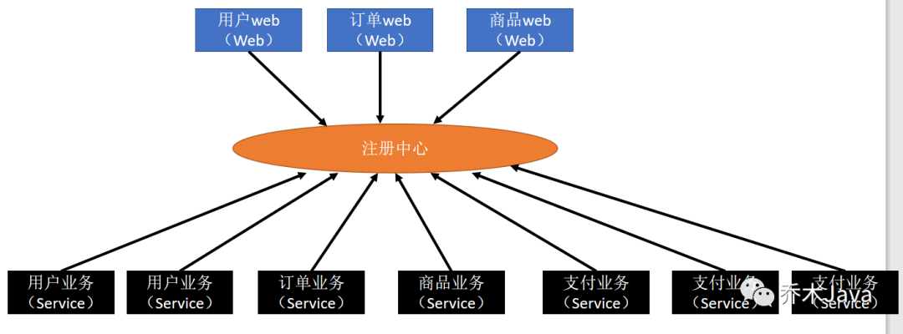


## 分什么是RPC?

**RPC（Remote Procedure Call）—远程过程调用**，它是一种通过网络从远程计算机程序上请求服务，而不需要了解底层网络技术的协议。也就是说两台服务器A，B，一个应用部署在A服务器上，想要调用B服务器上应用提供的方法，由于不在一个内存空间，不能直接调用，需要通过网络来表达调用的语义和传达调用的数据。

**RPC基本原理**

****

1.Client像调用本地服务似的调用远程服务

2.Client stub接收到调用后，将方法、参数序列化

3.客户端通过sockets将消息发送到服务端

4.Server stub 收到消息后进行解码（将消息对象反序列化）

5.Server stub 根据解码结果调用本地的服务

6.本地服务执行(对于服务端来说是本地执行)并将结果返回给Server stub

7.Server stub将返回结果打包成消息（将结果消息对象序列化）

8.服务端通过sockets将消息发送到客户端

9.Client stub接收到结果消息，并进行解码（将结果消息发序列化）

10.客户端得到最终结果。

**RPC 调用分以下两种：**
**同步调用**：客户方等待调用执行完成并返回结果。
**异步调用**：客户方调用后不用等待执行结果返回，但依然可以通过回调通知等方式获取返回结果。若客户方不关心调用返回结果，则变成单向异步调用，单向调用不用返回结果。


## Dubbo设计架构


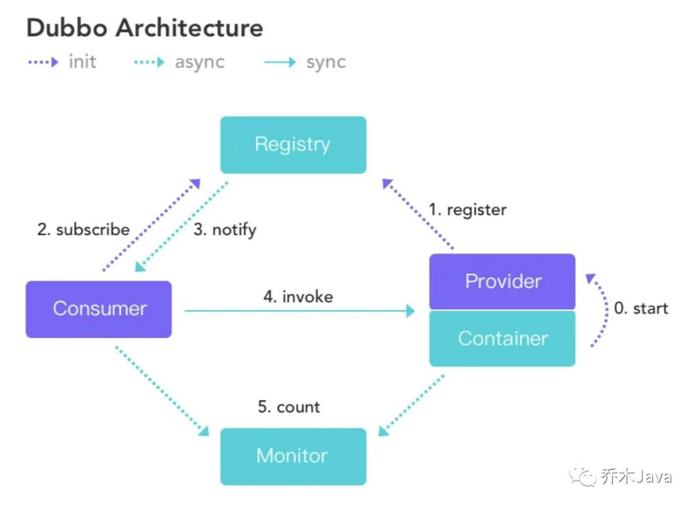

节点角色说明：

Provider: 暴露服务的服务提供方。

Consumer: 调用远程服务的服务消费方。

Registry: 服务注册与发现的注册中心。

Monitor: 统计服务的调用次数和调用时间的监控中心。

Container: 服务运行容器。

## Dubbo特性

**（1）服务注册中心**

- 相比Hessian类RPC框架，Dubbo有自己的服务中心， 写好的服务可以注册到服务中心， 客户端从服务中心寻找服务，然后再到相应的服务提供者机器获取服务。通过服务中心可以实现集群、负载均衡、高可用(容错) 等重要功能。
- 服务中心一般使用zookeeper实现，也有redis和其他一些方式。以使用zookeeper作为服务中心为例，服务提供者启动后会在zookeeper的/dubbo节点下创建提供的服务节点，包含服务提供者ip、port等信息。服务提供者关闭时会从zookeeper中移除对应的服务。
- 服务使用者会从注册中心zookeeper中寻找服务，同一个服务可能会有多个提供者，Dubbo会帮我们找到合适的服务提供者，也就是针对服务提供者的负载均衡。

**（****2）负载均衡**

- 当同一个服务有多个提供者在提供服务时，客户端如何正确的选择提供者实 现负载均衡呢？dubbo也给我们提供了几种方案： 

- - random `随机`选提供者，并可以给提供者设置权重
  - roundrobin `轮询`选择提供者
  - leastactive 最少活跃调用数，相同活跃数的随机，活跃数：指调用前后计数差。使慢的提供者收到更少请求，因为越慢的提供者的调用前后计数差会越大。
  - consistenthash 一致性hash，相同参数的请求发到同一台机器上。

**（3）简化测试，允许直连提供者**
在开发阶段为了方便测试，通常系统客户端能指定调用某个服务提供者，那么可以在引用服务时加一个url参数去指定服务提供者。配置如下：

- 

```
 <dubbo:reference id="xxxService"interface="com.alibaba.xxx.XxxService"url="dubbo://localhost:20890"/>
```

## Dubbo环境搭建和Zookeeper中心

Dubbo官方文档: http://dubbo.apache.org/docs/v2.7/user/quick-start/

我这里使用docker,直接拉取zookeeper，安装启动就好了，这里不做详细说明

可以参考下面文档

https://blog.csdn.net/qq_41107231/article/details/106457816

### zookeeper监控中心的配置

dubbo admin 0.2.0的gihub链接:https://github.com/apache/dubbo-admin

第一步先拉取源代码

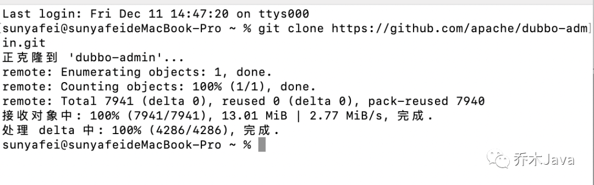


- 

```
git clone https://github.com/apache/dubbo-admin.git
```

等待克隆完成，会有一个bubbo-admin文件夹 

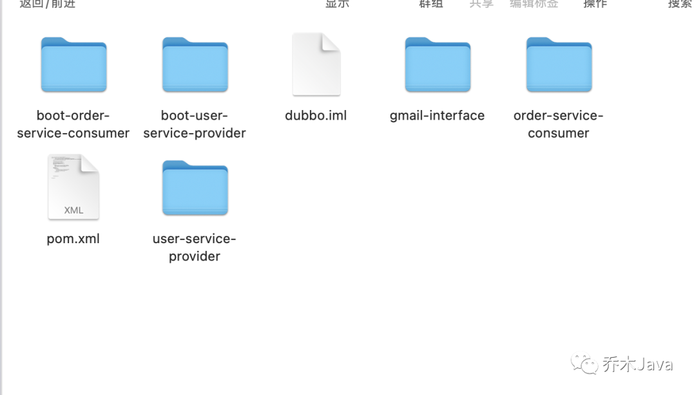


第二步部署前端

选中图中文件夹打开终端

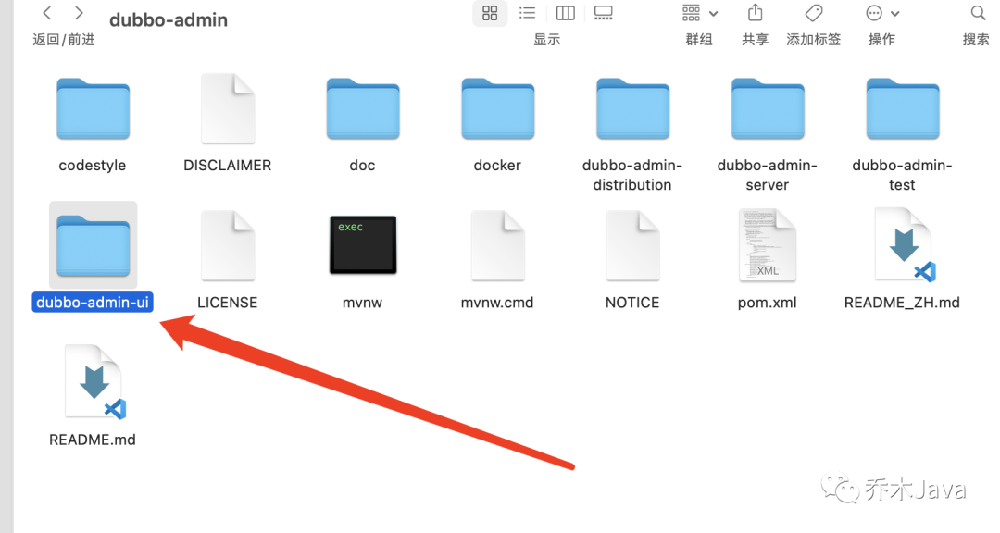

依次输入一下命令

- 
- 
- 
- 

```
#初始化vuenpm install#运行npm run dev
```

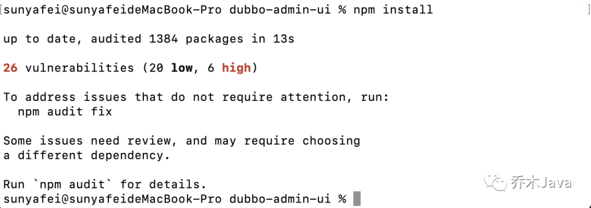

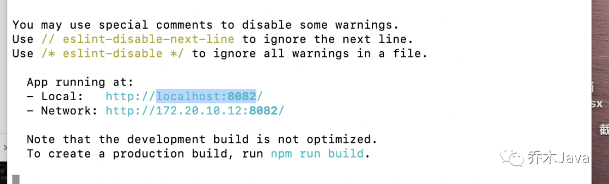

出现如上图，说明启动成功

访问：localhost:8082

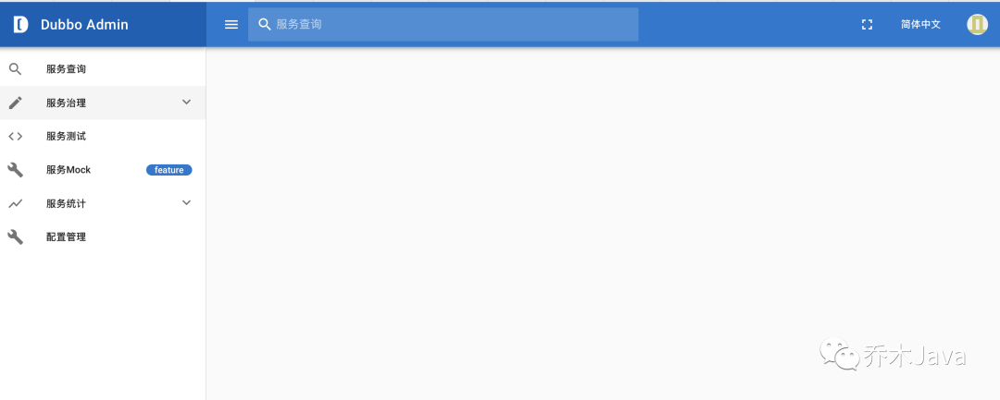

dubbo admin前端启动成功

第三步部署dubbo-admin-server后端，dubbo-admin-server用idea打开，注意修改注册中心地址。

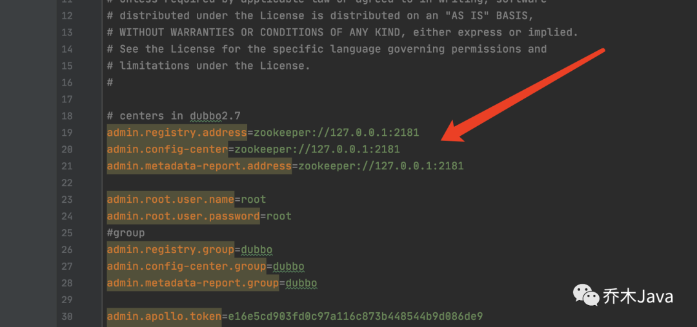

启动dubbo-admin-server服务前，先启动zookeeper

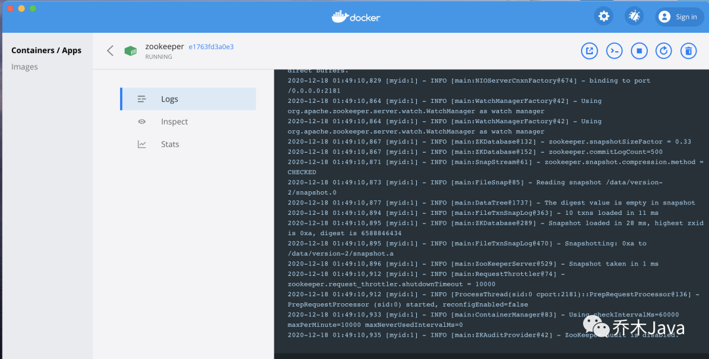

启动成功后访问localhost:8082，会提示输入账号密码，都是root

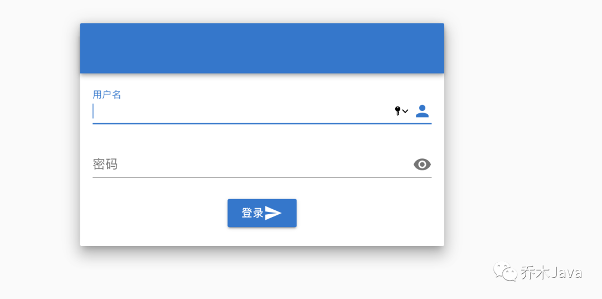登陆成功后，点击服务查询，由于没有任何服务注册进来，查询结果为无数据可用

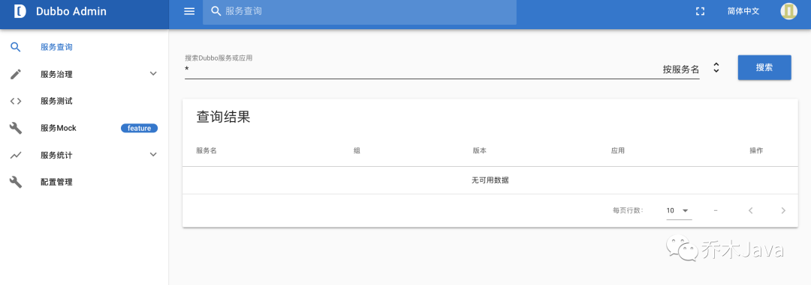

## Dubbo案例测试

本次案例是基于以下模型创建的，用户在购买商品的时候，会创建一个订单，订单需要查询用户收货地址，就会去用户服务查询收货地址相关信息。

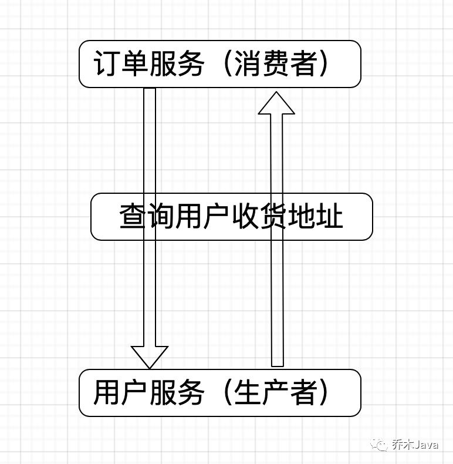

### Dubbo服务提供消费者接口搭建

**创建Maven工程 名为DubboTest在 Maven工程下创建`user-service-provider` 服务提供者**

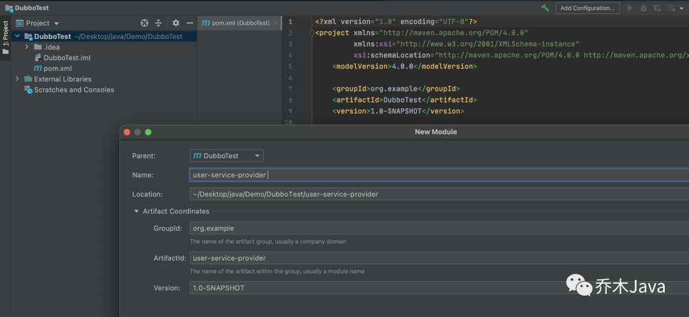

创建**UserAddress**

```
package com.sun.pojo;
import lombok.Data;
import java.io.Serializable;@Datapublic class UserAddress implements Serializable {    private Integer id;    private String userAddress; //用户地址    private String userId; //用户id    private String consignee; //收货人    private String phoneNum; //电话号码    private String isDefault; //是否为默认地址    Y-是     N-否    }
```


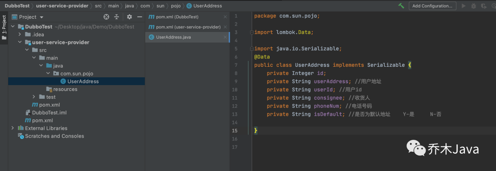

**UserService接口**

```
package com.sun.service;
import com.sun.pojo.UserAddress;
import java.util.List;
//用户服务public interface UserService {    /**     * 按照用户id返回所有的收货地址     * @param userId     * @return     */    public List<UserAddress> getUserAddressList(String userId);}
```

**UserService****接口实现UserServiceImpl**


```
package com.sun.service.impl;
import com.sun.pojo.UserAddress;import com.sun.service.UserService;
import java.util.Arrays;import java.util.List;
public class UserServiceImpl implements UserService {    public List<UserAddress> getUserAddressList(String userId) {        UserAddress address1 = new UserAddress(1, "浙江省杭州市萧山区杨宏路", "456789", "安然", "150360313x", "Y");        UserAddress address2 = new UserAddress(2, "北京市昌平区沙河镇沙阳路", "123456", "情话", "1766666395x", "N");        return Arrays.asList(address1,address2);    }}
```

**创建Maven项目=> `order-service-consumer` 服务消费者(订单服务)**

**OrderService接口**


```
package com.sun.service;
public interface OrderService {    /**     * 初始化订单     * @param userID     */    public void initOrder(String userID);}
```

**OrderService接口实现OrderServiceImpl**


```
package com.sun.service.impl;
import com.sun.service.OrderService;
public class OrderServiceImpl implements OrderService {    public void initOrder(String userID) {        //查询用户的收货地址    }}
```

**因服务消费者要拿到提供者的方法**
将 服务提供者 中的 实体类 及 UserService 复制到当前消费者同级文件中。

**OrderServiceImpl 注入****UserService接口**

**OrderServiceImpl**


```
package com.sun.service.impl;
import com.sun.pojo.UserAddress;import com.sun.service.OrderService;import com.sun.service.UserService;
import java.util.List;
public class OrderServiceImpl implements OrderService {    public UserService userService;    public void initOrder(String userID) {        //查询用户的收货地址        List<UserAddress> userAddressList = userService.getUserAddressList(userID);        System.out.println(userAddressList);    }}
```

项目目录结构如下图

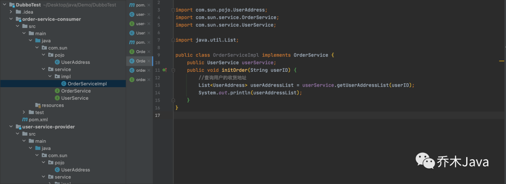


此时我们调用userservice肯定是要报错的。这种面向接口的方式，我们这里只是调到了接口，而接口实现实际是在另外一个项目中，如果我们两个项目工程都创建共同的实体类，太过于麻烦了，我们可以将服务接口，服务模型等单独放在一个项目中，更为方便调用。

**创建Maven项目=> third-****interface 用于存放共同的服务接口**

将 提供者 和 消费者 项目中的所有实体类复制到当前相关的文件包下，删除原有的实体类包及service包，也就是将实体类及service放在了当前公共的项目中。把服务提供者和消费者项目中引入以下依赖，引入后项目不在报错.

- 
- 
- 
- 
- 
- 
- 
- 

```
 <dependencies>        <dependency>            <groupId>org.example</groupId>            <artifactId>third-interface</artifactId>            <version>1.0-SNAPSHOT</version>            <scope>compile</scope>        </dependency>    </dependencies>
```

整体项目目录结构如下图

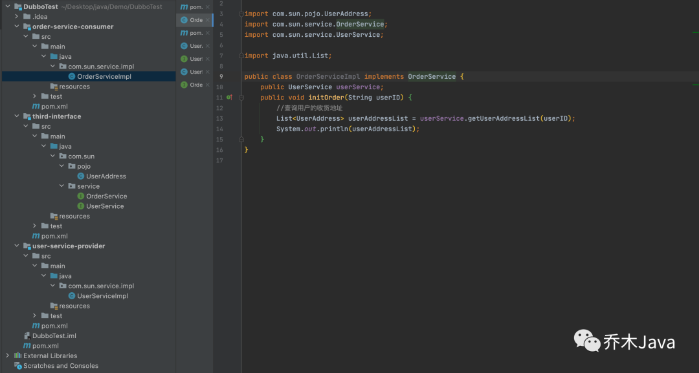

## 服务提供者配置以及测试

在 `user-service-provider` 服务提供者项目中引入依赖

- 
- 
- 
- 
- 
- 
- 
- 
- 
- 
- 
- 

```
   <!--dubbo-->    <dependency>        <groupId>com.alibaba</groupId>        <artifactId>dubbo</artifactId>        <version>2.6.2</version>    </dependency>    <!--注册中心是 zookeeper，引入zookeeper客户端-->    <dependency>        <groupId>org.apache.curator</groupId>        <artifactId>curator-framework</artifactId>        <version>2.12.0</version>    </dependency>
```

在`resource`文件中创建`provider.xml`

- 
- 
- 
- 
- 
- 
- 
- 
- 
- 
- 
- 
- 
- 
- 
- 
- 
- 
- 
- 

```
 <?xml version="1.0" encoding="UTF-8"?><beans xmlns="http://www.springframework.org/schema/beans"       xmlns:xsi="http://www.w3.org/2001/XMLSchema-instance"       xmlns:dubbo="http://code.alibabatech.com/schema/dubbo"       xsi:schemaLocation="http://www.springframework.org/schema/beans http://www.springframework.org/schema/beans/spring-beans.xsd    http://dubbo.apache.org/schema/dubbo http://dubbo.apache.org/schema/dubbo/dubbo.xsd    http://code.alibabatech.com/schema/dubbo http://code.alibabatech.com/schema/dubbo/dubbo.xsd">    <!--1、指定当前服务/应用的名字(同样的服务名字相同，不要和别的服务同名)-->    <dubbo:application name="user-service-provider"></dubbo:application>    <!--2、指定注册中心的位置-->    <!--<dubbo:registry address="zookeeper://127.0.0.1:2181"></dubbo:registry>-->    <dubbo:registry protocol="zookeeper" address="127.0.0.1:2181"></dubbo:registry>    <!--3、指定通信规则（通信协议? 服务端口）-->    <dubbo:protocol name="dubbo" port="20880"></dubbo:protocol>    <!--4、暴露服务 让别人调用 ref指向服务的真正实现对象-->    <dubbo:service interface="com.sun.service.UserService" ref="userServiceImpl"></dubbo:service>    <!--服务的实现-->    <bean id="userServiceImpl" class="com.sun.service.impl.UserServiceImpl"></bean></beans>
```

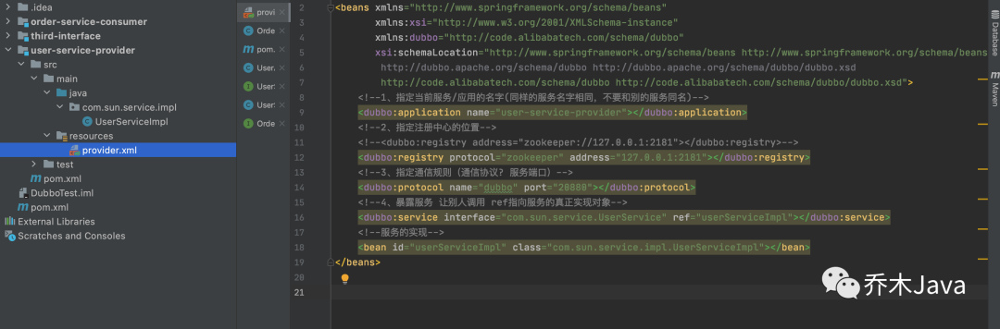

编写一个`ProviderApplication`启动类程序，运行测试配置

- 
- 
- 
- 
- 
- 
- 
- 
- 
- 
- 
- 
- 
- 

```
package com.sun;
import org.springframework.context.support.ClassPathXmlApplicationContext;
import java.io.IOException;
public class ProviderApplication {    public static void main(String[] args) throws IOException {        ClassPathXmlApplicationContext applicationContext= new ClassPathXmlApplicationContext("provider.xml");        applicationContext.start();        System.in.read();    }}
```

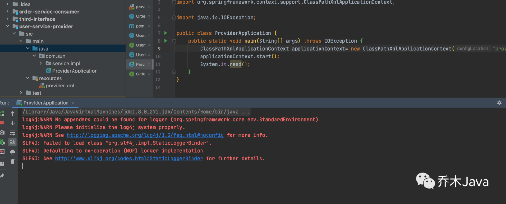

爆红是关于log4j等相关报错，没有影响

我们再次访问ocalhost:8082，查看user-service-provider服务，已经注册进来


**服务提供者的配置和测试完成**

## 服务消费者配置以及测试

在 `order-service-consumer` 服务消费者项目中引入依赖

- 
- 
- 
- 
- 
- 
- 
- 
- 
- 
- 
- 

```
  <!--dubbo-->        <dependency>            <groupId>com.alibaba</groupId>            <artifactId>dubbo</artifactId>            <version>2.6.2</version>        </dependency>        <!--注册中心是 zookeeper，引入zookeeper客户端-->        <dependency>            <groupId>org.apache.curator</groupId>            <artifactId>curator-framework</artifactId>            <version>2.12.0</version>        </dependency>
```

创建`consumer.xml`

- 
- 
- 
- 
- 
- 
- 
- 
- 
- 
- 
- 
- 
- 
- 
- 
- 
- 
- 
- 
- 

```
<?xml version="1.0" encoding="UTF-8"?><beans xmlns="http://www.springframework.org/schema/beans"       xmlns:xsi="http://www.w3.org/2001/XMLSchema-instance"       xmlns:dubbo="http://dubbo.apache.org/schema/dubbo"       xmlns:context="http://www.springframework.org/schema/context"       xsi:schemaLocation="http://www.springframework.org/schema/beans http://www.springframework.org/schema/beans/spring-beans.xsd    http://www.springframework.org/schema/context http://www.springframework.org/schema/context/spring-context-4.3.xsd    http://dubbo.apache.org/schema/dubbo http://dubbo.apache.org/schema/dubbo/dubbo.xsd    http://code.alibabatech.com/schema/dubbo http://code.alibabatech.com/schema/dubbo/dubbo.xsd">    <!--包扫描-->    <context:component-scan base-package="com.sun.service.impl"/>
    <!--指定当前服务/应用的名字(同样的服务名字相同，不要和别的服务同名)-->    <dubbo:application name="order-service-consumer"></dubbo:application>    <!--指定注册中心的位置-->    <dubbo:registry address="zookeeper://127.0.0.1:2181"></dubbo:registry>
    <!--调用远程暴露的服务，生成远程服务代理-->    <dubbo:reference interface="com.sun.service.UserService" id="userService"></dubbo:reference></beans>
```

**把当前OrderServiceImpl实现类中加上注解**

- 
- 
- 
- 
- 
- 
- 
- 
- 
- 
- 
- 
- 
- 
- 
- 
- 
- 
- 
- 
- 
- 
- 
- 
- 
- 
- 

```
package com.sun.service.impl;
import com.sun.pojo.UserAddress;import com.sun.service.OrderService;import com.sun.service.UserService;import org.springframework.stereotype.Service;

import java.util.List;@Servicepublic class OrderServiceImpl implements OrderService {    public UserService userService;    public void initOrder(String userID) {        //查询用户的收货地址        List<UserAddress> userAddressList = userService.getUserAddressList(userID);        //为了直观的看到得到的数据，以下内容也可不写        System.out.println("当前接收到的userId=> "+userID);        System.out.println("**********");        System.out.println("查询到的所有地址为：");        for (UserAddress userAddress : userAddressList) {            //打印远程服务地址的信息            System.out.println(userAddress.getUserAddress());        }
    }}
```

编写一个`ConsumerApplication`启动类程序，运行测试配置

- 
- 
- 
- 
- 
- 
- 
- 
- 
- 
- 
- 
- 
- 
- 
- 
- 
- 
- 

```
package com.sun;
import com.sun.service.OrderService;import org.springframework.context.support.ClassPathXmlApplicationContext;
import java.io.IOException;
public class ConsumerApplication {    public static void main(String[] args) throws IOException {        ClassPathXmlApplicationContext applicationContext = new ClassPathXmlApplicationContext("consumer.xml");        OrderService orderService = applicationContext.getBean(OrderService.class);
        //调用方法查询出数据        orderService.initOrder("1");        System.out.println("调用完成...");        System.in.read();    }}
```

注意：消费者的运行测试需要先启动提供者。
启动服务提供者、消费者。及zookeeper的和dubbo-admin，查看监控信息。

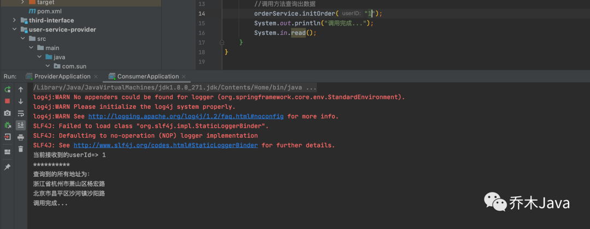

启动完成后可以看到，消费者成功调用服务提供者接口，查出用户地址，

我们在到dubbo-admin看下，

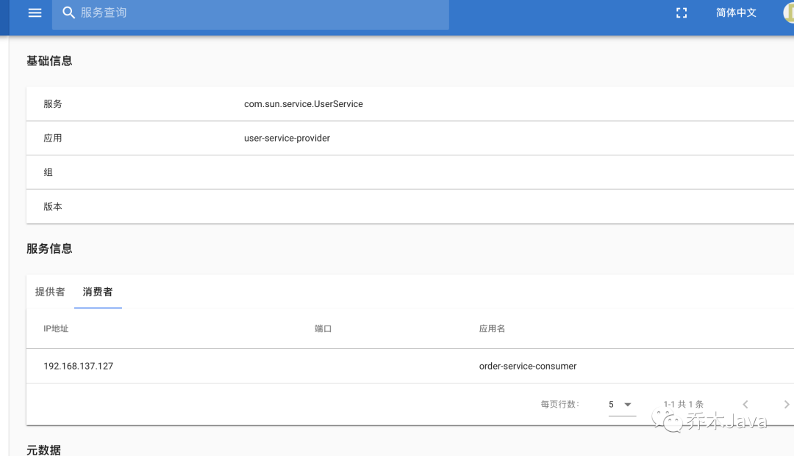

服务消费者也注册进来了。

## Dubbo与springboot整合

**创建Maven项目下创建一个springboot项目`boot-user-service-provider`** 服务提供者

导入一下依赖

- 
- 
- 
- 
- 
- 
- 
- 
- 
- 
- 
- 
- 
- 
- 
- 
- 
- 
- 
- 
- 
- 

```
 <dependency>            <groupId>org.springframework.boot</groupId>            <artifactId>spring-boot-starter-web</artifactId>        </dependency>
        <dependency>            <groupId>org.example</groupId>            <artifactId>third-interface</artifactId>            <version>1.0-SNAPSHOT</version>            <scope>compile</scope>        </dependency>
        <dependency>            <groupId>org.springframework.boot</groupId>            <artifactId>spring-boot-starter</artifactId>        </dependency>
        <dependency>            <groupId>com.alibaba.boot</groupId>            <artifactId>dubbo-spring-boot-starter</artifactId>            <version>0.2.0</version>        </dependency>
```

 把 `user-service-provider` 中的service拿到此项目中。

注意，以此方法为返回的需要更改 interface包中的void为 List

- 
- 
- 
- 
- 
- 
- 
- 
- 
- 
- 
- 
- 
- 
- 
- 
- 
- 
- 

```
package com.sun.service.impl;
import com.alibaba.dubbo.config.annotation.Service;import com.sun.pojo.UserAddress;import com.sun.service.UserService;import org.springframework.stereotype.Component;
import java.util.Arrays;import java.util.List;@Service@Componentpublic class UserServiceImpl implements UserService {    public List<UserAddress> getUserAddressList(String userId) {        UserAddress address1 = new UserAddress(1, "浙江省杭州市萧山区杨宏路", "456789", "安然", "150360313x", "Y");        UserAddress address2 = new UserAddress(2, "北京市昌平区沙河镇沙阳路", "123456", "情话", "1766666395x", "N");        return Arrays.asList(address1,address2);    }
}
```


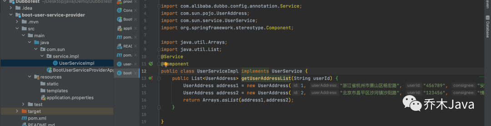

配置 `application.properties`

- 
- 
- 
- 
- 
- 
- 
- 
- 
- 
- 
- 
- 
- 
- 

```
# 应用名称spring.application.name=boot-user-service-provider# 应用服务 WEB 访问端口server.port=8090

dubbo.application.name=boot-user-service-providerdubbo.registry.address=127.0.0.1:2181dubbo.registry.protocol=zookeeper
dubbo.protocol.name=dubbodubbo.protocol.port=20880
#连接监控中心dubbo.monitor.protocol=registry
```

主启动类开启dubbo注解

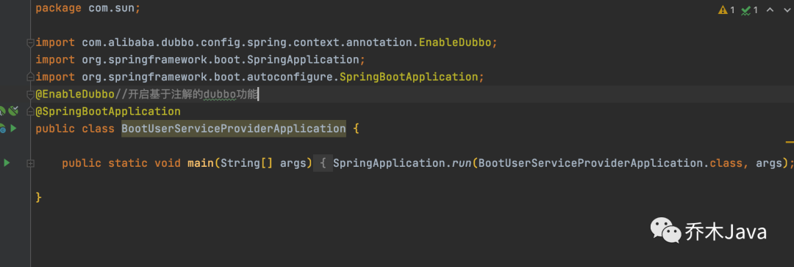

启动服务后到，dubbo-admin,查看**boot-user-service-provider 已经成功注册进来**

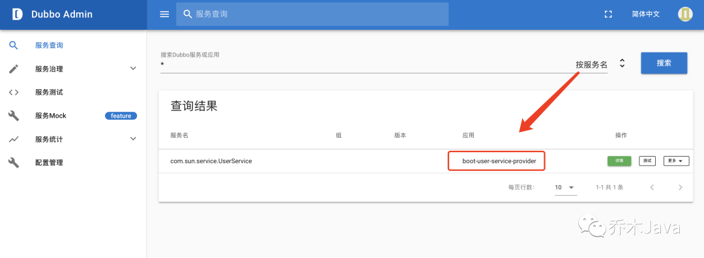


### boot-order-service-consumer 服务消费者

**创建Maven项目 `boot-order-service-consumer`** 服务消费者

导入一下依赖

- 
- 
- 
- 
- 
- 
- 
- 
- 
- 
- 
- 
- 
- 
- 
- 
- 
- 
- 
- 
- 
- 

```
 <dependency>            <groupId>org.springframework.boot</groupId>            <artifactId>spring-boot-starter-web</artifactId>        </dependency>
        <dependency>            <groupId>org.example</groupId>            <artifactId>third-interface</artifactId>            <version>1.0-SNAPSHOT</version>            <scope>compile</scope>        </dependency>
        <dependency>            <groupId>org.springframework.boot</groupId>            <artifactId>spring-boot-starter</artifactId>        </dependency>
        <dependency>            <groupId>com.alibaba.boot</groupId>            <artifactId>dubbo-spring-boot-starter</artifactId>            <version>0.2.0</version>        </dependency>
```

把order-service-consumer项目中的service复制到当前项目。

- 
- 
- 
- 
- 
- 
- 
- 
- 
- 
- 
- 
- 
- 
- 
- 
- 
- 
- 
- 
- 
- 
- 
- 
- 
- 
- 
- 
- 
- 

```
package com.sun.service.impl;
import com.alibaba.dubbo.config.annotation.Reference;import com.sun.pojo.UserAddress;import com.sun.service.OrderService;import com.sun.service.UserService;import org.springframework.stereotype.Service;
import java.util.List;
@Servicepublic class OrderServiceImpl implements OrderService {
    @Reference//引用远程提供者服务    UserService userService;
    public List<UserAddress> initOrder(String userID) {        //查询用户的收货地址        List<UserAddress> userAddressList = userService.getUserAddressList(userID);
        System.out.println("当前接收到的userId=> "+userID);        System.out.println("**********");        System.out.println("查询到的所有地址为：");        for (UserAddress userAddress : userAddressList) {            //打印远程服务地址的信息            System.out.println(userAddress.getUserAddress());        }        return userAddressList;    }}
```

创建 OrderController 控制器

- 
- 
- 
- 
- 
- 
- 
- 
- 
- 
- 
- 
- 
- 
- 
- 
- 
- 
- 
- 
- 
- 
- 

```
package com.sun.controller;
import com.sun.pojo.UserAddress;import com.sun.service.OrderService;import org.springframework.beans.factory.annotation.Autowired;import org.springframework.stereotype.Controller;import org.springframework.web.bind.annotation.RequestMapping;import org.springframework.web.bind.annotation.RequestParam;import org.springframework.web.bind.annotation.ResponseBody;
import java.util.List;
@Controllerpublic class OrderController {    @Autowired    OrderService orderService;
    @RequestMapping("/initOrder")    @ResponseBody    public List<UserAddress> initOrder(@RequestParam("uid")String userId) {        return orderService.initOrder(userId);    }}
```

创建application.properties 配置

- 
- 
- 
- 
- 
- 
- 
- 
- 

```
# 应用名称spring.application.name=boot-order-service-consumer# 应用服务 WEB 访问端口server.port=8091dubbo.application.name=boot-order-service-consumerdubbo.registry.address=zookeeper://127.0.0.1:2181
#连接监控中心 注册中心协议dubbo.monitor.protocol=registry
```

配置完毕，此时启动zookeeper注册中心及监控。
启动springboot配置的服务提供者和消费者。

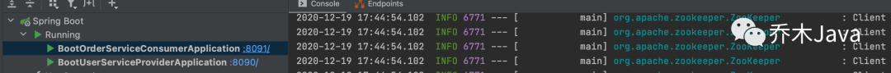

dubbo-admin登陆查看，提供者，和消费者，信息都注册进来了。

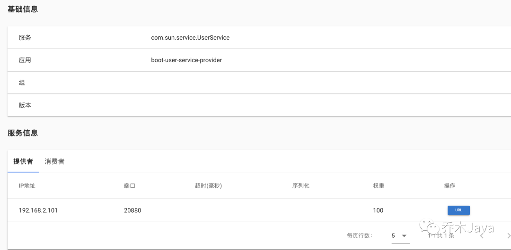

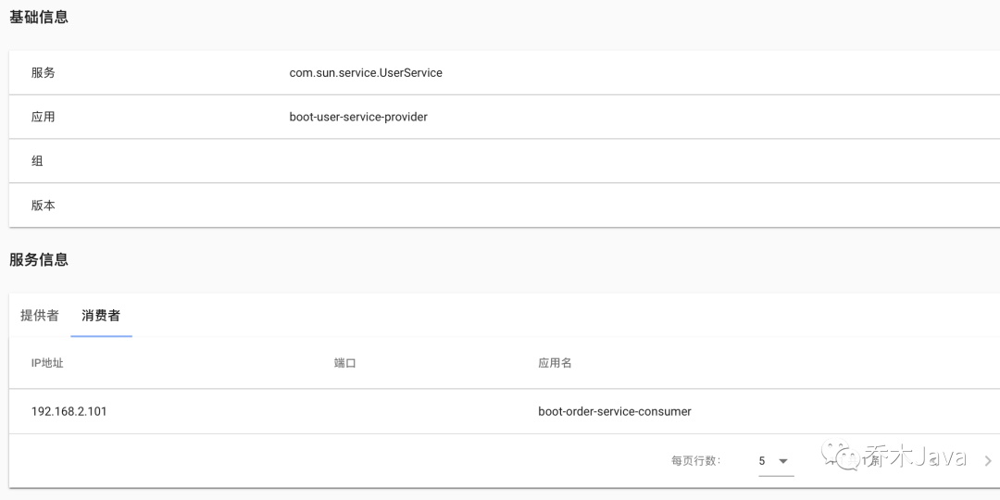

访问http://localhost:8091/initOrder/1

会查询到信息

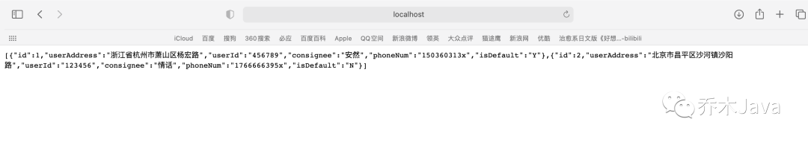

duboo的springboot整合配置完成。

## Dubbo相关配置

dubbo配置官网参考：http://dubbo.apache.org/zh/docs/v2.7/user/configuration/

1.重写与优先级

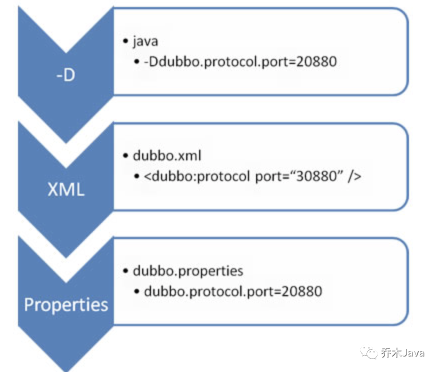


优先级从高到低：

- JVM -D 参数：当你部署或者启动应用时，它可以轻易地重写配置，比如，改变 dubbo 协议端口；
- XML：XML 中的当前配置会重写 dubbo.properties 中的；
- Properties：默认配置，仅仅作用于以上两者没有配置时。

1. 如果在 classpath 下有超过一个 dubbo.properties 文件，比如，两个 jar 包都各自包含了 dubbo.properties，dubbo 将随机选择一个加载，并且打印错误日志。
2. 如果 `id` 没有在 `protocol` 中配置，将使用 `name` 作为默认属性。

**2、启动时检查**

Dubbo 缺省会在启动时检查依赖的服务是否可用，不可用时会抛出异常，阻止 Spring 初始化完成，以便上线时，能及早发现问题，默认 check=“true”。

可以通过 check=“false” 关闭检查，比如，测试时，有些服务不关心，或者出现了循环依赖，必须有一方先启动。

另外，如果你的 Spring 容器是懒加载的，或者通过 API 编程延迟引用服务，请关闭 check，否则服务临时不可用时，会抛出异常，拿到 null 引用，如果 check=“false”，总是会返回引用，当服务恢复时，能自动连上。

以`order-service-consumer`消费者为例，在consumer.xml中添加配置

- 
- 

```
<!--配置当前消费者的统一规则,当前所有的服务都不启动时检查--> <dubbo:consumer check="false"></dubbo:consumer>
```

添加后，即使服务提供者不启动，启动当前的消费者，也不会出现错误。


**3、全局超时配置**

- 
- 
- 
- 
- 
- 
- 

```
全局超时配置<dubbo:provider timeout="5000" />
指定接口以及特定方法超时配置<dubbo:provider interface="com.foo.BarService" timeout="2000">    <dubbo:method name="sayHello" timeout="3000" /></dubbo:provider>
```

**配置原则**
dubbo推荐在Provider上尽量多配置Consumer端属性

- 
- 

```
1、作服务的提供者，比服务使用方更清楚服务性能参数，如调用的超时时间，合理的重试次数，等等2、在Provider配置后，Consumer不配置则会使用Provider的配置值，即Provider配置可以作为Consumer的缺省值。否则，Consumer会使用Consumer端的全局设置，这对于Provider不可控的，并且往往是不合理的
```

\4. 不同粒度配置的覆盖关系

以 timeout 为例，下图显示了配置的查找顺序，其它 retries, loadbalance, actives 等类似：

- 方法级优先，接口级次之，全局配置再次之。
- 如果级别一样，则消费方优先，提供方次之。

其中，服务提供方配置，通过 URL 经由注册中心传递给消费方。

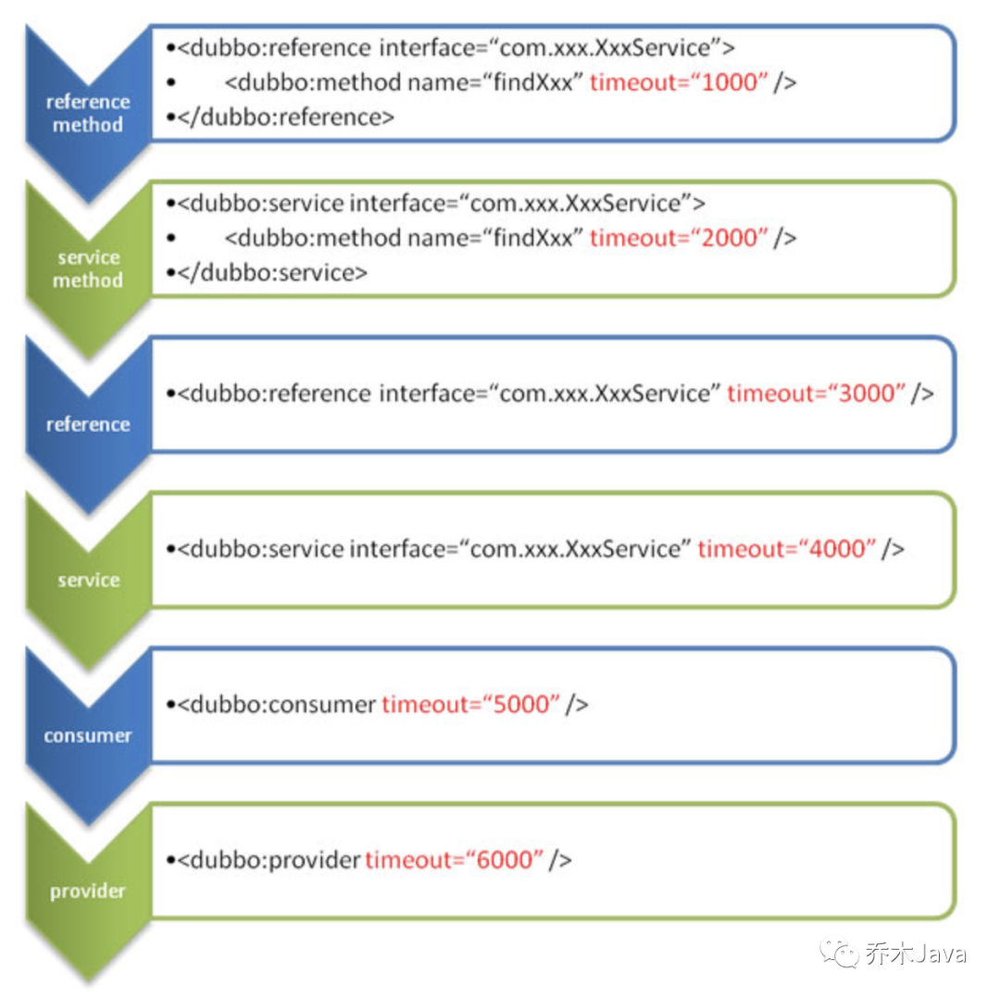

（建议由服务提供方设置超时，因为一个方法需要执行多长时间，服务提供方更清楚，如果一个消费方同时引用多个服务，就不需要关心每个服务的超时设置）。理论上 ReferenceConfig 中除了`interface`这一项，其他所有配置项都可以缺省不配置，框架会自动使用ConsumerConfig，ServiceConfig, ProviderConfig等提供的缺省配置。

更多关于dubbo详细配置可以参考官网


## Dubbo与springboot整合的三种方式

1、将服务提供者注册到注册中心(如何暴露服务)
1.1导入Dubbo的依赖 和 zookeeper 客户端

2、让服务消费者去注册中心订阅服务提供者的服务地址
Springboot与Dubbo整合的三种方式
2.1导入dubbo-starter。在application.properties配置属性，使用@Service【暴露服务】，使用@Reference【引用服务】
2.2保留Dubbo 相关的xml配置文件导入dubbo-starter，使用@ImportResource导入Dubbo的xml配置文件。

3、使用 注解API的方式
将每一个组件手动配置到容器中,让dubbo来扫描其他的组件。

以上就是关于Dubbo快速入门介绍，如果对测试源码感兴趣，获取方式：点“在看”，关注公众号并回复dubbo领取源码。