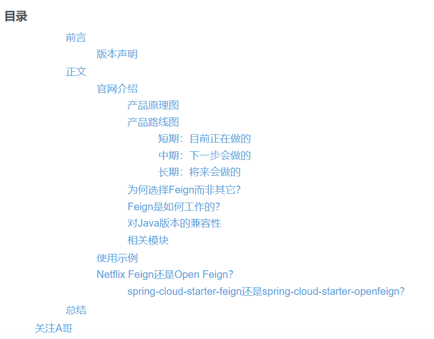
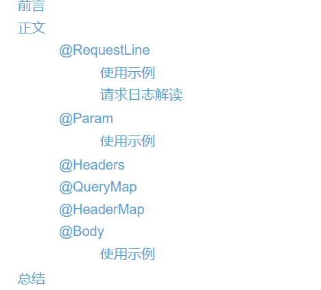

# 参考文献

[[享学Feign]](https://cloud.tencent.com/developer/inventory/12988/article/1588509) 

[[享学Feign] 十一、Feign通过feign-slf4j模块整合logback记录日志](https://cloud.tencent.com/developer/article/1588517?from=article.detail.1588509&areaSource=106000.5&traceId=-VPa23Guj0yfuqpxl0SWC)

[官网](https://github.com/OpenFeign/feign)

[代码](https://github.com/carl-don-it/feign-learning)

# [享学Feign] 一、原生Feign初体验，Netflix Feign or Open Feign？

# [享学Feign] 二、原生Feign的注解介绍及使用示例

# [享学Feign] 三、原生Feign的核心API详解(一)：UriTemplate、HardCodedTarget...

#### Template

##### UriTemplate

##### QueryTemplate

##### HeaderTemplate

##### BodyTemplate

#### Target

##### EmptyTarget

##### HardCodedTarget

#### Client

##### Default

**Proxied**

#### Retryer

# [享学Feign] 四、原生Feign的核心API详解(二)：Contract、SynchronousMethodHandler...

#### Logger

#### InvocationHandlerFactory

##### Default

#### FeignInvocationHandler

#### Contract

##### BaseContract

**Default**

#### MethodHandler

##### DefaultMethodHandler

##### SynchronousMethodHandler（重中之重）

# [享学Feign] 五、原生Feign的编码器Encoder、QueryMapEncoder

### 编码器Encoder

### QueryMapEncoder

#### BeanQueryMapEncoder

# [享学Feign] 六、原生Feign的解码器Decoder、ErrorDecoder

### 解码器Decoder

### ErrorDecoder

# [享学Feign] 七、请求模版对象RequestTemplate和标准请求对象feign.Request

### RequestTemplate

#### RequestTemplate.Factory

##### BuildTemplateByResolvingArgs

### feign.Request

# [享学Feign] 八、Feign是如何生成接口代理对象的？Feign实例的构建器Feign.Builder详解

### feign.Feign

#### ParseHandlersByName

### feign.Feign.Builder