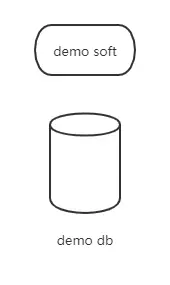
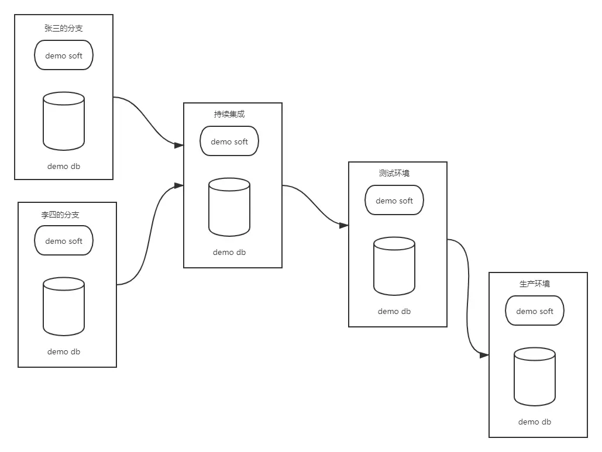
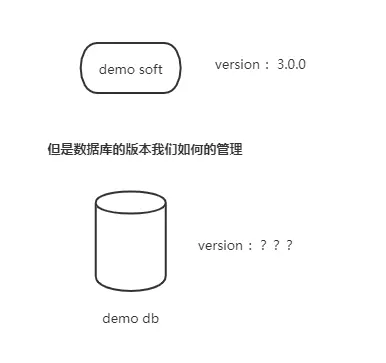

# flyway从入门到精通（一）：为什么需要数据库的持续集成

[牧羊人刘俏](https://www.jianshu.com/u/ea6255a1cdf0)关注IP属地: 安徽

0.2022020.05.03 00:52:15字数 773阅读 1,172

**flyway从入门到精通，主要分为四个部分如下**，
**一 简介** ：flyway出现的背景介绍
**二 实战** ：使用基于spring boot的demo项目，讲解如何在项目中使用flyway
**三 源码分析** ：结合源码讲解flyway的实现原理
**四 扩展增强** ：通过flyway提供的扩展点，针对项目做定制化的扩展开发

系列文章中的图片大多引用于flyway的官网，如有侵权，请联系作者删除（**微信号lqsy1205**)
如下开始第一章之旅

# 我们为什么需要数据库的版本集成？

首先假设我们有一个名为demo的项目，项目的主要交付物就是提供一块叫做demo soft的代码并连接到名为demo db的数据库。
如果用一个图来表示上述所意的，应该如下：

示意图1.png

现在我们有了代码和数据库，这也是大多数初创项目所需的所有内容了。
但是随着项目的进展，这种简单的开发模式马上回演变成如下的这种样子：

示意图2.png

现在我们不止一个环境，而是有了开发、如测试、oa、灰度、生产等，由于环境的数量的增加，量变导致质变，会面临很多的挑战。
**由于以下的原因，我们在代码的版本管理方面经验十足**
1 git、svn等版本管理工具功能强大，可以很好的帮助我们管理代码
2 可复制的持续集成
3 我们有定义良好的发布和部署流程

示意图3.png

但是不幸的是，我们的在数据库的版本管理方面做的不那么的好。很多项目还是依靠dba或是scm手动的执行sql脚本，而有的时候，为了临时的解决某些问题，会在这个或是那个环境手动的执行某些脚本，如此这样就会产生如下很多的问题。
1 比如我如何知道某台机器上面的数据库处于什么状态
2 sql脚本文件是执行了，还是没有执行？
3 在生产环境环境的hotfix而执行的脚本文件随后在其他的环境有执行吗？
4 如何启动一台全新的数据库实例，而与其他的数据库实例保持一致

而很多的时候针对上面 的四个问题，我们的答案是：我们不知道
**而数据库的持续集成是解决这一混乱问题的好方法，它具有如下的优点**
1 重头重新的创建数据库
2 清楚的知道你的数据库现在处于什么样的状态
3 以确定的方式从当前版本的数据库集成到新的版本

**第二章**
**flyway从入门到精通（二）：flyway的工作原理**