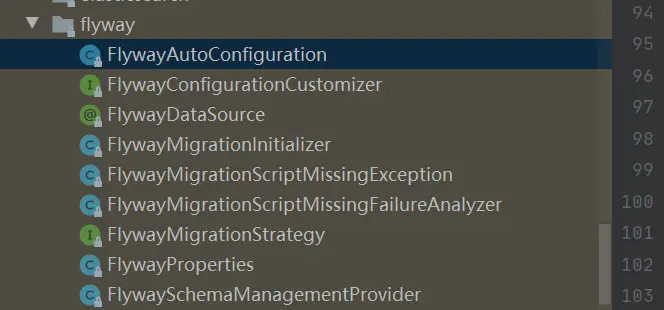

# flyway从入门到精通（七）：spring boot中flyway执行源码分析


[牧羊人刘俏](https://www.jianshu.com/u/ea6255a1cdf0)关注IP属地: 黑龙江

0.0772020.05.04 21:53:15字数 220阅读 2,531

按照boot的通用习惯，为了引入某个组件的功能，就会在spring.factories引入这个组件的配置类，一般的这个配置类的名称就叫xxxAutoConfiguration,果不其然在spring-boot-autoconfigure 这个jar包的spring.factories文件夹下发现了这样一句

```css
org.springframework.boot.autoconfigure.flyway.FlywayAutoConfiguration
```


好，那我们直接的进入这个配置类就可以了，可以看到在boot针对flyway的配置相关的类就9个，如下图




示意图14.png

其中FlywayProperties不用讲，就是我们上一章讲的加载配置信息的bean
主要看下FlywayAutoConfiguration类的相关代码，如下

```java
@Configuration(proxyBeanMethods = false)
@ConditionalOnClass(Flyway.class) 
@Conditional(FlywayDataSourceCondition.class)
@ConditionalOnProperty(prefix = "spring.flyway", name = "enabled", matchIfMissing = true)
@AutoConfigureAfter({ DataSourceAutoConfiguration.class, JdbcTemplateAutoConfiguration.class,
        HibernateJpaAutoConfiguration.class }) 必须DataSource,JdbcTemplate,或是HibernateJpa加载之后
@Import({ FlywayEntityManagerFactoryDependsOnPostProcessor.class, FlywayJdbcOperationsDependsOnPostProcessor.class,
        FlywayNamedParameterJdbcOperationsDependencyConfiguration.class })
public class FlywayAutoConfiguration {

    @Bean
        //自定义的转化器，会将string或是数字转成MigrationVersion
    @ConfigurationPropertiesBinding 
    public StringOrNumberToMigrationVersionConverter stringOrNumberMigrationVersionConverter() {
        return new StringOrNumberToMigrationVersionConverter();
    }

    @Bean
    public FlywaySchemaManagementProvider flywayDefaultDdlModeProvider(ObjectProvider<Flyway> flyways) {
        return new FlywaySchemaManagementProvider(flyways);
    }

    @Configuration(proxyBeanMethods = false)
    @ConditionalOnMissingBean(Flyway.class)
    @EnableConfigurationProperties({ DataSourceProperties.class, FlywayProperties.class })
    @Import({ FlywayMigrationInitializerEntityManagerFactoryDependsOnPostProcessor.class,
            FlywayMigrationInitializerJdbcOperationsDependsOnPostProcessor.class,
            FlywayMigrationInitializerNamedParameterJdbcOperationsDependsOnPostProcessor.class })
    public static class FlywayConfiguration {

        @Bean
        public Flyway flyway(FlywayProperties properties, DataSourceProperties dataSourceProperties,
                ResourceLoader resourceLoader, ObjectProvider<DataSource> dataSource,
                @FlywayDataSource ObjectProvider<DataSource> flywayDataSource,
                ObjectProvider<FlywayConfigurationCustomizer> fluentConfigurationCustomizers,
                ObjectProvider<JavaMigration> javaMigrations, ObjectProvider<Callback> callbacks) {
            FluentConfiguration configuration = new FluentConfiguration(resourceLoader.getClassLoader());
//如果Flyway配置了DataSource信息，就使用，不然使用配置的项目的DataSource信息
            DataSource dataSourceToMigrate = configureDataSource(configuration, properties, dataSourceProperties,
                    flywayDataSource.getIfAvailable(), dataSource.getIfUnique());
            checkLocationExists(dataSourceToMigrate, properties, resourceLoader);
//将properties赋值到configuration
            configureProperties(configuration, properties);
            List<Callback> orderedCallbacks = callbacks.orderedStream().collect(Collectors.toList());
//注册callbacks
            configureCallbacks(configuration, orderedCallbacks);
            fluentConfigurationCustomizers.orderedStream().forEach((customizer) -> customizer.customize(configuration));
            configureFlywayCallbacks(configuration, orderedCallbacks);
            List<JavaMigration> migrations = javaMigrations.stream().collect(Collectors.toList());
//注册JavaMigration，我们基本都是用的sql的写法，这个可以忽略
            configureJavaMigrations(configuration, migrations);
            return configuration.load();
        }

        private DataSource configureDataSource(FluentConfiguration configuration, FlywayProperties properties,
                DataSourceProperties dataSourceProperties, DataSource flywayDataSource, DataSource dataSource) {
            if (properties.isCreateDataSource()) {
                String url = getProperty(properties::getUrl, dataSourceProperties::determineUrl);
                String user = getProperty(properties::getUser, dataSourceProperties::determineUsername);
                String password = getProperty(properties::getPassword, dataSourceProperties::determinePassword);
                configuration.dataSource(url, user, password);
                if (!CollectionUtils.isEmpty(properties.getInitSqls())) {
                    String initSql = StringUtils.collectionToDelimitedString(properties.getInitSqls(), "\n");
                    configuration.initSql(initSql);
                }
            }
            else if (flywayDataSource != null) {
                configuration.dataSource(flywayDataSource);
            }
            else {
                configuration.dataSource(dataSource);
            }
            return configuration.getDataSource();
        }

        private void checkLocationExists(DataSource dataSource, FlywayProperties properties,
                ResourceLoader resourceLoader) {
            if (properties.isCheckLocation()) {
                List<String> locations = new LocationResolver(dataSource).resolveLocations(properties.getLocations());
                if (!hasAtLeastOneLocation(resourceLoader, locations)) {
                    throw new FlywayMigrationScriptMissingException(locations);
                }
            }
        }

        private void configureProperties(FluentConfiguration configuration, FlywayProperties properties) {
            PropertyMapper map = PropertyMapper.get().alwaysApplyingWhenNonNull();
            String[] locations = new LocationResolver(configuration.getDataSource())
                    .resolveLocations(properties.getLocations()).toArray(new String[0]);
            map.from(locations).to(configuration::locations);
            map.from(properties.getEncoding()).to(configuration::encoding);
            map.from(properties.getConnectRetries()).to(configuration::connectRetries);
            map.from(properties.getSchemas()).as(StringUtils::toStringArray).to(configuration::schemas);
            map.from(properties.getTable()).to(configuration::table);
            // No method reference for compatibility with Flyway 5.x
            map.from(properties.getTablespace()).whenNonNull().to((tablespace) -> configuration.tablespace(tablespace));
            map.from(properties.getBaselineDescription()).to(configuration::baselineDescription);
            map.from(properties.getBaselineVersion()).to(configuration::baselineVersion);
            map.from(properties.getInstalledBy()).to(configuration::installedBy);
            map.from(properties.getPlaceholders()).to(configuration::placeholders);
            map.from(properties.getPlaceholderPrefix()).to(configuration::placeholderPrefix);
            map.from(properties.getPlaceholderSuffix()).to(configuration::placeholderSuffix);
            map.from(properties.isPlaceholderReplacement()).to(configuration::placeholderReplacement);
            map.from(properties.getSqlMigrationPrefix()).to(configuration::sqlMigrationPrefix);
            map.from(properties.getSqlMigrationSuffixes()).as(StringUtils::toStringArray)
                    .to(configuration::sqlMigrationSuffixes);
            map.from(properties.getSqlMigrationSeparator()).to(configuration::sqlMigrationSeparator);
            map.from(properties.getRepeatableSqlMigrationPrefix()).to(configuration::repeatableSqlMigrationPrefix);
            map.from(properties.getTarget()).to(configuration::target);
            map.from(properties.isBaselineOnMigrate()).to(configuration::baselineOnMigrate);
            map.from(properties.isCleanDisabled()).to(configuration::cleanDisabled);
            map.from(properties.isCleanOnValidationError()).to(configuration::cleanOnValidationError);
            map.from(properties.isGroup()).to(configuration::group);
            map.from(properties.isIgnoreMissingMigrations()).to(configuration::ignoreMissingMigrations);
            map.from(properties.isIgnoreIgnoredMigrations()).to(configuration::ignoreIgnoredMigrations);
            map.from(properties.isIgnorePendingMigrations()).to(configuration::ignorePendingMigrations);
            map.from(properties.isIgnoreFutureMigrations()).to(configuration::ignoreFutureMigrations);
            map.from(properties.isMixed()).to(configuration::mixed);
            map.from(properties.isOutOfOrder()).to(configuration::outOfOrder);
            map.from(properties.isSkipDefaultCallbacks()).to(configuration::skipDefaultCallbacks);
            map.from(properties.isSkipDefaultResolvers()).to(configuration::skipDefaultResolvers);
            map.from(properties.isValidateOnMigrate()).to(configuration::validateOnMigrate);
            // Pro properties
            map.from(properties.getBatch()).whenNonNull().to(configuration::batch);
            map.from(properties.getDryRunOutput()).whenNonNull().to(configuration::dryRunOutput);
            map.from(properties.getErrorOverrides()).whenNonNull().to(configuration::errorOverrides);
            map.from(properties.getLicenseKey()).whenNonNull().to(configuration::licenseKey);
            map.from(properties.getOracleSqlplus()).whenNonNull().to(configuration::oracleSqlplus);
            // No method reference for compatibility with Flyway 5.x
            map.from(properties.getOracleSqlplusWarn()).whenNonNull()
                    .to((oracleSqlplusWarn) -> configuration.oracleSqlplusWarn(oracleSqlplusWarn));
            map.from(properties.getStream()).whenNonNull().to(configuration::stream);
            map.from(properties.getUndoSqlMigrationPrefix()).whenNonNull().to(configuration::undoSqlMigrationPrefix);
        }

        private void configureCallbacks(FluentConfiguration configuration, List<Callback> callbacks) {
            if (!callbacks.isEmpty()) {
                configuration.callbacks(callbacks.toArray(new Callback[0]));
            }
        }

        private void configureFlywayCallbacks(FluentConfiguration flyway, List<Callback> callbacks) {
            if (!callbacks.isEmpty()) {
                flyway.callbacks(callbacks.toArray(new Callback[0]));
            }
        }

        private void configureJavaMigrations(FluentConfiguration flyway, List<JavaMigration> migrations) {
            if (!migrations.isEmpty()) {
                try {
                    flyway.javaMigrations(migrations.toArray(new JavaMigration[0]));
                }
                catch (NoSuchMethodError ex) {
                    // Flyway 5.x
                }
            }
        }

        private String getProperty(Supplier<String> property, Supplier<String> defaultValue) {
            String value = property.get();
            return (value != null) ? value : defaultValue.get();
        }

        private boolean hasAtLeastOneLocation(ResourceLoader resourceLoader, Collection<String> locations) {
            for (String location : locations) {
                if (resourceLoader.getResource(normalizePrefix(location)).exists()) {
                    return true;
                }
            }
            return false;
        }

        private String normalizePrefix(String location) {
            return location.replace("filesystem:", "file:");
        }
                //这个bean很重要，会在下一章讲到
        @Bean
        @ConditionalOnMissingBean
        public FlywayMigrationInitializer flywayInitializer(Flyway flyway,
                ObjectProvider<FlywayMigrationStrategy> migrationStrategy) {
            return new FlywayMigrationInitializer(flyway, migrationStrategy.getIfAvailable());
        }

    }

    /**

     * Post processor to ensure that {@link EntityManagerFactory} beans depend on any
     * {@link FlywayMigrationInitializer} beans.
     */
    @ConditionalOnClass(LocalContainerEntityManagerFactoryBean.class)
    @ConditionalOnBean(AbstractEntityManagerFactoryBean.class)
    static class FlywayMigrationInitializerEntityManagerFactoryDependsOnPostProcessor
            extends EntityManagerFactoryDependsOnPostProcessor {

        FlywayMigrationInitializerEntityManagerFactoryDependsOnPostProcessor() {
            super(FlywayMigrationInitializer.class);
        }

    }

    /**
         *此BeanFactoryPostProcessor保证了JdbcOperations depends on 
          *FlywayMigrationInitializer，如下的两个也是这个意思，保证了在对db做任何的操作前
          *先会完成Flyway的migrate操作
     * Post processor to ensure that {@link JdbcOperations} beans depend on any
     * {@link FlywayMigrationInitializer} beans.
     */
    @ConditionalOnClass(JdbcOperations.class)
    @ConditionalOnBean(JdbcOperations.class)
    static class FlywayMigrationInitializerJdbcOperationsDependsOnPostProcessor
            extends JdbcOperationsDependsOnPostProcessor {

        FlywayMigrationInitializerJdbcOperationsDependsOnPostProcessor() {
            super(FlywayMigrationInitializer.class);
        }

    }

    /**
     * Post processor to ensure that {@link NamedParameterJdbcOperations} beans 
         *depend on
     * any {@link FlywayMigrationInitializer} beans.
     */
    @ConditionalOnClass(NamedParameterJdbcOperations.class)
    @ConditionalOnBean(NamedParameterJdbcOperations.class)
    static class FlywayMigrationInitializerNamedParameterJdbcOperationsDependsOnPostProcessor
            extends NamedParameterJdbcOperationsDependsOnPostProcessor {

        FlywayMigrationInitializerNamedParameterJdbcOperationsDependsOnPostProcessor() {
            super(FlywayMigrationInitializer.class);
        }

    }

    /**
     * Post processor to ensure that {@link EntityManagerFactory} beans depend on any
     * {@link Flyway} beans.
     */
    @ConditionalOnClass(LocalContainerEntityManagerFactoryBean.class)
    @ConditionalOnBean(AbstractEntityManagerFactoryBean.class)
    static class FlywayEntityManagerFactoryDependsOnPostProcessor extends EntityManagerFactoryDependsOnPostProcessor {

        FlywayEntityManagerFactoryDependsOnPostProcessor() {
            super(Flyway.class);
        }

    }

    /**
     * Post processor to ensure that {@link JdbcOperations} beans depend on any
     * {@link Flyway} beans.
     */
    @ConditionalOnClass(JdbcOperations.class)
    @ConditionalOnBean(JdbcOperations.class)
    static class FlywayJdbcOperationsDependsOnPostProcessor extends JdbcOperationsDependsOnPostProcessor {

        FlywayJdbcOperationsDependsOnPostProcessor() {
            super(Flyway.class);
        }

    }

    /**
     * Post processor to ensure that {@link NamedParameterJdbcOperations} beans depend on
     * any {@link Flyway} beans.
     */
    @ConditionalOnClass(NamedParameterJdbcOperations.class)
    @ConditionalOnBean(NamedParameterJdbcOperations.class)
    protected static class FlywayNamedParameterJdbcOperationsDependencyConfiguration
            extends NamedParameterJdbcOperationsDependsOnPostProcessor {

        public FlywayNamedParameterJdbcOperationsDependencyConfiguration() {
            super(Flyway.class);
        }

    }

    private static class LocationResolver {

        private static final String VENDOR_PLACEHOLDER = "{vendor}";

        private final DataSource dataSource;

        LocationResolver(DataSource dataSource) {
            this.dataSource = dataSource;
        }

        List<String> resolveLocations(List<String> locations) {
            if (usesVendorLocation(locations)) {
                DatabaseDriver databaseDriver = getDatabaseDriver();
                return replaceVendorLocations(locations, databaseDriver);
            }
            return locations;
        }

        private List<String> replaceVendorLocations(List<String> locations, DatabaseDriver databaseDriver) {
            if (databaseDriver == DatabaseDriver.UNKNOWN) {
                return locations;
            }
            String vendor = databaseDriver.getId();
            return locations.stream().map((location) -> location.replace(VENDOR_PLACEHOLDER, vendor))
                    .collect(Collectors.toList());
        }

        private DatabaseDriver getDatabaseDriver() {
            try {
                String url = JdbcUtils.extractDatabaseMetaData(this.dataSource, "getURL");
                return DatabaseDriver.fromJdbcUrl(url);
            }
            catch (MetaDataAccessException ex) {
                throw new IllegalStateException(ex);
            }

        }

        private boolean usesVendorLocation(Collection<String> locations) {
            for (String location : locations) {
                if (location.contains(VENDOR_PLACEHOLDER)) {
                    return true;
                }
            }
            return false;
        }

    }

    /**
     * Convert a String or Number to a {@link MigrationVersion}.
     */
    private static class StringOrNumberToMigrationVersionConverter implements GenericConverter {

        private static final Set<ConvertiblePair> CONVERTIBLE_TYPES;

        static {
            Set<ConvertiblePair> types = new HashSet<>(2);
            types.add(new ConvertiblePair(String.class, MigrationVersion.class));
            types.add(new ConvertiblePair(Number.class, MigrationVersion.class));
            CONVERTIBLE_TYPES = Collections.unmodifiableSet(types);
        }

        @Override
        public Set<ConvertiblePair> getConvertibleTypes() {
            return CONVERTIBLE_TYPES;
        }

        @Override
        public Object convert(Object source, TypeDescriptor sourceType, TypeDescriptor targetType) {
            String value = ObjectUtils.nullSafeToString(source);
            return MigrationVersion.fromVersion(value);
        }

    }

    static final class FlywayDataSourceCondition extends AnyNestedCondition {

        FlywayDataSourceCondition() {
            super(ConfigurationPhase.REGISTER_BEAN);
        }

        @ConditionalOnBean(DataSource.class)
        private static final class DataSourceBeanCondition {

        }

        @ConditionalOnProperty(prefix = "spring.flyway", name = "url", matchIfMissing = false)
        private static final class FlywayUrlCondition {

        }

    }

}
```

上面这个configuration主要就是创建了一个叫flyway的bean，并在创建的过程中对配置属性做了check和相关的callback的注册

flyway从入门到精通（八）：spring boot中flyway执行源码分析