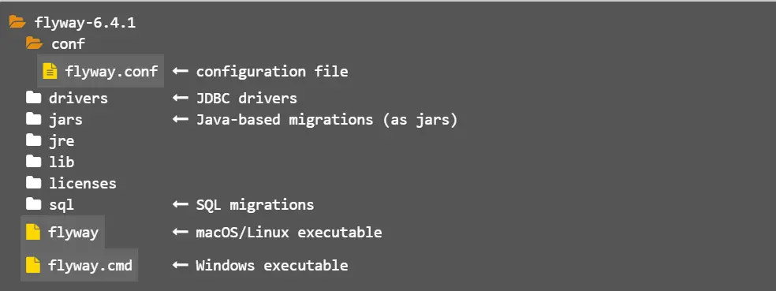

# flyway从入门到精通（三-二）：通过命令行实战flyway的能力


[牧羊人刘俏](https://www.jianshu.com/u/ea6255a1cdf0)关注IP属地: 黑龙江

2020.05.03 22:05:05字数 366阅读 1,242

flyway的目录结构介绍如下




示意图11.png

flyway主要提供了如下的7种命令符
migrate 这个大家比较熟悉，主要用于数据库的大部分的版本升级需要
clean 删除指定的schemas下的所有表（很危险，生产环境禁用）
info 打印关于数据库的状态和migrations的详细信息
validate 验证classpath下的migrations文件的正确性
undo 回滚最近的migrations
baseline 现有数据库做基线操作，基线版本之前（包括基线版本）的所有migrations文件会被忽略，相当于重新建立一个基线版本，经常会用在老的数据库上面
repair 修复schema history table（如果migrate失败，大部分情况下只要sql正确不会失败）

在前一张介绍的flyway的配置文件默认在/conf/flyway.conf中，但是我们也可以自定义conf文件，如下

```undefined
 flyway -configFiles=path/to/myAlternativeConfig.conf migrate
```

当然也可以指定多个配置文件，如下

```undefined
flyway -configFiles=path/to/myAlternativeConfig.conf,other.conf migrate
```

flyway的配置文件默认是utf-8的编码，当然也可以手动的指定其它的编码方式，如下

```undefined
 flyway -configFileEncoding=ISO-8859-1 migrate
```

也可以使用pipleline管道的的方式指定flyway的conf信息，如下

```bash
 echo $'flyway.url=jdbc:h2:mem:mydb' | flyway info
 cat flyway.conf | flyway migrate
```

具体其它的配置可以参考flyway的官网，下一章会对flyway里面涉及的conf文件的每个属性做详细的解释

flyway从入门到精通（四）：flyway配置属性详解