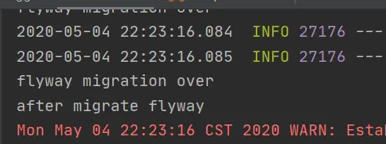

# flyway从入门到精通（九）：spring boot中flyway执行源码分析


[牧羊人刘俏](https://www.jianshu.com/u/ea6255a1cdf0)关注IP属地: 黑龙江

0.0772020.05.04 22:30:27字数 202阅读 986

前面章节我们讲到可以注册各种callback，在flyway的migrate操作完成之后，会进行回调，我们可以在回调里面判断migrate成功与否，然后通过短信或是其他的方式通知到用户，我们尝试的扩展下

```java
@Configuration
public class CallbackExtend {

    @Bean
    public Callback constructCallback(){
        return new FlywayCallback();
    }

    public static class FlywayCallback implements Callback {


        @Override
        public boolean supports(Event event, Context context) {
            return true;
        }

        @Override
        public boolean canHandleInTransaction(Event event, Context context) {
            return true;
        }

        @Override
        public void handle(Event event, Context context) {

            // do nothing can send sms later
            System.out.println("flyway migration over");

        }
    }
}
```

貌似跟前面扩展的FlywayMigrationInitializer的代码差不多，但是我们可以看下输出，




示意图16.png

可以看到这些回调是在migrate执行完之后调用，到这里spring boot针对Flyway的集成已经讲完了，但是flyway具体是如何的执行migrate操作的，我们需要深入到flyway-core的jar包里面去挖掘了，所以下一章就是flyway的源码分析

flyway从入门到精通（十）：flyway源码分析