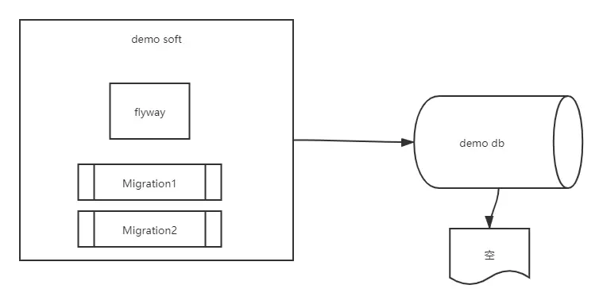
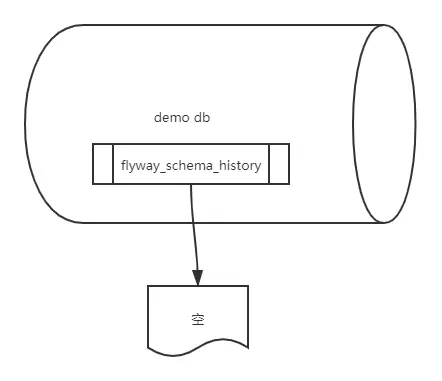
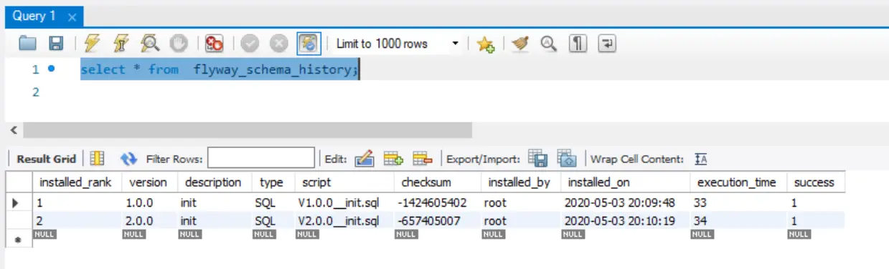
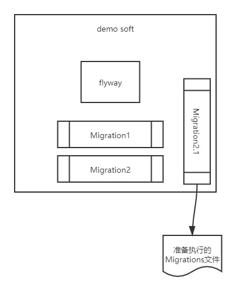
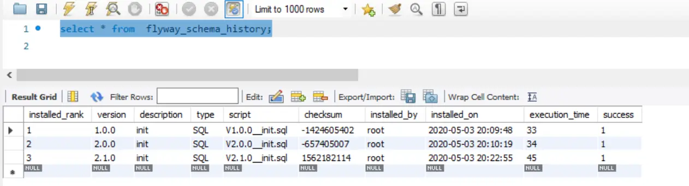

在第一篇中讲解了flyway出现的背景，这章会讲解下flyway的工作原理，相信看完本章后，读者会对整个的数据库版本管理的概念和flyway都有一个新的认识。
假设一个最简单的场景，我们要在一个空的数据库上面应用flyway，如下：

示意图8.png

flyway首先在数据库上面找一个默认的表名为flyway_schema_history的历史记录表，由于此时，数据库为空，所以flyway会创建一个表名为flyway_schema_history的空表，如下：

示意图5.png

然后flyway会使用此表来跟踪和记录数据库的日志状态。

创建了flyway_schema_history之后，flyway马上会扫描文件系统或是web应用下的classpath路径下的sql文件(如下的介绍默认使用sql文件做为migrations文件)或是java文件为migration做准备。

找到migrations文件之后，会按照version number升序排列，然后依次的执行migrations文件，如下：

示意图6.png

每执行一次migrations文件，flyway_schema_history表的内容相应的就发生变化

示意图7.png

现在我们讨论如果数据库已经有了flyway_schema_history表，且其中记录了相应的版本信息，我们现在看一下flyway_schema_history是如何做版本升级的。

flyway马上会扫描文件系统或是web应用下的classpath路径下的migrations文件为migration做准备。如果扫描到的migrations文件的版本号小于或是等于当前flyway_schema_history记录的标本号，这些migrations文件会被忽略。
而剩下的migrations文件就是准备执行的migrations文件。

示意图9.png

同理按照上面所讲的，这些剩余的migrations文件会按照version number升序排列并执行，
flyway_schema_history也会相应的记录版本更新的情况。

示意图10.png

所以如果你想升级数据库的版本信息，不管是DDL或是DML语句，只要生成一个migrations文件，并将其version number大于当前的flyway_schema_history记录的当前版本信息即可，当下次flyway执行的时候，就会找到新增的这些migrations文件，并执行和记录新的版本信息。通过这种方式，可以很方便的将相关的ddl升级脚本与代码一同的发布。

总结，flyway使用一个默认表名为flyway_schema_history的历史记录表来记录数据库的版本信息，每次执行migrations文件的时候，都会相应的更新flyway_schema_history里面的信息，flyway就是使用这种方式来记录和跟踪数据库的版本信息

flyway从入门到精通（三）：通过命令行实战flyway的能力