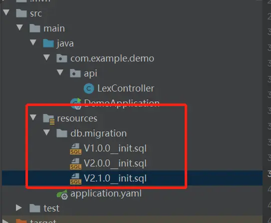

# flyway从入门到精通（五）：基于spring boot的flyway实战


[牧羊人刘俏](https://www.jianshu.com/u/ea6255a1cdf0)关注IP属地: 黑龙江

2020.05.04 10:30:49字数 265阅读 909

前面的四章对flyway做了相关的理论介绍，但是我们在实际的项目中，不可能在vm上或是物理机上面安装一个flyway然后配置conf了执行相关的flyway命令，flyway更多的是与springboot集成，实现数据库版本管理的全自动化
这一章开始，会讲解基于springboot的flyway实战，让大家在实际的项目中体验flyway，并针对各自具体的项目做定制化的开发。
首先在pom文件里面引入如下的依赖

```xml
 <dependency>
            <groupId>org.flywaydb</groupId>
            <artifactId>flyway-core</artifactId>
            <version>5.2.1</version>
 </dependency>
```

在resources的db/migration目录下面添加sql脚本如下，




示意图12.png

然后启动项目，在控制台会有如下的输出

```css
2020-05-04 10:25:12.550  INFO 8976 --- [           main] o.f.core.internal.command.DbMigrate      : Current version of schema `lexdemo`: << Empty Schema >>
2020-05-04 10:25:12.553  INFO 8976 --- [           main] o.f.core.internal.command.DbMigrate      : Migrating schema `lexdemo` to version 1.0.0 - init
2020-05-04 10:25:12.620  INFO 8976 --- [           main] o.f.core.internal.command.DbMigrate      : Migrating schema `lexdemo` to version 2.0.0 - init
```

查看数据库


示意图13.png

ok，讲解完毕，是不是很简单，是的flyway非常的简单，希望大家在项目中也能应用起来，对所有的脚本文件进行版本话的管理。

flyway从入门到精通（六）：spring boot提供的flyway的配置能力