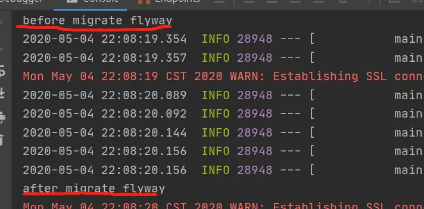

# flyway从入门到精通（八）：spring boot中flyway执行源码分析


[牧羊人刘俏](https://www.jianshu.com/u/ea6255a1cdf0)关注IP属地: 黑龙江

0.1462020.05.04 22:13:40字数 175阅读 1,699

上一章我们了解到boot创建了一个Flyway的bean，但是这个bean的migrate能力是在哪里调用的呢，在上一章中讲到了 FlywayMigrationInitializer 实现了InitializingBean接口，会在初始化bean的时候回调执行，

```java
public class FlywayMigrationInitializer implements InitializingBean, Ordered {

    private final Flyway flyway;

    private final FlywayMigrationStrategy migrationStrategy;

    private int order = 0;

    /**
     * Create a new {@link FlywayMigrationInitializer} instance.
     * @param flyway the flyway instance
     */
    public FlywayMigrationInitializer(Flyway flyway) {
        this(flyway, null);
    }

    /**
     * Create a new {@link FlywayMigrationInitializer} instance.
     * @param flyway the flyway instance
     * @param migrationStrategy the migration strategy or {@code null}
     */
    public FlywayMigrationInitializer(Flyway flyway, FlywayMigrationStrategy migrationStrategy) {
        Assert.notNull(flyway, "Flyway must not be null");
        this.flyway = flyway;
        this.migrationStrategy = migrationStrategy;
    }

    @Override
    public void afterPropertiesSet() throws Exception {
        if (this.migrationStrategy != null) {
            this.migrationStrategy.migrate(this.flyway);
        }
        else {
            this.flyway.migrate();
        }
    }

    @Override
    public int getOrder() {
        return this.order;
    }

    public void setOrder(int order) {
        this.order = order;
    }

}
```

非常的简单，没什么可以讲的，注意的就是boot集成的Flyway默认只可以进行migrate
的操作，但是我们可以使用FlywayMigrationStrategy对其进行自定义的各种扩展，

我们可以试着扩展 下，代码如下

```java
@Configuration
public class FlywayMigrationStrategyExtend {

    @Bean
    public FlywayMigrationStrategy constructFlywayMigrationStrategyExtendLocal(){

        return new FlywayMigrationStrategyExtendLocal();
    }

    private  static class FlywayMigrationStrategyExtendLocal implements FlywayMigrationStrategy{


        @Override
        public void migrate(Flyway flyway) {

            System.out.println("before migrate flyway");

            flyway.migrate();

            System.out.println("after migrate flyway");


        }
    }
    
}
```

启动项目，在控制台可以看到如下的输出




示意图15.png

flyway从入门到精通（九）：spring boot中flyway执行源码分析