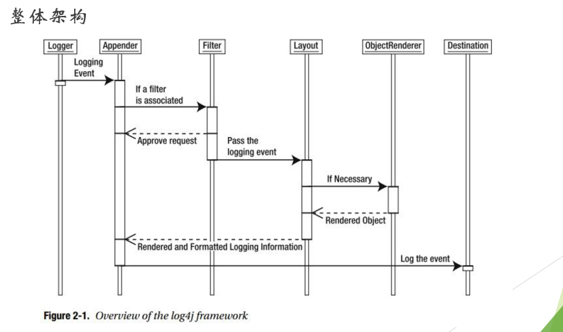
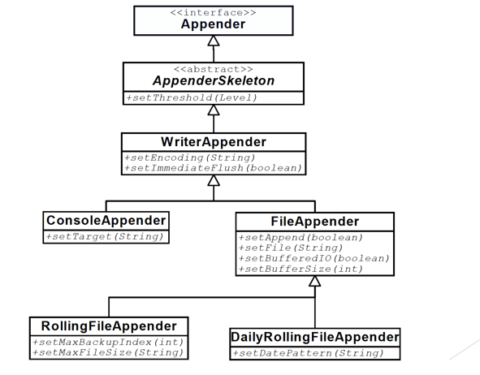
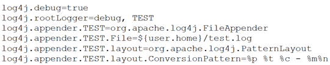
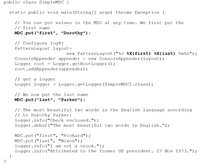
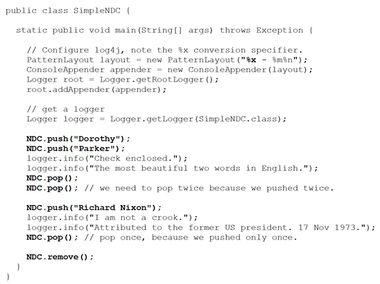
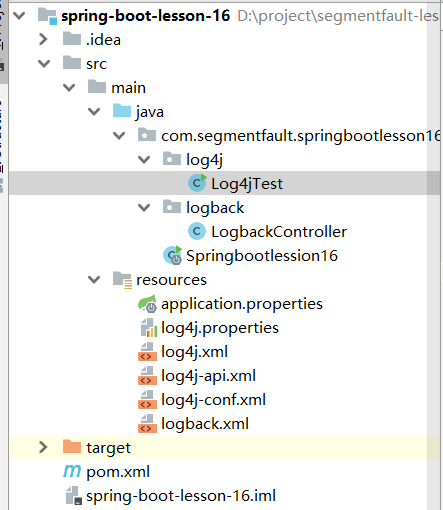
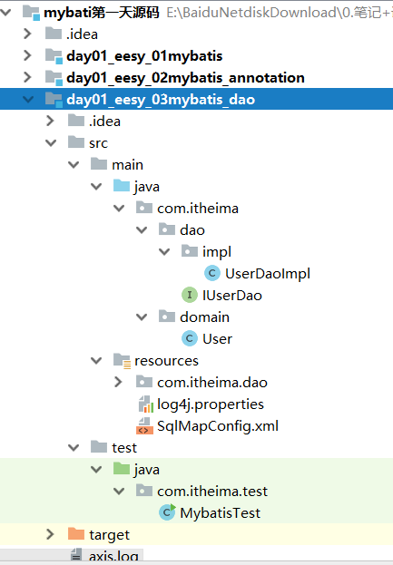
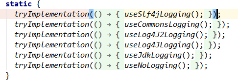
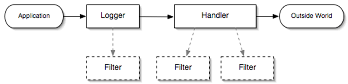

# 发展历史

Java知名的日志有很多，比如：JUL、Log4j、JCL、SLF4J、Logback、Log4j2，那么这些日志框架之间有着怎样的关系？诞生的原因又是解决什么问题？下面一起来看。

- **1.0  print、alert**

  **最原始的日志**。是的。记得大概十年前，不管是C/S模式(客户端+服务端模式)还是B/S(浏览器+服务端模式)。因为只有前端和后端交互这一层，整个项目都做在一个工程里，大家验证基本上用的前端就是alert，后台就是System.out.print。需求决定设计。链路短，这个基本就够用。

- **1.1 JUL**
  Java有自己的日志框架JUL（Java Util Logging）在java.util.logging下，因为对开发者不友好，使用成本太高和日志级别分类不清晰的问题，所有很少有开发者用。

- **1.2 Log4j**
  因为JUL的缺陷问题，这就给了Log4j机会，所有Log4j一经推出就迅速风靡全球。

- **1.3 JCL**

  JCL是Jakarta Commons-Logging的缩写，Jakarta在这里指的是一个组织，而不是印度的首都雅加达，Jakarta，一个早期的Apache开源项目，用于管理各个Java子项目，诸如Tomcat, Ant, Maven, Struts, JMeter, Velocity, JMeter, Commons等。2011年12月，在所有子项目都被迁移为独立项目后，Jakarta名称就不再使用了。

  JCL诞生的初衷是因为Java自身的一些包用了JUL，而Log4j用户使用的有很多，那么JCL就是提供一套API来实现不同Logger之间的切换。

    门面模式

- **1.4 SLF4J**
  SLF4J（Simple Logging Facade For Java）简单日志门面，和JCL功能类似，但JCL有一个致命的缺点就是算法复杂，出现问题难以排除，而SLF4J的诞生就是为了解决JCL的缺点。

  值得一提的是SLF4J的作者就是Log4j的作者。

- **1.5 Logback**
  Logback是Log4j的作者的另一个开源日志组件，与Log4j相比，Logback重新了内核，使它的性能提升了很多，大约是Log4j的10倍，同时占用更小的内存，并且完整的实现了SLF4J API是你可以很方便的切换日志框架。

   Logback有三个模块

  1. logback-core：日志处理核心组件

  2. logback-classic：完整的实现了SLF4j API，用于切换日志实现。

  3. logback-access：与Servlet容器集成提供通过http来访问日志的功能。

- **1.6 Log4j2**
  Log4j2有着和Logback相同的功能，但又有自己单用的功能，比如：插件式结构、配置文件优化、异步日志等。

  Log4j2是Log4j的升级，它比其前身Log4j 1.x提供了重大改进，并提供了Logback中可用的许多改进，同时修复了Logback架构中的一些固有问题。

  从GitHub的更新日志来看，Logback已经有半年没有更新了，而作为知名组织的Apache下的Log4j2的更新却是非常活跃的，Log4j 1.x 于2015年8月停止维护更新了。

- **1.7 日志系统**

  上面所说的日志都是代码层面。但是实际使用时由于线上都是多个节点并行在跑。为了看日志，不得不登录多个服务器。所以聪明的技术人员就想到了使用RSA授权来集中多个服务的操作于一个终端，这样的工具代表是：polysh。

  但是这样，工具使用之前的操作还是挺麻烦的，不如使用界面做一个系统。

  Scribe是Facebook开源的日志收集系统。它从各种日志源收集日志，存储在中央存储系统，进行集中的分析处理。

  业界比较流行的做法是使用Scribe+ES。Scribe收集上来的日志放入搜索引擎，用户使用搜索引擎来灵活的查看自己感兴趣的日志，如同访问一个网站。

# Log4j

## 介绍



## API

### Logger

日志对象（org.apache.log4j.Logger）是最核心的API。

举例说明

```java
Logger logger = Logger.getLogger("ROOT");
logger.info("message");
```

API 层次
	-org.apache.log4j.Category
			-org.apache.log4j.Logger

### Level

日志级别（org.apache.log4j.Level）

OFF
FATAL
ERROR
INFO
DEBUG
TRACE
ALL

API 层次
	-org.apache.log4j.Priority
			-org.apache.log4j.Level

### LogManager

日志管理器（org.apache.log4j.LogManager）

主要职责：

​	初始化默认log4j 配置
​	维护日志仓储（org.apache.log4j.spi.LoggerRepository）
​	获取日志对象（org.apache.log4j.Logger）

### LoggerRepository

日志仓储（org.apache.log4j.spi.LoggerRepository）

主要职责：

​	管理日志级别阈值（org.apache.log4j.Level）
​	管理日志对象（org.apache.log4j.Logger）

### Appender

日志附加器（org.apache.log4j.Appender）

日志附加器是日志事件（org.apache.log4j.LoggingEvent）具体输出的介质，如：控制台、文件系统、网络套接字等。

日志附加器（org.apache.log4j.Appender）关联零个或多个日志过滤器（org.apache.log4j.Filter），这些过滤器形成过滤链。



主要职责：

​	附加日志事件（org.apache.log4j.LoggingEvent）
​	关联日志布局（org.apache.log4j.Layout）
​	关联日志过滤器（org.apache.log4j.Filter）
​	关联错误处理器（org.apache.log4j.spi.ErrorHandler）

**各个实现**

- 控制台实现：org.apache.log4j.ConsoleAppender
- 文件实现
  - 普通方式：org.apache.log4j.FileAppender
  - 滚动方式：org.apache.log4j.RollingFileAppender
  - 每日规定方式：org.apache.log4j.DailyRollingFileAppender
- 网络实现
  - Socket方式：org.apache.log4j.net.SocketAppender
  - JMS方式：org.apache.log4j.net.JMSAppender
  - SMTP方式：org.apache.log4j.net.SMTPAppender
- 异步实现：org.apache.log4j.AsyncAppender	

### Filter

日志过滤器（org.apache.log4j.spi.Filter）

日志过滤器用于决策当前日志事件（org.apache.log4j.spi.LoggingEvent）是否需要在执行所关联的日志附加器（org.apache.log4j.Appender）中执行。

**决策结果有三种**：

- DENY：日志事件跳过日志附加器的执行
- ACCEPT：日志附加器立即执行日志事件
- NEUTRAL：跳过当前过滤器，让下一个过滤器决策

### Layout

日志格式布局（org.apache.log4j.Layout）

日志格式布局用于格式化日志事件（org.apache.log4j.spi.LoggingEvent）为可读性的文本内容。

**内建实现**：

- 简单格式：org.apache.log4j.SimpleLayout

- 模式格式：org.apache.log4j.PatternLayout

- 提升模式格式：org.apache.log4j.EnhancedPatternLayout

- HTML格式：org.apache.log4j.HTMLLayout

- XML格式：org.apache.log4j.xml.XMLLayout

- TTCC格式：org.apache.log4j.TTCCLayout

  TTCC – **T**ime、**T**hread、**C**ategory、nested diagnostic **C**ontext information

### LoggingEvent

日志事件（org.apache.log4j.LoggingEvent）

日志事件是用于承载日志信息的对象，其中包括：

- 日志名称
- 日志内容
- 日志级别
- 异常信息（可选）
- 当前线程名称
- 时间戳
- 嵌套诊断上下文（NDC）
- 映射诊断上下文（MDC）

### Configurator

日志配置器（org.apache.log4j.spi.Configurator）

日志配置器提供外部配置文件配置log4j行为的API，log4j 内建了两种实现：

- Properties 文件方式（org.apache.log4j.PropertyConfigurator）



- XML 文件方式（org.apache.log4j.xml.DOMConfigurator）


### NDC、MDC

日志诊断上下文（org.apache.log4j.NDC、org.apache.log4j.MDC）

日志诊断上下文作为日志内容的一部分，为其提供辅助性信息，如当前 HTTP 请求 URL。Neil Harrison described this method in the book “Patterns for Logging Diagnostic Messages,” in Pattern Languages of Program Design 3。

log4j 有两种类型的日志诊断上下文，分别是映射诊断上下文和嵌套诊断上下文：

- 映射诊断上下文（org.apache.log4j.MDC）

  ​	该诊断上下文是以Key-Value的形式存储诊断信息，如：

  

  

- 嵌套诊断上下文（org.apache.log4j.NDC）

  ​	该诊断上下文是以堆栈的形式存储诊断信息，如：

  

  

## 例子

### main例子

```java
    public static void main(String[] args) throws Exception {

        //System.setProperty(DEFAULT_CONFIGURATION_KEY, "log4j-conf.xml");

        Logger logger = Logger.getLogger(Log4jTest.class.getName());

        logger.setLevel(Level.INFO);

        logger.info("Hello,World");

        // 重新加载 log4j的配置

        URL url = Thread.currentThread().getContextClassLoader().getResource("log4j-api.xml");

        DOMConfigurator.configure(url);

        MDC.put("requestURI","https://segmemtfault.com");

        logger = Logger.getLogger(Log4jTest.class.getName());

        // 调整级别后输出
        logger.info("Hello,World");

        logger.error("大家好");


    }
```



### mabatis例子

随便选择一个简单的框架都会，例如在以前的项目中mybatis框架也使用了日志。



依赖

```xml
        <dependency>
            <groupId>log4j</groupId>
            <artifactId>log4j</artifactId>
            <version>1.2.12</version>
        </dependency>
```

log4j.properties文件

```properties
# Set root category priority to INFO and its only appender to CONSOLE.
#log4j.rootCategory=INFO, CONSOLE            debug   info   warn error fatal
log4j.rootCategory=debug, CONSOLE, LOGFILE

# Set the enterprise logger category to FATAL and its only appender to CONSOLE.
log4j.logger.org.apache.axis.enterprise=FATAL, CONSOLE

# CONSOLE is set to be a ConsoleAppender using a PatternLayout.
log4j.appender.CONSOLE=org.apache.log4j.ConsoleAppender
log4j.appender.CONSOLE.layout=org.apache.log4j.PatternLayout
log4j.appender.CONSOLE.layout.ConversionPattern=%d{ISO8601} %-6r [%15.15t] %-5p %30.30c %x - %m\n

# LOGFILE is set to be a File appender using a PatternLayout.
log4j.appender.LOGFILE=org.apache.log4j.FileAppender
log4j.appender.LOGFILE.File=d:\axis.log
log4j.appender.LOGFILE.Append=true
log4j.appender.LOGFILE.layout=org.apache.log4j.PatternLayout
log4j.appender.LOGFILE.layout.ConversionPattern=%d{ISO8601} %-6r [%15.15t] %-5p %30.30c %x - %m\n
```

如果没有properties文件那么就会报异常

```
log4j:WARN No appenders could be found for logger (org.apache.ibatis.logging.LogFactory).
log4j:WARN Please initialize the log4j system properly.
WARNING: An illegal reflective access operation has occurred
WARNING: Illegal reflective access by org.apache.ibatis.reflection.Reflector (file:/E:/MavenRepository/org/mybatis/mybatis/3.4.5/mybatis-3.4.5.jar) to method java.lang.Class.checkPackageAccess(java.lang.SecurityManager,java.lang.ClassLoader,boolean)
WARNING: Please consider reporting this to the maintainers of org.apache.ibatis.reflection.Reflector
WARNING: Use --illegal-access=warn to enable warnings of further illegal reflective access operations
WARNING: All illegal access operations will be denied in a future release
```

### 追踪源码




```java
//org.apache.ibatis.logging.LogFactory负责创建日志对象
//1. 逐个测试建立logge对象
public final class LogFactory {
    
    private static Constructor<? extends Log> logConstructor;//getLogger()的底层实现类
    
	static {
    tryImplementation(new Runnable() {
      @Override
      public void run() {
        useSlf4jLogging();
      }
    });
    ...
    }
	
//并没有开启线程，并且不处理异常
  private static void tryImplementation(Runnable runnable) {
    if (logConstructor == null) {
      try {
        runnable.run();
      } catch (Throwable t) {
        // ignore
      }
    }
  }

// 2. 开始创建的方法
 public static synchronized void useSlf4jLogging() {
    setImplementation(org.apache.ibatis.logging.slf4j.Slf4jImpl.class);
  }

  public static synchronized void useCommonsLogging() {
    setImplementation(org.apache.ibatis.logging.commons.JakartaCommonsLoggingImpl.class);
  }
  ...//其他日志都是这样
     
      // 3. 反射创建对象
  private static void setImplementation(Class<? extends Log> implClass) {
    try {
      Constructor<? extends Log> candidate = implClass.getConstructor(String.class);
      Log log = candidate.newInstance(LogFactory.class.getName());
      if (log.isDebugEnabled()) {
        log.debug("Logging initialized using '" + implClass + "' adapter.");
      }
      logConstructor = candidate;
    } catch (Throwable t) {
      throw new LogException("Error setting Log implementation.  Cause: " + t, t);
    }
  }   
 ...   
}
```

```java
//创建logger
	//mybatis层面
  private static final Log log = LogFactory.getLog(AutoMappingUnknownColumnBehavior.class);

  public static Log getLog(Class<?> aClass) {
    return getLog(aClass.getName());
  }

  public static Log getLog(String logger) {
    try {
      return logConstructor.newInstance(logger);
    } catch (Throwable t) {
      throw new LogException("Error creating logger for logger " + logger + ".  Cause: " + t, t);
    }
  }
  public Log4jImpl(String clazz) {
    log = Logger.getLogger(clazz);
  }

//底层到log4j
    public static Logger getLogger(String name) {
        return LogManager.getLogger(name);
    }
    public static Logger getLogger(String name) {
        return repositorySelector.getLoggerRepository().getLogger(name);
    }
```


```java
//使用logger
          if (log.isDebugEnabled()) {
            log.debug("Returned connection " + newConn.getRealHashCode() + " to pool.");
          }
```


# Java Logging

- **介绍**

​	Java Logging 是Java 标准的日志框架，也称为 Java Logging API，即 JSR 47。从 Java 1.4 版本开始，Java Logging 成为 Java SE的功能模块，其实现类存放在“java.util.logging”包下。

- **特色**
   Java 天然性
  Java Security 整合
  Java 国际化/本地化 整合

- **整体架构**



- **API**

  日志对象（java.util.logging.Logger）
  日志级别（java.util.logging.Level）
  日志管理器（java.util.logging.LogManager）
  日志处理器（java.util.logging.Handler	） 
  日志过滤器（java.util.logging.Filter）
  日志格式器（java.util.logging.Formatter）
  日志记录（java.util.logging.LogRecord）
  日志权限（java.util.logging.LoggingPermission）
  日志JMX接口（java.util.logging.LoggingMXBean）

# logback

- **介绍**

  Logback 是 Log4j 的替代者，在架构和特征上有着相当提升。

- **重要提升**

  执行速度更快，内存占用更小
  Slf4 无缝整合
  自动重载配置文件
  自动移除老的归档日志
  自动压缩归档日志文件
  条件化配置文件
  解读：https://logback.qos.ch/reasonsToSwitch.html

- 参考文献

  [Java日志框架：logback详解](https://www.cnblogs.com/xrq730/p/8628945.html)

  [logback的使用和logback.xml详解](https://www.cnblogs.com/warking/p/5710303.html)

  [github](https://github.com/qos-ch/logback)
  
  [LogBack日志丢失原因调查和解决方法](https://blog.csdn.net/qq_24210767/article/details/80095685)

# Log4j2

- **介绍**
  Log4j2 同样也是 Log4j 的替代者，在性能方面提升非常显著。

- **重要提升**

  执行速度更快，内存占用更小
  避免锁
  自动重载配置文件
  高级过滤
  插件架构

解读：https://logging.apache.org/log4j/2.x/


# 统一日志 API

背景
	日志框架无论 Log4j 还是 Logback，虽然它们功能完备，但是各自API 相互独立，并且各自为政。当应用系统在团队协作开发时，由于工程人员可能有所偏好，因此，可能导致一套系统可能同时出现多套日志框架。
	其次，最流行的日志框架基本上基于实现类编程，而非接口编程。因此，暴露一些无关紧要的细节给用户，这种耦合性是没有必要的。

诸如此类的原因，开源社区提供统一日志的API框架，最为流行的是：

Apache commons-logging
适配 log4j 和 Java Logging
slf4j
适配 Log4j、Java Logging 和 Logback

# 参考

log4j2：https://github.com/apache/logging-log4j2

[动态修改日志级别，太有用了！ ](https://www.cnblogs.com/ibigboy/p/17656193.html)


#   