# 消息中间件架构

## 各种消息中间件性能的比较

- **TPS比较** 一ZeroMq 最好，RabbitMq 次之， ActiveMq 最差。

- **持久化消息比较**—zeroMq不支持，activeMq和rabbitMq都支持。持久化消息主要是指：MQ down或者MQ所在的服务器down了，消息不会丢失的机制。

- **可靠性、灵活的路由、集群、事务、高可用的队列、消息排序、问题追踪、可视化管理工具、插件系统、社区**—RabbitMq最好，ActiveMq次之，ZeroMq最差。

- **高并发**—从实现语言来看，RabbitMQ最高，原因是它的实现语言是天生具备高并发高可用的erlang语言。

  综上所述：RabbitMQ的性能相对来说更好更全面，是消息中间件的首选。  

## 消息可达性保证机制

- **这个机制或者约定更确切些，就是描述系统到底怎么client进行交互，确保信息是正确的到达了目的地。一般的消息保证机制有：**

1. 至多一次，保证绝对不重复发，但是有丢数据情况。这种情况server处理是最简单的，发完了就不管了，不需要和client交互。

> at-most-once delivery means that for each message handed to the mechanism, that message is delivered zero or one times; in more casual terms it means that messages may be lost.

2. 至少一次，保证一定client接收到了信息，如果不能确定client接收到了信息会重复发。做到这点server只要一直发知道接收到了client的ack。

> at-least-once delivery means that for each message handed to the mechanism potentially multiple attempts are made at delivering it, such that at least one succeeds; again, in more casual terms this means that messages may be duplicated but not lost.

3. 精确的一次，保证不重复发但也不丢数据。exactly-once是最难保证的，因为这涉及到通信中的很多情况。

> exactly-once delivery means that for each message handed to the mechanism exactly one delivery is made to the recipient; the message can neither be lost nor duplicated.
>
> The first one is the cheapest—highest performance, least implementation overhead—because it can be done in a fire-and-forget fashion without keeping state at the sending end or in the transport mechanism. The second one requires retries to counter transport losses, which means keeping state at the sending end and having an acknowledgement mechanism at the receiving end. The third is most expensive—and has consequently worst performance—because in addition to the second it requires state to be kept at the receiving end in order to filter out duplicate deliveries.

- **为什么保证不了消息发送？**

> The message is sent out on the network?
> The message is received by the other host?
> The message is put into the target actor’s mailbox?
> The message is starting to be processed by the target actor?
> The message is processed successfully by the target actor?

其实就从消息传递从出发到结果的整个过程，状体包括出发、路上、进门、喝茶、出门和回家通报。
其中在路上需要花多少时间谁都不知道，还有没有万一进门后被真“喝茶”后，不返回通报的你让发送者的家人怎么办？


## 消息顺序保证机制

1. 保证消息一定是顺序到达的，这个地方需要考虑如果是一个kafka的系统，同一个group下的不同consumer之间的顺序怎么保证？
2. 不保证消息一定顺序到达


## 后台微服务的相互调用

后台微服务的相互调用一般有以下几种。

| 种类                         | 协议                                | 支持                   | 优缺点                                                       |
| :--------------------------- | :---------------------------------- | :--------------------- | ------------------------------------------------------------ |
| restful api、soap、graphql等 | http/json、xml                      | 实现了http的语言都支持 | 通用性强，不需要额外的学习成本，但是性能比较差。             |
| grpc                         | http2.0 /Protobuf                   | 常用的开发语言         | 基于http2请求和Protobuf数据解析，性能高于http，但是需要编写idl。 |
| thrift                       | TFramedTransport/TBinaryProtocol 等 | 基本全语言             | thrift基本socket封装，可以根据需求选用不用的传输协议和数据解析格式，性能高于grpc，也需要idl。 |
| nanomsg、kafka、rabbitmq等   | 各种mq协议                          | 基本全语言             | 不同的mq适用与不同的场景，但是都是为了解耦，并且消费者可以扩展。 |

## [AMQP(高级消息队列协议)](https://www.jianshu.com/p/5319b06f2e80)

在异步通讯中，消息不会立刻到达接收方，而是被存放到一个容器中，当满足一定的条件之后，消息会被容器发送给接收方，这个容器即消息队列，而完成这个功能需要双方和容器以及其中的各个组件遵守统一的约定和规则，AMQP就是这样的一种协议，消息发送与接受的双方遵守这个协议可以实现异步通讯。这个协议约定了消息的格式和工作方式。RabbitMQ是流行的开源消息队列系统，用erlang语言开发。RabbitMQ是AMQP的标准实现。

### 2.1 规范文档

[AMQP-0-9-1中文规范](https://link.jianshu.com?t=http%3A%2F%2Fwww.blogjava.net%2Fqbna350816%2Farchive%2F2016%2F08%2F12%2F431554.html)
 [AMQP-0-9-1英文规范](https://link.jianshu.com?t=http%3A%2F%2Fwww.rabbitmq.com%2Ftutorials%2Famqp-concepts.html)

> 以下为选取部分文档中重点来解析

### 2.2 模型

消息从"发送端"(publisher)把消息发布到"交换器"(exchange),通常比邮局或邮箱。"交换器"根据"路由关键字"(routing-key)去绑定(binding)一个队列(queue)。然后AMQP代理(broker)向消费者(consumers)传递消息订阅队列(queues),或消费者从队列获取消息。

> The AMQP 0-9-1 Model has the following view of the world: messages are published to *exchanges*, which are often compared to post offices or mailboxes. Exchanges then distribute message copies to *queues* using rules called *bindings*. Then AMQP brokers either deliver messages to consumers subscribed to queues, or consumers fetch/pull messages from queues on demand.

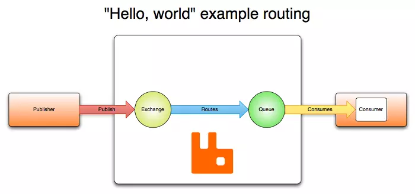

hello-world-example-routing.png

### 2.2 message、producter、consumer

message:由消息头和消息体组成。消息体是不透明的，而消息头则由一系列的可选属性组成，这些属性包括routing-key（路由键）、priority（相对于其他消息的优先权）、delivery-mode（指出该消息可能需要持久性存储）等。
 producter(Publisher): 生产者，一般指生产消息的一端。
 consumer: 消费者，一般指消费消息的一端。

### 2.2 Broker

消息队列服务器的实体，也可以理解为代理，不管消费者还是生产者，都需要连接到broker，才能进行生产消费。

### 2.3 exchange and exchange types

rabbitmq的message model实际上消息不直接发送到queue中，中间有一个exchange是做消息分发，producer甚至不知道消息发送到那个队列中去。因此，当exchange收到message时，必须准确知道该如何分发。是append到一定规则的queue，还是append到多个queue中，还是被丢弃？这些规则都是通过exchagne的4种type去定义的。

| type             | 创建vhost时默认创建的exchange 的名称    |
| ---------------- | :-------------------------------------- |
| Direct exchange  | (Empty string) and amq.direct           |
| Fanout exchange  | amq.fanout                              |
| Topic exchange   | amq.topic                               |
| Headers exchange | amq.match (and amq.headers in RabbitMQ) |

*exchange还有以下属性*:

| attribute   | type   | describe                                         |
| :---------- | :----- | :----------------------------------------------- |
| name        | string | exchange的名称                                   |
| Durability  | bool   | exchange是否持久化                               |
| Auto-delete | bool   | 当所有绑定队列都不再使用时，是否自动删除该交换器 |
| Arguments   | object | 使用 broker-specific 时候的参数                  |

> exchange 的type

- Default Exchange
   default exchange(默认交换器)是没有名字的direct exchange。name为空字符串。所有queue都默认binding 到该交换器上。所有binding到该交换器上的queue，routing-key都和queue的name一样。例如: 当创建一个name="search-indexing-online"的queue，broker会把改queue绑定到name="search-indexing-online"的routing-key上。因此消息发送到default exchange并且匹配到search-indexing-online的router，则该消息被送到search-indexing-online的queue。
- Direct Exchange
   direct exchange(直接交换器)是理想的单播路由的消息交换(尽管它们可以用于多播路由)。例如一个queue 绑定到"router key" =K的direct exchange上，那么当发送一个router key为R的message到该direct exchange，那个该消息会推送到"router key"=K的queue上。

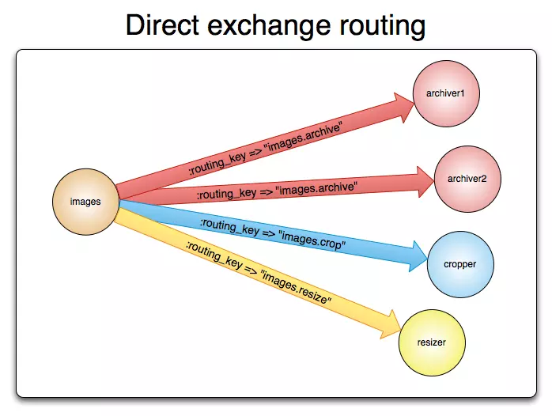

image.png

- Fanout Exchange
   fanout exchange(展开交换器)，该交换器会把消息发送到所有binding到该交换器上的queue。这种是publisher/subcribe模式。用来做广播最好。

  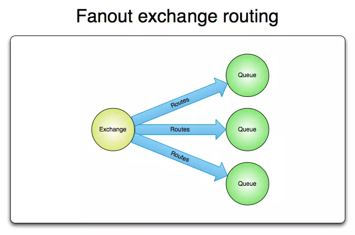

  image.png

- Topic Exchange
   topic exchange(通配符交换器)，exchange会把消息发送到一个或者多个满足通配符规则的routing-key的queue。这里的routingkey可以有通配符：'*','#'。其中'*'表示匹配一个单词， '#'则表示匹配没有或者多个单词

- Header Exchang
   header exchang(自定义交换器)，根据自定义的header attribute去匹配不同的queue。

### 2.4 Quue

queue(队列，task-queueing系统)，主要存储消息被提供消费者进行消费。

*queue还有以下属性*:

| attribute   | type   | describe                                       |
| :---------- | :----- | :--------------------------------------------- |
| name        | string | queue的名称                                    |
| Durability  | bool   | queue是否持久化                                |
| exclusive   | bool   | 当消费者断开连接后是否删除该队列               |
| Auto-delete | bool   | 当所有消费客户端连接断开后，是否自动删除队列。 |
| Arguments   | object | 使用 broker-specific 时候的参数                |

### 2.5 bindings

exchange和queue通过routing-key关联，这两者之间的关系是就是binding。

### 2.6 Message Acknowledgements

消息应答。执行一个任务可能需要花费几秒钟，你可能会担心如果一个消费者在执行任务过程中挂掉了。一旦RabbitMQ将消息分发给了消费者，就会从内存中删除。在这种情况下，如果正在执行任务的消费者宕机，会丢失正在处理的消息和分发给这个消费者但尚未处理的消息。
 但是，我们不想丢失任何任务，如果有一个消费者挂掉了，那么我们应该将分发给它的任务交付给另一个消费者去处理。
 为了确保消息不会丢失，RabbitMQ支持消息应答。消费者发送一个消息应答，告诉RabbitMQ这个消息已经接收并且处理完毕了。RabbitMQ就可以删除它了。
 如果一个消费者挂掉却没有发送应答，RabbitMQ会理解为这个消息没有处理完全，然后交给另一个消费者去重新处理。这样，你就可以确认即使消费者偶尔挂掉也不会丢失任何消息了。
 没有任何消息超时限制；只有当消费者挂掉时，RabbitMQ才会重新投递。即使处理一条消息会花费很长的时间。
 消息应答是默认打开的。我们通过显示的设置autoAsk=true关闭这种机制。现即自动应答开，一旦我们完成任务，消费者会自动发送应答。通知RabbitMQ消息已被处理，可以从内存删除。如果消费者因宕机或链接失败等原因没有发送ACK（不同于ActiveMQ，在RabbitMQ里，消息没有过期的概念），则RabbitMQ会将消息重新发送给其他监听在队列的下一个消费者。

### 2.7 Rejecting Messages

拒绝消息。当消费者应用程序收到消息时，该消息的处理可能会成功，也可能不会成功。 消费者可以通过拒绝消息向代理指出消息处理失败（或当时无法完成）。 当拒绝消息时，消费者可以要求代理丢弃或重新发送消息。 当队列中只有一个消费者时，确保您不会通过一次又一次地拒绝并重新发送来自同一个消费者的消息来创建无限的消息传递循环。

### 2.8 Negative Acknowledgements

拒绝应答。消费者使用 basic.reject拒绝消息，则该消息为Rejecting Messages。AMQP
 只能一次拒绝一条消息，但是如果用的rabbitmq则可以拒绝多个消息。[参考地址](https://link.jianshu.com?t=http%3A%2F%2Fwww.rabbitmq.com%2Fnack.html)

### 2.9 Prefetching Messages

预取消息。指定channel(通道)的等待处理的消息个数，如果等待的消息已经达到该值，则该消费者不再接受新的消息。默认的channel不限制个数。最好的方式是设置该值在一个合理的数值，达到多消费者之间的简单负载均衡。

### 2.10 Message Attributes and Payload

消息的属性和有效载荷(携带的数据)。

某些属性由AMQP代理使用，但大多数属性可以接收它们的应用程序使用。有些属性是可选的，称为标题。它们与HTTP中的X-Headers类似。邮件发布时设置邮件属性。

AMQP消息也有一个有效负载（它们携带的数据），AMQP代理将其视为一个不透明的字节数组。经纪人不会检查或修改有效载荷。消息可能只包含属性而没有有效载荷。使用JSON，Thrift，Protocol Buffers和MessagePack等序列化格式来序列化结构化数据以便将其发布为消息有效载荷是很常见的。 AMQP同伴通常使用“内容类型”和“内容编码”字段来传达这些信息，但这只是惯例而已。

消息可能会作为持久性发布，这会使AMQP代理将它们保存到磁盘。如果服务器重新启动，系统会确保接收到的持久性消息不会丢失。简单地将消息发布到持久交换或者将其发送到队列的事实是持久的并不会使消息持久化：这完全取决于消息本身的持久模式。将消息发布为持久性会影响性能（就像使用数据存储一样，持久性在性能上会带来一定的成本）。
 Content type
 Content encoding
 Routing key
 Delivery mode (persistent or not)
 Message priority
 Message publishing timestamp
 Expiration period
 Publisher application id

### 2.11 Connections

AMQP是一种使用TCP进行可靠传输的应用程序级协议。 AMQP连接可以使用身份验证，并且可以使用TLS（SSL）进行保护。 当应用程序不再需要连接到AMQP代理时，它应该正常关闭AMQP连接，而不是突然关闭底层TCP连接。

### 2.12 Channels

某些应用程序需要多个连接到AMQP代理。 但是，不希望同时打开多个TCP连接，因为这样做会占用系统资源并使配置防火墙变得更加困难。 AMQP 0-9-1连接可被认为是“共享单个TCP连接的轻量级连接”的通道复用。
 对于使用多个线程/进程进行处理的应用程序，通常为每个线程/进程打开一个新通道并且不共享它们之间的通道。
 特定通道上的通信与另一个通道上的通信完全分离，因此每个AMQP方法都会携带一个通道号，客户端可以使用该通道号来确定该方法适用于哪个通道。

### 2.13 Virtual Hosts

为了使单个代理可以托管多个孤立的“环境”（用户组，交换，队列等），AMQP包含虚拟主机（虚拟主机）的概念。 它们与许多流行的Web服务器使用的虚拟主机相似，并提供AMQP实体所处的完全隔离的环境。 AMQP客户端指定在AMQP连接协商期间他们想要使用哪些虚拟主机。


作者：yanshaowen
链接：https://www.jianshu.com/p/5319b06f2e80
来源：简书
著作权归作者所有。商业转载请联系作者获得授权，非商业转载请注明出处。

# 应用场景

## 总结

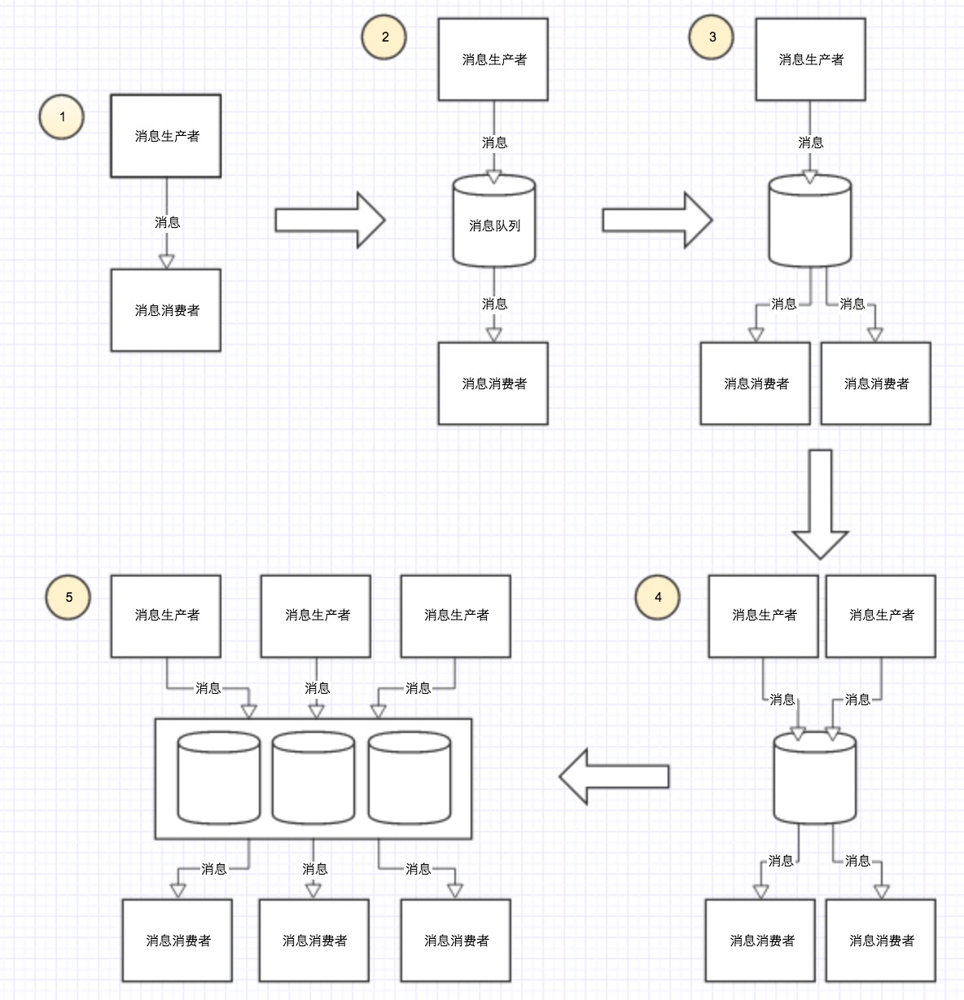


从上面的演化图来看，有了消息队列后的一个本质变化就是把**收消息和接消息的任务都扔给了第三方**，其实这就是软件行业中最一般的做法如**果要获得软件的灵活性和扩展性，那么就开始加中间层**。计算机网络是这么做的，同样操作系统也是这么做的。

而考虑具体的好处这个问题和系统会出现什么问题是手心手背的关系。我们就来一块一块的说。

我们假设我们要做一个买票系统。数据库使用mysql，前面只有一个售票程序来操作数据。这时候的模型就是第一个模块的样子。初期的时候一切都很完美，这个网站只拥有1万用户，每天只卖500张票。

后来发现有些背后的mysql总是宕机，导致用户订票总是不成功，所以就想着怎么把用户的订单信息先存下来，然后等mysql恢复后马上继续处理。这时候你就开始想着建立一个消息缓存队列，然后程序自然形成了一个生产者消费者模型。同时你还会发现这个不仅仅有消息缓存的好处，还有发现消息现在是可以被保存了（或者说很便捷和自然的保存了）。

以前那些因为程序bug处理失败的消息可以被重复处理了。还有就是哪天突然要在mysql之上加上一层redis，那其实也不必修改上游程序。总结下来：

> 1. 缓冲 – 消息的缓存，当下游处于宕机状态，消息可以被缓存等待重启后继续处理。
> 2. 解耦 – 项目之间解耦，形成各种微服务
> 3. 冗余
> 4. 送达保证
> 5. 顺序保证能实现了
>
> 6. 消除峰值 – 即消息均衡，当消息的生产速度差距很大的时候，消息可以被缓存，然后转发其他空闲的服务上或者等待等后续措施。（再后来你的系统的用户增加到了100万，而且因为是买的火车票，所以一到过节订单就出现高峰，这时候辛亏你有了消息队列可以帮你缓存。）
>
> 7. 扩展性，后来再发现一个消息队列因为不够存储高峰期间储蓄的数据了，这时候再增加下游的消费者处理能力很浪费，因为平时你用不着。这时候发现增加一个消息队列服务的成本去很低，那么开始扩展这里。
>
>    其他feature：
>
>    1. 异步通信：这个是好是坏，全看实际的引用场景。对于实时要求性很高，但是不要求消息全部保证被处理就是无所谓的特性。
>
>    2. 附赠的feature(只是更方便吧)：
>
>       ​	因为消息缓存的独立，可以对其处理速度监控，从而得知系统的负载能力。
>


## 异步处理

场景说明：用户注册后，需要发注册邮件和注册短信

1. ​	**传统方式**
   1. **串行方式**： 将注册信息写入数据库后,发送注册邮件,再发送注册短信,以上三个任务全部完成后才返回给客户端。 这有一个问题是,邮件,短信并不是必须的,它只是一个通知,而这种做法让客户端等待没有必要等待的东西.  

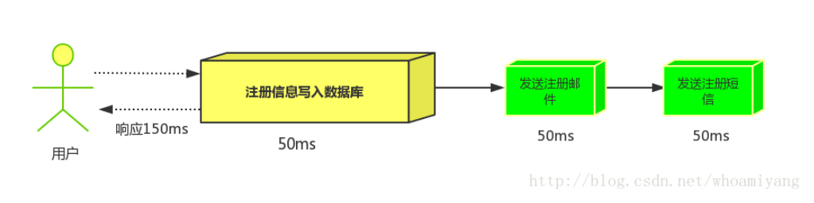

​			2. **并行方式**：将注册信息写入数据库后,发送邮件的同时,发送短信,以上三个任务完成后,返回给客户端，并行的方式能提高处理的时间。  

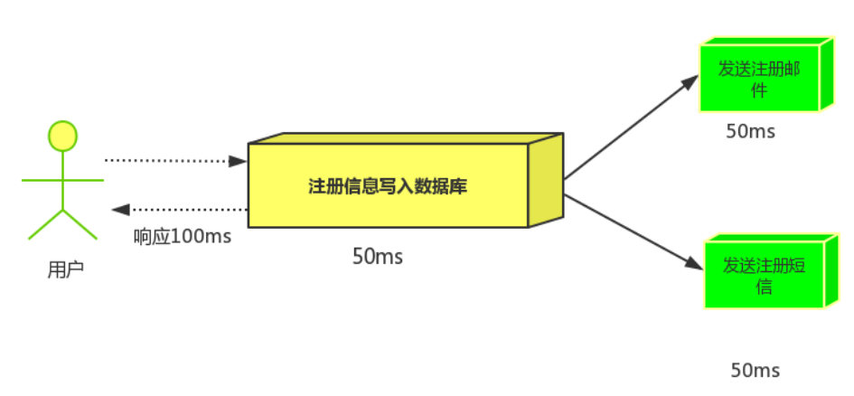

2. ​	**消息队列（异步）**  

假设三个业务节点分别使用50ms,串行方式使用时间150ms,并行使用时间100ms。虽然并性已经提高的处理时间,但是,前面说过,邮件和短信对我正常的使用网站没有任何影响，客户端没有必要等着其发送完成才显示注册成功,因为是写入数据库后就返回.  

引入消息队列后，把发送邮件,短信不是必须的业务逻辑异步处理  

由此可以看出,引入消息队列后，用户的响应时间就等于写入数据库的时间+写入消息队列的时间(可以忽略不计),引入消息队列后处理后,响应时间是串行的3倍,是并行的2倍。  

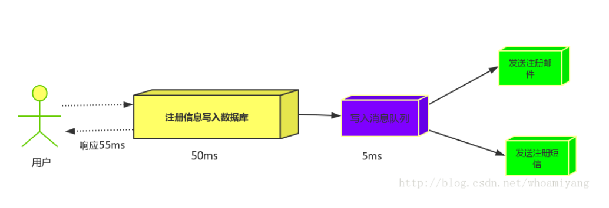

## 应用解耦

场景：双11是购物狂节,用户下单后,订单系统需要通知库存系统,传统的做法就是订单系统调用库存系统的接口.  


这种做法有一个缺点:

- 当库存系统出现故障时,订单就会失败。(这样马云将少赚好多好多钱^ ^)
- 订单系统和库存系统高耦合。

**引入消息队列**

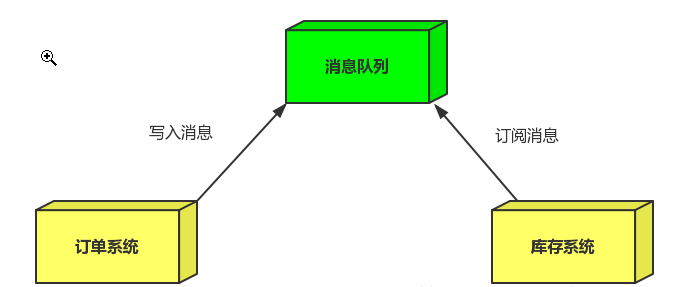

订单系统:用户下单后,订单系统完成持久化处理,将消息写入消息队列,返回用户订单下单成功。

库存系统:订阅下单的消息,获取下单消息,进行库操作。就算库存系统出现故障,消息队列也能保证消息的可靠投递,不会导致消息丢失。  

## 流量削峰

流量削峰一般在秒杀活动中应用广泛
场景:秒杀活动，一般会因为流量过大，导致应用挂掉,为了解决这个问题，一般在应用前端加入消息队列。

**作用:**

1. 可以控制活动人数，超过此一定阀值的订单直接丢弃(我为什么秒杀一次都没有成功过呢^^)
2. 可以缓解短时间的高流量压垮应用(应用程序按自己的最大处理能力获取订单)	


1. 用户的请求,服务器收到之后,首先写入消息队列,加入消息队列长度超过最大值,则直接抛弃用户请求或跳转到错误页面.
2. 秒杀业务根据消息队列中的请求信息，再做后续处理.

# 使用


## linux下安装

### 环境及版本介绍(当前最新版本)

| 名称     | 版本            |
| -------- | --------------- |
| system   | centos 7 64-bit |
| jdk      | 1.8             |
| erlang   | OTP20.3/9.3     |
| rabbitmq | 3.7.4           |

### 1 编译安装Erlang环境

```shell
sudo yum install gcc glibc-devel make ncurses-devel openssl-devel autoconf
sudo yum install unixODBC unixODBC-devel
wget http://erlang.org/download/otp_src_20.3.tar.gz
cd otp_src_20.3
tar xvfz otp_src_20.3.tar.gz
./configure   
sudo make install
```

### 2 检查erlang是否安装成功

```shell
erl
```

### 3 安装RabbitMQ

```shell
wget https://dl.bintray.com/rabbitmq/all/rabbitmq-server/3.7.4/rabbitmq-server-generic-unix-3.7.4.tar.xz
xz -d rabbitmq-server-generic-unix-3.7.4.tar.xz 
tar -xvf rabbitmq-server-generic-unix-3.7.4.tar  
mv rabbitmq_server-3.7.4 /data/service/
```

### 4 添加环境变量

sudo vim /etc/profile  ### 文件结尾追加

```shell
# rabbitmq
export RABBITMQ_HOME=/data/service/rabbitmq_server-3.7.4
export PATH=$RABBITMQ_HOME/sbin:$PATH
```

### 5 启动

```shell
rabbitmq-server -detached   #后台运行rabbitmq  
rabbitmq-plugins enable rabbitmq_management   #启动后台管理  
```

### 6 添加admin用户

默认网页guest用户是不允许访问的，需要增加一个用户修改一下权限，代码如下：

```shell
rabbitmqctl add_user admin admin                               #添加用户
rabbitmqctl set_permissions -p "/" admin ".*" ".*" ".*"      #添加权限
rabbitmqctl set_user_tags admin administrator            #修改用户角色
```


### 7 访问管理页面 (ip:15672-- 默认端口)

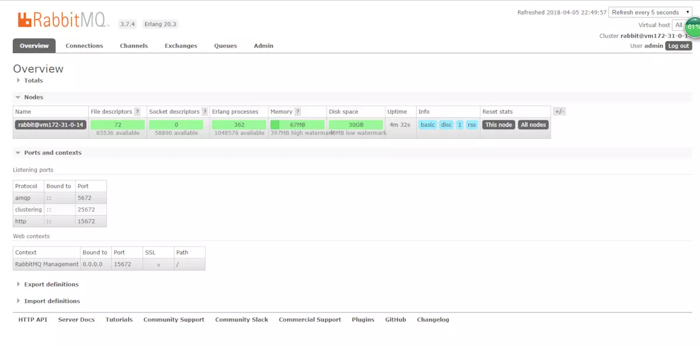


## [docker安装](https://www.cnblogs.com/yufeng218/p/9452621.html)

1、进入docker hub镜像仓库地址：https://hub.docker.com/

2、搜索rabbitMq，进入官方的镜像，可以看到以下几种类型的镜像；我们选择带有“mangement”的版本（**包含web管理页面**）；

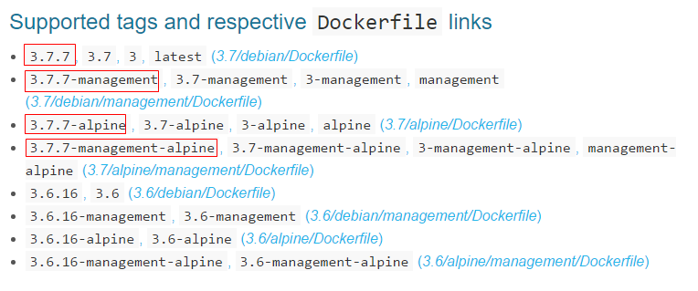

3、拉取镜像

```
docker pull rabbitmq:3.7.7-management
```

使用：docker images 查看所有镜像

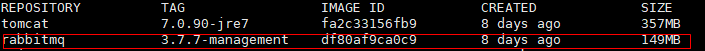

 

 4、根据下载的镜像创建和启动容器

```
docker run -d --name rabbitmq3.7.7 -p 5672:5672 -p 15672:15672 -v `pwd`/data:/var/lib/rabbitmq --hostname myRabbit -e RABBITMQ_DEFAULT_VHOST=my_vhost  -e RABBITMQ_DEFAULT_USER=admin -e RABBITMQ_DEFAULT_PASS=admin df80af9ca0c9
```

说明：

-d 后台运行容器；

--name 指定容器名；

-p 指定服务运行的端口（5672：应用访问端口；15672：控制台Web端口号）；

-v 映射目录或文件；

--hostname  主机名（RabbitMQ的一个重要注意事项是它根据所谓的 “节点名称” 存储数据，默认为主机名）；

-e 指定环境变量；（RABBITMQ_DEFAULT_VHOST：默认虚拟机名；RABBITMQ_DEFAULT_USER：默认的用户名；RABBITMQ_DEFAULT_PASS：默认用户名的密码）

5、使用命令：docker ps 查看正在运行容器

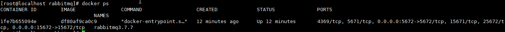

6、可以使用浏览器打开web管理端：http://Server-IP:15672

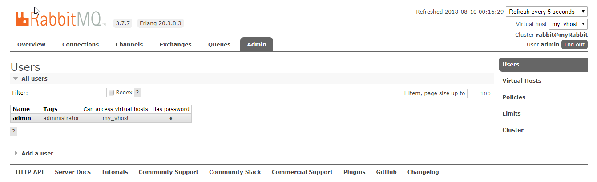

## [web管理端](https://www.jianshu.com/p/7b6e575fd451)

### 1 简介

[rabbitmq-management](https://link.jianshu.com?t=https%3A%2F%2Fgithub.com%2Frabbitmq%2Frabbitmq-management)是RabbitMq web管理端，用的是erlang的cowboy框架进行开发。web页面包括Overview(概述)、Connections(连接)、Channels(通道)、Exchanges(交换器)、Queues(队列)、Admin(用户管理)。

### 2 Overview

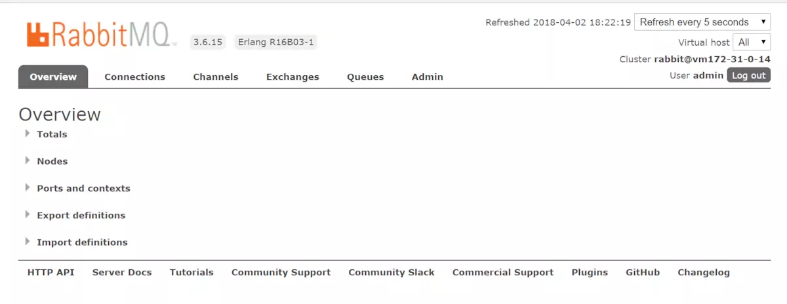

#### 2.1 overview->Total

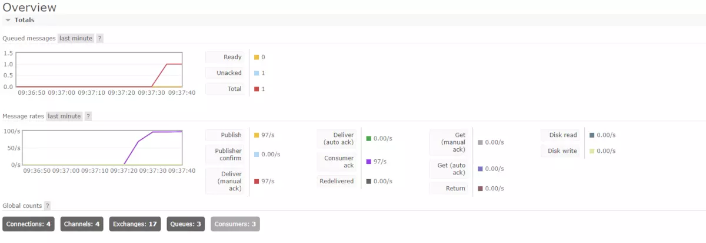

image.png

> 所有队列的阻塞情况

Ready：待消费的消息总数。
 Unacked：待应答的消息总数。
 Total：总数 Ready+Unacked。

> 所有队列的消费情况。速率=(num1-num0)/(s1-s0)  num1：s1时刻的个数。num0：s0时刻的个数。

Publish：producter pub消息的速率。
 Publisher confirm：broker确认pub消息的速率。
 Deliver(manual ack)：customer手动确认的速率。
 Deliver( auto ack)：customer自动确认的速率。
 Consumer ack：customer正在确认的速率。
 Redelivered：正在传递'redelivered'标志集的消息的速率。
 Get (manual ack)：响应basic.get而要求确认的消息的传输速率。
 Get (auto ack)：响应于basic.get而发送不需要确认的消息的速率。
 Return：将basic.return发送给producter的速率。
 Disk read：queue从磁盘读取消息的速率。
 Disk write：queue从磁盘写入消息的速率。

> 整体角色的个数

Connections：client的tcp连接的总数。
 Channels：通道的总数。
 Exchange：交换器的总数。
 Queues：队列的总数。
 Consumers：消费者的总数。

#### 2.2 Overview->Nodes

启动一个broker都会产生一个node。


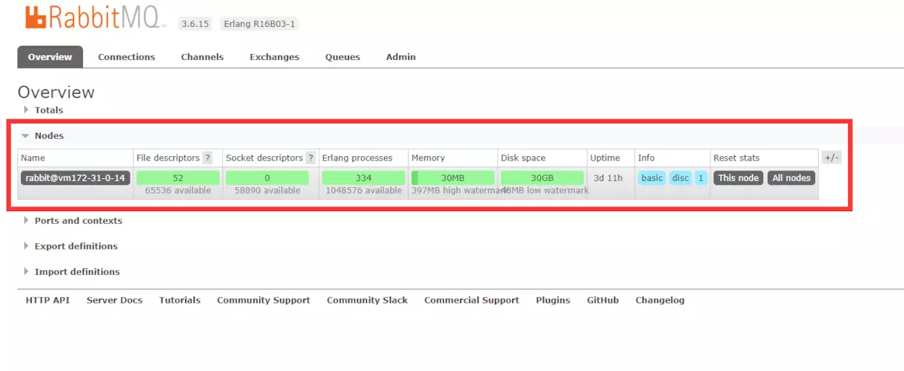

image.png

> broker的属性

Name：broker名称
 File descriptors：broker打开的文件描述符和限制。
 Socket descriptors：broker管理的网络套接字数量和限制。当限制被耗尽时，RabbitMQ将停止接受新的网络连接。
 Erlang processes：erlang启动的进程数。
 Memory：当前broker占用的内存。
 Disk space：当前broker占用的硬盘。
 Uptime：当前broker持续运行的时长。
 Info：未知。
 Reset stats：未知。

#### 2.3 Overview->Ports and contexts

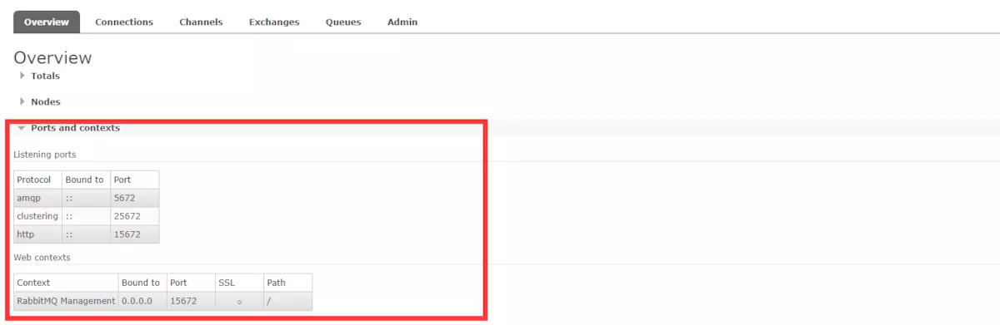

image.png

#### 2.4  Overview->Export definitions

定义由用户，虚拟主机，权限，参数，交换，队列和绑定组成。 它们不包括队列的内容或集群名称。 独占队列不会被导出。

#### 2.5  Overview->Export definitions

导入的定义将与当前定义合并。 如果在导入过程中发生错误，则所做的任何更改都不会回滚。

### 3 Connections

当前所有客户端活动的连接。包括生成者和消费者。


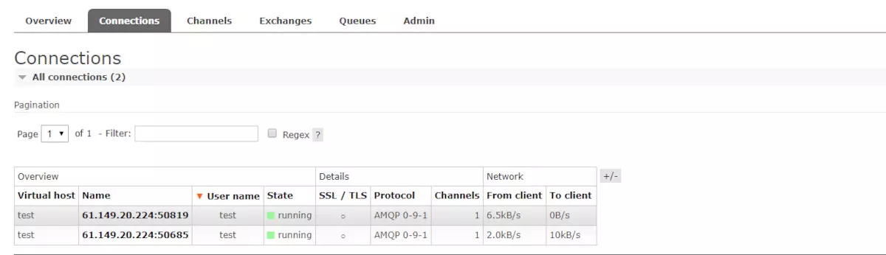

image.png

> 连接的属性

Virtual host：所属的虚拟主机。
 Name：名称。
 User name：使用的用户名。
 State：当前的状态，running：运行中；idle：空闲。
 SSL/TLS：是否使用ssl进行连接。
 Protocol：使用的协议。
 Channels：创建的channel的总数。
 From client：每秒发出的数据包。
 To client：每秒收到的数据包。

### 4 Channels

当前连接所有创建的通道。


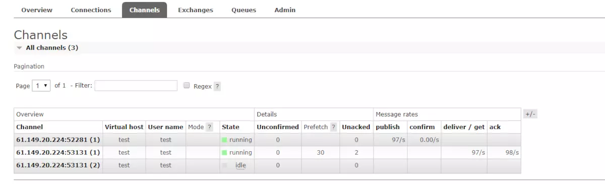

image.png

> 通道的属性

channel：名称。
 Virtual host：所属的虚拟主机。
 User name：使用的用户名。
 Mode：渠道保证模式。 可以是以下之一，或者不是：C: confirm。T：transactional(事务)。
 State ：当前的状态，running：运行中；idle：空闲。
 Unconfirmed：待confirm的消息总数。
 Prefetch：设置的prefetch的个数。
 Unacker：待ack的消息总数。
 publish：producter pub消息的速率。
 confirm：producter confirm消息的速率。
 deliver/get：consumer  获取消息的速率。
 ack：consumer  ack消息的速率。

### 5 Exchanges

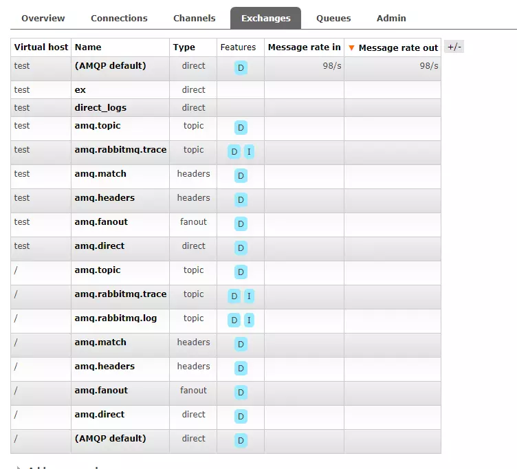

image.png

> 交换器属性

Virtual host：所属的虚拟主机。
 Name：名称。
 Type：exchange type，具体的type可以查看[RabbitMq系列之一：基础概念](https://www.jianshu.com/p/5319b06f2e80)。
 Features：功能。 可以是以下之一，或者不是：D: 持久化。T：Internal，存在改功能表示这个exchange不可以被client用来推送消息，仅用来进行exchange和exchange之间的绑定，否则可以推送消息也可以绑定。
 Message rate in：消息进入的速率。
 Message rate out：消息出去的速率。

#### 5.1 添加exchange

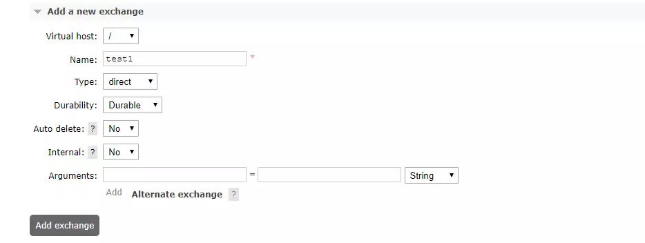

image.png

### 6 Queues

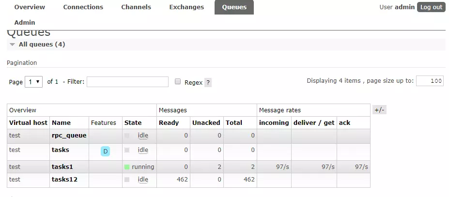

image.png

> 队列的属性

Virtual host：所属的虚拟主机。
 Name：名称。
 Features：功能。 可以是以下之一，或者不是：D: 持久化。
 State：当前的状态，running：运行中；idle：空闲。
 Ready：待消费的消息总数。
 Unacked：待应答的消息总数。
 Total：总数 Ready+Unacked。
 incoming：消息进入的速率。
 deliver/get：消息获取的速率。
 ack：消息应答的速率。

#### 6.1 添加queue


image.png

### 7 Admin

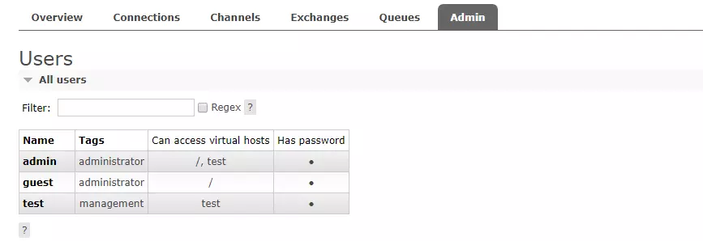

image.png

> 用户属性

Name：名称。
 Tags：角色标签，只能选取一个。
 Can access virtual hosts：允许进入的vhost。
 Has password：设置了密码。

tags(原链接:[https://www.cnblogs.com/java-zhao/p/5670476.html](https://link.jianshu.com?t=https%3A%2F%2Fwww.cnblogs.com%2Fjava-zhao%2Fp%2F5670476.html))

- administrator (超级管理员)
   可登陆管理控制台(启用management plugin的情况下)，可查看所有的信息，并且可以对用户，策略(policy)进行操作。
- monitoring(监控者)
   可登陆管理控制台(启用management plugin的情况下)，同时可以查看rabbitmq节点的相关信息(进程数，内存使用情况，磁盘使用情况等)
- policymaker(策略制定者)
   可登陆管理控制台(启用management plugin的情况下), 同时可以对policy进行管理。
- management(普通管理者)
   仅可登陆管理控制台(启用management plugin的情况下)，无法看到节点信息，也无法对策略进行管理。
- none(其他)
   无法登陆管理控制台，通常就是普通的生产者和消费者。


作者：yanshaowen
链接：https://www.jianshu.com/p/7b6e575fd451
来源：简书
著作权归作者所有。商业转载请联系作者获得授权，非商业转载请注明出处。


## [集群](https://objcoding.com/2018/10/19/rabbitmq-cluster/  )

在项目中想要 RabbitMQ 变得更加健壮，就要使得其变成高可用，所以我们要搭建一个 RabbitMQ 集群，这样你可以从任何一台 RabbitMQ 故障中得以幸免，并且应用程序能够持续运行而不会发生阻塞。集群是保证可靠性的一种方式，同时可以通过水平扩展以达到增加消息吞吐量能力的目的。  

而 RabbitMQ 本身是基于 Erlang 编写的，Erlang 天生支持分布式（通过同步 Erlang 集群各节点的 cookie 来实现），因此不需要像 ActiveMQ、Kafka 那样通过 ZooKeeper 分别来实现 HA 方案和保存集群的元数据。  

### [设计图](https://www.jianshu.com/p/6376936845ff)

经过上面的RabbitMQ10个节点集群搭建和HAProxy软弹性负载均衡配置后即可组建一个中小规模的RabbitMQ集群了，然而为了能够在实际的生产环境使用还需要根据实际的业务需求对集群中的各个实例进行一些性能参数指标的监控，从性能、吞吐量和消息堆积能力等角度考虑，可以选择Kafka来作为RabbitMQ集群的监控队列使用。因此，这里先给出了一个中小规模RabbitMQ集群架构设计图：  


对于消息的生产和消费者可以通过HAProxy的软负载将请求分发至RabbitMQ集群中的Node1～Node7节点，其中Node8～Node10的三个节点作为磁盘节点保存集群元数据和配置信息。鉴于篇幅原因这里就不在对监控部分进行详细的描述的，会在后续篇幅中对如何使用RabbitMQ的HTTP API接口进行监控数据统计进行详细阐述。

### 原理

上面图中采用三个节点组成了一个RabbitMQ的集群，Exchange A（交换器，对于RabbitMQ基础概念不太明白的童鞋可以看下基础概念）的元数据信息在所有节点上是一致的，而Queue（存放消息的队列）的完整数据则只会存在于它所创建的那个节点上。，其他节点只知道这个queue的metadata信息和一个指向queue的owner node的指针。  

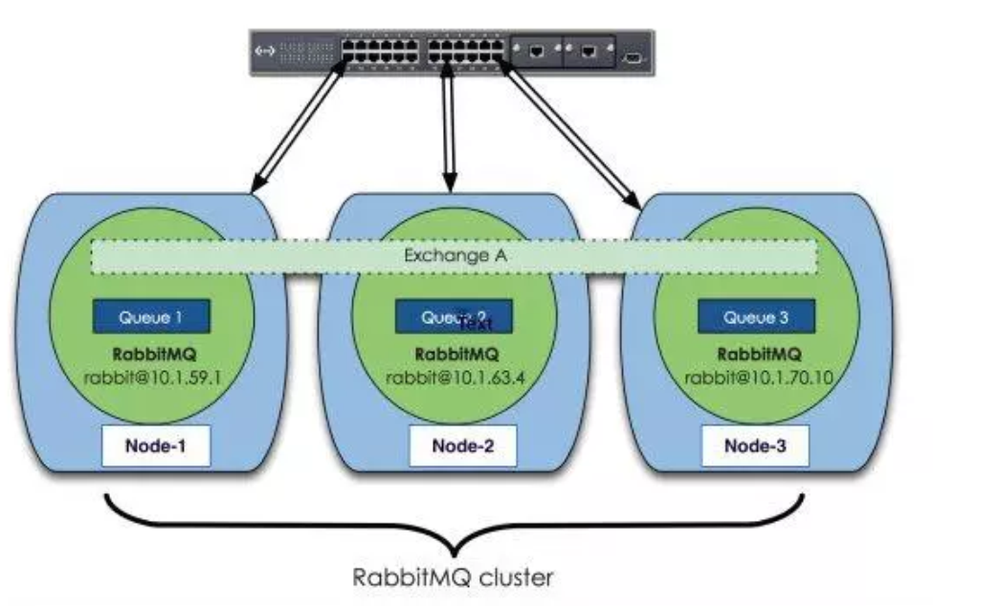

### 架构

#### 元数据

RabbitMQ 内部有各种基础构件，包括队列、交换器、绑定、虚拟主机等，他们组成了 AMQP 协议消息通信的基础，而这些构件以元数据的形式存在，它始终记录在 RabbitMQ 内部，它们分别是：

- 队列元数据：队列名称和它们的属性
- 交换器元数据：交换器名称、类型和属性
- 绑定元数据：一张简单的表格展示了如何将消息路由到队列
- vhost元数据：为 vhost 内的队列、交换器和绑定提供命名空间和安全属性

**在单一节点上，RabbitMQ 会将上述元数据存储到内存上**，如果是磁盘节点（下面会讲），还会存储到磁盘上。

#### 集群中的队列

这里有个问题需要思考，RabbitMQ 默认会将消息冗余到所有节点上吗？这样听起来正符合高可用的特性，只要集群上还有一个节点存活，那么就可以继续进行消息通信，但这也随之为 RabbitMQ 带来了致命的缺点：

1. 每次发布消息，都要把它扩散到所有节点上，而且对于磁盘节点来说，每一条消息都会触发磁盘活动，这会导致整个集群内性能负载急剧拉升。
2. 如果每个节点都有所有队列的完整内容，那么添加节点不会给你带来额外的存储空间，也会带来木桶效应，举个例子，如果集群内有个节点存储了 3G 队列内容，那么在另外一个只有 1G 存储空间的节点上，就会造成内存空间不足的情况，也就是无法通过集群节点的扩容提高消息积压能力。

解决这个问题就是**通过集群中唯一节点来负责任何特定队列**，只有该节点才会受队列大小的影响，其它节点如果接收到该队列消息，那么就要根据元数据信息，传递给队列所有者节点（也就是说**其它节点上只存储了特定队列所有者节点的指针**）。这样一来，就可以通过在集群内增加节点，存储更多的队列数据。

> 也就是一个队列的大小是限定的
>
> ​	可以通过加磁盘来扩大该队列的容量；
>
> ​	或者增加一个消费者加速消费

#### 分布交换器

交换器其实是我们想象出来的，它**本质是一张查询表，里面包括了交换器名称和一个队列的绑定列表**，当你将消息发布到交换器中，实际上是你所在的信道将消息上的路由键与交换器的绑定列表进行匹配，然后将消息路由出去。有了这个机制，那么在所有节点上传递交换器消息将简单很多，而 **RabbitMQ 所做的事情就是把交换器拷贝到所有节点**上，因此每个节点上的每条信道都可以访问完整的交换器了。


#### 实际场景

**场景1、客户端直接连接队列所在节点**
如果有一个消息生产者或者消息消费者通过amqp-client的客户端连接至节点1进行消息的发布或者订阅，那么此时的集群中的消息收发只与节点1相关，这个没有任何问题，相当于单机使用。

**场景2、客户端连接的是非队列数据所在节点**
如果消息生产者所连接的是节点2或者节点3，此时队列1的完整数据不在该两个节点上，那么在发送消息过程中这两个节点主要起了一个**路由转发作用**，根据这两个节点上的元数据（也就是上文提到的：指向queue的owner node的指针）转发至节点1上，最终发送的消息还是会存储至节点1的队列1上。
同样，如果消息消费者所连接的节点2或者节点3，那这两个节点也会作为路由节点起到转发作用，将会从节点1的队列1中拉取消息进行消费。  

#### 内存节点与磁盘节点

在集群中的每个节点，要么是内存节点，要么是磁盘节点，如果是内存节点，会将所有的元数据信息仅存储到内存中，而磁盘节点则不仅会将所有元数据存储到内存上，还会将其持久化到磁盘。

**在单节点 RabbitMQ 上，仅允许该节点是磁盘节点**，这样确保了节点发生故障或重启节点之后，所有关于系统的配置与元数据信息都会重磁盘上恢复；而在 RabbitMQ 集群上，允许节点上至少有一个磁盘节点，在内存节点上，意味着队列和交换器声明之类的操作会更加快速。原因是这些操作会将其元数据同步到所有节点上，对于内存节点，将需要同步的元数据写进内存就行了，但对于磁盘节点，意味着还需要极其消耗性能的磁盘写入操作。

RabbitMQ 集群只要求至少有一个磁盘节点，这是有道理的，**当其它内存节点发生故障或离开集群，只需要通知至少一个磁盘节点进行元数据的更新**，如果是碰巧唯一的磁盘节点也发生故障了，集群可以继续路由消息，但是不可以做以下操作了：

- 创建队列
- 创建交换器
- 创建绑定
- 添加用户
- 更改权限
- 添加或删除集群节点

这是因为上述操作都需要持久化到磁盘节点上，以便内存节点恢复故障可以从磁盘节点上恢复元数据，解决办法是在集群添加 2 台以上的磁盘节点，这样其中一台发生故障了，集群仍然可以保持运行，且能够在任何时候保存元数据变更。

关于上面队列所说的问题与解决办法，又有了一个伴随而来的问题出现：**如果特定队列的所有者节点发生了故障，那么该节点上的队列和关联的绑定都会消失吗？**

1. 如果是内存节点，那么附加在该节点上的队列和其关联的绑定都会丢失，并且消费者可以重新连接集群并重新创建队列；
2. 如果是磁盘节点，重新恢复故障后，该队列又可以进行传输数据了。在恢复故障磁盘节点之前，不能在其它节点上让消费者重新连到集群并重新创建队列，如果消费者继续在其它节点上声明该队列，会得到一个 404 NOT_FOUND 错误，这样确保了当故障节点恢复后加入集群，该节点上的队列消息不回丢失，也避免了队列会在一个节点以上出现冗余的问题。


### 部署

#### 必备组件

在搭建RabbitMQ集群之前有必要在每台虚拟机上安装如下的组件包，分别如下：
a.Jdk 1.8
b.Erlang运行时环境，这里用的是otp_src_19.3.tar.gz (200MB+)
c.RabbitMq的Server组件，这里用的rabbitmq-server-generic-unix-3.6.10.tar.gz  

#### 设置主机名

由于 RabbitMQ 集群连接是通过主机名来连接服务的，必须保证各个主机名之间可以 ping 通，所以需要做以下操作：

修改hostname：

```shell
$ hostname node1 # 修改节点1的主机名
$ hostname node2 # 修改节点2的主机名
```

编辑`/etc/hosts`文件，添加到在三台机器的`/etc/hosts`中以下内容：

```shell
$ sudo vim /etc/hosts

193.xxx.61.78 node1
111.xxx.254.127 node2
```

#### 复制 Erlang cookie

这里将 node1 的该文件复制到 node2，由于这个文件权限是 400 为方便传输，先修改权限，非必须操作，所以需要先修改 node2 中的该文件权限为 777，600也可以

```shell
$ chmod 777 /var/lib/rabbitmq/.erlang.cookie
```

用 scp 拷贝到节点 2

```shell
$ scp /var/lib/rabbitmq/.erlang.cookie node2:/var/lib/rabbitmq/
```

将权限改回来，不需要

```shell
$ chmod 400 /var/lib/rabbitmq/.erlang.cookie
```

#### 组成集群

在节点 2 执行如下命令：

```shell
$ rabbitmqctl stop_app # 停止rabbitmq服务
$ rabbitmqctl reset # 清空节点状态
$ rabbitmqctl join_cluster rabbit@node1 # node2和node1构成集群,node2必须能通过node1的主机名ping通
$ rabbitmqctl start_app  # 开启rabbitmq服务
```

在任意一台机上面查看集群状态：

```shell
$ rabbitmqctl cluster_status
Cluster status of node rabbit@node1 ...
[{nodes,[{disc,[rabbit@node1,rabbit@node2]}]},
 {running_nodes,[rabbit@node2,rabbit@node1]},
 {cluster_name,<<"rabbit@node1">>},
 {partitions,[]}]
...done.
```

第一行是集群中的节点成员，disc 表示这些都是磁盘节点，第二行是正在运行的节点成员。

登陆管理后台查看节点状态：


cluster 搭建起来后若在 web 管理工具中 rabbitmq_management 的 Overview 的 Nodes 部分看到 “Node statistics not available” 的信息，说明在该节点上 web 管理插件还未启用。 执行如下命令：

```shell
$ rabbitmq-plugins enable rabbitmq_management
```

重启 RabbitMQ：

```shell
$ rabbitmqctl stop
$ rabbitmq-server -detached
```

#### 设置内存节点

如果节点需要设置成内存节点，则加入集群的命令如下：

```shell
$ rabbitmqctl join_cluster --ram rabbit@node1
```

其中`–ram`指的是作为内存节点，如果不加，那就默认为内存节点。

如果节点在集群中已经是磁盘节点了，通过以下命令可以将节点改成内存节点：

```shell
$ rabbitmqctl stop_app  # 停止rabbitmq服务
$ rabbitmqctl change_cluster_node_type ram # 更改节点为内存节点
$ rabbitmqctl start_app # 开启rabbitmq服务
```

现在再查看集群状态：

```shell
$ rabbitmqctl cluster_status

Cluster status of node rabbit@node1 ...
[{nodes,[{disc,[rabbit@node1]},{ram,[rabbit@node2]}]},
 {running_nodes,[rabbit@node2,rabbit@node1]},
 {cluster_name,<<"rabbit@node1">>},
 {partitions,[]}]
...done.
```

可以看到，节点 2 已经成为内存节点了。

#### 镜像队列

当节点发生故障时，**尽管所有元数据信息都可以从磁盘节点上将元数据拷贝到本节点上，但是队列的消息内容就不行了，这样就会导致消息的丢失**，那是因为在默认情况下，队列只会保存在其中一个节点上，我们在将集群队列时也说过。

聪明的 RabbitMQ 早就意识到这个问题了，在 2.6以后的版本中增加了，**队列冗余**选项：镜像队列。镜像队列的主队列（master）依然是仅存在于一个节点上，其余从主队列拷贝的队列叫从队列（slave）。如果主队列没有发生故障，那么其工作流程依然跟普通队列一样，生产者和消费者不会感知其变化，当发布消息时，依然是路由到主队列中，而主队列通过类似广播的机制，将消息扩散同步至其余从队列中，这就有点像 fanout 交换器一样。而消费者依然是从主队列中读取消息。

一旦主队列发生故障，**集群就会从最老的一个从队列选举为新的主队列**，这也就实现了队列的高可用了，但我们切记不要滥用这个机制，在上面也说了，**队列的冗余操作会导致不能通过扩展节点增加存储空间，而且会造成性能瓶颈。**

命令格式如下：

```shell
$ rabbitmqctl set_policy [-p Vhost] Name Pattern Definition [Priority]

-p Vhost: 可选参数，针对指定vhost下的queue进行设置
Name: policy的名称
Pattern: queue的匹配模式(正则表达式)
Definition: 镜像定义，包括三个部分ha-mode, ha-params, ha-sync-mode
    ha-mode: 指明镜像队列的模式，有效值为 all/exactly/nodes
        all: 表示在集群中所有的节点上进行镜像
        exactly: 表示在指定个数的节点上进行镜像，节点的个数由ha-params指定
        nodes: 表示在指定的节点上进行镜像，节点名称通过ha-params指定
    ha-params: ha-mode模式需要用到的参数
    ha-sync-mode: 进行队列中消息的同步方式，有效值为automatic和manual
priority: 可选参数，policy的优先级
```

举几个例子：

- 以下示例声明名为ha-all的策略，它与名称以”ha”开头的队列相匹配，并将镜像配置到集群中的所有节点：

```shell
$ rabbitmqctl set_policy ha-all "^" '{"ha-mode":"all"}'
```

上述命令会将所有的队列冗余到所有节点上，一般可以拿来测试。

- 策略的名称以”two”开始的队列镜像到群集中的任意两个节点，并进行自动同步：

```shell
$ rabbitmqctl set_policy ha-two "^two." '{"ha-mode":"exactly","ha-params":2,"ha-sync-mode":"automatic"}'
```

- 以”node”开头的队列镜像到集群中的特定节点的策略：

```shell
$ rabbitmqctl set_policy ha-nodes "^nodes." '{"ha-mode":"nodes","ha-params":["rabbit@nodeA", "rabbit@nodeB"]}'
```


##### [具体操作](https://www.cnblogs.com/knowledgesea/p/6535766.html)

这一节要参考的文档是：http://www.rabbitmq.com/ha.html

首先镜像模式要依赖policy模块，这个模块是做什么用的呢？

policy中文来说是政策，策略的意思，那么他就是要设置，那些Exchanges或者queue的数据需要复制，同步，如何复制同步？对就是做这些的。

这里有点内容的，我先上例子慢慢说：

```shell
[root@G ~]# ./rabbitmqctl set_policy ha-all "^" '{"ha-mode":"all"}'
```

参数意思为：

ha-all：为策略名称。

^：为匹配符，只有一个^代表匹配所有，^zlh为匹配名称为zlh的exchanges或者queue。

ha-mode：为匹配类型，他分为3种模式：all-所有（所有的queue），exctly-部分（需配置ha-params参数，此参数为int类型比如3，众多集群中的随机3台机器），nodes-指定（需配置ha-params参数，此参数为数组类型比如["3rabbit@F","rabbit@G"]这样指定为F与G这2台机器。）。

参考示例如下


当然在web管理界面也能配置：


配置完看队列如下，其中表示ha-haall的说明用我的ha-haall策略啦，属于镜像模式，没有表示的就是普通模式：

 

#### 移除节点

```shell
rabbitmqctl stop_app
rabbitmqctl restart
rabbitmqctl start_app
```

#### 节点重启顺序

**集群重启的顺序是固定的，并且是相反的。** 如下所述：

- 启动顺序：磁盘节点 => 内存节点
- 关闭顺序：内存节点 => 磁盘节点

**最后关闭必须是磁盘节点，不然可能回造成集群启动失败、数据丢失等异常情况。**  

### 负载均衡

HAProxy 提供高可用性、负载均衡以及基于 TCP 和 HTTP 应用的代理，支持虚拟主机，它是免费、快速并且可靠的一种解决方案。HAProxy支持从4层至7层的网络交换，即覆盖所有的TCP协议。就是说，Haproxy甚至还支持Mysql的均衡负载。为了实现RabbitMQ集群的软负载均衡，这里可以选择HAProxy。

集群负载均和架构图：


安装 HAProxy：

```shell
$ yum install haproxy
```

编辑 HAProxy 配置文件：

```shell
$ vim /etc/haproxy/haproxy.cfg
```

加入以下内容：

```powershell
#绑定配置
listen rabbitmq_cluster 0.0.0.0:5670
    #配置TCP模式
    mode tcp
    #加权轮询
    balance roundrobin
    #RabbitMQ集群节点配置
    server node1 193.112.61.178:5672 check inter 2000 rise 2 fall 3
    server node2 111.230.254.127:5672 check inter 2000 rise 2 fall 3

#haproxy监控页面地址
listen monitor 0.0.0.0:8100
    mode http
    option httplog
    stats enable
    stats uri /stats
    stats refresh 5s
```

启动 HAProxy：

```shell
$ /usr/sbin/haproxy -f /etc/haproxy/haproxy.cfg
```

后台管理：


关于HAProxy如何安装的文章之前也有很多同学写过，这里就不再赘述了，有需要的同学可以参考下网上的做法。这里主要说下安装完HAProxy组件后的具体配置。
HAProxy使用单一配置文件来定义所有属性，包括从前端IP到后端服务器。下面展示了用于7个RabbitMQ节点组成集群的负载均衡配置（另外3个磁盘节点用于保存集群的配置和元数据，不做负载）。同时，HAProxy运行在另外一台机器上。HAProxy的具体配置如下：  

```yml
#全局配置
global
#日志输出配置，所有日志都记录在本机，通过local0输出
log 127.0.0.1 local0 info
#最大连接数
maxconn 4096
#改变当前的工作目录
chroot /apps/svr/haproxy
#以指定的UID运行haproxy进程
uid 99
#以指定的GID运行haproxy进程
gid 99
#以守护进程方式运行haproxy #debug #quiet
daemon
#debug
#当前进程pid文件
pidfile /apps/svr/haproxy/haproxy.pid
#默认配置
defaults
#应用全局的日志配置
log global
#默认的模式mode{tcp|http|health}
#tcp是4层，http是7层，health只返回OK
mode tcp
#日志类别tcplog
option tcplog
#不记录健康检查日志信息
option dontlognull
#3次失败则认为服务不可用
retries 3
#每个进程可用的最大连接数
maxconn 2000
#连接超时
timeout connect 5s
#客户端超时
timeout client 120s
#服务端超时
timeout server 120s
maxconn 2000
#连接超时
timeout connect 5s
#客户端超时
timeout client 120s
#服务端超时
timeout server 120s
#绑定配置
listen rabbitmq_cluster
bind 0.0.0.0:5672
#配置TCP模式
mode tcp
#加权轮询
balance roundrobin
#RabbitMQ集群节点配置,其中ip1~ip7为RabbitMQ集群节点ip地址
server rmq_node1 ip1:5672 check inter 5000 rise 2 fall 3 weight 1
server rmq_node2 ip2:5672 check inter 5000 rise 2 fall 3 weight 1
server rmq_node3 ip3:5672 check inter 5000 rise 2 fall 3 weight 1
server rmq_node4 ip4:5672 check inter 5000 rise 2 fall 3 weight 1
server rmq_node5 ip5:5672 check inter 5000 rise 2 fall 3 weight 1
server rmq_node6 ip6:5672 check inter 5000 rise 2 fall 3 weight 1
server rmq_node7 ip7:5672 check inter 5000 rise 2 fall 3 weight 1
#haproxy监控页面地址
listen monitor
bind 0.0.0.0:8100
mode http
option httplog
stats enable
stats uri /stats
stats refresh 5s
```

在上面的配置中“listen rabbitmq_cluster bind 0.0.0.0：5671”这里定义了客户端连接IP地址和端口号。这里配置的负载均衡算法是roundrobin—加权轮询。与配置RabbitMQ集群负载均衡最为相关的是“ server rmq_node1 ip1:5672 check inter 5000 rise 2 fall 3 weight 1”这种，它标识并且定义了后端RabbitMQ的服务。主要含义如下:

(a)“server <name>”部分：定义HAProxy内RabbitMQ服务的标识；
(b)“ip1:5672”部分：标识了后端RabbitMQ的服务地址；
(c)“check inter <value>”部分：表示每隔多少毫秒检查RabbitMQ服务是否可用；
(d)“rise <value>”部分：表示RabbitMQ服务在发生故障之后，需要多少次健康检查才能被再次确认可用；
(e)“fall <value>”部分：表示需要经历多少次失败的健康检查之后，HAProxy才会停止使用此RabbitMQ服务。  

```shell
#启用HAProxy服务
[root@mq-testvm12 conf]# haproxy -f haproxy.cfg
```

启动后，即可看到如下的HAproxy的界面图：

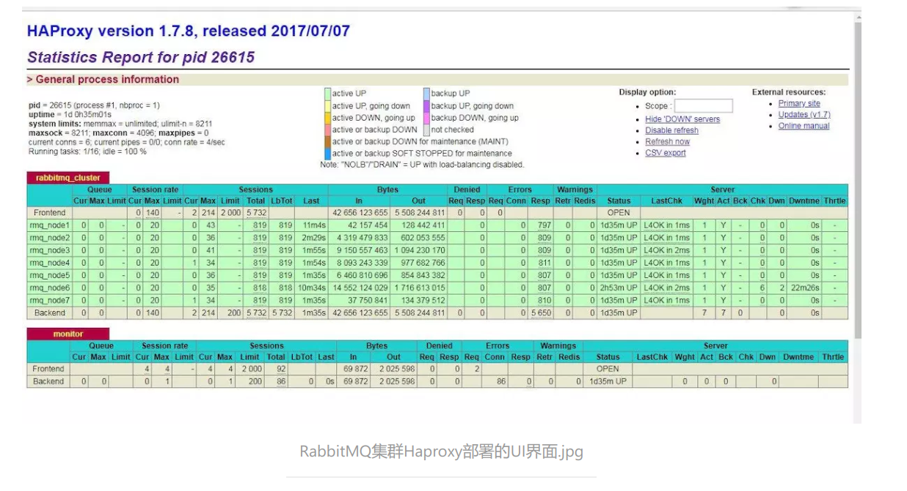

### 监控

**摘要：任何没有监控的系统上线，一旦在生产环境发生故障，那么排查和修复问题的及时性将无法得到保证**

#### 一、为何要对消息中间件进行监控？

上线的业务系统需要监控，然而诸如消息队列、数据库、分布式缓存等生产环境的中间件系统也同样需要监控，否则一旦出现任何故障，排查和修复起来的时间和投入的人力成本都会大大增加，同时也不易利于日后进行问题原因的总结和复盘。
对于消息中间件RabbitMQ集群来说，没有监控能力更是灾难性的。假设，运行在生产环境上的中小规模RabbitMQ集群（总共有30个节点），出现部分节点服务不可用而导致生产者和消费者的业务工程无法正常发布和订阅消息（**比如，Erlang虚拟机内存即将达到上限，服务器磁盘容量不足或者队列出现大量消息堆积**），此时通过前置软负载HAProxy的Web页面又无法快速定位和排查出根本问题所在，那么研发和运维同事唯有对每台服务器的日志进行排查才可能发现并解决存在的问题。**这种方式耗时又耗力，在生产环境对于故障响应时间和解决时间都非常重要，因此非常有必要对诸如像RabbitMQ这样的消息中间件进行各种参数的监控。**

#### 二、如何对RabbitMQ集群监控？

##### （1）RabbitMQ自带的Web管理端的插件

RabbitMQ作为一款在金融领域应用非常成熟的消息中间件,必然少不了监控功能，RabbitMQ提供了Web版的页面监控（只在本地的浏览器端访问地址：http://xxx.xxx.xxx.xxx:15672/，默认端口号是15672）。Web监控页面如下图所示：

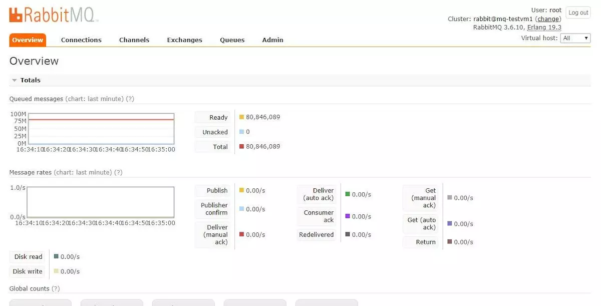

RabbitMQ的Web监控截图.jpg


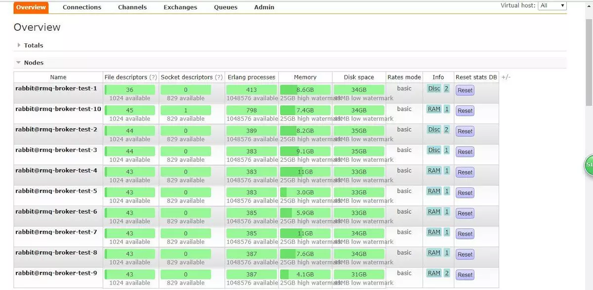

RabbitMQ的Web监控截图2.jpg


当然想要使用上面的RabbitMQ自带的Web监控页面，必须开启rabbitmq_management插件模式，需要在部署RabbitMQ实例的服务器的sbin文件夹下执行如下命令：


```bash
#先启用rabbitmq_management插件
./rabbtimq-plugins enable rabbitmq_management
#然后停止MQ服务再重启
rabbitmqctl stop
rabbitmq-server -detached
```

如果只是在测试或生产环境小规模地应用RabbitMQ消息队列（比如业务并发访问量较低），那么简单地用用RabbitMQ自带的Web页面进行监控也就足够了。但是，如果对RabbitMQ的并发性能、高可用和其他参数都有一些定制化的监控需求的话，那么我们就有必要采用其他的方式来达到该目标。

##### （2）RabbitMQ的tracing消息轨迹追踪

对于金融级或者工业级应用场景来说，消息收发的可靠性永远是排在第一位的。消息队列集群可能因为各种问题（**比如，生产者/消费者与RabbitMQ的服务器断开连接、Erlang虚拟机挂了、消息积压导致RabbitMQ内存达到最大阀值**），难免会出现某条消息异常丢失或者客户端程序无法发送接收消息的情况。因此，这个时候就需要有一个较好的机制跟踪记录消息的投递过程，以此协助开发和运维人员进行问题的定位。

###### (a)RabbitMQ的tracing原理

RabbitMQ自带的tracing Log插件功能可以完成对于集群中各个消息投递/订阅的轨迹进行追踪。RabbitMQ tracing log的原理是将生产者投递给RabbitMQ服务器的消息，或者RabbitMQ服务器投递给消费者的消息按照指定格式发送至默认的交换器上。这个默认的交换器名称为“amq.rabbitmq.trace”，是一个topic类型的交换器。随后RabbitMQ会创建一个绑定了这个交换器的队列amq.gen队列。通过这个交换器，把消息的流入和流出情况进行封装后发送到amq.gen队列中，该队列会把消息流转的日志记录在相应的日志中。

###### (b)启用RabbitMQ tracing来消息追踪

这里可以使用**rabbitmq-plugins enable rabbitmq_tracing**命令来启动rabbitmq_tracing插件。

```css
[root@mq-testvm1 sbin]# rabbitmq-plugins enable rabbitmq_tracing
The following plugins have been enabled:
  rabbitmq_tracing

Applying plugin configuration to rabbit@rmq-broker-test-1... started 1 plugin.
```

其对应的关闭插件的命令是：**rabbitmq-plugins disable rabbitmq_tracing**
在Web管理界面 “Admin”右侧原本只有”Users”、”Virtual Hosts”以及”Policies“这个三Tab项，在添加rabbitmq_tracing插件之后，会多出”Tracing”这一项内容。同时，添加名称为“trace1”的消息追踪任务。

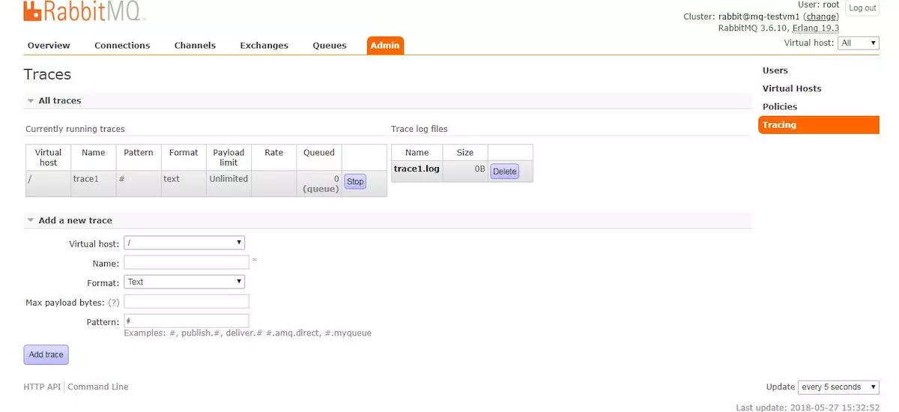

RabbitMQ启用tracing_log后的UI界面.jpg


在添加完trace之后，会根据匹配的规则将相应的消息日志输出到对应的trace文件之中，文件的默认路径为/var/tmp/rabbitmq-tracing。可以在页面中直接点击“Trace log files”下面的列表直接查看对应的日志文件。此外，在“Queues”队列一栏中可以看到又多了一个如下队列：

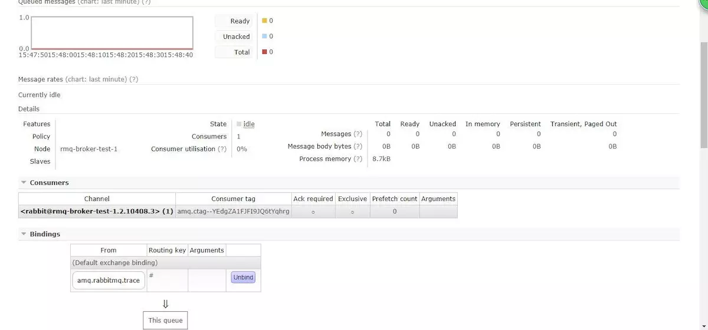

RabbitMQ添加完tracing_log后出现的队列.jpg


当通过Web UI页面发布一条消息后，对应的Tracing log的Text格式的消息日志参考如下：


```dart
================================================================================
2018-05-27 8:16:34:545: Message published

Node:         rabbit@rmq-broker-test-1
Connection:   <rabbit@rmq-broker-test-1.2.10776.3>
Virtual host: /
User:         root
Channel:      1
Exchange:     
Routing keys: [<<"pressure_1">>]
Routed queues: [<<"pressure_1">>]
Properties:   [{<<"delivery_mode">>,signedint,1},{<<"headers">>,table,[]}]
Payload: 
adfadfadf
```

##### （3）采用RabbitMQ的HTTP API接口进行监控

要构建独立的监控系统，可以使用RabbitMQ本身提供的Restful HTTP API接口来获取各种业务监控需要的实时数据。当然，这个接口的作用远不止于获取一些监控数据，也可以通过这些HTTP API来操作RabbitMQ进行各种集群元数据的添加/删除/更新的操作。
下面列举了可以利用RabbitMQ的HTTP API接口实现的各种操作：

|             HTTP API URL              | HTTP 请求类型  |                           接口含义                           |
| :-----------------------------------: | :------------: | :----------------------------------------------------------: |
|           /api/connections            |      GET       |             获取当前RabbitMQ集群下所有打开的连接             |
|              /api/nodes               |      GET       |         获取当前RabbitMQ集群下所有节点实例的状态信息         |
|    /api/vhosts/{vhost}/connections    |      GET       |       获取某一个虚拟机主机下的所有打开的connection连接       |
|   /api/connections/{name}/channels    |      GET       |                获取某一个连接下所有的管道信息                |
|     /api/vhosts/{vhost}/channels      |      GET       |               获取某一个虚拟机主机下的管道信息               |
|        /api/consumers/{vhost}         |      GET       |            获取某一个虚拟机主机下的所有消费者信息            |
|        /api/exchanges/{vhost}         |      GET       |           获取某一个虚拟机主机下面的所有交换器信息           |
|          /api/queues/{vhost}          |      GET       |             获取某一个虚拟机主机下的所有队列信息             |
|              /api/users               |      GET       |                   获取集群中所有的用户信息                   |
|           /api/users/{name}           | GET/PUT/DELETE |                  获取/更新/删除指定用户信息                  |
|     /api/users/{user}/permissions     |      GET       |                获取当前指定用户的所有权限信息                |
|    /api/permissions/{vhost}/{user}    | GET/PUT/DELETE |          获取/更新/删除指定虚拟主机下特定用户的权限          |
| /api/exchanges/{vhost}/{name}/publish |      POST      |           在指定的虚拟机主机和交换器上发布一个消息           |
|    /api/queues/{vhost}/{name}/get     |      POST      | 在指定虚拟机主机和队列名中获取消息，同时该动作会修改队列状态 |
|     /api/healthchecks/node/{node}     |      GET       |                  获取指定节点的健康检查状态                  |

上面的HTTP API接口只是列举了RabbitMQ所支持的部分功能，读者可以参考RabbitMQ官方文档和访问http://server-name:15672/api/的Web页面来获取更多的其他接口信息。
业务研发的同学可以使用Apache的httpcomponents组件—HttpClient或者Spring的RestTemplate组件生成并发送HTTP的GET/POST/DELETE/PUT请求至RabbitMQ Server，根据自己的业务目标完成相应的业务监控需求。
下面是一个使用RabbitMQ Http API接口来获取集群监控参数的demo代码，主要使用HttpClient以及jackson来查询MQ集群的性能参数和存在的用户信息；

```csharp
public class MonitorRabbitMQDemo {

    //RabbitMQ的HTTP API——获取集群各个实例的状态信息，ip替换为自己部署相应实例的
    private static String RABBIT_NODES_STATUS_REST_URL = "http://ip:15672/api/nodes";

    //RabbitMQ的HTTP API——获取集群用户信息，ip替换为自己部署相应实例的
    private static String RABBIT_USERS_REST_URL = "http://ip:15672/api/users";

    //rabbitmq的用户名
    private static String RABBIT_USER_NAME = "root";

    //rabbitmq的密码
    private static String RABBIT_USER_PWD = "root123";

    public static void main(String[] args) {
        try {
            //step1.获取rabbitmq集群各个节点实例的状态信息
            Map<String, ClusterStatus> clusterMap =
                    fetchRabbtMQClusterStatus(RABBIT_NODES_STATUS_REST_URL, RABBIT_USER_NAME, RABBIT_USER_PWD);

            //step2.打印输出各个节点实例的状态信息
            for (Map.Entry entry : clusterMap.entrySet()) {
                System.out.println(entry.getKey() + " : " + entry.getValue());
            }

            //step3.获取rabbitmq集群用户信息
            Map<String, User> userMap =
                    fetchRabbtMQUsers(RABBIT_USERS_REST_URL, RABBIT_USER_NAME, RABBIT_USER_PWD);

            //step2.打印输出rabbitmq集群用户信息
            for (Map.Entry entry : userMap.entrySet()) {
                System.out.println(entry.getKey() + " : " + entry.getValue());
            }

        } catch (IOException e) {
            e.printStackTrace();
        }
    }

    public static Map<String,ClusterStatus> fetchRabbtMQClusterStatus(String url, String username, String password) throws IOException {
        Map<String, ClusterStatus> clusterStatusMap = new HashMap<String, ClusterStatus>();
        String nodeData = getData(url, username, password);
        JsonNode jsonNode = null;
        try {
            jsonNode = JsonUtil.toJsonNode(nodeData);
        } catch (IOException e) {
            e.printStackTrace();
        }
        Iterator<JsonNode> iterator = jsonNode.iterator();
        while (iterator.hasNext()) {
            JsonNode next = iterator.next();
            ClusterStatus status = new ClusterStatus();
            status.setDiskFree(next.get("disk_free").asLong());
            status.setFdUsed(next.get("fd_used").asLong());
            status.setMemoryUsed(next.get("mem_used").asLong());
            status.setProcUsed(next.get("proc_used").asLong());
            status.setSocketUsed(next.get("sockets_used").asLong());
            clusterStatusMap.put(next.get("name").asText(), status);
        }
        return clusterStatusMap;
    }

    public static Map<String,User> fetchRabbtMQUsers(String url, String username, String password) throws IOException {
        Map<String, User> userMap = new HashMap<String, User>();
        String nodeData = getData(url, username, password);
        JsonNode jsonNode = null;
        try {
            jsonNode = JsonUtil.toJsonNode(nodeData);
        } catch (IOException e) {
            e.printStackTrace();
        }
        Iterator<JsonNode> iterator = jsonNode.iterator();
        while (iterator.hasNext()) {
            JsonNode next = iterator.next();
            User user = new User();
            user.setName(next.get("name").asText());
            user.setTags(next.get("tags").asText());
            userMap.put(next.get("name").asText(), user);
        }
        return userMap;
    }

    public static String getData(String url, String username, String password) throws IOException {
        CloseableHttpClient httpClient = HttpClients.createDefault();
        UsernamePasswordCredentials creds = new UsernamePasswordCredentials(username, password);
        HttpGet httpGet = new HttpGet(url);
        httpGet.addHeader(BasicScheme.authenticate(creds, "UTF-8", false));
        httpGet.setHeader("Content-Type", "application/json");
        CloseableHttpResponse response = httpClient.execute(httpGet);

        try {
            if (response.getStatusLine().getStatusCode() != 200) {
                System.out.println("call http api to get rabbitmq data return code: " + response.getStatusLine().getStatusCode() + ", url: " + url);
            }
            HttpEntity entity = response.getEntity();
            if (entity != null) {
                return EntityUtils.toString(entity);
            }
        } finally {
            response.close();
        }

        return StringUtils.EMPTY;
    }

    public static class JsonUtil {
        private static ObjectMapper objectMapper = new ObjectMapper();
        static {
            objectMapper.disable(DeserializationFeature.FAIL_ON_UNKNOWN_PROPERTIES);
            objectMapper.disable(SerializationFeature.FAIL_ON_EMPTY_BEANS);
        }

        public static JsonNode toJsonNode(String jsonString) throws IOException {
            return objectMapper.readTree(jsonString);
        }
    }

    public static class User {
        private String name;
        private String tags;
        @Override
        public String toString() {
            return "User{" +
                    "name=" + name +
                    ", tags=" + tags +
                    '}';
        }
                //GET/SET方法省略
    }

    public static class ClusterStatus {
        private long diskFree;
        private long diskLimit;
        private long fdUsed;
        private long fdTotal;
        private long socketUsed;
        private long socketTotal;
        private long memoryUsed;
        private long memoryLimit;
        private long procUsed;
        private long procTotal;
        // 此处省略了Getter和Setter方法
        @Override
        public String toString() {
            return "ClusterStatus{" +
                    "diskFree=" + diskFree +
                    ", diskLimit=" + diskLimit +
                    ", fdUsed=" + fdUsed +
                    ", fdTotal=" + fdTotal +
                    ", socketUsed=" + socketUsed +
                    ", socketTotal=" + socketTotal +
                    ", memoryUsed=" + memoryUsed +
                    ", memoryLimit=" + memoryLimit +
                    ", procUsed=" + procUsed +
                    ", procTotal=" + procTotal +
                    '}';
        }
                //GET/SET方法省略
    }
```

运行上面的demo后可以看到输出的日志如下（**demo中用httpclient仅仅为的是展示，真正开发中写的代码可以参考使用Spring RestTemplate，其为开发者进行了二次封装，可以一定程度提高开发效率**）：

```ruby
#输出测试环境所部署的10个节点的集群实例信息
rabbit@rmq-broker-test-8 : ClusterStatus{diskFree=34474188800, diskLimit=0, fdUsed=46, fdTotal=0, socketUsed=2, socketTotal=0, memoryUsed=383752384, memoryLimit=0, procUsed=1200, procTotal=0}
rabbit@rmq-broker-test-9 : ClusterStatus{diskFree=33215782912, diskLimit=0, fdUsed=34, fdTotal=0, socketUsed=0, socketTotal=0, memoryUsed=139520504, memoryLimit=0, procUsed=378, procTotal=0}
rabbit@rmq-broker-test-6 : ClusterStatus{diskFree=37309734912, diskLimit=0, fdUsed=45, fdTotal=0, socketUsed=0, socketTotal=0, memoryUsed=144497072, memoryLimit=0, procUsed=387, procTotal=0}
rabbit@rmq-broker-test-7 : ClusterStatus{diskFree=37314203648, diskLimit=0, fdUsed=45, fdTotal=0, socketUsed=0, socketTotal=0, memoryUsed=204729280, memoryLimit=0, procUsed=387, procTotal=0}
rabbit@rmq-broker-test-4 : ClusterStatus{diskFree=36212776960, diskLimit=0, fdUsed=45, fdTotal=0, socketUsed=0, socketTotal=0, memoryUsed=136635624, memoryLimit=0, procUsed=387, procTotal=0}
rabbit@rmq-broker-test-5 : ClusterStatus{diskFree=37313929216, diskLimit=0, fdUsed=46, fdTotal=0, socketUsed=2, socketTotal=0, memoryUsed=349737776, memoryLimit=0, procUsed=1206, procTotal=0}
rabbit@rmq-broker-test-2 : ClusterStatus{diskFree=37315076096, diskLimit=0, fdUsed=42, fdTotal=0, socketUsed=0, socketTotal=0, memoryUsed=173172688, memoryLimit=0, procUsed=381, procTotal=0}
rabbit@rmq-broker-test-3 : ClusterStatus{diskFree=37338624000, diskLimit=0, fdUsed=46, fdTotal=0, socketUsed=0, socketTotal=0, memoryUsed=88274008, memoryLimit=0, procUsed=387, procTotal=0}
rabbit@rmq-broker-test-1 : ClusterStatus{diskFree=36990242816, diskLimit=0, fdUsed=45, fdTotal=0, socketUsed=0, socketTotal=0, memoryUsed=180700296, memoryLimit=0, procUsed=409, procTotal=0}
rabbit@rmq-broker-test-10 : ClusterStatus{diskFree=33480851456, diskLimit=0, fdUsed=45, fdTotal=0, socketUsed=1, socketTotal=0, memoryUsed=126567928, memoryLimit=0, procUsed=792, procTotal=0}

#输出RabbitMQ集群中的用户元数据（包含用户名和Tag标签）
root : User{name=root, tags=administrator}
guest : User{name=guest, tags=administrator}
```

#### 三、具备监控能力的RabbitMQ集群设计

上面介绍了三种不同的方式来对RabbitMQ集群进行监控，其实本质上来说，第一种和第三种方式是一致的，细心的同学会发现RabbitMQ的Web UI是定期执行刷行动作，向部署的实例发送HTTP GET/POST/PUT等相应的请求。
其中第一种能够监控的范围相对有限，更适合小众化地使用；第二种tracing log方式能够很好的监控消息投递和接收的轨迹，但是多少对集群性能有所损耗，在实际压测中发现这种方式会导致节点大量内存消耗，其生成的log日志也会影响磁盘的IO，因此只限于在开发和测试环境调试时使用；而第三种使用HTTP API监控则能够根据开发者的业务需求自定义监控范围，对于监控数据的精度也能够通过调整调用HTTP API的间隔来实现。因此，这里作者较为推荐使用第三种方式来对大规模的RabbitMQ集群进行监控。


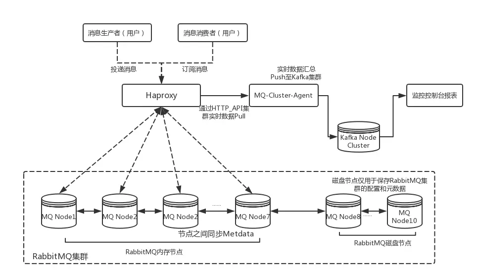

RabbitMQ小规模集群的架构设计图(附加了监控部分).png


这里给出了带有监控功能的RabbitMQ集群架构设计图，对于集群部署的原理和软负载等内容都在上一篇《消息中间件—RabbitMQ（集群原理与搭建篇)》中有详细的阐述，图中作者自设计了一个MQ-Cluster-Agent工程用于监听RabbitMQ集群的状态，其中主要通过调用HTTP API接口来查询获取集群元数据。随后，每隔一定周期将这些监控数据push至Kafka集群中。后台的监控控制台工程可以使用Kafka stream流处理方式对Kafka消息队列中的准实时数据进行一定的业务加工，随后生成业务方需要的监控报表。

#### 四、总结

本文主要详细介绍了为何需要对MQ消息中间件进行监控，以及监控RabbitMQ集群的三种主要方法，并最后给出了一种具备监控能力的RabbitMQ集群架构设计。限于篇幅原因，对于图中采用agent完成对集群进行准实时监控的设计方法以及使用Kafka完成流处理的方式将在后续的篇幅2中进行详细介绍。限于笔者的才疏学浅，对本文内容可能还有理解不到位的地方，如有阐述不合理之处还望留言一起探讨。

# MQ集群宕机

[【坑爹呀！】最终一致性分布式事务如何保障实际生产中99.99%高可用？](https://juejin.im/post/5bf2c6b6e51d456693549af4)

## 基于KV存储的队列支持的高可用降级方案

比如最近就有一个朋友的公司，也是做电商业务的，就遇到了MQ中间件在自己公司机器上部署的集群整体故障不可用，导致依赖MQ的分布式事务全部无法跑通，业务流程大量中断的情况。

这种情况，就需要针对这套分布式事务方案实现一套高可用保障机制。

大家来看看下面这张图，这是我曾经指导过朋友的一个公司针对可靠消息最终一致性方案设计的一套高可用保障降级机制。


这套机制不算太复杂，可以非常简单有效的保证那位朋友公司的高可用保障场景，一旦MQ中间件出现故障，立马自动降级为备用方案。

### **（1）自行封装MQ客户端组件与故障感知**

首先第一点，你要做到自动感知MQ的故障接着自动完成降级，那么必须动手对MQ客户端进行封装，发布到公司Nexus私服上去。

然后公司需要支持MQ降级的业务服务都使用这个自己封装的组件来发送消息到MQ，以及从MQ消费消息。

在你自己封装的MQ客户端组件里，你可以根据写入MQ的情况来判断MQ是否故障。

比如说，如果连续10次重试尝试投递消息到MQ都发现异常报错，网络无法联通等问题，说明MQ故障，此时就可以自动感知以及自动触发降级开关。

### **（2）基于kv存储中队列的降级方案**

如果MQ挂掉之后，要是希望继续投递消息，那么就必须得找一个MQ的替代品。

举个例子，比如我那位朋友的公司是没有高并发场景的，消息的量很少，只不过可用性要求高。此时就可以类似redis的kv存储中的队列来进行替代。

由于redis本身就支持队列的功能，还有类似队列的各种数据结构，所以你可以将消息写入kv存储格式的队列数据结构中去。

**ps**：关于redis的数据存储格式、支持的数据结构等基础知识，请大家自行查阅了，网上一大堆

但是，这里有几个大坑，一定要注意一下。

**第一个**，任何kv存储的集合类数据结构，建议不要往里面写入数据量过大，否则会导致大value的情况发生，引发严重的后果。

因此绝不能在redis里搞一个key，就拼命往这个数据结构中一直写入消息，这是肯定不行的。

**第二个**，绝对不能往少数key对应的数据结构中持续写入数据，那样会导致热key的产生，也就是某几个key特别热。

大家要知道，一般kv集群，都是根据key来hash分配到各个机器上的，你要是老写少数几个key，会导致kv集群中的某台机器访问过高，负载过大。

**基于以上考虑，下面是笔者当时设计的方案：**

- 根据他们每天的消息量，在kv存储中固定划分上百个队列，有上百个key对应。
- 这样保证每个key对应的数据结构中不会写入过多的消息，而且不会频繁的写少数几个key。
- 一旦发生了MQ故障，可靠消息服务可以对每个消息通过hash算法，均匀的写入固定好的上百个key对应的kv存储的队列中。

同时此时需要通过zk触发一个降级开关，整个系统在MQ这块的读和写全部立马降级。

### **（3）下游服务消费MQ的降级感知**

下游服务消费MQ也是通过自行封装的组件来做的，此时那个组件如果从zk感知到降级开关打开了，首先会判断自己是否还能继续从MQ消费到数据？

如果不能了，就开启多个线程，并发的从kv存储的各个预设好的上百个队列中不断的获取数据。

每次获取到一条数据，就交给下游服务的业务逻辑来执行。

通过这套机制，就实现了MQ故障时候的自动故障感知，以及自动降级。如果系统的负载和并发不是很高的话，用这套方案大致是没没问题的。

因为在生产落地的过程中，包括大量的容灾演练以及生产实际故障发生时的表现来看，都是可以有效的保证MQ故障时，业务流程继续自动运行的。

### **（4）故障的自动恢复**

如果降级开关打开之后，自行封装的组件需要开启一个线程，每隔一段时间尝试给MQ投递一个消息看看是否恢复了。

如果MQ已经恢复可以正常投递消息了，此时就可以通过zk关闭降级开关，然后可靠消息服务继续投递消息到MQ，下游服务在确认kv存储的各个队列中已经没有数据之后，就可以重新切换为从MQ消费消息。

### **（5）更多的业务细节**

其实上面说的那套方案主要是一套通用的降级方案，但是具体的落地是要结合各个公司不同的业务细节来决定的，很多细节多没法在文章里体现。

比如说你们要不要保证消息的顺序性？是不是涉及到需要根据业务动态，生成大量的key？等等。

此外，这套方案实现起来还是有一定的成本的，所以建议大家尽可能还是push公司的基础架构团队，保证MQ的99.99%可用性，不要宕机。

其次就是根据大家公司的实际对高可用需求来决定，如果感觉MQ偶尔宕机也没事，可以容忍的话，那么也不用实现这种降级方案。

但是如果公司领导认为MQ中间件宕机后，一定要保证业务系统流程继续运行，那么还是要考虑一些高可用的降级方案，比如本文提到的这种。

最后再说一句，真要是一些公司涉及到每秒几万几十万的高并发请求，那么对MQ的降级方案会设计的更加的复杂，那就远远不是这么简单可以做到的。

[【坑爹呀！】最终一致性分布式事务如何保障实际生产中99.99%高可用？](https://juejin.im/post/5bf2c6b6e51d456693549af4)

# 参考文章

[Kafka深度解析]([http://www.jasongj.com/2015/01/02/Kafka%E6%B7%B1%E5%BA%A6%E8%A7%A3%E6%9E%90/](http://www.jasongj.com/2015/01/02/Kafka深度解析/))

[[Message Delivery Reliability](http://doc.akka.io/docs/akka/2.4.3/general/message-delivery-reliability.html)]:

https://www.jianshu.com/p/6376936845ff  

[【坑爹呀！】最终一致性分布式事务如何保障实际生产中99.99%高可用？](https://juejin.im/post/5bf2c6b6e51d456693549af4)

[RabbitMQ之镜像队列](https://blog.csdn.net/u013256816/article/details/71097186)