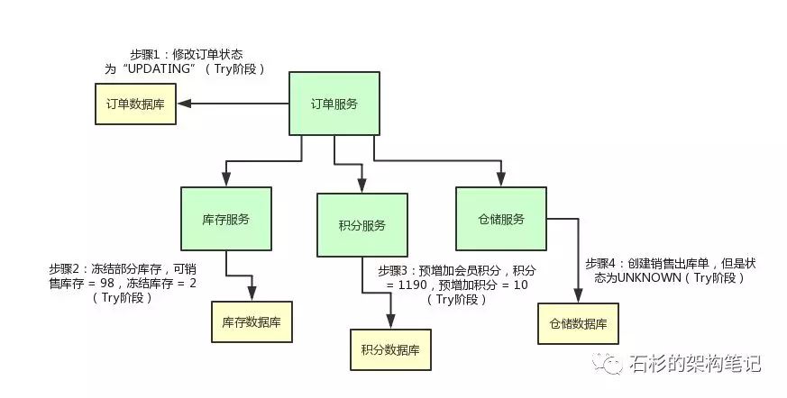
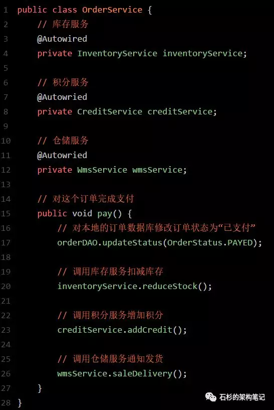
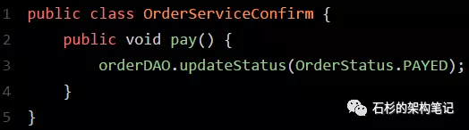
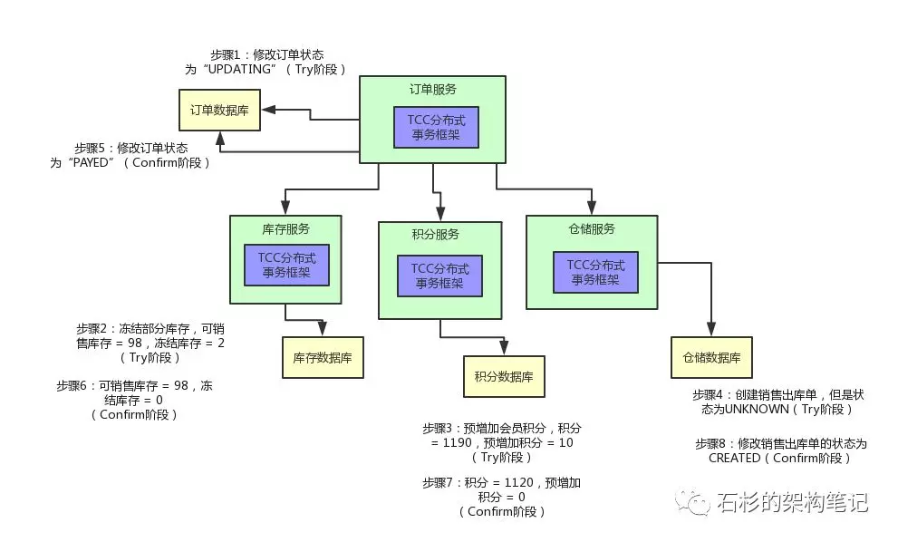
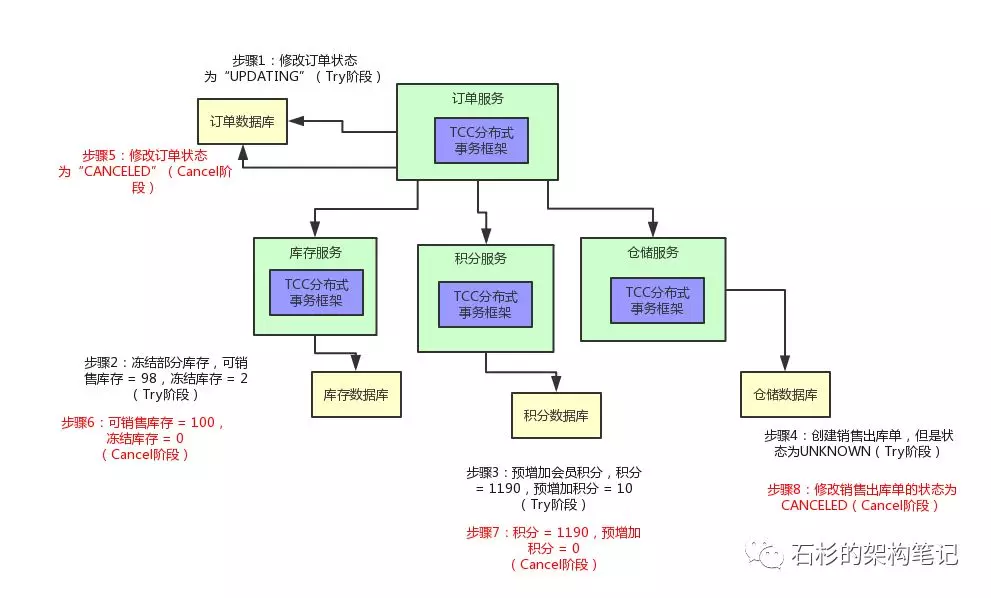
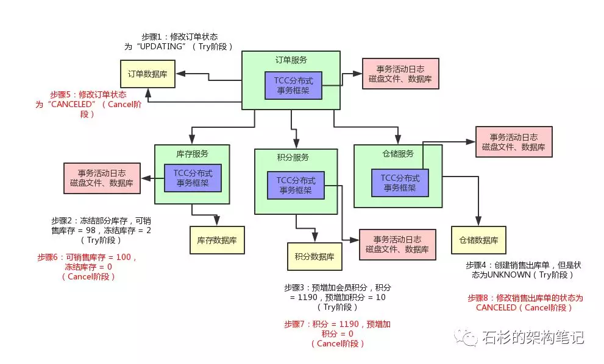

# 一、介绍

**事务补偿，着眼即时一致性，尽快达到**

TCC事务补偿是基于2PC实现的业务层事务控制方案，它是Try、Confirm和Cancel三个单词的首字母 。

1. Try 检查及预留业务资源
   完成提交事务前的检查，并预留好资源。

2. Confirm 确定执行业务操作
   对try阶段预留的资源正式执行。

3. Cancel 取消执行业务操作
   对try阶段预留的资源释放。  

**关键点**：

- 用户接入 TCC ，最重要的是考虑如何将自己的业务模型拆成两阶段 try和conform来实现。

- 通常是增添字段

**优点**：

- 最终保证数据的一致性，在业务层实现事务控制，灵活性好。
- 让应用自己定义数据库操作的粒度，使得降低锁冲突、提高吞吐量成为可能。

**缺点**：

- 对应用的侵入性强。开发成本高，每个事务操作每个参与者都需要实现try/confirm/cancel三个接口。
- 实现难度较大，需要按照网络状态、系统故障等不同的失败原因实现不同的 回滚策略。
- 注意：TCC的try/confirm/cancel接口都要实现幂等性，在为在try、confirm、cancel失败后要不断重试。

**幂等性是**指同一个操作无论请求多少次，其结果都相同。

幂等操作实现方式有：
1、操作之前在业务方法进行判断如果执行过了就不再执行。
2、缓存所有请求和处理的结果，已经处理的请求则直接返回结果。
3、在数据库表中加一个状态字段（未处理，已处理），数据操作时判断未处理时再处理  

# **二、业务场景介绍**

咱们先来看看业务场景，假设你现在有一个电商系统，里面有一个支付订单的场景。

那对一个订单支付之后，我们需要做下面的步骤：

- 更改订单的状态为“已支付”
- 扣减商品库存
- 给会员增加积分
- 创建销售出库单通知仓库发货

这是一系列比较真实的步骤，无论大家有没有做过电商系统，应该都能理解。

# **三、进一步思考**

好，业务场景有了，现在我们要更进一步，实现一个TCC分布式事务的效果。

什么意思呢？也就是说，订单服务-修改订单状态，库存服务-扣减库存，积分服务-增加积分，仓储服务-创建销售出库单。

上述这几个步骤，要么一起成功，要么一起失败，**必须是一个整体性的事务**。

举个例子，现在订单的状态都修改为“已支付”了，结果库存服务扣减库存失败。那个商品的库存原来是100件，现在卖掉了2件，本来该是98件了。

结果呢？由于库存服务操作数据库异常，导致库存数量还是100。这不是在坑人么，当然不能允许这种情况发生了！

但是如果你不用TCC分布式事务方案的话，就用个Spring Cloud开发这么一个微服务系统，很有可能会干出这种事儿来。

我们来看看下面的这个图，直观的表达了上述的过程。

所以说，我们有必要使用TCC分布式事务机制来保证各个服务形成一个整体性的事务。

上面那几个步骤，要么全部成功，如果任何一个服务的操作失败了，就全部一起回滚，撤销已经完成的操作。

比如说库存服务要是扣减库存失败了，那么订单服务就得撤销那个修改订单状态的操作，然后得停止执行增加积分和通知出库两个操作。

说了那么多，老规矩，给大家上一张图，大伙儿顺着图来直观的感受一下。

# **四、落地实现TCC分布式事务**

那么现在到底要如何来实现一个TCC分布式事务，使得各个服务，要么一起成功？要么一起失败呢？

大家稍安勿，我们这就来一步一步的分析一下。咱们就以一个Spring Cloud开发系统作为背景来解释。

## **1、TCC实现阶段一：Try**

首先，订单服务那儿，他的代码大致来说应该是这样子的：

如果你之前看过Spring Cloud架构原理那篇文章，同时对Spring Cloud有一定的了解的话，应该是可以理解上面那段代码的。

其实就是订单服务完成本地数据库操作之后，通过Spring Cloud的Feign来调用其他的各个服务罢了。

但是光是凭借这段代码，是不足以实现TCC分布式事务的啊？！兄弟们，别着急，我们对这个订单服务修改点儿代码好不好。

首先，上面那个订单服务先把自己的状态修改为：**OrderStatus.UPDATING**。

这是啥意思呢？也就是说，在pay()那个方法里，你别直接把订单状态修改为已支付啊！你先把订单状态修改为**UPDATING**，也就是修改中的意思。

这个状态是个没有任何含义的这么一个状态，代表有人正在修改这个状态罢了。

然后呢，库存服务直接提供的那个reduceStock()接口里，也别直接扣减库存啊，你可以是**冻结掉库存**。

举个例子，本来你的库存数量是100，你别直接100 - 2 = 98，扣减这个库存！

你可以把可销售的库存：100 - 2 = 98，设置为98没问题，然后在一个单独的冻结库存的字段里，设置一个2。也就是说，有2个库存是给冻结了。

积分服务的addCredit()接口也是同理，别直接给用户增加会员积分。你可以先在积分表里的一个**预增加积分字段**加入积分。

比如：用户积分原本是1190，现在要增加10个积分，别直接1190 + 10 = 1200个积分啊！

你可以保持积分为1190不变，在一个预增加字段里，比如说prepare_add_credit字段，设置一个10，表示有10个积分准备增加。

仓储服务的saleDelivery()接口也是同理啊，你可以先创建一个销售出库单，但是这个销售出库单的状态是“**UNKNOWN**”。

也就是说，刚刚创建这个销售出库单，此时还不确定他的状态是什么呢！

上面这套改造接口的过程，其实就是所谓的TCC分布式事务中的第一个T字母代表的阶段，也就是**Try阶段**。

**总结上述过程，如果你要实现一个TCC分布式事务，首先你的业务的主流程以及各个接口提供的业务含义，不是说直接完成那个业务操作，而是完成一个Try的操作。**

这个操作，一般都是锁定某个资源，设置一个预备类的状态，冻结部分数据，等等，大概都是这类操作。

咱们来一起看看下面这张图，结合上面的文字，再来捋一捋这整个过程。

## **2、TCC实现阶段二：Confirm**

然后就分成两种情况了，第一种情况是比较理想的，那就是各个服务执行自己的那个Try操作，都执行成功了，bingo！

这个时候，就需要依靠**TCC分布式事务框架**来推动后续的执行了。

这里简单提一句，如果你要玩儿TCC分布式事务，必须引入一款TCC分布式事务框架，比如国内开源的**ByteTCC、himly、tcc-transaction。**

否则的话，感知各个阶段的执行情况以及推进执行下一个阶段的这些事情，不太可能自己手写实现，太复杂了。

如果你在各个服务里引入了一个TCC分布式事务的框架，**订单服务里内嵌的那个TCC分布式事务框架可以感知到**，各个服务的Try操作都成功了。

此时，TCC分布式事务框架会控制进入TCC下一个阶段，第一个C阶段，也就是**Confirm阶段**。

为了实现这个阶段，你需要在各个服务里再加入一些代码。

比如说，**订单服务**里，你可以加入一个Confirm的逻辑，就是正式把订单的状态设置为“已支付”了，大概是类似下面这样子：

**库存服务**也是类似的，你可以有一个InventoryServiceConfirm类，里面提供一个reduceStock()接口的Confirm逻辑，这里就是将之前冻结库存字段的2个库存扣掉变为0。

这样的话，可销售库存之前就已经变为98了，现在冻结的2个库存也没了，那就正式完成了库存的扣减。

**积分服务**也是类似的，可以在积分服务里提供一个CreditServiceConfirm类，里面有一个addCredit()接口的Confirm逻辑，就是将预增加字段的10个积分扣掉，然后加入实际的会员积分字段中，从1190变为1120。

**仓储服务**也是类似，可以在仓储服务中提供一个WmsServiceConfirm类，提供一个saleDelivery()接口的Confirm逻辑，将销售出库单的状态正式修改为“已创建”，可以供仓储管理人员查看和使用，而不是停留在之前的中间状态“UNKNOWN”了。

好了，上面各种服务的Confirm的逻辑都实现好了，一旦订单服务里面的TCC分布式事务框架感知到各个服务的Try阶段都成功了以后，就会执行各个服务的Confirm逻辑。

订单服务内的TCC事务框架会负责跟其他各个服务内的TCC事务框架进行通信，依次调用各个服务的Confirm逻辑。然后，正式完成各个服务的所有业务逻辑的执行。

同样，给大家来一张图，顺着图一起来看看整个过程。

*

## **3、TCC实现阶段三：Cancel**

好，这是比较正常的一种情况，那如果是异常的一种情况呢？

举个例子：在Try阶段，比如积分服务吧，他执行出错了，此时会怎么样？

那订单服务内的TCC事务框架是可以感知到的，然后他会决定对整个TCC分布式事务进行回滚。

也就是说，会执行各个服务的**第二个C阶段，Cancel阶段**。

同样，为了实现这个Cancel阶段，各个服务还得加一些代码。

首先**订单服务**，他得提供一个OrderServiceCancel的类，在里面有一个pay()接口的Cancel逻辑，就是可以将订单的状态设置为“CANCELED”，也就是这个订单的状态是已取消。

**库存服务**也是同理，可以提供reduceStock()的Cancel逻辑，就是将冻结库存扣减掉2，加回到可销售库存里去，98 + 2 = 100。

**积分服务**也需要提供addCredit()接口的Cancel逻辑，将预增加积分字段的10个积分扣减掉。

**仓储服务**也需要提供一个saleDelivery()接口的Cancel逻辑，将销售出库单的状态修改为“CANCELED”设置为已取消。

然后这个时候，订单服务的TCC分布式事务框架只要感知到了任何一个服务的Try逻辑失败了，就会跟各个服务内的TCC分布式事务框架进行通信，然后调用各个服务的Cancel逻辑。

大家看看下面的图，直观的感受一下。

# **五、总结与思考**

好了，兄弟们，聊到这儿，基本上大家应该都知道TCC分布式事务具体是怎么回事了！

总结一下，你要玩儿TCC分布式事务的话：

**首先需要选择某种TCC分布式事务框架**，各个服务里就会有这个TCC分布式事务框架在运行。

**然后你原本的一个接口，要改造为3个逻辑，Try-Confirm-Cancel**。

- 先是服务调用链路依次执行Try逻辑

- 如果都正常的话，TCC分布式事务框架推进执行Confirm逻辑，完成整个事务

- 如果某个服务的Try逻辑有问题，TCC分布式事务框架感知到之后就会推进执行各个服务的Cancel逻辑，撤销之前执行的各种操作

这就是所谓的**TCC分布式事务。**

TCC分布式事务的核心思想，说白了，就是当遇到下面这些情况时，

- 某个服务的数据库宕机了

- 某个服务自己挂了

- 那个服务的redis、elasticsearch、MQ等基础设施故障了

- 某些资源不足了，比如说库存不够这些

先来Try一下，不要把业务逻辑完成，先试试看，看各个服务能不能基本正常运转，能不能先冻结我需要的资源。

如果Try都ok，也就是说，底层的数据库、redis、elasticsearch、MQ都是可以写入数据的，并且你保留好了需要使用的一些资源（比如冻结了一部分库存）。

接着，再执行各个服务的Confirm逻辑，基本上Confirm就可以很大概率保证一个分布式事务的完成了。

那如果Try阶段某个服务就失败了，比如说底层的数据库挂了，或者redis挂了，等等。

此时就自动执行各个服务的Cancel逻辑，把之前的Try逻辑都回滚，所有服务都不要执行任何设计的业务逻辑。**保证大家要么一起成功，要么一起失败**。

写到这里，本文差不多该结束了。等一等，你有没有想到一个问题？

如果有一些意外的情况发生了，比如说订单服务突然挂了，然后再次重启，TCC分布式事务框架是**如何保证之前没执行完的分布式事务继续执行的呢？**

所以，TCC事务框架都是要记录一些分布式事务的活动日志的，可以在磁盘上的日志文件里记录，也可以在数据库里记录。保存下来分布式事务运行的各个阶段和状态。

问题还没完，万一某个服务的Cancel或者Confirm逻辑执行一直失败怎么办呢？

那也很简单，TCC事务框架会通过活动日志记录各个服务的状态。

举个例子，比如发现某个服务的Cancel或者Confirm一直没成功，会不停的重试调用他的Cancel或者Confirm逻辑，务必要他成功！

当然了，如果你的代码没有写什么bug，有充足的测试，而且Try阶段都基本尝试了一下，那么其实一般Confirm、Cancel都是可以成功的！

最后，再给大家来一张图，来看看给我们的业务，加上分布式事务之后的整个执行流程：

不少大公司里，其实都是自己研发TCC分布式事务框架的，专门在公司内部使用，比如我们就是这样。

不过如果自己公司没有研发TCC分布式事务框架的话，那一般就会选用开源的框架。

这里笔者给大家推荐几个比较不错的框架，都是咱们国内自己开源出去的：**ByteTCC，tcc-transaction，himly**。

大家有兴趣的可以去他们的github地址，学习一下如何使用，以及如何跟Spring Cloud、Dubbo等服务框架整合使用。

只要把那些框架整合到你的系统里，很容易就可以实现上面那种奇妙的TCC分布式事务的效果了。

下一篇文章，我们来讲讲可靠消息最终一致性方案实现的分布式事务，同时聊聊在实际生产中运用该方案的高可用保障架构。

具体参见：**《最终一致性分布式事务的99.99%高可用保障生产实践》**。

# 我的总结

1. 业务两阶段执行

2. 真正的业务逻辑confirm层，负责修改重要的字段。try层只是检查，修改不重要的辅助字段。因此confirm更重要，放在后面。try阶段主要是确认其他服务器的状态是ok的，尽可能保证接下来的分布式事务能够成功。try先试探才能保证confirm成功的可能性高。

3. 事务时间是尽量短的，如果try阶段开启的事务confirm阶段才提交就会拉长事务，所以每个阶段都是各自的事务。

4. 执行失败就需要重试，重试需要实现幂等性，因此需要记录处理的结果、状态，幂等性手段自选，因此也就能够实现回滚。允许空回滚。

5. **防悬挂控制**：

   悬挂的意思是：Cancel 比 Try 接口先执行，出现的原因是 Try 由于网络拥堵而超时，事务管理器生成回滚，触发 Cancel 接口，而最终又收到了 Try 接口调用，但是 Cancel 比 Try 先到。按照前面允许空回滚的逻辑，回滚会返回成功，事务管理器认为事务已回滚成功，则此时的 Try 接口不应该执行，否则会产生数据不一致，所以我们在 Cancel 空回滚返回成功之前先记录该条事务 xid 或业务主键，标识这条记录已经回滚过，Try 接口先检查这条事务xid或业务主键如果已经标记为回滚成功过，则不执行 Try 的业务操作。

6. 鉴于一般每个关键步骤都是集群部署，所以重试可能在另一台服务器上，集群上要确保幂等性就需要乐观锁或者分布式锁之类的手段。可以用事务 xid 或业务主键判重来控制。

7. 前面3、4点涵盖了其他服务器宕机的情况和处理手段，如果是自己出了问题，那就只有日志能救自己了。

# 现成框架

国内开源：**ByteTCC，tcc-transaction，himly**

# 参考文章

[拜托，面试请不要再问我TCC分布式事务的实现原理！【石杉的架构笔记】](https://mp.weixin.qq.com/s/mIW1_K5fAoa2OlSLdXSHpQ)